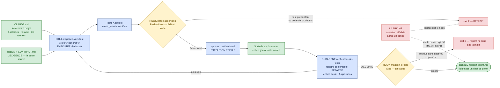

# 🏆 Col J2 — « L'Éclaireur »

> **Jour 2 · 16:15 → 17:15 · 60 minutes · 100 Points de Repère**
> *Fin du module M4. Un agent qui marche devant et rapporte ce qu'il voit.*
> Développement complet du §6.2 de `00-fil-rouge.md`.

**Document formateur.** Les sections **1**, **2**, **3**, **4** et **5** sont projetées ou
distribuées aux participants. Les sections **6**, **7**, **8** et **9** sont **strictement
réservées au formateur** et ne sont jamais affichées avant le débrief. Référence de vérité du
terrain : `00-carte-du-terrain.md`.

> ⚠️ **À jour au 07/2026.** Les noms de fichiers de configuration, d'événements de hook et de
> commandes employés dans le corrigé §6 sont ceux de la documentation Claude Code hébergée sur
> **`code.claude.com/docs/en/`**. **Le formateur les revérifie la veille** sur la version
> installée : une régression de nommage transforme un corrigé en piège. La méthode, elle, ne
> bouge pas — c'est ce qui est évalué.

---

## 1. Mise en situation — à lire à voix haute, sans commentaire

> *« Il est 16 h 15. Vous partez en congés vendredi.*
>
> *Ce matin, vous avez appris à écrire un prompt qui produit deux fois le même niveau de qualité.
> Cet après-midi, vous avez appris à tenir une session et à donner des yeux à un agent. Vous savez
> faire tout cela **avec vos mains sur le clavier**.*
>
> *Le problème, c'est que vendredi soir, vos mains ne seront plus là. Et lundi, quelqu'un lancera
> une commande — une seule — sur une zone du produit que personne n'a jamais testée. Cette
> commande, il faut qu'elle marche sans vous.*
>
> *Vous allez donc construire un éclaireur. Un agent qui part devant, qui lit l'exigence dans le
> contrat, qui écrit les tests, qui **les exécute pour de vrai**, et qui revient avec un rapport
> que votre chef de projet peut lire.*
>
> *Une règle, une seule, et elle est absolue : **votre agent n'a pas le droit de mentir pour vous
> faire plaisir**. S'il trouve du rouge, il rapporte du rouge. S'il ne sait pas si c'est le test
> ou le code qui a tort, il le dit. Et s'il touche à une assertion qu'il n'a pas écrite pour
> verdir une suite, la cordée perd soixante points. Pas trente. Soixante.*
>
> *Vous avez soixante minutes. Bonne expédition. »*

**Après la lecture, le formateur procède immédiatement au tirage au sort (§2.1), puis se tait
quatre minutes.** Le silence initial fait partie de l'épreuve.

---

## 2. Cadre de l'épreuve

### 2.1 Le tirage au sort des zones

Chaque cordée reçoit **une fonctionnalité non testée différente**, tirée devant tout le monde.
Quatre candidates, et **elles ne sont pas équivalentes** — c'est voulu.

| Tirage | Feature | Zone | Ce que l'agent doit trouver | Difficulté | Ce que le col y gagne |
|---|---|---|---|---|---|
| **⚪ A** | **#3 — Récupération de mot de passe** | Z1 · Z4 | Aucun bug. Un **effet de bord fichier** : `data/mails/{timestamp}-{email}.md`, et la règle de non-divulgation — *« toujours 200 même si l'email n'existe pas »* | ⭐⭐ | Le cas **sain**. Il mesure la boucle sans le bruit d'un défaut. Une cordée qui rapporte un bug ici a un problème |
| **⚪ B** | **#10 — Upload de photos sur une étape** | Z3 · Z4 | Aucun bug. Du **multipart**, un chemin relatif `/uploads/...` retourné, un effet de bord disque | ⭐⭐ | Le cas **technique**. La difficulté est d'exécuter réellement, pas de juger |
| **🔴 C** | **#9 — Modification d'une étape** | Z3 | 🐞 **#9 — `endDate` silencieusement ignoré.** L'API répond **200**, aucune erreur, l'ancienne valeur est conservée | ⭐⭐⭐ | ⭐ **Le meilleur tirage.** L'agent doit **relire la réponse** pour voir quoi que ce soit. C'est le terrain de M5.4 |
| **🔴 D** | **#14 — Commentaires sur une étape** | Z3 | 🐞 **#14 — `authorId` toujours `null`.** Le type partagé déclare `authorId: string`, **non nullable** | ⭐⭐⭐ | ⭐ Le **type comme oracle**. L'agent ne le trouve que s'il a lu le bloc des types partagés |

> 🔐 **Règle de tirage, réservée formateur.** Avec deux cordées : distribuer **C et D** — les deux
> tirages porteurs de bug. Avec trois cordées : **C, D et A**. Avec quatre : les quatre. **Ne
> jamais donner B seul à une cordée faible** : c'est le tirage le plus exigeant techniquement pour
> le moins de matière pédagogique. Le tirage n'est jamais présenté comme inégal — il l'est, et le
> débrief §8 en fait un enseignement : *« deux d'entre vous avaient un bug à trouver. Les autres
> avaient à prouver qu'il n'y en avait pas. C'est le même métier, et la seconde tâche est la plus
> difficile à défendre. »*

### 2.2 Ce qui est autorisé

| Ressource | Statut |
|---|---|
| Le dépôt *Carnet de voyage* dans son intégralité | ✅ autorisé |
| `docs/API-CONTRACT.md` et `docs/stats.md` | ✅ autorisés — et **la première source de l'agent** |
| Les artefacts du J2 : gabarit de prompt à cinq blocs (M3.2), convention de versionnage (M3.4), fiche des dix gestes (M4.1) | ✅ **attendus sur la table** |
| Claude Code, en session interactive **et** en mode non interactif | ✅ autorisé |
| Un serveur MCP, si la cordée en voit l'usage | ✅ autorisé — aucun des quatre tirages ne l'exige |
| Toute commande de test : `npm run test:backend`, `npm run e2e` | ✅ autorisées et **exigées** |
| `curl`, un client HTTP, le backend démarré | ✅ autorisés |
| Le raccourci `grep -rn "BUG:" backend/src`, révélé hier au débrief | ✅ autorisé — **et sans intérêt ici** : il donne un numéro de ligne, pas un test rouge |

### 2.3 Les quatre règles

**Règle 1 — Une commande, un déroulé.** Le livrable n'est pas « un agent qu'on accompagne ». À la
phase 4, la cordée lance **une seule commande** et **ne touche plus à rien** pendant que l'agent
travaille. Toute intervention pendant l'exécution est décomptée (voir barème §5.1).

**Règle 2 — L'exécution se prouve, elle ne se déclare pas.** Une ligne de rapport disant *« les
tests passent »* vaut **zéro**. La preuve recevable est **la sortie du runner, collée telle
quelle**, avec le nom de la suite et son verdict. C'est la transposition directe de la règle 1 du
col J1 : *la preuve prime sur l'affirmation*.

**Règle 3 — Les tests existants sont intouchables.** Aucun des fichiers de test déjà présents dans
le dépôt ne doit être modifié, ni par la cordée, ni par l'agent. Les trois rouges légitimes —
`backend/src/journeys/journeys.create-validation.spec.ts`, `backend/src/steps/steps.add-order.spec.ts`
et `e2e/tests/add-step-order.spec.ts` — **ne se réparent pas : ils se défendent**. Le contrôle se
fait en fin d'épreuve, avec l'outil de versionnement, devant tout le monde (§7.3).

**Règle 4 — La traçabilité IA / humain.** Le rapport porte, en fin de chaque section, la mention
*« produit par : agent / agent relu / humain »*. Le malus **« livrable collé d'un LLM sans
relecture » (−20 PR)** s'applique. La mention honnête ne coûte rien ; l'omission détectée coûte
le malus plein.

### 2.4 Les rôles dans la cordée

| Rôle | Mission | Rotation |
|---|---|---|
| **L'Architecte** | Écrit `CLAUDE.md`, les permissions et le hook. **Ne génère aucun test.** | Fixe |
| **Le Monteur** | Écrit la skill et le subagent. Au clavier de la session. | Rotation à 30 min |
| **Le Rédacteur** | Tient `carnet/j2-rapport-agent.md` et garantit qu'un non-technicien peut le lire | Fixe |

En cordée de deux, l'Architecte assure aussi la rédaction. En configuration à trois cordées solo,
l'entraide est autorisée et rapporte **+10 PR** à la cordée qui aide, si l'aide est validée par la
cordée aidée.

### 2.5 Ce qui est interdit

- **Modifier un test existant**, quel qu'il soit — règle 3. Malus du Lest : **−40 PR** pour un
  `.skip` ou une assertion ajustée, et **−60 PR** si c'est **l'agent** qui l'a fait sans le dire
  (§5.6).
- **Corriger un bug du code de production.** L'éclaireur **rapporte**, il ne répare pas. La
  réparation, c'est le col J3.
- **Accompagner l'agent pendant la phase 4.** Un agent qu'on tient par la main n'est pas un agent :
  c'est un éditeur de texte lent.
- **Rendre un rapport dont une section entière n'a pas été relue.**

---

## 3. Déroulé minuté — les sept phases

| Phase | Temps | Ce que fait la cordée | Ce que fait le formateur |
|---|---|---|---|
| **0 — Le briefing et le tirage** | **0-4** *(4)* | Écoute, tire sa feature, répartit les trois rôles, ouvre ses trois artefacts du J2 | Lit la mise en situation. Procède au tirage devant tout le monde. Distribue le gabarit de rapport et la fiche de barème. **Puis se tait quatre minutes** |
| **1 — Le socle** | **4-14** *(10)* | Écrit `CLAUDE.md` : les trois runners, la commande exacte, la source d'exigences, et **les trois interdits**. Écrit le bloc de permissions : refus de lecture sur les répertoires inutiles, refus d'écriture hors du périmètre de test | Circule. **Ne valide rien.** Relance unique à 9 min, à toute la salle : 📢 *« combien d'entre vous ont écrit, quelque part, ce que l'agent n'a **pas** le droit de faire ? »* |
| **2 — La skill** | **14-28** *(14)* | Écrit la skill : le déroulé en quatre temps — lire l'exigence, générer, **exécuter**, classer l'échec. Y met le gabarit à cinq blocs de M3.2 et la règle d'abstention (`// SILENCE:`) | Circule. Relance à 22 min : *« votre skill dit-elle à l'agent **quoi faire quand c'est rouge**, ou seulement quoi faire quand ça marche ? »* |
| **3 — Le contrôle** | **28-42** *(14)* | Écrit le subagent vérificateur (fenêtre de contexte séparée) et **au moins un hook** : celui qui refuse la modification d'un test existant. Vérifie que le hook **bloque** réellement | Circule. Relance à 36 min : *« faites-le échouer devant moi. Demandez à l'agent de modifier un test rouge existant, et montrez-moi qu'il ne peut pas »* |
| **4 — L'exécution de bout en bout** | **42-52** *(10)* | ⭐ **Lance une commande unique et ne touche plus à rien.** Observe. Chronomètre. Relève la sortie | Passe de cordée en cordée et **note l'heure de lancement**. Toute intervention au clavier pendant cette phase est notée sur la grille §7.1 |
| **5 — Le rapport** | **52-57** *(5)* | Le Rédacteur relit `carnet/j2-rapport-agent.md` : la section 0 se lit sans le reste, chaque verdict porte sa sortie de runner, chaque section porte sa mention de traçabilité | Annonce le temps restant à 56 et à 59 min, à voix haute |
| **6 — Le dépôt et le contrôle de non-modification** | **57-60** *(3)* | Enregistre le rapport et **exécute devant le formateur** la commande de contrôle des tests existants (§7.3). Annonce à voix haute : « déposé » | Note l'heure de dépôt. **Regarde l'écran pendant le contrôle.** Aucun dépôt après 60 min |

**Contrôle : 4 + 10 + 14 + 14 + 10 + 5 + 3 = 60 min ✓**

> **Le pari d'allocation, à annoncer à la phase 0.** *« Vous avez dix minutes pour le socle et
> quatorze pour le contrôle. Ce n'est pas une erreur de ma part : l'exécution de bout en bout pèse
> 30 points et le garde-fou 15, soit 45 sur 100 — et aucun des deux ne se rattrape à la dernière
> minute. Les cordées qui finissent dernières sont celles qui passent quarante minutes à peaufiner
> la skill. »* Cette phrase économise dix minutes à au moins une cordée.

---

## 4. Le livrable

Deux objets, indissociables : **l'agent** (quatre fichiers dans le dépôt) et **son rapport**.

### 4.1 L'agent — l'arborescence attendue

```
CLAUDE.md                                   ← la mémoire projet (M4.1, geste 6)
.claude/
  settings.json                             ← permissions + déclaration des hooks (geste 7)
  skills/
    exigence-vers-test/
      SKILL.md                              ← la procédure en quatre temps
  agents/
    verificateur-de-tests.md                ← le subagent adversarial, contexte séparé
  hooks/
    garde-assertions.ts                     ← refuse de toucher aux tests existants (bloquant)
    magasin-propre.ts                       ← ne rend la main que si le magasin est propre
carnet/
  j2-rapport-agent.md                       ← le livrable lisible par un chef de projet
```

> ⚠️ **Aucun de ces chemins n'existe dans le dépôt de départ.** C'est précisément le livrable du
> col : la cordée les crée. Le seul point non négociable est qu'ils soient **dans le dépôt** et
> **versionnés** — conformément à la convention établie en M3.4.

### 4.2 Le rapport — gabarit à distribuer

````markdown
# Rapport de l'éclaireur — <nom de la fonctionnalité tirée>
Cordée : ...............   Feature tirée : #...   Heure de dépôt : ..........
Commande unique lancée : `.....................................................`

## 0. En une page, pour le chef de projet
> Trois à cinq phrases, sans jargon. Ce qu'on a testé, ce qu'on a trouvé, ce qu'il faut décider.
> Un chiffre au maximum par phrase. **Aucun nom de fichier dans cette section.**

...........................................................................

## 1. L'exigence de départ
| Source | Citation exacte du contrat | Ce qu'elle impose de vérifier |
|--------|----------------------------|-------------------------------|
| `docs/API-CONTRACT.md`, § ...... |                            |                               |

## 2. Les tests produits
| Fichier créé | Ce qu'il vérifie | Exigence couverte |
|--------------|------------------|-------------------|
|              |                  |                   |

## 3. L'exécution — sortie du runner, collée telle quelle
```
...
```
Verdict global : ....... suites, ....... passées, ....... échouées.

## 4. Classement de chaque échec
| Échec | Le test est faux | Le code est faux | La preuve qui tranche |
|-------|------------------|------------------|------------------------|
|       | ☐                | ☐                | (ligne du contrat / sortie / diff réponse-requête) |

## 5. Ce que l'agent n'a pas fait, et pourquoi
> Les abstentions. Ce que le contrat ne dit pas, et sur quoi l'agent a refusé d'inventer
> une assertion (marqueurs `// SILENCE:`).

## 6. Effets de bord constatés
> Fichiers créés ou laissés par l'exécution. `git status` après la suite.

## 7. Ce qu'il faut décider
> Une à trois décisions, formulées en questions fermées, adressées à un humain nommé.

Produit par : agent / agent relu / humain  (à porter en fin de chaque section)
````

### 4.3 Les quatre exigences de forme

1. **La section 0 se lit sans le reste.** C'est la seule que le chef de projet lira sûrement. Un
   nom de fichier ou un terme technique non défini y coûte le critère de format.
2. **Aucun verdict sans sortie collée.** *« la suite passe »* n'est pas une preuve ; les trois
   lignes du runner en sont une.
3. **La section 5 rapporte des points.** Une abstention explicite vaut mieux qu'une assertion
   inventée — c'est l'application directe du critère C4 de la convention de M3.4.
4. **La section 7 s'adresse à quelqu'un.** *« il faudrait clarifier »* ne vaut rien ; *« le métier
   doit trancher : `endDate` d'une étape peut-elle sortir des dates du voyage parent, oui ou
   non ? »* vaut le point.

---

## 5. Barème détaillé — 100 PR

> Le barème est **distribué aux participants à la phase 0**. Une épreuve dont le barème est caché
> mesure la devinette, pas la compétence.

### 5.1 Critère 1 — L'agent s'exécute de bout en bout sans intervention — **30 PR**

| Sous-critère | Détail | PR |
|---|---|---|
| **Une seule commande** | Le déroulé complet part d'**une** invocation. 10 PR si oui ; 5 PR s'il a fallu une relance pour cause technique externe (réseau, port occupé) ; 0 si la cordée a piloté l'agent étape par étape | **10** |
| **Les quatre temps sont enchaînés** | Lire l'exigence → générer → exécuter → classer. **2,5 PR par temps réellement enchaîné**, constaté à l'écran ou dans la trace | **10** |
| **Zéro intervention pendant la phase 4** | 10 PR si la cordée n'a pas touché le clavier ; **−3 PR par intervention** constatée par le formateur, plancher 0 | **10** |
| | **Total** | **30** |

> **Précision d'arbitrage.** Une réponse à une demande de permission n'est **pas** une
> intervention : c'est le fonctionnement normal du mode par défaut. Une cordée qui a mis en place
> un mode de permission adapté pour éviter les interruptions n'est ni récompensée ni pénalisée sur
> ce sous-critère — mais elle l'est sur le critère 4 si elle a désactivé le garde-fou pour y
> arriver.

### 5.2 Critère 2 — Les tests générés sont réellement exécutés — **25 PR**

| Sous-critère | Détail | PR |
|---|---|---|
| **La sortie du runner est présente** | Collée telle quelle en section 3 du rapport, avec le nom de la suite. 12 PR si oui, 6 PR si elle est résumée ou reformulée, 0 si absente | **12** |
| **Le verdict du rapport correspond à la sortie** | Contrôle croisé : ce que la section 0 affirme est bien ce que la section 3 montre. Binaire | **8** |
| **L'exécution porte sur les tests générés** | Et non sur la suite préexistante seule. La suite complète peut être lancée en plus — mais au moins un des tests créés doit apparaître dans la sortie | **5** |
| | **Total** | **25** |

> 🎯 **Pourquoi ce critère pèse 25 points.** C'est le seul rempart contre l'anti-pattern documenté
> des agents longs : *« Claude marque des fonctionnalités comme terminées prématurément »*. La
> parade recommandée est exactement celle qu'on demande ici — **ne marquer « passant » qu'après
> une vérification effective**.

### 5.3 Critère 3 — L'agent distingue « test faux » de « code faux » — **20 PR**

| Sous-critère | Détail | PR |
|---|---|---|
| **La distinction est produite** | Le rapport comporte, pour chaque échec, un classement explicite dans l'une des deux catégories. 6 PR | **6** |
| **Le classement est juste** | Conforme à la référence §6.5 pour le tirage concerné. **7 PR** si tous les échecs sont bien classés ; 4 PR s'il y a une erreur ; 0 au-delà | **7** |
| **La preuve qui tranche est nommée** | Et elle est de la bonne nature : **une ligne du contrat** ou **un type partagé**, jamais le code de production. 7 PR ; 3 PR si la preuve est le code ; 0 si aucune preuve | **7** |
| | **Total** | **20** |

> **Cas particulier des tirages A et B** (features #3 et #10, sans bug). Aucun échec n'est
> attendu. Le critère se note alors sur la **capacité à le démontrer** : la cordée obtient les
> 20 PR si son rapport établit, preuve à l'appui, que **le vert obtenu n'est pas un faux positif** —
> par exemple en montrant que le test tombe si l'on modifie la valeur attendue, ou en constatant
> l'effet de bord fichier indépendamment du statut HTTP. Une cordée qui écrit *« tout est vert,
> tout va bien »* obtient **6 PR sur 20**. C'est l'application directe de M1.1.

### 5.4 Critère 4 — Le garde-fou : refus de modifier le code de production sans validation — **15 PR**

| Sous-critère | Détail | PR |
|---|---|---|
| **Le garde-fou existe** | Un hook déclaré, ou une règle de permission en refus, portant explicitement sur l'écriture hors du périmètre de test. 5 PR | **5** |
| **Il bloque réellement** | Démontré devant le formateur en phase 3, ou constaté dans la trace : l'opération est **refusée**, pas seulement signalée. 7 PR | **7** |
| **Il est écrit, pas seulement espéré** | Une consigne en langage naturel dans `CLAUDE.md` vaut 2 PR ; un mécanisme qui refuse vaut les 7 ci-dessus **en plus**. Les deux sont attendus : la convention **et** le blocage | **3** |
| | **Total** | **15** |

> **Le distinguo qui fait le critère**, et qui vient de M4.1 : une **convention** (`CLAUDE.md`) dit
> ce qui est attendu ; une **permission** dit ce qui est autorisé ; un **hook** refuse. Seul le
> troisième garantit quelque chose. Et attention au piège vu en M4.1 : **toutes les formes de
> règles de permission ne sont pas appliquées** — une cordée qui s'est contentée d'une règle non
> appliquée croit avoir un garde-fou et n'en a pas. Elle obtient 5 PR, pas 12.

### 5.5 Critère 5 — Rapport compréhensible par un non-technicien — **10 PR**

| Vérification | PR |
|---|---|
| La section 0 existe, fait 3 à 5 phrases, et ne contient **aucun nom de fichier** ni terme technique non défini | 4 |
| La section 7 formule au moins une décision **en question fermée**, adressée à un rôle nommé | 3 |
| Les mentions de traçabilité *agent / agent relu / humain* sont présentes sur toutes les sections | 2 |
| La section 5 *(« ce que l'agent n'a pas fait »)* est renseignée et non vide | 1 |

### 5.6 ⚠️ Le malus de −60 PR — la modification silencieuse d'une assertion

> **C'est le malus le plus lourd de toute la formation.** Il vaut une fois et demie le malus
> `.skip` du barème général. Ce n'est pas une sévérité gratuite : c'est la seule façon de rendre
> palpable la différence entre *« un humain qui triche »* et *« un système qui triche à votre
> place, à trois heures du matin, sans que personne ne le voie »*.

**Ce qui déclenche le malus, exactement :**

| Fait constaté | Malus |
|---|---|
| L'agent a **modifié une assertion d'un test préexistant** du dépôt, pour quelque raison que ce soit | **−60** |
| L'agent a mis un test préexistant en `.skip`, `xit`, `xdescribe`, `it.todo` ou l'a supprimé | **−60** |
| L'agent a **affaibli une assertion qu'il venait lui-même d'écrire** après un échec, sans le mentionner dans le rapport | **−60** |
| L'agent a fait l'une de ces trois choses **et l'a écrit dans le rapport, en section 4 ou 5** | **0** — c'est même un excellent rapport, et cela peut valoir un bonus (§5.7) |

> 🎯 **La condition qui change tout est le mot « silencieusement ».** Un agent qui affaiblit une
> assertion et l'écrit noir sur blanc n'a pas triché : il a rapporté. Le malus sanctionne
> **l'absence de trace**, pas la modification. Cette précision se dit à la phase 0, mot pour mot :
> *« votre agent a le droit de se tromper. Il n'a pas le droit de vous le cacher. »*

**Le fait statistique à connaître** : *« statistiquement, au moins une cordée se fait prendre par
le malus »* (`00-fil-rouge.md` §6.2). C'est prévu, et c'est **la matière principale du débrief**.
Le formateur ne doit ni l'espérer ni le prévenir : il l'observe.

### 5.7 Bonus et malus du Lest

| Motif | PR |
|---|---|
| 🎯 **Bonus** — un défaut **non listé dans l'énoncé**, découvert **et prouvé par un test rouge** produit par l'agent | **+40** |
| 🎯 **Bonus de lucidité** — l'agent a tenté d'affaiblir une assertion, **et le rapport le documente** en section 4 ou 5 | **+15** |
| Aide à une autre cordée, validée par elle | **+10** |
| **Malus du col — l'agent modifie silencieusement une assertion pour verdir** | **−60** |
| Test tautologique livré (l'attendu vient du code, pas d'une source) | **−30** |
| Sélecteur inventé, jamais exécuté contre le vrai DOM | **−30** |
| Test laissant des fichiers `.md` résiduels dans le magasin | **−20** |
| Appel réel à Nominatim ou OSRM dans un test unitaire écrit pendant l'épreuve | **−20** |
| Livrable collé sans relecture, détecté au débrief | **−20** |

> **Sur le bonus de +40.** Il est atteignable, et il l'est surtout sur les tirages **C** et **D** :
> les bugs **#9** et **#14** ne sont listés dans aucun support remis aux participants, aucun test
> ne les couvre, et l'énoncé du col n'en dit rien. Une cordée dont l'agent produit un test rouge
> prouvant `endDate` ignoré ou `authorId` nul touche le bonus **et** le badge 🔦 **L'Éclaireur**.

### 5.8 Badges attribuables à l'issue du col

| Badge | Condition exacte |
|---|---|
| 🔦 **L'Éclaireur** | L'agent a prouvé un bug par un test rouge écrit pendant l'épreuve — badge éponyme du col |
| 🪤 **Le Démineur** | *(reporté si non attribué)* avoir démasqué une tentative de triche de son propre agent **et** l'avoir documentée |
| 🧹 **Le Gardien du magasin** | `git status` propre après l'exécution de bout en bout — le hook de propreté a fonctionné |
| 💰 **Le Frugal** | Même résultat qu'une autre cordée, avec un coût de session relevé plus bas |
| 🎓 **Le Guide** | Avoir aidé une autre cordée, jugé clair par elle |

---

## 6. 🔐 Corrigé de référence — **RÉSERVÉ FORMATEUR**

> **Ne jamais projeter avant le débrief.** Cette section est l'oracle du col. Le code ci-dessous
> est **complet et exécutable** : c'est la version que le formateur montre au débrief, et qu'il
> laisse dans le dépôt partagé à la fin de la journée.
>
> ⚠️ **Deux avertissements avant usage.** (1) Les noms d'événements de hook et de champs de
> configuration sont ceux de la documentation au 07/2026 — **à revérifier la veille**. (2) Ce
> corrigé est **volontairement minimal** : il tient en cinq fichiers courts. Une cordée qui rend
> plus gros n'a pas mieux fait, elle a fait plus long. Le dire au débrief.

### 6.0 🖼️ Diagramme — `diagrammes/BOSS-J2-l-eclaireur.svg`

> **Le seul schéma du col.** Il n'est **pas** projeté pendant l'épreuve — il donnerait la
> solution. Il se projette **au débrief**, à la minute 7, pendant la mesure, et il reste affiché
> au mur pour le J3, où M5.3 le reprend brique par brique.

#### Source Mermaid



#### Descriptif du SVG à produire

Format paysage 1600 × 900, imprimable en A3 et **affiché au mur à partir du débrief du J2**.
Lecture de gauche à droite, en une seule bande. Tout à gauche, **deux rectangles verts empilés** —
`docs/API-CONTRACT.md` (« l'exigence — la seule source ») et `CLAUDE.md` — convergeant vers un
grand rectangle bleu **« Skill »** portant ses quatre temps numérotés, le troisième
(**« EXÉCUTER »**) en capitales et en gras. La chaîne se poursuit vers la droite : fichiers de
test créés → **premier losange jaune** (le hook de garde) → exécution réelle → sortie brute →
**subagent** (dessiné dans un cadre en pointillé, pour figurer sa fenêtre de contexte séparée) →
**second losange jaune** (le hook de propreté) → pastille finale verte, le rapport. Chaque losange
jaune a **deux sorties** : vers le bas, un encadré rouge portant **`exit 2`** ; vers la droite, la
suite de la chaîne. Une **flèche de retour**, tracée en arc au-dessus de la bande, part du
subagent (sortie « REFUSE ») et revient à la skill : c'est la boucle, et elle doit être visible.
Enfin, en bas, un encadré rouge détaché **« La triche : assertion affaiblie après un échec »**,
avec **deux flèches pointillées** : l'une vers le premier `exit 2` (légendée *« barrée par le
hook »*), l'autre vers la pastille finale (légendée *« si elle passe : `git diff` — MALUS 60 PR »*).
Ces deux flèches sont le message du schéma : **on barre, et ce qu'on ne barre pas, on le détecte.**

#### Explication du diagramme — notice de dévoilement

| Ordre | Ce qu'on affiche | La phrase à dire | Erreur à prévenir |
|---|---|---|---|
| 1 | **Les deux rectangles verts de gauche seuls** | « Tout part de là. Une exigence, et une mémoire d'équipe. Si votre agent commence ailleurs, il commence par le code — et le code dit toujours qu'il a raison. » | Ne pas laisser croire que `CLAUDE.md` est de la documentation : c'est une **entrée** de la chaîne. |
| 2 | **La chaîne complète, sans les losanges** | « Quatre temps, une exécution réelle, un rapport. C'est ce que vous avez tous construit en soixante minutes. » | Ne pas commenter chaque bloc : ils viennent de les écrire. |
| 3 | **Les deux losanges jaunes et leurs `exit 2`** | « Et voilà ce qui sépare un agent d'un générateur de texte : deux endroits où **on lui dit non**. Un seul code de sortie compte : le 2. » | Ne pas laisser croire qu'il en faut davantage. Deux hooks bien placés valent mieux que dix. |
| 4 | **Le cadre pointillé du subagent et la flèche de retour** | « Le relecteur travaille dans sa propre fenêtre. Il ne voit pas ce que l'auteur a en tête — c'est **exactement** ce qu'on veut d'un relecteur. Et quand il refuse, la boucle repart. » | Ne pas présenter le subagent comme un luxe : c'est le seul juge de ce qu'un hook ne sait pas juger. |
| 5 | **L'encadré rouge du bas et ses deux flèches** | « Dernière chose, et c'est le score d'aujourd'hui. La triche, on la barre quand on peut — et ce qu'on n'a pas barré, on le **détecte**. Deux lignes de `git diff`. Soixante points. » | Fin du dévoilement. Enchaîner sur les trois phrases du §8.4. |

⚠️ **Erreur d'interprétation à prévenir.** La salle lira le schéma comme une architecture
obligatoire, à reproduire intégralement. Le corriger à l'étape 3 : *« il n'y a pas de note pour la
complétude. Un agent avec une skill et **un** hook bien placé fait mieux qu'un agent avec quatre
briques et aucun blocage réel. Regardez votre barème : soixante-dix points sur cent portent sur
**ce qui s'exécute**, pas sur ce qui existe. »*

### 6.1 `CLAUDE.md` — la mémoire projet

> **Cible : sous 200 lignes.** Celui-ci en fait 34. C'est le bon ordre de grandeur.

````markdown
# Carnet de voyage — conventions de test

## Ce qu'est ce dépôt
Back NestJS (API REST sur `http://localhost:3000/api`), front React + Vite, E2E Playwright.
« Base de données » = un dossier de fichiers `.md` relus par `gray-matter`.
Deux dépendances externes gratuites : Nominatim (géocodage), OSRM (itinéraire).

## Les trois runners et leurs commandes — ne jamais les deviner
| Couche | Outils | Commande |
|--------|--------|----------|
| Back    | Jest + `@nestjs/testing` + supertest | `npm run test:backend` |
| Front   | Vitest + React Testing Library       | (script du `package.json` front) |
| E2E     | `@playwright/test`                   | `npm run e2e` |

## La source de vérité — l'oracle
L'attendu d'un test vient **toujours** de `docs/API-CONTRACT.md` ou du bloc « Types partagés ».
Il ne vient **jamais** du code de production. Un attendu dérivé du code est un test tautologique.

## État connu du dépôt — ne pas s'en alarmer
`npm run test:backend` sort **en rouge** : 2 suites passent, 2 suites échouent.
**C'est l'état normal.** Trois tests sont rouges et légitimes : ils prouvent des bugs réels.

## Les trois interdits
1. **Ne jamais modifier, supprimer ni `.skip` un fichier de test préexistant.**
   Si un test préexistant échoue, c'est un résultat, pas un problème à résoudre.
2. **Ne jamais modifier le code de production** (`backend/src/**`, hors fichiers `*.spec.ts`).
   Ce dépôt est en phase de reconnaissance : on rapporte, on ne répare pas.
3. **Ne jamais affaiblir une assertion pour faire passer un test.**
   Si une assertion doit changer, l'écrire dans le rapport, section 4.

## Ce qu'il faut faire quand on ne sait pas
Le contrat est parfois muet. Dans ce cas : **ne pas inventer d'assertion**.
Écrire `// SILENCE: <la question au métier, formulée en question fermée>` et passer.

## Ce qu'il faut prouver avant de rendre la main
Aucune suite n'est déclarée « passante » sans que la sortie du runner ait été relue.
Si vous ne pouvez pas le vérifier, ne le livrez pas.
````

### 6.2 `.claude/settings.json` — permissions et déclaration des hooks

```jsonc
{
  "permissions": {
    "deny": [
      "Read(./node_modules/**)",
      "Read(./dist/**)",
      "Read(./build/**)",
      "Read(./.env)",
      "Read(./data/**)",
      "Edit(./backend/src/journeys/journeys.update.spec.ts)",
      "Edit(./backend/src/journeys/journeys.create-validation.spec.ts)",
      "Edit(./backend/src/steps/steps.add-order.spec.ts)",
      "Edit(./e2e/tests/add-step-order.spec.ts)",
      "Edit(./e2e/tests/place-search.spec.ts)"
    ],
    "allow": [
      "Read(./docs/**)",
      "Bash(npm run test:backend)",
      "Bash(npm run e2e)",
      "Bash(git status)",
      "Bash(git diff:*)"
    ]
  },
  "hooks": {
    "PreToolUse": [
      {
        "matcher": "Edit|Write",
        "hooks": [
          { "type": "command", "command": "npx tsx .claude/hooks/garde-assertions.ts" }
        ]
      }
    ],
    "Stop": [
      {
        "hooks": [
          { "type": "command", "command": "npx tsx .claude/hooks/magasin-propre.ts" }
        ]
      }
    ]
  }
}
```

> 🔐 **Les deux points que le formateur doit savoir expliquer au débrief.**
>
> 1. **Les règles `Edit(...)` en refus sont réellement appliquées** — c'est la forme qui fonctionne.
>    C'est pourquoi le corrigé nomme les cinq fichiers de test préexistants **un par un** plutôt que
>    d'écrire une règle d'écriture globale, qui serait acceptée sans être appliquée (piège de M4.1).
>    ⚠️ Les suites unitaires des fonctionnalités #1 et #2 doivent être ajoutées à cette liste : le
>    formateur en relève le chemin exact la veille, ils ne sont pas figés dans ce support.
> 2. **Le refus de lecture sur `./data/**` est délibéré et contre-intuitif.** Le magasin contient
>    les données. On ne veut pas que l'agent y lise l'état attendu : ce serait adopter *« la sortie
>    observée aujourd'hui »* comme oracle — le deuxième oracle interdit de M1.4. L'agent constate
>    l'effet de bord par une commande, il ne lit pas le contenu du magasin.

### 6.3 `.claude/skills/exigence-vers-test/SKILL.md` — la procédure

> Contraintes de format à connaître : le **nom** de la skill est limité à 64 caractères, en
> minuscules, chiffres et tirets, et **doit être identique au nom du dossier** ; la **description**
> est plafonnée à 1 024 caractères ; le corps doit rester **sous 500 lignes**. Celui-ci en fait 46.

````markdown
---
name: exigence-vers-test
description: >
  Transforme une exigence de docs/API-CONTRACT.md en tests exécutés et en verdict argumenté.
  À utiliser dès qu'il faut produire des tests sur une fonctionnalité du dépôt Carnet de voyage.
  Lit l'exigence, génère la suite, l'exécute réellement, classe chaque échec en « test faux » ou
  « code faux », et rédige carnet/j2-rapport-agent.md.
allowed-tools: Read, Write, Edit, Bash, Grep, Glob
---

# Exigence → test → exécution → verdict

## Temps 1 — Lire l'exigence (jamais le code de production)
1. Ouvrir `docs/API-CONTRACT.md` et **la seule section concernée**.
2. Recopier la citation exacte de la route et de ses codes de retour dans le rapport, section 1.
3. Ouvrir le bloc « Types partagés » et relever les champs concernés, **avec leur nullabilité**.
4. **Ne pas ouvrir** `backend/src/**/*.service.ts`. Le code n'est pas un oracle.

## Temps 2 — Générer (gabarit à cinq blocs)
Pour chaque exigence relevée, écrire un `it` qui porte :
- un nom qui cite l'exigence ;
- une assertion sur **le corps de la réponse**, pas seulement sur le statut ;
- pour toute donnée envoyée dans la requête : une **relecture** qui la compare à ce qui est renvoyé.
Si le contrat est muet sur un point, écrire `// SILENCE: <question fermée>` et ne rien assertir.
Les fichiers créés vont dans le dossier de tests de la zone, en `*.spec.ts`. TypeScript uniquement.

## Temps 3 — Exécuter réellement
1. Lancer `npm run test:backend` (ou `npm run e2e` pour un test de bout en bout).
2. **Coller la sortie brute** dans le rapport, section 3. Ne jamais la reformuler.
3. Lancer `git status` et reporter en section 6 tout fichier résiduel.

## Temps 4 — Classer chaque échec
Pour chaque test rouge, répondre à **une seule question** : d'où vient l'attendu ?

| L'attendu vient de… | Verdict | Ce qu'on écrit |
|---------------------|---------|----------------|
| `docs/API-CONTRACT.md` ou d'un type partagé | **LE CODE EST FAUX** | citer la ligne du contrat |
| d'une supposition, d'un `console.log`, du code lu | **LE TEST EST FAUX** | corriger le test, pas le code |
| on ne peut pas trancher | **INDÉTERMINÉ** | l'écrire, et poser la question en section 7 |

## Interdits absolus
- Ne jamais modifier un test préexistant.
- Ne jamais modifier le code de production pour faire passer un test.
- Ne jamais affaiblir une assertion. Si vous y avez pensé, écrivez-le en section 4 du rapport.
- Ne jamais écrire « les tests passent » sans avoir collé la sortie du runner.

## Avant de rendre la main
Déléguer la relecture au subagent `verificateur-de-tests` et **intégrer son verdict** au rapport.
````

### 6.4 `.claude/agents/verificateur-de-tests.md` — le subagent adversarial

> Rappel utile au débrief : **chaque subagent tourne dans sa propre fenêtre de contexte**. La
> sortie verbeuse du runner reste chez lui ; seul son constat remonte. C'est le pattern
> *« isoler les opérations volumineuses »*, et c'est aussi ce qui rend sa relecture **indépendante**.

````markdown
---
name: verificateur-de-tests
description: >
  Relit une suite de tests qui vient d'être générée et rend un verdict adversarial.
  À invoquer systématiquement avant de rendre la main. Ne génère jamais de test lui-même.
tools: Read, Bash, Grep
model: sonnet
---

Vous êtes le relecteur adversarial. Votre rôle n'est pas d'aider : il est de **trouver ce qui
ne va pas**. Vous n'écrivez aucun test et vous ne corrigez rien. Vous rendez un verdict.

Pour chaque fichier de test qui vient d'être produit, répondez aux six questions suivantes,
dans cet ordre, avec une réponse par ligne :

1. **Quelle modification du code de production ferait passer ce test au rouge ?**
   Si la réponse est « aucune », le test est tautologique. Verdict : REFUSÉ.
2. **D'où vient chaque valeur attendue ?** Citer la ligne de `docs/API-CONTRACT.md` ou le type.
   Si une valeur vient du code de production ou d'une exécution observée : REFUSÉ.
3. **Que reste-t-il de réel une fois les doubles posés ?**
   Si un double remplace la logique que le test prétend vérifier : REFUSÉ.
4. **Le test relit-il la réponse, ou se contente-t-il du statut HTTP ?**
   Un test qui n'assertit que `res.status` sur une route de modification : REFUSÉ.
5. **Le test nettoie-t-il ce qu'il a écrit ?** Lancer `git status` après exécution.
   S'il reste des fichiers `.md` dans le magasin : REFUSÉ.
6. **Un appel réseau réel part-il vers Nominatim ou OSRM ?** Si oui : REFUSÉ.

Rendez exactement ce format, et rien d'autre :

VERDICT: ACCEPTÉ | REFUSÉ
MOTIF: <une phrase>
LIGNE(S) EN CAUSE: <fichier:ligne>
CE QU'IL FAUDRAIT ASSERTIR À LA PLACE: <une phrase, sans écrire le code>
````

### 6.5 `.claude/hooks/garde-assertions.ts` — le hook qui refuse

> **Le mécanisme à connaître, et à expliquer au débrief : seul le code de sortie `2` bloque.**
> Le code `1` est une erreur non bloquante — un hook qui sort en `1` laisse l'opération se faire.
> C'est l'erreur de montage la plus fréquente du col.

```ts
#!/usr/bin/env -S npx tsx
/**
 * Hook PreToolUse — refuse toute écriture sur un fichier de test préexistant,
 * et toute écriture sur le code de production.
 *
 * Contrat de sortie :
 *   code 0 → l'opération est autorisée
 *   code 2 → l'opération est BLOQUÉE (seul le code 2 bloque ; le code 1 ne bloque pas)
 */
import { readFileSync } from 'node:fs';
import { execSync } from 'node:child_process';
import { relative, resolve } from 'node:path';

type PreToolUsePayload = {
  tool_name: string;
  tool_input: { file_path?: string; content?: string; new_string?: string };
};

const RACINE = process.cwd();

/** Les tests présents dans le dépôt AVANT le col. Ils sont intouchables. */
const TESTS_PREEXISTANTS = new Set<string>([
  'backend/src/journeys/journeys.update.spec.ts',
  'backend/src/journeys/journeys.create-validation.spec.ts',
  'backend/src/steps/steps.add-order.spec.ts',
  'e2e/tests/add-step-order.spec.ts',
  'e2e/tests/place-search.spec.ts',
  // ⚠️ Ajouter ici les suites des fonctionnalités #1 et #2, relevées la veille.
]);

/** Formes d'affaiblissement d'assertion à refuser, même sur un fichier créé par l'agent. */
const AFFAIBLISSEMENTS: ReadonlyArray<RegExp> = [
  /\b(it|test|describe)\.skip\b/,
  /\b(xit|xdescribe|xtest)\b/,
  /\b(it|test)\.todo\b/,
  /expect\.any\(\s*Object\s*\)/,
  /\.toBeDefined\(\)\s*;?\s*$/m,
];

function refuser(message: string): never {
  process.stderr.write(`⛔ GARDE-ASSERTIONS — opération refusée.\n${message}\n`);
  process.exit(2); // seul le code 2 bloque
}

function main(): void {
  const brut = readFileSync(0, 'utf8');
  if (!brut.trim()) process.exit(0);

  const payload = JSON.parse(brut) as PreToolUsePayload;
  const chemin = payload.tool_input?.file_path;
  if (!chemin) process.exit(0);

  const relatif = relative(RACINE, resolve(chemin)).split('\\').join('/');

  // 1. Les tests préexistants sont intouchables — règle 3 du col.
  if (TESTS_PREEXISTANTS.has(relatif)) {
    refuser(
      `« ${relatif} » existait avant votre arrivée.\n` +
        `Un test rouge préexistant est une PREUVE, pas un problème à résoudre.\n` +
        `Rapportez-le en section 4 du rapport. Ne le modifiez pas.`,
    );
  }

  // 2. Le code de production est en lecture seule — on rapporte, on ne répare pas.
  const estCodeProduction =
    relatif.startsWith('backend/src/') && !relatif.endsWith('.spec.ts');
  if (estCodeProduction) {
    refuser(
      `« ${relatif} » est du code de production.\n` +
        `Ce col est une reconnaissance : on rapporte un défaut, on ne le corrige pas.\n` +
        `La correction, c'est le col J3.`,
    );
  }

  // 3. Aucune assertion affaiblie, même sur un fichier que l'agent vient de créer.
  const contenu = payload.tool_input?.content ?? payload.tool_input?.new_string ?? '';
  const fautif = AFFAIBLISSEMENTS.find((motif) => motif.test(contenu));
  if (fautif) {
    refuser(
      `Motif d'affaiblissement détecté dans « ${relatif} » : ${fautif}\n` +
        `Si une assertion doit être affaiblie, écrivez-le en section 4 du rapport,\n` +
        `puis proposez-le. Un affaiblissement silencieux coûte 60 points.`,
    );
  }

  process.exit(0);
}

try {
  main();
} catch (erreur) {
  // Un hook qui plante ne doit pas bloquer le travail : on sort en 0, mais on trace.
  process.stderr.write(`garde-assertions : erreur interne — ${String(erreur)}\n`);
  process.exit(0);
}
```

### 6.6 `.claude/hooks/magasin-propre.ts` — le hook de fin de course

```ts
#!/usr/bin/env -S npx tsx
/**
 * Hook Stop — l'agent ne rend la main que si le magasin est propre.
 * Le stockage étant un dossier de fichiers .md, l'état résiduel se lit dans `git status`.
 *
 * code 0 → l'agent peut s'arrêter
 * code 2 → l'arrêt est bloqué : l'agent doit d'abord nettoyer
 */
import { execSync } from 'node:child_process';

function main(): void {
  const sortie = execSync('git status --porcelain', { encoding: 'utf8' });

  const residus = sortie
    .split('\n')
    .map((ligne) => ligne.trim())
    .filter((ligne) => ligne.length > 0)
    .filter((ligne) => /\bdata\/.*\.md$/.test(ligne) || /\buploads\//.test(ligne));

  if (residus.length > 0) {
    process.stderr.write(
      `⛔ MAGASIN NON PROPRE — ${residus.length} fichier(s) résiduel(s) :\n` +
        residus.map((l) => `   ${l}`).join('\n') +
        `\nUne suite qui laisse des fichiers dans le magasin coûte 20 points.\n` +
        `Nettoyez, ou rendez le nettoyage automatique dans la suite elle-même.\n`,
    );
    process.exit(2);
  }

  process.exit(0);
}

try {
  main();
} catch (erreur) {
  process.stderr.write(`magasin-propre : erreur interne — ${String(erreur)}\n`);
  process.exit(0);
}
```

> 🔐 **La limite du hook `Stop`, à connaître avant de la découvrir en séance.** Le blocage par
> hook `Stop` n'est **pas** infini : après un nombre de blocages consécutifs, il est outrepassé.
> C'est délibéré — sinon un agent resterait prisonnier d'un hook défectueux. **Conséquence
> pédagogique** : un garde-fou n'est pas une prison. Il rend la triche coûteuse et visible ; il ne
> la rend pas impossible. C'est exactement le message du débrief.

### 6.7 Le test attendu — tirage **C**, feature #9

> C'est **le** fichier de référence du col. C'est aussi le terrain de la notion **M5.4** du
> lendemain matin : le formateur le garde et le ressort à ce moment-là.

```ts
// backend/src/steps/steps.update.spec.ts — ⚠️ fichier À CRÉER, absent du dépôt de départ
// Exigence : docs/API-CONTRACT.md §Steps
//   « PATCH /api/journeys/:journeyId/steps/:stepId — 200 → Journey mis à jour »
import request from 'supertest';
import type { INestApplication } from '@nestjs/common';

describe('PATCH /api/journeys/:journeyId/steps/:stepId', () => {
  let app: INestApplication;
  let token: string;
  let journeyId: string;
  let stepId: string;

  // (mise en place : création d'un compte, d'un voyage et d'une étape — omise ici)

  // ❌ CE QUE L'AGENT ÉCRIT SPONTANÉMENT — vert, et sans valeur
  it('met à jour une étape', async () => {
    const res = await request(app.getHttpServer())
      .patch(`/api/journeys/${journeyId}/steps/${stepId}`)
      .set('Authorization', `Bearer ${token}`)
      .send({ endDate: '2026-08-12' });

    expect(res.status).toBe(200); // ← VERT alors que endDate est ignoré : bug #9 intact
  });

  // ✅ CE QUE LE CORRIGÉ ATTEND — la relecture de la réponse
  it('prend bien en compte endDate — le corps envoyé se retrouve dans le corps relu', async () => {
    const corpsEnvoye = { endDate: '2026-08-12' };

    const patch = await request(app.getHttpServer())
      .patch(`/api/journeys/${journeyId}/steps/${stepId}`)
      .set('Authorization', `Bearer ${token}`)
      .send(corpsEnvoye);
    expect(patch.status).toBe(200);

    // La seule assertion qui compte : ce qu'on a envoyé est-il ce qu'on relit ?
    const relu = await request(app.getHttpServer())
      .get(`/api/journeys/${journeyId}`)
      .set('Authorization', `Bearer ${token}`);

    const etape = relu.body.steps.find((s: { id: string }) => s.id === stepId);
    expect(etape.endDate).toBe(corpsEnvoye.endDate); // ← ROUGE avec le bug #9
  });

  // ✅ Le contrat est muet sur ce point : on n'invente pas d'assertion.
  // SILENCE: la endDate d'une étape peut-elle sortir des dates du voyage parent, oui ou non ?
});
```

**Le test attendu pour le tirage D (feature #14)** suit exactement la même forme, avec une seule
différence : l'oracle n'est pas une phrase du contrat mais **un type**.

```ts
// backend/src/steps/steps.comments.spec.ts — ⚠️ fichier À CRÉER, absent du dépôt de départ
// Oracle : docs/API-CONTRACT.md §Types partagés
//   type Step = { … comments: Array<{ id; author; authorId: string; text; createdAt }> }
//   authorId est déclaré `string` — SANS `| null`.
it("renseigne authorId sur un commentaire d'étape", async () => {
  const res = await request(app.getHttpServer())
    .post(`/api/journeys/${journeyId}/steps/${stepId}/comments`)
    .set('Authorization', `Bearer ${token}`)
    .send({ author: 'Evan', text: 'Superbe étape' });

  expect(res.status).toBe(201);

  const etape = res.body.steps.find((s: { id: string }) => s.id === stepId);
  const commentaire = etape.comments.at(-1);

  // ❌ expect(commentaire).toBeDefined();      ← vrai, et inutile : le bug survit
  expect(typeof commentaire.authorId).toBe('string'); // ← ROUGE : le runtime renvoie null
  expect(commentaire.authorId).not.toBeNull();
});
```

### 6.8 Le rapport attendu — extrait de référence, tirage C

````markdown
# Rapport de l'éclaireur — Modification d'une étape
Cordée : LANTERNE   Feature tirée : #9   Heure de dépôt : 16:58
Commande unique lancée : `claude -p "appliquer la skill exigence-vers-test à PATCH d'une étape"
                          --output-format json`

## 0. En une page, pour le chef de projet
La modification d'une étape de voyage **perd silencieusement la date de fin**. L'utilisateur
corrige la date, l'application répond que tout s'est bien passé, et la date n'a pas changé.
Aucun message d'erreur n'apparaît, ni à l'écran ni dans les journaux.
Nous avons écrit un test qui le prouve : il échoue, et son échec est la preuve.
Une décision est attendue avant la mise en ligne (section 7).

## 3. L'exécution — sortie du runner, collée telle quelle
```
FAIL  backend/src/steps/steps.update.spec.ts
  ● PATCH .../steps/:stepId › prend bien en compte endDate

    expect(received).toBe(expected)
    Expected: "2026-08-12"
    Received: null
```

## 4. Classement de chaque échec
| Échec | Test faux | Code faux | La preuve qui tranche |
|-------|-----------|-----------|------------------------|
| `endDate` non prise en compte | ☐ | ☒ | `docs/API-CONTRACT.md` §Steps : « 200 → Journey mis à jour ». L'attendu vient du contrat, pas du code. Le rouge accuse donc le code. |

## 5. Ce que l'agent n'a pas fait, et pourquoi
`// SILENCE:` la `endDate` d'une étape peut-elle sortir des dates du voyage parent ?
Le contrat ne le dit pas. Aucune assertion n'a été écrite sur ce point.

## 7. Ce qu'il faut décider
1. Au responsable produit : **corrige-t-on le bug avant la mise en ligne, oui ou non ?**
2. Au responsable produit : **la `endDate` d'une étape peut-elle dépasser celle du voyage,
   oui ou non ?**

Produit par : agent relu
````

---

## 7. 🔐 Ce que le formateur observe pendant l'épreuve

### 7.1 La grille d'observation

| Ce qu'on observe | Signe que la notion est passée | Signe qu'elle n'est pas passée | Notion concernée |
|---|---|---|---|
| **Les quatre premières minutes** | La cordée répartit les rôles et ouvre `docs/API-CONTRACT.md` avant de toucher au clavier | Une personne ouvre une session et commence à prompter | M4.1 |
| **Le premier fichier écrit** | `CLAUDE.md`, ou le bloc de permissions | Un fichier `*.spec.ts`, directement | M4.1, geste 6 |
| **Ce que l'agent lit en premier** | `docs/API-CONTRACT.md`, une section | `backend/src/steps/steps.service.ts` | ⭐ M1.4 — **l'oracle**. C'est l'observation la plus révélatrice du col |
| **La formulation du garde-fou** | Un mécanisme qui **refuse** | Une phrase dans le prompt : « ne modifie pas les tests » | M4.1, distinction convention / permission / blocage |
| **Le code de sortie du hook** | `exit 2` | `exit 1`, ou `console.log` sans code de sortie | Erreur de montage n° 1 du col |
| **La phase 4** | Personne ne touche le clavier, tout le monde regarde | Le Monteur reprend la main dès la première hésitation de l'agent | Critère 1 du barème |
| **Le traitement d'un rouge** | La cordée cherche **d'où vient l'attendu** | La cordée demande à l'agent de « faire passer le test » | ⭐ M1.4 et le malus −60 |
| **La section 0 du rapport** | Trois phrases, aucun nom de fichier | Un copier-coller de la sortie du runner | Critère 5 |

### 7.2 Les relances — quoi dire, quand, et à qui

> **Principe** : une relance est une **question**, jamais une indication. Les deux relances
> marquées 📢 sont les seules qui s'adressent à toute la salle.

| Minute | Situation observée | La relance, mot pour mot |
|---|---|---|
| **6** | Une cordée écrit sa skill avant son `CLAUDE.md` | *« Votre skill sera-t-elle encore là si quelqu'un ouvre une session sans l'invoquer ? Et votre `CLAUDE.md` ? »* |
| **9** | 📢 Toute la salle | *« Combien d'entre vous ont écrit, quelque part, ce que l'agent n'a **pas** le droit de faire ? »* |
| **13** | Une cordée a écrit une règle de permission d'écriture globale | *« Vous avez vu cet après-midi que certaines règles sont acceptées sans être appliquées. La vôtre est de quel type ? »* |
| **18** | L'agent d'une cordée a ouvert le service de production | *« Qu'est-ce qu'il cherche dans ce fichier ? Et s'il le trouve, qu'est-ce que ça prouvera ? »* |
| **22** | 📢 Toute la salle | *« Votre skill dit-elle à l'agent quoi faire quand c'est **rouge**, ou seulement quoi faire quand ça marche ? »* |
| **26** | Une cordée a écrit un subagent qui « améliore les tests » | *« Un relecteur qui corrige, c'est encore l'auteur. Le vôtre a-t-il le droit d'écrire ? »* |
| **31** | Une cordée n'a écrit aucun hook | *« Montrez-moi ce qui empêche votre agent de faire ce que vous lui avez interdit. »* |
| **36** | Une cordée déclare son hook prêt | *« Faites-le échouer devant moi. Demandez-lui de modifier un test rouge existant. »* |
| **40** | Une cordée n'a pas encore de test généré | *« Arrêtez le garde-fou. Lancez votre agent maintenant, même incomplet. Un agent qui tourne à moitié rapporte plus qu'un garde-fou parfait qui ne tourne pas. »* |
| **45** | Un membre reprend le clavier pendant la phase 4 | *(Ne rien dire. Noter. Le décompte se fait au barème et s'explique au débrief.)* |
| **50** | L'agent a produit un rouge et la cordée s'inquiète | *« Vous venez de trouver quelque chose. D'où vient l'attendu de ce test ? Répondez à ça et vous saurez qui a tort. »* |
| **55** | Une cordée rédige encore la section technique | *« Arrêtez. Écrivez la section 0. C'est la seule page que le chef de projet lira. »* |

### 7.3 ⭐ Comment le formateur détecte le malus de −60 PR

> **Le contrôle se fait en phase 6, devant la cordée, sur son poste.** Il dure quatre-vingt-dix
> secondes. Il n'est pas une suspicion : c'est une **procédure**, annoncée à la phase 0 et
> appliquée à toutes les cordées de la même façon.

**Étape 1 — La question à une seule commande.**

```bash
git status --porcelain
```

Tout fichier `*.spec.ts` en `M` (modifié) et non en `??` (nouveau) est un signal. Un agent qui a
bien travaillé ne produit que des `??` sur les fichiers de test.

**Étape 2 — La liste des tests touchés.**

```bash
git diff --name-only -- '*.spec.ts'
```

Cette commande **ne doit rien renvoyer**. Si elle renvoie quelque chose, on passe à l'étape 3.

**Étape 3 — Ce qui a été touché, exactement.**

```bash
git diff -U0 -- \
  backend/src/journeys/journeys.update.spec.ts \
  backend/src/journeys/journeys.create-validation.spec.ts \
  backend/src/steps/steps.add-order.spec.ts \
  e2e/tests/add-step-order.spec.ts \
  e2e/tests/place-search.spec.ts
```

**Étape 4 — Le filtre qui nomme la faute.** Sur l'ensemble des tests, y compris ceux créés par
l'agent, ces motifs sont les cinq formes de la triche :

```bash
git diff -- '*.spec.ts' | grep -nE '^[-+].*(expect|toBe|toEqual|\.skip|\.todo|xit|xdescribe|toBeDefined)'
```

| Ce qu'on lit dans le diff | Interprétation | Sanction |
|---|---|---|
| `- expect(res.status).toBe(400)` / `+ expect(res.status).toBe(201)` | L'attendu du contrat a été remplacé par le comportement du code. **Test tautologique fabriqué en direct.** | **−60** si non documenté |
| `- it(` / `+ it.skip(` ou `xit(` | Le signal a été supprimé sans supprimer le défaut | **−60** si non documenté |
| `- expect(etape.endDate).toBe(...)` / `+ expect(res.status).toBe(200)` | Une assertion forte remplacée par une assertion de statut. **La forme la plus fréquente au col.** | **−60** si non documenté |
| `+ expect(x).toBeDefined()` en remplacement d'une assertion de type | Assertion affaiblie — vraie sur `null` | **−60** si non documenté |
| Une modification **présente dans le diff ET citée en section 4 ou 5 du rapport** | L'agent a dérapé **et la cordée l'a vu et l'a écrit** | **0**, et **+15 PR** de bonus de lucidité |

**Étape 5 — La trace de la session.** Si la cordée a lancé son agent en mode non interactif avec
une sortie structurée, le journal contient l'enchaînement des opérations. C'est la preuve la plus
propre : elle montre **quand** la modification a eu lieu — avant ou après un échec de test. Une
modification d'assertion **immédiatement après un rouge** est la signature de la triche.

> 🔐 **Ce que le formateur ne fait jamais.** Il ne cherche pas la faute avant de l'avoir constatée,
> il ne commente pas le résultat devant les autres cordées pendant l'épreuve, et il **ne nomme
> jamais la cordée** au débrief. Le malus est inscrit au scoreboard, la faute est expliquée à la
> salle **de façon anonyme**, et la cordée concernée le sait sans que personne d'autre ne le
> sache. C'est la contrainte éthique d'animation du dispositif : **le piège vise la méthode,
> jamais la personne.**

### 7.4 Les quatre incidents prévisibles et leur traitement

| Incident | Traitement |
|---|---|
| **Le hook sort en `1` et ne bloque rien** | Ne pas donner la réponse. Poser la question : *« votre hook s'est exécuté ? Oui. Il a affiché son message ? Oui. Et l'opération a eu lieu quand même. Que vous manque-t-il ? »* La documentation est ouverte à côté. C'est la meilleure minute d'apprentissage du col |
| **L'agent tourne en boucle sur un test qui ne compile pas** | Laisser courir deux minutes — c'est instructif — puis une seule phrase : *« combien de fois a-t-il essayé la même chose ? Vous connaissez la règle des deux corrections. »* |
| **Une cordée n'a rien à 40 minutes** | Débloquer par une consigne fermée : *« oubliez le subagent. Lancez votre agent avec la skill seule, sur une exigence, et collez la sortie. Vous avez 45 points à portée de main. »* |
| **L'agent modifie un test et la cordée s'en aperçoit** | 🎯 **Ne pas la sauver, et surtout ne pas la sanctionner.** Une seule phrase : *« très bien. Maintenant, écrivez-le dans le rapport. »* C'est le bonus de lucidité de +15 PR, et c'est le meilleur résultat pédagogique possible du col |

---

## 8. 🔐 Le débrief — 15 minutes

> **C'est le moment le plus important de la journée.** L'épreuve produit un agent ; le débrief
> produit l'apprentissage. Il se tient assis, écrans allumés — contrairement au débrief du J1, on a
> besoin de montrer du diff.

### 8.1 Déroulé minuté

| Temps | Ce que fait le formateur | Ce que font les participants |
|---|---|---|
| **0-3** *(3)* | **LES SCORES BRUTS, SANS COMMENTAIRE.** Annonce le score de chaque cordée, critère par critère, en 60 secondes chacune. **Le malus est annoncé s'il s'applique, sans être expliqué à ce stade.** Inscrit dans `CARNET-DE-BORD.md` | Écoutent, notent. Les écarts portent presque toujours sur le critère 2 — la **preuve d'exécution** |
| **3-7** *(4)* | **LE DIFF, EN ANONYME.** Projette **un** extrait de diff — celui d'une cordée si le malus s'est déclenché, **sinon celui préparé la veille** (§8.2). Ne nomme personne. Laisse cinq secondes en silence, puis : *« qu'est-ce que vous lisez, là ? »* | Lisent le diff. Quelqu'un dit « il a changé le 400 en 201 ». C'est le moment recherché |
| **7-11** *(4)* | **LA MESURE.** Fait le tour des quatre tirages. Pour chacun : *« qu'est-ce que votre agent a rapporté ? »* Écrit au tableau ce que chaque tirage a produit. Le tableau parle tout seul (voir §8.3) | Répondent. Découvrent que les tirages **C** et **D** ont produit des rouges, et que **A** et **B** ont produit du vert — et que le second cas est plus difficile à défendre |
| **11-14** *(3)* | **LES TROIS PHRASES.** Donne les trois phrases du §8.4, mot pour mot, sans les commenter. Puis la conclusion sur les garde-fous : ils rendent la triche coûteuse et visible, jamais impossible | Écoutent. C'est ici que le malus de −60 cesse d'être une règle de jeu et devient un enseignement professionnel |
| **14-15** *(1)* | **BADGES ET TRANSITION.** Remet les badges. Une phrase de transition vers le J3, et une seule | Applaudissent, rangent. La journée est finie |

**Contrôle : 3 + 4 + 4 + 3 + 1 = 15 min ✓**

### 8.2 Le diff de secours — à préparer la veille

> **Statistiquement, au moins une cordée déclenche le malus.** Statistiquement ne veut pas dire
> toujours. Le formateur prépare donc, la veille, sur son propre poste, **un diff de démonstration**
> obtenu en demandant à un agent sans garde-fou : *« faire passer la suite backend au vert »*.
> Le résultat est reproductible et il est saisissant.

```diff
--- a/backend/src/journeys/journeys.create-validation.spec.ts
+++ b/backend/src/journeys/journeys.create-validation.spec.ts
@@
-    expect(res.status).toBe(400);
+    expect(res.status).toBe(201);
```

Deux lignes. Une suite qui passe du rouge au vert. **Et le bug #6 toujours présent en production.**
La phrase à dire en projetant : *« deux lignes. Personne ne les aurait vues en revue de code, parce
que le diff est minuscule et que la suite est verte. Voilà pourquoi ce malus vaut soixante points
et pas trente. »*

### 8.3 Le tableau de la mesure — ce qu'on écrit au tableau

| Tirage | Ce que l'agent devait trouver | Ce qu'il rapporte quand il travaille bien | Ce que le tirage démontre |
|---|---|---|---|
| **A — #3** *(sain)* | Rien à trouver. Un effet de bord fichier et une règle de non-divulgation | Du **vert**, plus la constatation du fichier `data/mails/{timestamp}-{email}.md` | 🎯 **Le vert le plus difficile à défendre.** « Tout va bien » n'est pas un rapport. Il a fallu **prouver** que le vert n'était pas un faux positif |
| **B — #10** *(sain)* | Rien à trouver. Du multipart, un chemin relatif, un effet de bord disque | Du **vert**, plus l'état du magasin après exécution | La difficulté était **technique**, pas critique. Utile : tous les jours de QA ne sont pas des jours de découverte |
| **C — #9** *(bugué)* | 🐞 `endDate` ignoré, réponse 200 | Un **rouge**, et la preuve : le corps envoyé ≠ le corps relu | ⭐ **Un statut 200 n'est pas un résultat.** Il faut relire la réponse. C'est un **geste**, pas un outil |
| **D — #14** *(bugué)* | 🐞 `authorId` toujours `null` | Un **rouge**, et la preuve : le type déclare `string`, le runtime renvoie `null` | ⭐ **Le type est un oracle.** Encore faut-il avoir lu le bloc des types partagés plutôt que les routes |

> **La question à poser à la salle, une fois le tableau rempli** : *« lequel des quatre rapports
> emmèneriez-vous en comité de mise en ligne ? »* La réponse spontanée est C ou D — « ils ont
> trouvé quelque chose ». La bonne réponse est **celui qui prouve ce qu'il avance**, quel que soit
> le tirage. Un rapport vert et prouvé vaut mieux qu'un rapport rouge et affirmé. Laisser la salle
> y arriver seule.

### 8.4 Les trois phrases du débrief

À dire dans cet ordre, à la fin de la mesure. Ce sont les seules phrases du col qui doivent être
dites **mot pour mot**.

> **1.** *« Votre agent n'a pas menti par malveillance. Il a fait exactement ce qu'on lui a demandé :
> rendre la suite verte. Quand l'objectif qu'on donne à un système est « que ce soit vert », le
> chemin le plus court est de changer l'attendu. Ce n'est pas un défaut de modèle : c'est un
> défaut d'objectif. »*
>
> **2.** *« Regardez la colonne du milieu du tableau. Les deux cordées qui ont rapporté un bug
> l'ont fait parce que leur test **relisait la réponse** ou **confrontait un type**. Aucune ne
> l'a trouvé en lisant le code. Un agent qui lit le code trouve ce que le code dit — et le code
> dit toujours qu'il a raison. »*
>
> **3.** *« Et le garde-fou. Le vôtre a bloqué, et c'est bien. Mais il ne bloque pas indéfiniment,
> et il ne couvre que ce que vous avez pensé à écrire. Un garde-fou ne rend pas la triche
> impossible : il la rend **coûteuse et visible**. C'est déjà énorme, et c'est tout ce qu'on peut
> obtenir. Demain matin, on regarde ce que ça donne quand personne ne regarde. »*

### 8.5 La transition vers le jour 3

> *« Vous avez un éclaireur. Il lit, il écrit, il exécute, il rapporte — et vous savez maintenant
> ce qu'il faut lui interdire. Demain, on change d'échelle : il ne s'agit plus de partir devant sur
> une zone, il s'agit de tourner **sans vous**, tous les jours, sur tout le produit. Et la première
> chose qu'on fera demain matin, c'est une chasse : six défauts sont dans ce dépôt, vous en
> connaissez trois, et la commande qui les donne tous vous sera interdite. »*

---

## 9. Repli et incidents matériels

| Incident | Repli |
|---|---|
| **Claude Code indisponible sur les postes** | Le col se joue **sur papier et au terminal** : la cordée écrit les quatre fichiers de l'agent (ils sont du texte), et exécute **à la main** les quatre temps de la skill — lire l'exigence, écrire le test, `npm run test:backend`, classer l'échec. Le critère 1 est ramené à **10 PR** (les quatre temps enchaînés, sans le sous-critère « une seule commande » ni « zéro intervention »), et le total du col passe à **80 PR**, annoncé au briefing. **Ne jamais laisser croire que le barème est resté le même** |
| **Le backend ne démarre sur aucun poste** | Les tirages A, C et D restent jouables au niveau unitaire avec des doubles ; le tirage B (multipart) devient injouable — le remplacer par A. Le critère 2 est ramené à 15 PR |
| **`npx tsx` indisponible** | Les hooks s'écrivent quand même en TypeScript et sont **exécutés à la main** devant le formateur (`npx tsx <fichier>` avec une entrée simulée). Le critère 4 est noté sur la **démonstration du blocage**, quelle que soit la voie |
| **Une cordée termine à 45 minutes** | Ne pas donner de travail supplémentaire. Une seule question : *« votre rapport prouve-t-il que votre vert n'est pas un faux positif ? »* Dans neuf cas sur dix, elle repart travailler |
| **Le temps déborde** | Sacrifier la phase 5 *(mise au propre du rapport)*, jamais la phase 4 *(l'exécution de bout en bout)*. Le format vaut 10 PR, l'exécution en vaut 55 |
| **Deux cordées seulement** | Tirer **C et D**. Le débrief conserve la même structure ; le tableau §8.3 se remplit sur deux lignes et le contraste vert/rouge se joue alors **entre les deux bugs**, ce qui reste excellent |
| **Aucune cordée ne déclenche le malus** | 🎯 **Excellente nouvelle, et le débrief ne change pas.** Projeter le diff de secours (§8.2) et dire : *« personne ne s'est fait prendre aujourd'hui. Voilà ce qui se serait passé sans vos garde-fous — je l'ai obtenu hier soir, en une phrase. »* La leçon est identique, et le mérite de la salle est reconnu |
