# 🏔️ Col final J4 — « Le Comité de mise en ligne »

> **Jour 4 · 16:15 → 17:15 · 60 minutes · 200 Points de Repère**
> *Fin du module M8. Le sommet. Dix minutes par cordée devant le comité.*
> Développement complet du §6.4 de `00-fil-rouge.md`.

**Document formateur.** Les sections **1**, **2**, **3**, **4** et **5** sont projetées ou
distribuées aux participants. Les sections **6**, **7** et **8** sont **strictement réservées au
formateur** et ne sont jamais affichées avant le Sommet. Référence de vérité du terrain :
`00-carte-du-terrain.md`. État nominatif des fonctionnalités : `docs/stats.md`. Source d'exigences :
`docs/API-CONTRACT.md`.

> ⚠️ **Le cœur pédagogique de ce col, en une phrase, à lire avant de l'animer.**
> Ce col ressemble à une soutenance. **Il n'en est pas une.** Ce qui est évalué n'est pas la
> qualité de la présentation, ni même la quantité de travail des quatre jours : c'est la
> **cohérence entre ce qui est affirmé et ce qui est prouvé**, et la capacité à **tenir sous
> contradiction sans reculer ni surjouer**. Une cordée qui annonce « Go » sans réserve perd. Une
> cordée qui annonce « No-Go » sans chiffrer ce qu'il faudrait pour passer au Go perd aussi. La
> seule position défendable sur ce produit est un **Go conditionnel**, avec des conditions
> **nommées, chiffrées et vérifiables** — et c'est exactement ce que le barème récompense.

> 🎯 **Ce qui se joue vraiment, et qu'il faut avoir en tête pendant les soixante minutes.**
> Depuis lundi, la bonne réponse était *« exécutez et montrez-moi la preuve »*. Depuis cet
> après-midi, elle est devenue *« décidez, et écrivez pourquoi »*. Ce col est le seul moment de la
> formation où un participant doit **assumer devant quelqu'un** une décision qu'il ne peut pas
> entièrement fonder. C'est inconfortable, et c'est le métier.

---

## 1. Mise en situation — à lire à voix haute, sans commentaire

> *« Il est 16 h 15. Lundi matin, vous êtes arrivés sur un produit dont personne ne savait dire
> dans quel état il était. Vous avez dressé une carte. Vous avez construit un éclaireur. Vous avez
> remis une voie en état. Ce matin, vous avez regardé ce que le produit fait sous charge, sous
> attaque, et sans souris. Cet après-midi, vous avez décidé où mettre l'argent.*
>
> *Il reste une chose, et c'est celle pour laquelle on vous paie.*
>
> *Dans quelques minutes, vous entrez dans une salle. Je suis le directeur technique. Autour de la
> table, il y a le métier — qui veut sortir cette version avant les vacances — et le délégué à la
> protection des données, qui a lu votre nom sur le compte rendu et qui a des questions.*
>
> *On vous demande une chose et une seule : **est-ce qu'on met ça en ligne ?***
>
> *Trois réponses sont recevables : Go, Go conditionnel, No-Go. Aucune des trois n'est la bonne
> réponse en soi. Ce qui est évalué, c'est ce que vous mettez derrière — et surtout ce que vous
> **avouez** ne pas savoir.*
>
> *Je vous préviens de trois choses, maintenant, parce que vous ne me croiriez pas dans quarante
> minutes.*
>
> *La première : **je vais vous contredire.** Ce n'est pas de l'hostilité, c'est le métier du
> comité. Une recommandation qui ne tient pas dix minutes sous contradiction ne tiendra pas trois
> jours en production.*
>
> *La deuxième : **je poserai les mêmes trois questions à toutes les cordées.** Elles sont écrites
> depuis lundi. Je ne les cacherai pas — les voici, elles sont sur votre gabarit. Ne pas les
> préparer serait un choix.*
>
> *La troisième : **il n'y a pas de bonne nouvelle à annoncer.** Ce produit a seize
> fonctionnalités, six défauts et neuf fonctionnalités qui n'avaient aucun test lundi. Une cordée
> qui vient me dire que tout va bien me fera perdre confiance en trente secondes. Ce que je veux,
> ce n'est pas d'être rassuré : c'est de savoir **exactement** ce que je signe.*
>
> *Vous avez dix-sept minutes pour finir votre carnet de route. Puis dix minutes chacun, devant
> nous.*
>
> *Bonne ascension. »*

**Après la lecture, le formateur ne reprend pas la parole pendant trois minutes.** Le silence
initial fait partie de l'épreuve : chaque cordée doit décider seule si elle consolide ou si elle
répète. C'est la première chose que le formateur observe (voir §7).

---

## 2. Cadre de l'épreuve

### 2.1 Ce qui est autorisé

| Ressource | Statut |
|---|---|
| Le dépôt *Carnet de voyage* dans son intégralité | ✅ autorisé |
| `docs/API-CONTRACT.md` et `docs/stats.md` | ✅ autorisés — ce sont les **oracles** de l'épreuve |
| **Les trois livrables des cols précédents** — `carnet/j1-inventaire.md`, `carnet/j2-rapport-agent.md`, `carnet/j3-post-mortem.md` | ✅ **attendus sur la table.** Le carnet de route les **agrège**, il ne les réécrit pas |
| **Les trois artefacts de l'après-midi** — carte des risques (M8.1), jeu d'évaluations (M8.2), grille de conformité (M8.3) | ✅ **attendus sur la table** |
| Les sorties de commandes, `git log`, `git diff`, la télémétrie de session | ✅ **ce sont les instruments de preuve de ce col** |
| Un assistant IA, quel qu'il soit | ✅ autorisé — et **tracé** : voir la règle 4 |
| Un support visuel | ⚠️ **autorisé mais non compté.** Le comité lit le **document**, pas des diapositives. Une cordée qui passe cinq minutes à faire une présentation les a perdues |
| Écrire du code, lancer une suite pendant les 17 minutes de consolidation | ✅ autorisé — et **déconseillé** : voir le pari d'allocation §3 |

### 2.2 Les quatre règles

**Règle 1 — Une recommandation est une phrase, pas un paragraphe.** Elle est projetée en gros
caractères pendant les soixante minutes :

> ***« Nous recommandons <Go / Go conditionnel / No-Go> pour <périmètre exact>, sous réserve de
> <conditions numérotées, vérifiables>. »***

Une recommandation qui ne tient pas en une phrase n'a pas été prise. Une recommandation sans
périmètre — *« on met en ligne »*, sans dire **quoi** — vaut zéro : sur ce produit, la bonne réponse
distingue presque toujours des fonctionnalités entre elles.

**Règle 2 — Toute affirmation chiffrée porte sa preuve, ou elle est rayée.** Le comité applique
mécaniquement : un chiffre sans source vérifiable dans le dépôt est **retiré de l'exposé**, à voix
haute, au moment où il est prononcé. Quatre formes de preuve sont recevables, et quatre seulement —
ce sont celles des trois cols précédents :

| Forme | Ce qu'elle prouve | Exemple |
|---|---|---|
| **Une sortie de commande collée telle quelle** | Un verdict et sa stabilité | `expected 400 "Bad Request", got 201 "Created"` |
| **Un chemin de fichier existant dans le dépôt** | L'existence d'un artefact | `backend/src/steps/steps.add-order.spec.ts` |
| **Une ligne de `docs/API-CONTRACT.md`** citée entre guillemets, avec sa section | L'admissibilité d'un oracle | §Steps : *« ajouté **à la fin** de `steps[]` »* |
| **Un relevé de session** (durée, coût, nombre d'interactions) | Le chiffrage | La métrique de coût exportée par la session de l'agent |

**Règle 3 — Ce qu'on ne sait pas se dit avant qu'on nous le demande.** C'est la règle qui décide de
l'épreuve. La section 7 du carnet de route — *dettes ouvertes* — n'est pas une rubrique de
politesse : c'est **la première section que le comité lit**. Une dette déclarée spontanément ne
coûte rien ; la même dette découverte par une question du comité coûte le critère entier.

> 🔐 **Pourquoi cette règle est écrite ainsi.** Elle transforme l'aveu en avantage. C'est
> exactement l'inverse du réflexe naturel d'une soutenance, et c'est la seule chose de ce col qui
> se transfère telle quelle en entreprise. Le formateur la répète mot pour mot au briefing.

**Règle 4 — La traçabilité IA / humain.** Chaque section du carnet de route porte une mention :
*« produit par : humain / IA relue / IA non relue »*. Le malus **« livrable collé d'un LLM sans
relecture, détecté au débrief » (−20 PR)** s'applique. La mention honnête ne coûte rien ; l'omission
détectée coûte le malus plein. Le comité **teste** cette mention : voir §7.3.

### 2.3 La distribution des rôles

C'est la particularité de ce col : **toute la salle joue**, en permanence. Il n'y a pas de public.

| Rôle | Tenu par | Mission | Ce qu'il n'a pas le droit de faire |
|---|---|---|---|
| 👔 **Le directeur technique** | **Le formateur**, pendant les trois passages | Préside. Pose **les trois questions du comité**, dans l'ordre, à chaque cordée. Contredit. Arbitre le temps. Applique la règle 2 à voix haute. | Aider. Reformuler une question pour la rendre plus facile. Donner un indice. |
| 💼 **Le métier** | **Une cordée non passante**, désignée au briefing | Veut **sortir la version**. Pose au moins une question de valeur : *« qu'est-ce que je perds si j'attends deux semaines ? »*, *« combien coûte votre condition n° 2 ? »* | Poser une question technique. Ce n'est pas son rôle et cela dilue la contradiction. |
| 🛡️ **Le DPO** | **L'autre cordée non passante**, désignée au briefing | Veut savoir **ce qui sort du SI**. Pose au moins une question de conformité, tirée de sa fiche d'écoute. | Accepter un adjectif à la place d'une durée. « Rien ne sort » n'est jamais une réponse recevable. |
| ✍️ **La cordée passante** | Tous ses membres | **Deux personnes parlent au minimum.** Une porte la recommandation et la carte des risques ; l'autre porte les preuves et le chiffrage. | Laisser une seule personne parler dix minutes. Le comité coupe : **−10 PR**. |

> **Rotation obligatoire.** À chaque passage, les rôles tournent : la cordée qui vient de passer
> devient le métier, celle qui était le métier devient le DPO, celle qui était le DPO passe. Ainsi
> **chaque cordée tient les trois positions**, et la dernière à passer a écouté deux fois les trois
> questions — ce qui est un avantage assumé et compensé au barème (§5.7).

**Le matériel des rôles.** Chaque cordée non passante reçoit une **fiche d'écoute** (§4.4) qu'elle
remet au formateur à la fin du passage. Elle compte dans l'observation, pas dans la note.

### 2.4 Ce qui est interdit

- **Présenter un chiffre sans sa preuve.** Le chiffre est rayé à voix haute au moment où il est
  prononcé. Ce n'est pas un malus : c'est une soustraction directe de matière.
- **Modifier le dépôt pendant les passages.** Le carnet de route est déposé à la minute 20 ; ce qui
  est déposé est ce qui est jugé.
- **Répondre « je ne sais pas » sans enchaîner.** Un « je ne sais pas » **suivi de** *« et voici
  comment nous le saurions, et ce que cela coûterait »* est une **excellente** réponse, pleinement
  comptée. Un « je ne sais pas » seul vaut zéro sur la question.
- **Rendre un carnet de route dont une section entière est une sortie de LLM non relue.**
  Malus **−20 PR**.
- **Laisser parler une seule personne pendant tout le passage.** Malus **−10 PR**.

---

## 3. Déroulé minuté — les cinq phases

| Phase | Temps | Ce que fait la cordée | Ce que fait le formateur |
|---|---|---|---|
| **0 — Le briefing** | **0-3** *(3)* | Écoute. Récupère le gabarit et les fiches d'écoute. Décide en trente secondes : consolider ou répéter. Désigne ses **deux porte-parole**. | Lit la mise en situation à voix haute. Distribue le gabarit de `carnet/CARNET-DE-ROUTE.md`, la fiche de barème et **3 fiches d'écoute par cordée**. Annonce l'**ordre de passage par tirage au sort, devant tout le monde**. **Puis se tait trois minutes.** |
| **1 — La consolidation** | **3-20** *(17)* | **Agrège** les trois livrables des cols et les trois artefacts de l'après-midi dans les sept sections. N'écrit **rien de neuf** : recopie, chiffre, et surtout **remplit la section 7**. Prépare les trois réponses aux questions du comité. | Circule. **Ne valide rien.** Deux relances programmées, à la salle entière : à **9 min** — *« votre section 7 est-elle plus longue que votre section 1 ? »* ; à **16 min** — *« vos trois réponses aux questions du comité sont-elles écrites, ou espérées ? »* |
| **2 — Les passages** | **20-50** *(30)* | **10 minutes par cordée**, dans l'ordre tiré au sort. Les cordées non passantes tiennent le métier et le DPO, fiche d'écoute en main. | Préside en directeur technique. Chronomètre **visible de tous**. Applique la règle 2 à voix haute. Remplit la grille de notation en direct. |
| **3 — La délibération** | **50-56** *(6)* | Rendent leurs fiches d'écoute. Chaque cordée écrit, en une ligne, **la meilleure réponse entendue chez une autre cordée** — c'est ce qui déclenche le badge 🎓 Le Guide. | Récupère les fiches. Fait le tour des trois cordées et pose une **unique question ouverte** : *« qui a entendu une réponse meilleure que la sienne, et sur quelle question ? »* Note les scores. |
| **4 — Les verdicts et le dépôt** | **56-60** *(4)* | Déposent `carnet/CARNET-DE-ROUTE.md` dans le dépôt partagé. Annoncent à voix haute : « déposé ». | Annonce **le verdict du comité pour chaque cordée** — Go / Go conditionnel / No-Go **accepté ou refusé**, et pourquoi en une phrase. Ne donne pas encore les points : c'est le Sommet (§8). |

**Contrôle : 3 + 17 + 30 + 6 + 4 = 60 min ✓**

### 3.1 Le découpage des 10 minutes de passage

Chronomètre visible. Le formateur coupe **à la seconde**, y compris au milieu d'une phrase — et il
le dit au briefing pour que personne ne se sente maltraité.

| Temps | Séquence | Qui parle |
|---|---|---|
| **0-4** *(4)* | **L'exposé.** La recommandation en une phrase, la carte des risques, les preuves, le chiffrage. Le document est **projeté**, pas récité. | Les **deux** porte-parole de la cordée |
| **4-7** *(3)* | **Les trois questions du comité**, une minute chacune, dans l'ordre. | 👔 Le directeur technique demande, la cordée répond |
| **7-9** *(2)* | **La contradiction.** Une question du métier, une question du DPO. | 💼 et 🛡️, les deux cordées non passantes |
| **9-10** *(1)* | **Le repli.** Une seule question, la même pour tous : *« si je ne vous donne que deux semaines et une personne, qu'est-ce que vous faites en premier ? »* | 👔 demande, **une seule** personne de la cordée répond |

**Contrôle : 4 + 3 + 2 + 1 = 10 min ✓ · 3 cordées × 10 = 30 min ✓**

> **Le pari d'allocation, à annoncer à la phase 0.** *« Vous avez dix-sept minutes pour consolider
> et dix pour défendre. Ce n'est pas une erreur de ma part. Le barème compte 200 points : 40 pour
> la recommandation, 40 pour la carte des risques, 35 pour la traçabilité, 25 pour la conformité,
> 25 pour le chiffrage — et **35 pour trois questions que vous connaissez déjà**. Les cordées qui
> finissent dernières sont celles qui passent dix-sept minutes à embellir la section 1. »* Cette
> phrase économise dix minutes à au moins une cordée.

### 3.2 Adaptations selon l'effectif

| Configuration | Adaptation |
|---|---|
| **2 cordées** (groupe de 4) | Passages : 2 × 10 = 20 min. La phase 1 passe à **27 min**, la phase 3 à **9 min**. Le formateur tient **seul** les rôles métier **et** DPO pendant qu'une cordée passe — il annonce explicitement le changement de casquette à voix haute : *« là je parle en DPO »*. |
| **3 cordées solo** (groupe de 3) | Inchangé : 3 × 10 min. Chaque participant passe seul, ce qui supprime la règle des deux porte-parole — **elle est neutralisée, pas appliquée à moitié**. L'entraide en phase 1 est autorisée et rapporte **+10 PR** à qui aide. |
| **4 cordées** (groupe de 8, hors format standard) | Passages ramenés à **7 min** (3-2-1-1) et phase 1 à **13 min**. Le contrôle reste : 3 + 13 + 28 + 12 + 4 = 60. |

---

## 4. Le livrable — `carnet/CARNET-DE-ROUTE.md`

### 4.1 Ce qui est rendu

**Un seul fichier**, `carnet/CARNET-DE-ROUTE.md`, **4 à 6 pages**, déposé dans le dépôt partagé
avant la minute 60. Il **agrège** les trois livrables des cols précédents : il ne les recopie pas
et ne les remplace pas. Il s'y réfère par leur chemin.

### 4.2 Les sept sections — format exact, gabarit à distribuer

````markdown
# Carnet de route — Carnet de voyage
Cordée : ...............   Date : ..........   Heure de dépôt : ..........
Membres : ..............................................................
Documents agrégés : carnet/j1-inventaire.md · carnet/j2-rapport-agent.md · carnet/j3-post-mortem.md

## 1. Recommandation
> Une phrase. Pas deux.

**Nous recommandons ................ pour ........................................,
sous réserve de :**
  C1. ....................................................  vérifiable par : ..............
  C2. ....................................................  vérifiable par : ..............
  C3. ....................................................  vérifiable par : ..............

Périmètre EXCLU de cette recommandation : ...............................................

Produit par : humain / IA relue / IA non relue

## 2. Carte des risques
> Les 16 fonctionnalités, cotées probabilité × impact. La couverture associée à chacune.
> Le quadrant vient de la matrice de M8.1.

| # | Fonctionnalité | Zone | Probabilité | Impact | Quadrant | Couverture aujourd'hui | Décision |
|---|---|---|---|---|---|---|---|
|   |               |      |             |        |          |                        |          |

Risque résiduel assumé (repris de la planche de l'Enchère) : .............................

Produit par : humain / IA relue / IA non relue

## 3. Preuves
> Ce que nous affirmons, et comment chaque affirmation se vérifie.

| Affirmation | Preuve (chemin, sortie de commande ou ligne du contrat) |
|---|---|
|             |                                                          |

Défauts prouvés par un test rouge : ....   Défauts connus non prouvés : ....
Résultats non fonctionnels (charge, sécurité, accessibilité) : ...........................

Produit par : humain / IA relue / IA non relue

## 4. Ce que l'IA a fait, ce que l'humain a validé
> Tableau de traçabilité. Une ligne par artefact produit pendant les quatre jours.

| Artefact | Produit par | Relu par | Preuve de la relecture | Exécuté ? |
|---|---|---|---|---|
|          |             |          |                        |           |

Gouvernance de l'agent : jeu d'évals ....................  propriétaire ..................
Déclencheurs : ..........................................  seuil : ......................

Produit par : humain / IA relue / IA non relue

## 5. Conformité
> Reprise de la grille de M8.3. Les DEUX sorties du SI, distinguées.

| Cas | Donnée | Finalité | Où elle vit | Ce qui sort du SI | Vers qui | Rétention | Preuve |
|---|---|---|---|---|---|---|---|
|     |        |          |             |                   |          |           |        |

Sortie APPLICATIVE (permanente, antérieure à l'IA) : .....................................
Sortie de DÉVELOPPEMENT (nouvelle, configurable)   : .....................................
Ce que nous avons exclu du contexte, et par quel mécanisme : .............................

Produit par : humain / IA relue / IA non relue

## 6. Coût
> Trois colonnes, aucune vanité.

| Poste | Mesure | Comment elle a été obtenue |
|---|---|---|
| Consommation de la chaîne assistée |  |  |
| Temps humain (relecture, arbitrage, correction) |  |  |
| Dette de maintenance créée (tests à maintenir, évals, doubles) |  |  |

Ce que nous ne savons pas chiffrer, et pourquoi : .........................................

Produit par : humain / IA relue / IA non relue

## 7. Dettes ouvertes
> LA PREMIÈRE SECTION QUE LE COMITÉ LIT. Ce qui n'a pas été testé, et pourquoi
> c'est un CHOIX et pas un oubli.

| # | Ce qui n'est pas couvert | Pourquoi c'est un choix | Ce qu'il faudrait pour le couvrir | Échéance proposée |
|---|---|---|---|---|
|   |                          |                         |                                   |                   |

Produit par : humain / IA relue / IA non relue

---
## Annexe — nos réponses aux trois questions du comité
Q1 (couverture vs détection) : ............................................................
Q2 (maintenance à six mois)  : ............................................................
Q3 (dépendances externes)    : ............................................................
````

### 4.3 Les cinq exigences de forme

1. **La recommandation tient en une phrase et nomme un périmètre.** *« Go conditionnel »* sans dire
   sur quoi vaut zéro : ce produit se découpe.
2. **Chaque condition est vérifiable.** *« Améliorer la couverture »* n'est pas vérifiable ;
   *« la suite `steps.add-order.spec.ts` passe au vert par correction de `steps.service.ts`, pas de
   l'assertion »* l'est.
3. **La carte des risques couvre les seize lignes**, pas seulement les six défauts. Une carte qui
   ne liste que ce qui va mal ne permet aucun arbitrage.
4. **Chaque section porte sa mention de traçabilité.** Une section sans mention est traitée comme
   « IA non relue ».
5. **La section 7 n'est jamais vide.** Sur ce produit, une section 7 vide est une **erreur
   factuelle**, et le comité le démontre en une question.

### 4.4 La fiche d'écoute — 3 par cordée

Distribuée au briefing, remplie pendant les passages des autres, rendue en phase 3. Elle ne note
pas : elle **oblige à écouter**, et elle alimente le badge 🎓 **Le Guide**.

```
FICHE D'ÉCOUTE — passage de la cordée : ..............   Mon rôle : 💼 métier / 🛡️ DPO

1. Leur recommandation, en mes mots : ......................................................
2. Un chiffre qu'ils ont annoncé SANS preuve : .............................................
3. Une dette qu'ils N'ONT PAS déclarée et que je vois : ....................................
4. Ma question (je dois la poser) : ........................................................
5. La meilleure réponse que j'ai entendue, sur quelle question : ...........................
```

---

## 5. Barème détaillé — 200 PR

| Critère | PR |
|---|---|
| **C1** — Recommandation claire, défendue sous contradiction | **40** |
| **C2** — Carte des risques cohérente avec les preuves apportées | **40** |
| **C3** — Traçabilité IA / humain complète | **35** |
| **C4** — Volet conformité correct | **25** |
| **C5** — Chiffrage honnête, coûts cachés compris | **25** |
| **C6** — Réponses aux trois questions du comité | **35** |
| **Bonus** — un défaut non listé, découvert **et prouvé par un test rouge** | **+40** |
| **Malus** — livrable collé d'un LLM sans relecture, détecté au comité | **−20** |
| **Malus** — une seule personne parle pendant tout le passage | **−10** |
| **Malus** — test tautologique livré · sélecteur inventé · `.skip` découvert dans le dépôt | barème du Lest (`00-fil-rouge.md` §5.2) |

**Contrôle : 40 + 40 + 35 + 25 + 25 + 35 = 200 PR ✓**

### 5.1 Critère C1 — La recommandation, défendue sous contradiction — **40 PR**

| Sous-critère | PR |
|---|---|
| La recommandation tient en **une phrase** et nomme un **périmètre** | 8 |
| Les conditions sont **numérotées et vérifiables** (au moins deux) | 10 |
| Le **périmètre exclu** est nommé explicitement | 6 |
| La cordée **tient sa position** sous au moins une contradiction directe du directeur technique | 10 |
| La cordée **révise** sa position quand la contradiction est fondée, et le dit | 6 |

> 🔐 **Le point d'équilibre du critère, et il est délicat.** Les deux derniers sous-critères
> semblent contradictoires : ils ne le sont pas. Ce qu'on note, c'est la **capacité à distinguer
> une objection fondée d'une pression**. Le formateur teste **les deux** sur chaque cordée : une
> contradiction fondée (*« votre condition C2 n'est pas vérifiable, elle dit “améliorer” »*) et une
> pression non fondée (*« franchement, six défauts sur seize, c'est pas si mal, non ? »*). Céder à
> la seconde coûte les 10 PR de tenue ; refuser d'entendre la première coûte les 6 PR de révision.

### 5.2 Critère C2 — La carte des risques, cohérente avec les preuves — **40 PR**

| Sous-critère | PR |
|---|---|
| Les **seize** fonctionnalités figurent, avec zone et couverture actuelle | 10 |
| Les deux axes sont **cotés séparément** — pas une note globale de « criticité » | 8 |
| Le classement en quadrants est **cohérent** avec les défauts connus et l'absence de tests | 8 |
| Le **risque résiduel assumé** est déclaré, avec sa raison | 8 |
| La carte est **cohérente avec la section 3** : aucun risque coté fort sans preuve, aucune preuve orpheline | 6 |

### 5.3 Critère C3 — La traçabilité IA / humain — **35 PR**

| Sous-critère | PR |
|---|---|
| Le tableau couvre **tous** les artefacts des quatre jours, pas seulement ceux de l'après-midi | 8 |
| La colonne « relu par » porte un **nom**, et la preuve de relecture est vérifiable | 8 |
| La colonne « exécuté ? » distingue **produit** et **exécuté** — c'est la leçon du col J2 | 7 |
| La **gouvernance de l'agent** figure : jeu d'évals, propriétaire nommé, déclencheur, seuil | 8 |
| Les mentions de section sont **présentes et honnêtes** — une mention « IA non relue » assumée ne coûte rien | 4 |

### 5.4 Critère C4 — Le volet conformité — **25 PR**

| Sous-critère | PR |
|---|---|
| Les **trois gisements** du dépôt sont identifiés — Z1, Z3·Z4, Z5 | 6 |
| Les **deux sorties du SI** sont distinguées : applicative et de développement | 8 |
| Le mécanisme d'exclusion est **nommé correctement** — `permissions.deny` dans `.claude/settings.json` | 4 |
| La rétention est une **durée**, pas un adjectif, et son emplacement de configuration est cité | 4 |
| Le calendrier réglementaire, s'il est cité, l'est **avec sa réserve** (« accord politique, en attente d'adoption formelle ») | 3 |

> ⚠️ **Ne pas exiger de développement juridique.** Une cordée qui remplit correctement la grille
> et ne cite **aucune** date réglementaire obtient **22 PR sur 25**. Une cordée qui récite l'AI Act
> et ne sait pas dire ce qui sort du SI obtient **3 PR sur 25**. Le critère porte sur le **dépôt**,
> pas sur le droit.

### 5.5 Critère C5 — Le chiffrage honnête — **25 PR**

| Sous-critère | PR |
|---|---|
| Un chiffre de **consommation** de la chaîne assistée, avec sa méthode d'obtention | 6 |
| Un chiffre de **temps humain**, distinct du précédent | 6 |
| La **dette de maintenance créée** est chiffrée en objets à maintenir, pas en euros inventés | 7 |
| **La case « ce que nous ne savons pas chiffrer »** est remplie, et elle est crédible | 6 |

> 🔐 **Le sous-critère qui discrimine.** Le dernier. Une cordée qui écrit *« nous ne savons pas
> chiffrer le temps que nous aurions mis sans assistance, parce que nous n'avons pas de groupe
> témoin »* obtient les 6 PR. Une cordée qui annonce *« nous avons gagné 40 % de temps »* sans
> témoin les perd — et le formateur cite l'essai randomisé qui a mesuré **+19 % de temps** chez des
> développeurs expérimentés persuadés d'en avoir gagné 20 %.

### 5.6 Critère C6 — Les réponses aux trois questions du comité — **35 PR**

Le détail par question figure au **§6.3**, avec les réponses attendues et les relances.

| Question | PR |
|---|---|
| **Q1** — écart entre couverture et capacité de détection | 12 |
| **Q2** — maintenance et dérive de modèle à six mois | 12 |
| **Q3** — dépendances externes et résilience | 11 |

### 5.7 Compensation de l'ordre de passage

La dernière cordée à passer a entendu deux fois les trois questions. C'est un avantage réel. Il est
compensé de deux façons, annoncées **au briefing** pour qu'il n'y ait aucune contestation :

1. **L'ordre est tiré au sort devant tout le monde**, au briefing, pas choisi.
2. **Le directeur technique durcit la contradiction à mesure des passages** : à la première cordée
   il pose la question ; à la troisième il pose la question **puis conteste la réponse**. La grille
   d'observation (§7.1) le rappelle explicitement.

### 5.8 Badges attribuables à l'issue du col

| Badge | Condition, à ce col précisément |
|---|---|
| 🎓 **Le Guide** | Avoir été cité par une autre cordée en phase 3 comme ayant donné « la meilleure réponse entendue » |
| 💰 **Le Frugal** | Section 6 : le chiffrage de consommation le plus bas **à qualité de preuve égale** — jamais le plus bas dans l'absolu |
| 🧭 **Le Cartographe** | Carte des risques complète sur les seize lignes, avec les deux axes cotés séparément — si le badge n'a pas déjà été attribué au col J1 |
| 🏔️ **Le Sommet** | **Meilleur score final**, tous cols et modules confondus. Remis en clôture, pas ici |

---

## 6. 🔐 Corrigé de référence — **RÉSERVÉ FORMATEUR**

> **Ne jamais projeter avant la phase 3.** Ce corrigé est ce qu'une **excellente** cordée produit
> sur le vrai dépôt en dix-sept minutes de consolidation, à partir des artefacts qu'elle a
> réellement accumulés depuis lundi. Il n'est pas un attendu minimal : voir §6.4 pour ce que chaque
> niveau atteint réellement.
>
> ⚠️ **Les chiffres de production de la cordée** — nombre de tests ajoutés, consommation, minutes —
> sont ceux d'une **session type**. Le formateur les remplace par les chiffres réellement relevés
> pendant les quatre jours. Les chiffres du **terrain** — 16 fonctionnalités, 6 défauts, 7
> fonctionnalités testées au départ, les chemins de fichiers — sont, eux, **exacts et opposables**
> (`docs/stats.md`, `docs/API-CONTRACT.md`).

### 6.0 🖼️ Diagramme — `diagrammes/BOSS-J4-la-carte-des-risques.svg`

> Le formateur le projette **à la phase 3**, jamais avant. C'est la carte de référence contre
> laquelle les trois cartes des cordées sont comparées, ligne à ligne.

#### Source Mermaid

```mermaid
flowchart TB
  T["CARTE DES RISQUES — 16 fonctionnalites au 4e jour<br/>probabilite x impact · couverture · decision"]
  T --> QI["QUADRANT I — proba FORTE x impact FORT<br/>NO-GO ou condition bloquante"]
  T --> QII["QUADRANT II — proba FORTE x impact MODERE<br/>GO conditionnel"]
  T --> QIII["QUADRANT III — proba FAIBLE x impact FORT<br/>GO — surveiller"]
  T --> QIV["QUADRANT IV — proba FAIBLE x impact MODERE<br/>GO — dette assumee"]
  QI --> F7["#7 Modification d'une journey<br/>defaut ouvert · perte de donnees silencieuse<br/>PREUVE : test reecrit, ROUGE"]
  QI --> F16["#16 Carte — itineraire<br/>defaut ouvert · lat,lng vers OSRM<br/>PREUVE : assertion sur l'URL construite"]
  QI --> F9["#9 Modification d'une etape<br/>defaut ouvert · endDate ignoree<br/>PREUVE : relecture de la reponse"]
  QII --> F14["#14 Commentaires d'etape<br/>defaut ouvert · authorId null<br/>PREUVE : le type partage"]
  QII --> F11["#11 Recherche de lieu<br/>aucun defaut · dependance tierce<br/>PARADE : double + test de contrat"]
  QII --> F3["#3 Recuperation de mot de passe<br/>aucun defaut · effet de bord data/mails/"]
  QIII --> F6["#6 Creation d'une journey<br/>CORRIGE au col J3 · test rouge d'abord"]
  QIII --> F8["#8 Ajout d'une etape<br/>CORRIGE au col J3 · TU + E2E"]
  QIII --> F2["#1 #2 #4 — Z1 et liste<br/>etalons · restent verts"]
  QIV --> F15["#15 Carte — visualisation<br/>non couvert · barriere clavier constatee"]
  QIV --> FR["#5 #10 #12 #13<br/>terrains vierges · dette declaree"]
  QI ==> D["DECISION<br/>GO CONDITIONNEL sur Z1 et Z2<br/>NO-GO sur la carte : #15 et #16"]
  QIV -.-> R["RISQUE RESIDUEL ASSUME<br/>section 7 du carnet de route"]
  classDef q1 fill:#f8d7da,stroke:#c0392b,color:#7b1c1c;
  classDef q2 fill:#fff3cd,stroke:#b8860b,color:#6b4e00;
  classDef q3 fill:#d4edda,stroke:#2e7d32,color:#1b5e20;
  classDef q4 fill:#d6e4ff,stroke:#2b4c8c,color:#12244a;
  classDef dec fill:#f3d9f7,stroke:#7b3f8c,color:#3d1f45;
  class QI,F7,F16,F9 q1;
  class QII,F14,F11,F3 q2;
  class QIII,F6,F8,F2 q3;
  class QIV,F15,FR q4;
  class D,R,T dec;
```



#### Descriptif du SVG à produire

Format paysage 1600 × 900. **Une matrice 2 × 2**, reprenant exactement la géométrie de
`diagrammes/M8-1-la-matrice-du-risque.svg` — c'est volontaire : le comité doit reconnaître la
matrice de l'Enchère. Chaque case contient des **pastilles numérotées** (les fonctionnalités) et
non du texte long ; sous chaque pastille, en trois mots maximum, l'état — *défaut ouvert*,
*corrigé J3*, *non couvert*, *étalon*. Les pastilles des **quatre défauts non corrigés** (#7, #16,
#9, #14) sont **cerclées de rouge épais** : ce sont elles qui deviennent les conditions. En bas à
droite, détaché de la matrice, un grand encadré violet en deux lignes : **« GO CONDITIONNEL sur Z1
et Z2 »** / **« NO-GO sur la carte : #15 et #16 »**, relié au quadrant I par une flèche épaisse. En
bas à gauche, un second encadré violet à bord pointillé : **« Risque résiduel assumé »**, relié au
quadrant IV par une flèche pointillée. Aucune icône décorative.

#### Explication du diagramme — notice de dévoilement

| Ordre | Ce qu'on affiche | La phrase à dire | Erreur à prévenir |
|---|---|---|---|
| 1 | **La matrice vide, avec ses axes** | « Vous reconnaissez cette matrice : c'est celle d'il y a une heure et demie. Voilà ce qu'elle donne quand on y met le vrai produit. » | — |
| 2 | **Le quadrant I seul, pastilles cerclées** | « Quatre fonctionnalités. Quatre défauts encore ouverts ce soir. Ce sont vos quatre conditions — il n'y en a pas cinq, et il n'y en a pas trois. » | Ne pas laisser croire que ces quatre-là sont « les plus graves » : #6 et #8 étaient aussi graves, ils ont été **corrigés**. |
| 3 | **Les quadrants III et IV** | « Et voilà ce que vous avez gagné cette semaine. Deux défauts corrigés par le bon chemin — le test rouge d'abord — et quatre terrains vierges qui sont maintenant des **dettes déclarées** au lieu d'angles morts. » | Insister sur la différence entre *terrain vierge* et *dette déclarée* : c'est le même code, ce n'est pas la même situation. |
| 4 | **L'encadré violet de droite** | « Et la décision. Elle découpe le produit : on met en ligne les voyages, on ne met pas en ligne la carte. Personne dans cette salle n'avait proposé de découper avant ce matin. » | Ne pas présenter le No-Go partiel comme un échec : c'est **la** compétence du col. |
| 5 | **L'encadré pointillé de gauche** | « Et voilà les 24 points de l'Enchère. Ils ont un nom, maintenant : section 7. » | Fin du dévoilement — enchaîner sur le Sommet. |

⚠️ **Erreur d'interprétation à prévenir.** La carte sera lue comme **le** corrigé, au sens d'une
solution unique. Le couper à l'étape 4 : *« une autre cordée a mis #14 en quadrant I à cause du
RGPD, et elle a eu raison de le défendre : un commentaire sans auteur identifiable rend une demande
de suppression intraitable. Sa carte est différente de la mienne et elle vaut les 40 points. Ce qui
se note, ce n'est pas la position des pastilles : c'est **la cohérence entre la position et la
preuve**. »*

### 6.1 Le corrigé intégral — `carnet/CARNET-DE-ROUTE.md`

> Ce document est rédigé **tel qu'une excellente cordée le produit**, avec ses imperfections
> assumées et ses aveux. Il fait cinq pages. Le formateur peut l'imprimer et le distribuer au
> Sommet.

````markdown
# Carnet de route — Carnet de voyage
Cordée : 🔦 LANTERNE          Date : jeudi          Heure de dépôt : 16 h 58
Membres : A. / B. / C.
Documents agrégés : carnet/j1-inventaire.md · carnet/j2-rapport-agent.md · carnet/j3-post-mortem.md

## 1. Recommandation

**Nous recommandons un GO CONDITIONNEL pour les parcours « compte » et « voyages »
(fonctionnalités 1 à 8, 12, 13), et un NO-GO pour la carte (fonctionnalités 15 et 16),
sous réserve de :**

  C1. Le défaut #7 (le PATCH d'un voyage perd `steps[]`) est corrigé dans
      `backend/src/journeys/journeys.service.ts`.
      Vérifiable par : `backend/src/journeys/journeys.update.spec.ts` — que nous avons réécrit et
      qui est **rouge aujourd'hui** — passe au vert **sans modification de son assertion**.

  C2. Le défaut #9 (`endDate` silencieusement ignorée au PATCH d'une étape) est corrigé.
      Vérifiable par : le test que nous avons ajouté relit la réponse et compare `endDate` au corps
      envoyé ; il est rouge aujourd'hui.

  C3. Le défaut #14 (`authorId` toujours `null` sur les commentaires d'étape) est corrigé.
      Vérifiable par : le test de forme adossé au type partagé `Step.comments[].authorId: string`.
      Condition **bloquante pour le DPO** : sans auteur, une demande de suppression est intraitable.

  C4. La suite courante n'émet plus aucun appel réel vers Nominatim ni OSRM.
      Vérifiable par : exécution complète hors réseau — la suite passe.

  C5. Le jeu d'évaluations `evals/agent-eclaireur.eval.ts` est exécuté et au-dessus de son seuil
      (9 cas sur 11) avant chaque mise en ligne.
      Vérifiable par : la sortie du runner, archivée avec la version du modèle utilisée.

**Périmètre EXCLU de cette recommandation :** la carte. La visualisation (#15) présente une
barrière d'accès au clavier que nous avons constatée ce matin, et l'itinéraire (#16) envoie les
coordonnées à OSRM dans l'ordre `lat,lng` là où le service attend `lng,lat` : le tracé retourné est
faux **alors que l'API répond 200 avec une polyline valide**. Nous ne savons pas mettre cette
fonctionnalité en ligne de façon défendable aujourd'hui, et nous préférons le dire.

Produit par : humain

## 2. Carte des risques

Cotation : probabilité = risque technique (défaut connu, absence de test, dépendance tierce,
oracle hors du dépôt) · impact = risque métier (perte de données, non-conformité, blocage,
population touchée). Quadrants : voir la matrice de M8.1.

| # | Fonctionnalité | Zone | Proba | Impact | Quadrant | Couverture aujourd'hui | Décision |
|---|---|---|---|---|---|---|---|
| 1 | Création de compte | Z1 | faible | fort | III | TU (étalon), vert et juste | **GO** |
| 2 | Login | Z1 | faible | fort | III | TU + E2E (étalon double) | **GO** |
| 3 | Récupération de mot de passe | Z1·Z4 | forte | modéré | II | TU ajoutés J2 · 3 propriétés de sécurité écrites J4 | **GO** — surveiller `data/mails/` |
| 4 | Liste des journeys | Z2·Z6 | faible | fort | III | E2E seul — **aucun TU** | **GO** — dette D2 |
| 5 | Détail d'une journey | Z2 | faible | modéré | IV | TU ajoutés J2 | **GO** |
| 6 | Création d'une journey | Z2 | faible | fort | III | TU rouge légitime → **code corrigé au col J3** | **GO** |
| 7 | **Modification d'une journey** | Z2 | **forte** | **fort** | **I** | TU réécrit J3 — **ROUGE, défaut ouvert** | **CONDITION C1** |
| 8 | Ajout d'une étape | Z3 | faible | fort | III | TU + E2E rouges → **code corrigé au col J3** | **GO** |
| 9 | **Modification d'une étape** | Z3 | **forte** | **fort** | **I** | TU ajouté J3 — **ROUGE, défaut ouvert** | **CONDITION C2** |
| 10 | Upload de photos | Z3·Z4 | faible | modéré | IV | TU ajoutés J3 (multipart + effet de bord) | **GO** |
| 11 | Recherche de lieu | Z5 | forte | modéré | II | E2E instable **neutralisé au col J3** : double + test de contrat séparé | **GO** — condition C4 |
| 12 | Notation d'une journey | Z2 | faible | modéré | IV | TU ajoutés J2 (bornes, `null`, type) | **GO** |
| 13 | Commentaires sur une journey | Z2 | faible | modéré | IV | TU ajoutés J2 | **GO** |
| 14 | **Commentaires sur une étape** | Z3 | **forte** | **fort** | **I** | TU ajouté J2 — **ROUGE, défaut ouvert** | **CONDITION C3** |
| 15 | Carte — visualisation | Z6 | faible | modéré | IV | **aucun test** · barrière clavier constatée J4 | **NO-GO** |
| 16 | **Carte — itinéraire** | Z5 | **forte** | **fort** | **I** | test d'URL construite ajouté J4 — **ROUGE, défaut ouvert** | **NO-GO** |

**Risque résiduel assumé** (repris de notre planche de l'Enchère) : nous n'avons financé aucun
effort supplémentaire sur **#5, #12, #13 et #15**. Raison : quadrant IV, aucun défaut connu, aucune
donnée sensible, et le coût d'un incident y est un désagrément, pas une perte. Nous acceptons de
découvrir un défaut en production sur ces quatre-là. Nous refusons de l'accepter sur #7 et #16.

Produit par : humain (cotation) · IA relue (mise en forme du tableau)

## 3. Preuves

| Affirmation | Preuve |
|---|---|
| Le PATCH d'un voyage perd les étapes | `backend/src/journeys/journeys.update.spec.ts` réécrit — sortie : `FAIL … expected steps to have length 1, received 0` ; oracle : `docs/API-CONTRACT.md` §Journeys, *« les steps ne doivent PAS être perdus »* |
| Le test livré sur cette même fonctionnalité **mentait** | Il était vert lundi. Il mockait `write` et réinjectait `steps`. Nous ne l'avons pas supprimé : nous avons remplacé le double par `write: jest.fn(async (_id, journey) => journey)` |
| La création d'un voyage acceptait `endDate < startDate` | `backend/src/journeys/journeys.create-validation.spec.ts` était rouge lundi ; il est vert depuis le col J3, **par correction du code**, assertion inchangée. `git diff` fourni |
| Les étapes s'ajoutaient en tête | `backend/src/steps/steps.add-order.spec.ts` et `e2e/tests/add-step-order.spec.ts` étaient rouges ; verts depuis le col J3, `unshift` → `push`, assertions inchangées |
| Le PATCH d'une étape ignore `endDate` | Test ajouté : la réponse est relue et comparée au corps envoyé. `FAIL … expected '2026-08-12', received '2026-08-10'` |
| Les commentaires d'étape n'ont pas d'auteur | Test de forme adossé au type partagé : `FAIL … expected authorId to be a string, received null` |
| L'itinéraire est faux | Test unitaire qui **assertit l'URL construite** avant l'appel, oracle = documentation d'OSRM (ordre `lng,lat`). Aucun réseau. `FAIL` |
| L'E2E de recherche de lieu était instable, sans défaut produit | 20 exécutions : 13 PASS / 7 FAIL, code inchangé. Depuis le col J3 : double dans la suite courante, test de contrat séparé et rare |
| La suite laissait des résidus dans le magasin | `git status --short` avant/après, collé dans `carnet/j3-post-mortem.md` §4. Isolation rétablie par répertoire dédié par exécution |
| Le magasin ralentit sous charge de lecture | Scénario de charge à taux d'arrivée écrit ce matin, avec seuils bloquants. **Réserve honnête** : un seul poste, pas d'environnement représentatif — l'ordre de grandeur vaut, le chiffre non |
| La carte n'est pas utilisable au clavier | Parcours complet tenté ce matin sans souris : la sélection d'une destination est inatteignable. `axe` ne le signale pas — c'est le tiers non automatisable |

**Défauts prouvés par un test rouge : 6 sur 6.**
**Défauts corrigés dans le code : 2 (#6, #8), par le bon chemin — test rouge d'abord.**
**Défauts encore ouverts ce soir : 4 (#7, #9, #14, #16) — ce sont nos conditions C1, C2, C3 et le
No-Go.**

Résultats non fonctionnels : charge (magasin, ordre de grandeur avec réserve) · sécurité (3
propriétés testables sur la réinitialisation de mot de passe : jeton non devinable, expiration
à 1 h, non-divulgation de l'existence du compte) · accessibilité (1 barrière bloquante non
détectée par l'outil).

Produit par : humain · sorties de commande collées, non retapées

## 4. Ce que l'IA a fait, ce que l'humain a validé

| Artefact | Produit par | Relu par | Preuve de la relecture | Exécuté ? |
|---|---|---|---|---|
| Exigences `EX-001…` extraites du contrat (J1) | IA | A. | Annotations manuscrites sur le contrat papier | — |
| Matrice des 16 fonctionnalités (J1) | Humain | B. | — | — |
| Tests des fonctionnalités 5, 12, 13 (J2) | IA | B. | Revue en 8 points, grille cotée | **Oui** |
| Test de la fonctionnalité 3 (J2) | IA | C. | Revue en 8 points | **Oui** |
| Agent éclaireur — `CLAUDE.md`, skill, subagent, 2 hooks (col J2) | Humain + IA | A. et C. | Relecture croisée, `git diff` signé | **Oui** |
| Rapport de l'éclaireur (col J2) | IA | A. | Reformulé à la main pour le chef de projet | — |
| Réécriture du double de `journeys.update.spec.ts` (col J3) | **Humain seul** | B. | — | **Oui** |
| Correction de `steps.service.ts` : `unshift` → `push` (col J3) | Humain | C. | Test rouge **avant** la correction | **Oui** |
| Double Nominatim + test de contrat séparé (col J3) | IA | B. | Vérifié hors réseau | **Oui** |
| Scénario de charge (J4 matin) | IA | C. | Seuils réécrits à la main | **Oui** |
| Test d'URL construite pour OSRM (J4 matin) | **Humain**, après échec de l'IA | A. | L'IA avait **validé** le fichier bugué — trace conservée | **Oui** |
| Jeu d'évaluations `evals/agent-eclaireur.eval.ts` (J4) | Humain + IA | A. | Cas négatifs écrits à la main | Partiellement — 8 cas sur 11 |
| Ce carnet de route | Humain, sections 1 · 2 · 3 · 7 · IA relue, sections 4 · 5 · 6 | A. | — | — |

**Gouvernance de l'agent** : jeu d'évals `evals/agent-eclaireur.eval.ts`, versionné dans le dépôt à
côté de l'agent. **Propriétaire : A. — nommément, pas « l'équipe ».**
**Déclencheurs** (écrits en tête du fichier) : tout changement de version de modèle · toute
modification de `.claude/skills/**` ou `.claude/agents/**` · cadence fixe, le 1er de chaque mois.
**Seuil** : 9 cas réussis sur 11 ; chaque cas est exécuté 5 fois et réussi si ≥ 4/5. En dessous du
seuil, **l'agent est suspendu**, pas « surveillé ».

> **Le fait le plus important de ce tableau, et nous le mettons en avant plutôt que de le cacher :
> l'IA a validé le fichier qui contient le défaut #16.** Nous lui avons soumis
> `backend/src/map/map.service.ts` et elle n'a rien signalé. Ce n'est pas une défaillance du
> modèle : la documentation d'OSRM n'était pas dans son contexte, donc l'information n'existait pas
> pour lui. C'est la raison pour laquelle la colonne « relu par » de ce tableau porte des noms de
> personnes.

Produit par : humain (contenu) · IA relue (mise en forme)

## 5. Conformité

| Cas | Donnée | Finalité | Où elle vit | Ce qui sort du SI | Vers qui | Rétention | Preuve |
|---|---|---|---|---|---|---|---|
| **Z1** | Courriel, nom, mot de passe haché, jeton de réinitialisation | Authentification, récupération d'accès | Magasin `.md` + `data/mails/{timestamp}-{email}.md` | Rien en fonctionnement normal. **Mais le nom de fichier contient une adresse** et partirait avec tout contexte transmis à l'assistant | Fournisseur de modèle, si le dossier n'est pas exclu | 30 jours, configurée côté fournisseur par C. — **par défaut, elle était indéfinie** | `ls data/mails/` |
| **Z3·Z4** | Photos, commentaires, lieux et dates de séjour | Fonctionnalité produit | `/uploads/` + `comments[]` des `.md` | Le contenu textuel des `.md` si le magasin entre dans le contexte | Idem | Idem | `git status --short` après exécution |
| **Z5** | **La chaîne saisie par l'utilisateur** dans la recherche de lieu | Géocodage | Nulle part — elle transite | **La requête part réellement, à chaque recherche** | `nominatim.openstreetmap.org` — service public, gratuit, **sans contrat** | Hors de notre contrôle | `docs/API-CONTRACT.md` §Places : *« Proxy vers Nominatim »* |

**Sortie APPLICATIVE (permanente, antérieure à l'IA)** : chaque géocodage envoie à Nominatim une
chaîne saisie par l'utilisateur ; chaque calcul d'itinéraire envoie à OSRM une liste de
coordonnées. Ces deux flux existaient avant nous et n'ont **rien à voir avec l'assistant**. Ils ne
figuraient dans **aucun** document du projet avant ce carnet de route. **C'est notre principale
découverte de conformité de la semaine.**

**Sortie de DÉVELOPPEMENT (nouvelle, configurable)** : le code, les tests et les fichiers ouverts
en session partent vers le fournisseur de modèle, sous contrat de sous-traitance. Nous utilisons
l'offre commerciale, pas un compte personnel.

**Ce que nous avons exclu du contexte, et par quel mécanisme** : `data/mails/` et `uploads/` sont
exclus par `permissions.deny` dans `.claude/settings.json`. *(Nous notons pour le compte rendu que
`.claudeignore` n'existe pas : c'est une erreur que nous avons faite lundi.)*

**Jeux de données de test** : générés avec une graine fixée, donc **fictifs** au sens de la
doctrine de l'autorité de contrôle — même structure que des données réelles, sans lien avec une
personne. Ils servent à la fois la reproductibilité et la conformité. **Les photos font
exception** : nous utilisons des images libres et neutres.

**Cadre réglementaire** : nous ne pensons pas que cette chaîne de test relève des systèmes à haut
risque de l'AI Act. Ce qui nous engage aujourd'hui, ce sont le RGPD et le contrat de sous-traitance
avec le fournisseur, tous deux **déjà en vigueur**. Pour mémoire et **avec sa réserve** : dates
issues de l'accord politique du 7 mai 2026, en attente d'adoption formelle — annexe III au
2 décembre 2027, annexe I au 2 août 2028, l'article 50 restant au 2 août 2026.

Produit par : IA relue — relecture C., toutes les dates revérifiées à la source

## 6. Coût

| Poste | Mesure | Comment elle a été obtenue |
|---|---|---|
| Consommation de la chaîne assistée | *(relevé de session à insérer)* | Métriques de coût et de jetons exportées par la session de l'agent, cumulées sur les quatre jours |
| Temps humain | ≈ 4 h de relecture et d'arbitrage sur les 4 jours | Décompte par rôle dans le carnet de cordée : revue en 8 points, arbitrages de classement, relecture des diffs |
| Dette de maintenance créée | **31 objets à maintenir** : 23 fichiers de test ajoutés ou réécrits, 2 doubles réseau, 1 test de contrat à cadence rare, 1 mécanisme d'isolation du magasin, 1 workflow de CI, 1 agent (4 fichiers), 1 jeu d'évals, 1 propriétaire nommé | Comptage direct des fichiers du `git diff` de la semaine |

**Ce que nous ne savons pas chiffrer, et pourquoi :**

1. **Le temps que nous aurions mis sans assistance.** Nous n'avons pas de groupe témoin. Nous
   refusons d'annoncer un pourcentage de gain : l'essai randomisé le plus propre publié sur ce
   sujet mesure **+19 % de temps** chez des développeurs expérimentés qui croyaient en avoir gagné
   20 %. Un chiffre de gain sans témoin n'est pas une mesure, c'est une impression.
2. **Le coût d'un incident en production sur ce produit.** Nous n'avons ni historique d'incidents
   ni chiffre d'affaires par fonctionnalité. Nous n'employons pas le rapport « 1:10:100 » : c'est
   un mythe documenté, utilisable qualitativement, jamais comme chiffre.
3. **Le coût de maintenance des 31 objets ci-dessus sur douze mois.** Nous savons les compter,
   pas les valoriser. C'est la première chose que nous mesurerons.

Produit par : humain

## 7. Dettes ouvertes

> Nous avons écrit cette section **avant** la section 1.

| # | Ce qui n'est pas couvert | Pourquoi c'est un choix | Ce qu'il faudrait | Échéance proposée |
|---|---|---|---|---|
| **D1** | La carte, #15 et #16 | Quadrant I pour l'itinéraire, barrière d'accès pour la visualisation. Nous refusons de mettre en ligne ce que nous savons faux | Correction de `map.service.ts` + reprise de la navigation clavier de Leaflet | Bloquant — avant toute mise en ligne de la carte |
| **D2** | Aucun test unitaire sur la liste des journeys (#4) | L'E2E existe et passe. Nous avons préféré financer les défauts ouverts | 2 TU sur le format de réponse résumé | 2 semaines |
| **D3** | Les fonctionnalités #5, #12, #13, #15 non re-testées après nos ajouts | Quadrant IV, risque résiduel **assumé et déclaré** à l'Enchère | Une passe de tests de régression | 1 mois |
| **D4** | La suppression en cascade n'est **pas spécifiée** | Le contrat est muet. Ce n'est pas un trou de test : c'est un trou de spécification | **Une décision métier écrite**, avant tout test | Question posée au comité **aujourd'hui** |
| **D5** | Le score de mutation n'a jamais été mesuré | Nous manquons de temps, pas de méthode | Une exécution sur `journeys` et `steps` | 1 mois |
| **D6** | Le jeu d'évals ne compte que 8 cas sur 11 | Les 3 manquants exigent de fournir la documentation d'OSRM au contexte de l'agent | Compléter, puis exécuter avant chaque mise en ligne | 2 semaines — condition C5 |
| **D7** | La charge n'a été mesurée que sur un poste | Pas d'environnement représentatif disponible | Un tir sur un environnement de recette | 1 mois |

Produit par : humain
````

### 6.2 Ce que le corrigé démontre — les cinq marqueurs d'excellence

Le formateur les cherche pendant les passages. Ils sont ce qui distingue une cordée qui a **compris
le métier** d'une cordée qui a **bien travaillé**.

| # | Marqueur | Pourquoi c'est décisif |
|---|---|---|
| **M1** | **La recommandation découpe le produit.** Go sur les voyages, No-Go sur la carte. | Une recommandation globale sur un produit hétérogène est toujours fausse d'un côté. Aucune cordée n'y pense spontanément avant le J4. |
| **M2** | **Les défauts corrigés et les défauts ouverts sont dans deux lignes différentes.** | C'est la trace du col J3 : #6 et #8 ont été corrigés **par le bon chemin**, test rouge d'abord. Une cordée qui les mélange avec les quatre défauts ouverts n'a pas compris ce qu'elle a fait. |
| **M3** | **La section 7 est écrite avant la section 1**, et elle est plus longue. | C'est le renversement complet du réflexe de soutenance. Il se dit à voix haute pendant le passage : le formateur l'entend ou ne l'entend pas. |
| **M4** | **L'échec de l'IA sur le défaut #16 est mis en avant, pas caché.** | La cordée transforme un échec en argument de méthode. C'est le seul endroit du carnet où l'on peut prouver que la relecture humaine sert à quelque chose. |
| **M5** | **La sortie applicative vers les tiers est identifiée comme la principale découverte de conformité.** | Elle n'a rien à voir avec l'IA, elle existait depuis le premier jour, et personne ne l'avait écrite. C'est le marqueur le plus rare — une cordée sur trois y arrive. |

### 6.3 Les trois questions du comité — réponses attendues, barème et relances

> Les trois questions sont posées **à toutes les cordées**, dans le même ordre, avec le même
> phrasé. Elles figurent dans le gabarit depuis le briefing : ne pas les préparer est un choix,
> et il se paie.

---

#### ❓ Question 1 — **12 PR** · l'écart entre couverture et détection

> 👔 *« Vous annoncez X % de couverture. Si je casse une ligne de `journeys.service.ts`, combien de
> vos tests tombent ? »*

**Ce que la question mesure.** La capacité à distinguer **ce qui a été exécuté** de **ce qui est
vérifié**. C'est la thèse de M1, ramenée au niveau d'un indicateur de direction.

**La réponse attendue, en trois temps.**

| Temps | Contenu attendu | PR |
|---|---|---|
| **① Refuser le glissement** | *« La couverture ne répond pas à votre question. Elle mesure les lignes exécutées, pas les défauts détectés. Sur ce dépôt, nous en avons la preuve : un test était vert, couvrait la ligne buguée, et ne détectait rien — c'est `journeys.update.spec.ts`, et il mentait depuis la livraison. »* | **5** |
| **② Répondre quand même, précisément** | *« Ligne par ligne : si vous cassez la validation de dates, `journeys.create-validation.spec.ts` tombe. Si vous cassez le merge du PATCH, notre version réécrite de `journeys.update.spec.ts` tombe — elle est d'ailleurs déjà rouge. Si vous cassez la lecture, nos tests de la fonctionnalité #5 tombent. Si vous cassez le format de la liste, **rien ne tombe** : la fonctionnalité #4 n'a aucun test unitaire, c'est notre dette D2. »* | **4** |
| **③ Nommer la mesure qui répondrait vraiment** | *« La grandeur qui répond à votre question s'appelle le **score de mutation** : on introduit volontairement un défaut et on regarde si un test tombe. Nous ne l'avons pas mesuré — c'est notre dette D5, à un mois. Et je préfère vous le dire que vous donner un pourcentage de couverture qui ne veut pas dire ce que vous croyez. »* | **3** |

**Les relances du directeur technique — dans l'ordre, tant que la cordée reste vague.**

| Si la cordée… | Relance |
|---|---|
| donne un pourcentage de couverture et s'arrête | *« Très bien. Et ce pourcentage, il monterait de combien si j'écrivais dix tests qui n'assertent rien ? »* |
| répond « on ne sait pas » sans enchaîner | *« Vous ne savez pas, ou vous n'avez pas mesuré ? Ce n'est pas la même chose, et l'une des deux se corrige en un après-midi. »* |
| reste dans le général | *« Je vous donne une ligne précise : celle qui fusionne le corps du PATCH avec le voyage existant. Je la casse. Il se passe quoi ? »* |
| répond juste, trop vite | *« Et si je casse une ligne de `map.service.ts` ? »* — la bonne réponse est : *« un seul test tombe, celui que nous avons écrit ce matin, et il assertit l'URL construite, pas la polyline. »* |

---

#### ❓ Question 2 — **12 PR** · la maintenance et la dérive à six mois

> 👔 *« Ces tests, qui les maintient dans six mois quand le modèle aura changé de version ? »*

**Ce que la question mesure.** La capacité à traiter un agent comme un **actif exploité**, avec un
propriétaire, un déclencheur et un seuil — et non comme un outil qu'on a installé.

**La réponse attendue, en quatre éléments.** Les quatre sont exigés ; il en manque un, c'est un
quart des points en moins.

| Élément | Contenu attendu | PR |
|---|---|---|
| **Un nom** | *« A. Pas “l'équipe”. »* | **3** |
| **Un déclencheur écrit** | *« Trois déclencheurs, écrits en tête du fichier d'évals : tout changement de version de modèle, toute modification de la skill ou du subagent, et une cadence fixe le 1er du mois. »* | **3** |
| **Un seuil et un artefact** | *« `evals/agent-eclaireur.eval.ts`, versionné dans le dépôt à côté de l'agent. Onze cas — positifs, négatifs et de garde. Seuil : 9 sur 11, chaque cas exécuté 5 fois. En dessous, l'agent est **suspendu**, pas “surveillé”. »* | **3** |
| **La conscience de ce qui change sans nous** | *« Trois choses vont bouger sans notre décision : le comportement du modèle à nom constant — c'est mesuré, un même service a perdu plus de trente points d'exactitude sur une tâche en trois mois — sa disponibilité, puisque les modèles sont retirés avec préavis, et le prompt, qu'un collègue “améliorera”. Épingler une version n'est pas une stratégie : c'est un report. »* | **3** |

**Les relances — dans l'ordre.**

| Si la cordée… | Relance |
|---|---|
| répond « l'équipe » | *« Je note “l'équipe”. Dans six mois, j'appelle qui ? »* — et attendre. Le silence fait le travail. |
| répond « on figera la version du modèle » | *« Jusqu'à quand ? Vous avez la date de retrait de ce modèle, vous l'avez cherchée il y a deux heures. »* |
| répond « on relancera les tests » | *« Vos tests du produit, oui. Mais qui teste **l'agent** ? Si demain il écrit des assertions plus faibles, vos tests passeront tous — et vous ne saurez rien. »* |
| n'a que des cas positifs | *« Vos évals vérifient qu'il **trouve**. Est-ce qu'elles vérifient qu'il ne **triche** pas ? Rappelez-moi ce qui s'est passé mardi soir. »* |
| répond juste | *« Et si le seuil tombe à 7 sur 11 un lundi matin, vous faites quoi, concrètement ? »* — bonne réponse : *« on suspend l'agent et on revient au manuel sur les zones concernées ; c'est écrit dans le fichier. »* |

---

#### ❓ Question 3 — **11 PR** · les dépendances externes et la résilience

> 👔 *« Vos tests appellent-ils Nominatim ? Que se passe-t-il le jour où le service est en panne
> pendant votre release ? »*

**Ce que la question mesure.** La capacité à distinguer **la dépendance de test** de **la dépendance
de production** — deux problèmes différents, deux parades différentes. C'est le piège de la
question, et il attrape une cordée sur deux.

**La réponse attendue, en trois temps.**

| Temps | Contenu attendu | PR |
|---|---|---|
| **① La dépendance de test — réglée** | *« Non, plus depuis mercredi. `e2e/tests/place-search.spec.ts` interrogeait le vrai Nominatim et assertait un texte exact : 13 succès pour 7 échecs sur 20 exécutions, code inchangé, alors que la fonctionnalité #11 **n'a aucun défaut**. Nous avons mis un double dans la suite courante et un **test de contrat séparé**, exécuté rarement, qui vérifie que le tiers n'a pas changé de format. Deux artefacts, deux fréquences, deux propriétaires. Et **pas** de `retry` : un `retry` ne réduit pas l'instabilité, il en réduit la visibilité. »* | **4** |
| **② La dépendance de production — pas réglée, et c'est la vraie question** | *« Mais votre question ne porte pas sur nos tests, elle porte sur la mise en ligne. Et là, la réponse est : **la recherche de lieu ne fonctionne plus**. Le contrat le dit — `GET /api/places/search` est un proxy vers Nominatim. Le calcul d'itinéraire non plus, pour OSRM. Ce sont deux services publics, gratuits, sans contrat et sans engagement de disponibilité. Nous ne les testons pas : nous en **dépendons**. »* | **4** |
| **③ Ce qu'on propose** | *« Trois choses, par coût croissant : inscrire ces deux flux au registre des dépendances — ils n'y figurent nulle part aujourd'hui, c'est notre découverte de conformité ; dégrader proprement côté produit — saisie manuelle des coordonnées si le géocodage ne répond pas ; et, si le métier juge la fonctionnalité critique, **contractualiser** un fournisseur payant. Ce n'est pas une décision de test, c'est une décision de produit — et c'est pour ça que nous vous la posons. »* | **3** |

**Les relances — dans l'ordre.**

| Si la cordée… | Relance |
|---|---|
| répond seulement « on a mis un mock » | *« Bien. Et en production, le mock, il fait quoi ? »* |
| répond « on ajoutera des `retry` » | *« Combien ? Et le jour où le service est vraiment tombé, votre release met combien de temps à échouer ? »* |
| oublie OSRM | *« Vous m'avez parlé de Nominatim. Il n'y a qu'un seul service tiers dans ce produit ? »* |
| répond juste, trop vite | *« Vous me proposez de contractualiser. Ça coûte combien, et qui signe ? »* — la bonne réponse est *« je ne sais pas, et ce n'est pas à moi de le décider — voici l'élément de décision que je vous apporte. »* |

**⚠️ La faute la plus fréquente, et elle coûte 4 PR.** La cordée répond uniquement sur les tests et
s'arrête, satisfaite : elle a parfaitement traité le col J3 et n'a pas entendu la question. Le
directeur technique **ne corrige pas** : il pose la relance *« et en production, le mock, il fait
quoi ? »*, et laisse la cordée trouver. Si elle trouve, elle récupère les 4 PR du temps ②.

### 6.4 Ce que chaque niveau de cordée atteint réellement en 60 minutes

> Repère de notation. Le corrigé ci-dessus est un **plafond**, pas un attendu.

| Niveau | Ce qu'on observe | Score typique |
|---|---|---|
| **Cordée en difficulté** | Recommandation globale (« Go conditionnel », sans périmètre). Carte des risques limitée aux six défauts. Section 7 vide ou à deux lignes. Répond à Q1 par un pourcentage. Ne distingue pas les deux sorties du SI. | **60 à 90 PR** |
| **Cordée moyenne** | Recommandation avec deux conditions vérifiables. Carte complète sur seize lignes mais cotée sur un seul axe (« criticité »). Traçabilité présente, colonne « exécuté ? » absente. Q2 : « l'équipe ». Q3 : ne traite que les tests. | **100 à 130 PR** |
| **Bonne cordée** | Recommandation avec périmètre et trois conditions. Deux axes cotés. Section 7 fournie et écrite en premier. Q1 et Q3 justes. Q2 : propriétaire nommé mais pas de déclencheur. Une seule des deux sorties du SI. | **140 à 165 PR** |
| **Excellente cordée** | Le corrigé §6.1, ou une variante défendable. Les cinq marqueurs de §6.2. Tient sous contradiction **et** révise une position quand l'objection est fondée. | **175 à 200 PR** |

> 🔐 **Ce que le formateur ne doit pas confondre.** Une cordée qui rend un document magnifique et
> répond mal aux trois questions plafonne à **165 PR** : les 35 PR des questions ne se rattrapent
> pas au document. À l'inverse, une cordée dont le document est brouillon mais qui répond
> parfaitement aux trois questions **et** tient sous contradiction dépasse **150 PR**. C'est
> intentionnel : le col évalue la **décision**, pas la rédaction.

---

## 7. 🔐 Ce que le formateur observe pendant l'épreuve

### 7.1 La grille d'observation

À remplir en circulant pendant la phase 1, puis pendant les trois passages. Ces observations ne
notent pas : elles alimentent le Sommet et permettent de nommer des comportements **sans nommer de
personnes**.

| # | Ce qu'on observe | Ce que cela signifie |
|---|---|---|
| **O1** | **Les trois premières minutes.** La cordée ouvre-t-elle ses trois livrables de col, ou une page blanche ? | Une cordée qui repart d'une page blanche va réécrire au lieu d'agréger et ne finira pas la section 7. C'est le discriminant le plus rapide du col. |
| **O2** | **L'ordre de rédaction.** Section 1 en premier, ou section 7 ? | La règle 3 a été entendue ou non. Une cordée qui commence par la recommandation la fera reposer sur ce qu'elle espère, pas sur ce qu'elle sait. |
| **O3** | **Le nombre de porte-parole désignés.** Un ou deux ? | Un seul → malus **−10 PR** annoncé au briefing. Le vérifier **avant** le passage, pas pendant : le rappeler à la minute 16. |
| **O4** | **Les trois réponses aux questions du comité sont-elles écrites en annexe ?** | À la minute 16, la relance publique porte là-dessus. Une cordée qui n'a rien écrit improvisera, et cela s'entend au bout de vingt secondes. |
| **O5** | **La réaction à la première contradiction.** Recul, crispation, ou question ? | Le recul immédiat (« oui, vous avez raison ») coûte les 10 PR de tenue. La crispation totale coûte les 6 PR de révision. La bonne réaction est *« sur quoi précisément ? »*. |
| **O6** | **Le comportement des cordées non passantes.** Fiche remplie, ou téléphone ? | Une fiche d'écoute vide signale que le rôle n'a pas été tenu : la contradiction sera molle pour la cordée suivante. Le formateur compense en durcissant. |
| **O7** | **La mention de traçabilité.** Toutes les sections en portent-elles une ? | Le test du §7.3 s'applique. Une cordée qui écrit « humain » partout sur un document manifestement généré perd **−20 PR**. |
| **O8** | **Le mot “nous ne savons pas”.** Est-il prononcé au moins une fois ? | S'il ne l'est jamais, sur ce produit-là, c'est un signal. Le formateur ira le chercher au repli, à la minute 9. |

### 7.2 Les relances du formateur — quoi dire, quand, et à qui

**Pendant la phase 1 — deux relances programmées, à la salle entière, sans nommer personne.**

| Minute | Relance | Pourquoi elle est là |
|---|---|---|
| **9** | *« Votre section 7 est-elle plus longue que votre section 1 ? »* | Rattrape les cordées qui embellissent au lieu de déclarer. Ne rien ajouter, ne pas répondre à *« pourquoi ? »*. |
| **16** | *« Vos trois réponses aux questions du comité sont-elles écrites, ou espérées ? »* | Quatre minutes suffisent à écrire trois réponses. Cette relance vaut à elle seule plusieurs dizaines de points au groupe. |
| **au besoin** | *« Quelle ligne du contrat fonde cette affirmation ? »* | La seule relance individuelle autorisée. Elle débloque sans donner la réponse. |

**Pendant les passages — les relances quand une cordée reste vague.** Elles sont classées par
**symptôme**, parce que c'est ainsi qu'on les reconnaît en séance. Le principe est constant : **une
relance est une question plus précise, jamais un indice.**

| Symptôme | Ce que la cordée dit | Relance du directeur technique |
|---|---|---|
| **La généralité rassurante** | *« Globalement la qualité s'est bien améliorée. »* | *« Nommez-moi une fonctionnalité pour laquelle c'est faux. »* |
| **Le périmètre absent** | *« Nous recommandons un Go conditionnel. »* | *« Sur quoi ? Je vous rappelle qu'il y a seize fonctionnalités devant vous et qu'elles ne se ressemblent pas. »* |
| **La condition invérifiable** | *« Sous réserve d'améliorer la couverture. »* | *« Améliorer jusqu'où, et je le constate comment ? Donnez-moi la commande que je taperai pour vérifier que votre condition est levée. »* |
| **Le chiffre orphelin** | *« On a 72 % de couverture. »* | *« Je raye ce chiffre. Vous me le prouvez comment ? »* — et le rayer **réellement**, à voix haute, en direct. |
| **La section 7 escamotée** | La cordée passe vite dessus | *« Revenez en arrière. Lisez-moi votre ligne D4. C'est la seule que je vais retenir ce soir. »* |
| **L'aveu nu** | *« On ne sait pas. »* | *« D'accord. Et pour le savoir, il vous faudrait quoi, et combien de temps ? »* — la réponse à cette relance vaut les points de la question. |
| **Le “on a tout testé”** | *« Toutes les fonctionnalités sont couvertes maintenant. »* | *« Ouvrez `docs/stats.md` et lisez-moi la ligne 4. »* — la liste des voyages n'a toujours aucun test unitaire. |
| **La confusion produit / test** | La cordée répond à Q3 en ne parlant que des tests | *« Et en production, le mock, il fait quoi ? »* |
| **L'IA dédouanée** | *« L'IA a écrit ces tests, ils sont bons. »* | *« Qui les a relus ? Nom, s'il vous plaît. Et montrez-moi la sortie du runner. »* |
| **Le silence après contradiction** | Personne ne répond | Compter **cinq secondes**, puis : *« prenez le temps. Je préfère une réponse à quinze secondes qu'un acquiescement immédiat. »* — cette phrase sauve des cordées entières. |

> 🔐 **La contradiction non fondée — à ne pas oublier de poser.** Une fois par passage, le
> directeur technique glisse une **pression sans fondement** : *« franchement, six défauts sur
> seize, c'est pas si mal, non ? On peut y aller ? »* ou *« votre No-Go sur la carte, c'est un peu
> excessif, non ? »*. Elle est **indispensable** au sous-critère « tenue » de C1. Une cordée qui
> cède doit s'entendre le dire au Sommet — sans être nommée : *« deux cordées sur trois ont
> abandonné leur position devant une phrase qui ne contenait aucun argument. »*

### 7.3 ⭐ Comment le formateur teste la mention de traçabilité

Le malus de **−20 PR** ne se détecte pas à la lecture : un texte généré et relu ressemble à un
texte généré et non relu. Il se détecte **en trois questions**, posées pendant les 2 minutes de
contradiction, au membre de la cordée **qui n'a pas parlé**.

| # | Question | Ce qu'une section réellement relue permet de répondre |
|---|---|---|
| **1** | *« Dans votre section 5, vous écrivez que la rétention est de 30 jours. Qui l'a configurée et où ? »* | Un nom et un emplacement. Une section non relue produit un silence ou *« c'est la valeur par défaut »* — **qui est faux**, la valeur par défaut est indéfinie. |
| **2** | *« Votre section 4 dit que ce test a été exécuté. Montrez-moi la sortie. »* | La cordée ouvre le fichier ou le rapport. Une cordée qui a copié une liste plausible ne l'a pas. |
| **3** | *« Cette phrase-là, dans votre section 6 — vous pouvez me la redire avec vos mots ? »* | Une reformulation. C'est le test le plus sûr : on ne reformule pas un texte qu'on n'a pas lu. |

**Application du malus.** Deux réponses défaillantes sur trois → **−20 PR**, annoncé au Sommet
**sans nommer la personne** : *« une cordée a écrit “humain” sur une section qu'elle n'avait pas
lue. Ça arrive à tout le monde, et c'est exactement pour ça que la mention existe : elle ne
sanctionne pas l'usage de l'IA, elle sanctionne le fait de le cacher. »*

### 7.4 Les cinq incidents prévisibles et leur traitement

| Incident | Signe | Traitement |
|---|---|---|
| **Une cordée n'a pas fini son carnet à la minute 20** | Sections 5 et 6 vides | **Ne pas prolonger.** Elle passe avec ce qu'elle a, et elle le dit au comité — ce qui est déjà une position honnête. Le formateur note : *« ce qui manque, dites-le vous-mêmes en ouverture, ça vaut mieux que je le découvre. »* |
| **Une cordée annonce un « Go » franc** | Aucune condition | **Ne pas la corriger.** Poser Q1, puis : *« vous me dites Go. Le défaut #7 est-il corrigé ? »* La cordée se corrige seule dans 90 % des cas. Si elle maintient, elle a le droit — mais elle perdra les points de cohérence en C2. |
| **Une cordée annonce un « No-Go » global** | Refus total | Relance : *« vous bloquez tout le produit à cause de la carte ? Le login aussi ? »* Le No-Go global est presque toujours de la prudence, pas de l'analyse — et le barème récompense le **découpage**. |
| **Les cordées non passantes ne jouent pas leur rôle** | Aucune question posée | **Ne pas insister publiquement.** Le formateur pose la question à leur place, **en annonçant la casquette** : *« puisque le métier ne pose pas sa question, je la pose : qu'est-ce que je perds si j'attends deux semaines ? »* Et il note O6. |
| **Un débat technique s'installe entre deux cordées** | Deux minutes déjà passées | Couper net : *« le comité n'arbitre pas les querelles d'équipe. Écrivez-le sur votre fiche d'écoute, on en parlera au Sommet. »* Le chronomètre du passage **ne s'arrête jamais**. |

---

## 8. 🔐 Le Sommet — 15 minutes · 17:15 → 17:30

> C'est à la fois le débrief du col final **et** la clôture des quatre jours. Il remplit deux
> fonctions : donner le corrigé, et fermer proprement une semaine intense. Le rituel figure dans
> `00-fil-rouge.md` §7 — *« Le Sommet : trophée, tour de table “ce que je fais lundi matin” »*.

### 8.1 Déroulé minuté

| Temps | Ce que fait le formateur | Ce que font les participants |
|---|---|---|
| **0-3** *(3)* | **LE TABLEAU DE LA MESURE** (§8.2), projeté vide. Demande à chaque cordée **deux chiffres et deux seulement** : le nombre de conditions de sa recommandation, et le nombre de lignes de sa section 7. Les écrit. Ne commente pas. | Annoncent. Constatent que les colonnes ne vont pas dans le même sens d'une cordée à l'autre — et que la corrélation avec le score est immédiate. |
| **3-7** *(4)* | **LE CORRIGÉ.** Projette la carte des risques de référence (§6.0) avec sa notice de dévoilement, en cinq temps. Puis, **uniquement**, les cinq marqueurs d'excellence (§6.2) : ce sont eux qui font l'écart, pas le reste. | Comparent avec leur propre carte. Une cordée au moins découvre qu'elle n'avait pas pensé à découper le produit. |
| **7-10** *(3)* | **LES TROIS PHRASES DU SOMMET** (§8.3), dites dans l'ordre, sans les commenter, avec un temps d'arrêt entre chacune. | Écoutent. Notent. |
| **10-12** *(2)* | **SCOREBOARD ET TROPHÉE.** Annonce les scores du col, les malus **sans nommer personne**, les badges, met à jour `CARNET-DE-BORD.md` à voix haute. Remet 🏔️ **Le Sommet** à la cordée au meilleur score total. | Entendent leur score. Contestent un point au maximum — arbitré en 20 secondes. Applaudissent. |
| **12-15** *(3)* | **LE TOUR DE TABLE — “ce que je fais lundi matin”.** Une phrase par personne, **une seule**, et le formateur n'ajoute **rien** après. Il clôt sur la phrase de fin (§8.4). | Formulent, chacun, une action concrète. C'est la dernière parole de la formation, et elle leur appartient. |

**Contrôle : 3 + 4 + 3 + 2 + 3 = 15 min ✓**

### 8.2 Le tableau de la mesure — ce qu'on écrit, et ce qu'il démontre

| Cordée | Conditions dans la recommandation | Lignes en section 7 | Score du col |
|---|---|---|---|
| 🧭 BOUSSOLE | | | |
| 🔦 LANTERNE | | | |
| ⛏️ PIOLET | | | |

**Ce que le tableau démontre**, et c'est le seul enseignement qu'on veut voir sortir de l'heure :
**les deux premières colonnes prédisent la troisième.** Une cordée qui a beaucoup de conditions et
beaucoup de dettes déclarées a **plus** de points qu'une cordée qui n'en a presque pas — alors que
l'intuition dit l'inverse, et que la seconde a l'air plus rassurante.

> À dire en montrant la deuxième colonne : *« voilà la colonne qui décide. Elle mesure ce que vous
> avez avoué avant qu'on vous le demande. Dans votre vie professionnelle, personne ne vous
> demandera jamais ce chiffre — et c'est exactement pour ça qu'il faut le produire vous-mêmes. »*

### 8.3 Les trois phrases du Sommet

Dites dans cet ordre, sans être commentées, avec un temps d'arrêt entre chacune.

1. > *« Lundi matin, vous avez tous répondu que la modification d'un voyage était couverte. Elle ne
   > l'était pas, et le test était vert. Ce soir, aucun de vous ne ferait cette erreur — non pas
   > parce que vous connaissez le dépôt, mais parce que vous avez pris l'habitude de demander d'où
   > vient l'attendu. C'est le seul réflexe de la semaine qui vous suivra partout. »*

2. > *« Vous n'avez pas passé quatre jours à apprendre à faire écrire des tests par une machine.
   > Vous avez passé quatre jours à apprendre à **ne pas la croire sur parole** — y compris quand
   > elle a raison, ce qui est le cas la plupart du temps. La différence entre les deux tient dans
   > une colonne de votre tableau de traçabilité : “relu par”, suivi d'un nom. »*

3. > *« Et pour la décision : aucune des trois cordées ne pouvait mettre ce produit en ligne
   > tranquillement ce soir, parce qu'il n'est pas prêt. Ce que vous avez appris aujourd'hui, ce
   > n'est pas à dire oui ou non. C'est à dire **oui, à ces conditions-là, et voilà ce que je ne
   > sais pas**. Personne ne vous en voudra jamais d'une dette écrite. On vous en voudra
   > toujours d'un silence. »*

### 8.4 La phrase de fin — la dernière du dispositif

> *« Vous repartez avec un carnet de route sur un produit qui n'est pas le vôtre. Gardez-le. Il
> tient en sept sections, et ces sept sections marchent sur n'importe quel produit — y compris
> celui qui vous attend lundi, et dont personne, en ce moment même, ne sait dire dans quel état
> il est. »*
>
> *« Bonne route. »*

---

## 9. Repli et incidents matériels

| Incident | Repli |
|---|---|
| **Aucun réseau dans la salle** | Aucun impact sur ce col : il n'exige **aucun** appel à un assistant ni à un service tiers. Les livrables des trois cols sont dans le dépôt local. C'est le seul col de la formation entièrement jouable hors ligne — le dire, ça rassure. |
| **Le vidéoprojecteur tombe** | Les passages se font **document en main**, imprimé ou lu à l'écran du portable, comité rassemblé autour de la table. Le col n'y perd rien : le comité lit un document, pas des diapositives. C'est même la configuration la plus réaliste. |
| **Une cordée n'a pas ses livrables des cols précédents** *(poste réinitialisé, dépôt perdu)* | Le formateur fournit **le corrigé du col J1** — la matrice des seize fonctionnalités — et **rien d'autre**. La cordée reconstruit le reste de mémoire et le **déclare en section 7**. Le barème perd au maximum 20 PR, sur la section 3 (preuves). |
| **Le temps déborde en phase 1** | Couper à la minute 20 **sans exception**, et rappeler le pari d'allocation : les 35 PR des trois questions rapportent davantage qu'une section 1 embellie. Une cordée qui passe avec un carnet incomplet mais trois réponses écrites finit devant. |
| **Une seule cordée dans la salle** *(groupe de 3, cordées solo)* | Les trois participants passent successivement, 10 min chacun. Le formateur tient **les trois rôles** et les annonce à voix haute (*« là je parle en DPO »*). Les deux participants non passants remplissent la fiche d'écoute et posent leurs questions — le dispositif tient à trois. |
| **Un participant refuse de passer** | Ne jamais forcer. Il tient le rôle de DPO sur les trois passages et rédige la section 5 du carnet de sa cordée. Sa cordée n'est pas pénalisée : la règle des deux porte-parole s'applique **aux personnes disponibles**. |
| **Le groupe est en avance de 10 minutes** | Ajouter un **quatrième temps** au passage de chaque cordée : *« une question de la cordée qui vient de passer »*. C'est la meilleure contradiction du col, parce qu'elle vient de gens qui viennent de vivre exactement la même chose. |
| **Le groupe est en retard de 10 minutes** | Réduire les passages à **8 minutes** (3-3-1-1) et supprimer la phase 3 de délibération, qui est la seule non notée. **Ne jamais réduire les 3 minutes des questions du comité** : elles valent 35 PR sur 200. |


