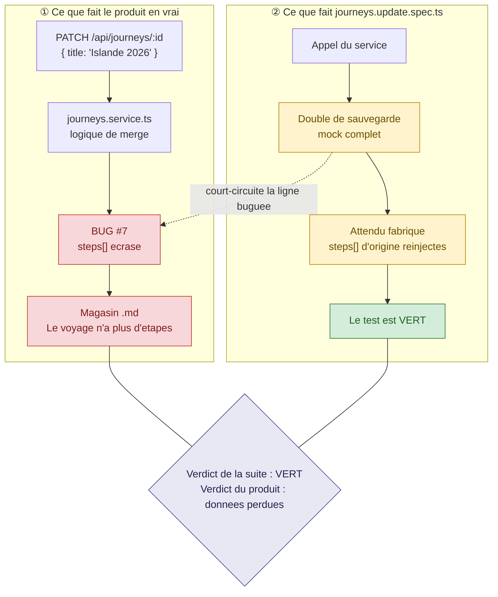
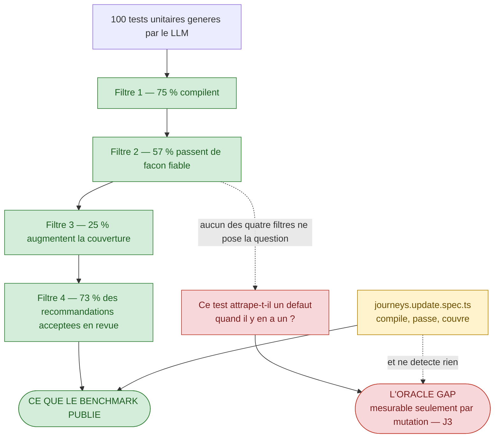
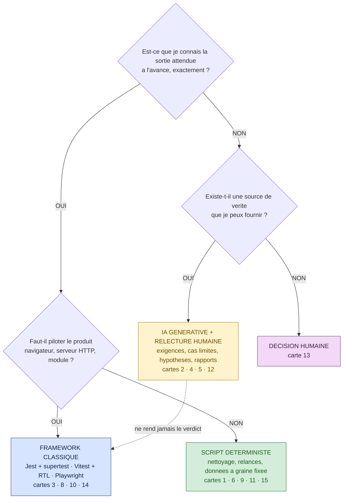
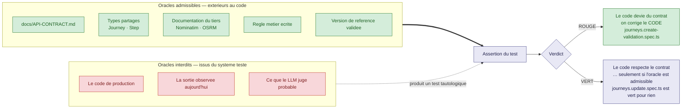

# Module M1 — « Le test qui ment »

> **Jour 1 · matin · 160 min de notions + 20 min de QCM long · 4 notions**
> *Promesse au participant : « À la fin de ce module, vous saurez reconnaître un test généré qui
> valide un bug au lieu de le détecter — et vous saurez le prouver en une commande. »*

**Document formateur.** Il se déroule tel quel en séance. Les encadrés 🔐 ne sont jamais projetés.
Référence de vérité du terrain : `00-carte-du-terrain.md`. Contrat d'écriture : `00-gabarit-notion.md`.

---

## 0. Carte du module

### 0.1 Objectif terminal

> À l'issue de M1, le·a participant·e est capable de **juger la valeur d'un test qu'il n'a pas
> écrit** : nommer sa source de vérité, décider s'il peut échouer, et prouver son verdict par une
> exécution — pas par une opinion.

C'est le seul objectif terminal du module. Tout le reste y concourt.

### 0.2 Position dans le fil rouge — *L'Expédition*, 🏕️ camp de base

| | |
|---|---|
| **Ce qui existe avant M1** | Le dépôt *Carnet de voyage* tel qu'il est livré. 16 fonctionnalités, 10 sans bug, 7 avec au moins un test. `npm run test:backend` sort **en rouge** : 2 suites passent, 2 suites échouent. Personne dans la salle ne sait ce que ce rouge signifie. Les cordées viennent d'être constituées au Brief. |
| **Ce qui existe après M1** | Le groupe sait lire la suite existante : il sait dire, test par test, *d'où vient l'attendu*. Trois tests ont été qualifiés en séance — un faux positif (🟡), un rouge légitime (🔴), un étalon (🟢). Le vocabulaire de la journée est posé : **oracle, test tautologique, sur-mock, rouge légitime**. Le module M2 peut alors demander d'extraire des exigences : les participants savent enfin pourquoi. |
| **Ce que M1 ne fait pas** | On n'écrit pas encore de test complet, on ne corrige aucun bug, on ne prompte pas encore méthodiquement. C'est M2 et M3. |

### 0.3 Les quatre notions

| # | Notion | Modalité (critère) | Durée | Terrain | Micro-évaluation |
|---|---|---|---|---|---|
| **M1.1** | Le test qui ne peut pas échouer | **JEU — Le Piège** (`D-4`) | 45 | **Z2** 🟡 `journeys.update.spec.ts` + 🐞 #7 | Exercice court (8 min) |
| **M1.2** | Ce que mesurent — et ne mesurent pas — les benchmarks | **DESC** + diagramme (`A-2`) | 35 | **Z2** ⚪ génération sur la feature #13 | QCM éclair (3 q.) |
| **M1.3** | Trois familles d'automatisation : qui fait quoi | **JEU — Le Tri** (`B-1`) | 40 | **Z4 · Z5 · Z6** — cartes issues des trois | Exercice court (4 min) |
| **M1.4** | L'oracle : le contrat, pas le code | **DESC** + démo (`A-2`) | 40 | **Z2** 🟢 étalon #2 → 🔴 rouge légitime #6 | QCM éclair (3 q.) |

**Rythme** — JEU · DESC · JEU · DESC : aucun doublon consécutif (`R-1` ✓) · première séquence non
descendante (`R-6` ✓) · un jeu sérieux dans la demi-journée (`R-3` ✓) · aucune ligne descendante
de plus de 12 min sans interaction (`R-5` ✓) · clôture sur une victoire mesurable (`R-8` ✓).

### 0.4 Minutage de la demi-journée

| Créneau | Séquence | Durée | Cumul |
|---|---|---|---|
| 09:00 → 09:15 | **Le Brief** — pitch de *L'Expédition*, cordées, score, chiffre d'ouverture | 15 | 15 |
| 09:15 → 10:00 | **M1.1** — Le test qui ne peut pas échouer | 45 | 60 |
| 10:00 → 10:35 | **M1.2** — Ce que mesurent les benchmarks | 35 | 95 |
| 10:35 → 10:50 | **Pause** | 15 | 110 |
| 10:50 → 11:30 | **M1.3** — Trois familles d'automatisation | 40 | 150 |
| 11:30 → 12:10 | **M1.4** — L'oracle : le contrat, pas le code | 40 | 190 |
| 12:10 → 12:30 | **QCM long M1** — 14 questions, correction commentée | 20 | 210 |

**Contrôle** : 15 + 45 + 35 + 15 + 40 + 40 + 20 = **210 min** ✓ (matin conforme à `00-architecture-28h.md` §2).

### 0.5 Points de Repère mobilisables sur le module

| Source | Gain |
|---|---|
| Micro-évaluation M1.1 réussie | 10 PR |
| Jeu M1.1 — cordée ayant annoncé le bon verdict **avec preuve** | 15 PR |
| Micro-évaluation M1.2 (QCM éclair 3/3) | 10 PR |
| Jeu M1.3 — cordée ayant le plus de cartes justes | 15 PR |
| Micro-évaluation M1.3 réussie | 10 PR |
| Micro-évaluation M1.4 (QCM éclair 3/3) | 10 PR |
| **QCM long M1** — au prorata | 0 à 50 PR |
| **Total maximal du module** | **120 PR** |

### 0.6 Préparation matérielle — la veille

| Vérification | Commande / geste | Attendu |
|---|---|---|
| Le dépôt s'installe | `npm install` | pas d'erreur bloquante |
| La suite back sort bien en rouge | `npm run test:backend` | 2 suites passent, 2 suites échouent |
| Le back démarre | démarrage du backend NestJS | `http://localhost:3000/api` répond |
| Le front démarre | démarrage du front Vite | `http://localhost:5173` s'affiche |
| Playwright est prêt (facultatif pour M1) | `npx playwright install` | navigateurs téléchargés |
| Les 15 cartes de M1.3 sont imprimées | 1 jeu par cordée | découpées, mélangées |
| Un compte utilisateur existe | `POST /api/auth/register` | jeton récupérable via `POST /api/auth/login` |

🔐 **Réservé formateur** : `grep -rn "BUG:" backend/src` donne les six bugs. **Ne jamais la
divulguer avant le débrief du col J1.** Elle n'apparaît nulle part dans les supports projetés.

---

## 1. Notion M1.1 — « Le test qui ne peut pas échouer »

|  |  |
|---|---|
| **Durée** | 45 min |
| **Modalité** | Jeu sérieux — **Le Piège** |
| **Objectif d'apprentissage** | À l'issue, le·a participant·e est capable de **détecter un test tautologique et de prouver qu'il l'est** par une exécution du scénario réel, sans lire le code de production |
| **Niveau visé (Bloom)** | **Analyser** |
| **Micro-évaluation** | Exercice court (8 min) |
| **Ancrage fil rouge** | **Z2 — Les voyages** · 🟡 `backend/src/journeys/journeys.update.spec.ts` (le faux positif) puis 🔴 🐞 #7 (`PATCH` perd les `steps`). *Pourquoi cette zone : la modification d'un voyage est la fonctionnalité la plus banale du produit, et son test est vert. Le piège ne peut donc être excusé ni par la complexité du métier ni par la négligence de l'équipe. C'est le cas le plus dérangeant possible.* Ce que la notion fait avancer : la première ligne 🟡 de la matrice du Boss J1 est remplie, **avec sa preuve**. |
| **Prérequis** | Aucun. C'est la première notion de la formation. |

### ▸ Pourquoi cette modalité

L'objectif est de **se méfier d'un piège**, donc critère `D-4` de `00-grille-modalites.md` :
*« un piège raconté ne protège de rien. On doit y tomber, publiquement, sans enjeu. »*
Un exposé sur le test tautologique produit un acquiescement, pas une méfiance. Le jeu **Le Piège**
place les participants en position d'affirmer publiquement « cette fonctionnalité est couverte »
avant de leur montrer, en une commande, que les données sont perdues. Le nom de l'anti-pattern se
colle alors au souvenir de l'erreur, et non à une définition. C'est la notion la plus importante
du dispositif : tout le reste de la formation s'appuie sur le doute installé ici.

### ▸ Ce qu'il faut avoir compris à la fin

- **Vert ≠ correct.** Une suite verte et une couverture en hausse sont parfaitement compatibles
  avec une perte de données en production.
- **Le sur-mock détruit la valeur du test** : quand le double remplace précisément la partie
  qu'on voulait vérifier, il ne reste rien à vérifier.
- **Un attendu fabriqué à partir de l'implémentation est un test tautologique** — il ne peut,
  par construction, pas échouer.
- Le test de détection tient en une question : **« quelle modification du code de production
  ferait passer ce test au rouge ? »** Si la réponse est « aucune », le test ne teste rien.
- Le mensonge se **propage** : l'IA lit les tests existants, en déduit le style de la maison,
  et reproduit le sur-mock sur les fonctionnalités suivantes.

### ▸ Déroulé minuté

> Le protocole `D-4` en cinq temps est appliqué strictement : ① amorce · ② piège · ③ révélation ·
> ④ nom · ⑤ parade. Les numéros sont rappelés en tête de ligne.

| Temps | Le formateur | Les participants |
|---|---|---|
| **0-3** *(3)* | **① AMORCE.** Aucun avertissement, aucune mise en garde. « Vous venez d'arriver sur le produit. Le comité vous demande, ce matin : *la modification d'un voyage est-elle couverte par les tests ?* Vous répondez **oui** ou **non**, et vous apportez **une preuve**. Vous avez dix minutes. » Distribue une carte-verdict par cordée. | Écoutent, notent la question, se répartissent Pilote / Copilote. |
| **3-13** *(10)* | **② PIÈGE.** Circule. Ne corrige rien, ne suggère rien. Si on lui demande « on peut lancer les tests ? » : « faites comme vous feriez au bureau ». Chronomètre affiché. | Lancent `npm run test:backend`. Constatent que 2 suites passent et 2 échouent. Ouvrent `backend/src/journeys/journeys.update.spec.ts`. Le lisent. Remplissent leur carte-verdict : **oui / non**, la preuve, et un **niveau de confiance sur 5**. |
| **13-16** *(3)* | **② bis — LE PARI.** Fait annoncer chaque cordée à voix haute et écrit les verdicts au tableau, avec le niveau de confiance. Ne commente pas. « Personne ne change d'avis ? Dernière chance. » | Annoncent leur verdict et leur confiance. Constatent que le groupe converge : la fonctionnalité est **couverte**, preuve = le test est vert. |
| **16-20** *(4)* | **③ RÉVÉLATION.** Ne discourt pas : exécute. Passe la démonstration §Démonstration à l'écran, en direct, en quatre appels. Puis se tait cinq secondes devant le résultat. Dit ensuite, mot pour mot : « **Tout le monde est tombé dedans, moi le premier, et c'est exactement pour ça qu'on en fait un point de contrôle.** » | Regardent. Voient le test vert, puis le voyage relu **sans ses étapes**. Réagissent. |
| **20-23** *(3)* | **④ LE NOM.** Écrit trois mots au tableau et les relie au moment qu'ils viennent de vivre : **faux positif** (le résultat), **sur-mock** (la cause), **test tautologique** (la forme : l'attendu vient du code, pas d'une source). Demande : « lequel des trois décrit ce qu'on vient de voir ? » | Répondent : les trois, à trois niveaux différents. Notent les trois mots dans le carnet de cordée. |
| **23-30** *(7)* | **⑤ LA PARADE.** « On ne va pas retenir une définition, on va retenir un geste. » Construit au tableau, avec le groupe, les **quatre questions de détection** (voir Contenu §4). Fait appliquer les quatre questions au test qu'ils viennent de lire, à voix haute. | Proposent les questions, les reformulent, les appliquent au test. Recopient les quatre questions dans le carnet de cordée — elles serviront jusqu'au J4. |
| **30-34** *(4)* | **DÉBRIEF DU JEU.** Nomme ce qui vient d'être vécu et le relie au métier : « ce test a été écrit par quelqu'un de sérieux, et il a été relu. Ce n'est pas un problème de compétence, c'est un problème de méthode. » Annonce les 15 PR à la ou aux cordées ayant répondu **non** avec une preuve exécutée. Attribue le badge 🪤 **Le Démineur** si une cordée a expliqué *pourquoi* le test ment. | Posent leurs questions. Une cordée au moins demande : « alors on ne mocke plus rien ? » — la réponse est dans les Pièges d'animation. |
| **34-42** *(8)* | **MICRO-ÉVALUATION.** Projette l'extrait de la micro-évaluation, distribue la consigne en trois lignes, chronomètre 6 min puis corrige en 2 min. | Font l'exercice court en cordée : identifier la ligne fautive, écrire l'assertion qui rendrait le test capable d'échouer. |
| **42-45** *(3)* | **SYNTHÈSE — la parole est aux participants.** « En une phrase, sans vos notes : qu'est-ce que vous savez faire maintenant que vous ne saviez pas faire il y a quarante-cinq minutes ? » Fait parler deux cordées, n'ajoute rien, enchaîne. | Formulent la synthèse. Réponse attendue : *« je sais demander à un test quelle modification du code le ferait tomber — et l'exécuter pour vérifier. »* |

**Contrôle : 3 + 10 + 3 + 4 + 3 + 7 + 4 + 8 + 3 = 45 min ✓**

### ▸ Contenu à transmettre

**1. Le fait.** Dans le dépôt, la fonctionnalité #7 — *Modification d'une journey* — possède un
test unitaire, `backend/src/journeys/journeys.update.spec.ts`. Il est vert. La fonctionnalité
porte pourtant le bug #7 : `PATCH /api/journeys/:id` écrase le tableau `steps[]` au lieu de le
conserver. Le contrat est explicite : *« les steps ne doivent PAS être perdus »*
(`docs/API-CONTRACT.md`, §Journeys). Le produit perd des données, silencieusement, et la suite
est verte.

**2. Pourquoi il est vert.** Le test **mocke entièrement la couche de sauvegarde** et
**réinjecte les `steps` d'origine dans le résultat attendu**. La logique de merge — celle qui
contient le défaut — n'est jamais exécutée. Le test compare donc une valeur qu'il a lui-même
fabriquée à une valeur qu'il a lui-même fabriquée.

**3. Les trois niveaux de lecture** — à écrire au tableau, dans cet ordre :

| Niveau | Nom | Formulation |
|---|---|---|
| Le résultat | **Faux positif** | Le test est vert alors que le défaut est présent |
| La cause technique | **Sur-mock** | Le double remplace la partie même que l'on voulait vérifier |
| La forme du test | **Test tautologique** | L'attendu est dérivé de l'implémentation, pas d'une source de vérité |

**4. La parade — les quatre questions de détection.** Elles rejoignent la checklist du
participant et servent jusqu'au col J4.

| # | Question à poser au test | Signal d'alarme |
|---|---|---|
| **Q1** | Quelle modification du code de production ferait passer ce test au rouge ? | « Aucune » ou « je ne vois pas » |
| **Q2** | D'où vient la valeur attendue ? | Du code, d'un `console.log`, d'une exécution précédente |
| **Q3** | Que reste-t-il de réel une fois les doubles posés ? | Le double couvre la logique visée |
| **Q4** | Le test franchit-il la frontière que la fonctionnalité franchit ? | Le test s'arrête avant l'écriture, la lecture, le merge |

**5. Ce que cela change avec l'IA.** Deux mécanismes se combinent.

- Les générateurs de tests par LLM, confrontés à du code bogué, **produisent des tests qui
  valident le bug au lieu de le détecter** — c'est un résultat mesuré, pas une intuition
  [Design choices, 2024].
- L'IA lit le dépôt pour en déduire le style attendu. Elle lira `journeys.update.spec.ts`, y
  verra une convention maison, et **reproduira le sur-mock** sur les fonctionnalités suivantes.
  **Le mensonge se propage** — et la couverture, elle, augmente.

**6. La phrase à faire noter.**

> *Une couverture qui monte sans assertion nouvelle est un indicateur qui ment.
> Le barème de l'expédition l'a inscrit : **−25 PR**.*

**7. Ce que l'on ne dit pas.** On ne dit pas « il ne faut pas mocker ». On dit : **on ne mocke
jamais la chose que l'on veut vérifier**. Le double sert à neutraliser ce qui est hors sujet
(le réseau, l'horloge, un tiers) ; il ne sert jamais à remplacer la logique sous test.

*(≈ 470 mots)*

### ▸ 🖼️ Diagramme — `diagrammes/M1-1-le-faux-positif.svg`

#### Source Mermaid



#### Descriptif du SVG à produire

Format paysage 1600 × 900, imprimable en A4 paysage et lisible vidéoprojeté à 6 m.
Deux colonnes de largeur égale séparées par un filet vertical gris clair : à gauche le bandeau
**« ① Ce que fait le produit »** (fond rouge très pâle), à droite **« ② Ce que fait le test »**
(fond jaune très pâle). Chaque colonne est une chaîne verticale de quatre blocs arrondis reliés
par des flèches pleines. Un unique **trait pointillé horizontal** part du bloc « Double de
sauvegarde » (droite) vers le bloc « BUG #7 » (gauche), avec le libellé *« court-circuite la ligne
buguée »* en italique. En bas, une bande pleine largeur qui reçoit les deux colonnes et porte,
sur deux lignes contrastées : **« Verdict de la suite : VERT »** en vert, **« Verdict du produit :
données perdues »** en rouge. Aucune icône décorative. Police sans empattement, taille minimale
20 px à l'échelle du fichier.

#### Explication du diagramme — notice de dévoilement

| Ordre | Ce qu'on affiche | La phrase à dire | Ce qu'on attend en retour |
|---|---|---|---|
| 1 | **La colonne de gauche seule** | « Voilà ce qui se passe quand un utilisateur renomme son voyage. Quatre étapes. À la fin, le fichier du magasin ne contient plus les étapes. » | Silence, ou une question sur le stockage `.md`. |
| 2 | **La colonne de droite seule** *(masquer la gauche)* | « Voilà ce que fait le test que vous venez de lire. Lui aussi a quatre étapes. Regardez la deuxième : le double remplace la sauvegarde. Et la troisième : l'attendu est fabriqué à partir de ce qu'on vient de mocker. » | Quelqu'un dit « donc il ne teste rien » — c'est le moment recherché. |
| 3 | **Le trait pointillé** | « Ce trait est tout le problème. Le double ne contourne pas un détail : il contourne **exactement** la ligne buguée. » | Prise de conscience. Ne pas enchaîner tout de suite. |
| 4 | **La bande du bas** | « Deux verdicts. Ils sont vrais tous les deux, en même temps. La suite est verte **et** les données sont perdues. » | Fin du dévoilement. |

⚠️ **Erreur d'interprétation à prévenir.** Le diagramme n'est pas une charge contre le mocking.
Certains participants en concluront « il ne faut plus mocker ». Couper court immédiatement :
« le double n'est pas coupable, c'est **son placement** qui l'est. Un double qui neutralise
l'horloge ou le réseau est sain. Ici, il neutralise la logique sous test. » Le trait pointillé
est là pour ça : il désigne un **emplacement**, pas une technique.

### ▸ 🔍 Démonstration — la révélation en quatre appels

**Point de départ.** Backend démarré sur `http://localhost:3000/api`, un compte existant, un
jeton en main. Le test unitaire de la fonctionnalité #7 vient d'être exécuté par les
participants : il est vert.

**Le geste exact.** Deux temps. Ne rien commenter entre les deux.

*Temps 1 — la suite est verte.*

```bash
npm run test:backend -- journeys.update
# PASS  backend/src/journeys/journeys.update.spec.ts
```

*Temps 2 — le scénario réel, celui d'un utilisateur.*

```bash
# 0. Le jeton
TOKEN=$(curl -s -X POST http://localhost:3000/api/auth/login \
  -H 'Content-Type: application/json' \
  -d '{"email":"expedition@example.com","password":"Boussole2026!"}' | jq -r .accessToken)

# 1. Créer un voyage
JID=$(curl -s -X POST http://localhost:3000/api/journeys \
  -H "Authorization: Bearer $TOKEN" -H 'Content-Type: application/json' \
  -d '{"title":"Islande","startDate":"2026-08-01","endDate":"2026-08-15",
       "destination":{"name":"Reykjavik","lat":64.1466,"lng":-21.9426}}' | jq -r .id)

# 2. Ajouter une étape
curl -s -X POST http://localhost:3000/api/journeys/$JID/steps \
  -H "Authorization: Bearer $TOKEN" -H 'Content-Type: application/json' \
  -d '{"name":"Geysir","placeName":"Haukadalur","lat":64.3104,"lng":-20.3024}' | jq '.steps | length'
# → 1

# 3. Modifier le titre — rien d'autre
curl -s -X PATCH http://localhost:3000/api/journeys/$JID \
  -H "Authorization: Bearer $TOKEN" -H 'Content-Type: application/json' \
  -d '{"title":"Islande 2026"}' > /dev/null

# 4. Relire le voyage
curl -s http://localhost:3000/api/journeys/$JID \
  -H "Authorization: Bearer $TOKEN" | jq '{title: .title, etapes: (.steps | length)}'
```

**Le résultat obtenu.**

```json
{ "title": "Islande 2026", "etapes": 0 }
```

**Ce que l'exemple révèle.** L'étape existait avant le `PATCH`. Elle n'existe plus après. Aucune
erreur n'a été levée, l'API a répondu 200, et le test unitaire de cette exacte fonctionnalité est
vert. La perte de données est **silencieuse à trois niveaux** : pas d'exception, pas de code
d'erreur, pas de test rouge. C'est ce cumul qui rend le cas dérangeant — et mémorable.

**Ce qui peut rater, et le repli associé.**

| Risque | Signe | Repli |
|---|---|---|
| Backend non démarré | `curl` sans réponse | Repli sur la capture d'écran des quatre appels, préparée la veille |
| `jq` absent du poste | commande introuvable | Retirer les `| jq`, lire le JSON brut et **surligner** `"steps": []` à l'écran |
| Jeton expiré | 401 sur l'appel 1 | Rejouer l'appel `login` ; garder un second jeton en réserve |
| Port 3000 occupé | `EADDRINUSE` au démarrage | Libérer le port avant la séance — c'est une vérification de la veille (§0.6) |
| Un participant a déjà modifié le service | l'étape survit au `PATCH` | Réinitialiser le dépôt à l'état de départ avant la séance ; ne jamais démontrer sur un poste participant |

### ▸ ✅ Micro-évaluation — Exercice court (8 min)

**Énoncé** *(trois lignes, projeté)*

> Voici un test généré pour la fonctionnalité #7 — *Modification d'une journey*.
> 1. Entourez **la ligne** qui rend ce test incapable d'échouer.
> 2. Écrivez **l'assertion** qui le rendrait capable de tomber sur le bug #7.

**Matériel** — l'extrait ci-dessous projeté et distribué sur papier, un stylo par cordée.

```ts
// Extrait fourni aux participants — reconstitution à titre d'exercice
import { Test } from '@nestjs/testing';
import { JourneysService } from './journeys.service';
import { StorageService } from '../storage/storage.service';

describe('JourneysService.update', () => {
  let service: JourneysService;
  const existing = {
    id: 'j1', title: 'Islande', ownerId: 'u1',
    startDate: '2026-08-01', endDate: '2026-08-15',
    destination: { name: 'Reykjavik', lat: 64.1466, lng: -21.9426 },
    rating: null, comments: [],
    steps: [{ id: 's1', name: 'Geysir', placeName: 'Haukadalur',
              lat: 64.3104, lng: -20.3024, startDate: null, endDate: null,
              photos: [], comments: [] }],
  };

  const storage = {
    read: jest.fn().mockResolvedValue(existing),
    write: jest.fn().mockResolvedValue({ ...existing, title: 'Islande 2026' }), // ← ?
  };

  beforeEach(async () => {
    const moduleRef = await Test.createTestingModule({
      providers: [JourneysService, { provide: StorageService, useValue: storage }],
    }).compile();
    service = moduleRef.get(JourneysService);
  });

  it('met à jour le titre sans perdre les étapes', async () => {
    const result = await service.update('j1', { title: 'Islande 2026' });
    expect(result.title).toBe('Islande 2026');
    expect(storage.write).toHaveBeenCalled();
  });
});
```

**Résultat attendu vérifiable** *(cases à cocher, contrôle en moins de 60 secondes)*

- [ ] La ligne entourée est celle du **double `write`** : sa valeur de retour réinjecte `existing`,
      donc les `steps`, sans jamais passer par la logique de merge.
- [ ] L'assertion proposée porte sur **`steps`**, et compare à une valeur issue du **contrat**,
      pas du double.

**Solution de référence**

```ts
// 1. Le double ne fabrique plus la réponse : il capture ce qu'on lui demande d'écrire.
const storage = {
  read: jest.fn().mockResolvedValue(existing),
  write: jest.fn(async (_id: string, journey: unknown) => journey), // on écrit ce qu'on reçoit
};

// 2. L'assertion vient de docs/API-CONTRACT.md : « les steps ne doivent PAS être perdus »
it('conserve les étapes lors d’une mise à jour partielle', async () => {
  const result = await service.update('j1', { title: 'Islande 2026' });
  expect(result.title).toBe('Islande 2026');
  expect(result.steps).toHaveLength(1);          // ← rouge avec le bug #7
  expect(result.steps[0].id).toBe('s1');
});
```

**L'erreur que 80 % des groupes commettent.** Ils renforcent l'assertion (`toHaveLength(1)`) **sans
toucher au double**. Le test reste vert : le `write` mocké continue de renvoyer `existing`, étapes
comprises. C'est le moment d'or de la notion — le faire constater, puis conclure :
**une assertion forte branchée sur un double menteur reste un test menteur.**

### ▸ 🔗 Ressources

| Ressource | À qui elle s'adresse | Ce qu'il faut y lire précisément |
|---|---|---|
| *Design choices made by LLM-based test generators prevent them from finding bugs* — https://arxiv.org/abs/2412.14137 | **La référence de la notion** | Le résultat central : confrontés à du code bogué, Codium CoverAgent et CoverUp génèrent des tests qui **valident le bug au lieu de le détecter**. |
| *Mocks Aren't Stubs* (Martin Fowler) — https://martinfowler.com/articles/mocksArentStubs.html | Celui qui veut approfondir | La distinction entre les cinq types de doubles, et l'alerte sur le **couplage excessif à l'implémentation**. |
| *Software Engineering at Google*, ch. 13 — Test Doubles — https://abseil.io/resources/swe-book/html/ch13.html | Celui qui doit convaincre son équipe | Le constat interne de Google : l'abus du mocking a **« pollué »** sa base de tests. Argument d'autorité utile en rétrospective. |
| *The Oracle Gap: Comparing Coverage and Mutation Score* — https://arxiv.org/abs/2309.02395 | Le curieux | La notion d'**oracle gap** : une forte couverture coexiste couramment avec des oracles faibles. |
| *Test smells in LLM-Generated Unit Tests* — https://arxiv.org/abs/2410.10628 | Celui qui relit du test généré | Les smells systématiques observés sur 20 505 suites générées : **Assertion Roulette**, **Magic Number Test**. |

### ▸ ⚠️ Pièges d'animation

- **Le piège vise la méthode, jamais la personne.** Ne jamais nommer une cordée qui s'est trompée,
  ne jamais dire « vous voyez, vous êtes tombés dedans ». La phrase est obligatoire et se dit à
  l'étape ③, mot pour mot : *« tout le monde est tombé dedans, moi le premier, et c'est exactement
  pour ça qu'on en fait un point de contrôle. »* Si un participant s'auto-dévalorise, rappeler que
  ce test a été écrit **et relu** par des professionnels.
- **La question qui revient toujours** : *« alors on ne mocke plus rien ? »* Réponse courte :
  *« on mocke ce qui est hors sujet — le réseau, l'horloge, un tiers. On ne mocke jamais la chose
  qu'on veut vérifier. »* Ne pas ouvrir le débat classicistes/mockistes : il coûte dix minutes et
  n'apporte rien ici.
- **Ce qui rate habituellement** : une cordée rapide découvre le bug pendant l'étape ② et l'annonce
  à voix haute, ce qui désamorce la révélation. Anticiper : *« si vous trouvez quelque chose,
  écrivez-le sur votre carte, ne le dites pas. »* Cette cordée reçoit les 15 PR **et** le badge
  🪤 Le Démineur.
- **La proposition dangereuse** : « il suffit d'ajouter un `expect` ». Ne pas la rejeter — la faire
  essayer. Elle échoue à rendre le test rouge, et c'est l'enseignement de la micro-évaluation.
- **Le signe qu'il faut passer à la suite** : quand une cordée reformule spontanément Q1
  (« quelle modification ferait tomber ce test ? ») sur un autre test du dépôt, la notion est
  acquise. Ne pas surjouer le débrief.

---

## 2. Notion M1.2 — « Ce que mesurent — et ne mesurent pas — les benchmarks »

|  |  |
|---|---|
| **Durée** | 35 min |
| **Modalité** | Descendant + diagramme + démonstration courte |
| **Objectif d'apprentissage** | À l'issue, le·a participant·e est capable d'**expliquer ce qu'un benchmark de génération de tests mesure réellement**, et de citer deux chiffres d'état de l'art pour situer une promesse d'éditeur |
| **Niveau visé (Bloom)** | **Comprendre** |
| **Micro-évaluation** | QCM éclair (3 questions) |
| **Ancrage fil rouge** | **Z2 — Les voyages** · ⚪ feature #13 *Commentaires sur une journey* (terrain vierge, `POST /api/journeys/:id/comments`). *Pourquoi cette zone : c'est le terrain le plus facile du dépôt. Si l'écart entre le chiffre de laboratoire et le résultat réel apparaît **ici**, sur la fonctionnalité la plus simple, il ne pourra pas être attribué à la difficulté du code.* Ce que la notion fait avancer : les participants disposent d'un ordre de grandeur pour juger, au col J1, ce que « couvert par l'IA » veut dire. |
| **Prérequis** | M1.1 — le vocabulaire *faux positif / tautologique* est posé |

### ▸ Pourquoi cette modalité

L'objectif est de **comprendre un mécanisme invisible** : ce que compte un benchmark, et ce qu'il
ne compte pas. Critère `A-2` de `00-grille-modalites.md` — *« un mécanisme se voit ; le diagramme
dévoilé progressivement fait plus que 500 mots »*. Il n'y a rien à découvrir par soi-même dans une
liste de chiffres publiés : les faire chercher coûterait trente minutes pour un contenu qui
s'énonce en cinq. La valeur est dans **l'ancrage** — d'où le diagramme en entonnoir, la
démonstration d'une génération réelle, et le QCM. La notion suit un jeu (`R-1` respecté) et
n'excède jamais 6 minutes de descendant continu (`R-5`).

### ▸ Ce qu'il faut avoir compris à la fin

- Un benchmark de génération de tests mesure principalement : **la compilation, l'exécution sans
  erreur, et la couverture**. Presque jamais **la capacité à détecter un défaut**.
- Les LLM atteignent une couverture globale correcte, mais **cibler une ligne, une branche ou un
  chemin précis reste leur point faible net**.
- Les chiffres industriels et les chiffres de laboratoire ne mesurent pas la même chose : chez
  Meta, **57 %** des tests générés passent de façon fiable et **25 %** augmentent la couverture.
- Le gain déclaré en entreprise est réel mais modeste — **19 %** de productivité — et l'adoption
  massive n'est pas de la confiance : **46 %** des développeurs se méfient de l'exactitude des sorties.
- Conséquence de séance : **un chiffre de benchmark ne se transporte jamais tel quel dans un devis**.

### ▸ Déroulé minuté

| Temps | Le formateur | Les participants |
|---|---|---|
| **0-4** *(4)* | **OUVERTURE PAR LE PARI.** Aucune introduction. « Meta a industrialisé la génération de tests unitaires sur Instagram et Facebook. Sur 100 tests générés, combien passent de façon fiable ? À main levée : plus de 90 ? entre 70 et 90 ? entre 50 et 70 ? moins de 50 ? » Compte les mains, écrit la distribution au tableau, **puis** révèle : **57 %**. | Votent à main levée. Constatent l'écart entre leur intuition et le chiffre publié. |
| **4-9** *(5)* | **CE QUE COMPTE UN BENCHMARK.** Projette le tableau §1 du Contenu. Insiste sur `pass@k` : « pass@1, ça veut dire *une proposition, une réussite*. Réussite au sens de quoi ? De la spécification du problème. Pas de la détection d'un bug. » | Écoutent. Relance : « dans notre dépôt, quel test passerait haut la main un benchmark et ne détecte rien ? » → `journeys.update.spec.ts`. |
| **9-14** *(5)* | **DÉMONSTRATION.** Génère en direct un test sur la feature #13 (voir §Démonstration). Lit la sortie à voix haute et pose une seule question : « ce test-là, il compte comme quoi dans le benchmark ? » | Répondent : il compile, il passe, il augmente la couverture. Repèrent seuls l'assertion faible. |
| **14-20** *(6)* | **LE DIAGRAMME.** Dévoile l'entonnoir en quatre temps (voir notice). S'arrête sur la branche latérale : « voilà la case que personne ne mesure. » | Notent. Une question revient : « et le taux de bugs trouvés, ça existe comme métrique ? » → oui : le score de mutation, vu en M6. |
| **20-24** *(4)* | **DU LABORATOIRE AU TERRAIN.** Projette le tableau §3 du Contenu : adoption ~90 %, mise à l'échelle 15 %, gain de productivité 19 %, méfiance 46 %. Une phrase : « l'adoption n'est pas la confiance, et la confiance n'est pas la preuve. » | Réagissent. Plusieurs reconnaissent la situation de leur entreprise. |
| **24-28** *(4)* | **RELANCE ET APPLICATION.** « Prenez la feature #13 et la feature #16 — la carte, l'itinéraire. Sur laquelle des deux les chiffres qu'on vient de voir sont-ils valables ? » Laisse débattre 2 min, tranche : les benchmarks portent sur des fonctions à oracle local ; #16 exige une source **externe**. | Débattent en cordées, répondent. Découvrent la limite de transférabilité d'un chiffre. |
| **28-32** *(4)* | **MICRO-ÉVALUATION.** Projette les 3 questions du QCM éclair, ramasse à main levée, corrige en direct. | Répondent, entendent pourquoi chaque distracteur est faux. |
| **32-35** *(3)* | **SYNTHÈSE — la parole est aux participants.** « Quelle phrase direz-vous, lundi, à celui qui vous annonce *l'IA écrit 90 % de nos tests* ? » | Formulent. Réponse attendue : *« 90 % de quoi ? qui compile, qui passe, qui couvre, ou qui détecte ? »* |

**Contrôle : 4 + 5 + 5 + 6 + 4 + 4 + 4 + 3 = 35 min ✓**

### ▸ Contenu à transmettre

**1. Ce que mesure chaque famille de benchmark.**

| Benchmark | Matière évaluée | Ce qu'il mesure | Ce qu'il ne mesure pas |
|---|---|---|---|
| **HumanEval** — 164 problèmes, métrique `pass@k` ; Codex initial à **28,8 %** en `pass@1` | Fonctions isolées | La conformité à un énoncé | Tout ce qui touche à un dépôt réel |
| **TESTEVAL** — 210 programmes, 16 LLM | Génération de cas de test | La couverture globale atteignable | **Cibler une ligne, une branche ou un chemin précis** — le point faible net |
| **TestGenEval** — 68 647 tests, 1 210 paires code/test, 11 dépôts réels | Génération et complétion de tests | La couverture moyenne : **35,2 %** pour le meilleur modèle | La pertinence des assertions |
| **SWT-Bench** | Tests comme filtre de validation d'un correctif | Le gain de précision — **doublement** de la précision de SWE-Agent | La qualité intrinsèque du test |
| **SWE-Bench Pro** — 1 865 problèmes, 41 dépôts d'entreprise | Tâches longues, multi-fichiers | La tenue sur des tâches de plusieurs heures | — |

**2. Le seul chiffre industriel à retenir.** TestGen-LLM, déployé chez Meta sur Instagram et
Facebook : **75 %** des tests générés compilent · **57 %** passent de façon fiable · **25 %**
augmentent la couverture · **73 %** des recommandations sont acceptées en production.

> À dire tel quel : *« quatre filtres successifs. Aucun des quatre ne demande si le test
> attrape un bug. »*

**3. L'écart entre le laboratoire et le terrain.**

| Source | Chiffre | Ce qu'il faut en faire |
|---|---|---|
| World Quality Report 2025-26 | **~90 %** poursuivent la GenAI en quality engineering, **15 %** seulement à l'échelle entreprise ; gain de productivité **19 %** | Distinguer *pilote* et *industrialisation* |
| State of Testing 2026 | **76,8 %** d'adoption ; **70 %** l'utilisent pour créer des cas de test, **19,9 %** seulement pour l'identification des risques | L'IA est employée en production de volume, pas en jugement |
| Stack Overflow 2025 | **84 %** utilisent ou prévoient d'utiliser l'IA, mais **46 % ne font pas confiance** à l'exactitude | L'adoption n'est pas la confiance |
| DORA 2025 | **+21 %** de tâches complétées, **+98 %** de PR fusionnées, sans amélioration proportionnelle des métriques de livraison | L'IA est un **amplificateur**, pas un correcteur |

**4. La conséquence pour la formation.** Aucun de ces chiffres ne vous dit si **votre** test
attrape **votre** bug. Cette question a une réponse, et elle est expérimentale : exécuter le test
contre un code que l'on sait défectueux. C'est exactement ce que M1.1 a fait, et ce que le
score de mutation formalisera au J3.

**5. La phrase à faire noter.**

> *Un benchmark mesure ce qui est facile à compter. La détection de défaut est difficile à
> compter — donc rarement comptée.*

*(≈ 430 mots)*

### ▸ 🖼️ Diagramme — `diagrammes/M1-2-l-entonnoir-des-benchmarks.svg`

#### Source Mermaid



#### Descriptif du SVG à produire

Format paysage 1600 × 900. Colonne centrale : un **entonnoir** de quatre bandeaux horizontaux de
largeur décroissante (100 % → 75 % → 57 % → 25 %), verts, chacun portant son pourcentage en gros
caractères et son libellé en dessous. Sous l'entonnoir, un cinquième bandeau vert plus étroit
« 73 % acceptés en revue », puis une pastille pleine **« Ce que le benchmark publie »**.
À droite de l'entonnoir, détachée, une **case rouge à bord pointillé** portant la question
*« Ce test attrape-t-il un défaut quand il y en a un ? »*, reliée au troisième bandeau par une
flèche pointillée légendée *« aucun filtre ne pose cette question »*, et suivie de la pastille
rouge **« L'oracle gap »**. En bas à gauche, un encart jaune isolé : `journeys.update.spec.ts` —
*compile · passe · couvre · ne détecte rien*, avec deux flèches, une pleine vers la pastille verte
et une pointillée vers la pastille rouge. Les quatre pourcentages sont les seuls chiffres du
schéma ; la source (*TestGen-LLM, Meta, 2024*) est portée en petit sous l'entonnoir.

#### Explication du diagramme — notice de dévoilement

| Ordre | Ce qu'on affiche | La phrase à dire | Erreur à prévenir |
|---|---|---|---|
| 1 | **L'entonnoir seul, sans les chiffres** | « Un test généré passe quatre filtres avant d'arriver en production. Lisez-les. » | — |
| 2 | **Les quatre pourcentages** | « 75, 57, 25, 73. Ces quatre chiffres viennent d'un déploiement réel, sur Instagram et Facebook. Ce sont de bons chiffres. » | Ne pas les présenter comme un échec : ce sont de **bons** résultats industriels. |
| 3 | **La case rouge à droite** | « Maintenant, relisez les quatre filtres et cherchez celui qui pose cette question-là. Il n'y en a pas. » | Ne pas laisser croire que Meta a mal travaillé : la question est **difficile à mesurer**, pas négligée. |
| 4 | **L'encart jaune du bas** | « Et voilà le test qu'on a lu il y a une demi-heure. Il coche les trois premiers filtres. Il aurait été accepté. » | C'est le point de jonction avec M1.1 : le faire dire par les participants. |

⚠️ **Erreur d'interprétation à prévenir.** Les quatre pourcentages ne sont **pas** un entonnoir
strict — ce ne sont pas 75 % dont 57 % dont 25 %. Ce sont quatre mesures rapportées à l'ensemble
généré. Le dire explicitement à l'étape 2 : *« la forme d'entonnoir sert à montrer l'ordre des
filtres, pas une soustraction. »* Sans cette précision, un participant recalculera et annoncera
« donc 10 % survivent » — ce serait faux.

### ▸ 🔍 Démonstration — générer un test sur un terrain vierge (feature #13)

**Point de départ.** Feature #13 — *Commentaires sur une journey*, zone Z2, **aucun test**.
Le contrat dit exactement ceci :

```
POST /api/journeys/:id/comments
Body: { author, text }
201 → Journey mis à jour avec le nouveau commentaire dans comments[].
```

**Le geste exact** — un prompt volontairement nu, tel qu'on le tape vraiment :

> `Écris les tests unitaires Jest + supertest pour l'ajout d'un commentaire sur une journey dans backend/src/journeys.`

**Le résultat obtenu** *(forme typique, à confronter à ce que produit la séance)* :

```ts
it('ajoute un commentaire à une journey', async () => {
  const res = await request(app.getHttpServer())
    .post(`/api/journeys/${journeyId}/comments`)
    .set('Authorization', `Bearer ${token}`)
    .send({ author: 'Evan', text: 'Superbe étape' });

  expect(res.status).toBe(201);
  expect(res.body.comments).toBeDefined();
});
```

**Ce que l'exemple révèle.** Ce test **compile**, il **passe**, il **augmente la couverture** :
il satisfait trois des quatre filtres du diagramme. Et il ne vérifie rien de contractuel.
`toBeDefined()` serait vrai sur un tableau vide. Le contrat impose que le commentaire ajouté soit
**dans** `comments[]` — donc la longueur, le `text`, l'`author`, et la présence de `id` et
`createdAt` prévus par le type `Journey`. Le prompt nu n'a produit qu'une **assertion faible** :
c'est le cas d'école décrit par la littérature sur les *test smells* générés, et c'est exactement
le geste que le bug #14 (`authorId` toujours `null`, sur les commentaires d'étape) exploitera au J1.

**Ce qui peut rater, et le repli.**

| Risque | Repli |
|---|---|
| Le modèle produit ce coup-ci un très bon test | **Le dire.** « Aujourd'hui elle a bien travaillé — c'est la variabilité, on la mesurera en M3.1. » Puis projeter la sortie préenregistrée. |
| Pas de réseau / quota atteint | Projeter la sortie préenregistrée de la veille (à conserver dans `annexes/`) |
| La génération prend plus de 3 min | Couper, commenter la sortie partielle : la démonstration porte sur la **forme** de l'assertion, pas sur le test complet |

### ▸ ✅ Micro-évaluation — QCM éclair (3 questions)

**Q1.** Que mesure principalement un benchmark de génération de tests unitaires ?
A. La capacité du test à détecter un défaut · **B. La compilation, l'exécution sans erreur et la
couverture** · C. La lisibilité du test pour un humain · D. Le coût en tokens de la génération.

- **B est juste** — c'est ce que les quatre filtres comptent.
- **A est faux** : c'est précisément la case que le diagramme laisse vide ; elle relève du score
  de mutation, pas des benchmarks de génération.
- **C est faux** : la lisibilité n'est mesurée par aucun des benchmarks cités ; elle apparaît dans
  les études de *test smells*, qui sont d'une autre nature.
- **D est faux** : le coût est une contrainte d'exploitation, jamais la métrique du benchmark.

**Q2.** Chez Meta (TestGen-LLM), quelle proportion des tests générés **passe de façon fiable** ?
A. 25 % · **B. 57 %** · C. 73 % · D. 75 %.

- **B est juste.**
- **A est le taux de tests qui augmentent la couverture** — un autre filtre.
- **C est le taux de recommandations acceptées en production** — il porte sur les recommandations,
  pas sur les tests exécutés.
- **D est le taux de tests qui compilent** — le premier filtre, le plus permissif.

**Q3.** Quel est, selon TESTEVAL, le point faible net des LLM en génération de tests ?
A. Produire du code syntaxiquement invalide · B. Atteindre une couverture globale ·
**C. Cibler une ligne, une branche ou un chemin précis** · D. Respecter le style du dépôt.

- **C est juste** — la couverture globale est atteignable, le ciblage précis ne l'est pas.
- **A est faux** : la syntaxe est le point le mieux maîtrisé (75 % de compilation chez Meta).
- **B est faux** : c'est justement ce que les modèles réussissent.
- **D est faux** : imiter le style du dépôt est même **trop** bien réussi — c'est le mécanisme de
  propagation du sur-mock vu en M1.1.

*Barème : 3/3 = 10 PR. Correction commentée à voix haute, moins de 60 secondes par question.*

### ▸ 🔗 Ressources

| Ressource | À qui elle s'adresse | Ce qu'il faut y lire précisément |
|---|---|---|
| *Automated Unit Test Improvement using LLMs at Meta (TestGen-LLM)* — https://arxiv.org/abs/2402.09171 | **La référence chiffrée de la notion** | Les quatre chiffres : 75 % / 57 % / 25 % / 73 %, et le protocole de filtrage qui les produit. |
| *TESTEVAL: Benchmarking LLMs for Test Case Generation* — https://arxiv.org/abs/2406.04531 | Celui qui veut approfondir | Le constat sur le **ciblage** d'une ligne, d'une branche ou d'un chemin — la limite structurelle. |
| *TestGenEval* — https://arxiv.org/abs/2410.00752 | Celui qui doit chiffrer une promesse | Les **35,2 %** de couverture moyenne du meilleur modèle sur 11 dépôts réels. |
| *World Quality Report 2025-26* — https://www.capgemini.com/insights/research-library/world-quality-report-2025-26/ | Celui qui présente à sa direction | ~90 % d'adoption, **15 %** seulement à l'échelle entreprise, **19 %** de gain de productivité. |
| *DORA — State of AI-assisted Software Development 2025* — https://dora.dev/dora-report-2025/ | La référence pour un COMEX | L'IA comme **amplificateur** : +21 % de tâches, +98 % de PR fusionnées, sans gain proportionnel de livraison. |
| *Stack Overflow Developer Survey 2025 — AI* — https://survey.stackoverflow.co/2025/ai | Le curieux | **84 %** d'usage contre **46 %** de méfiance : la tension centrale du métier aujourd'hui. |

### ▸ ⚠️ Pièges d'animation

- **Ce qui rate habituellement** : la notion glisse vers un catalogue de chiffres. Règle de survie —
  **six chiffres au maximum sont dits à voix haute** (75, 57, 25, 35,2, 19, 46). Les autres restent
  au tableau pour ceux qui photographient.
- **La question qui revient toujours** : *« ces chiffres sont de quand ? ils sont déjà périmés. »*
  Réponse courte : *« oui, les valeurs bougent ; la forme de l'entonnoir, non. Ce qui n'est pas
  mesuré aujourd'hui ne le sera pas davantage dans la version suivante du modèle. »*
- **Le risque de démotivation** : présentés à plat, ces chiffres démoralisent. Les cadrer :
  **57 % de tests fiables produits automatiquement, c'est un excellent résultat industriel.**
  Le problème n'est pas le taux, c'est ce qu'on croit qu'il garantit.
- **Le signe qu'il faut passer à la suite** : dès qu'un participant demande *« et comment on mesure
  qu'un test attrape un bug ? »*, la notion a atteint son but. Répondre en une phrase (score de
  mutation, J3) et enchaîner.

---

## 3. Notion M1.3 — « Trois familles d'automatisation : qui fait quoi »

|  |  |
|---|---|
| **Durée** | 40 min |
| **Modalité** | Jeu sérieux — **Le Tri** |
| **Objectif d'apprentissage** | À l'issue, le·a participant·e est capable de **classer une tâche d'automatisation de test** dans la bonne famille — IA générative, script déterministe, framework classique — et de **justifier son choix par un critère**, pas par une préférence |
| **Niveau visé (Bloom)** | **Analyser** |
| **Micro-évaluation** | Exercice court (4 min) — deux cartes inédites |
| **Ancrage fil rouge** | **Z4** (le magasin `.md`) · **Z5** (Nominatim, OSRM) · **Z6** (front React et `e2e/`). *Pourquoi ces trois zones : elles ont des natures opposées. Un nettoyage de magasin est un script déterministe, un parcours Playwright est un framework classique, une extraction d'exigences est de l'IA générative. Le tri devient impossible à réussir « au feeling » — il faut un critère.* Ce que la notion fait avancer : la grille de choix d'outil du col J1 et de la notion M4.3. |
| **Prérequis** | M1.1 et M1.2 |

### ▸ Pourquoi cette modalité

L'objectif est de **distinguer trois choses qu'on confond** en permanence dans les appels d'offres
et les réunions d'outillage. Critère `B-1` de `00-grille-modalites.md` : *« la distinction se
construit par confrontation de cas limites, pas par définition. »* Une définition des trois
familles serait acceptée en trois minutes et oubliée en trois jours. **Le Tri** oblige chaque
cordée à trancher publiquement sur des cartes qui résistent — et ce sont les deux ou trois cartes
qui font débat qui produisent l'apprentissage, pas les douze autres. La notion suit un descendant
(`R-1` respecté) et rouvre l'énergie d'après-pause.

### ▸ Ce qu'il faut avoir compris à la fin

- **Trois familles, trois natures** : le script déterministe **répète** (même entrée, même sortie),
  le framework classique **pilote et vérifie** (il fournit l'infrastructure d'exécution et
  d'assertion), l'IA générative **propose** (sortie plausible, non reproductible).
- Le critère de tri n'est pas l'outil, c'est **la nature de la sortie attendue** : connue à
  l'avance et vérifiable exactement → déterministe ; à produire → génératif.
- **Une sortie non reproductible ne peut pas servir d'oracle.** C'est ce qui interdit à l'IA
  générative d'occuper certaines cases, quelle que soit sa qualité.
- Les trois familles ne s'opposent pas : dans une chaîne réelle, **l'IA propose, le framework
  exécute, le script vérifie et nettoie**.
- Certaines tâches n'appartiennent à aucune des trois : elles relèvent d'un **jugement humain**.

### ▸ Déroulé minuté

| Temps | Le formateur | Les participants |
|---|---|---|
| **0-4** *(4)* | **RÈGLE DU JEU.** Distribue un jeu de 15 cartes par cordée et trois cartons de colonne : **🤖 IA générative · ⚙️ Script déterministe · 🎭 Framework classique**. « Toutes les cartes sont des tâches réelles de *Carnet de voyage*. Dix minutes. Une carte = une colonne. Vous avez le droit de refuser une carte, à condition d'écrire pourquoi au dos. » Ne donne **aucun** critère. | Prennent les cartes, s'organisent, démarrent. Rotation Pilote / Copilote annoncée. |
| **4-14** *(10)* | **LE TRI.** Circule, chronomètre, ne tranche rien. Note mentalement les cartes qui divisent. Relance à 5 min : « il vous reste cinq minutes, ne bloquez pas sur une carte : posez-la et avancez. » | Trient, débattent, se disputent sur trois ou quatre cartes. Écrivent au dos des cartes refusées. |
| **14-18** *(4)* | **AFFICHAGE.** Fait afficher les trois colonnes de chaque cordée au mur, côte à côte. Ne corrige pas encore. « Cherchez les cartes qui ne sont pas au même endroit d'une cordée à l'autre. » | Circulent, comparent, repèrent eux-mêmes les 3 ou 4 cartes litigieuses. |
| **18-26** *(8)* | **ARBITRAGE DES CARTES QUI FONT DÉBAT.** Traite **uniquement** les cartes 7, 9 et 13 (voir §Les trois cartes qui font débat). Pour chacune : fait défendre les deux camps 90 secondes, puis tranche avec le critère, pas avec l'autorité. | Défendent leur classement, entendent l'autre camp, se rangent au critère. C'est ici que la notion s'apprend. |
| **26-30** *(4)* | **LA RÈGLE QUI SORT DU JEU.** Projette le diagramme (arbre de décision) et fait rejouer trois cartes déjà classées à travers l'arbre. « Vous venez de fabriquer ce schéma, je ne fais que l'écrire. » | Rejouent trois cartes à voix haute avec l'arbre. Recopient l'arbre dans le carnet de cordée. |
| **30-33** *(3)* | **DÉBRIEF DU JEU + SCORE.** Corrige les 15 cartes au tableau en 90 secondes (grille §Solution). Annonce le score : 15 PR à la cordée ayant le plus de cartes justes ; en cas d'égalité, celle qui a le mieux justifié la carte 13. | Comptent leurs points, contestent une carte au maximum — le formateur tranche en 20 secondes. |
| **33-37** *(4)* | **MICRO-ÉVALUATION.** Distribue deux cartes inédites, une par personne. « Une colonne, une ligne de justification. Trois minutes. » | Classent seuls, justifient en une ligne, échangent leur papier avec le voisin pour la correction croisée. |
| **37-40** *(3)* | **SYNTHÈSE — la parole est aux participants.** « Quel est le critère, en une phrase, qui vous a fait trancher le plus souvent ? » Fait parler trois personnes, n'ajoute rien. | Formulent. Réponse attendue : *« est-ce que je connais la sortie attendue à l'avance, exactement ? »* |

**Contrôle : 4 + 10 + 4 + 8 + 4 + 3 + 4 + 3 = 40 min ✓**

### ▸ Contenu à transmettre

**1. Les trois familles.** À projeter avant le débrief, jamais avant le tri.

| | 🤖 **IA générative** | ⚙️ **Script déterministe** | 🎭 **Framework classique** |
|---|---|---|---|
| **Ce qu'elle fait** | Propose du contenu nouveau | Répète une opération à l'identique | Exécute et vérifie des cas définis par un humain |
| **Sortie** | Plausible, **non reproductible** | Identique à chaque exécution | Verdict binaire : passe / échoue |
| **Sa force** | Le volume, la variété, la reformulation | La fiabilité, le coût nul, l'auditabilité | Le pilotage réel du produit et l'assertion |
| **Sa faiblesse** | Ne peut pas servir d'oracle | Ne sait faire que ce qu'on a prévu | Ne trouve rien qu'on ne lui ait demandé |
| **Dans le dépôt** | Extraction d'exigences depuis `docs/API-CONTRACT.md`, rédaction d'un rapport | Nettoyage du magasin `.md`, relance en boucle d'une suite | Jest + `@nestjs/testing` + supertest, Vitest + RTL, `@playwright/test` |
| **Ce qu'on lui confie** | Le brouillon | La corvée | **Le verdict** |

**2. Le critère de tri, en une question.** *« Est-ce que je connais la sortie attendue à
l'avance, exactement ? »*

- **Oui, et il faut piloter un produit pour l'obtenir** → framework classique.
- **Oui, et il suffit d'exécuter une opération** → script déterministe.
- **Non, il faut la produire — et je dispose d'une source de vérité à fournir** → IA générative,
  **suivie d'une relecture humaine**.
- **Non, et aucune source ne tranche** → ce n'est pas une tâche d'automatisation : c'est une
  **décision humaine**.

**3. La phrase qui clôt le jeu.**

> *L'IA propose, le framework exécute, le script nettoie. **Le verdict, lui, ne se délègue
> jamais à ce qui n'est pas reproductible.***

**4. Deux repères normatifs à citer** (ils tomberont au QCM long) :

- L'ISTQB définit l'automatisation de test comme *« l'usage de logiciel pour réaliser ou assister
  des activités de test »* — **gestion, conception, exécution et vérification des résultats**.
  L'IA générative entre par la **conception**, pas par la vérification.
- La documentation Playwright qualifie les sélecteurs CSS et XPath longs de *« mauvaise pratique
  conduisant à des tests instables »* et pose que **tester par identifiant de test est la manière
  la plus résiliente** — un critère de framework, pas d'IA.

**5. Ce que le jeu prépare.** La grille de choix d'outil de M4.3, et la carte des risques du col
J4. Une équipe qui confie un verdict à une famille non reproductible produit un carnet de route
indéfendable.

*(≈ 420 mots)*

### ▸ 🎴 Les 15 cartes du Tri

> À imprimer, découper, mélanger. **Un jeu par cordée.** Le verso reste vierge : les cordées y
> écrivent la justification d'une carte refusée.

| # | Recto de la carte — la tâche | Zone |
|---|---|---|
| **1** | Supprimer les fichiers `.md` résiduels laissés dans le magasin après une exécution de la suite, pour que `git status` soit propre | Z4 |
| **2** | Proposer les cas limites de `rating` pour la feature #12 (bornes, `null`, type) à partir du contrat | Z2 |
| **3** | Dérouler dans un vrai navigateur le parcours « créer un voyage → ajouter une étape → relire » | Z6 |
| **4** | Rédiger, pour le chef de projet, le résumé lisible de la sortie de `npm run test:backend` | — |
| **5** | Traduire les trois lignes de `docs/API-CONTRACT.md` sur `POST /api/journeys` en exigences numérotées `EX-001…` | Z2 |
| **6** | Vérifier, la veille de chaque séance, que `npm run test:backend` sort bien avec 2 suites rouges | — |
| **7** | Réparer un sélecteur cassé sur `PlaceSearchInput` après un renommage de classe CSS | Z6 |
| **8** | Remplacer l'appel au vrai Nominatim par un double réseau dans `e2e/tests/place-search.spec.ts` | Z5 · Z6 |
| **9** | Produire 200 voyages de test plausibles (titres, destinations, dates) pour peupler le magasin | Z4 |
| **10** | Comparer la réponse de `GET /api/journeys/:id` à un instantané de référence versionné | Z2 |
| **11** | Relancer 20 fois `e2e/tests/place-search.spec.ts` et compter les échecs | Z5 · Z6 |
| **12** | Proposer cinq hypothèses de cause à partir de la sortie d'échec de `steps.add-order.spec.ts` | Z3 |
| **13** | Décider si l'échec de `journeys.create-validation.spec.ts` accuse le code ou le test | Z2 |
| **14** | Vérifier que `map.service.ts` envoie bien les coordonnées dans l'ordre attendu par OSRM | Z5 |
| **15** | Garantir qu'aucun appel réseau réel vers Nominatim n'est émis pendant `npm run test:backend` | Z5 |

#### Solution — grille de correction (90 secondes au tableau)

| Colonne | Cartes | Le critère qui tranche |
|---|---|---|
| 🤖 **IA générative** | **2 · 4 · 5 · 12** | Aucune sortie exacte n'est connue à l'avance ; il faut **produire** un contenu, et une source existe (le contrat, la sortie du runner). Dans les quatre cas : **relecture humaine obligatoire** avant usage. |
| ⚙️ **Script déterministe** | **1 · 6 · 9 · 11 · 15** | La sortie est connue et l'opération est répétable à l'identique. La carte 9 en fait partie **parce qu'une graine (`seed`) rend le jeu de données reproductible** — c'est la condition. |
| 🎭 **Framework classique** | **3 · 8 · 10 · 14** | Il faut piloter le produit (navigateur, serveur HTTP, module) **et** rendre un verdict binaire. Carte 14 : un test unitaire avec double réseau qui **assertit l'URL construite**. |
| 🧠 **Aucune des trois** | **13** | C'est un **jugement**, appuyé sur `docs/API-CONTRACT.md`. Aucune famille ne le rend à votre place. |
| ⚖️ **Carte à double lecture** | **7** | Voir ci-dessous — c'est la première carte du débat. |

#### Les trois cartes qui font débat — *ce sont elles qui font apprendre*

**Carte 7 — « Réparer un sélecteur cassé sur `PlaceSearchInput` après un renommage de classe CSS ».**
Les deux camps ont raison en partie. Le camp *IA générative* invoque l'auto-réparation
(*self-healing*) : c'est bien la capacité que les analystes retiennent pour distinguer un outil
« augmenté par l'IA » d'un framework scripté. Le camp *framework classique* répond que la question
ne se poserait pas si le sélecteur ne dépendait pas d'une classe CSS.
**L'arbitrage** : la bonne réponse est **framework classique d'abord**. Un sélecteur par rôle ou
par identifiant de test ne casse pas lors d'un renommage CSS — la documentation Playwright le pose
noir sur blanc. L'auto-réparation par IA est un **pansement sur une cause évitable**, et elle
introduit une réparation non reproductible dans le chemin critique. À dire : *« réparer vite un
symptôme qu'on aurait pu ne jamais avoir, c'est acheter de la dette avec de l'IA. »*

**Carte 9 — « Produire 200 voyages de test plausibles ».**
Le camp *IA générative* a l'intuition du bon sens : produire du contenu varié, c'est exactement ce
que l'IA fait. Le camp *script déterministe* oppose la reproductibilité.
**L'arbitrage** : **script déterministe**, à une condition — la **graine**. Un générateur de
données factices avec `seed()` fixée redonne exactement le même jeu à chaque exécution ; un LLM,
non. Or un jeu de données de test qui change entre deux exécutions rend tout échec ininterprétable.
La nuance à donner : *« l'IA peut très bien écrire le générateur ; elle ne doit pas être le
générateur. »* C'est la carte qui fait le plus progresser le groupe.

**Carte 13 — « Décider si l'échec de `journeys.create-validation.spec.ts` accuse le code ou le test ».**
C'est la **carte piège** du jeu. Toutes les cordées la classent, aucune ne la refuse.
**L'arbitrage** : elle n'appartient à aucune des trois colonnes. Un script ne sait pas trancher,
un framework rend un verdict *passe / échoue* sans dire qui a tort, et l'IA peut proposer une
hypothèse mais pas engager la décision. La réponse est un **jugement humain appuyé sur le
contrat** — et c'est le sujet de la notion suivante, M1.4. On termine sur cette carte pour cette
raison. *(Une cordée qui a refusé la carte et écrit « ce n'est pas une tâche d'automatisation »
au verso gagne le jeu, quel que soit le reste de son tri.)*

### ▸ 🖼️ Diagramme — `diagrammes/M1-3-larbre-des-trois-familles.svg`

#### Source Mermaid



#### Descriptif du SVG à produire

Format portrait 1200 × 1400, imprimable en A4 portrait et affichable au mur pendant les quatre
jours. Deux losanges de décision empilés en haut, quatre rectangles de résultat en bas, chacun de
la couleur de sa famille (bleu framework, vert script, jaune IA, violet décision humaine). Chaque
rectangle porte trois lignes : le **nom de la famille** en capitales, les **outils du dépôt**
concernés, et les **numéros de cartes** correspondants — le lien entre le jeu et la règle doit
rester visible après la séance. Une flèche pointillée part du bloc jaune vers le bloc bleu avec la
mention *« ne rend jamais le verdict »*. En bas de page, sur une seule ligne, la phrase de clôture :
*« L'IA propose, le framework exécute, le script nettoie. »*

#### Explication du diagramme — notice de dévoilement

| Ordre | Ce qu'on affiche | La phrase à dire | Erreur à prévenir |
|---|---|---|---|
| 1 | **Le premier losange seul** | « Une seule question a suffi à trancher douze de vos quinze cartes. La voici. » | Ne pas afficher la suite : laisser cinq secondes de lecture. |
| 2 | **La branche OUI, complète** | « À droite, le monde du déterminisme. Deux familles, et la seule différence entre elles, c'est : est-ce qu'il faut piloter quelque chose ? » | Ne pas laisser croire que le framework est « supérieur » au script : ils ne font pas le même métier. |
| 3 | **La branche NON, complète** | « À gauche, le monde du plausible. Et remarquez : la case IA est la seule qui porte une condition — la relecture humaine. » | Ne pas présenter la relecture comme facultative. |
| 4 | **La flèche pointillée** | « Cette flèche, c'est le résumé de la matinée. L'IA peut alimenter le framework. Elle ne prend jamais sa place pour rendre le verdict. » | — |
| 5 | **La case violette** | « Et voilà la carte 13. Aucune des trois. C'est la notion suivante. » | Enchaîner immédiatement sur M1.4. |

⚠️ **Erreur d'interprétation à prévenir.** L'arbre sera lu comme une hiérarchie de valeur — « l'IA
est en bas, donc c'est le moins bien ». Le désamorcer à l'étape 3 : *« il n'y a pas de podium ici.
Les trois familles coexistent dans la même chaîne, et une équipe qui n'en utilise qu'une seule se
prive des deux autres. »*

### ▸ 🔍 Démonstration / exemple — la carte 9, jouée en direct

**Point de départ.** La carte 9 vient d'être arbitrée. Un participant conteste : *« un LLM peut
très bien produire 200 voyages, et ils seront plus réalistes. »* On ne discute pas : on montre.

**Le geste exact.** Projeter côte à côte les deux manières de produire le même jeu de données.

```ts
// A — script déterministe : la graine fixe la sortie
import { faker } from '@faker-js/faker';

faker.seed(42);                               // ← la condition de la famille
export const journeys = Array.from({ length: 200 }, () => ({
  title: faker.location.city(),
  startDate: '2026-08-01',
  endDate: '2026-08-15',
  destination: { name: faker.location.city(), lat: faker.location.latitude(), lng: faker.location.longitude() },
}));
```

```
B — IA générative : le même prompt, deux exécutions
  exécution 1 → « Islande 2026 », « Traversée des Cyclades », … (200 titres)
  exécution 2 → « Road-trip islandais », « Les Cyclades en août », … (200 titres différents)
```

**Le résultat obtenu.** En relançant deux fois la version A, les 200 titres sont identiques au
caractère près. En relançant deux fois la version B, ils diffèrent.

**Ce que l'exemple révèle.** Le jour où une suite échoue sur le voyage n° 137, la version A permet
de le rejouer ; la version B ne le permet pas — l'échec n'est pas reproductible, donc pas
diagnosticable. **La reproductibilité n'est pas une préférence esthétique : c'est la condition de
l'enquête.** Et la nuance qui réconcilie la salle : *l'IA a parfaitement sa place ici — pour
**écrire** le fichier A.*

### ▸ ✅ Micro-évaluation — Exercice court (4 min)

**Énoncé** *(trois lignes, une feuille par personne)*

> Deux cartes inédites. Pour chacune : la colonne, et **une seule ligne** de justification
> commençant par « parce que ». Correction croisée avec votre voisin.

| Carte | Tâche |
|---|---|
| **A** | Écrire le double réseau qui remplace OSRM dans les tests unitaires de `backend/src/map/` |
| **B** | Produire, à partir de `docs/API-CONTRACT.md`, la liste des ambiguïtés que le contrat laisse sur les étapes |

**Résultat attendu vérifiable**

- [ ] **Carte A → 🎭 Framework classique** — « parce qu'il faut piloter le module réel et rendre
      un verdict, avec une réponse attendue connue à l'avance ». *(Accepté aussi : script
      déterministe, si la justification porte sur la fixité de la réponse simulée. Refusé :
      IA générative.)*
- [ ] **Carte B → 🤖 IA générative** — « parce que la sortie n'est pas connue à l'avance et
      qu'une source de vérité existe : le contrat ». *(Mention obligatoire ou implicite de la
      relecture humaine.)*

**Solution de référence** — A : framework classique. B : IA générative + relecture humaine.

**L'erreur que 80 % des groupes commettent** : classer la carte B en « décision humaine » par excès
de prudence après la carte 13. Le distinguo à rappeler : **produire une liste d'ambiguïtés est une
tâche de rédaction** (l'IA excelle) ; **décider laquelle est bloquante est une décision** (elle ne
la prend pas). La production se délègue, l'arbitrage non.

### ▸ 🔗 Ressources

| Ressource | À qui elle s'adresse | Ce qu'il faut y lire précisément |
|---|---|---|
| *ISTQB Glossary — « test automation »* — https://glossary.istqb.org/en_US/term/test-automation-2-2 | **La référence normative** | La définition officielle : gestion, **conception**, **exécution** et **vérification des résultats**. C'est le périmètre à découper entre les trois familles. |
| *Locators \| Playwright* — https://playwright.dev/docs/locators | Celui qui écrit des E2E | *« Testing by test ids is the most resilient way of testing »*, et la qualification des sélecteurs CSS/XPath longs de **mauvaise pratique menant à des tests instables** — l'argument de la carte 7. |
| *Test generator (codegen) \| Playwright* — https://playwright.dev/docs/codegen | Celui qui veut approfondir | Le générateur **priorise rôle, texte et identifiants de test** : un exemple de génération **déterministe**, à ne pas confondre avec de l'IA générative. |
| *Cypress best practices* — https://docs.cypress.io/app/core-concepts/best-practices | Celui qui vient de Cypress | La recommandation des attributs `data-*`, *« qui ne changent pas avec le style CSS ni le comportement JS »*. |
| *Gartner — Critical Capabilities for AI-Augmented Software Testing Tools* — https://www.gartner.com/en/documents/7022898 | Celui qui compare des offres | Les deux capacités qui distinguent un outil « augmenté par l'IA » d'un framework scripté : **self-healing** et **conversion manuel → automatisé**. Le fond du débat de la carte 7. |
| *Faker documentation* — https://faker.readthedocs.io/ | Celui qui fabrique des jeux de données | La fonction `seed()` et ce qu'elle garantit : la **reproductibilité** — le critère de la carte 9. |

### ▸ ⚠️ Pièges d'animation

- **Ce qui rate habituellement** : le tri déborde. Les cordées bloquent sur une carte litigieuse et
  n'en classent que huit. Contre-mesure annoncée **avant** le départ : *« posez la carte, avancez,
  on y reviendra en plénière »* — et relance obligatoire à 5 minutes.
- **La question qui revient toujours** : *« et si on utilise l'IA pour écrire le script ? »*
  Réponse courte : *« alors la tâche reste déterministe — c'est le **livrable** qui donne la
  famille, pas l'outil qui l'a tapé. »* C'est aussi la clé de la carte 9.
- **Le débat qui déraille** : la carte 7 peut consommer dix minutes sur les mérites du
  *self-healing*. Le chronomètre est explicite : **90 secondes par camp, puis arbitrage.**
- **Le signe qu'il faut passer à la suite** : dès que deux cordées emploient spontanément le mot
  « reproductible » pour justifier un classement, le critère est acquis. Clore le jeu même s'il
  reste des cartes à commenter — elles figurent dans la grille de correction écrite.

---

## 4. Notion M1.4 — « L'oracle : le contrat, pas le code »

|  |  |
|---|---|
| **Durée** | 40 min |
| **Modalité** | Descendant + démonstration |
| **Objectif d'apprentissage** | À l'issue, le·a participant·e est capable d'**identifier la source de vérité d'un test donné**, de la qualifier d'admissible ou non, et d'**expliquer pourquoi un test rouge peut être juste** |
| **Niveau visé (Bloom)** | **Comprendre** |
| **Micro-évaluation** | QCM éclair (3 questions) |
| **Ancrage fil rouge** | **Z2 — Les voyages** · 🟢 étalon feature #2 (*Login*, TU **et** E2E sains — la référence absolue du dépôt) puis 🔴 feature #6 via `backend/src/journeys/journeys.create-validation.spec.ts` (rouge légitime). *Pourquoi ce couple : même dépôt, même équipe, même style d'écriture — seule la position de l'oracle change. Le contraste est immédiat et n'est imputable à rien d'autre.* Ce que la notion fait avancer : la colonne « preuve » de la matrice du col J1 et le classement des échecs du col J3. |
| **Prérequis** | M1.1 (le test tautologique) et M1.3 (la carte 13 reste au tableau) |

### ▸ Pourquoi cette modalité

L'objectif est de **comprendre un mécanisme invisible** : d'où vient l'attendu d'un test. Critère
`A-2` de `00-grille-modalites.md` — le mécanisme est invisible parce qu'il n'apparaît nulle part
dans le code du test ; il est dans la **tête** de celui qui l'a écrit. Un diagramme dévoilé
progressivement le rend visible en trois minutes, là où une découverte autonome coûterait une
demi-heure pour un contenu qui s'énonce en cinq. La modalité descendante est ici légitime parce
que l'objectif reste au niveau *Comprendre* : l'application viendra en M2.1 (extraction
d'exigences) et au col J1. La notion suit un jeu (`R-1` respecté) et alterne exposé et démonstration
toutes les 6 minutes au maximum (`R-5`).

### ▸ Ce qu'il faut avoir compris à la fin

- **L'oracle est la source qui dit ce qui est attendu.** L'ISTQB le définit comme *« une source
  permettant de déterminer les résultats attendus »* — et précise qu'elle **ne devrait pas être le code**.
- **Un test rouge n'est pas un problème de qualité de test.** Quand l'oracle est admissible, le
  rouge **accuse le code**. Le réparer en ajustant l'assertion, c'est détruire la seule preuve
  disponible — **−40 PR** au barème de l'expédition.
- Dans ce dépôt, l'oracle admissible s'appelle `docs/API-CONTRACT.md`, les **types partagés**
  (`Journey`, `Step`), et la **documentation des tiers** (Nominatim, OSRM).
- **Trois oracles sont interdits** : le code de production, la sortie observée aujourd'hui, et ce
  que le LLM juge probable. Chacun produit un test qui ne peut pas échouer.
- Un LLM **ne peut pas être un oracle indépendant** : il a lu le code. Il peut en revanche
  **transporter** un oracle qu'on lui fournit — c'est tout le sujet du J2.

### ▸ Déroulé minuté

| Temps | Le formateur | Les participants |
|---|---|---|
| **0-4** *(4)* | **OUVERTURE PAR LE VOTE.** Projette la sortie brute de `npm run test:backend` : 2 suites passent, 2 échouent. « Vote à main levée : ce rouge est-il un problème de qualité du produit, un problème de qualité des tests, ou une bonne nouvelle ? » Compte, écrit les trois totaux, **ne tranche pas**. | Votent. Se divisent — c'est l'effet recherché. Notent la question. |
| **4-9** *(5)* | **L'ÉTALON.** Ouvre le test unitaire de la feature #2 (*Login*, zone Z1) et le projette. Une seule consigne : « pour chaque `expect`, dites-moi **d'où vient la valeur attendue**. » Fait pointer la ligne correspondante de `docs/API-CONTRACT.md` : *200 → `{ accessToken, user }`*, *401 si identifiants invalides*. | Pointent, ligne par ligne, la correspondance test ↔ contrat. Constatent que **chaque attendu a une adresse**. |
| **9-13** *(4)* | **LA DÉFINITION ET LES CINQ SOURCES.** Donne la définition ISTQB de l'oracle, puis projette le tableau §2 du Contenu : cinq sources admissibles, trois interdites. Insiste sur la troisième interdite : « le LLM a lu le code. Il ne peut pas être un juge indépendant du code. » | Écoutent. Une question tombe presque toujours : *« et si le contrat est faux ? »* → réponse dans les Pièges d'animation. |
| **13-19** *(6)* | **LE DIAGRAMME.** Dévoile en cinq temps (voir notice). S'arrête sur la bifurcation du verdict. | Notent l'emplacement de `journeys.update.spec.ts` (branche interdite) et du test de login (branche admissible). |
| **19-27** *(8)* | **DÉMONSTRATION — LA BASCULE.** Passe du 🟢 au 🔴 : exécute `journeys.create-validation.spec.ts`, rouge. Lit l'assertion, ouvre le contrat, lit la ligne *« 400 si `endDate < startDate` »*. Puis, sans prévenir : « qui propose de faire passer ce test ? » Accueille la proposition d'ajuster l'assertion, **la fait écrire au tableau**, puis nomme le malus **−40 PR**. | Suivent l'exécution. Quelqu'un propose l'ajustement — c'est prévu. Le groupe voit la preuve disparaître avec elle. |
| **27-31** *(4)* | **LES TROIS ORACLES INTERDITS + RELANCE.** Projette le tableau §3 du Contenu. Relance : « dans notre dépôt, quel test a pour oracle le code lui-même ? » | Répondent : `journeys.update.spec.ts`. La boucle avec M1.1 se ferme d'elle-même. |
| **31-36** *(5)* | **MICRO-ÉVALUATION.** Projette les 3 questions du QCM éclair, ramasse à main levée, corrige en direct en commentant chaque distracteur. | Répondent, entendent pourquoi chaque mauvaise option est fausse. |
| **36-40** *(4)* | **SYNTHÈSE — la parole est aux participants.** Deux questions, deux cordées : « qu'est-ce qui a changé depuis le vote d'ouverture ? » puis « quelle est la première chose que vous demanderez, lundi, devant un test que vous n'avez pas écrit ? » | Formulent. Réponses attendues : *« un rouge peut être la bonne nouvelle »* et *« d'où vient l'attendu ? »* |

**Contrôle : 4 + 5 + 4 + 6 + 8 + 4 + 5 + 4 = 40 min ✓**

### ▸ Contenu à transmettre

**1. La définition.** L'ISTQB définit l'**oracle de test** comme *« une source permettant de
déterminer les résultats attendus »*, en précisant que **ce ne devrait pas être le code**. C'est
la phrase de la journée : elle explique à la fois pourquoi `journeys.update.spec.ts` ment et
pourquoi un LLM ne peut pas arbitrer seul — il a lu le code.

**2. Les oracles admissibles dans *Carnet de voyage*.**

| Source | Où elle se trouve | Exemple dans le dépôt |
|---|---|---|
| **Le contrat d'API** | `docs/API-CONTRACT.md` | *« 400 si `endDate < startDate` »* → feature #6 |
| **Les types partagés** | §Types partagés du contrat | `Step.comments[].authorId: string` — **non nullable** → feature #14 |
| **La documentation d'un tiers** | Site de l'éditeur | OSRM attend `lng,lat` → feature #16 |
| **Une règle métier écrite** | Le contrat, en toutes lettres | *« les steps ne doivent PAS être perdus »* → feature #7 |
| **Une version de référence validée** | Un instantané approuvé | Comparaison de la réponse de `GET /api/journeys/:id` |

**3. Les trois oracles interdits.**

| Oracle interdit | Ce qu'il produit | Où on l'a déjà vu |
|---|---|---|
| **Le code de production** | Le test tautologique : l'attendu est dérivé de l'implémentation | `journeys.update.spec.ts` — M1.1 |
| **La sortie observée aujourd'hui** | L'instantané qui **fige le bug** : on approuve ce qui sort, bug compris | Un instantané pris sur la feature #8 fige l'ordre inversé |
| **Ce que le LLM juge probable** | Le plausible sans preuve — la source des *presque corrects* | La génération nue de M1.2 |

**4. La règle qui découle de tout cela.**

> ***Le rouge accuse le code, pas le test — à condition que l'oracle soit admissible.***
> Avant de « réparer » un test rouge, une seule question : **d'où vient l'attendu ?**
> S'il vient du contrat, ce n'est pas le test qu'il faut corriger.

**5. La conséquence opérationnelle.** Dans ce dépôt, trois tests sont rouges **et justes** :
`journeys.create-validation.spec.ts` (feature #6), `steps.add-order.spec.ts` et
`e2e/tests/add-step-order.spec.ts` (feature #8). Ils ne se réparent pas : **ils se défendent**.
Toucher à leur assertion pour verdir la suite coûte **−40 PR** — c'est le malus le plus lourd du
barème, et ce n'est pas un hasard.

**6. Ce que cela prépare.** Au col J3, chaque échec devra être classé : vrai bug produit, test
faux, instable, extérieur, magasin. **Le seul signal qui discrimine les deux premières
catégories, c'est la position de l'oracle.** Un participant qui sait répondre à « d'où vient
l'attendu ? » sait classer.

*(≈ 430 mots)*

### ▸ 🖼️ Diagramme — `diagrammes/M1-4-la-position-de-loracle.svg`

#### Source Mermaid



#### Descriptif du SVG à produire

Format paysage 1600 × 900. À gauche, deux blocs superposés : en haut un cadre vert **« Oracles
admissibles — extérieurs au code »** contenant cinq pastilles ; en dessous un cadre rouge
**« Oracles interdits — issus du système testé »** contenant trois pastilles. Au centre, un
rectangle unique **« Assertion du test »**, atteint par une **flèche épaisse pleine verte** venant
du cadre du haut et par une **flèche fine pointillée rouge** venant du cadre du bas, cette
dernière légendée *« produit un test tautologique »*. À droite, un losange **« Verdict »** avec
deux sorties : la sortie **ROUGE** mène à un encadré vert (« on corrige le code ») portant le nom
`journeys.create-validation.spec.ts` ; la sortie **VERT** mène à un encadré gris portant la
restriction *« … seulement si l'oracle est admissible »* et le nom `journeys.update.spec.ts`.
L'inversion des couleurs — rouge = bonne nouvelle, vert = à vérifier — est **volontaire** et doit
être visuellement franche : c'est le message du schéma.

#### Explication du diagramme — notice de dévoilement

| Ordre | Ce qu'on affiche | La phrase à dire | Erreur à prévenir |
|---|---|---|---|
| 1 | **Le rectangle central seul** | « Tout test se résume à ça : une assertion. La seule question intéressante, c'est ce qui arrive dedans par la gauche. » | — |
| 2 | **Le cadre vert et sa flèche épaisse** | « Cinq sources admissibles. Elles ont un point commun : **aucune n'est le système qu'on teste**. Elles lui sont extérieures. » | Ne pas les hiérarchiser : le contrat n'est pas « meilleur » que le type, ils couvrent des choses différentes. |
| 3 | **Le cadre rouge et sa flèche pointillée** | « Trois sources interdites. Point commun là aussi : **elles sortent du système testé**. Un système ne peut pas certifier qu'il est correct. » | Ne pas dire que le LLM est « nul » : il est **non indépendant**, ce qui est un autre reproche. |
| 4 | **Le losange et la sortie ROUGE** | « Regardez la couleur de l'encadré d'arrivée. Le rouge mène au vert. C'est contre-intuitif, et c'est exact : le test a fait son travail. » | C'est le moment le plus important du schéma. Marquer un temps d'arrêt. |
| 5 | **La sortie VERT** | « Et le vert mène au gris, avec un *si*. Un vert ne vaut que ce que vaut son oracle. » | Ne pas laisser conclure « le vert est suspect par principe » — voir ci-dessous. |

⚠️ **Erreur d'interprétation à prévenir.** Après M1.1 et ce diagramme, une partie de la salle
bascule dans le scepticisme intégral : *« donc plus rien n'est fiable »*. Le corriger explicitement
à l'étape 5 : *« un vert dont l'oracle est le contrat est une bonne nouvelle, et il y en a dans ce
dépôt — la feature #2 en est une. Ce qu'on refuse, c'est le vert **dont on ne sait pas d'où il
vient**. »* Sans cette phrase, la notion produit de la défiance au lieu de la méthode.

### ▸ 🔍 Démonstration — du 🟢 au 🔴, la même équipe, deux oracles

**Point de départ.** Un seul dépôt, un seul style d'écriture, deux tests. Le premier est vert et
juste, le second est rouge et juste. La démonstration se fait en deux temps enchaînés, sans pause.

**Temps 1 — l'étalon (feature #2, *Login*, zone Z1).**
Projeter la suite unitaire de la feature #2. *Le formateur relève le chemin exact du fichier lors
de la préparation de la veille ; il n'est pas figé dans ce support.* Pour chaque `expect`, faire
pointer la ligne de `docs/API-CONTRACT.md` correspondante :

```
POST /api/auth/login
Body: { email, password }
200 → { accessToken, user: { id, email, name } }
401 si identifiants invalides.
```

À dire : *« deux assertions, deux adresses dans le contrat. Ce test est vert, et son vert
veut dire quelque chose. »*

**Temps 2 — la bascule (feature #6, *Création d'une journey*).**

```bash
npm run test:backend -- journeys.create-validation
```

```
FAIL  backend/src/journeys/journeys.create-validation.spec.ts
  ● crée une journey · refuse endDate antérieure à startDate

    expected 400 "Bad Request", got 201 "Created"
```

Puis ouvrir le contrat sur la même ligne que le test :

```
POST /api/journeys
400 si endDate < startDate (validation attendue).
```

**Le geste qui fait la notion.** Demander : *« qui propose une manière de faire passer ce
test ? »*. Quelqu'un proposera `expect(res.status).toBe(201)`. **L'écrire au tableau**, laisser
trois secondes, puis poser une seule question : *« et maintenant, qu'est-ce qui nous dit encore
que le produit accepte des voyages qui finissent avant de commencer ? »*

**Ce que l'exemple révèle.** Rien dans les deux fichiers de test ne permet de les distinguer :
même framework, même style, même équipe. **La seule différence est la position de l'oracle par
rapport au code.** Et le test rouge est le seul artefact du dépôt qui prouve le bug #6 : ajuster
son assertion ne corrige pas un test, cela **supprime une preuve**. C'est exactement le malus
**−40 PR** du barème, et le moment où quelqu'un le propose est un moment pédagogique : on
l'accueille, on ne sanctionne personne socialement, et on nomme ce qui vient de se passer.

**Ce qui peut rater, et le repli.**

| Risque | Signe | Repli |
|---|---|---|
| Personne ne propose d'ajuster l'assertion | Silence après la question | Le formateur la propose lui-même : *« moi je vous propose ceci — qui n'est pas d'accord ? »* |
| Le test rouge a été « réparé » sur un poste | La suite est verte | Ne jamais démontrer sur un poste participant ; le dépôt de démonstration est réinitialisé la veille |
| Le fichier de la feature #2 n'a pas été localisé | Perte de temps à l'écran | Repli sur la seule feature #6 : la bascule fonctionne aussi en partant du contrat, sans l'étalon |
| Le débat « et si le contrat est faux ? » s'installe | Le temps file | Réponse en une phrase (voir Pièges d'animation) et renvoi explicite à M2.3 |

### ▸ ✅ Micro-évaluation — QCM éclair (3 questions)

**Q1.** `backend/src/journeys/journeys.create-validation.spec.ts` échoue. Que faut-il en conclure ?
A. Le test est mal écrit, il faut corriger son assertion · B. Le test est instable, il faut le
relancer · **C. Le produit dévie du contrat, il faut corriger le code** · D. Le test est obsolète,
il faut le supprimer.

- **C est juste** : l'attendu (400) vient de `docs/API-CONTRACT.md`, donc le rouge accuse le code.
- **A est faux** — et coûte **−40 PR** au barème : ajuster l'assertion supprime la seule preuve du bug #6.
- **B est faux** : l'échec est systématique, il ne varie pas d'une exécution à l'autre. Un test
  instable donne des résultats **différents sur le même code**.
- **D est faux** : un test dont l'oracle est le contrat en vigueur n'est jamais obsolète tant que
  le contrat l'est.

**Q2.** Quelle source est un oracle **admissible** pour un test de la feature #16 (itinéraire) ?
A. Le contenu actuel de `backend/src/map/map.service.ts` · B. La polyline renvoyée aujourd'hui par
l'API · **C. La documentation d'OSRM sur l'ordre des coordonnées** · D. L'avis d'un LLM auquel on
soumet le fichier.

- **C est juste** : c'est une source **extérieure** au système testé.
- **A est faux** : c'est le code de production — l'oracle interdit par excellence ; le test
  validerait l'inversion `lat,lng` au lieu de la détecter.
- **B est faux** : la sortie observée fige le comportement actuel, **bug compris**. L'API répond
  200 avec une polyline valide alors que le tracé est absurde.
- **D est faux** : le LLM a lu le code, il n'est pas indépendant. Il **valide** ce fichier —
  c'est précisément la démonstration de M7.1.

**Q3.** Que dit l'ISTQB d'un oracle de test ?
A. Que c'est le résultat produit par le système · **B. Que c'est une source permettant de
déterminer les résultats attendus, et que ce ne devrait pas être le code** · C. Que c'est le
jugement de l'expert métier, exclusivement · D. Que c'est la couverture de code atteinte.

- **B est juste.**
- **A est faux** : c'est le résultat **obtenu**, pas le résultat **attendu**. Les confondre est la
  définition du test tautologique.
- **C est faux** : l'expert métier est **une** source admissible parmi cinq, pas la seule ; un
  contrat écrit ou un type le sont aussi.
- **D est faux** : la couverture mesure ce qui a été **exécuté**, jamais ce qui est **attendu**.
  C'est tout l'écart mis en évidence en M1.2.

*Barème : 3/3 = 10 PR.*

### ▸ 🔗 Ressources

| Ressource | À qui elle s'adresse | Ce qu'il faut y lire précisément |
|---|---|---|
| *ISTQB Glossary — « test oracle »* — https://glossary.istqb.org/en_US/term/oracle | **La référence normative** | La définition exacte : *« a source to determine expected results […] but should not be the code »*. La page est une application JavaScript : à ouvrir en navigateur avant la séance. |
| *ISTQB CTFL Syllabus v4.0.1* — https://istqb.org/wp-content/uploads/2024/11/ISTQB_CTFL_Syllabus_v4.0.1.pdf | Celui qui prépare la certification | Le socle de vocabulaire : 6 chapitres, 64 objectifs d'apprentissage. Le chapitre sur les techniques de conception situe l'oracle dans le processus. |
| *The Oracle Gap: Comparing Coverage and Mutation Score* — https://arxiv.org/abs/2309.02395 | Celui qui doit chiffrer la faiblesse d'une suite | La coexistence courante entre **forte couverture** et **oracles faibles** — le pont entre M1.2 et M1.4. |
| *OpenAPI Specification* — https://spec.openapis.org/oas/latest.html | Celui qui veut industrialiser l'oracle | Le format d'entrée canonique pour dériver des tests d'un contrat : ce que `docs/API-CONTRACT.md` fait à la main, une spécification OpenAPI le rend automatisable. |
| *ISTQB CT-AI Syllabus v2.0* — https://istqb.org/wp-content/uploads/2026/05/ISTQB-_CTAI_Syllabus_v2.0_Release.pdf | La référence normative sur l'IA | Le chapitre consacré au test de l'IA générative et des LLM — utile pour argumenter, en interne, qu'un LLM n'est pas un oracle indépendant. |

### ▸ ⚠️ Pièges d'animation

- **La question qui revient toujours** : *« et si le contrat est faux ? »* Réponse courte, en une
  phrase : *« alors le test est juste, et c'est le contrat qu'on va corriger — mais on aura appris
  quelque chose, et c'est déjà un résultat. Ce qu'on ne fait jamais, c'est corriger l'assertion
  en silence. »* Renvoyer explicitement à M2.3 (les ambiguïtés du contrat) et passer.
- **Ce qui rate habituellement** : la notion glisse vers un cours de vocabulaire ISTQB. La
  définition se dit **une fois**, en dix secondes, puis on retourne au fichier. Le contenu de cette
  notion est dans les deux tests, pas dans le glossaire.
- **Le risque de scepticisme intégral** : après M1.1 puis M1.4, une partie de la salle conclut que
  rien n'est fiable. Le contre-feu est la feature #2 : **un test vert dont l'oracle est le contrat
  est une bonne nouvelle.** Le dire avant la synthèse, pas après.
- **Le signe qu'il faut passer à la suite** : quand un participant qualifie spontanément un test du
  dépôt en disant « son oracle, c'est… », la notion est acquise et le module peut se clore sur le
  QCM long.

---

## 5. QCM long M1 — 14 questions · 20 minutes · 0 à 50 PR

> **Modalité de passation.** 12 minutes de réponse individuelle (papier ou formulaire), puis
> 8 minutes de correction commentée à voix haute. Une seule bonne réponse par question.
> Le formateur commente **systématiquement les distracteurs** : c'est là que se joue
> l'apprentissage, pas dans l'annonce de la bonne lettre.
>
> **Répartition** — M1.1 : questions 1 à 4 · M1.2 : questions 5 à 7 · M1.3 : questions 8 à 10 ·
> M1.4 : questions 11 à 14. **Cinq questions** (2, 4, 6, 9, 12) portent sur un extrait de code ou
> une sortie de commande à interpréter.

### 5.1 Barème en Points de Repère

| Bonnes réponses | 14 | 13 | 12 | 11 | 10 | 9 | 8 | 7 | 6 | 5 | 4 | 3 | 2 | 1 | 0 |
|---|---|---|---|---|---|---|---|---|---|---|---|---|---|---|---|
| **PR** | **50** | 46 | 43 | 39 | 36 | 32 | 29 | 25 | 21 | 18 | 14 | 11 | 7 | 4 | 0 |

*Calcul : 50 × (bonnes réponses / 14), arrondi à l'entier le plus proche. Aucun point négatif.
Le score de chaque cordée est la moyenne de ses membres, annoncée à voix haute en 60 secondes
au rituel du Carnet de bord.*

---

### Question 1 — *(M1.1)*

`backend/src/journeys/journeys.update.spec.ts` est vert. Que peut-on en conclure sur la
fonctionnalité #7 — *Modification d'une journey* ?

A. Elle est couverte : le test passe.
B. Elle est couverte pour le titre, mais pas pour les dates.
**C. On ne peut rien conclure : le test mocke la couche de sauvegarde et fabrique son attendu.**
D. Elle est buguée : un test vert sur une fonctionnalité buguée est impossible.

- **C est juste** : le double remplace la logique de merge, l'attendu est dérivé de
  l'implémentation. Le test ne peut pas échouer, donc son vert n'apporte aucune information.
- **A est faux** : c'est exactement le raccourci que le module démonte. Vert signifie « le test
  n'a pas échoué », pas « la fonctionnalité est correcte ».
- **B est faux** : le périmètre n'est pas le problème. Même en ajoutant les dates, tant que le
  double fabrique la réponse, aucune assertion ne peut tomber.
- **D est faux** : c'est précisément ce qui se produit ici — vert **et** bugué. C'est la définition
  du faux positif.

### Question 2 — *(M1.1 · extrait de code)*

```ts
const storage = {
  read:  jest.fn().mockResolvedValue(existing),
  write: jest.fn().mockResolvedValue({ ...existing, title: 'Islande 2026' }),
};

it('met à jour le titre sans perdre les étapes', async () => {
  const result = await service.update('j1', { title: 'Islande 2026' });
  expect(result.title).toBe('Islande 2026');
  expect(result.steps).toHaveLength(1);
});
```

Ce test peut-il détecter le bug #7 (`PATCH` qui perd les `steps`) ?

A. Oui : l'assertion sur `steps` est présente et forte.
**B. Non : `write` renvoie une valeur fabriquée qui contient déjà les `steps`, la logique de merge
n'est jamais exécutée.**
C. Non : il manque une assertion sur `storage.write`.
D. Oui, mais seulement si l'on ajoute un second step.

- **B est juste** : l'assertion est forte, mais elle est branchée sur un double menteur. Le
  `mockResolvedValue` court-circuite le code sous test.
- **A est faux** : c'est le piège central de la micro-évaluation M1.1. Une assertion forte sur une
  donnée fabriquée reste une tautologie.
- **C est faux** : vérifier que `write` a été appelé ne dirait rien du contenu écrit. C'est même
  une assertion typiquement faible.
- **D est faux** : le nombre d'étapes ne change rien tant que le double reconstruit la réponse.
  *(Le second step est en revanche indispensable pour le bug #8 — ne pas confondre.)*

### Question 3 — *(M1.1)*

Parmi ces quatre questions, laquelle détecte le plus sûrement un test tautologique ?

A. « Ce test est-il rapide ? »
B. « Ce test est-il lisible par un non-technicien ? »
**C. « Quelle modification du code de production ferait passer ce test au rouge ? »**
D. « Ce test augmente-t-il la couverture ? »

- **C est juste** : si aucune modification ne peut le faire tomber, il ne teste rien. C'est la
  question Q1 de la parade.
- **A est faux** : un test tautologique est même **très** rapide, puisqu'il n'exécute presque rien.
  La vitesse est ici un indice trompeur.
- **B est faux** : la lisibilité est une qualité réelle mais orthogonale. Le test de la
  fonctionnalité #7 est parfaitement lisible.
- **D est faux** : la couverture augmente aussi avec un test tautologique — le barème sanctionne
  d'ailleurs ce cas (**−25 PR**).

### Question 4 — *(M1.1 · sortie de commande)*

```
$ npm run test:backend
Test Suites: 2 failed, 2 passed, 4 total
```

Quelle lecture est correcte ?

A. La qualité du produit est mauvaise : deux suites sur quatre échouent.
B. Les deux suites vertes garantissent que les fonctionnalités correspondantes sont saines.
**C. Cette sortie ne dit rien à elle seule : il faut savoir, pour chaque suite, d'où vient
l'attendu.**
D. Il faut réparer les deux suites rouges avant toute autre chose.

- **C est juste** : c'est la thèse du module. Deux des rouges sont **légitimes** (features #6 et
  #8) et l'une des vertes est un **faux positif** (feature #7).
- **A est faux** : le rouge peut être la bonne nouvelle — il prouve un défaut réel du produit.
- **B est faux** : `journeys.update.spec.ts` est vert et ne garantit rien. C'est le contre-exemple
  vécu en M1.1.
- **D est faux** : « réparer » ces rouges revient à supprimer les seules preuves disponibles.
  Malus **−40 PR** si la réparation passe par l'assertion ou par `.skip`.

### Question 5 — *(M1.2)*

Que mesure principalement un benchmark de génération de tests unitaires comme TestGenEval ?

A. Le nombre de bugs réels trouvés en production.
**B. La compilation, l'exécution sans erreur et la couverture obtenue.**
C. La conformité des tests aux normes ISTQB.
D. Le coût en tokens de la génération.

- **B est juste** : ce sont les grandeurs faciles à compter, donc celles qui sont comptées.
- **A est faux** : c'est précisément la case vide du diagramme de M1.2. La détection de défaut se
  mesure par le score de mutation, pas par ces benchmarks.
- **C est faux** : aucun benchmark académique de génération n'évalue la conformité à un référentiel
  de certification.
- **D est faux** : le coût est une contrainte d'exploitation, pas la métrique évaluée.

### Question 6 — *(M1.2 · extrait de code)*

```ts
const res = await request(app.getHttpServer())
  .post(`/api/journeys/${journeyId}/comments`)
  .set('Authorization', `Bearer ${token}`)
  .send({ author: 'Evan', text: 'Superbe étape' });

expect(res.status).toBe(201);
expect(res.body.comments).toBeDefined();
```

Quel est le principal défaut de ce test généré ?

A. Il ne teste pas le cas d'erreur 401.
**B. `toBeDefined()` serait vrai même sur un tableau vide : le contrat exige que le commentaire
soit présent dans `comments[]`.**
C. Il utilise supertest au lieu de Jest.
D. Il ne vérifie pas les performances de la route.

- **B est juste** : assertion faible caractéristique. Le contrat impose la présence du commentaire
  ajouté — donc la longueur, le `text`, l'`author`.
- **A est faux** : le cas 401 est une couverture manquante, pas un défaut de l'assertion écrite.
  Le sujet ici est la **force** de ce qui est affirmé.
- **C est faux** : supertest et Jest se complètent, ils ne s'excluent pas. C'est la stack
  documentée du dépôt pour le back.
- **D est faux** : la performance relève du non-fonctionnel, traité au J4, et n'est pas l'objet
  d'un test unitaire d'API.

### Question 7 — *(M1.2)*

Chez Meta (TestGen-LLM), **73 %** correspond à :

A. la part des tests générés qui compilent ;
B. la part des tests générés qui passent de façon fiable ;
C. la part des tests générés qui augmentent la couverture ;
**D. la part des recommandations acceptées en production.**

- **D est juste.**
- **A est faux** : les tests qui compilent, c'est **75 %** — le premier filtre, volontairement
  proche pour piéger la lecture rapide.
- **B est faux** : **57 %** passent de façon fiable.
- **C est faux** : **25 %** augmentent la couverture — le filtre le plus sélectif des quatre.

### Question 8 — *(M1.3)*

À quelle famille appartient la tâche « supprimer les fichiers `.md` résiduels laissés par une
exécution de la suite » ?

A. IA générative.
**B. Script déterministe.**
C. Framework classique.
D. Décision humaine.

- **B est juste** : la sortie attendue est connue à l'avance (un magasin propre, `git status`
  vide), l'opération est répétable à l'identique.
- **A est faux** : aucune production de contenu nouveau n'est nécessaire ; introduire du
  non-reproductible dans un nettoyage est une régression.
- **C est faux** : il n'y a rien à piloter ni aucun verdict à rendre — pas d'assertion.
- **D est faux** : aucun arbitrage n'est en jeu, la règle est écrite (barème : **−20 PR** pour une
  suite qui laisse des `.md` résiduels).

### Question 9 — *(M1.3 · extrait de code)*

```ts
faker.seed(42);
export const journeys = Array.from({ length: 200 }, () => ({
  title: faker.location.city(),
  startDate: '2026-08-01',
  endDate: '2026-08-15',
}));
```

Pourquoi ce fichier relève-t-il du **script déterministe** et non de l'IA générative ?

A. Parce qu'il est écrit en TypeScript.
B. Parce qu'il ne contient aucun appel réseau.
**C. Parce que la graine fixée rend le jeu de données identique à chaque exécution.**
D. Parce que 200 est un nombre trop faible pour justifier un LLM.

- **C est juste** : la reproductibilité est le critère de la famille. Sans `seed()`, le classement
  deviendrait discutable.
- **A est faux** : le langage ne détermine aucune famille — un prompt peut produire du TypeScript.
- **B est faux** : l'absence de réseau est une propriété d'isolation, pas de déterminisme. Un appel
  réseau mocké reste déterministe.
- **D est faux** : le volume n'entre pas dans le critère. La question est la **nature de la
  sortie**, pas sa quantité.

### Question 10 — *(M1.3)*

Une équipe demande à un LLM de trancher si l'échec de `steps.add-order.spec.ts` vient du code ou
du test. Que faut-il en penser ?

A. C'est un bon usage : le LLM lit le code plus vite qu'un humain.
B. C'est un bon usage si l'on fournit le contrat au LLM.
**C. Le LLM peut proposer des hypothèses, mais la décision reste humaine : c'est la carte 13.**
D. C'est inutile : la réponse est dans la sortie du runner.

- **C est juste** : proposer relève de l'IA générative, décider n'appartient à aucune des trois
  familles.
- **A est faux** : la vitesse de lecture n'est pas le sujet ; l'indépendance de l'oracle l'est.
  Le LLM a lu le code, il n'est pas juge.
- **B est faux** — et c'est le distracteur le plus subtil : fournir le contrat améliore
  considérablement la **proposition**, mais n'y transfère aucune responsabilité. La signature reste
  humaine.
- **D est faux** : la sortie du runner dit qu'un attendu n'est pas satisfait ; elle ne dit jamais
  **qui** a tort de l'attendu ou du code.

### Question 11 — *(M1.4)*

Selon l'ISTQB, un oracle de test est :

A. le résultat produit par le système testé ;
**B. une source permettant de déterminer les résultats attendus — et ce ne devrait pas être le
code ;**
C. l'outil qui exécute les tests ;
D. le pourcentage de couverture atteint.

- **B est juste.**
- **A est faux** : c'est le résultat **obtenu**. Le confondre avec l'attendu **est** la définition
  du test tautologique.
- **C est faux** : l'exécuteur est le *runner* (Jest, Vitest, Playwright), pas l'oracle.
- **D est faux** : la couverture mesure ce qui a été exécuté, jamais ce qui est attendu.

### Question 12 — *(M1.4 · sortie de commande)*

```
FAIL  backend/src/journeys/journeys.create-validation.spec.ts
  ● crée une journey · refuse endDate antérieure à startDate
    expected 400 "Bad Request", got 201 "Created"
```

Quelle est la bonne action ?

A. Remplacer `400` par `201` dans l'assertion, puisque c'est ce que fait l'API.
B. Mettre le test en `.skip` en attendant une décision produit.
**C. Corriger le code : le contrat impose 400 si `endDate < startDate`.**
D. Relancer la suite : l'échec est probablement instable.

- **C est juste** : l'oracle est `docs/API-CONTRACT.md`, donc le rouge accuse le code.
- **A est faux** : c'est adopter le code comme oracle. Le test devient tautologique et la preuve du
  bug #6 disparaît. **−30 PR** (test tautologique livré).
- **B est faux** : `.skip` supprime le signal sans supprimer le défaut. **−40 PR**, le malus le
  plus lourd du barème.
- **D est faux** : l'échec est systématique et déterministe. Un test instable donne des résultats
  **différents sur le même code** — ce n'est pas le cas ici.

### Question 13 — *(M1.4)*

Quel oracle permettrait de détecter le bug #16 (coordonnées inversées vers OSRM) ?

A. Le contenu de `backend/src/map/map.service.ts`.
B. La polyline actuellement renvoyée par `POST /api/map/route`.
**C. La documentation d'OSRM sur l'ordre des coordonnées attendu.**
D. Une relecture du fichier par un LLM.

- **C est juste** : seule une source **externe** au système peut révéler ce défaut. L'API répond
  200 avec une polyline valide : rien, en interne, ne signale l'erreur.
- **A est faux** : le code est l'oracle interdit par excellence. Un test dérivé du code validerait
  l'inversion.
- **B est faux** : la sortie observée fige le comportement actuel, **bug compris** — c'est
  l'instantané qui approuve le défaut.
- **D est faux** : soumis au fichier seul, le LLM le valide. Le savoir manquant est **externe** —
  c'est la démonstration du module M7.

### Question 14 — *(M1.4)*

Deux tests, même dépôt, même style. L'un est vert et sans valeur, l'autre est rouge et précieux.
Qu'est-ce qui les distingue ?

A. Le framework utilisé.
B. Le niveau de test — unitaire contre end-to-end.
**C. La position de l'oracle : extérieur au code pour l'un, dérivé du code pour l'autre.**
D. Le taux de couverture qu'ils produisent.

- **C est juste** : c'est la thèse du module, et le seul signal qui discrimine « vrai bug produit »
  et « test faux » au col J3.
- **A est faux** : les deux tests cités sont écrits avec la même stack Jest.
- **B est faux** : les deux sont des tests unitaires backend. Le niveau ne détermine pas la valeur
  de l'oracle — le bug #8 est d'ailleurs prouvé aux deux niveaux.
- **D est faux** : les deux augmentent la couverture. C'est précisément pourquoi la couverture ne
  peut pas servir d'indicateur de valeur.

---

### 5.2 Après le QCM — le rituel de clôture du module (60 secondes)

1. Annoncer le score de chaque cordée à voix haute, **QCM long compris**, et l'inscrire dans
   `CARNET-DE-BORD.md`.
2. Remettre les badges gagnés le matin : 🪤 **Le Démineur** (avoir démasqué un test qui ment
   **et** expliqué pourquoi il ment).
3. Une phrase de transition vers M2, et une seule :

> *« Vous savez maintenant reconnaître un test qui ment. Cet après-midi, on attaque l'autre bout
> du problème : d'où viennent les tests qui ne mentent pas. Ils viennent d'une exigence — et
> l'exigence, il faut aller la chercher. »*
