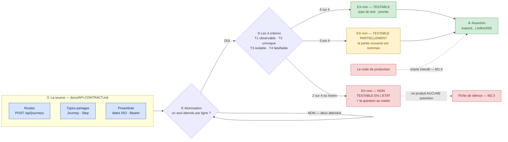
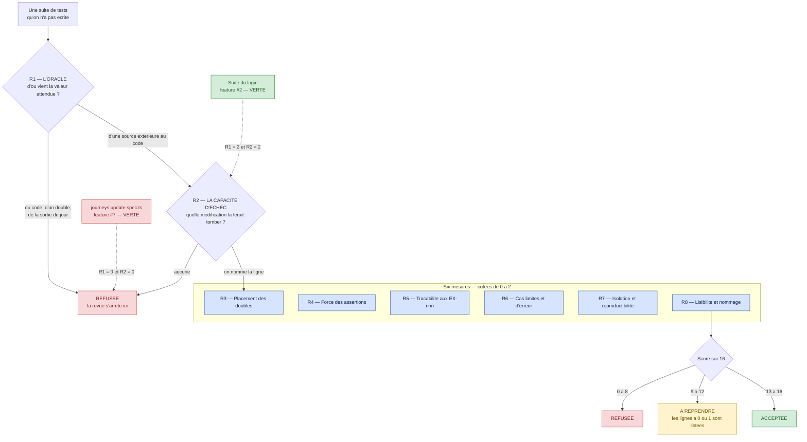
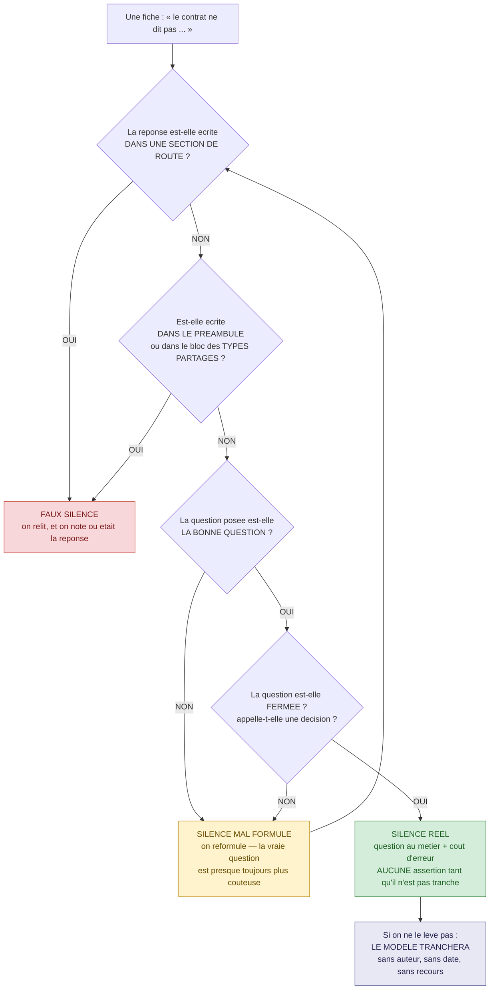

# Module M2 — « De l'exigence au test »

> **Jour 1 · après-midi · 120 min de notions + 60 min de boss · 3 notions**
> *Promesse au participant : « Vous saurez transformer une spécification floue en cas de test
> tracés, et repérer ce que l'IA a comblé toute seule. »*

**Document formateur.** Il se déroule tel quel en séance. Les encadrés 🔐 ne sont jamais projetés.
Référence de vérité du terrain : `00-carte-du-terrain.md`. Contrat d'écriture : `00-gabarit-notion.md`.
Source d'exigences : `docs/API-CONTRACT.md` du dépôt *Carnet de voyage*.

---

## 0. Carte du module

### 0.1 Objectif terminal

> À l'issue de M2, le·a participant·e est capable de **produire, à partir d'un contrat d'API
> réel, une liste d'exigences numérotées et statuées**, de **juger une suite de tests qu'il n'a
> pas écrite avec une grille opposable**, et de **nommer ce que la spécification ne dit pas** —
> avant que l'IA ne le décide à sa place.

C'est le seul objectif terminal du module. Tout le reste y concourt.

### 0.2 Position dans le fil rouge — *L'Expédition*, 🏕️ camp de base

| | |
|---|---|
| **Ce qui existe avant M2** | Le groupe sort de M1. Il sait qu'un test vert peut ne rien garantir, il sait demander « d'où vient l'attendu ? », et il a vu trois tests qualifiés en séance. Ce qu'il ne sait pas encore faire : **produire** l'attendu. Il connaît le mot « oracle » ; il n'a jamais ouvert `docs/API-CONTRACT.md` ligne à ligne. |
| **Ce qui existe après M2** | Trois artefacts entrent dans le carnet de cordée et **y restent jusqu'au J4** : (1) une liste d'exigences numérotées `EX-001…` couvrant les sections *Journeys* et *Steps* du contrat ; (2) la **grille de revue en 8 points**, cotée et opposable ; (3) un jeu de **fiches de silence** sur la zone Z3. Le col J1 peut alors se jouer : ses quatre livrables sont exactement ces trois artefacts plus la matrice du terrain. |
| **Ce que M2 ne fait pas** | On ne prompte pas encore méthodiquement — c'est M3. On ne corrige aucun bug. On n'écrit pas de suite complète : on écrit des **exigences** et des **verdicts**, ce qui n'est pas la même chose et ne se fait pas au même moment. |

### 0.3 Les trois notions

| # | Notion | Modalité (critère) | Durée | Terrain | Micro-évaluation |
|---|---|---|---|---|---|
| **M2.1** | Extraire des exigences testables de `docs/API-CONTRACT.md` | **SOLO** (`C-1`) | 40 | **Z2 · Z3** ⚪ — features #5, #12, #13 | Exercice court (5 min) |
| **M2.2** | La revue en 8 points d'une suite générée | **GRP** (`C-2`) | 40 | **Z1 · Z2** 🟡 + 🟢 — `journeys.update.spec.ts` contre les étalons #1 et #2 | Exercice court (4 min) |
| **M2.3** | Ambiguïtés, silences, contradictions : ce que l'IA comble seule | **INV** (`D-3`) | 40 | **Z3** ⚪ / 🔴 — les silences du contrat sur les étapes | Restitution (20 PR) |

**Rythme** — SOLO · GRP · INV : aucun doublon consécutif (`R-1` ✓) · séquence post-déjeuner
**active** (`R-7` ✓) · la pédagogie inversée du jour est ici (`R-2` ✓) · première ligne de chaque
notion non descendante (`R-6` ✓) · aucune ligne descendante de plus de 12 min sans interaction
(`R-5` ✓) · clôture du module sur une victoire mesurable — le col J1 (`R-8` ✓).

### 0.4 Minutage de la demi-journée

| Créneau | Séquence | Durée | Cumul |
|---|---|---|---|
| 14:00 → 14:40 | **M2.1** — Extraire des exigences testables | 40 | 40 |
| 14:40 → 15:20 | **M2.2** — La revue en 8 points | 40 | 80 |
| 15:20 → 15:35 | **Pause** | 15 | 95 |
| 15:35 → 16:15 | **M2.3** — Ambiguïtés, silences, contradictions | 40 | 135 |
| 16:15 → 17:15 | 🏆 **BOSS J1 — « L'Inventaire »** | 60 | 195 |
| 17:15 → 17:30 | **Le Débrief** — corrigé du col, scoreboard, ce qu'on retient | 15 | 210 |

**Contrôle** : 40 + 40 + 15 + 40 + 60 + 15 = **210 min** ✓
(après-midi conforme à `00-architecture-28h.md` §2).

### 0.5 Points de Repère mobilisables sur le module

| Source | Gain |
|---|---|
| Micro-évaluation M2.1 réussie | 10 PR |
| Micro-évaluation M2.2 réussie | 10 PR |
| Restitution M2.3 jugée complète | 20 PR |
| 🏆 **Col J1 — L'Inventaire** | 0 à 100 PR |
| **Bonus** — défaut non listé, découvert **et prouvé par un test rouge** | +40 PR |
| **Total maximal du module** | **140 PR** *(+40 de bonus)* |

Badges accessibles dans la demi-journée : 🧭 **Le Cartographe** (première cordée à compléter la
matrice des quatre états sur une zone), 🔦 **L'Éclaireur** (première à prouver un bug par un test
rouge), 🎓 **Le Guide** (avoir expliqué une notion à une autre cordée, jugé clair par elle — la
restitution croisée de M2.2 est l'occasion la plus naturelle de la journée).

### 0.6 Préparation matérielle — la veille

| Vérification | Commande / geste | Attendu |
|---|---|---|
| Le contrat est lisible hors écran | impression de `docs/API-CONTRACT.md` | **un exemplaire papier par personne**, agrafé, sections numérotées au stylo |
| Le back démarre | démarrage du backend NestJS | `http://localhost:3000/api` répond |
| La suite back sort bien en rouge | `npm run test:backend` | 2 suites passent, 2 suites échouent |
| Le dossier de livrables existe | création de `carnet/` à la racine du dépôt partagé | vide, versionné |
| Les gabarits sont imprimés | fiche d'exigence (M2.1) · grille 8 points (M2.2) · fiche de silence (M2.3) | 1 jeu par personne pour M2.1 et M2.3, 1 jeu par cordée pour M2.2 |
| Le tableau de la matrice est affiché | 16 lignes × 4 états, format A1 au mur | vierge — il se remplira au col J1 |
| Un compte utilisateur existe | `POST /api/auth/register` | jeton récupérable via `POST /api/auth/login` |

🔐 **Réservé formateur** : `grep -rn "BUG:" backend/src` donne les six bugs. **Ne jamais la
divulguer avant le débrief du col J1** — c'est précisément la mesure de ce que les cordées ont
trouvé sans elle. Voir `boss/boss-J1-inventaire.md` §8.

---

## 1. Notion M2.1 — « Extraire des exigences testables de `docs/API-CONTRACT.md` »

|  |  |
|---|---|
| **Durée** | 40 min |
| **Modalité** | Exercice individuel — **SOLO** guidé |
| **Objectif d'apprentissage** | À l'issue, le·a participant·e est capable de **produire une liste d'exigences numérotées `EX-001…` à partir d'un contrat d'API**, et de **statuer chacune** : testable, testable partiellement, non testable en l'état |
| **Niveau visé (Bloom)** | **Appliquer** |
| **Micro-évaluation** | Exercice court (5 min) |
| **Ancrage fil rouge** | **Z2** et **Z3** ⚪ · sections *Journeys* et *Steps* de `docs/API-CONTRACT.md`, lues pour les features **#5** (détail d'une journey), **#12** (notation) et **#13** (commentaires sur une journey). *Pourquoi ce terrain : ces trois fonctionnalités sont **vierges de tout test** et **sans bug**. Rien ne vient donc parasiter l'exercice — ni un test existant à imiter, ni un défaut à traquer. Le seul matériau est le texte du contrat, ce qui rend l'écart entre lecteurs immédiatement visible.* Ce que la notion fait avancer : le **livrable n° 2 du col J1** (« la liste des exigences testables, numérotées, avec pour chacune : testable oui/non, type de test, priorité »). |
| **Prérequis** | M1.4 — la notion d'oracle admissible est posée |

### ▸ Pourquoi cette modalité

L'objectif est d'**exécuter un geste technique reproductible** : lire une ligne de contrat et en
sortir une exigence numérotée, atomique, vérifiable. Critère `C-1` de `00-grille-modalites.md` —
*« la compétence gestuelle est individuelle. En groupe, un seul apprend. »* C'est vérifiable en
salle : dès qu'on met trois personnes sur un contrat, une seule tape et les deux autres commentent.
Or l'extraction d'exigences ne s'apprend pas en commentant. Elle s'apprend en butant, seul, sur la
question *« est-ce que ça, c'est une exigence ou deux ? »*. Le module est aussi le premier de
l'après-midi : la règle `R-7` impose une séquence active après le déjeuner, et un exercice au
clavier remplit cette condition mieux qu'un exposé sur la traçabilité.

### ▸ Ce qu'il faut avoir compris à la fin

- **Une exigence est atomique** : elle porte **un seul** attendu vérifiable. « 201 avec un
  `Journey` complet **et** 400 si les dates sont incohérentes » n'est pas une exigence, c'en est deux.
- **Une exigence porte une adresse** : la ligne du contrat dont elle sort. Sans adresse, ce n'est
  pas une exigence, c'est une opinion — et l'oracle redevient le code.
- **Statuer vaut autant qu'extraire.** *Testable partiellement* et *non testable en l'état* sont
  des verdicts productifs : ils désignent le travail qui reste à faire côté métier.
- **Les types partagés font partie du contrat.** La moitié des exigences de ce document ne se
  trouve pas dans les routes mais dans le bloc `type Journey` / `type Step`.
- Une exigence numérotée est le **seul objet** qui permette de dire, plus tard, si un test généré
  couvre quelque chose. Sans elle, « couverture » ne veut rien dire.

### ▸ Déroulé minuté

| Temps | Le formateur | Les participants |
|---|---|---|
| **0-4** *(4)* | **OUVERTURE PAR LE DÉFI.** Aucune introduction. Projette **trois lignes** du contrat, celles de `POST /api/journeys` : le body, le `201`, le `400`. « Combien d'exigences testables voyez-vous là-dedans ? Un chiffre, à main levée. » Compte les mains, écrit la distribution au tableau. Révèle : **trois au minimum, et une quatrième si l'on ouvre le bloc des types**. | Votent. La salle se disperse entre 1 et 3. Constatent que la dispersion porte sur **trois lignes de texte** — et que personne ne peut avoir raison contre les autres sans une règle d'écriture. |
| **4-8** *(4)* | **LA FICHE D'EXIGENCE ET LES QUATRE CRITÈRES.** Distribue le gabarit papier. Projette les six colonnes et les **quatre critères de testabilité** (voir Contenu §2). Un exemple traité à voix haute, `EX-008`, en 60 secondes. | Reçoivent le gabarit, notent les quatre critères. Une question tombe presque toujours : *« et si le contrat est ambigu ? »* → réponse en une phrase : *« vous le statuez “non testable en l'état” et vous écrivez la question. C'est la notion M2.3, dans une heure. »* |
| **8-20** *(12)* | **SOLO 1 — LA SECTION *JOURNEYS*.** Chacun au clavier ou au papier, seul. Cinq routes à traiter. Le formateur **circule et ne donne aucune exigence** : il ne répond qu'aux questions de forme. Chronomètre affiché. Relance unique à 6 min : « ceux qui en ont moins de huit : vous fusionnez trop. Une ligne de contrat, plusieurs exigences. » | Produisent `EX-001` à `EX-015`. Butent sur `PATCH` (body partiel = combien d'exigences ?) et sur la ligne « sans le détail des steps » de `GET /api/journeys`. |
| **20-24** *(4)* | **POINT D'ÉTAPE CROISÉ.** Fait échanger les feuilles deux à deux. Une seule consigne : « comptez les exigences de votre voisin, et entourez celles qu'il a et que vous n'avez pas. » Relève au tableau le **nombre** trouvé par chacun, sans commenter les contenus. | Échangent, comptent, découvrent l'écart. L'amplitude est typiquement de 6 à 16 exigences pour la même section. C'est le moment le plus utile de la notion. |
| **24-32** *(8)* | **SOLO 2 — LA SECTION *STEPS*, AVEC STATUT.** Nouvelle consigne, plus dure : « quatre routes, et cette fois **vous statuez** chaque exigence : testable / testable partiellement / non testable en l'état. » Le formateur ne circule plus : il note au tableau les trois statuts et se tait. | Produisent `EX-016` à `EX-028`. Rencontrent les premiers silences — les codes d'erreur absents, le format des photos, la provenance d'`authorId`. **Personne ne le leur a annoncé.** |
| **32-37** *(5)* | **MICRO-ÉVALUATION.** Projette l'énoncé en trois lignes, chronomètre 4 min, corrige en 1 min avec les cases à cocher. | Font l'exercice court, seuls. Échangent leur feuille avec le voisin pour la correction croisée. |
| **37-40** *(3)* | **SYNTHÈSE — la parole est aux participants.** « En une phrase, sans vos notes : à quoi sert un numéro `EX-nnn` ? » Fait parler trois personnes, n'ajoute rien, enchaîne sur M2.2. | Formulent. Réponse attendue : *« à pouvoir dire, plus tard, si un test couvre quelque chose — et lequel. »* |

**Contrôle : 4 + 4 + 12 + 4 + 8 + 5 + 3 = 40 min ✓**

### ▸ Contenu à transmettre

**1. Ce qu'est une exigence testable.** Une phrase qui décrit **un seul** comportement observable
du système, avec un déclencheur, un résultat attendu, et une source. Elle s'écrit sur six colonnes :

| Colonne | Contenu | Exemple |
|---|---|---|
| **#** | Identifiant stable, jamais réattribué | `EX-008` |
| **Exigence** | Une phrase, un attendu | *La création d'un voyage dont `endDate` précède `startDate` est refusée avec un statut 400.* |
| **Source** | L'adresse dans le contrat | `API-CONTRACT.md` §Journeys, `POST /api/journeys` |
| **Statut** | Testable · Testable partiellement · Non testable en l'état | Testable |
| **Type de test** | TU · API (supertest) · Front (Vitest/RTL) · E2E (Playwright) · Contrat externe | API |
| **Priorité** | Haute · Moyenne · Basse — par **coût d'erreur**, pas par difficulté | Haute |

**2. Les quatre critères de testabilité.** Une exigence est testable si et seulement si les quatre
répondent oui. Un seul non fait basculer en *partiellement* ; deux, en *non testable en l'état*.

| # | Critère | La question | Contre-exemple dans ce contrat |
|---|---|---|---|
| **T1** | **Observable** | Le résultat est-il visible depuis l'extérieur du système ? | *« Pas d'envoi réel »* sur `forgot-password` : observable seulement par l'effet de bord fichier. |
| **T2** | **Univoque** | Deux lecteurs en tireraient-ils le même attendu ? | *« Toutes les routes protégées attendent un jeton »* — **la liste des routes protégées n'existe pas**. |
| **T3** | **Isolable** | Peut-on l'atteindre sans dépendre d'un autre comportement non spécifié ? | L'ajout d'un commentaire d'étape suppose un voyage et une étape : isolable, mais coûteux à monter. |
| **T4** | **Falsifiable** | Existe-t-il un cas où le système échoue et où le test le dirait ? | *« Retourne un `Journey` mis à jour »* seul n'est pas falsifiable : n'importe quel corps de réponse le satisfait. |

**3. La règle d'atomisation.** Une ligne de contrat produit autant d'exigences qu'elle contient
d'attendus indépendants. Trois signaux de découpage : la conjonction **« et »**, l'énumération de
champs, et **tout second code de statut**. Sur `POST /api/journeys`, les trois lignes en produisent
trois — plus une quatrième issue du type `Journey` (les champs `id`, `ownerId`, `rating: null`,
`comments: []`, `steps: []` de la réponse).

**4. Le piège central : le contrat n'est pas seulement fait de routes.** Le bloc *Types partagés*
est **normatif**. C'est lui, et lui seul, qui dit que le commentaire d'une **étape** porte un
`authorId: string` **non nullable**, alors que le commentaire d'un **voyage** n'en porte pas du
tout. Cette asymétrie n'est écrite nulle part ailleurs, et elle porte le bug #14.

**5. Ce que cela change avec l'IA.** Trois résultats convergents.

- La qualité des tests générés **suit celle des exigences fournies**, dans une proportion
  spectaculaire : sur une étude industrielle, le rappel passe de **0,81** à **0,37** selon la
  qualité du référentiel d'entrée.
- Une exigence détaillée produit des scénarios de haute qualité ; une user story seule produit des
  scénarios de faible qualité — le facteur limitant n'est pas le modèle, c'est l'entrée.
- Fournir des exigences **numérotées** rend la couverture mesurable : on peut exiger que chaque
  `it` porte son identifiant, et compter par une commande.

**6. La phrase à faire noter.**

> *On ne demande jamais à l'IA « écris les tests ». On lui demande « couvre `EX-005` à `EX-012` ».
> La différence entre les deux formulations est tout le métier.*

*(≈ 590 mots)*

### ▸ 🖼️ Diagramme — `diagrammes/M2-1-de-la-ligne-a-l-assertion.svg`

#### Source Mermaid



#### Descriptif du SVG à produire

Format paysage 1600 × 900, imprimable en A4 paysage et lisible vidéoprojeté à 6 m. Lecture de
gauche à droite en quatre bandes verticales séparées par des filets gris clair, numérotées
**①②③④** en chiffres cerclés. Bande ① : un cadre bleu **« La source »** contenant **trois**
pastilles empilées — *Routes*, *Types partagés*, *Préambule* — de taille identique, pour
signifier qu'elles ont **le même poids normatif**. Bande ② : un losange **« Atomisation »** avec
une **boucle de retour sur lui-même** légendée *« deux attendus → on recoupe »* : cette boucle est
l'élément visuel le plus important du schéma. Bande ③ : un losange **« Les 4 critères »** avec
**trois** sorties de couleurs distinctes menant à trois rectangles — vert *Testable*, jaune
*Testable partiellement*, rouge *Non testable en l'état*. Bande ④ : un unique rectangle vert
**« Assertion »**, atteint par le vert et le jaune ; le rouge, lui, part **vers le bas** en trait
pointillé vers une pastille grise *« Fiche de silence — M2.3 »*, et **n'atteint jamais**
l'assertion. En bas à gauche, détachée, une pastille rouge **« Le code de production »** avec une
flèche pointillée barrée d'une croix vers l'assertion, légendée *« oracle interdit — M1.4 »*.
Aucune icône décorative. Police sans empattement, taille minimale 20 px à l'échelle du fichier.

#### Explication du diagramme — notice de dévoilement

| Ordre | Ce qu'on affiche | La phrase à dire | Ce qu'on attend en retour |
|---|---|---|---|
| 1 | **La bande ① seule** | « Trois sources, même poids. La plupart d'entre vous n'en liront que la première. La moitié des exigences de ce contrat est dans les deux autres. » | Quelqu'un rouvre le document à la page des types. C'est le but. |
| 2 | **La boucle de la bande ②** | « Cette flèche qui revient sur elle-même, c'est le geste que vous allez faire dix fois dans le quart d'heure qui vient. Tant qu'il reste un “et”, on recoupe. » | Silence, ou une question sur le nombre attendu d'exigences. Ne pas donner le chiffre. |
| 3 | **La bande ③ complète** | « Trois sorties, pas deux. “Non testable en l'état” n'est pas un échec de votre part : c'est un résultat, et il a un destinataire — le métier. » | Soulagement visible chez ceux qui bloquaient. |
| 4 | **Le trait pointillé vers la fiche de silence** | « Regardez où va le rouge : nulle part vers une assertion. Une exigence non décidable ne produit **jamais** de test. Elle produit une question. » | Le pont avec M2.3 est posé. Ne pas développer. |
| 5 | **La pastille du bas** | « Et voilà la sortie interdite de ce matin. Quand une exigence manque, la tentation est de regarder le code pour savoir ce qui est “normal”. C'est là qu'on fabrique un test tautologique. » | Fin du dévoilement. |

⚠️ **Erreur d'interprétation à prévenir.** Le schéma sera lu comme une chaîne de production
industrielle où chaque ligne de contrat descend mécaniquement vers une assertion. Le corriger à
l'étape 3 : *« il n'y a pas de rendement à atteindre. Une section de contrat qui produit
quatre exigences testables et six silences est une **bonne** analyse, pas une mauvaise. »* Sans
cette précision, les participants forcent le statut « testable » pour ne pas avoir l'air en
retard, et l'exercice perd tout son intérêt.

### ▸ 📋 La liste de référence — corrigé du formateur

> 🔐 **Ne pas distribuer avant la fin du col J1.** C'est le corrigé du livrable n° 2 du col.
> Extraction exhaustive des sections **Journeys** et **Steps** de `docs/API-CONTRACT.md`,
> types partagés inclus. **28 exigences.** Une cordée qui en produit 25 sur 28 atteint le seuil
> de 90 % du barème du col.

**Légende des statuts** : ✅ testable · 🟨 testable partiellement · ⛔ non testable en l'état.
**Types de test** : `TU` unitaire Jest · `API` supertest sur l'application NestJS ·
`E2E` Playwright · `CTR` test de contrat externe.

#### §Journeys — `GET /api/journeys`

| # | Exigence | Statut | Type | Prio. | Feature |
|---|---|---|---|---|---|
| **EX-001** | L'accès à `GET /api/journeys` sans jeton d'authentification est refusé. | 🟨 *(le code de refus n'est pas spécifié)* | API | Haute | #4 |
| **EX-002** | `GET /api/journeys` retourne **uniquement** les journeys de l'utilisateur connecté. | ✅ | API | Haute | #4 |
| **EX-003** | La réponse en cas de succès est un statut 200 et un tableau de `Journey`. | ✅ | API | Haute | #4 |
| **EX-004** | Chaque élément de la liste est un **résumé** : `id`, `title`, `startDate`, `endDate`, `destination`, `rating` — **sans** le détail des `steps`. | ✅ | API | Moyenne | #4 |

#### §Journeys — `GET /api/journeys/:id`

| # | Exigence | Statut | Type | Prio. | Feature |
|---|---|---|---|---|---|
| **EX-005** | `GET /api/journeys/:id` retourne 200 et un `Journey` **complet**, `steps[]` et `comments[]` présents. | ✅ | API | Haute | **#5** |
| **EX-006** | Le `Journey` retourné est conforme au type partagé : `id`, `ownerId`, `title`, `startDate`, `endDate`, `destination{name,lat,lng}`, `rating: number \| null`, `comments[]`, `steps[]`. | ✅ | API + TU | Haute | #5 |

#### §Journeys — `POST /api/journeys`

| # | Exigence | Statut | Type | Prio. | Feature |
|---|---|---|---|---|---|
| **EX-007** | La création accepte un corps `{ title, startDate, endDate, destination: { name, lat, lng } }`. | ✅ | API | Haute | #6 |
| **EX-008** | **Une création dont `endDate` précède `startDate` est refusée avec un statut 400.** | ✅ | API | **Haute** | **#6** 🔴 |
| **EX-009** | Une création valide retourne 201 et le `Journey` créé, avec `rating: null`, `comments: []` et `steps: []`. | ✅ | API | Haute | #6 |
| **EX-010** | Les dates transmises sont des chaînes ISO 8601 au format `YYYY-MM-DD`. | ✅ *(règle du préambule)* | API + TU | Moyenne | transversal |

#### §Journeys — `PATCH /api/journeys/:id`

| # | Exigence | Statut | Type | Prio. | Feature |
|---|---|---|---|---|---|
| **EX-011** | La mise à jour accepte un corps **partiel** : chacun de `title`, `startDate`, `endDate`, `destination`, `rating` peut être fourni seul. | ✅ | API | Haute | #7 |
| **EX-012** | Une mise à jour valide retourne 200 et le `Journey` mis à jour. | ✅ | API | Haute | #7 |
| **EX-013** | **Une mise à jour partielle ne perd pas les `steps` existants.** | ✅ | API + TU | **Haute** | **#7** 🔴🟡 |
| **EX-014** | Le champ `rating` est modifiable par cette route ; son type est `number \| null`. | 🟨 *(aucune borne n'est spécifiée — voir M2.3)* | API | Moyenne | **#12** |

#### §Journeys — `POST /api/journeys/:id/comments`

| # | Exigence | Statut | Type | Prio. | Feature |
|---|---|---|---|---|---|
| **EX-015** | L'ajout d'un commentaire accepte un corps `{ author, text }`. | ✅ | API | Moyenne | **#13** |
| **EX-016** | L'ajout retourne 201 et le `Journey` mis à jour, le nouveau commentaire **présent dans `comments[]`**. | ✅ | API | Haute | **#13** |
| **EX-017** | Le commentaire ajouté porte `id`, `author`, `text` et `createdAt` — et **aucun `authorId`**, contrairement au commentaire d'étape. | ✅ *(type partagé)* | API + TU | Moyenne | #13 |

#### §Steps — `POST /api/journeys/:journeyId/steps`

| # | Exigence | Statut | Type | Prio. | Feature |
|---|---|---|---|---|---|
| **EX-018** | L'ajout d'une étape accepte un corps `{ name, placeName, lat, lng, startDate?, endDate? }`. | ✅ | API | Haute | #8 |
| **EX-019** | L'ajout retourne 201 et le `Journey` mis à jour. | ✅ | API | Haute | #8 |
| **EX-020** | **La nouvelle étape est ajoutée à la fin de `steps[]`** — la preuve exige **deux** insertions successives. | ✅ | API + TU + E2E | **Haute** | **#8** 🔴 |
| **EX-021** | `startDate` et `endDate` d'une étape sont facultatifs ; leur type est `string \| null`. | ✅ *(type partagé)* | API + TU | Moyenne | #8 |
| **EX-022** | Une étape créée porte `id`, `name`, `placeName`, `lat`, `lng`, `photos: []` et `comments: []`. | ✅ *(type partagé)* | API | Moyenne | #8 |

#### §Steps — `PATCH /api/journeys/:journeyId/steps/:stepId`

| # | Exigence | Statut | Type | Prio. | Feature |
|---|---|---|---|---|---|
| **EX-023** | La mise à jour d'une étape accepte un corps partiel `{ name?, placeName?, lat?, lng?, startDate?, endDate? }`. | ✅ | API | Haute | #9 |
| **EX-024** | Une mise à jour valide retourne 200 et le `Journey` mis à jour. | ✅ | API | Moyenne | #9 |
| **EX-025** | **Le champ `endDate` d'une étape est effectivement pris en compte par la mise à jour** — la preuve exige de **relire** l'étape après l'appel. | ✅ | API | **Haute** | **#9** 🔴 |

#### §Steps — `POST /api/journeys/:journeyId/steps/:stepId/photos`

| # | Exigence | Statut | Type | Prio. | Feature |
|---|---|---|---|---|---|
| **EX-026** | L'ajout d'une photo se fait en `multipart/form-data`, sur le champ `file`, et retourne 201 avec le `Journey` mis à jour. | ✅ | API | Moyenne | #10 |
| **EX-027** | La photo ajoutée apparaît dans `steps[i].photos[]` sous la forme d'un chemin **relatif** préfixé `/uploads/`. | 🟨 *(le motif exact du chemin n'est pas spécifié)* | API | Moyenne | #10 |

#### §Steps — `POST /api/journeys/:journeyId/steps/:stepId/comments`

| # | Exigence | Statut | Type | Prio. | Feature |
|---|---|---|---|---|---|
| **EX-028** | **Le commentaire d'étape ajouté porte un `authorId` de type `string`, non nul.** | ✅ *(type partagé + mention explicite de la route)* | API + TU | **Haute** | **#14** 🔴 |

#### Les trois exigences que presque personne n'écrit — et qui font la différence au col

| # | Ce qui est manqué | Pourquoi | Où elle se trouve |
|---|---|---|---|
| **EX-004** | *« sans le détail des `steps` »* | Lu comme une remarque de style, pas comme un attendu. C'est pourtant **falsifiable** : une réponse qui embarque les étapes viole le contrat. | §Journeys, `GET /api/journeys`, entre parenthèses |
| **EX-017** | L'**absence** d'`authorId` sur le commentaire de voyage | On n'extrait pas facilement une exigence négative. Elle est pourtant essentielle : elle prouve que l'asymétrie avec l'étape est **voulue**. | §Types partagés, `type Journey` |
| **EX-028** | `authorId: string` **non nullable** | Le mot « non nullable » n'est écrit nulle part : il se **déduit** de l'absence de `\| null` dans le type. C'est la lecture la plus fine du document. | §Types partagés, `type Step` |

**Ce que la liste ne contient pas — et pourquoi.** Aucune exigence n'est écrite sur les codes
d'erreur des routes `steps` (401, 403, 404), sur l'autorisation d'un utilisateur à modifier le
voyage d'un autre, sur la suppression, sur la pagination, ni sur le format des photos.
**Ce n'est pas un oubli du corrigé : ce sont les silences du contrat**, et ils font l'objet
entier de la notion M2.3. Une cordée qui les écrit comme des exigences en statut ⛔, avec la
question au métier, ne perd aucun point : elle en gagne au col.

### ▸ 🔍 Démonstration — trois lignes de contrat, quatre exigences, un test

**Point de départ.** Le contrat est projeté sur la section `POST /api/journeys`. Rien d'autre
n'est ouvert : ni le service, ni les tests existants. C'est la contrainte de la démonstration et
il faut la dire à voix haute — *« je n'ouvre pas le code, et vous allez voir que ce n'est pas une
coquetterie »*.

**Le geste exact — temps 1 : la lecture.** Les trois lignes du contrat, lues à voix haute :

```
POST /api/journeys
Body: { title, startDate, endDate, destination: { name, lat, lng } }
201 → Journey
400 si endDate < startDate (validation attendue — voir bug injecté feature #6).
```

**Le geste exact — temps 2 : l'atomisation, au tableau, avec la salle.**

| Attendu isolé | Devient |
|---|---|
| le corps accepté | `EX-007` |
| le refus des dates incohérentes | `EX-008` |
| la réponse de succès | `EX-009` |
| la forme du `Journey` retourné *(bloc des types)* | inclus dans `EX-009`, détaillé par `EX-006` |

**Le geste exact — temps 3 : deux exigences deviennent deux `it`.** On écrit au tableau, en
TypeScript, la squelette de la suite — **sans corps d'assertion inventé** :

```ts
import { Test } from '@nestjs/testing';
import * as request from 'supertest';
import { INestApplication } from '@nestjs/common';

describe('POST /api/journeys', () => {
  let app: INestApplication;
  let token: string;

  // EX-009 — création valide : 201 et Journey conforme au type partagé
  it('EX-009 — crée un voyage et retourne 201 avec un Journey complet', async () => {
    const res = await request(app.getHttpServer())
      .post('/api/journeys')
      .set('Authorization', `Bearer ${token}`)
      .send({
        title: 'Islande',
        startDate: '2026-08-01',
        endDate: '2026-08-15',
        destination: { name: 'Reykjavik', lat: 64.1466, lng: -21.9426 },
      });

    expect(res.status).toBe(201);
    expect(res.body).toMatchObject({ title: 'Islande', rating: null });
    expect(res.body.steps).toEqual([]);
    expect(res.body.comments).toEqual([]);
  });

  // EX-008 — le refus contractuel : c'est CETTE assertion qui prouve le bug #6
  it('EX-008 — refuse une endDate antérieure à la startDate avec un 400', async () => {
    const res = await request(app.getHttpServer())
      .post('/api/journeys')
      .set('Authorization', `Bearer ${token}`)
      .send({
        title: 'Voyage impossible',
        startDate: '2026-08-15',
        endDate: '2026-08-01',
        destination: { name: 'Reykjavik', lat: 64.1466, lng: -21.9426 },
      });

    expect(res.status).toBe(400); // ← l'attendu vient du contrat, pas du code
  });
});
```

**Le résultat obtenu.** Le premier `it` passe. **Le second échoue** — et c'est le résultat
recherché :

```
FAIL  backend/src/journeys/journeys.create-validation.spec.ts
  ● POST /api/journeys · EX-008 — refuse une endDate antérieure à la startDate

    expected 400 "Bad Request", got 201 "Created"
```

**Ce que l'exemple révèle.** Deux exigences issues de **la même ligne de contrat**, écrites par la
même personne, en trois minutes : l'une valide le produit, l'autre le met en cause. Aucune des deux
n'a exigé de lire `journeys.service.ts`. C'est la démonstration opérationnelle de M1.4 : **le
numéro `EX-008` est l'adresse de l'oracle**. Et c'est aussi la réponse à ceux qui trouvent la
numérotation bureaucratique — sans `EX-008`, ce test rouge est un test « à réparer » ; avec
`EX-008`, c'est une **preuve**, et son ajustement coûte **−40 PR**.

**Ce qui peut rater, et le repli associé.**

| Risque | Signe | Repli |
|---|---|---|
| Le back n'est pas démarré | `ECONNREFUSED` sur supertest | Projeter la sortie de `npm run test:backend -- journeys.create-validation`, préparée la veille : elle contient déjà le `expected 400, got 201` |
| Une cordée annonce le bug #6 avant la fin | le suspense tombe | Aucune importance ici : le bug #6 est **déjà connu** depuis M1.4. La démonstration porte sur la **traçabilité**, pas sur la découverte |
| Le débat « et si le contrat est faux ? » s'installe | le temps file | Réponse en une phrase — *« alors le test est juste, et c'est le contrat qu'on corrige, jamais l'assertion en silence »* — et renvoi explicite à M2.3 |
| Un participant veut ouvrir le service pour « vérifier » | main levée, demande explicite | L'accueillir, puis refuser publiquement : *« si vous l'ouvrez, vous ne pourrez plus jamais dire d'où vient votre attendu. »* |

### ▸ ✅ Micro-évaluation — Exercice court (5 min)

**Énoncé** *(trois lignes, projeté et distribué)*

> Voici la route `POST /api/journeys/:journeyId/steps/:stepId/comments` du contrat.
> 1. Écrivez **toutes** les exigences qu'elle produit, numérotées.
> 2. Pour chacune : le statut (✅ / 🟨 / ⛔) et **la source exacte** dans le document.

**Matériel** — l'extrait ci-dessous projeté et distribué, plus le bloc *Types partagés* du contrat,
déjà entre les mains des participants. Une feuille par personne. Correction croisée avec le voisin.

```
POST /api/journeys/:journeyId/steps/:stepId/comments
Body: { author, text }
201 → Journey mis à jour avec le commentaire ajouté à steps[i].comments[], incluant authorId
(voir bug injecté feature #14 : authorId ne doit pas être null).
```

```ts
// Rappel du bloc Types partagés, fourni avec l'énoncé
comments: Array<{ id: string; author: string; authorId: string; text: string; createdAt: string }>;
```

**Résultat attendu vérifiable** *(cases à cocher, contrôle en moins de 60 secondes)*

- [ ] **Au moins trois** exigences distinctes ont été écrites — pas une seule phrase fourre-tout.
- [ ] L'une d'elles porte sur **`authorId` non nul**, et sa source citée est **le bloc des types**
      (ou la mention explicite de la route), **pas** le commentaire `// BUG:`.
- [ ] L'une d'elles porte sur la **présence du commentaire dans `steps[i].comments[]`** — donc sur
      la longueur du tableau, pas sur son existence.
- [ ] Au moins un statut 🟨 ou ⛔ apparaît, accompagné d'une question *(les codes d'erreur ne sont
      pas spécifiés : que répond l'API si `stepId` n'existe pas ?)*.

**Solution de référence**

| # | Exigence | Statut | Source |
|---|---|---|---|
| **EX-a** | L'ajout accepte un corps `{ author, text }`. | ✅ | §Steps, ligne *Body* |
| **EX-b** | L'ajout retourne 201 et le `Journey` mis à jour. | ✅ | §Steps, ligne *201* |
| **EX-c** | Le commentaire ajouté est **présent dans `steps[i].comments[]`** de l'étape ciblée, et nulle part ailleurs. | ✅ | §Steps, ligne *201* |
| **EX-d** | Le commentaire porte un `authorId` de type `string`, **non nul**. | ✅ | §Types partagés, `type Step` — absence de `\| null` |
| **EX-e** | Le commentaire porte également `id`, `author`, `text`, `createdAt`. | ✅ | §Types partagés |
| **EX-f** | La provenance d'`authorId` n'est pas spécifiée : le corps de la requête n'en contient pas. | ⛔ | *silence* — question au métier |
| **EX-g** | Le comportement attendu si `journeyId` ou `stepId` n'existe pas n'est pas spécifié. | ⛔ | *silence* — question au métier |

**L'erreur que 80 % des groupes commettent.** Ils écrivent **une seule** exigence : *« un
commentaire est ajouté à l'étape avec son auteur »*. Elle est vraie, elle est illisible, et elle
est **intestable** : rien ne dit ce qu'on vérifie. Le faire constater en demandant, à voix haute,
*« écrivez-moi l'assertion de cette exigence »* — personne n'y arrive en une ligne. Puis conclure :
**une exigence qu'on ne peut pas transformer en un `expect` n'est pas une exigence, c'est un
résumé.** La deuxième erreur, plus subtile, consiste à citer le commentaire `// BUG:` du code
source comme source de l'exigence sur `authorId` : c'est reprendre **le code** comme oracle, en
plus confortable. La source recevable est le type.

### ▸ 🔗 Ressources

| Ressource | À qui elle s'adresse | Ce qu'il faut y lire précisément |
|---|---|---|
| *Generating High-Level Test Cases from Requirements using LLM: An Industry Study* — https://arxiv.org/abs/2510.03641 | **La référence chiffrée de la notion** | L'écart de macro-rappel entre deux référentiels d'exigences : **0,81** contre **0,37**. Le facteur limitant n'est pas le modèle, c'est la qualité de l'entrée. |
| *APITestGenie: Generating Web API Tests from Requirements and API Specifications with LLMs* — https://arxiv.org/abs/2604.02039 | Celui qui veut industrialiser | Le couple « exigences + spécification d'API » en entrée : **89 % des exigences produisent un script valide en trois tentatives ou moins**. C'est exactement le geste enseigné ici. |
| *Acceptance Test Generation with Large Language Models: An Industrial Case Study* — https://arxiv.org/abs/2504.07244 | Celui qui doit chiffrer une promesse | **95 %** des scénarios jugés utiles, **92 %** des tests utiles, mais **60 % seulement utilisables tels quels** : le taux de relecture humaine à budgéter. |
| *ISO/IEC/IEEE 29119-3 — Software testing, Part 3: Test documentation* — https://www.iso.org/standard/79429.html | **La référence normative** | Les gabarits de documentation de test. Utile pour justifier, en interne, que la fiche d'exigence à six colonnes n'est pas une invention de formateur. |
| *ISTQB CTFL Syllabus v4.0.1* — https://istqb.org/wp-content/uploads/2024/11/ISTQB_CTFL_Syllabus_v4.0.1.pdf | Celui qui prépare la certification | Le chapitre sur les techniques de conception : où se situe l'extraction d'exigences dans le processus de test, et le vocabulaire officiel de la traçabilité. |
| *OpenAPI Specification* — https://spec.openapis.org/oas/latest.html | Celui qui veut supprimer l'étape manuelle | Le format canonique. Ce que `docs/API-CONTRACT.md` fait en Markdown, une spécification OpenAPI le rend **machine-lisible** — et l'extraction devient partiellement automatisable. |
| *TraceLLM: leveraging LLMs with prompt engineering for enhanced requirements traceability* — https://link.springer.com/article/10.1007/s00766-026-00460-1 | Le curieux | La traçabilité exigences ↔ artefacts évaluée sur 8 modèles et 4 jeux de données : ce que la numérotation `EX-nnn` rend possible en aval. |

### ▸ ⚠️ Pièges d'animation

- **Ce qui rate habituellement** : l'exercice devient un concours de volume. Une personne annonce
  « j'en ai trente-deux » et la salle se démoralise. Couper court **avant** le point d'étape :
  *« on ne compte pas les exigences, on compte celles qui portent une adresse. Une exigence sans
  source ne vaut rien au col. »* Le point d'étape croisé de la minute 20 sert exactement à ça :
  il fait apparaître que les écarts portent sur des **oublis**, pas sur des découpages plus fins.
- **La question qui revient toujours** : *« on numérote dans quel ordre ? »* Réponse courte :
  *« dans l'ordre du document, et on ne renumérote jamais. Un identifiant qui bouge ne trace
  rien. »* Si une exigence est supprimée, son numéro reste vacant.
- **Le risque de blocage** : certains participants restent quinze minutes sur `PATCH` parce que le
  corps partiel les paralyse. La règle de déblocage à donner en circulant : *« un champ facultatif
  = une exigence “ce champ peut être fourni seul”, pas cinq exigences. Le détail par champ, c'est
  du cas de test, pas de l'exigence. »*
- **Le signe qu'il faut passer à la suite** : dès qu'un participant écrit spontanément un statut
  ⛔ **avec la question au métier** au lieu de forcer un « testable », la notion a produit son
  effet. Ne pas prolonger le SOLO 2 : les silences seront traités en M2.3, et c'est mieux ainsi.

---

## 2. Notion M2.2 — « La revue en 8 points d'une suite générée »

|  |  |
|---|---|
| **Durée** | 40 min |
| **Modalité** | Exercice de groupe — **GRP** avec restitution croisée |
| **Objectif d'apprentissage** | À l'issue, le·a participant·e est capable d'**appliquer une grille de revue en 8 points à une suite de tests qu'il n'a pas écrite**, de la **coter**, et de **rendre un verdict argumenté** — accepté, à reprendre, refusé — devant contradiction |
| **Niveau visé (Bloom)** | **Évaluer** |
| **Micro-évaluation** | Exercice court (4 min) |
| **Ancrage fil rouge** | **Z2** 🟡 `backend/src/journeys/journeys.update.spec.ts` confronté aux **deux étalons de Z1** : la suite unitaire de la feature **#1** (*Création de compte*) et la suite unitaire **et** end-to-end de la feature **#2** (*Login*). *Pourquoi ce trio : les trois suites sont **vertes**. Même dépôt, même équipe, même style d'écriture, même framework. Aucun indice extérieur ne permet de les départager — ni la couleur, ni la longueur, ni le nom des tests. Seule une grille appliquée ligne à ligne les sépare. C'est la seule configuration où l'on peut prouver qu'une grille sert à quelque chose.* Ce que la notion fait avancer : le **livrable n° 4 du col J1** (« trois tests suspects, avec l'explication de pourquoi on les suspecte ») et, plus loin, le classement des échecs du col J3. |
| **Prérequis** | M1.1 (les quatre questions de détection), M1.4 (l'oracle), M2.1 (les exigences numérotées) |

### ▸ Pourquoi cette modalité

L'objectif est d'**enchaîner plusieurs gestes en autonomie** : lire une suite, la coter sur huit
axes, et défendre le verdict. Critère `C-2` de `00-grille-modalites.md` — *« on fait seul, on
explique à un autre : l'explication révèle les trous. »* C'est exactement ce qui se passe ici : une
cordée cote sa suite en douze minutes avec l'impression d'avoir tout vu, puis se retrouve à
l'expliquer à une cordée qui n'a pas lu le fichier — et découvre en parlant qu'elle a coté `R3`
sans savoir dire *ce qui restait de réel*. La restitution croisée n'est pas un exercice de
communication : c'est le mécanisme de détection des cotations creuses. Le format groupe est en
outre imposé par la nature de l'objet : **une revue est un acte collectif** dans la vie
professionnelle, et une grille qui ne survit pas à la contradiction d'un pair ne survivra pas
davantage à une revue de code réelle. La notion suit un SOLO (`R-1` respecté).

### ▸ Ce qu'il faut avoir compris à la fin

- Une revue de tests **se cote**, elle ne se commente pas. Un avis non coté n'est pas opposable en
  revue de code, et il ne résiste pas à un désaccord.
- **Deux des huit points sont éliminatoires** : l'oracle (`R1`) et la capacité d'échec (`R2`).
  Une suite qui échoue sur l'un des deux est **refusée**, quelles que soient ses six autres notes.
- Les six points restants ne servent pas à sauver une suite : ils servent à **dire quoi corriger**
  et dans quel ordre.
- La grille se remplit **sans exécuter la suite**, puis se vérifie **en l'exécutant**. Les deux
  temps donnent parfois des verdicts opposés : c'est le signe d'un sur-mock.
- Cette grille est un **artefact d'équipe** : elle se colle dans le dépôt, elle est citée en revue
  de PR, et elle devient le bloc « style attendu » du prompt de génération en M3.2.

### ▸ Déroulé minuté

| Temps | Le formateur | Les participants |
|---|---|---|
| **0-4** *(4)* | **OUVERTURE PAR LE VOTE.** Projette **trois sorties de suite, toutes vertes**, sans nommer les fichiers : la suite unitaire de la feature #1, celle de la feature #2, et celle de la feature #7. « Trois suites. Trois verts. L'une des trois ne garantit rien du tout. Laquelle ? Vote à main levée, puis dites-moi **avec quoi** vous avez tranché. » | Votent. Se répartissent à peu près au hasard. Réalisent, en essayant de justifier, qu'ils n'ont **aucun critère** — seulement le souvenir de M1.1. |
| **4-10** *(6)* | **CONSTRUCTION DE LA GRILLE.** Ne donne pas les huit points : les fait sortir. Écrit au tableau les **quatre questions de M1.1** comme socle acquis, puis : « qu'est-ce que ces quatre questions ne voient pas ? » Récolte 4 à 6 propositions, les regroupe, **puis** projette la grille consolidée à 8 points en montrant où chaque proposition a atterri. | Proposent : les cas d'erreur, la traçabilité aux exigences, le nettoyage, la lisibilité. Voient leurs propres mots réapparaître dans la grille projetée — c'est ce qui la rend adoptable. |
| **10-22** *(12)* | **LA REVUE EN CORDÉES.** Distribue **une** suite par cordée (tirage : #1, #2, #7) et la grille imprimée. Rôles imposés : **Pilote** au clavier, **Copilote** tient la grille et refuse toute cotation sans preuve citée, **Rapporteur** prépare la restitution. Consigne : « cotez d'abord **sans exécuter**. Vous exécuterez à la minute 8, et vous noterez si une cotation change. » Circule, ne tranche rien. | Cotent les 8 lignes de 0 à 2, citent une ligne de code ou de contrat par cotation. À l'exécution, la cordée qui tient la feature #7 constate que **rien ne change** : le vert ne modifie aucune cotation. Malaise utile. |
| **22-29** *(7)* | **LA RESTITUTION CROISÉE.** Chaque Rapporteur présente sa suite **à une cordée qui ne l'a pas lue**, en 2 min, grille à l'appui. La cordée qui écoute a une obligation : **contester au moins une cotation** et exiger la preuve. Le formateur chronomètre et n'intervient pas. | Présentent, contestent, révisent. C'est ici que les cotations creuses tombent — typiquement `R3` et `R7`, cotées 2 sans que personne ne sache dire ce qui restait de réel. |
| **29-33** *(4)* | **L'ARBITRAGE ET LA RÈGLE DU VETO.** Projette la cotation de référence des trois suites (§Grille de référence remplie). Énonce la règle : **`R1` ou `R2` à 0 ⇒ refus, sans discussion et sans score global.** Fait dire par la salle pourquoi la feature #7 tombe sur les deux. | Comparent leur cotation à la référence. Découvrent que la suite #7 obtient un score global honorable (**4/16**) qui ne veut rien dire, parce que le veto s'est déclenché deux lignes plus haut. |
| **33-37** *(4)* | **MICRO-ÉVALUATION.** Projette un quatrième extrait, inédit, généré sur la feature #9. Consigne : coter **`R2` et `R4` seulement**, et écrire l'assertion manquante. Chronomètre 3 min, corrige en 1 min. | Cotent seuls, échangent avec le voisin. |
| **37-40** *(3)* | **SYNTHÈSE — la parole est aux participants.** « Lundi matin, en revue de PR, vous n'aurez pas quarante minutes. Quelle **seule** ligne de cette grille garderez-vous si vous n'en gardez qu'une ? » Fait parler deux cordées, n'ajoute rien. | Formulent. Réponse attendue : **`R1`** — *« d'où vient la valeur attendue ? »*. Réponse également recevable, et défendue par certains : `R2`, parce qu'elle se vérifie en dix secondes en cassant volontairement une ligne du code. |

**Contrôle : 4 + 6 + 12 + 7 + 4 + 4 + 3 = 40 min ✓**

### ▸ Contenu à transmettre

**1. Pourquoi huit, et pas quatre.** Les quatre questions de M1.1 détectent le **test tautologique**.
Elles ne voient ni les exigences non couvertes, ni les cas d'erreur absents, ni un test qui laisse
un fichier `.md` derrière lui. La revue en huit points ajoute quatre axes de **complétude** aux
quatre axes de **validité**. La distinction est structurante : la validité est **éliminatoire**,
la complétude est **cotée**.

**2. L'ordre n'est pas décoratif.** Les huit points sont classés par **coût de l'erreur décroissant**.
On ne discute pas de la lisibilité d'un test qui ne peut pas échouer. En revue réelle, on s'arrête
au premier veto — la revue d'une suite refusée dure quatre-vingt-dix secondes.

**3. Le barème.** Chaque point vaut **0, 1 ou 2**. Score maximal : **16**.

| Score | Verdict |
|---|---|
| **`R1` ou `R2` à 0** | **REFUSÉE** — le score global n'est pas calculé et n'est pas discuté |
| 13 à 16 | **ACCEPTÉE** |
| 9 à 12 | **À REPRENDRE** — les points à 0 ou 1 sont listés dans la PR, la reprise est bornée |
| 0 à 8 | **REFUSÉE** |

**4. Ce que la grille doit à trois sources externes.** Elle n'est pas une invention : elle
transpose au test trois pratiques documentées. Les huit critères de revue de code de Google
(*Design, Functionality, Complexity, Tests, Naming, Comments, Style, Documentation*) fournissent
le principe d'une grille **fermée** et son ordre de priorité. La technique de la **rubrique
auto-construite en cinq à sept catégories** du guide de prompting de GPT-5 fournit le format
cotable. Et les études de *test smells* sur suites générées fournissent le contenu des lignes
`R4` et `R8` : sur 20 505 suites analysées, l'**Assertion Roulette** et le **Magic Number Test**
sont systématiques ; sur une autre étude, les **erreurs d'assertion représentent 64 %** de toutes
les erreurs et le **manque de cohésion est le smell le plus fréquent, à 41 %**.

**5. La différence entre une suite verte saine et une suite verte menteuse.** Elle tient en une
phrase, et c'est celle qu'il faut faire noter :

> *Une suite saine coterait **différemment** si l'on cassait une ligne du code de production.
> Une suite menteuse coterait **pareil**. La grille se vérifie en cassant quelque chose.*

**6. Ce que la grille prépare.** Elle devient, au J2, le **bloc « style attendu »** du gabarit de
prompt de M3.2 : les huit points s'y écrivent en interdits explicites. Elle devient, au J3, le
critère de recette de l'agent du col J2. Elle devient, au J4, la pièce jointe du carnet de route
qui justifie qu'on a **relu** ce que l'IA a produit — la traçabilité IA / humain du barème final.

*(≈ 455 mots)*

### ▸ 📐 La grille de revue en 8 points — l'artefact

> **À imprimer recto-verso, un exemplaire par cordée, et à conserver jusqu'au J4.**
> Version numérique à déposer dans le dépôt partagé sous `carnet/grille-revue-8-points.md`.
> Cotation : **0** = le critère n'est pas satisfait · **1** = partiellement · **2** = satisfait.

#### Bloc A — Validité *(éliminatoire)*

| # | Point | La question qu'on pose à la suite | Ce qu'on regarde concrètement | Signal rouge (cotation 0) |
|---|---|---|---|---|
| **R1** | **L'oracle** | Pour chaque `expect`, **d'où vient la valeur attendue** ? | On pointe, assertion par assertion, la ligne de `docs/API-CONTRACT.md`, le type partagé, la documentation du tiers ou l'exigence `EX-nnn` correspondante. | Au moins une valeur attendue est **fabriquée dans le fichier de test lui-même** (retour d'un double, constante recopiée du service, instantané pris sur la sortie du jour). |
| **R2** | **La capacité d'échec** | **Quelle modification du code de production ferait passer cette suite au rouge ?** | On désigne une ligne précise du code sous test, on la casse mentalement — ou réellement, sur une copie — et on nomme le test qui tombe. | La réponse est « aucune », « je ne vois pas », ou « il faudrait supprimer la méthode ». |

> ⚠️ **Règle du veto.** Si `R1` ou `R2` vaut **0**, la revue **s'arrête**. On écrit *REFUSÉE* et
> le motif en une ligne. On ne cote pas les six points suivants, on ne calcule pas de score, et on
> ne négocie pas. C'est la seule règle absolue de la grille, et c'est elle qui la rend utilisable
> en quatre-vingt-dix secondes sur une PR réelle.

#### Bloc B — Construction

| # | Point | La question | Ce qu'on regarde concrètement | Signal rouge (cotation 0) |
|---|---|---|---|---|
| **R3** | **Le placement des doubles** | **Que reste-t-il de réel** une fois les doubles posés ? | On liste les doubles, et pour chacun : ce qu'il neutralise. Un double sur l'horloge, le réseau ou un service tiers est sain. Un double sur la couche que l'exigence concerne ne l'est pas. | Le double couvre **exactement** la logique visée par l'exigence. C'est le sur-mock. |
| **R4** | **La force des assertions** | Une réponse **vide ou dégénérée** passerait-elle ce test ? | On teste chaque assertion contre trois valeurs de paille : `[]`, `null`, `{}`. On compte les assertions qui survivent. | Au moins une assertion centrale est un `toBeDefined()`, un `not.toThrow()`, ou un statut HTTP **seul** sur une route qui retourne un corps contractualisé. |

#### Bloc C — Complétude

| # | Point | La question | Ce qu'on regarde concrètement | Signal rouge (cotation 0) |
|---|---|---|---|---|
| **R5** | **La traçabilité aux exigences** | **Dans les deux sens** : chaque `EX-nnn` de la zone a-t-elle un test ? chaque test se rattache-t-il à une exigence ? | On coche la liste `EX-nnn` de M2.1 en face des `it`. On relève les tests **orphelins** autant que les exigences **découvertes**. | Aucun `it` ne porte d'identifiant d'exigence, et la couverture des `EX` de la zone est indéterminable. |
| **R6** | **Les cas limites et d'erreur** | Les chemins **non nominaux** sont-ils couverts ? | Codes 4xx contractualisés, bornes, `null`, collections vides, valeurs facultatives absentes — et le cas d'ordre : **la deuxième insertion**. | La suite ne contient **que** des chemins passants. C'est le profil typique d'une suite générée d'un prompt nu. |

#### Bloc D — Exploitation

| # | Point | La question | Ce qu'on regarde concrètement | Signal rouge (cotation 0) |
|---|---|---|---|---|
| **R7** | **L'isolation et la reproductibilité** | La suite donne-t-elle **le même résultat** quel que soit ce qui a tourné avant ? | Dépendance à l'ordre, à un état partagé, à l'horloge, au réseau réel. Et le contrôle physique offert par ce dépôt : **`git status` après exécution**. | La suite laisse des fichiers `.md` dans le magasin, appelle un service externe réel, ou échoue lorsqu'elle est exécutée seule. |
| **R8** | **La lisibilité et le nommage** | En **échec**, le nom du test suffit-il à comprendre la règle métier violée ? | On lit uniquement les noms des `it`, sans le corps. On demande à quelqu'un qui n'a pas ouvert le fichier de reformuler la règle. | Des noms de type *« should work »*, *« test 3 »*, ou un `describe` qui nomme une méthode plutôt qu'un comportement. |

#### La feuille de cotation

```markdown
Suite revue : ................................................  Date : ..........
Revue par (cordée) : ...............  Contradicteur : ...............

| #  | Point                          | 0 | 1 | 2 | Preuve citée (fichier:ligne, ou ligne de contrat) |
|----|--------------------------------|---|---|---|---------------------------------------------------|
| R1 | Oracle                         |   |   |   |                                                   |
| R2 | Capacité d'échec               |   |   |   |                                                   |
|    | >>> VETO si R1 ou R2 = 0       |   |   |   |                                                   |
| R3 | Placement des doubles          |   |   |   |                                                   |
| R4 | Force des assertions           |   |   |   |                                                   |
| R5 | Traçabilité aux exigences      |   |   |   |                                                   |
| R6 | Cas limites et d'erreur        |   |   |   |                                                   |
| R7 | Isolation et reproductibilité  |   |   |   |                                                   |
| R8 | Lisibilité et nommage          |   |   |   |                                                   |

Score : ...... / 16          Verdict : ACCEPTÉE / À REPRENDRE / REFUSÉE
Motif en une ligne : ..............................................................
```

### ▸ 🖼️ Diagramme — `diagrammes/M2-2-les-deux-verrous-et-les-six-mesures.svg`

#### Source Mermaid



#### Descriptif du SVG à produire

Format portrait 1200 × 1600, imprimable en A4 portrait et **affichable au mur pendant les quatre
jours** — c'est le poster de référence de la revue. Lecture de haut en bas. En haut, un rectangle
gris **« Une suite de tests qu'on n'a pas écrite »**. En dessous, **deux losanges rouges empilés
et nettement plus grands que le reste du schéma** — `R1` puis `R2` — chacun avec deux sorties : la
sortie latérale gauche, en **trait épais rouge**, mène directement à un rectangle rouge plein
**« REFUSÉE — la revue s'arrête ici »** ; la sortie basse, en trait vert, continue. Le
sur-dimensionnement des deux losanges est **intentionnel** : il traduit visuellement le veto.
Sous le second losange, un cadre bleu **« Six mesures »** contenant six pastilles de taille
identique, alignées, `R3` à `R8`, chacune avec son intitulé court. Sous le cadre, un losange
**« Score sur 16 »** avec trois sorties de couleur : vert *ACCEPTÉE*, jaune *À REPRENDRE*, rouge
*REFUSÉE*. Enfin, deux encarts détachés sur le côté droit, reliés en pointillé : un encart **vert**
*« Suite du login — feature #2 »* pointant vers l'entrée de `R2` avec la mention `R1 = 2, R2 = 2`,
et un encart **jaune bordé de rouge** *« journeys.update.spec.ts — feature #7 »* pointant vers le
rectangle *REFUSÉE* avec la mention `R1 = 0, R2 = 0`. Les deux encarts portent, en gros et en
majuscules, le même mot : **VERTE**. C'est le message du poster.

#### Explication du diagramme — notice de dévoilement

| Ordre | Ce qu'on affiche | La phrase à dire | Erreur à prévenir |
|---|---|---|---|
| 1 | **Le rectangle du haut, seul** | « C'est la situation réelle : une suite qui arrive dans votre PR, et que vous n'avez pas écrite. Vous avez cinq minutes. » | — |
| 2 | **Les deux losanges rouges et leurs sorties latérales** | « Deux questions. Deux sorties de secours. Si l'une des deux vous fait sortir par la gauche, vous avez fini — et vous avez fini en quatre-vingt-dix secondes. » | Ne pas laisser croire que le veto est une brutalité. Le formuler comme une **économie** : c'est une revue rapide, pas une revue sévère. |
| 3 | **Le cadre bleu des six mesures** | « Ces six-là ne sauvent jamais une suite. Elles disent **quoi corriger et dans quel ordre**. C'est une différence de fonction, pas de sévérité. » | Ne pas hiérarchiser entre les six : elles ne mesurent pas la même chose et aucune n'est facultative. |
| 4 | **Les deux encarts latéraux, ensemble** | « Regardez le seul mot qu'ils ont en commun. Les deux suites sont **vertes**. L'une entre dans la grille, l'autre en sort au premier losange. » | C'est le moment le plus important du schéma. **Marquer un temps d'arrêt de cinq secondes avant de commenter.** |
| 5 | **Le losange du score** | « Et remarquez ce qu'on ne fait jamais : calculer le score de la suite refusée. Elle aurait eu 4 sur 16. Ce chiffre n'a aucun intérêt et il ouvrirait une négociation. » | Ne pas donner ce chiffre comme une information utile : le donner comme une **tentation à écarter**. |

⚠️ **Erreur d'interprétation à prévenir.** Une partie de la salle conclura que la grille est un
outil de rejet — *« avec ça, on refuse tout »*. Le désamorcer à l'étape 3, en chiffres :
*« sur les trois suites d'aujourd'hui, deux passent le veto et l'une des deux obtient 15 sur 16.
La grille n'est pas faite pour refuser, elle est faite pour que le vert veuille dire quelque
chose. »* Sans cette phrase, la grille est perçue comme une machine à humilier les auteurs de
tests, et elle ne sera pas adoptée en équipe.

### ▸ 🔍 Démonstration — la même grille, trois suites vertes

**Point de départ.** Trois suites, trois verts. Aucune n'est exécutée pendant la démonstration :
la grille se remplit **par lecture**, et l'exécution ne sert qu'à vérifier qu'elle ne change rien.
Le formateur relève les chemins exacts des suites des features #1 et #2 lors de la préparation de
la veille ; seul `backend/src/journeys/journeys.update.spec.ts` est nommé ici, car il figure dans
`docs/stats.md`.

**Le geste exact.** Trois colonnes au tableau, huit lignes, remplies dans l'ordre `R1` → `R8`,
en s'arrêtant dès qu'un veto se déclenche.

#### Grille de référence remplie — 🔐 corrigé formateur

| # | Point | 🟢 Feature #1 — *Création de compte* (TU) | 🟢 Feature #2 — *Login* (TU + E2E) | 🟡 Feature #7 — `journeys.update.spec.ts` |
|---|---|---|---|---|
| **R1** | Oracle | **2** — `201 → { id, email, name }` et `409 si l'email existe déjà` : deux adresses dans §Auth | **2** — `200 → { accessToken, user }` et `401 si identifiants invalides` | **0** — l'attendu vient du **retour du double `write`**, qui réinjecte `existing` |
| **R2** | Capacité d'échec | **2** — supprimer le contrôle d'unicité de l'email fait tomber le test du 409 | **2** — altérer la génération du jeton ou le contrôle du mot de passe fait tomber la suite | **0** — **aucune** modification de `journeys.service.ts` ne peut la faire tomber |
| | **VETO** | — | — | ⛔ **déclenché deux fois** |
| **R3** | Placement des doubles | **2** — le magasin est doublé, la logique d'unicité reste réelle | **2** — l'horloge et le magasin sont doublés, la vérification du mot de passe reste réelle | *(non coté — pour mémoire : **0**, le double couvre la logique de merge)* |
| **R4** | Force des assertions | **2** — la forme du corps est vérifiée champ par champ | **2** — présence **et** structure de `user`, plus le cas 401 | *(pour mémoire : **1** — `toBe('Islande 2026')` est fort, mais branché sur une valeur fabriquée)* |
| **R5** | Traçabilité aux `EX-nnn` | **1** — les cas correspondent aux exigences mais aucun `it` ne porte d'identifiant | **1** — idem | *(pour mémoire : **0**)* |
| **R6** | Cas limites et d'erreur | **2** — le 409 est couvert | **2** — le 401 est couvert, aux deux niveaux | *(pour mémoire : **1** — aucun cas d'erreur)* |
| **R7** | Isolation | **2** — pas de réseau, pas de résidu | **2** — l'E2E monte et démonte son contexte | *(pour mémoire : **2** — c'est son seul point fort réel)* |
| **R8** | Lisibilité | **2** | **2** | *(pour mémoire : **2** — le nom du test est **excellent** : « met à jour le titre sans perdre les étapes ». Il décrit exactement ce que le test **ne vérifie pas**.)* |
| | **Score** | **13 / 16** | **14 / 16** | **non calculé** |
| | **Verdict** | **ACCEPTÉE** | **ACCEPTÉE** | **REFUSÉE** |

**Le résultat obtenu.** Les deux étalons franchissent le veto et se cotent honorablement sans être
parfaits — ils perdent tous deux un point sur `R5`, faute d'identifiants d'exigence. La suite de
la feature #7 sort au premier losange.

**Ce que l'exemple révèle.** Trois choses, à dire dans cet ordre.

1. **Le point le plus dérangeant est `R8`.** La suite menteuse a le **meilleur nom de test des
   trois** : *« met à jour le titre sans perdre les étapes »*. Elle annonce en toutes lettres
   l'exigence `EX-013`, et elle ne la vérifie pas. La lisibilité, prise seule, est un
   **indicateur trompeur** — et c'est précisément pourquoi elle est en huitième position.
2. **Les deux étalons ne sont pas parfaits.** Un `R5` à 1 sur les deux suites saines signifie
   qu'aucune n'est traçable à une exigence numérotée. C'est un travail réel qui reste à faire, et
   il est chiffré : deux points sur trente-deux. La grille sert **aussi** à améliorer ce qui est
   bon.
3. **L'exécution ne change rien.** Les trois suites sont vertes avant et après. Une grille qui
   dépend de la couleur n'aurait rien séparé.

**Ce qui peut rater, et le repli associé.**

| Risque | Signe | Repli |
|---|---|---|
| Les chemins des suites #1 et #2 n'ont pas été relevés la veille | perte de temps à l'écran | Jouer la démonstration sur **deux** colonnes : la feature #2 seule contre la feature #7. Le contraste tient avec deux suites |
| Une cordée conteste le veto sur `R1` | débat qui s'installe | Trancher en dix secondes avec une question : *« citez-moi la ligne du contrat d'où vient l'attendu. »* Il n'y en a pas |
| La salle veut coter les six mesures de la suite refusée | temps perdu | Le faire **une fois**, vite, et nommer ce qui vient de se passer : *« on vient de passer six minutes sur une suite qu'on avait refusée en quatre-vingt-dix secondes. C'est exactement l'erreur que le veto évite. »* |
| Le débat classicistes / mockistes s'ouvre sur `R3` | dix minutes envolées | Réponse en une phrase — *« on ne double jamais la chose qu'on veut vérifier »* — et renvoi au fonds documentaire |

### ▸ ✅ Micro-évaluation — Exercice court (4 min)

**Énoncé** *(trois lignes, projeté et distribué)*

> Voici un test généré pour la feature **#9** — *Modification d'une étape*.
> 1. Cotez **`R2`** (capacité d'échec) et **`R4`** (force des assertions), de 0 à 2, avec une preuve.
> 2. Écrivez **l'assertion manquante** qui rendrait ce test capable de tomber.

**Matériel** — l'extrait ci-dessous, la grille imprimée, et la ligne du contrat `PATCH .../steps/:stepId`.

```ts
// Extrait fourni aux participants — sortie typique d'un prompt nu sur la feature #9
it('met à jour une étape', async () => {
  const res = await request(app.getHttpServer())
    .patch(`/api/journeys/${journeyId}/steps/${stepId}`)
    .set('Authorization', `Bearer ${token}`)
    .send({ endDate: '2026-08-12' });

  expect(res.status).toBe(200);
  expect(res.body).toBeDefined();
});
```

**Résultat attendu vérifiable** *(cases à cocher, contrôle en moins de 60 secondes)*

- [ ] **`R2` est coté 0** — aucune modification de `steps.service.ts` ne fait tomber ce test tant
      que la route répond 200. La preuve citée est la ligne `expect(res.status).toBe(200)`.
- [ ] **`R4` est coté 0** — `toBeDefined()` sur `res.body` est vrai pour n'importe quelle réponse,
      corps vide compris.
- [ ] L'assertion proposée **relit la valeur envoyée** : elle compare `endDate` de l'étape ciblée
      dans la réponse à `'2026-08-12'`.

**Solution de référence**

```ts
// EX-025 — le contrat : « endDate doit bien être pris en compte »
it('EX-025 — PATCH étape : la nouvelle endDate est effectivement enregistrée', async () => {
  const res = await request(app.getHttpServer())
    .patch(`/api/journeys/${journeyId}/steps/${stepId}`)
    .set('Authorization', `Bearer ${token}`)
    .send({ endDate: '2026-08-12' });

  expect(res.status).toBe(200);

  const step = res.body.steps.find((s: { id: string }) => s.id === stepId);
  expect(step.endDate).toBe('2026-08-12'); // ← rouge avec le bug #9
});
```

**L'erreur que 80 % des groupes commettent.** Ils remplacent `toBeDefined()` par
`expect(res.body.steps).toHaveLength(1)`. L'assertion est plus forte, elle est **vraie**, et elle
ne détecte toujours rien : le nombre d'étapes n'a jamais changé. Le faire constater, puis nommer
la règle : **une assertion forte sur le mauvais objet reste une assertion aveugle.** Le geste qui
manque n'est pas « assertir davantage », c'est **relire ce qu'on vient d'écrire** — le seul geste
qui attrape un bug silencieux.

### ▸ 🔗 Ressources

| Ressource | À qui elle s'adresse | Ce qu'il faut y lire précisément |
|---|---|---|
| *Google Engineering Practices — Code Review* — https://google.github.io/eng-practices/review/ | **La référence de la modalité** | Les **huit critères** d'une revue (Design, Functionality, Complexity, Tests, Naming, Comments, Style, Documentation) et le principe d'une grille **fermée** : on ne revoit pas « en général », on revoit sur des axes nommés. |
| *Test smells in LLM-Generated Unit Tests* — https://arxiv.org/abs/2410.10628 | Celui qui relit du test généré | Sur **20 505 suites générées** : l'**Assertion Roulette** et le **Magic Number Test** sont systématiques. C'est le contenu des lignes `R4` et `R8`. |
| *Quality Assessment of Python Tests Generated by Large Language Models* — https://arxiv.org/abs/2506.14297 | **La référence chiffrée** | Les **erreurs d'assertion représentent 64 %** de toutes les erreurs relevées, et le **manque de cohésion est le smell le plus fréquent (41 %)**. Justifie que `R4` soit un axe à part entière. |
| *GPT-5 prompting guide (OpenAI Cookbook)* — https://cookbook.openai.com/examples/gpt-5/gpt-5_prompting_guide | Celui qui veut industrialiser la revue | La technique de la **rubrique auto-construite en 5 à 7 catégories** : le format cotable dont la grille s'inspire, et qui se réinjecte tel quel dans un prompt de relecture. |
| *Mocks Aren't Stubs* (Martin Fowler) — https://martinfowler.com/articles/mocksArentStubs.html | Celui qui conteste `R3` | Les cinq types de doubles et l'alerte sur le **couplage excessif à l'implémentation**. À citer plutôt que d'ouvrir le débat en séance. |
| *Software Engineering at Google*, ch. 13 — Test Doubles — https://abseil.io/resources/swe-book/html/ch13.html | Celui qui doit convaincre son équipe | Le constat interne de Google : l'abus du mocking a **« pollué »** sa base de tests. Argument d'autorité utile pour faire adopter `R3` en revue de PR. |
| *AI Test Case Generation — Xray Cloud* — https://docs.getxray.app/space/XRAYCLOUD/392921171/AI+Test+Case+Generation | Celui qui outille sa chaîne | L'étape **« Review, Edit & Select » est obligatoire** dans le produit, pas optionnelle. Un éditeur qui impose la relecture dans son flux est un argument de gouvernance. |

### ▸ ⚠️ Pièges d'animation

- **Ce qui rate habituellement** : les cordées cotent tout à 1 pour éviter de trancher. Contre-mesure
  annoncée **avant** le départ, et tenue : *« un 1 se justifie autant qu'un 0. Toute cotation sans
  preuve citée dans la colonne de droite compte comme 0. »* Le rôle de Copilote existe pour ça, et
  il faut le rappeler en circulant.
- **La question qui revient toujours** : *« et si l'auteur du test est dans la salle ? »* — c'est
  la vraie question, et elle se posera lundi. Réponse courte : *« la grille est faite pour ça.
  On ne dit pas “votre test est mauvais”, on dit “`R1` est à 0, voici la ligne”. Une cotation est
  contestable, un jugement ne l'est pas. »* C'est l'argument qui fait adopter la grille en équipe.
- **Le débat qui déraille** : `R3` rouvre systématiquement la querelle sur le mocking. Chronomètre
  explicite : **soixante secondes, puis on cote et on avance.**
- **Le signe qu'il faut passer à la suite** : quand une cordée conteste une cotation en citant
  spontanément une ligne du contrat au lieu d'un argument d'opinion, l'objectif est atteint.
  Clore la restitution croisée même s'il reste une cordée à entendre — sa suite figure dans la
  grille de référence écrite.

---

## 3. Notion M2.3 — « Ambiguïtés, silences, contradictions : ce que l'IA comble seule »

|  |  |
|---|---|
| **Durée** | 40 min *(pédagogie inversée — le protocole de débrief complet court sur 45 à 60 min, voir §Protocole)* |
| **Modalité** | Pédagogie inversée — **INV** |
| **Objectif d'apprentissage** | À l'issue, le·a participant·e est capable de **détecter les silences d'une spécification**, de **distinguer un silence réel d'un faux silence**, et de **formuler au métier une question fermée** plutôt que de laisser l'IA trancher à sa place |
| **Niveau visé (Bloom)** | **Analyser** |
| **Micro-évaluation** | **Restitution** jugée complète — 20 PR |
| **Ancrage fil rouge** | **Z3 — Les étapes** ⚪ / 🔴 · les sections *Steps* et *Types partagés* de `docs/API-CONTRACT.md`. *Pourquoi cette zone : les étapes sont **imbriquées** dans un voyage, elles portent des dates, des photos et des commentaires. C'est structurellement l'endroit où un contrat d'API se tait le plus, parce que chaque relation ajoute une question que personne n'a pensé à écrire. Et c'est vérifiable : la section Journeys contient **deux** codes d'erreur explicites (409, 400, 401 côté Auth) ; la section Steps n'en contient **aucun**. Le silence n'est pas fabriqué pour l'exercice, il est mesurable dans le document.* Ce que la notion fait avancer : le **livrable n° 3 du col J1** (« les ambiguïtés du contrat d'API : ce qui n'est pas spécifié et que l'IA comblera seule si on ne l'encadre pas »), noté 20 PR, et la **clause d'abstention** du gabarit de prompt de M3.2. |
| **Prérequis** | M2.1 — les statuts 🟨 et ⛔ ont déjà été rencontrés, sans être nommés |

### ▸ Pourquoi cette modalité

L'objectif est de **découvrir par soi-même une limite technique** : ce qu'un modèle fait quand la
source est muette. Critère `D-3` de `00-grille-modalites.md` — *« une limite annoncée est une
croyance. Une limite rencontrée est un savoir. »* Un exposé sur les ambiguïtés de spécification
produit un acquiescement immédiat et zéro transfert : tout le monde sait, en principe, qu'un
contrat est incomplet. Ce que personne ne sait, c'est **où** il l'est dans **son** projet, ni à
quel point on lit un document sans en voir les trous. Il faut donc chercher, se tromper, et
confronter. Et la grille l'écrit noir sur blanc : *« interdit d'utiliser INV pour gagner du temps
de préparation. La pédagogie inversée coûte plus cher en animation qu'un descendant : le débrief
structuré de 45 à 60 minutes est la partie qui fait apprendre, et il se prépare. »* Le protocole
de débrief est donc écrit intégralement ci-dessous, et son étalement sur la séance est explicité.
La notion suit un GRP (`R-1` respecté) et satisfait la règle `R-2` de la journée.

### ▸ Ce qu'il faut avoir compris à la fin

- Un contrat a **trois sortes de trous**, et ils n'appellent pas la même réponse : le **silence
  réel** (la réponse n'est écrite nulle part), le **silence mal formulé** (la réponse existe, mais
  la question posée n'est pas la bonne), le **faux silence** (la réponse est écrite ailleurs dans
  le document — préambule ou types).
- **Un LLM ne signale pas un silence : il le comble.** C'est son mode de fonctionnement normal,
  pas un défaut. Il produit une décision produit **plausible**, sans marqueur, au milieu d'un
  fichier de tests.
- La parade n'est pas de « mieux prompter » : c'est de **lever le silence avant**, ou d'imposer
  au modèle une **clause d'abstention** explicite qui l'oblige à écrire la question plutôt qu'une
  assertion.
- Une bonne question au métier est **fermée** : elle appelle une décision, pas une discussion.
  *« Une étape peut-elle être datée hors de la période du voyage : oui, non, ou avec avertissement ? »*
- La zone Z3 concentre **trois des six bugs** du dépôt. Ce n'est pas une coïncidence : là où le
  contrat se tait, le code décide seul — et personne ne peut le contredire.

### ▸ Déroulé minuté

| Temps | Le formateur | Les participants |
|---|---|---|
| **0-3** *(3)* | **LE PROBLÈME — vécu, pas annoncé.** Aucune introduction, aucun mot d'« ambiguïté ». Projette **une seule ligne** du contrat, le corps de `POST .../steps` avec ses `startDate?` et `endDate?`, puis pose le cas : « un utilisateur crée un voyage du 1er au 15 août. Il ajoute une étape datée du 3 **septembre**. Que doit répondre l'API ? **201**, **400**, ou **on ne sait pas** ? » Vote à main levée, compte, écrit les trois totaux. Puis : « relisez le contrat. Il n'y a pas de bonne réponse. » | Votent, se divisent, cherchent la ligne, ne la trouvent pas. **Le silence est vécu en trois minutes**, pas défini en dix. |
| **3-7** *(4)* | **LE CADRE DE LA RECHERCHE.** Donne, sans commentaire de fond : le **périmètre** (sections *Steps* et *Types partagés*), les **trois sources autorisées** et rien d'autre, le **format** de la fiche de silence, la **contrainte de formulation** (« une question fermée par silence »), le **temps** (12 min), et les rôles avec rotation à 6 min. Précise l'attendu chiffré : « **au moins six fiches**, et je vous préviens : certaines de vos fiches n'en sont pas. » | Reçoivent le gabarit de fiche. Se répartissent : un lecteur du contrat, un lecteur des types, un rédacteur. La mention « certaines de vos fiches n'en sont pas » installe la vigilance recherchée. |
| **7-19** *(12)* | **LA RECHERCHE.** Le formateur **s'efface**. Il circule, ne répond à **aucune** question de fond, ne valide aucune fiche, ne dit ni « oui » ni « bonne idée ». Réponse unique aux sollicitations : *« écrivez-le, on tranchera en plénière. »* Relance à 6 min, une seule : « rotation des rôles. Et si vous n'avez que des silences sur les codes d'erreur, vous avez lu une seule section. » | Cherchent, lisent, se disputent. Produisent entre 4 et 11 fiches. Les cordées qui ouvrent le bloc des types en produisent nettement plus — et le constateront à l'affichage. |
| **19-24** *(5)* | **PHASE ① — LE RECENSEMENT BRUT.** Fait afficher toutes les fiches au mur, sans tri, sans jugement. Dédoublonne à voix haute avec la salle. Compte le total distinct et l'écrit. **Ne commente aucune fiche.** | Affichent, comparent, reconnaissent leurs doublons. Découvrent des fiches auxquelles personne d'autre n'avait pensé — et des fiches identiques rédigées de trois façons différentes. |
| **24-31** *(7)* | **PHASE ② — LE TRI EN TROIS COLONNES.** Trace trois colonnes : **silence réel · silence mal formulé · faux silence**. Traite **quatre fiches seulement**, choisies pour couvrir les trois colonnes (voir §Le tri de référence). Pour chacune : fait défendre 45 secondes, puis tranche avec la règle — *« la réponse est-elle écrite quelque part dans le document, préambule et types compris ? »* | Défendent leur fiche, entendent l'objection, se rangent à la règle. C'est ici que la notion s'apprend : la colonne du milieu — le silence **mal formulé** — est celle que personne n'avait anticipée. |
| **31-34** *(3)* | **PHASE ③ — LES SILENCES QUE PERSONNE N'A VUS.** Ajoute au mur les fiches manquantes de sa propre liste, et **explique pourquoi elles ont été manquées** : lecture par section, saut du préambule, saut des types, angle mort de la suppression. Ne fait pas la morale : montre le mécanisme. | Notent. Une réaction revient : *« celui-là, on l'a écrit et on l'a barré. »* C'est le meilleur signe de la séquence. |
| **34-37** *(3)* | **PHASE ④ — CE QUE L'IA COMBLE SEULE.** Ne discourt pas : projette la démonstration (§Démonstration). Génère une suite sur la feature #14 **sans lever aucun silence**, lit à voix haute les trois décisions produit que le modèle a prises à la place de l'équipe, et se tait. | Regardent. Identifient eux-mêmes les décisions inventées. Quelqu'un dit *« mais ça, personne ne l'a décidé »* — c'est la phrase recherchée. |
| **37-40** *(3)* | **SYNTHÈSE — la parole est aux participants.** « En une phrase : qu'est-ce que vous ferez, lundi, avant de demander à un modèle d'écrire des tests sur une spec ? » Fait parler trois cordées, n'ajoute rien, enchaîne sur le col J1. | Formulent. Réponse attendue : *« je relis la spec en cherchant ce qu'elle ne dit pas, et j'écris les questions avant de prompter — sinon c'est le modèle qui répond. »* |

**Contrôle : 3 + 4 + 12 + 5 + 7 + 3 + 3 + 3 = 40 min ✓**

### ▸ 🕐 Protocole de débrief complet — 45 à 60 min, et comment il s'étale sur la séance

> C'est la partie qui fait apprendre. Elle **se prépare** et ne s'improvise pas.
> Le protocole compte **six phases**. En configuration nominale (jour 1, avec le col qui suit
> immédiatement), il est **scindé** : les phases ① à ④ sont jouées en version courte dans les
> 40 minutes de la notion ; les phases ⑤ et ⑥ sont **absorbées par le col J1**, dont le livrable
> n° 3 est précisément la liste des ambiguïtés, notée 20 PR, puis par le débrief du col.

#### Les six phases

| Phase | Objet | Ce que fait le formateur | Durée pleine | Version courte (notion) |
|---|---|---|---|---|
| **①** | **Le recensement brut** | Affiche tout, dédoublonne, compte. **Aucun jugement.** La règle est absolue : à ce stade, toute fiche est recevable. | 8 min | **5 min** |
| **②** | **Le tri en trois colonnes** | Silence réel / silence mal formulé / faux silence. 45 s de défense par fiche, puis arbitrage par la règle unique. | 12 min | **7 min** — 4 fiches traitées |
| **③** | **Les silences que personne n'a vus** | Ajoute ses propres fiches **et explique le mécanisme de l'angle mort**. | 8 min | **3 min** — les 3 plus coûteux |
| **④** | **Ce que l'IA comble seule** | Démonstration : génération sans lever les silences, lecture des décisions inventées. | 10 min | **3 min** — la sortie est préenregistrée |
| **⑤** | **La question au métier** | Chaque cordée reformule ses trois silences les plus coûteux en **questions fermées**, et les priorise par **coût d'erreur**. | 10 min | **reporté au col J1** *(livrable n° 3)* |
| **⑥** | **La règle qui reste** | Rédaction collective de la **clause d'abstention** : ce que le prompt doit exiger quand la source est muette. | 12 min | **reporté au débrief du col** |
| | **Total** | | **60 min** | **18 min + col** |

#### Le cumul effectif, jour 1

| Moment | Temps consacré à l'objet « silence » |
|---|---|
| Notion M2.3, phases ① à ④ | **18 min** |
| Col J1, phase 3 de l'épreuve — production des ambiguïtés, chronométrée | **12 min** |
| Débrief du col, arbitrage des ambiguïtés et clause d'abstention | **12 min** |
| **Cumul** | **42 min** — porté à 45 à 60 min si la phase ⑥ est menée à son terme |

#### Variante longue — quand M2.3 est joué hors dispositif de col

En intra sans col, ou en session de rattrapage, la notion se joue en **75 minutes** : 3 min de
problème, 5 min de cadre, 20 min de recherche, puis les six phases en durée pleine (60 min moins
les 8 min de recensement déjà comptées dans l'affichage). Le livrable devient un document
autonome, `carnet/silences-Z3.md`, et la phase ⑥ produit la clause d'abstention qui sera reprise
telle quelle au bloc 5 du gabarit de prompt de M3.2.

#### Les trois règles d'animation du débrief

1. **Aucune fiche n'est rejetée en phase ①.** Un participant dont la fiche est écartée trop tôt
   n'en produira plus. Le tri vient **après** le recensement, et il porte sur la fiche, jamais sur
   son auteur.
2. **La règle d'arbitrage est unique et publique** : *« la réponse est-elle écrite quelque part
   dans le document, préambule et types compris ? »* Le formateur ne tranche jamais par autorité.
   Il ouvre le document et lit.
3. **Le formateur ne donne sa liste qu'en phase ③**, jamais avant. Une liste distribuée en amont
   transforme une recherche en corrigé, et la notion perd tout son effet.

### ▸ Contenu à transmettre

**1. Les trois natures d'un trou.** C'est la seule chose à retenir, et elle se projette après le tri.

| Nature | Définition | Ce qu'on en fait | Exemple dans ce contrat |
|---|---|---|---|
| **Silence réel** | La réponse n'est écrite **nulle part** dans le document. | Une **question fermée** au métier, priorisée par coût d'erreur. Aucune assertion tant qu'elle n'est pas tranchée. | *Une étape peut-elle être datée hors de la période du voyage parent ?* |
| **Silence mal formulé** | La réponse existe, mais **la question posée n'est pas la bonne**. | On **reformule** — et la question devient souvent plus précise et plus coûteuse. | *« Faut-il un jeton pour ajouter une étape ? »* → la vraie question est : *quelles routes sont protégées ?* |
| **Faux silence** | La réponse est écrite **ailleurs** : préambule, bloc des types, ou une autre section. | On **relit**, et on note où la réponse se trouvait — c'est ce qui empêche de reposer la question. | *« Le format des dates n'est pas spécifié »* → il l'est, en tête de document. |

**2. Pourquoi les faux silences sont nombreux.** Un contrat d'API se lit **par section**, parce
que c'est ainsi qu'on l'utilise. Or les règles transverses — format des dates, en-tête
d'authentification, structure des types — sont écrites **une seule fois**, hors des sections. Le
lecteur qui cherche une réponse dans `§Steps` ne la trouve pas et conclut au silence. Le mécanisme
n'est pas de la négligence : c'est une **conséquence structurelle** du format. Il vaut pour
n'importe quelle spécification, y compris OpenAPI.

**3. Ce qu'un modèle fait d'un silence.** Il ne s'abstient pas et il ne signale rien. Il produit
la réponse **la plus probable** au vu de milliers de projets similaires — c'est-à-dire une
**décision produit statistique**, prise à la place de l'équipe, et déposée sans marqueur au milieu
d'un fichier de tests. Trois observations documentées cadrent le phénomène : sur 120
spécifications Gherkin générées à partir de textes juridiques, la pertinence atteint **95 %** et
la complétude **94,2 %**, **mais les omissions et les hallucinations persistent** ; les tests
générés à partir d'exigences **couvrent généralement les exigences sans toujours satisfaire les
critères d'adéquation** ; et une documentation d'éditeur reconnaît explicitement que les
techniques de réduction d'hallucination *« réduisent significativement les hallucinations mais ne
les éliminent pas entièrement »*.

**4. La parade en trois temps.**

| # | Geste | Ce qu'il produit |
|---|---|---|
| **1** | **Lever le silence avant** — poser la question fermée au métier, obtenir une décision écrite. | Une exigence de plus. C'est le seul geste qui résout vraiment. |
| **2** | **Imposer l'abstention** — dans le prompt, une clause qui interdit d'inventer et impose d'écrire la question. | Un marqueur visible : `// SILENCE: <question>`. Le trou reste, mais **il est signalé**. |
| **3** | **Relire ce qui a été comblé** — chercher, dans la suite produite, les assertions dont aucune exigence ne rend compte. | Les décisions clandestines remontent en revue. C'est la ligne `R5` de la grille de M2.2. |

**5. La phrase à faire noter.**

> *Ce que la spécification ne dit pas, quelqu'un le décidera. Sans vous, ce sera le modèle —
> et sa décision n'aura ni auteur, ni date, ni recours.*

*(≈ 560 mots)*

### ▸ 🔎 La consigne de recherche — à projeter et distribuer

> **Le problème.** Une équipe doit livrer la couverture de test de la zone **Z3 — les étapes**.
> Avant d'écrire la moindre assertion, elle doit savoir **ce que le contrat ne dit pas**.
>
> **Votre mission, en 12 minutes.** Produire **au moins six fiches de silence** sur les sections
> *Steps* et *Types partagés* de `docs/API-CONTRACT.md`.
>
> **Vos trois sources — et rien d'autre.**
> 1. `docs/API-CONTRACT.md`, **document entier**, préambule et bloc des types compris.
> 2. Votre liste d'exigences `EX-016` à `EX-028`, produite en M2.1.
> 3. Le pitch produit lu au Brief de ce matin (ce que fait *Carnet de voyage*).
>
> **Interdit** : ouvrir le code de `backend/src/steps/`. Un silence qu'on lève en lisant
> l'implémentation n'est pas levé : il est **enterré**.
>
> **Le format d'une fiche.**
>
> ```
> SIL-nn  |  Objet : .....................................................
> Ce que le contrat dit  : « ................................ » (section, ligne)
> Ce qu'il ne dit pas    : ......................................................
> Ce qu'un modèle décidera à notre place : ......................................
> Question au métier (FERMÉE) : ................................................
> Coût si l'on se trompe : ⭐ / ⭐⭐ / ⭐⭐⭐
> ```
>
> **La contrainte qui compte.** La question doit être **fermée** : elle appelle une décision,
> pas une conversation. *« Comment gère-t-on les dates ? »* est refusée.
> *« Une étape peut-elle être datée hors de la période du voyage : oui / non / oui avec
> avertissement ? »* est acceptée.
>
> **Rôles**, rotation à 6 minutes : **Lecteur du contrat** · **Lecteur des types** · **Rédacteur**.

### ▸ 🔐 Les silences de la zone Z3 — liste de référence du formateur

> **Ne pas distribuer.** Sert à la phase ③ du débrief et au corrigé du col J1.

#### A. Les silences réels — ceux que le groupe doit trouver

| # | Objet | Ce que le contrat dit | Ce qu'il ne dit **pas** | Ce qu'un modèle décidera seul | Question fermée au métier | Coût |
|---|---|---|---|---|---|---|
| **SIL-1** | **L'ordre des étapes après modification** | *« ajouté à la fin de `steps[]` »* — pour l'**ajout** uniquement | Ce que devient l'ordre après un `PATCH` : conserve-t-on l'ordre d'insertion, ou réordonne-t-on par date ? | Il conservera l'ordre d'insertion, sans le dire, et n'écrira aucun test dessus. | *Après modification des dates d'une étape, la liste conserve-t-elle l'ordre d'insertion : oui / non, on trie par `startDate` ?* | ⭐⭐ |
| **SIL-2** | **Dates d'étape hors de la période du voyage parent** | `Journey` porte `startDate`/`endDate` ; `Step` porte `startDate?`/`endDate?` | Aucune règle de confinement de l'étape dans l'intervalle du voyage | Il inventera un `400` — ou, plus souvent, ne testera pas le cas du tout. | *Une étape datée hors de la période du voyage est-elle : acceptée / refusée en 400 / acceptée avec avertissement ?* | ⭐⭐⭐ |
| **SIL-3** | **Cohérence interne des dates d'une étape** | *« 400 si `endDate < startDate` »* — écrit pour **le voyage**, dans §Journeys | La même règle pour l'**étape** : rien. Ce n'est pas seulement un silence, c'est une **asymétrie de traitement** entre deux objets qui portent les mêmes champs | Il appliquera la règle du voyage à l'étape, **par analogie**, et assertira un 400 que le contrat n'a jamais promis. | *La règle « `endDate ≥ startDate` » s'applique-t-elle aussi à une étape : oui / non ?* | ⭐⭐⭐ |
| **SIL-4** | **La provenance d'`authorId`** | *« incluant `authorId` »*, et `authorId: string` non nullable dans le type | **D'où il vient.** Le corps de la requête est `{ author, text }` — il n'y a **pas** d'`authorId` en entrée. Du porteur du jeton ? D'une résolution sur `author` ? | Il l'alimentera depuis `author` (donc une chaîne libre), ou il assertira `toBeDefined()`. Dans les deux cas, le bug #14 survit. | *`authorId` est-il l'identifiant de l'utilisateur porteur du jeton : oui / non ?* | ⭐⭐⭐ |
| **SIL-5** | **Format, taille et nombre des photos** | *« `multipart/form-data`, champ `file` »* et *« chemin relatif `/uploads/...` »* | Les types MIME acceptés, la taille maximale, le nombre de photos par étape, le comportement si le champ est absent ou si le fichier n'est pas une image, et **le motif exact du chemin retourné** | Il testera un `.jpg` de quelques kilo-octets et rien d'autre. Aucun cas de rejet. | *Quels types MIME et quelle taille maximale sont acceptés, et que répond l'API en cas de dépassement ?* | ⭐⭐ |
| **SIL-6** | **Les codes d'erreur de toute la section *Steps*** | Uniquement les codes de succès : 201, 200, 201, 201 | **Aucun** code d'erreur. Que répond l'API si `journeyId` n'existe pas ? si `stepId` n'appartient pas à ce voyage ? si le corps est vide ? | Il inventera des 404 et des 400 plausibles, et écrira des tests qui échoueront pour de mauvaises raisons. | *Quel code retourne une route `steps` lorsque `journeyId` ou `stepId` est introuvable : 404 / 400 / 200 avec corps vide ?* | ⭐⭐⭐ |
| **SIL-7** | **L'autorisation entre utilisateurs** | *« la liste des journeys **de l'utilisateur connecté** »* — pour `GET /api/journeys` **seulement** ; `Journey.ownerId` existe dans le type | Qu'un utilisateur ne puisse pas lire ou modifier le voyage — et donc les étapes — d'un autre. Aucune ligne ne l'écrit hors de la route de liste | Il ne testera aucun cas d'accès croisé. C'est le silence le plus coûteux du document. | *Un utilisateur peut-il lire ou modifier le voyage d'un autre : non, avec 403 / non, avec 404 / oui ?* | ⭐⭐⭐ |
| **SIL-8** | **La suppression** | **Rien.** Le contrat ne comporte aucune route `DELETE` | Non pas un comportement, mais **un périmètre entier** : suppression d'un voyage, d'une étape, d'une photo, d'un commentaire — et la cascade associée | Il inventera `DELETE /api/journeys/:id` et écrira des tests contre une route qui n'existe pas. | *La suppression est-elle hors périmètre de la v1 : oui / non — et si non, la suppression d'un voyage supprime-t-elle ses étapes ?* | ⭐⭐⭐ |
| **SIL-9** | **Les limites de volume** | Rien | Nombre maximal d'étapes par voyage, de commentaires, unicité de `name` ou de `placeName` | Il n'en testera aucun. | *Existe-t-il un nombre maximal d'étapes par voyage : oui, lequel / non ?* | ⭐ |

> **Le lien à faire en phase ③, et pas avant.** Trois de ces neuf silences portent un bug réel :
> **SIL-1 / SIL-3** touchent la zone de `steps.service.ts` où vit le bug **#8** (`unshift`),
> **SIL-4** porte le bug **#14** (`authorId` toujours `null`), et le voisinage de **SIL-2 / SIL-3**
> est celui du bug **#9** (`endDate` ignoré). La phrase à dire : *« la zone Z3 concentre trois des
> six bugs du dépôt. C'est aussi celle où le contrat se tait le plus. Les deux faits sont liés :
> là où rien n'est écrit, personne ne peut contredire le code. »*

#### B. Les silences mal formulés — la colonne que personne n'anticipe

| Formulation entendue | Pourquoi elle est mal posée | La reformulation |
|---|---|---|
| *« Le contrat ne dit pas s'il faut un jeton pour ajouter une étape. »* | Le préambule dit *« toutes les routes **protégées** attendent `Authorization: Bearer <jwt>` »*. La réponse existe — mais elle est conditionnelle. | **Le vrai silence** : *quelles routes sont protégées ?* La liste n'existe nulle part. La reformulation transforme une non-question en un silence ⭐⭐⭐. |
| *« Le contrat ne dit pas ce que renvoie `POST .../steps`. »* | Il le dit : *« 201 → `Journey` mis à jour »*. | **Le vrai silence** : *comment le client identifie-t-il l'étape qu'il vient de créer ?* La route retourne le voyage entier, jamais l'étape isolée. C'est une conséquence de conception, et elle mérite une question. |
| *« Le contrat ne dit pas comment sont stockées les photos. »* | Il le dit à moitié : *« chemin relatif `/uploads/...` »*. | **Le vrai silence** : *le chemin retourné est-il stable et servi publiquement, ou signé et temporaire ?* Question de sécurité, pas de stockage. |

> **Ce que cette colonne enseigne, et qui vaut plus que la liste des silences réels** : une fiche
> mal formulée n'est **pas** une fiche fausse. C'est une fiche **à retravailler**, et la
> reformulation produit presque toujours une question **plus coûteuse** que la question initiale.
> À dire en phase ② : *« vous n'aviez pas tort, vous étiez à côté. Et à côté, c'était plus grave. »*

#### C. Les faux silences — à écarter, en expliquant où était la réponse

| Fiche entendue | Pourquoi c'est un faux silence | Où la réponse se trouve |
|---|---|---|
| *« Le format des dates n'est pas spécifié. »* | Il l'est, une fois, pour tout le document. | **Préambule** : *« Toutes les dates sont des chaînes ISO 8601 (`YYYY-MM-DD`) »*. |
| *« Le type de `lat` et `lng` n'est pas donné. »* | Il l'est. C'est le faux silence **le plus fréquent** : on lit les routes, on ne lit pas les types. | **§Types partagés**, `type Step` : `lat: number; lng: number`. |
| *« On ne sait pas si `startDate` d'une étape peut être absente. »* | On le sait. | **§Types partagés** : `startDate: string \| null`, et le corps de la route porte `startDate?`. |
| *« Le contrat ne dit pas où sont stockées les données. »* | Ce n'est pas une exigence d'API. Un contrat d'interface **n'a pas à** spécifier l'implémentation. | Nulle part — et c'est normal. La confusion à nommer : *silence du contrat* ≠ *absence d'information dans le dépôt*. |
| *« Le contrat ne dit pas combien de résultats renvoie la recherche de lieu. »* | Il le dit — et de toute façon, **c'est hors périmètre** : la recherche de lieu est en Z5, pas en Z3. | **§Places** : *« max 5 résultats »*. À traiter comme un hors-sujet, pas comme une erreur. |

> **Le cas limite honnête, à traiter comme tel.** *« Le contrat ne dit rien de la pagination de
> `GET /api/journeys` »* est un **silence réel** — mais il est **hors zone**. Ne pas l'écarter
> comme faux : le verser au col J1, où le périmètre est le contrat entier. C'est l'occasion de
> poser la règle qui manque à beaucoup d'équipes : *« hors périmètre » n'est pas « faux ».*

### ▸ 🖼️ Diagramme — `diagrammes/M2-3-les-trois-natures-d-un-trou.svg`

#### Source Mermaid



#### Descriptif du SVG à produire

Format portrait 1200 × 1400, imprimable en A4 portrait et affichable au mur pendant le col J1.
Lecture de haut en bas. En haut, un rectangle gris : **« Une fiche : “le contrat ne dit pas…” »**.
En dessous, **quatre losanges empilés**, numérotés implicitement par leur position, chacun avec
deux sorties. Les deux premiers losanges partagent **la même sortie de droite**, en trait épais
rouge, vers un unique rectangle rouge **« FAUX SILENCE »** : cette convergence est intentionnelle
et doit être visible d'un coup d'œil — elle dit que **la moitié des fiches meurent sur la
question “où avez-vous cherché ?”**. Les troisième et quatrième losanges partagent une sortie
gauche vers un rectangle **jaune** « SILENCE MAL FORMULÉ », d'où part une **flèche de retour
remontant jusqu'au premier losange** : le cycle est le message de ce bloc. La sortie basse du
dernier losange mène à un rectangle **vert** « SILENCE RÉEL », lui-même suivi d'un encadré
gris-violet à bord épais : **« Si on ne le lève pas : le modèle tranchera — sans auteur, sans
date, sans recours »**. Les trois rectangles de sortie portent, en petit et en italique, leur
suite d'action : *on relit et on note où était la réponse* · *on reformule* · *question au métier
+ coût d'erreur*. Aucune icône décorative.

#### Explication du diagramme — notice de dévoilement

| Ordre | Ce qu'on affiche | La phrase à dire | Erreur à prévenir |
|---|---|---|---|
| 1 | **Le rectangle du haut et le premier losange** | « Toute fiche commence pareil. Et la première question n'est pas “est-ce vrai ?”, c'est **“où avez-vous cherché ?”**. » | Ne pas afficher la suite : laisser cinq secondes. |
| 2 | **Le deuxième losange et la convergence rouge** | « Deux losanges, une seule sortie de secours. Le préambule et le bloc des types sont dans le contrat autant que les routes — et c'est là que la moitié de vos fiches vont mourir. » | Ne pas humilier : la lecture par section est **structurelle**, pas de la négligence. Le dire. |
| 3 | **Le troisième losange, le rectangle jaune et la flèche de retour** | « Celle-là, personne ne l'attendait. Votre fiche n'est pas fausse : elle est **à côté**. Et quand on la remet en face, la vraie question est presque toujours plus grave que celle qu'on avait écrite. » | C'est le moment de la notion. **Marquer un temps d'arrêt.** Ne pas enchaîner sur la suite. |
| 4 | **Le quatrième losange** | « Dernier filtre, et c'est un filtre de forme : la question est-elle **fermée** ? Si elle ouvre une discussion, elle ne sera jamais tranchée, donc elle ne vaut rien. » | Ne pas présenter la fermeture comme une coquetterie de rédaction : c'est ce qui fait qu'une question reçoit une réponse. |
| 5 | **L'encadré du bas** | « Et voilà ce qui arrive à tout silence réel qu'on ne lève pas. Il ne reste pas ouvert : il est **refermé par quelqu'un d'autre**. » | Fin du dévoilement. Enchaîner directement sur la démonstration. |

⚠️ **Erreur d'interprétation à prévenir.** L'arbre sera lu comme une machine à disqualifier des
fiches, et les cordées cesseront d'en produire par crainte du rouge. Le désamorcer à l'étape 2 :
*« il n'y a pas de mauvaise fiche à la phase ①. Cet arbre ne se déroule qu'après l'affichage,
jamais pendant la recherche — et la flèche de retour existe précisément pour que rien ne se
perde. »*

### ▸ 🔍 Démonstration — ce que le modèle décide à notre place

**Point de départ.** Feature **#14** — *Commentaires sur une étape*, zone Z3, **aucun test**.
Le silence `SIL-4` vient d'être identifié par la salle. On ne le lève pas. On prompte quand même,
exactement comme on le ferait au bureau un vendredi soir.

**Le geste exact** — un prompt honnête, structuré, mais **muet sur les silences** :

> `Écris les tests d'intégration Jest + supertest pour l'ajout d'un commentaire sur une étape,
> dans backend/src/steps. Voici la route du contrat : POST /api/journeys/:journeyId/steps/:stepId/comments,
> body { author, text }, 201 → Journey mis à jour avec le commentaire ajouté à steps[i].comments[],
> incluant authorId.`

**Le résultat obtenu** *(forme typique — à confronter à ce que produit la séance)* :

```ts
describe('POST /api/journeys/:journeyId/steps/:stepId/comments', () => {
  it('ajoute un commentaire à une étape', async () => {
    const res = await request(app.getHttpServer())
      .post(`/api/journeys/${journeyId}/steps/${stepId}/comments`)
      .set('Authorization', `Bearer ${token}`)
      .send({ author: 'Evan', text: 'Vue magnifique' });

    expect(res.status).toBe(201);
    const step = res.body.steps.find((s: { id: string }) => s.id === stepId);
    expect(step.comments).toHaveLength(1);
    expect(step.comments[0].text).toBe('Vue magnifique');
    expect(step.comments[0].author).toBe('Evan');
    expect(step.comments[0].authorId).toBeDefined();          // ← décision n° 1
  });

  it('retourne 404 si le step n’existe pas', async () => {      // ← décision n° 2
    const res = await request(app.getHttpServer())
      .post(`/api/journeys/${journeyId}/steps/inconnu/comments`)
      .set('Authorization', `Bearer ${token}`)
      .send({ author: 'Evan', text: 'test' });

    expect(res.status).toBe(404);
  });

  it('retourne 400 si le texte est vide', async () => {         // ← décision n° 3
    const res = await request(app.getHttpServer())
      .post(`/api/journeys/${journeyId}/steps/${stepId}/comments`)
      .set('Authorization', `Bearer ${token}`)
      .send({ author: 'Evan', text: '' });

    expect(res.status).toBe(400);
  });
});
```

**Ce que l'exemple révèle — les trois décisions, à lire à voix haute.**

| # | La décision prise | Ce que le contrat en dit | Conséquence |
|---|---|---|---|
| **1** | `expect(step.comments[0].authorId).toBeDefined()` | Le type dit `authorId: string`, **non nullable**. `toBeDefined()` est **vrai sur `null`** en Jest. | Le modèle a transformé une exigence forte en assertion faible. **Le bug #14 passe.** C'est le silence `SIL-4` comblé par la voie la plus confortable. |
| **2** | *« retourne 404 si le step n'existe pas »* | **Rien.** Aucun code d'erreur n'est spécifié dans toute la section *Steps*. | Une décision produit inventée, plausible, sans auteur. Si l'API répond 400, ce test est rouge — et l'équipe passera une demi-journée à se demander qui a tort. |
| **3** | *« retourne 400 si le texte est vide »* | **Rien.** Le contrat n'impose aucune contrainte sur `text`. | Idem, et pire : c'est une **règle métier** créée dans un fichier de tests. |

**La phrase à dire, puis se taire cinq secondes.** *« Sur trois tests, deux sont des décisions
produit que personne dans cette salle n'a prises, et le troisième neutralise la seule exigence
forte du contrat. Ce n'est pas un mauvais modèle : c'est un modèle à qui on n'a rien interdit. »*

**Le geste qui répare — la clause d'abstention.** On rejoue le prompt avec **une phrase de plus** :

> `Si une règle n'est pas décidable à partir du contrat fourni, n'invente rien : écris
> // SILENCE: <la question exacte à poser au métier> et n'écris pas d'assertion.`

La sortie change de nature : les deux tests inventés disparaissent, remplacés par deux lignes
`// SILENCE:`, et l'assertion sur `authorId` devient `expect(typeof step.comments[0].authorId).toBe('string')`
— **rouge sur le bug #14**. Cette clause est reprise telle quelle au **bloc 5 du gabarit de prompt
de M3.2**, et c'est elle qui fait le lien entre les deux journées.

**Ce qui peut rater, et le repli.**

| Risque | Signe | Repli |
|---|---|---|
| Le modèle produit ce coup-ci une sortie propre, avec les silences signalés | pas de décision inventée à montrer | **Le dire, et s'en servir** : *« aujourd'hui il a été prudent. C'est la variabilité — on la mesure demain matin en M3.1. »* Puis projeter la sortie préenregistrée de la veille, conservée dans `annexes/` |
| Pas de réseau ou quota atteint | la génération n'aboutit pas | Sortie préenregistrée. La démonstration porte sur **la lecture des décisions**, pas sur l'acte de générer |
| Le back n'est pas démarré | les tests ne s'exécutent pas | Sans importance : la démonstration ne les exécute pas. Ne pas s'excuser, ne pas improviser une exécution |
| La salle veut débattre du 404 contre le 400 | dix minutes envolées | Trancher net : *« la bonne réponse n'existe pas encore. C'est exactement le problème, et c'est pour ça qu'on écrit la question au lieu du test. »* |

### ▸ ✅ Micro-évaluation — Restitution jugée complète (20 PR)

**Modalité.** La restitution est **l'affichage plus la défense en phase ②**. Elle est évaluée par
cordée, à l'aide de la grille ci-dessous, et le résultat est annoncé au rituel du Carnet de bord.
Le contrôle prend moins de 60 secondes par cordée : le formateur compte des fiches au mur.

**Grille d'évaluation de la restitution**

| Critère | Vérification | PR |
|---|---|---|
| **Volume** | Au moins **six** fiches distinctes affichées | 4 |
| **Justesse** | Au moins **quatre** fiches classées **silence réel** au tri de la phase ② | 6 |
| **Format** | Chaque fiche porte une **question fermée** — une seule question ouverte fait perdre le critère | 4 |
| **Sources** | Au moins **une** fiche s'appuie sur le **bloc des types**, pas seulement sur les routes | 3 |
| **Lucidité** | La cordée a **elle-même** écarté au moins un faux silence, avec l'endroit où était la réponse | 3 |
| | **Total** | **20** |

> **Malus interne, appliqué sans discussion** : **−2 PR** par faux silence défendu **après**
> l'arbitrage de la phase ②. Défendre avant l'arbitrage ne coûte rien — c'est même le mécanisme
> de la notion. S'entêter après coûte.

**Ce qui distingue une restitution complète d'une restitution moyenne.** Une cordée moyenne
affiche six fiches, toutes issues des routes, toutes portant sur des codes d'erreur — c'est-à-dire
six variantes de `SIL-6`. Une cordée complète en affiche six qui portent sur **au moins trois
objets différents** : une sur les dates, une sur les types, une sur le périmètre absent. Le
critère « Sources » existe pour rendre cette différence mesurable en dix secondes.

### ▸ 🔗 Ressources

| Ressource | À qui elle s'adresse | Ce qu'il faut y lire précisément |
|---|---|---|
| *From Law to Gherkin: A Human-Centred Quasi-Experiment* — https://arxiv.org/abs/2508.20744 | **La référence chiffrée de la notion** | Sur **120 spécifications Gherkin** générées : pertinence **95 %**, clarté **100 %**, complétude **94,2 %** — **et pourtant des omissions et des hallucinations persistantes**. C'est exactement le profil de la sortie de la démonstration. |
| *Behaviour Driven Development Scenario Generation with Large Language Models* — https://arxiv.org/abs/2603.04729 | Celui qui doit convaincre son équipe | Sur **500 user stories** : une description d'exigence détaillée produit des scénarios de haute qualité, une user story seule produit des scénarios de faible qualité. Le facteur limitant est l'entrée, pas le modèle. |
| *Test Case Generation for Requirements in Natural Language — An LLM Comparison Study* — https://dl.acm.org/doi/10.1145/3717383.3717389 | Celui qui veut approfondir | Le constat central : les tests générés **couvrent généralement les exigences mais ne satisfont pas toujours les critères d'adéquation de test**. *(Accès payant : seul le résumé est librement consultable.)* |
| *Reduce hallucinations — Anthropic* — https://platform.claude.com/docs/en/test-and-evaluate/strengthen-guardrails/reduce-hallucinations | **La source de la clause d'abstention** | La technique « autoriser explicitement le modèle à dire *je ne sais pas* », et l'aveu de l'éditeur : ces techniques *« réduisent significativement les hallucinations mais ne les éliminent pas entièrement »*. |
| *OpenAPI Specification* — https://spec.openapis.org/oas/latest.html | Celui qui veut supprimer la classe des faux silences | Le format canonique. Une spécification OpenAPI **oblige** à déclarer les réponses d'erreur et les types : la moitié des silences de ce contrat n'existerait pas. |
| *ISTQB CT-AI Syllabus v2.0* — https://istqb.org/wp-content/uploads/2026/05/ISTQB-_CTAI_Syllabus_v2.0_Release.pdf | **La référence normative sur l'IA** | Le chapitre consacré au test de l'IA générative et des LLM. Utile pour argumenter, en interne, qu'un modèle **complète** par construction et ne peut pas signaler ce qu'il ne sait pas ignorer. |

### ▸ ⚠️ Pièges d'animation

- **Ce qui rate habituellement, et c'est le risque n° 1 de la notion** : le formateur valide
  pendant la recherche. Un « oui, bonne idée » lâché à la minute 9 devant une cordée, et les
  quatre suivantes viennent chercher la même validation. La recherche devient une correction
  guidée et le débrief n'a plus rien à trancher. **Réponse unique, en circulant, mot pour mot** :
  *« écrivez-le, on tranchera en plénière. »*
- **La question qui revient toujours** : *« ce n'est pas au métier de faire ça ? »* Réponse
  courte : *« si. Et il ne le fera pas, parce qu'il ne sait pas que ces questions existent. Notre
  travail n'est pas d'y répondre, c'est de les **poser** — et de refuser d'écrire un test tant
  qu'elles ne sont pas tranchées. »*
- **Le risque de dérive vers le procès du contrat** : la salle se met à critiquer le document et
  ses auteurs. Le recadrer une fois, sèchement et sans ironie : *« ce contrat est plus précis que
  la moyenne de ce que vous recevrez. Le problème n'est pas qu'il soit mauvais : c'est qu'aucun
  contrat ne peut être complet. »*
- **Le signe qu'il faut passer à la suite** : quand une cordée reformule spontanément la fiche
  d'une autre cordée — « votre question n'est pas la bonne, la vraie question c'est… » — la notion
  est acquise. Clore la phase ② même s'il reste des fiches au mur : elles seront traitées au col.

---

## 4. Clôture du module — la transition vers le col

**Règle de clôture** : un module d'après-midi se ferme sur un **BOSS**, jamais sur un QCM
(`00-gabarit-notion.md` §3). Le col J1 — *L'Inventaire* — enchaîne immédiatement, sans pause.

### 4.1 Le rituel de bascule (60 secondes, chronométrées)

1. Faire sortir **les trois artefacts** de la demi-journée et les poser sur la table de chaque
   cordée : la liste `EX-nnn`, la grille de revue en 8 points, les fiches de silence.
2. Annoncer le score de la demi-journée à voix haute et l'inscrire dans `CARNET-DE-BORD.md`.
3. Une phrase de transition, et une seule :

> *« Vous avez trois documents devant vous. Dans une heure, il n'en restera qu'un, et il portera
> votre nom. Le comité veut savoir dans quel état est ce produit — pas votre opinion, un
> document. Vous avez soixante minutes. »*

### 4.2 Ce que le col attend de chaque notion

| Livrable du col J1 | Notion qui l'a préparé | Ce que la cordée doit avoir sous la main |
|---|---|---|
| **1. La matrice des quatre états** sur les six zones, avec la preuve de chaque classement | M1.1, M1.4 et le Brief | Les quatre questions de détection, la commande `npm run test:backend`, le vocabulaire 🟢⚪🟡🔴 |
| **2. Les exigences testables** numérotées `EX-001…`, statuées | **M2.1** | Sa liste, produite en 20 minutes de SOLO |
| **3. Les ambiguïtés** du contrat | **M2.3** | Ses fiches de silence, corrigées par le tri de la phase ② |
| **4. Trois tests suspects**, avec l'explication | **M2.2** | La grille de revue en 8 points et sa règle de veto |

Le corrigé complet, le barème détaillé et le protocole du débrief se trouvent dans
**`boss/boss-J1-inventaire.md`**.
