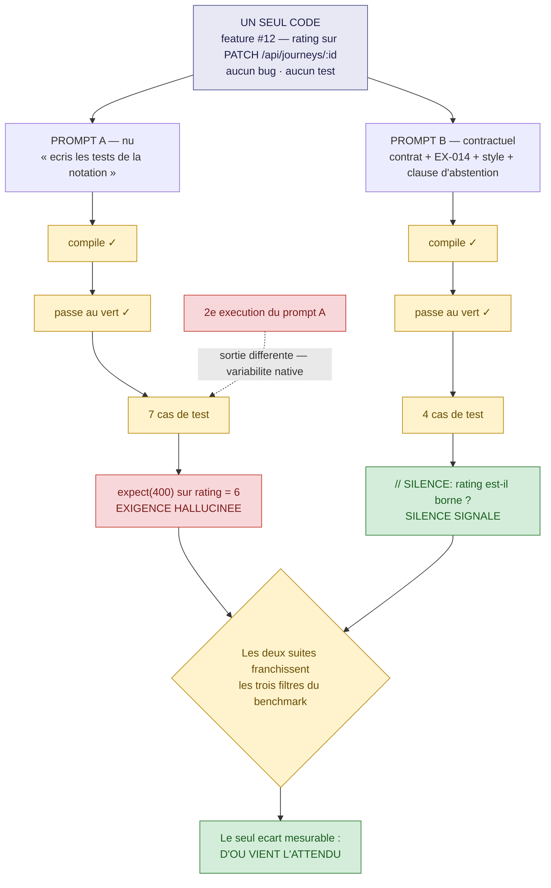
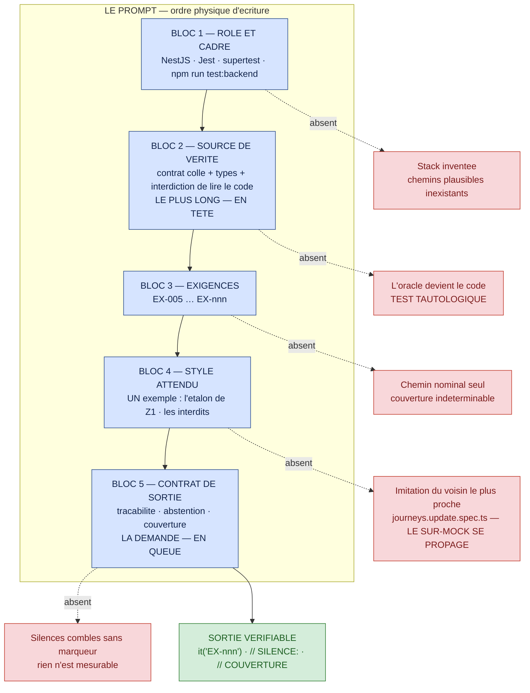
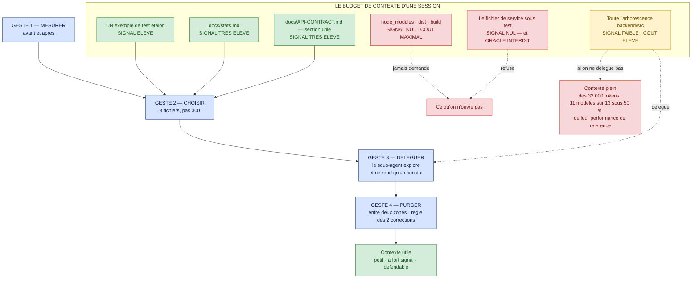
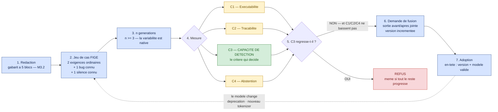

# Module M3 — « Parler à la machine »

> **Jour 2 · matin · 160 min de notions + 20 min de QCM long · 4 notions**
> *Promesse au participant : « Vous saurez écrire un prompt de test qui produit deux fois le même
> niveau de qualité — et vous saurez pourquoi il ne produira jamais deux fois la même sortie. »*

**Document formateur.** Il se déroule tel quel en séance. Les encadrés 🔐 ne sont jamais projetés.
Référence de vérité du terrain : `00-carte-du-terrain.md`. Contrat d'écriture : `00-gabarit-notion.md`.

---

## 0. Carte du module

### 0.1 Objectif terminal

> À l'issue de M3, le·a participant·e est capable de **construire, sélectionner le contexte, et
> versionner un prompt de génération de tests** de telle sorte que **la qualité de la sortie ne
> dépende plus de la chance** — et de **mesurer** un changement de prompt au lieu de l'apprécier.

C'est le seul objectif terminal du module. Tout le reste y concourt.

### 0.2 Position dans le fil rouge — *L'Expédition*, 🎒 l'équipement

| | |
|---|---|
| **Ce qui existe avant M3** | Le col J1 est franchi. Chaque cordée détient `carnet/j1-inventaire.md` : la matrice des seize fonctionnalités avec ses preuves, une liste `EX-001…` couvrant les sections *Journeys* et *Steps*, une liste de silences, trois tests suspects. Le groupe **sait juger**. Il ne sait pas encore **produire** : jusqu'ici, tout ce qui a été généré en séance l'a été par le formateur, en démonstration. |
| **Ce qui existe après M3** | Trois artefacts nouveaux entrent dans le dépôt partagé : (1) le **gabarit de prompt à cinq blocs**, instancié sur au moins une fonctionnalité et exécuté ; (2) une **discipline de contexte** mesurée, avec un coût par tâche relevé ; (3) une **convention d'équipe de versionnage de prompts**, écrite et opposable. Le col J2 — *L'Éclaireur* — peut alors demander un agent : les participants disposent de ce qu'on met dedans. |
| **Ce que M3 ne fait pas** | On ne construit pas encore d'agent — ni skill, ni subagent, ni hook : c'est M4 et M5. On ne branche pas de serveur MCP : c'est M4.2. On ne met rien en CI : c'est M6.3. **M3 ne parle que de l'entrée**, et c'est volontaire : un agent qui reçoit un mauvais prompt est un mauvais prompt qui tourne tout seul. |

### 0.3 Les quatre notions

| # | Notion | Modalité (critère) | Durée | Terrain | Micro-évaluation |
|---|---|---|---|---|---|
| **M3.1** | Le pari : deux prompts, un même code | **JEU — Le Pari** (`D-3`) | 40 | **Z2** ⚪ feature #12 *(variante : #13)* | Exercice court (4 min) |
| **M3.2** | Anatomie d'un prompt de test : les cinq blocs | **DESC** + diagramme (`A-2`) | 40 | **Z2** ⚪ feature #5 · **Z1** 🟢 comme exemple de style | QCM éclair (3 q.) |
| **M3.3** | Explorer le monorepo sans le charger en entier | **SOLO** (`C-1`) | 40 | `backend/` · `frontend/` · `e2e/` · `docs/` | Exercice court (3 min) |
| **M3.4** | Versionner un prompt comme du code | **GRP** (`E-1`) | 40 | artefact d'équipe, réutilisé au col J2 | Exercice court (4 min) |

**Rythme** — JEU · DESC · SOLO · GRP : aucun doublon consécutif (`R-1` ✓) · première séquence de
la journée non descendante (`R-6` ✓) · un jeu sérieux dans la demi-journée (`R-3` ✓) · aucune
séquence descendante de plus de 12 min sans interaction (`R-5` ✓ — le maximum est de 8 min, en
M3.2) · clôture sur une victoire mesurable (`R-8` ✓).

### 0.4 Minutage de la demi-journée

| Créneau | Séquence | Durée | Cumul |
|---|---|---|---|
| 09:00 → 09:15 | **Le Brief** — score du J1, étape du jour, l'artefact à rapporter | 15 | 15 |
| 09:15 → 09:55 | **M3.1** — Le pari : deux prompts, un même code | 40 | 55 |
| 09:55 → 10:35 | **M3.2** — Anatomie d'un prompt de test | 40 | 95 |
| 10:35 → 10:50 | **Pause** | 15 | 110 |
| 10:50 → 11:30 | **M3.3** — Explorer le monorepo sans le charger en entier | 40 | 150 |
| 11:30 → 12:10 | **M3.4** — Versionner un prompt comme du code | 40 | 190 |
| 12:10 → 12:30 | **QCM long M3** — 13 questions, correction commentée | 20 | 210 |

**Contrôle** : 15 + 40 + 40 + 15 + 40 + 40 + 20 = **210 min** ✓
(matin conforme à `00-architecture-28h.md` §2).

### 0.5 Points de Repère mobilisables sur le module

| Source | Gain |
|---|---|
| Jeu M3.1 — cordée ayant le plus de paris justes **avec preuve** | 15 PR |
| Micro-évaluation M3.1 réussie | 10 PR |
| Micro-évaluation M3.2 (QCM éclair 3/3) | 10 PR |
| Micro-évaluation M3.3 réussie | 10 PR |
| Micro-évaluation M3.4 réussie | 10 PR |
| **QCM long M3** — au prorata | 0 à 50 PR |
| **Total maximal du module** | **105 PR** |
| *Hors plafond* — aide à une autre cordée, validée par elle | +10 PR |

Badges accessibles dans la demi-journée : 💰 **Le Frugal** (même résultat qu'une autre cordée,
avec moins de tokens — il s'attribue au dépouillement de M3.3), 🎓 **Le Guide**.

### 0.6 Préparation matérielle — la veille

| Vérification | Commande / geste | Attendu |
|---|---|---|
| L'assistant est opérationnel sur **chaque** poste | ouverture d'une session, une requête d'essai | réponse obtenue, quota disponible |
| Les sorties de secours sont enregistrées | rejouer les prompts A et B de M3.1, et le gabarit de M3.2, la veille | fichiers conservés dans `annexes/` — **repli obligatoire** en cas de coupure |
| Le back démarre et la suite tourne | `npm run test:backend` | 2 suites passent, 2 suites échouent |
| Les trois `package.json` sont repérés | lecture de leurs scripts | les commandes exactes des trois runners sont notées sur la fiche du formateur |
| Le gabarit de prompt est distribuable | impression du §M3.2 *Le gabarit à cinq blocs* | 1 exemplaire par personne, recto-verso |
| Les cartes de pari de M3.1 sont imprimées | 4 propositions + confiance sur 5 | 1 carte par cordée |
| Le dossier de convention existe | création de `prompts/` à la racine du dépôt partagé | vide, versionné — il se remplira en M3.4 |
| `carnet/j1-inventaire.md` de chaque cordée est accessible | dépôt partagé | les listes `EX-nnn` servent de matière première toute la matinée |

🔐 **Réservé formateur** : `grep -rn "BUG:" backend/src` a été révélée au débrief du col J1. Elle
n'est **plus** confidentielle, mais elle reste sans valeur probante : la règle du col — *une preuve
est une exécution* — vaut pour toute la suite de la formation.

---

## 1. Notion M3.1 — « Le pari : deux prompts, un même code »

|  |  |
|---|---|
| **Durée** | 40 min |
| **Modalité** | Jeu sérieux — **Le Pari** |
| **Objectif d'apprentissage** | À l'issue, le·a participant·e est capable de **nommer et de mesurer l'écart entre un prompt nu et un prompt contractuel** sur un même code : ce qui change, ce qui ne change pas, et **ce qui ne se stabilise jamais** |
| **Niveau visé (Bloom)** | **Analyser** |
| **Micro-évaluation** | Exercice court (4 min) |
| **Ancrage fil rouge** | **Z2** ⚪ feature **#12** — *Notation d'une journey*. *Pourquoi cette fonctionnalité : c'est le terrain le plus simple du dépôt — un champ `rating` modifiable par `PATCH /api/journeys/:id`, sans bug, sans test. Et surtout : **le contrat ne donne aucune borne à `rating`.** Le type dit `number \| null`, un point c'est tout. Le silence est donc **réel, minuscule et irrésistible** — tout modèle inventera une échelle de 1 à 5 et assertira un 400 que le contrat n'a jamais promis. On peut le mesurer en salle, sur trois lignes de code, sans dépendre de la difficulté du terrain.* **Variante** : feature **#13** *(commentaires sur une journey)* si la salle a déjà travaillé sur `rating`. Ce que la notion fait avancer : la **clause d'abstention** du bloc 5 du gabarit de M3.2, et le critère **C4** de la convention de M3.4. |
| **Prérequis** | M2.1 *(les exigences numérotées)* et M2.3 *(les silences)* |

### ▸ Pourquoi cette modalité

L'objectif est de **découvrir par soi-même une limite technique** : ce qu'un prompt contrôle et
ce qu'il ne contrôle pas. Critère `D-3` de `00-grille-modalites.md` — *« une limite annoncée est
une croyance. Une limite rencontrée est un savoir. »* Le mécanisme du **Pari** ajoute une chose
que la simple expérimentation ne donne pas : **l'engagement public avant le résultat**. Une salle
à qui l'on montre deux sorties côte à côte hoche la tête et oublie ; une salle qui a parié, à
l'écrit, que « le prompt nu produira moins de tests » et qui constate qu'il en produit **davantage**
retient l'écart pendant quatre jours. C'est aussi la première séquence de la journée : la règle
`R-6` interdit d'ouvrir sur du descendant, et un pari ouvre plus vite qu'un chiffre.

### ▸ Ce qu'il faut avoir compris à la fin

- **Le prompt nu ne produit pas moins : il produit autre chose.** Le volume n'est pas le
  discriminant ; l'**origine des attendus** l'est.
- **Un modèle comble un silence sans le signaler.** Sur `rating`, il inventera une borne — et
  l'assertion inventée est indiscernable, à la lecture, d'une assertion contractuelle.
- **La variabilité est native et ne se supprime pas.** Deux exécutions du **même** prompt donnent
  deux suites différentes. On ne pilote pas la sortie : on pilote la **qualité attendue** de la
  sortie.
- Ce qu'un prompt contractuel change vraiment tient en trois choses : **l'origine de l'attendu**,
  **la couverture des cas non nominaux**, et **le traitement du silence**.
- La parade n'est pas « écrire un meilleur prompt » : c'est **interdire l'invention** par une
  clause explicite, et **mesurer** que la clause a été respectée.

### ▸ Déroulé minuté

> Le protocole du **Pari** est appliqué strictement : ① la mise · ② l'exécution · ③ la révélation ·
> ④ le nom · ⑤ la parade. Les numéros sont rappelés en tête de ligne.

| Temps | Le formateur | Les participants |
|---|---|---|
| **0-4** *(4)* | **① LA MISE.** Projette la feature #12 — la ligne du contrat, le type `rating: number \| null` — puis les **deux prompts** côte à côte, **sans rien exécuter**. Distribue une carte de pari par cordée : quatre propositions, VRAI ou FAUX, plus un niveau de confiance sur 5. « Vous pariez maintenant. Vous exécuterez après. » | Lisent les deux prompts, discutent, remplissent la carte. La cordée qui veut « juste essayer d'abord » se voit refuser : **le pari précède l'exécution, toujours.** |
| **4-8** *(4)* | **LES MISES AU TABLEAU.** Fait annoncer chaque cordée à voix haute et écrit les quatre colonnes de paris au tableau, avec la confiance. **Ne commente rien.** « Personne ne change d'avis ? » | Annoncent. Constatent la convergence de la salle sur **P1** *(« le prompt nu produira moins de tests »)* — c'est exactement le pari que la salle perdra. |
| **8-20** *(12)* | **② L'EXÉCUTION.** Les cordées lancent **elles-mêmes** les deux prompts et **exécutent** les tests produits par `npm run test:backend`. Consigne stricte, répétée en circulant : *« vous ne corrigez rien, vous n'embellissez rien. On mesure ce qui sort. »* Relance unique à 6 min : **« relancez le prompt A une seconde fois »**. | Génèrent, exécutent, comptent. Découvrent seuls que les deux sorties compilent et passent, que le prompt nu produit souvent **plus** de `it`, et que la seconde exécution du prompt A ne ressemble pas à la première. |
| **20-26** *(6)* | **③ LA RÉVÉLATION.** Dépouille les quatre propositions **une par une**, avec les sorties réelles de la salle comme preuve — jamais avec les siennes. S'arrête longuement sur **P3** : fait chercher, dans le contrat, la ligne qui justifie l'assertion sur la borne de `rating`. Elle n'existe pas. Se tait cinq secondes. | Cherchent la ligne, ne la trouvent pas. La réaction attendue tombe : *« mais alors ce test-là, il vient d'où ? »* |
| **26-30** *(4)* | **④ LE NOM.** Écrit trois mots au tableau et les relie au moment vécu : **exigence hallucinée** *(P3)*, **assertion faible** *(le `toBeDefined` du prompt nu)*, **variabilité** *(P4)*. Demande : « lequel des trois est le plus dangereux en revue de PR ? » | Répondent, et se divisent. La bonne réponse — **l'exigence hallucinée** — se justifie ainsi : les deux autres se voient à la lecture, celle-là ressemble à un bon test. |
| **30-33** *(3)* | **⑤ LA PARADE.** Une seule règle, construite avec la salle : *« le prompt doit dire quoi faire **quand la source est muette** »*. Écrit la **clause d'abstention** au tableau, mot pour mot, et annonce qu'elle deviendra le bloc 5 du gabarit, dans quarante minutes. | Recopient la clause dans le carnet de cordée. Font le lien avec les fiches de silence de la veille — c'est le rôle de la clause. |
| **33-37** *(4)* | **MICRO-ÉVALUATION.** Projette l'énoncé, chronomètre 3 min, corrige en 1 min. Annonce les 15 PR à la cordée ayant le plus de paris justes **avec preuve citée**. | Font l'exercice court en cordée. Comptent leurs paris. |
| **37-40** *(3)* | **SYNTHÈSE — la parole est aux participants.** « En une phrase, sans vos notes : qu'est-ce qu'un bon prompt de test **empêche** ? » Fait parler deux cordées, n'ajoute rien, enchaîne sur M3.2. | Formulent. Réponse attendue : *« il empêche le modèle de décider à ma place ce que la spec n'a pas dit. »* |

**Contrôle : 4 + 4 + 12 + 6 + 4 + 3 + 4 + 3 = 40 min ✓**

### ▸ 🎴 La carte de pari — à imprimer, une par cordée

```
CORDÉE : ..................          LE PARI — feature #12, notation d'une journey

                                                             VRAI / FAUX   Confiance /5
P1  Le prompt A (nu) produira MOINS de cas de test que le B.    [   ]         [   ]
P2  Les deux sorties compileront et passeront au vert.          [   ]         [   ]
P3  Le prompt A assertira une borne sur `rating` que le
    contrat ne donne nulle part.                                [   ]         [   ]
P4  Deux exécutions du MÊME prompt A produiront le même test.   [   ]         [   ]

Preuve citée pour le pari dont nous sommes le plus sûrs :
.......................................................................
```

**Les quatre paris, et pourquoi ils sont choisis.**

| # | Le pari | La réponse | Ce que la salle croit | Ce que le pari enseigne |
|---|---|---|---|---|
| **P1** | Le prompt nu produit **moins** de tests | **FAUX** *(le plus souvent)* | La salle parie VRAI à une écrasante majorité | **Le volume n'est pas le discriminant.** Un prompt nu produit volontiers plus de `it`, parce que rien ne borne son périmètre. Le prompt contractuel, lui, couvre **les exigences fournies** — ni plus, ni moins |
| **P2** | Les deux compilent et passent | **VRAI** | La salle est partagée | C'est la reprise directe de M1.2 : compiler, passer et couvrir sont les **trois filtres que les benchmarks mesurent**, et les deux prompts les franchissent. Aucun des deux n'est disqualifié par là |
| **P3** | Le prompt nu invente une borne sur `rating` | **VRAI** | La salle parie FAUX, ou hésite | **Le cœur du jeu.** Le contrat ne donne aucune borne. Le modèle en invente une, plausible, et l'assertit comme une vérité |
| **P4** | Deux exécutions du même prompt donnent le même test | **FAUX** | La salle parie FAUX, mais sous-estime l'ampleur | La variabilité porte sur les noms, l'ordre, le nombre de cas — **et parfois sur la présence ou l'absence du test qui compte** |

> **Barème du jeu** : 15 PR à la cordée ayant le plus de paris justes **et** ayant cité une preuve
> recevable pour au moins un pari. En cas d'égalité, départage sur **P3** : la cordée qui a parié
> VRAI et qui peut montrer la ligne inventée dans **sa propre** sortie l'emporte.

### ▸ Contenu à transmettre

**1. Les deux prompts.** Ils diffèrent par ce qu'ils **contiennent**, pas par leur ton.

| | **Prompt A — nu** | **Prompt B — contractuel** |
|---|---|---|
| **Ce qu'il donne** | La fonctionnalité et la stack | La stack, **le contrat cité**, **les exigences numérotées**, un exemple de style, un format de sortie |
| **Ce qu'il interdit** | rien | de lire le code testé, d'inventer une règle non écrite |
| **Longueur typique** | 1 ligne | 40 à 60 lignes |
| **Temps de rédaction** | 10 secondes | 4 minutes — dont 3 déjà faites la veille |

**2. Ce qui change, et ce qui ne change pas.** À projeter après le dépouillement, jamais avant.

| Dimension | Prompt nu | Prompt contractuel | Le prompt y change-t-il quelque chose ? |
|---|---|---|---|
| Compile | ✅ | ✅ | **Non** |
| Passe au vert | ✅ | ✅ *(sauf sur un bug — et c'est le but)* | **Non** |
| Nombre de cas | souvent **plus** | borné par les `EX-nnn` | **Non**, et pas dans le sens attendu |
| **Origine de l'attendu** | le plausible | **le contrat** | **OUI — c'est le seul écart qui compte** |
| Cas non nominaux | inventés ou absents | ceux du contrat | **OUI** |
| Traitement du silence | comblé en douce | signalé par `// SILENCE:` | **OUI** |
| **Reproductibilité de la sortie** | ✗ | ✗ | **NON — aucun prompt ne la donne** |

**3. Le silence de `rating`, en trois lignes.** Le contrat dit que `PATCH /api/journeys/:id`
accepte `rating?`. Le type dit `rating: number | null`. **Il n'y a pas d'autre ligne.** Aucune
borne, aucune échelle, aucun code d'erreur associé. Un modèle produira, avec une régularité
remarquable, une assertion du type `expect(res.status).toBe(400)` sur `rating: 6` — parce que
c'est ce que font les milliers de projets qu'il a vus. **C'est une décision produit, prise dans un
fichier de tests, sans auteur.**

**4. La variabilité n'est pas un réglage.** Le réflexe de salle est immédiat : *« il suffit de
mettre la température à zéro »*. Deux objections, dans cet ordre. D'abord, un abaissement de
température réduit la dispersion **lexicale**, pas la dispersion **de couverture** : le test qui
manque manquera toujours. Ensuite, et plus radicalement, les paramètres d'échantillonnage
`temperature`, `top_p` et `top_k` sont **dépréciés sur les modèles Claude 4.7 et suivants** et
renvoient une erreur 400 : un pilotage fondé sur eux **casse** au changement de modèle. Ce qui
survit à un changement de modèle, c'est **une contrainte écrite dans le prompt** et **une mesure**.

**5. La clause d'abstention, à faire recopier mot pour mot.**

> *Si une règle n'est pas décidable à partir du contrat fourni, n'invente rien : écris
> `// SILENCE: <la question exacte à poser au métier>` et n'écris pas d'assertion.*

**6. La phrase à faire noter.**

> *On ne demande pas à un prompt de rendre la sortie identique. On lui demande de rendre les
> **manques visibles**. La reproductibilité, c'est le travail des tests ; la traçabilité, celui du
> prompt.*

*(≈ 525 mots)*

### ▸ 🖼️ Diagramme — `diagrammes/M3-1-un-code-deux-prompts.svg`

#### Source Mermaid



#### Descriptif du SVG à produire

Format paysage 1600 × 900, imprimable en A4 paysage. En haut, centré, un unique rectangle gris
large : **« UN SEUL CODE — feature #12 »**, avec en sous-titre *aucun bug, aucun test*. Deux
branches descendent symétriquement vers deux colonnes de largeur **strictement égale** — l'égalité
de largeur est intentionnelle et doit être respectée : elle interdit de lire le schéma comme
« le petit prompt contre le gros prompt ». Colonne gauche **A — nu**, colonne droite
**B — contractuel**. Chaque colonne enchaîne trois pastilles jaunes identiques
*(compile ✓ · passe ✓ · n cas)*, puis un **encadré terminal** qui, lui, diffère : à gauche un
encadré **rouge** portant `expect(400) sur rating = 6` et la mention **EXIGENCE HALLUCINÉE** ; à
droite un encadré **vert** portant `// SILENCE: rating est-il borné ?` et la mention **SILENCE
SIGNALÉ**. Les deux encadrés convergent vers un losange central bas :
**« Les deux suites franchissent les trois filtres du benchmark »**, puis vers une bande pleine
largeur : **« Le seul écart mesurable : d'où vient l'attendu »**. Enfin, une flèche pointillée
rouge revient sur la troisième pastille de la colonne A depuis un petit encart détaché
*« 2ᵉ exécution du prompt A »*, légendée **« sortie différente — variabilité native »**.
Aucune icône décorative.

#### Explication du diagramme — notice de dévoilement

| Ordre | Ce qu'on affiche | La phrase à dire | Erreur à prévenir |
|---|---|---|---|
| 1 | **Le rectangle du haut, seul** | « Un seul code. Pas de bug, pas de test. Le terrain le plus neutre du dépôt : tout ce qui va différer viendra de nous, pas de lui. » | — |
| 2 | **Les deux colonnes, jusqu'aux trois pastilles jaunes incluses** | « Regardez ces six pastilles. Elles sont identiques. Les deux prompts compilent, passent, produisent des tests. **À ce stade, aucun outil de mesure du marché ne les distingue.** » | Ne pas laisser conclure que le prompt nu est acceptable. Le point est : *les indicateurs habituels sont aveugles ici*. |
| 3 | **Les deux encadrés terminaux, ensemble** | « Et voilà la seule chose qui diffère. À gauche, une décision produit prise par une machine. À droite, une question posée à un humain. » | **Marquer un temps d'arrêt de cinq secondes.** C'est le moment du schéma. |
| 4 | **Le losange et la bande du bas** | « Les deux passent les trois filtres qu'on a vus hier matin. Le seul écart mesurable est ailleurs : d'où vient l'attendu. Vous connaissez déjà cette phrase. » | Faire dire la conclusion par la salle, pas par le formateur. |
| 5 | **La flèche pointillée de la variabilité** | « Dernière chose, et c'est celle qui déplaît : cette flèche existe **aussi** sur la colonne de droite. Je ne l'ai dessinée qu'à gauche pour ne pas surcharger. Un bon prompt ne rend pas la sortie stable. » | Ne pas laisser croire que le prompt contractuel est déterministe. C'est le contresens le plus coûteux de la notion. |

⚠️ **Erreur d'interprétation à prévenir.** Le schéma sera lu comme « prompt long = bon, prompt
court = mauvais ». Le désamorcer explicitement à l'étape 2 : *« la longueur n'est pas le sujet.
Un prompt de cinquante lignes qui ne cite pas de source produit exactement la colonne de gauche,
en plus lent et en plus cher. Ce n'est pas la taille, c'est la **présence d'une source**. »*

### ▸ 🔍 Démonstration — les deux prompts, mot pour mot

**Point de départ.** Feature #12, zone Z2. Le contrat est ouvert sur `PATCH /api/journeys/:id` et
sur le bloc *Types partagés*. Aucun fichier de `backend/src/journeys/` n'est ouvert. Chaque cordée
dispose de sa liste `EX-nnn` produite au col J1 — `EX-014` y figure : *« Le champ `rating` est
modifiable par cette route ; son type est `number | null` »*, statut 🟨.

**Le geste exact — prompt A, tel qu'on le tape vraiment un mardi matin :**

> `Écris les tests unitaires Jest + supertest pour la notation d'une journey dans backend/src/journeys.`

**Le résultat obtenu — prompt A** *(forme typique ; l'extrait est réduit aux trois cas révélateurs)* :

```ts
describe('Notation d’une journey', () => {
  it('met à jour la note d’une journey', async () => {
    const res = await request(app.getHttpServer())
      .patch(`/api/journeys/${journeyId}`)
      .set('Authorization', `Bearer ${token}`)
      .send({ rating: 4 });

    expect(res.status).toBe(200);
    expect(res.body.rating).toBe(4);
  });

  it('refuse une note supérieure à 5', async () => {           // ← exigence hallucinée
    const res = await request(app.getHttpServer())
      .patch(`/api/journeys/${journeyId}`)
      .set('Authorization', `Bearer ${token}`)
      .send({ rating: 6 });

    expect(res.status).toBe(400);
  });

  it('accepte une note nulle', async () => {
    const res = await request(app.getHttpServer())
      .patch(`/api/journeys/${journeyId}`)
      .set('Authorization', `Bearer ${token}`)
      .send({ rating: null });

    expect(res.body).toBeDefined();                            // ← assertion faible
  });
});
```

**Le geste exact — prompt B**, instancié depuis le gabarit à cinq blocs *(présenté en entier en
M3.2 ; ici, seuls les blocs qui font la différence)* :

```text
<source_de_verite>
Le document ci-dessous est la SEULE source des valeurs attendues.
Vous n'avez pas accès au code de backend/src/journeys/journeys.service.ts et vous ne devez pas
demander à le lire : un attendu dérivé de l'implémentation est refusé.

  PATCH /api/journeys/:id
  Body: partiel { title?, startDate?, endDate?, destination?, rating? }
  200 → Journey mis à jour (les steps ne doivent PAS être perdus).

  type Journey = { … rating: number | null; … }
</source_de_verite>

<exigences>
EX-011 | Le corps est partiel : chaque champ peut être fourni seul.
EX-012 | Une mise à jour valide retourne 200 et le Journey mis à jour.
EX-013 | Une mise à jour partielle ne perd pas les steps existants.
EX-014 | Le champ rating est modifiable ; son type est number | null.
</exigences>

<sortie>
Un it par exigence, préfixé de son identifiant : it('EX-014 — …').
Si une exigence n'est pas décidable à partir de la source de vérité, n'inventez rien :
écrivez // SILENCE: <la question exacte à poser au métier> et n'écrivez pas d'assertion.
Terminez par un bloc // COUVERTURE listant, pour chaque EX : couverte / silence.
</sortie>
```

**Le résultat obtenu — prompt B** :

```ts
describe('PATCH /api/journeys/:id — mise à jour partielle', () => {
  it('EX-014 — enregistre une note et la retourne dans le Journey', async () => {
    const res = await request(app.getHttpServer())
      .patch(`/api/journeys/${journeyId}`)
      .set('Authorization', `Bearer ${token}`)
      .send({ rating: 4 });

    expect(res.status).toBe(200);
    expect(res.body.rating).toBe(4);
  });

  it('EX-014 — accepte null comme valeur de rating (type number | null)', async () => {
    const res = await request(app.getHttpServer())
      .patch(`/api/journeys/${journeyId}`)
      .set('Authorization', `Bearer ${token}`)
      .send({ rating: null });

    expect(res.status).toBe(200);
    expect(res.body.rating).toBeNull();
  });

  it('EX-013 — une mise à jour partielle ne perd pas les steps', async () => {
    const res = await request(app.getHttpServer())
      .patch(`/api/journeys/${journeyId}`)
      .set('Authorization', `Bearer ${token}`)
      .send({ rating: 4 });

    expect(res.body.steps).toHaveLength(1); // ← rouge : c'est le bug #7
  });

  // SILENCE: EX-014 — rating est-il borné (par exemple 1 à 5) ? Le contrat et le type
  // ne donnent aucune borne. Que doit répondre l'API pour rating = 6 : 200 ou 400 ?

  // COUVERTURE
  // EX-011 : couverte  |  EX-012 : couverte  |  EX-013 : couverte  |  EX-014 : partielle + silence
});
```

**Ce que l'exemple révèle — quatre constats, dans cet ordre.**

1. **Le prompt A a produit plus de tests que le prompt B.** Sept contre quatre, dans l'exécution de
   référence. La salle a parié l'inverse. Le premier constat de la notion est un **démenti**.
2. **Le prompt A a inventé une règle métier.** *« Refuse une note supérieure à 5 »* n'a aucune
   adresse dans le contrat. En revue de PR, ce test **passe pour un bon test** : il a un nom clair,
   une assertion forte, un cas d'erreur. Il est indiscernable — sauf si l'on demande son adresse.
3. **Le prompt B a produit un test rouge.** `EX-013` fait tomber la suite sur le bug **#7**. Un
   prompt contractuel ne rend pas la suite verte : il la rend **honnête**. C'est le point à
   marteler auprès des participants qui mesurent la qualité au taux de vert.
4. **Le silence est devenu visible.** Deux lignes de commentaire ont remplacé un test inventé.
   Elles ne coûtent rien, elles ne cassent rien, et elles remontent en revue.

**Ce qui peut rater, et le repli associé.**

| Risque | Signe | Repli |
|---|---|---|
| Le prompt A ne hallucine pas de borne cette fois-ci | P3 tombe à plat | **Le dire, et s'en servir** : *« il a été prudent aujourd'hui. Relancez-le. »* Sur trois cordées et deux exécutions chacune, l'hallucination apparaît quasi systématiquement au moins une fois. **Si vraiment aucune ne l'obtient**, projeter la sortie préenregistrée de la veille — et nommer ce qui vient de se passer : c'est P4, la variabilité, démontrée par l'absence |
| Le prompt B produit lui aussi une borne inventée | la clause n'a pas été respectée | Excellent matériau : le montrer, et poser la question de M3.4 — *« comment sauriez-vous, sur cent générations, que votre clause est respectée ? »*. C'est le critère **C4** de la convention |
| Pas de réseau, quota atteint | rien ne se génère | Sorties préenregistrées, obligatoires (§0.6). Le jeu se joue alors sur les sorties du formateur : le pari et le dépouillement restent intacts |
| Le back n'est pas démarré | les suites ne s'exécutent pas | Le jeu tient sans exécution : P1, P3 et P4 se dépouillent à la lecture. Seul P2 devient invérifiable — l'annoncer et l'annuler du barème |
| Une cordée « corrige » la sortie avant de la montrer | la suite est trop propre | Rappeler la consigne et repartir de la sortie brute. Une cordée qui embellit fausse la mesure de tout le monde |

### ▸ ✅ Micro-évaluation — Exercice court (4 min)

**Énoncé** *(trois lignes, projeté et distribué)*

> Voici quatre assertions produites par un prompt nu sur la feature **#13** — *Commentaires sur
> une journey*.
> 1. Pour chacune : écrivez **son adresse dans le contrat**, ou la mention **« inventée »**.
> 2. Réécrivez celle qui est **la plus dangereuse** pour qu'elle devienne vérifiable.

**Matériel** — l'extrait ci-dessous, plus la section *Journeys* du contrat et le bloc
*Types partagés*, déjà entre les mains des participants.

```ts
expect(res.status).toBe(201);                                   // (a)
expect(res.body.comments).toHaveLength(1);                      // (b)
expect(res.body.comments[0].authorId).toBe(user.id);            // (c)
expect(res.body.comments[0].text.length).toBeLessThanOrEqual(500); // (d)
```

**Résultat attendu vérifiable** *(cases à cocher, contrôle en moins de 60 secondes)*

- [ ] **(a)** — adresse : §Journeys, `POST /api/journeys/:id/comments`, *« 201 → `Journey` mis à jour »*.
- [ ] **(b)** — adresse : même ligne, *« avec le nouveau commentaire dans `comments[]` »*.
- [ ] **(c)** — **inventée**, et c'est **la plus dangereuse** : le type `Journey` déclare
      `comments: Array<{ id; author; text; createdAt }>` — **il n'y a pas d'`authorId` sur un
      commentaire de voyage.** L'assertion porte sur un champ qui n'existe pas au contrat.
- [ ] **(d)** — **inventée** : aucune contrainte de longueur n'est spécifiée sur `text`.
- [ ] La réécriture de **(c)** porte sur `author`, seul champ contractuel de l'auteur d'un
      commentaire de voyage.

**Solution de référence**

```ts
// (c) réécrit — l'attendu vient du type Journey, pas d'une analogie avec le commentaire d'étape
expect(res.body.comments[0].author).toBe('Evan');
// et, si l'on tient à la question de l'identité de l'auteur, on ne l'assertit pas : on l'écrit
// SILENCE: le commentaire de voyage n'a pas d'authorId au contrat, contrairement au commentaire
// d'étape. Cette asymétrie est-elle voulue : oui / non ?
```

**L'erreur que 80 % des groupes commettent.** Ils désignent **(d)** comme la plus dangereuse,
parce que la limite de 500 caractères « sort de nulle part » et se voit tout de suite. C'est
justement pourquoi elle est **moins** dangereuse : une invention voyante est une invention qu'on
attrape en revue. **(c)** est plus grave parce qu'elle est **cohérente** — le commentaire d'étape,
lui, porte bien un `authorId` — et qu'elle sera lue comme un test rigoureux. Le faire constater,
puis nommer la règle : **plus une invention est plausible, plus elle coûte cher.** C'est exactement
le mécanisme de la frustration n° 1 relevée chez les développeurs : *« des solutions presque
correctes mais pas tout à fait »*.

### ▸ 🔗 Ressources

| Ressource | À qui elle s'adresse | Ce qu'il faut y lire précisément |
|---|---|---|
| *Behaviour Driven Development Scenario Generation with Large Language Models* — https://arxiv.org/abs/2603.04729 | **La référence de la notion** | Sur **500 user stories** : une exigence détaillée produit des scénarios de haute qualité, une user story seule produit des scénarios de faible qualité. C'est l'écart entre le prompt A et le prompt B, mesuré. |
| *No More Manual Tests? Evaluating and Improving ChatGPT for Unit Test Generation (ChatTESTER)* — https://arxiv.org/abs/2305.04207 | Celui qui doit chiffrer la boucle de raffinement | **+34,3 %** de tests compilables et **+18,7 %** de tests avec assertions correctes grâce à un raffineur itératif : la mesure de l'écart entre « le modèle a écrit un test » et « le test assert juste ». |
| *Self-Consistency Improves Chain of Thought Reasoning* — https://arxiv.org/abs/2203.11171 | Celui qui veut une parade à la variabilité | Le principe du vote majoritaire sur plusieurs échantillonnages. Transposé ici : générer trois suites et ne garder que les cas présents dans les trois — un filtre anti-invention gratuit. |
| *Prompt Engineering* (livre blanc Google, Lee Boonstra) — https://www.kaggle.com/whitepaper-prompt-engineering | Celui qui veut régler son modèle | Les valeurs de départ documentées et la recommandation **température 0 pour les tâches déterministes** — à lire **avec** l'avertissement de dépréciation ci-contre. |
| *Model deprecations — Anthropic* — https://platform.claude.com/docs/en/about-claude/model-deprecations | **La référence qui date la notion** | `temperature`, `top_p` et `top_k` sont **dépréciés sur Opus 4.7 et suivants** et renvoient une erreur 400. Le pilotage par la température n'est pas une parade durable. |
| *Test smells in LLM-Generated Unit Tests* — https://arxiv.org/abs/2410.10628 | Celui qui relit du test généré | Sur **20 505 suites** : l'**Assertion Roulette** et le **Magic Number Test** sont systématiques. Le `500` de l'exercice en est un exemplaire parfait. |
| *Stack Overflow Developer Survey 2025 — AI* — https://survey.stackoverflow.co/2025/ai | Celui qui veut nommer le phénomène | **45 %** des développeurs citent *« des solutions presque correctes mais pas tout à fait »* comme frustration n° 1. C'est la définition sociale de l'exigence hallucinée. |

### ▸ ⚠️ Pièges d'animation

- **Ce qui rate habituellement** : le pari est escamoté. Une cordée exécute pendant qu'elle est
  censée parier, et l'effet tombe. Contre-mesure : **les claviers restent fermés pendant les huit
  premières minutes**, annoncé et tenu. Le pari sans engagement préalable n'est pas un pari, c'est
  un commentaire.
- **La question qui revient toujours** : *« il suffit de mettre la température à zéro, non ? »*
  Réponse courte, en deux temps : *« ça réduit la variation des mots, pas celle de la couverture.
  Et sur les modèles récents, le paramètre est déprécié et renvoie une erreur. Ce qui survit à un
  changement de modèle, c'est une contrainte écrite et une mesure. »* Ne pas ouvrir le débat sur
  l'échantillonnage : il coûte huit minutes et n'apporte rien ici.
- **Le risque de conclusion inverse** : une partie de la salle conclut *« donc les prompts longs
  sont meilleurs »* et se met à empiler les instructions. Couper court à l'étape ⑤ : *« ce n'est
  pas la longueur, c'est la présence d'une source. Un prompt de cinquante lignes sans contrat cité
  est un prompt nu bavard. »*
- **Le signe qu'il faut passer à la suite** : quand une cordée demande spontanément l'adresse d'une
  assertion de sa **propre** sortie — « attends, le `400`, il vient d'où ? » — la notion est
  acquise. Ne pas prolonger le dépouillement : la parade se construit en M3.2.

---

## 2. Notion M3.2 — « Anatomie d'un prompt de test : les cinq blocs »

|  |  |
|---|---|
| **Durée** | 40 min |
| **Modalité** | Descendant + diagramme + démonstration |
| **Objectif d'apprentissage** | À l'issue, le·a participant·e est capable de **construire un prompt de génération de tests à partir d'un gabarit à cinq blocs**, de **nommer la défaillance produite par l'absence de chaque bloc**, et d'**instancier le gabarit sur une fonctionnalité du dépôt** |
| **Niveau visé (Bloom)** | **Comprendre** *(l'application se fait au col J2 et en M3.4)* |
| **Micro-évaluation** | QCM éclair (3 questions) |
| **Ancrage fil rouge** | **Z2** ⚪ feature **#5** — *Détail d'une journey*, `GET /api/journeys/:id`, et **Z1** 🟢 comme **exemple de style** du bloc 4. *Pourquoi ce couple : la feature #5 est le terrain le plus pur du dépôt — une lecture, sans bug, sans test, et un attendu entièrement contractualisé (« 200 → `Journey` complet, avec `steps[]`, `comments[]` »). Le gabarit s'y instancie sans qu'aucune difficulté de terrain ne vienne masquer l'effet des blocs. Quant au bloc 4, il oblige à **choisir** un exemple de style — et c'est un piège réel dans ce dépôt : le voisin le plus proche de `journeys.*.spec.ts` est le test menteur. L'étalon de Z1 doit être choisi contre le réflexe de proximité.* Ce que la notion fait avancer : le prompt du **col J2**, dont l'agent devra embarquer ces cinq blocs. |
| **Prérequis** | M2.1 *(les `EX-nnn`)*, M2.2 *(la grille en 8 points devient le bloc 4)*, M3.1 *(la clause d'abstention devient le bloc 5)* |

### ▸ Pourquoi cette modalité

L'objectif est de **comprendre un mécanisme invisible** : ce qui, dans un prompt, produit quoi
dans la sortie. Critère `A-2` de `00-grille-modalites.md` — *« un mécanisme se voit ; le diagramme
dévoilé progressivement fait plus que 500 mots. »* Le mécanisme est invisible parce que le lien
entre un bloc absent et une défaillance de sortie **ne se lit nulle part** : il faut l'avoir vu
sur un cas. Une découverte autonome coûterait ici quarante minutes pour un contenu qui s'énonce en
cinq, et la salle vient de passer quarante minutes à l'éprouver en M3.1 — le descendant arrive
donc **après** l'expérience, pas avant, ce qui est la seule position où il est légitime. La notion
suit un JEU (`R-1` respecté) et n'excède jamais **8 minutes** de descendant continu (`R-5`).

### ▸ Ce qu'il faut avoir compris à la fin

- Un prompt de test a **cinq fonctions distinctes**, et chacune produit une défaillance
  identifiable quand elle manque. Le gabarit n'est pas un formulaire : c'est une **liste de
  défaillances évitées**.
- **La place physique des blocs compte.** La source de vérité se met **en tête** ; la demande et
  le format de sortie se mettent **en queue**.
- **Un seul exemple de style suffit** — et le choisir est une décision de sécurité, pas de
  commodité : dans ce dépôt, l'exemple le plus proche du code à tester est le test qui ment.
- Le bloc 5 est celui qu'on oublie et qui rend le reste vérifiable : sans **contrat de sortie**,
  on ne peut ni mesurer la couverture, ni détecter une invention.
- Le gabarit est **du texte versionnable**. C'est ce qui permet la notion M3.4 et l'agent du col J2.

### ▸ Déroulé minuté

| Temps | Le formateur | Les participants |
|---|---|---|
| **0-4** *(4)* | **OUVERTURE PAR LA RECONSTITUTION.** Aucune introduction. « Le prompt B a bien marché il y a vingt minutes. Sans le regarder : écrivez, en deux minutes, ce qu'il contenait. » Ramasse oralement, écrit les propositions au tableau. La salle en trouve deux ou trois sur cinq. « Il vous en manque deux. Et ce sont les deux qui coûtent le plus cher. » | Écrivent de mémoire. Retrouvent systématiquement « le contrat » et « les exigences ». Oublient systématiquement **le style attendu** et **le contrat de sortie**. |
| **4-9** *(5)* | **LES CINQ BLOCS.** Projette le tableau §1 du Contenu : une ligne par bloc, **avec la colonne « ce qui arrive s'il manque »**. Lit la colonne de droite à voix haute, pas celle de gauche. « Ce ne sont pas cinq rubriques. Ce sont cinq pannes. » | Notent. Une question tombe presque toujours : *« et l'ordre, il compte ? »* → réponse : *« oui, et je vous le montre dans quatre minutes. »* |
| **9-15** *(6)* | **LE DIAGRAMME.** Dévoile en cinq temps (voir notice). S'arrête sur la règle de placement — source en tête, demande en queue — et donne le chiffre : **jusqu'à 30 % de qualité de réponse en plus** lorsque la requête est placée après les documents longs. | Notent l'ordre physique. Certains reconnaissent le motif : c'est la structure `<documents>` de la documentation de l'éditeur. |
| **15-21** *(6)* | **LE GABARIT, BLOC PAR BLOC.** Distribue le gabarit imprimé et le projette. Ne le lit pas en entier : s'arrête sur **trois clauses seulement**, celles qui ne vont pas de soi — l'interdiction de lire le code testé *(bloc 2)*, l'exemple **unique** *(bloc 4)*, la clause d'abstention *(bloc 5)*. | Suivent sur leur exemplaire papier, annotent. Une objection revient : *« pourquoi un seul exemple ? »* → traitée en §Contenu, avec ses deux sources. |
| **21-29** *(8)* | **DÉMONSTRATION.** Instancie le gabarit **en direct** sur la feature #5, l'exécute, lit la sortie à voix haute — **y compris le bloc `// COUVERTURE` et les lignes `// SILENCE:`**. Une seule question à la salle : « qu'est-ce qui, dans ce prompt, a produit ce bloc de couverture ? » | Répondent : le bloc 5. Constatent que le gabarit rend la sortie **vérifiable**, ce que ni le prompt A ni le prompt B de M3.1 ne faisaient complètement. |
| **29-33** *(4)* | **LA QUESTION QUI FÂCHE.** « Quel exemple de style avez-vous mis dans votre bloc 4 ? » Laisse répondre, puis pose le piège : « et si vous demandez à l'assistant de s'inspirer des tests existants du dossier `journeys`, il tombera sur lequel ? » | Répondent — et la salle se fige : le voisin le plus proche est `journeys.update.spec.ts`, **le test menteur**. Le lien avec M1.1 se referme de lui-même. |
| **33-37** *(4)* | **MICRO-ÉVALUATION.** Projette les 3 questions du QCM éclair, ramasse à main levée, corrige en direct en commentant chaque distracteur. | Répondent, entendent pourquoi chaque mauvaise option est fausse. |
| **37-40** *(3)* | **SYNTHÈSE — la parole est aux participants.** « Sur les cinq blocs, lequel supprimeriez-vous si vous n'aviez que trente secondes pour écrire votre prompt ? Et lequel ne supprimeriez-vous jamais ? » Fait parler deux cordées, n'ajoute rien. | Formulent. Réponses attendues : on sacrifie le **bloc 1** *(le cadre)*, qu'un fichier de mémoire projet porte déjà ; on ne sacrifie **jamais le bloc 2** *(la source de vérité)*. |

**Contrôle : 4 + 5 + 6 + 6 + 8 + 4 + 4 + 3 = 40 min ✓**

### ▸ Contenu à transmettre

**1. Les cinq blocs, et la panne que chacun évite.**

| # | Bloc | Ce qu'il fait | **Ce qui arrive s'il manque** |
|---|---|---|---|
| **1** | **Rôle et cadre** | Qui parle, sur quel dépôt, avec quels outils imposés, quelle commande exécute la suite | Le modèle **choisit une stack** — Mocha, Chai, Vitest côté back — et invente des chemins de fichiers plausibles qui n'existent pas |
| **2** | **Source de vérité** | Le contrat cité **intégralement et en tête**, les types partagés, et **l'interdiction explicite de lire le code testé** | L'oracle devient le code : **test tautologique**. C'est la panne la plus coûteuse, et elle est silencieuse |
| **3** | **Exigences à couvrir** | Les `EX-nnn` du col J1, une par ligne, numérotées | Le modèle couvre le chemin nominal et **rien d'autre**. La couverture devient indéterminable |
| **4** | **Style attendu** | **Un** exemple de test du dépôt — l'étalon — et la liste des interdits, tirée de la grille en 8 points | Le modèle imite le test **le plus proche** du code à tester. Dans ce dépôt, c'est `journeys.update.spec.ts` : **le sur-mock se propage** |
| **5** | **Contrat de sortie** | Le format exigé, la traçabilité `it('EX-nnn — …')`, la **clause d'abstention**, le bloc de couverture final | Rien n'est vérifiable. Les silences sont comblés **sans marqueur**, et l'on ne peut pas mesurer un changement de prompt |

**2. L'ordre physique, et le chiffre qui le justifie.** Les blocs s'écrivent dans l'ordre 1 → 5,
et cet ordre satisfait une contrainte documentée : **les documents longs se placent en tête du
prompt, la demande en queue** — la documentation de l'éditeur indique que les requêtes placées à
la fin peuvent améliorer la qualité de réponse **jusqu'à 30 %**. Le bloc 2 est le plus long ; il
est en position 2. Le bloc 5 porte la demande et le format ; il est en dernier. Le gabarit n'est
donc pas un rangement esthétique : c'est **l'ordre le moins coûteux**.

**3. Pourquoi un seul exemple de style, et pas quinze.** Deux sources convergent, et elles
contredisent le réflexe naturel.

- La recommandation de l'éditeur, formulée à rebours de l'intuition : *« commencez par un seul
  exemple. N'en ajoutez d'autres que si la sortie ne correspond toujours pas à vos besoins. »*
- L'avertissement d'un autre éditeur, symétrique : **trop peu d'exemples ne changent pas le
  comportement, trop d'exemples font sur-ajuster la réponse aux exemples**. Coller quinze tests
  existants ne produit pas des tests nouveaux : cela produit des **clones**.

Dans ce dépôt, le choix de l'exemple est en outre une **décision de sécurité**. La proximité de
répertoire est un mauvais critère : le test le plus proche de `journeys.service.ts` est le faux
positif. L'exemple à citer est l'**étalon de Z1** — la suite de la feature #2, dont chaque `expect`
a une adresse dans le contrat.

**4. Le bloc 5 est celui qui rend le reste mesurable.** Trois clauses, trois effets.

| Clause | Ce qu'elle produit dans la sortie | Ce qu'on peut en mesurer |
|---|---|---|
| `it('EX-nnn — …')` | Un identifiant en tête de chaque test | La **traçabilité**, comptable par une commande |
| `// SILENCE: <question>` | Un marqueur au lieu d'une invention | Le **taux d'abstention** sur les exigences non décidables |
| `// COUVERTURE` en fin de fichier | Un état déclaré, exigence par exigence | L'**auto-déclaration**, à confronter à la réalité — un agent qui ment se prend ici |

**5. Ce que le gabarit n'apporte pas.** Ni la reproductibilité de la sortie, ni la dispense de
revue — l'ordre de grandeur à budgéter reste celui des **60 % de tests « utilisables tels quels »**
relevés en étude industrielle. Il ne résout pas non plus les silences : il les **rend visibles**.

**6. La phrase à faire noter.**

> *Un prompt de test n'est pas une demande. C'est un **cahier des charges de la sortie** —
> et comme tout cahier des charges, il vaut par ce qu'il interdit.*

*(≈ 685 mots)*

### ▸ 📄 Le gabarit à cinq blocs — copiable tel quel

> **À distribuer imprimé et à déposer dans le dépôt partagé sous `prompts/`** — l'arborescence
> définitive et la règle de nommage sont fixées en M3.4.
> Les variables sont notées entre **doubles accolades** — c'est la convention des outils de
> gestion de prompts, et elle rend le gabarit directement exploitable dans une suite d'évaluation
> (voir M3.4). Le gabarit ci-dessous est la version **backend NestJS**. La version **front**
> (Vitest + React Testing Library) figure juste après, en variante réduite.

````text
<!-- BLOC 1 — RÔLE ET CADRE -->
<role>
Vous êtes ingénieur de test sur le dépôt « Carnet de voyage », un monorepo TypeScript.
Périmètre de cette tâche : le backend NestJS, API REST montée sur http://localhost:3000/api.
Outils imposés, aucun autre n'est accepté : Jest, @nestjs/testing, supertest.
Commande d'exécution de la suite : npm run test:backend
Le stockage est un dossier de fichiers .md relus par gray-matter : aucun test ne doit laisser
de fichier résiduel après son exécution.
</role>

<!-- BLOC 2 — SOURCE DE VÉRITÉ (le plus long : il est en tête) -->
<source_de_verite>
Les documents ci-dessous sont la SEULE source des valeurs attendues.
Vous n'avez pas accès au code de {{fichier_sous_test}} et vous ne devez pas demander à le lire.
Un attendu dérivé de l'implémentation, d'une exécution précédente ou d'un double de test est refusé.

<document index="1">
  <source>docs/API-CONTRACT.md — {{section}}</source>
  <document_content>
{{extrait_du_contrat}}
  </document_content>
</document>

<document index="2">
  <source>docs/API-CONTRACT.md — §Types partagés</source>
  <document_content>
{{types_partages}}
  </document_content>
</document>
</source_de_verite>

<!-- BLOC 3 — EXIGENCES À COUVRIR -->
<exigences>
Couvrez exactement les exigences suivantes, ni plus ni moins.
{{liste_EX}}
<!-- une ligne par exigence, par exemple :
EX-005 | GET /api/journeys/:id retourne 200 et un Journey complet, steps[] et comments[] présents.
EX-006 | Le Journey retourné est conforme au type partagé.
-->
</exigences>

<!-- BLOC 4 — STYLE ATTENDU -->
<style_attendu>
Exemple UNIQUE du style de la maison. Imitez sa forme, jamais son fond.
{{extrait_test_etalon}}

Interdits, sans exception :
- ne doublez jamais la couche que l'exigence concerne ; les doubles ne servent qu'à neutraliser
  l'horloge, le réseau et les services tiers (Nominatim, OSRM) ;
- aucune assertion qui passerait sur une réponse vide : pas de toBeDefined() seul,
  pas de not.toThrow(), pas de code de statut seul sur une route qui retourne un corps ;
- aucun .skip, aucun test commenté, aucune valeur magique sans justification ;
- aucune dépendance à l'ordre d'exécution ni à un fichier laissé par un autre test ;
- aucun appel réseau réel.
</style_attendu>

<!-- BLOC 5 — CONTRAT DE SORTIE (la demande : elle est en queue) -->
<sortie>
Produisez un unique fichier : {{chemin_cible}}

1. Un describe par route. Un it par exigence.
2. Chaque it commence par son identifiant : it('EX-005 — <règle en français>').
3. Si une exigence n'est pas décidable à partir de la source de vérité fournie, n'inventez rien :
   écrivez  // SILENCE: EX-nnn — <la question exacte à poser au métier, fermée>
   et n'écrivez aucune assertion pour cette exigence.
4. Terminez le fichier par un bloc // COUVERTURE listant, pour chaque exigence fournie :
   couverte | partielle | silence.
5. Ne modifiez aucun fichier de production. N'exécutez rien. Ne créez aucun autre fichier.
</sortie>
````

**Variante front** — Vitest + React Testing Library. Seuls les blocs 1 et 4 changent ; les blocs 2,
3 et 5 sont identiques mot pour mot.

````text
<role>
Vous êtes ingénieur de test sur le dépôt « Carnet de voyage », un monorepo TypeScript.
Périmètre de cette tâche : le frontend React + Vite.
Outils imposés : Vitest, @testing-library/react, @testing-library/user-event.
</role>

<style_attendu>
Exemple UNIQUE du style de la maison : {{extrait_test_etalon_front}}

Interdits, sans exception :
- aucun sélecteur par classe CSS ni par XPath : rôle accessible, texte, ou identifiant de test ;
- aucun sélecteur qui n'ait été exécuté contre le vrai DOM ;
- aucune attente arbitraire (setTimeout) : utilisez les utilitaires d'attente de la bibliothèque ;
- aucun appel réseau réel : les appels sortants sont doublés.
</style_attendu>
````

> ⚠️ **Sur l'interdit de sélecteur.** Il n'est pas décoratif : le barème de l'expédition sanctionne
> le **sélecteur inventé, jamais exécuté contre le vrai DOM**, de **−30 PR**. La documentation de
> l'outil E2E du dépôt qualifie d'ailleurs les sélecteurs CSS et XPath longs de *« mauvaise
> pratique conduisant à des tests instables »* et pose que **tester par identifiant de test est la
> manière la plus résiliente**. Le bloc 4 transporte cette règle dans le prompt.

#### La fiche de contrôle du gabarit — à cocher avant chaque usage

| Bloc | Question de contrôle | ✓ |
|---|---|---|
| **1** | La commande d'exécution est-elle écrite, exactement ? | ☐ |
| **2** | Le contrat est-il **collé**, et non résumé ? Le bloc des types est-il inclus ? | ☐ |
| **2** | L'interdiction de lire le code testé est-elle explicite ? | ☐ |
| **3** | Chaque exigence porte-t-elle son identifiant `EX-nnn` ? | ☐ |
| **4** | L'exemple de style vient-il de l'**étalon**, et non du fichier le plus proche ? | ☐ |
| **4** | Y a-t-il **un seul** exemple ? | ☐ |
| **5** | La clause d'abstention est-elle présente, mot pour mot ? | ☐ |
| **5** | Le bloc `// COUVERTURE` est-il demandé ? | ☐ |

### ▸ 🖼️ Diagramme — `diagrammes/M3-2-les-cinq-blocs.svg`

#### Source Mermaid



#### Descriptif du SVG à produire

Format portrait 1200 × 1600, imprimable en A4 portrait et **affichable au mur pendant les trois
jours restants**. Colonne centrale : **cinq bandeaux bleus empilés**, reliés verticalement, dans
l'ordre d'écriture. Les hauteurs sont **volontairement inégales et proportionnelles à la longueur
réelle du bloc** : le bandeau 2 fait environ trois fois la hauteur des autres. Cette
disproportion est le message de placement — le bloc long est en haut. Le bandeau 1 porte la
mention discrète *« court »*, le bandeau 2 la mention **« LE PLUS LONG — EN TÊTE »**, le bandeau 5
la mention **« LA DEMANDE — EN QUEUE »**. À **droite** de chaque bandeau, relié par un trait
**pointillé rouge** portant le seul mot *« absent »*, un encadré rouge décrivant la panne
correspondante. Les cinq encadrés rouges sont alignés sur une même colonne verticale : on doit
pouvoir lire la colonne des pannes seule, sans les blocs. En bas, sous le bandeau 5, une pastille
verte pleine largeur **« SORTIE VÉRIFIABLE »** portant les trois marqueurs `it('EX-nnn')`,
`// SILENCE:`, `// COUVERTURE`. Aucune icône décorative. Le titre du poster, en haut :
*« Cinq blocs, cinq pannes »*.

#### Explication du diagramme — notice de dévoilement

| Ordre | Ce qu'on affiche | La phrase à dire | Erreur à prévenir |
|---|---|---|---|
| 1 | **La colonne rouge seule** *(masquer les bandeaux bleus)* | « Voilà cinq pannes. Vous les avez toutes vues cette semaine : la stack inventée, le test tautologique, le chemin nominal seul, le sur-mock qui se propage, le silence comblé. Lisez-les, elles vous sont familières. » | **Commencer par les pannes, jamais par les blocs.** C'est ce qui empêche de lire le gabarit comme un formulaire administratif. |
| 2 | **Les cinq bandeaux bleus, sans les traits** | « Et voilà les cinq blocs. Un bloc = une panne évitée. Rien de plus, rien de moins. » | Ne pas les présenter comme des « bonnes pratiques » : ce sont des **contre-mesures**, et chacune a un incident derrière elle. |
| 3 | **Les cinq traits pointillés, un par un, de haut en bas** | Sur le bloc 2 : « celui-là, c'est le plus cher. Sans lui, on a passé la journée d'hier à en démonter les conséquences. » Sur le bloc 4 : « et celui-là est le plus vicieux, parce qu'il ne coûte rien de l'écrire — et que son absence transforme votre dépôt en machine à reproduire ses propres erreurs. » | Ne pas aller trop vite sur le bloc 4 : c'est le seul dont la panne est **spécifique à ce dépôt** et donc le plus transférable au dépôt du participant. |
| 4 | **La disproportion des hauteurs** | « Regardez les hauteurs. Le bloc 2 fait trois fois les autres, et il est en haut. Ce n'est pas de la mise en page : les documents longs se placent en tête, la demande en fin — jusqu'à 30 % de qualité en plus. » | Ne pas donner le chiffre comme une loi de la nature : c'est une mesure d'éditeur sur ses propres modèles. Le dire. |
| 5 | **La pastille verte du bas** | « Et voilà ce qu'on achète avec les cinq blocs : pas une meilleure sortie — une **sortie vérifiable**. C'est la seule chose qu'on puisse mettre en CI. » | Fin du dévoilement. Enchaîner directement sur le gabarit papier. |

⚠️ **Erreur d'interprétation à prévenir.** Le schéma sera lu comme *« il faut toujours écrire les
cinq blocs, à chaque prompt »*, ce qui est faux et décourageant. Le corriger à l'étape 2 :
*« les blocs 1 et 4 ne se réécrivent pas à chaque fois — ils vivent dans un fichier de mémoire
projet ou dans une skill, et ils sont chargés automatiquement. Ce que vous tapez vraiment, c'est
2, 3 et 5. »* Sans cette précision, le gabarit est jugé impraticable et abandonné dès la sortie
de la salle.

### ▸ 🔍 Démonstration — le gabarit instancié sur la feature #5

**Point de départ.** Feature **#5** — *Détail d'une journey*, zone Z2, **aucun test**, **aucun
bug**. Le contrat et le bloc des types sont ouverts. `backend/src/journeys/` reste fermé — et il
faut le dire à voix haute.

**Le geste exact.** Le gabarit est instancié en direct, à l'écran, en remplissant **cinq**
variables et rien d'autre :

| Variable | Valeur |
|---|---|
| `{{fichier_sous_test}}` | `backend/src/journeys/journeys.service.ts` *(nommé pour être **interdit**, jamais pour être lu)* |
| `{{section}}` | §Journeys — `GET /api/journeys/:id` |
| `{{extrait_du_contrat}}` | *« GET /api/journeys/:id — 200 → `Journey` complet (avec `steps[]`, `comments[]`) »* |
| `{{types_partages}}` | les blocs `type Journey` et `type Step`, collés intégralement |
| `{{liste_EX}}` | `EX-005` et `EX-006`, recopiées du carnet de la cordée |

`{{extrait_test_etalon}}` est pris dans la **suite de la feature #2** — le formateur en relève le
chemin exact lors de la préparation de la veille.

**Le résultat obtenu** *(forme typique)* :

```ts
import { Test } from '@nestjs/testing';
import * as request from 'supertest';
import { INestApplication } from '@nestjs/common';
import { AppModule } from '../app.module';

describe('GET /api/journeys/:id — détail d’une journey', () => {
  let app: INestApplication;
  let token: string;
  let journeyId: string;

  it('EX-005 — retourne 200 et un Journey complet, steps[] et comments[] présents', async () => {
    const res = await request(app.getHttpServer())
      .get(`/api/journeys/${journeyId}`)
      .set('Authorization', `Bearer ${token}`);

    expect(res.status).toBe(200);
    expect(Array.isArray(res.body.steps)).toBe(true);
    expect(Array.isArray(res.body.comments)).toBe(true);
  });

  it('EX-006 — le Journey retourné est conforme au type partagé', async () => {
    const res = await request(app.getHttpServer())
      .get(`/api/journeys/${journeyId}`)
      .set('Authorization', `Bearer ${token}`);

    expect(typeof res.body.id).toBe('string');
    expect(typeof res.body.ownerId).toBe('string');
    expect(typeof res.body.title).toBe('string');
    expect(res.body.destination).toEqual({
      name: expect.any(String), lat: expect.any(Number), lng: expect.any(Number),
    });
    expect(res.body.rating === null || typeof res.body.rating === 'number').toBe(true);
  });

  // SILENCE: EX-005 — que retourne la route lorsque :id n'existe pas ? Le contrat ne spécifie
  // aucun code d'erreur pour cette route : 404, 400, ou 200 avec un corps vide ?
  // SILENCE: EX-005 — un utilisateur peut-il lire le voyage d'un autre ? Seule GET /api/journeys
  // mentionne « de l'utilisateur connecté ». 403, 404, ou autorisé ?

  // COUVERTURE
  // EX-005 : couverte  |  EX-006 : couverte
  // Silences : 2 (codes d'erreur, autorisation croisée)
});
```

**Ce que l'exemple révèle — trois constats.**

1. **Le bloc 5 a produit deux `// SILENCE:` que personne n'avait demandés.** Ils correspondent
   exactement à `SIL-6` et `SIL-7` de la veille : les codes d'erreur absents et l'autorisation
   croisée. **Le prompt a retrouvé, seul, deux silences que la cordée avait mis douze minutes à
   trouver** — parce qu'on lui a interdit d'inventer. C'est le meilleur argument de la notion, et
   il faut le dire tel quel.
2. **`EX-006` produit un test de forme, pas de valeur.** C'est correct : l'exigence porte sur la
   conformité au type. Un participant objectera que ce test est « faible ». La réponse est dans la
   grille de M2.2 : `R4` mesure si l'assertion **discrimine** — or `expect(typeof res.body.id).toBe('string')`
   tombe si le champ disparaît. Ce n'est pas un `toBeDefined()`.
3. **Le bloc `// COUVERTURE` est une auto-déclaration, donc suspecte par nature.** Le geste à
   enseigner : **le confronter**. Compter les `it('EX-` du fichier par une commande et comparer.
   Un agent qui déclare une couverture qu'il n'a pas se prend ici — et c'est le garde-fou que le
   col J2 exigera.

**Ce qui peut rater, et le repli associé.**

| Risque | Signe | Repli |
|---|---|---|
| La sortie ne contient aucun `// SILENCE:` | le bloc 5 semble inopérant | Le montrer et l'exploiter : *« le modèle a jugé les deux exigences décidables. Est-ce que vous êtes d'accord ? »* La salle trouve les deux silences en trente secondes, et l'enseignement est meilleur |
| Le chemin de l'étalon de Z1 n'a pas été relevé | le bloc 4 reste vide à l'écran | Instancier le bloc 4 avec **la grille en 8 points seule**, sans exemple de code : le prompt fonctionne, et la démonstration devient l'occasion de montrer que l'exemple est **utile mais non indispensable** |
| Pas de réseau, quota atteint | rien ne se génère | Sortie préenregistrée, obligatoire (§0.6). La démonstration porte sur la **lecture de la sortie**, pas sur l'acte de générer |
| La sortie est trop longue pour être lue à l'écran | la salle décroche | Ne lire que **trois choses** : le premier `it`, un `// SILENCE:`, et le bloc `// COUVERTURE`. Le reste se lit sur le poste de chacun |

### ▸ ✅ Micro-évaluation — QCM éclair (3 questions)

**Q1.** Voici le début d'un prompt de génération de tests. Quel bloc y manque ?

```text
Vous êtes ingénieur de test sur « Carnet de voyage » (NestJS, Jest, supertest).
Couvrez les exigences EX-018 à EX-022.
Un it par exigence, préfixé de son identifiant. Terminez par un bloc // COUVERTURE.
```

A. Le bloc 1, rôle et cadre · **B. Le bloc 2, source de vérité** · C. Le bloc 3, exigences ·
D. Le bloc 5, contrat de sortie.

- **B est juste** : les exigences sont **citées par numéro** mais leur contenu n'est nulle part, et
  le contrat n'est pas collé. Le modèle ira chercher l'attendu dans le code — c'est la panne du
  bloc 2, et c'est la plus coûteuse.
- **A est faux** : la première ligne porte le rôle, la stack et le dépôt. Le bloc 1 est là, en
  version courte.
- **C est faux** : la deuxième ligne nomme explicitement les exigences à couvrir. Le bloc 3 est
  présent — c'est même ce qui rend l'absence du bloc 2 trompeuse.
- **D est faux** : la troisième ligne porte la traçabilité et le bloc de couverture. Il manque la
  clause d'abstention, mais le bloc existe.

**Q2.** Pourquoi la source de vérité se place-t-elle **en tête** du prompt, et la demande en queue ?

A. Parce que le modèle lit de haut en bas et oublie la fin · **B. Parce que les documents longs
placés en tête et la requête placée en fin améliorent la qualité de réponse, jusqu'à 30 % selon
l'éditeur** · C. Parce que c'est l'ordre imposé par le format XML · D. Parce que cela réduit le
coût en tokens.

- **B est juste** — c'est une mesure publiée par l'éditeur sur ses propres modèles.
- **A est faux** : c'est l'inverse. La dégradation documentée en contexte long touche surtout le
  **milieu** du prompt, pas la fin — c'est la courbe de performance en U.
- **C est faux** : les balises n'imposent aucun ordre. Elles délimitent, elles ne hiérarchisent pas.
- **D est faux** : l'ordre des blocs ne change pas le nombre de tokens envoyés. La réduction de
  coût passe par la mise en cache d'un préfixe stable, ce qui est un autre sujet — traité en M3.3.

**Q3.** Combien d'exemples de tests existants faut-il mettre dans le bloc 4 ?

A. Le plus possible, pour fixer le style de la maison · B. Aucun : les exemples produisent des
clones · **C. Un seul, choisi pour sa qualité — on n'en ajoute que si la sortie ne convient pas** ·
D. Cinq au minimum, comme pour tout apprentissage par l'exemple.

- **C est juste** : c'est la recommandation explicite de l'éditeur, formulée à rebours de
  l'intuition, et elle est cohérente avec l'avertissement sur le sur-ajustement.
- **A est faux** : trop d'exemples font sur-ajuster la sortie aux exemples. Et dans ce dépôt, en
  ratisser large revient à embarquer `journeys.update.spec.ts` — donc à propager le sur-mock.
- **B est faux** : un exemple bien choisi fixe des conventions qu'aucune instruction ne transmet
  aussi bien — l'ordre des imports, la façon de monter l'application de test, le style de nommage.
- **D est faux** : la règle « 3 à 5 exemples » vaut pour des tâches de classification, pas pour la
  transmission d'un style de code où un seul exemple de qualité suffit.

*Barème : 3/3 = 10 PR. Correction commentée à voix haute, moins de 60 secondes par question.*

### ▸ 🔗 Ressources

| Ressource | À qui elle s'adresse | Ce qu'il faut y lire précisément |
|---|---|---|
| *Prompting best practices — Anthropic* — https://platform.claude.com/docs/en/build-with-claude/prompt-engineering/claude-prompting-best-practices | **La référence de la notion** | Trois choses : la structure `<documents>` / `<document index>` / `<source>` / `<document_content>` ; la règle **documents en tête, requête en fin, jusqu'à 30 % de qualité en plus** ; et le prompt système prêt à l'emploi pour la QA : *« les tests sont là pour vérifier la correction, pas pour définir la solution »*. |
| *Prompt engineering overview — Anthropic* — https://platform.claude.com/docs/en/build-with-claude/prompt-engineering/overview | Celui qui veut commencer proprement | Les trois prérequis à tout prompt : **des critères de succès clairs, un moyen de tester empiriquement, un premier jet à améliorer**. Autrement dit : on ne prompte pas « génère des tests » avant d'avoir défini ce qu'est un bon test. |
| *Prompt engineering best practices for 2026 — Anthropic* — https://claude.com/blog/best-practices-for-prompt-engineering | **La source du bloc 4** | La recommandation contre-intuitive : *« commencez par un seul exemple. N'en ajoutez d'autres que si la sortie ne correspond toujours pas. »* Et la clause d'incertitude, qui fonde le bloc 5. |
| *Prompt design strategies — Gemini API* — https://ai.google.dev/gemini-api/docs/prompting-strategies | Celui qui empile les exemples | L'arbitrage quantitatif : **trop peu d'exemples ne changent rien, trop d'exemples font sur-ajuster**. Explique pourquoi coller quinze tests existants produit des clones. |
| *Console prompting tools — Anthropic* — https://platform.claude.com/docs/en/build-with-claude/prompt-engineering/prompting-tools | Celui qui industrialise | La convention des variables en **doubles accolades**, et l'avertissement : un prompt raffiné produit des réponses *« plus longues, plus complètes, mais plus lentes »*. |
| *GPT-5 prompting guide (OpenAI Cookbook)* — https://cookbook.openai.com/examples/gpt-5/gpt-5_prompting_guide | Celui qui veut approfondir la structure | Les balises de contrôle nommées — `<persistence>`, `<code_editing_rules>`, `<self_reflection>` — et la rubrique auto-construite en 5 à 7 catégories : une autre manière d'écrire le bloc 4. |
| *Prompt engineering for GitHub Copilot Chat* — https://docs.github.com/en/copilot/concepts/prompting/prompt-engineering | Le curieux | La formulation inverse, et éclairante : *« les tests unitaires peuvent aussi servir d'exemples. Écrivez d'abord les tests, puis demandez la fonction décrite par ces tests. »* Le test comme exemple few-shot. |

### ▸ ⚠️ Pièges d'animation

- **Ce qui rate habituellement** : la notion glisse en lecture de gabarit ligne à ligne. Vingt
  minutes disparaissent et la salle décroche. Règle de survie : **on ne lit que trois clauses** —
  l'interdiction de lire le code, l'exemple unique, la clause d'abstention. Le reste est sur le
  papier distribué, et il y restera très bien.
- **La question qui revient toujours** : *« on va vraiment retaper cinquante lignes à chaque
  fois ? »* Réponse courte : *« non. Les blocs 1 et 4 vivent dans un fichier de mémoire projet ou
  dans une skill, chargés automatiquement. Vous tapez le 2, le 3 et le 5 — et le 3, vous l'avez
  déjà écrit hier. »* Cette réponse doit venir **avant** l'objection, sinon le gabarit est perçu
  comme irréaliste.
- **Le débat qui déraille** : le format XML contre le Markdown contre le JSON. Trancher en dix
  secondes : *« ce qui compte, c'est que les blocs soient **délimités**. Le choix du délimiteur
  n'a jamais fait la différence dans ce qu'on mesure. »*
- **Le signe qu'il faut passer à la suite** : quand un participant demande *« et si le contrat est
  trop long pour tenir dans le bloc 2 ? »*, la notion est acquise et la suivante est ouverte —
  c'est exactement le sujet de M3.3. Répondre en une phrase et enchaîner après la pause.

---

## 3. Notion M3.3 — « Explorer le monorepo sans le charger en entier »

|  |  |
|---|---|
| **Durée** | 40 min |
| **Modalité** | Exercice individuel — **SOLO** guidé |
| **Objectif d'apprentissage** | À l'issue, le·a participant·e est capable de **répondre à une question technique sur un monorepo en sélectionnant les fichiers strictement nécessaires**, de **mesurer le coût en contexte de sa session**, et de **justifier ce qu'il a refusé de charger** |
| **Niveau visé (Bloom)** | **Appliquer** |
| **Micro-évaluation** | Exercice court (3 min) |
| **Ancrage fil rouge** | Le **monorepo entier** : `backend/` *(NestJS, Jest)*, `frontend/` *(React + Vite, Vitest)*, `e2e/` *(Playwright)*, `docs/` *(`API-CONTRACT.md`, `stats.md`)*, et le magasin — un dossier de fichiers `.md` relus par `gray-matter`. *Pourquoi ce terrain : c'est le seul de la formation qui ne soit pas une zone mais **la totalité**. Trois `package.json`, trois runners, une « base de données » qui est un dossier de fichiers, et une documentation qui contient plus de vérité utile que le code. Aucune des six zones ne suffit à répondre aux questions posées : il faut **choisir**, et le choix est le seul objet de la notion.* Ce que la notion fait avancer : le coût et la fiabilité de l'agent du **col J2**, qui tournera sur une zone tirée au sort. |
| **Prérequis** | M3.2 — le gabarit existe ; la question devient : que met-on dans le bloc 2 ? |

### ▸ Pourquoi cette modalité

L'objectif est d'**exécuter un geste technique reproductible** — sélectionner un contexte —, donc
critère `C-1` de `00-grille-modalites.md` : *« la compétence gestuelle est individuelle. En groupe,
un seul apprend. »* Elle est ici doublement justifiée. D'abord parce que la sélection de contexte
est une **discipline personnelle** : elle se joue dans les dix secondes où l'on décide d'ouvrir un
fichier ou non, et personne ne peut la prendre à votre place. Ensuite parce qu'elle est
**mesurable individuellement** : le nombre de fichiers ouverts et le coût de la session sont des
chiffres, et le classement final rend l'apprentissage visible. **Le geste enseigné n'est pas une
commande.** On ne juge personne sur sa connaissance d'un raccourci d'outil : on le juge sur ce
qu'il a **refusé** de charger. La notion suit un descendant (`R-1` respecté) et rouvre l'énergie
d'après-pause par un chiffre qui dérange.

### ▸ Ce qu'il faut avoir compris à la fin

- **Un contexte plein n'est pas un contexte riche.** La performance se dégrade à mesure que la
  fenêtre se remplit, et la dégradation touche surtout **le milieu** du contexte.
- **La bonne question n'est pas « qu'est-ce que je charge ? » mais « qu'est-ce que je refuse de
  charger, et pourquoi ? »** Sur ce dépôt, la réponse à la plupart des questions est dans `docs/`,
  pas dans `backend/src/`.
- **Explorer et raisonner sont deux tâches distinctes.** L'exploration se **délègue** : elle
  consomme beaucoup et ne doit rendre qu'un constat.
- **Le coût se mesure avant de se réduire.** Une session dont on ne connaît pas le coût ne
  s'optimise pas — et le comptage de tokens est gratuit.
- Le contexte se **purge** : entre deux zones, on repart propre. Corriger trois fois le même point
  dans une même session est le signal qu'il faut tout reprendre à zéro.

### ▸ Déroulé minuté

| Temps | Le formateur | Les participants |
|---|---|---|
| **0-4** *(4)* | **OUVERTURE PAR LE PARI SUR LE CHIFFRE.** Ouvre une session propre à l'écran, affiche l'occupation de contexte, note le chiffre au tableau. « Je vais lui demander de lire l'arborescence de `backend/src` et d'ouvrir trois fichiers. Par combien la consommation va-t-elle être multipliée ? Pariez : ×2, ×5, ×20, ×50. » Exécute. Révèle. Puis donne le chiffre qui dérange : sur **13 modèles annonçant au moins 128 000 tokens de contexte, 11 tombent sous 50 % de leur performance de référence dès 32 000 tokens**. | Parient à main levée. Constatent l'écart entre leur intuition et la mesure. Réaction typique : *« mais on a un million de tokens de contexte »* — c'est exactement l'objection que le chiffre suivant démonte. |
| **4-9** *(5)* | **LES QUATRE GESTES.** Projette le tableau §1 du Contenu : **mesurer · choisir · déléguer · purger**. Une phrase par geste, pas plus. Insiste sur le deuxième : « le geste, ce n'est pas la commande. C'est la décision de ne pas ouvrir un fichier. » | Notent. Une question tombe presque toujours : *« il n'y a pas un fichier pour exclure des répertoires ? »* → réponse en §Contenu : le mécanisme officiel est une règle de refus dans la configuration, et le mécanisme historique est déprécié. |
| **9-25** *(16)* | **LES CINQ QUÊTES DE CONTEXTE.** Distribue la feuille de quêtes. Chacun, seul, au clavier. Contrainte : un **budget de fichiers** par quête, annoncé. Chacun note, pour chaque quête : la réponse, **le nombre de fichiers ouverts**, et **le coût relevé**. Le formateur circule, ne donne aucune réponse, et refuse les questions de fond. Relance unique à 8 min : « celui qui a ouvert plus de trois fichiers sur la quête 1 : relisez l'intitulé, la réponse tient dans un seul. » | Cherchent, seuls. Butent sur la quête 4 (le runner de `place-search.spec.ts`) et sur la quête 5 (le compte des fonctionnalités sans test). Découvrent que `docs/` répond à quatre quêtes sur cinq. |
| **25-30** *(5)* | **LE DÉPOUILLEMENT.** Trois colonnes au tableau : **réponses justes × fichiers ouverts × coût**. Chacun annonce ses trois chiffres. Le classement se fait sur le **coût à réponses justes égales**. Remet le badge 💰 **Le Frugal**. | Annoncent, comparent. L'écart de coût entre le premier et le dernier est typiquement d'un facteur 5 à 20, **pour les mêmes réponses**. C'est le résultat de la notion. |
| **30-34** *(4)* | **LE GESTE QUI RESTE — LA DÉLÉGATION.** Rejoue la quête la plus coûteuse (la 4) **en déléguant l'exploration** : un sous-agent parcourt `e2e/`, et seule sa conclusion revient. Montre le coût de la session principale avant et après. « Il a dépensé beaucoup. Vous, non. » | Regardent. Font le lien avec le col J2 : l'agent qu'ils construiront demain devra explorer sans saturer sa propre session. |
| **34-37** *(3)* | **MICRO-ÉVALUATION.** Projette l'énoncé, chronomètre 2 min, corrige en 1 min avec les cases à cocher. | Font l'exercice court, seuls. Échangent avec le voisin. |
| **37-40** *(3)* | **SYNTHÈSE — la parole est aux participants.** « Une phrase : quel fichier de ce dépôt avez-vous refusé d'ouvrir aujourd'hui, et pourquoi ce refus était-il le bon geste ? » Fait parler trois personnes, n'ajoute rien. | Formulent. Réponse attendue : *« `journeys.service.ts` — parce que ce que j'y aurais trouvé n'aurait pas été un attendu, mais un comportement. »* |

**Contrôle : 4 + 5 + 16 + 5 + 4 + 3 + 3 = 40 min ✓**

### ▸ Contenu à transmettre

**1. Les quatre gestes.** C'est tout le contenu descendant de la notion.

| # | Geste | Ce qu'on fait concrètement | Pourquoi |
|---|---|---|---|
| **1** | **Mesurer** | Afficher l'occupation de contexte de la session **avant** de charger quoi que ce soit, et après. Le comptage de tokens est un service **gratuit** : on peut estimer le coût d'une campagne avant de la lancer | Une session dont on ne connaît pas le coût ne s'optimise pas. Et la mesure change le comportement plus sûrement qu'un conseil |
| **2** | **Choisir** | Décider, fichier par fichier, ce qu'on ouvre **et ce qu'on refuse**. Sur ce dépôt : `docs/API-CONTRACT.md` §pertinente + le bloc des types + **un** exemple de style. Trois fichiers, pas trois cents | C'est le geste enseigné. Il ne s'automatise pas, il se décide |
| **3** | **Déléguer** | Confier l'exploration à un sous-agent qui travaille dans **sa propre** fenêtre et ne rend qu'un constat. La documentation le dit sans détour : *« explorer une grande base de code remplit votre contexte de lectures de fichiers. Déléguez l'exploration pour que seules les conclusions reviennent. »* | Un sous-agent peut consommer des dizaines de milliers de tokens et ne renvoyer qu'un résumé de **1 000 à 2 000 tokens** |
| **4** | **Purger** | Repartir d'un contexte vide entre deux zones. Résumer une session en cours en donnant des instructions de focalisation. Et appliquer la **règle des deux corrections** : *« si vous avez corrigé le même point plus de deux fois dans une session, repartez de zéro »* | Un contexte pollué produit des erreurs qu'on attribue au modèle |

**2. Ce que la fenêtre de contexte ne garantit pas.** Trois résultats, à donner dans cet ordre.

- **La courbe en U** : la performance suit la primauté et la récence. Ce qui est au **milieu** d'un
  long prompt est le moins bien exploité — la performance en question multi-documents peut chuter
  de **plus de 20 %** et tomber, sur 20 à 30 documents, **sous le niveau atteint sans aucun
  document**.
- **La chute précoce** : sur 13 modèles annonçant au moins 128 000 tokens de contexte, **11 tombent
  sous 50 %** de leur performance de référence dès **32 000 tokens**.
- **La mesure à grande échelle** : 18 modèles, 8 longueurs, 11 positions, **194 480 appels** —
  la performance est systématiquement inférieure en version longue, à information équivalente.

> **La formule à retenir**, empruntée à l'ingénierie de contexte : chercher **le plus petit
> ensemble possible de tokens à fort signal**. Sur ce dépôt, ce sont les deux fichiers de `docs/`.

**3. Ce qui n'existe pas, et ce qui le remplace.** Le réflexe de salle est immédiat : *« on met un
fichier d'exclusion à la racine »*. **Ce fichier n'existe pas.** Le mécanisme officiel est une
règle de **refus de lecture** déclarée en configuration, et il **remplace un dispositif
d'exclusion antérieur déprécié**. Conséquence : les répertoires de dépendances et de construction
n'ont pas besoin d'être « exclus », ils ont besoin de **ne pas être demandés**.

**4. Ce qu'on gagne à stabiliser le début du prompt.** Un préfixe identique d'une requête à
l'autre — les blocs 1 et 4 du gabarit — peut être **mis en cache** : la lecture d'un cache coûte
**un dixième** du prix d'entrée. Argument de coût, et surtout de **stabilité** — ce qui ne change
pas d'une génération à l'autre ne peut pas être la cause d'un écart.

**5. La phrase à faire noter.**

> *La question n'est jamais « est-ce que ça rentre ? ». Elle est : **« qu'est-ce que j'accepte de
> ne pas lui donner ? »** — et la réponse doit être défendable.*

*(≈ 625 mots)*

### ▸ 🗺️ Le monorepo tel qu'il est — à projeter une fois, avant les quêtes

| Ce qui est là | Ce que ça implique pour le contexte |
|---|---|
| **Trois `package.json`** — la racine, et les périmètres back, front et e2e | La commande d'exécution n'est pas devinable : elle se **lit**. Trois runners, trois vocabulaires |
| **Trois runners** — Jest + `@nestjs/testing` + supertest · Vitest + React Testing Library · `@playwright/test` | Un exemple de style back n'est pas transposable au front. Le bloc 4 du gabarit change selon la couche |
| **Une base de données qui est un dossier de fichiers `.md`** relus par `gray-matter` | L'état du système est **lisible et diffable**. `git status` après une exécution de tests est un instrument de mesure |
| **`docs/API-CONTRACT.md` et `docs/stats.md`** | **Le meilleur rapport signal sur tokens du dépôt.** Quatre des cinq quêtes s'y résolvent |
| **Deux dépendances externes** — Nominatim, OSRM | La vérité utile est **hors du dépôt**, dans la documentation des tiers. Aucun chargement de contexte local ne la donne |

> **La phrase à dire en projetant ce tableau, et une seule** : *« il n'y a pas “le dépôt”. Il y a
> quatre endroits qui ne parlent pas la même langue, et une cinquième source qui n'est même pas
> chez nous. Choisir, c'est d'abord savoir lequel des cinq répond à votre question. »*

### ▸ 🗺️ Les cinq quêtes de contexte — feuille distribuée

> **Consigne, en trois lignes.** Cinq questions. Pour chacune : la réponse, **le nombre de fichiers
> que vous avez ouverts**, et **le coût relevé** sur votre session. Le budget indiqué est un
> objectif, pas une interdiction — mais le dépassement se note.
> **Le classement se fait sur le coût, à réponses justes égales.**

| # | La question | Budget | Difficulté |
|---|---|---|---|
| **Q1** | Quelle commande fait sortir la suite backend en rouge, et **combien de suites échouent** ? | **1 fichier** | ⭐ |
| **Q2** | Quel statut l'API doit-elle retourner lorsqu'on crée un voyage dont `endDate` précède `startDate` ? | **1 fichier, 1 section** | ⭐ |
| **Q3** | Un commentaire d'**étape** porte-t-il un `authorId` ? Et un commentaire de **voyage** ? | **1 fichier, 1 section** | ⭐⭐ |
| **Q4** | Quel runner exécute `e2e/tests/place-search.spec.ts`, et avec quelle commande le lance-t-on ? | **2 fichiers** | ⭐⭐⭐ |
| **Q5** | Combien de fonctionnalités du produit n'ont **aucun test** ? | **1 fichier** | ⭐⭐ |

#### 🔐 Corrigé et coût de référence — réservé formateur

| # | Réponse | Où elle se trouve | Le piège de coût |
|---|---|---|---|
| **Q1** | `npm run test:backend` — **2 suites échouent** sur 4 | `docs/stats.md`, §*Comment lancer les tests* | Ouvrir les trois `package.json` pour reconstituer la commande. Coût multiplié par cinq pour la même réponse |
| **Q2** | **400** | `docs/API-CONTRACT.md`, §Journeys, `POST /api/journeys` | Ouvrir `backend/src/journeys/journeys.service.ts` — et y trouver **la mauvaise réponse**, puisque la validation n'existe pas. **C'est la quête la plus instructive** : le coût élevé donne ici un résultat **faux** |
| **Q3** | **Étape : oui** (`authorId: string`, non nullable) · **Voyage : non** | `docs/API-CONTRACT.md`, §Types partagés | Chercher dans les routes plutôt que dans les types. On trouve la mention pour l'étape, on ne trouve **rien** pour le voyage — et l'absence est mal interprétée |
| **Q4** | **Playwright**, lancé par `npm run e2e` *(qui démarre le backend et le frontend automatiquement)* | L'arborescence `e2e/` **plus** `docs/stats.md`, §*Comment lancer les tests* | La quête la plus coûteuse du lot : la tentation est de parcourir tout `e2e/`. **C'est celle qu'on rejouera en délégation à la minute 30** |
| **Q5** | **9** fonctionnalités sur 16 | `docs/stats.md` — le tableau des features, ou le bilan global *(7 sur 16 avec au moins un test)* | Recompter à la main en parcourant le dépôt. Réponse juste, coût vingt fois supérieur |

> **Le résultat pédagogique du lot** : **quatre quêtes sur cinq se résolvent dans `docs/`**, et la
> cinquième s'y résout à moitié. Le message à faire dire par la salle au dépouillement :
> *« la documentation de ce dépôt a un meilleur rapport signal sur tokens que son code. »*
> Corollaire immédiat pour le col J2 : **l'agent doit commencer par `docs/`, toujours.**

### ▸ 🖼️ Diagramme — `diagrammes/M3-3-le-budget-de-contexte.svg`

#### Source Mermaid



#### Descriptif du SVG à produire

Format paysage 1600 × 900. **Partie gauche — la colonne du signal** : six bandeaux horizontaux
empilés, de largeur **proportionnelle au coût en tokens** et de couleur **proportionnelle au
signal**. En haut, deux bandeaux **très étroits et verts vifs** — `docs/API-CONTRACT.md` (section
utile) et `docs/stats.md` — portant la mention *SIGNAL TRÈS ÉLEVÉ*. Puis un bandeau étroit vert
clair — *un exemple d'étalon*. Puis un bandeau moyen **rouge** — *le fichier de service sous test*
— portant deux mentions superposées : *SIGNAL NUL* et **ORACLE INTERDIT**. Puis un bandeau large
**jaune** — *toute l'arborescence `backend/src`*. Enfin un bandeau **très large et rouge sombre** —
*`node_modules`, `dist`, `build`* — occupant à lui seul plus de la moitié de la largeur totale de
la colonne. La disproportion est le message : **ce qui coûte le plus n'apporte rien**.
**Partie droite — la chaîne des quatre gestes** : quatre pastilles bleues en cascade,
*Mesurer → Choisir → Déléguer → Purger*, aboutissant à une pastille verte pleine
**« Contexte utile — petit, à fort signal, défendable »**. Des flèches relient les bandeaux de
gauche aux gestes de droite : les trois bandeaux verts vers *Choisir* ; le bandeau jaune vers
*Déléguer* ; les deux bandeaux rouges vers un encadré gris détaché **« Ce qu'on n'ouvre pas »**.
En bas à droite, isolé et encadré de rouge, un bloc de texte : **« Contexte plein — dès 32 000
tokens, 11 modèles sur 13 tombent sous 50 % de leur performance de référence »**, relié par une
flèche pointillée au bandeau jaune avec la légende *« si on ne délègue pas »*.

#### Explication du diagramme — notice de dévoilement

| Ordre | Ce qu'on affiche | La phrase à dire | Erreur à prévenir |
|---|---|---|---|
| 1 | **La colonne de gauche seule, sans les couleurs** *(tout en gris)* | « Voilà ce qu'il y a dans ce dépôt, à l'échelle. Le dernier bandeau, à lui seul, fait plus que tous les autres réunis. » | Ne pas nommer les couleurs tout de suite : laisser le volume parler. |
| 2 | **Les couleurs** | « Et maintenant le signal. Regardez les deux premiers : ils sont minuscules et ils sont verts. Quatre de vos cinq quêtes se résolvaient là-dedans. » | Ne pas laisser conclure « donc on ne lit jamais le code ». On le lit — pour le corriger, jamais pour en tirer un attendu. |
| 3 | **Le bandeau rouge du milieu, et sa double mention** | « Celui-là est le seul du schéma à porter deux étiquettes. Il ne coûte pas très cher. Et il vous rend faux, parce qu'il vous donnera ce que le code **fait**, pas ce qu'il **doit** faire. » | C'est la jonction avec M1.4. **Marquer un temps d'arrêt.** |
| 4 | **La chaîne des quatre gestes** | « Quatre gestes, et un seul est difficile : le deuxième. Les trois autres sont des commandes ; celui-là est une décision. » | Ne pas transformer la notion en cours d'outil. Aucun raccourci n'est évalué. |
| 5 | **L'encadré rouge du bas** | « Et voilà ce qu'on achète en ne déléguant pas. Ce n'est pas une opinion : c'est mesuré sur treize modèles. » | Ne pas présenter le chiffre comme une critique des modèles : c'est une **propriété** avec laquelle on travaille. |

⚠️ **Erreur d'interprétation à prévenir.** Une partie de la salle conclura qu'il faut **toujours**
minimiser le contexte, et se mettra à sous-alimenter ses prompts — ce qui est exactement la panne
du bloc 2 vue en M3.2. Le corriger explicitement à l'étape 2 : *« on ne cherche pas le contexte le
plus petit, on cherche le plus petit ensemble de tokens **à fort signal**. Retirer le contrat pour
économiser des tokens, c'est reconstruire un prompt nu. »* Sans cette phrase, M3.3 défait M3.2.

### ▸ 🔍 Démonstration — la même quête, avec et sans délégation

**Point de départ.** La quête **Q4** vient d'être dépouillée : c'est la plus coûteuse du lot.
Question : *« quel runner exécute `e2e/tests/place-search.spec.ts`, et avec quelle commande ? »*

**Temps 1 — sans délégation, tel que la salle vient de le faire.** La session principale ouvre
l'arborescence de `e2e/`, lit plusieurs fichiers de test, ouvre un ou deux `package.json`, et finit
par répondre. **Tout ce qui a été lu reste dans la session** — y compris les fichiers qui ne
servaient à rien. Relever le coût affiché et l'écrire au tableau.

**Temps 2 — avec délégation.** La même question est confiée à un sous-agent d'exploration, avec un
mandat écrit :

> `Explore uniquement le répertoire e2e/ et le fichier docs/stats.md. Réponds en trois lignes
> maximum : (1) le runner utilisé, (2) la commande de lancement exacte, (3) le chemin du fichier
> qui te l'a appris. Ne me renvoie aucun extrait de code.`

**Le résultat obtenu.** Trois lignes reviennent. Le coût de la session principale a augmenté de la
taille de ces trois lignes, **et de rien d'autre**. Le coût du sous-agent, lui, a été élevé — et il
est parti avec lui.

**Ce que l'exemple révèle — trois constats.**

1. **La consommation n'a pas disparu, elle a été déplacée.** Le sous-agent a dépensé autant, voire
   davantage. Ce qu'on a préservé, c'est **l'attention de la session principale** — celle qui doit
   encore écrire les tests.
2. **Le mandat est ce qui fait la différence.** *« Réponds en trois lignes maximum »* et *« ne me
   renvoie aucun extrait de code »* ne sont pas des politesses : ce sont les deux clauses qui
   empêchent le sous-agent de recopier ce qu'il a lu. Sans elles, la délégation ne sert à rien.
3. **C'est exactement l'architecture du col J2.** L'agent demandé demain devra lire une exigence,
   générer, exécuter, analyser — quatre tâches dont **une seule doit rester en mémoire**. Le
   participant vient de faire, à la main, ce qu'il automatisera demain.

**Ce qui peut rater, et le repli associé.**

| Risque | Signe | Repli |
|---|---|---|
| L'outil du participant ne propose pas de sous-agent | la délégation est indisponible | Jouer la démonstration **à deux personnes** : l'une explore sur son poste et ne rapporte que trois lignes à l'oral, l'autre les note. Le mécanisme est identique et il se comprend mieux |
| Le sous-agent renvoie un pavé | le gain est nul | **Parfait matériau** : le montrer, puis corriger le mandat en direct devant la salle. *« Le sous-agent n'est pas une baguette magique : c'est un contrat de sortie, comme le bloc 5 d'hier. »* |
| L'affichage du coût n'est pas disponible sur les postes | la mesure est impossible | Remplacer par une mesure de substitution, annoncée dès la minute 4 : **le nombre de fichiers ouverts**. Moins précis, parfaitement suffisant pour le classement |
| Pas de réseau | rien ne tourne | Les cinq quêtes se font **entièrement à la main**, en ouvrant les fichiers dans l'éditeur. La notion tient : le geste enseigné est la sélection, pas la commande |

### ▸ ✅ Micro-évaluation — Exercice court (3 min)

**Énoncé** *(trois lignes, projeté et distribué)*

> On vous demande d'écrire les tests de la feature **#16** — *Carte, itinéraire entre destinations*.
> 1. Listez, **dans l'ordre**, les sources que vous chargez dans votre contexte.
> 2. Listez **au moins une** source que vous refusez de charger, **avec la raison**.

**Matériel** — le contrat, le carnet de la cordée, aucune machine. Correction croisée avec le voisin.

**Résultat attendu vérifiable** *(cases à cocher, contrôle en moins de 60 secondes)*

- [ ] La liste des sources chargées comprend **la documentation d'OSRM** — une source **extérieure
      au dépôt**. Sans elle, aucun test ne peut détecter le défaut.
- [ ] Elle comprend `docs/API-CONTRACT.md`, §Map : *« 200 → `{ coordinates: Array<[lat, lng]> }` »*.
- [ ] Elle comprend le bloc des **types partagés** — les points d'entrée sont `{ lat, lng }`.
- [ ] La liste des sources **refusées** comprend `backend/src/map/map.service.ts`, et la raison
      donnée est de l'ordre de l'oracle : *« il me dirait ce que le code fait, pas ce qu'il doit
      faire »*.

**Solution de référence**

| Ordre | Source chargée | Pourquoi elle est indispensable |
|---|---|---|
| **1** | **La documentation d'OSRM** sur l'ordre des coordonnées | C'est **le seul document au monde** qui permette de détecter le défaut #16. Il n'est pas dans le dépôt |
| **2** | `docs/API-CONTRACT.md`, §Map | Donne la forme du corps de requête et de la réponse |
| **3** | §Types partagés | Donne le type des points d'entrée |
| **4** | *(facultatif)* un exemple de test à double réseau | Sert le bloc 4 du gabarit, pas l'oracle |

| Source refusée | La raison |
|---|---|
| `backend/src/map/map.service.ts` | **Oracle interdit.** Un attendu qui en dérive validerait l'inversion au lieu de la détecter |
| Le reste de `backend/src/` | Signal nul pour cette tâche, coût élevé |
| Une relecture du service par un modèle | Le modèle a lu le code : il **valide** ce fichier. Le savoir manquant est externe |

**L'erreur que 80 % des groupes commettent.** Ils listent `map.service.ts` **en premier**, par
réflexe professionnel — « je regarde ce que fait le code avant d'écrire un test dessus ». C'est le
geste le plus naturel du métier, et c'est précisément celui qui rend le défaut #16 indétectable.
Le faire constater sans moquerie, puis nommer la règle : **la feature #16 est le seul cas de la
formation où charger plus de contexte local rend plus faux.** La deuxième erreur, plus rare et
plus intéressante, consiste à ne rien refuser du tout : une liste sans refus n'a pas répondu à la
question posée.

### ▸ 🔗 Ressources

| Ressource | À qui elle s'adresse | Ce qu'il faut y lire précisément |
|---|---|---|
| *Effective context engineering for AI agents — Anthropic* — https://www.anthropic.com/engineering/effective-context-engineering-for-ai-agents | **La référence de la notion** | La définition qui tient en une ligne : chercher **le plus petit ensemble possible de tokens à fort signal**. Et le chiffre de la délégation : un sous-agent consomme des dizaines de milliers de tokens et ne renvoie qu'un résumé de **1 000 à 2 000**. |
| *Explore the context window — Claude Code* — https://code.claude.com/docs/en/context-window | Celui qui veut voir avant de croire | La page pédagogique et son **simulateur interactif**, plus le tableau de ce qui survit à un résumé de session. À projeter si le temps le permet. |
| *Common workflows — Claude Code* — https://code.claude.com/docs/en/common-workflows | **La source du geste 3** | La section *Déléguer la recherche à des sous-agents* : *« explorer une grande base de code remplit votre contexte de lectures de fichiers. Déléguez l'exploration pour que seules les conclusions reviennent. »* |
| *NoLiMa: Long-Context Evaluation Beyond Literal Matching* — https://arxiv.org/abs/2502.05167 | **La référence chiffrée** | Sur 13 modèles annonçant au moins 128 000 tokens : **11 tombent sous 50 %** de leur performance de référence dès **32 000 tokens**. « 1 M de contexte » n'est pas « 1 M utilisable ». |
| *Lost in the Middle: How Language Models Use Long Contexts* — https://arxiv.org/abs/2307.03172 | Celui qui place mal ses documents | La **courbe de performance en U** : ce qui est au milieu d'un long prompt est le moins exploité. C'est la justification de l'ordre des blocs de M3.2. |
| *Context Rot: How Increasing Input Tokens Impacts LLM Performance* — https://www.trychroma.com/research/context-rot | Celui qui veut l'étude la plus large | **18 modèles, 8 longueurs, 11 positions, 194 480 appels.** La source d'où vient l'expression *context rot*. |
| *Claude Code settings — Exclude sensitive files* — https://code.claude.com/docs/en/settings#exclude-sensitive-files | Celui qui cherche le fichier d'exclusion | Il n'y en a pas. Le mécanisme officiel est une règle de **refus de lecture** en configuration, et il **remplace un dispositif d'exclusion antérieur déprécié**. |

### ▸ ⚠️ Pièges d'animation

- **Ce qui rate habituellement** : la notion se transforme en démonstration d'outil. Le formateur
  enchaîne les commandes, la salle recopie des raccourcis, et personne n'apprend à choisir.
  Contre-mesure : **aucune commande n'est évaluée.** La feuille de quêtes ne demande jamais
  comment on a fait, elle demande **combien on a ouvert**. Le tenir même quand on est sollicité.
- **La question qui revient toujours** : *« avec un million de tokens de fenêtre, ce problème
  n'existe plus, non ? »* Réponse courte : *« la fenêtre a grandi, l'attention non. Onze modèles
  sur treize perdent la moitié de leur performance à trente-deux mille tokens, et ils annonçaient
  tous cent vingt-huit mille. »* Puis enchaîner : le débat sur les tailles de fenêtre est stérile.
- **Le risque de sous-alimentation** : après cette notion, certains participants raccourcissent
  leurs prompts et retirent le contrat pour « économiser ». C'est la régression la plus grave de
  la matinée, parce qu'elle défait M3.2. La phrase de rattrapage, à dire au dépouillement :
  *« le contrat n'est jamais ce qu'on coupe. C'est ce pour quoi on coupe le reste. »*
- **Le signe qu'il faut passer à la suite** : quand un participant justifie spontanément un
  **refus** — « je n'ouvre pas ce fichier parce que… » — l'objectif est atteint. Clore le
  dépouillement même s'il reste des chiffres à relever.

---

## 4. Notion M3.4 — « Versionner un prompt comme du code »

|  |  |
|---|---|
| **Durée** | 40 min |
| **Modalité** | Exercice de groupe — **GRP** avec rôles et contradiction |
| **Objectif d'apprentissage** | À l'issue, le·a participant·e est capable de **définir avec son équipe une convention de versionnage de prompts** — où ils vivent, comment on les nomme, comment on les versionne, **comment on évalue un changement** — et de **l'appliquer pour accepter ou refuser une modification** sous contradiction |
| **Niveau visé (Bloom)** | **Créer** |
| **Micro-évaluation** | Exercice court (4 min) |
| **Ancrage fil rouge** | La convention est un **artefact d'équipe**, pas une zone. Elle porte cependant sur deux terrains concrets et opposés : un prompt **back** (Jest + supertest, **Z2**) et un prompt **front** (Vitest + React Testing Library, **Z6**). *Pourquoi les deux : une convention qui ne tient que sur un runner n'est pas une convention, c'est une habitude. Le dépôt en impose trois ; la convention doit survivre au passage de l'un à l'autre.* Ce que la notion fait avancer : **l'agent du col J2** embarquera un prompt versionné, et son évaluation au barème du col reposera sur les critères définis ici. |
| **Prérequis** | M3.1 *(la variabilité)*, M3.2 *(le gabarit à cinq blocs)*, M3.3 *(le coût)* |

### ▸ Pourquoi cette modalité

L'objectif est de **coordonner, négocier et décider collectivement**. Critère `E-1` de
`00-grille-modalites.md` — *« l'objet d'apprentissage **est** le collectif. Le faire en solo le
vide de son sens. »* Une convention rédigée seul n'est pas une convention : c'est une préférence.
Ce qui fait qu'une règle tient dans une équipe, ce n'est pas sa qualité intrinsèque, c'est
qu'elle ait été **négociée entre des intérêts opposés** — celui qui maintient, celui qui produit,
celui qui devra rendre des comptes dans six mois. Le dispositif attribue donc ces trois rôles,
puis les met en tension par une contradiction : une modification de prompt qui **paraît bonne** et
que la convention doit permettre de refuser. La notion suit un SOLO (`R-1` respecté) et clôt la
demi-journée sur un artefact dont le groupe est fier (`R-8`).

### ▸ Ce qu'il faut avoir compris à la fin

- **Un prompt est du code** : il vit dans le dépôt, il passe en revue, il a un historique, et une
  modification se justifie par une mesure.
- **On ne versionne pas un prompt : on versionne un couple prompt × modèle.** Un prompt validé sur
  un modèle n'est pas validé sur le suivant, et les modèles bougent sous vous.
- **Évaluer un changement de prompt exige un jeu de cas figé** — dont au moins un cas portant sur
  un **bug connu** et un cas portant sur un **silence connu**.
- **Le seul critère qui compte vraiment est la capacité de détection.** Un prompt qui améliore la
  lisibilité et fait passer un test rouge au vert est une régression, pas une amélioration.
- **La variabilité impose de comparer des taux, pas des exécutions.** Une génération ne prouve rien.

### ▸ Déroulé minuté

| Temps | Le formateur | Les participants |
|---|---|---|
| **0-4** *(4)* | **OUVERTURE PAR L'INCIDENT.** Aucune introduction. « Lundi matin, votre chaîne de génération produit des suites sans identifiant d'exigence. Le fichier de prompt n'a pas été touché depuis six semaines — le `git log` le prouve. Qu'est-ce qui a changé ? » Laisse chercher 90 secondes, puis révèle : **le modèle**. Donne trois faits : les modèles sont retirés avec un préavis annoncé de **60 jours** ; `temperature`, `top_p` et `top_k` sont **dépréciés** sur les versions récentes et renvoient une **erreur 400** ; un changement de tokenizer peut produire **environ 30 % de tokens de plus pour le même texte**. | Cherchent : un `.env`, une dépendance, un collègue. Personne ne propose le modèle. La révélation installe l'idée directrice : **ce n'est pas le prompt qu'on versionne, c'est le couple**. |
| **4-9** *(5)* | **LES QUATRE QUESTIONS DE LA CONVENTION.** Projette les quatre — **où · comment on nomme · comment on versionne · comment on juge** — et distribue la fiche vierge d'une page. Attribue les **trois rôles** et annonce la rotation. Une consigne : « votre convention doit tenir sur **une page** et sur **deux runners**. » | Reçoivent la fiche, se répartissent les rôles. La contrainte « deux runners » est immédiatement comprise comme la difficulté réelle. |
| **9-23** *(14)* | **LA NÉGOCIATION.** Chaque cordée rédige **sa** convention, quatre sections. Rôles imposés et tenus : le **Mainteneur** doit refuser toute règle non vérifiable, le **Producteur** doit défendre la vitesse, l'**Auditeur** doit pouvoir expliquer dans six mois pourquoi tel test existe. Rotation annoncée à 7 min. Le formateur circule, ne propose rien, et pose une seule question aux cordées bloquées : *« qui, dans votre équipe, appliquera cette règle sans vous ? »* | Négocient. Le désaccord se cristallise toujours au même endroit : **la section 4**, comment on juge. C'est le but. |
| **23-30** *(7)* | **LA CONTRADICTION.** Soumet à chaque cordée **la même modification de prompt** (voir §Démonstration), présentée comme une proposition d'un collègue. Consigne : « acceptez ou refusez, en vous appuyant **uniquement** sur votre propre convention. Vous n'avez pas le droit d'invoquer votre bon sens. » 90 secondes de décision, puis annonce et justification publiques. | Décident. Une majorité **accepte** — la modification est séduisante. Puis le formateur montre la mesure, et les cordées découvrent laquelle de leurs clauses aurait dû la bloquer. |
| **30-33** *(3)* | **LA CONSOLIDATION.** Projette la convention de référence et pointe, pour chaque cordée, **la clause manquante** qui l'a fait trébucher. Ne classe pas les cordées : nomme les clauses. | Complètent leur fiche. La clause qui manque est presque toujours la même : **le critère de capacité de détection**. |
| **33-37** *(4)* | **MICRO-ÉVALUATION.** Projette l'énoncé, chronomètre 3 min, corrige en 1 min. | Font l'exercice court, en cordée. |
| **37-40** *(3)* | **SYNTHÈSE — la parole est aux participants.** « En une phrase : à quoi reconnaît-on qu'un changement de prompt est une amélioration ? » Fait parler deux cordées, n'ajoute rien, enchaîne sur le QCM long. | Formulent. Réponse attendue : *« à ce que la capacité de détection ne baisse pas — le reste peut progresser, ça ne suffit jamais. »* |

**Contrôle : 4 + 5 + 14 + 7 + 3 + 4 + 3 = 40 min ✓**

### ▸ Contenu à transmettre

**1. Les quatre questions, et rien d'autre.** Une convention de prompts qui répond à ces quatre
questions tient sur une page. Une convention qui en traite davantage ne sera pas appliquée.

| # | La question | Ce qu'elle empêche |
|---|---|---|
| **1** | **Où vivent les prompts ?** | Qu'ils vivent dans l'historique de conversation d'une personne |
| **2** | **Comment les nomme-t-on ?** | Qu'on ne sache pas lequel a produit une suite donnée |
| **3** | **Comment les versionne-t-on ?** | Qu'un changement soit invisible, et une régression inexplicable |
| **4** | **Comment juge-t-on un changement ?** | Qu'on améliore un prompt à l'intuition — c'est-à-dire au hasard |

**2. Les trois décisions qui structurent une convention.** Le détail opérationnel — arborescence,
en-tête de fichier, jeu de cas — est fourni en artefact ci-après ; ne sont retenues ici que les
décisions elles-mêmes.

| Décision | Le choix par défaut | Le critère qui tranche |
|---|---|---|
| **Où** | un dossier `prompts/` versionné, revu en demande de fusion | *est-ce dans le dépôt, et est-ce que ça passe en revue ?* Le reste est affaire de goût |
| **Nommage** | `<portée>-<action>-<objet>` | il doit tenir sous les limites réelles de l'outillage : nom de **64 caractères** au maximum, minuscules, chiffres et tirets, **identique au nom du dossier** pour une *skill* ; description plafonnée à **1 024 caractères** |
| **Versionnage** | version **dans l'en-tête** du fichier, jamais dans son nom | un fichier renommé perd son historique — et **la version du modèle fait partie de la version du prompt** |

**3. Pourquoi le modèle entre dans la version.** Trois faits, à donner tels quels : les retraits de
modèles sont annoncés avec un préavis de **60 jours** ; `temperature`, `top_p` et `top_k` sont
**dépréciés** sur les versions récentes et renvoient une **erreur 400** ; un changement de
tokenizer peut produire **environ 30 % de tokens de plus pour le même texte**. Un prompt validé
sur un modèle n'est pas validé sur le suivant, et rien dans le dépôt ne vous préviendra.

**4. Le seul critère qui décide.** Un jeu de cas figé, quatre critères mesurés — exécutabilité,
traçabilité, **capacité de détection**, abstention — et une règle d'acceptation :

> *Une version ne remplace la précédente que si **la capacité de détection ne régresse pas**, et
> si les trois autres critères progressent ou restent égaux. Un gain payé par une perte de
> détection est un refus.*

**5. On compare des séries, jamais des exécutions.** La variabilité étant native, une génération
ne prouve rien : **trois générations par version au minimum**, et l'on raisonne en **taux**.

**6. La phrase à faire noter.**

> *Un prompt sans jeu de cas est une opinion versionnée. Ce qui donne de la valeur au fichier,
> ce n'est pas son contenu : c'est la **mesure** qui est à côté.*

*(≈ 490 mots)*

### ▸ 📐 La convention de référence — l'artefact

> **Une page, quatre sections.** C'est le livrable de la notion et l'entrée du col J2.
> La version ci-dessous est celle **du formateur** : elle sert à la consolidation de la
> minute 30, et n'est **jamais** distribuée avant la négociation.

**2. Où — trois emplacements possibles, un critère de choix.**

| Emplacement | Ce que c'est | Quand le choisir |
|---|---|---|
| **Un dossier `prompts/` versionné** | Des fichiers de texte, revus en PR comme du code | **Le défaut.** Portable, lisible par tout outil, sans dépendance à un éditeur |
| **Une *skill* d'agent** | Un dossier avec un fichier de description, chargé automatiquement quand il est pertinent | Quand le prompt doit être **invoqué par l'agent lui-même**, sans qu'on le colle. C'est le format du col J2 |
| **Un fichier de prompt d'éditeur** | Un fichier à extension dédiée, dans un répertoire conventionné, avec un en-tête `description:` | Quand toute l'équipe utilise le même outil, et seulement dans ce cas |

> **Contraintes réelles à connaître avant de nommer.** Le nom d'une *skill* est limité à **64
> caractères**, en minuscules, chiffres et tirets, et **doit être identique au nom de son
> dossier** ; sa description est plafonnée à **1 024 caractères**. Le corps du fichier est destiné
> à rester **sous 500 lignes**. Ce ne sont pas des recommandations de style : ce sont les limites
> qui font qu'une convention de nommage tient ou non.

**3. Comment on nomme.** Une règle, trois segments : `<portée>-<action>-<objet>`.

```
prompts/
  README.md                              ← l'index : quel prompt pour quel usage, en un tableau
  back/
    back-generate-api-tests.md
    back-review-suite.md
  front/
    front-generate-component-tests.md
  evals/
    back-generate-api-tests.cases.md     ← le jeu de cas figé
    RESULTATS.md                         ← l'historique des mesures, par version
```

> ⚠️ **Ces chemins n'existent pas dans le dépôt.** C'est précisément le livrable de la notion :
> la cordée les crée. Le seul point non négociable est qu'ils soient **dans le dépôt** et
> **versionnés**.

**4. Comment on versionne — trois règles.**

| # | Règle | Pourquoi |
|---|---|---|
| **V1** | **Le numéro de version est dans l'en-tête du fichier, jamais dans son nom.** | Un fichier renommé perd son historique. `generate-tests.v3.md` détruit ce qu'on cherchait à conserver |
| **V2** | **Un changement de prompt = une demande de fusion**, avec la sortie **avant / après** sur le jeu de cas, jointe. | Sans comparaison jointe, le relecteur juge le texte du prompt. Or ce n'est pas le texte qu'on livre : c'est la sortie |
| **V3** | **La version du modèle fait partie de la version du prompt.** | Un prompt validé sur un modèle n'est pas validé sur le suivant. Les retraits de modèles sont annoncés avec **60 jours** de préavis ; des paramètres deviennent des erreurs 400 ; un tokenizer change et le même texte coûte **environ 30 % de plus** |

En-tête minimal d'un fichier de prompt :

```yaml
---
nom: back-generate-api-tests
version: 3
modele_valide: <identifiant exact du modèle, tel que renvoyé par l'outil>
date_validation: 2026-07-29
jeu_de_cas: evals/back-generate-api-tests.cases.md
resultats: C1 100 % · C2 100 % · C3 3/3 · C4 2/2
auteur_derniere_modification: ...
---
```

**5. Comment on juge — quatre critères, et un seul qui décide.** Le jeu de cas est **figé** et
contient au minimum : deux exigences ordinaires, **une exigence portant sur un bug connu**
(features #6, #7, #8, #9, #14 ou #16), et **une exigence portant sur un silence connu** (les
bornes de `rating`, ou la provenance d'`authorId`).

| Critère | Ce qu'on mesure | Comment on le mesure | Verdict |
|---|---|---|---|
| **C1 — Exécutabilité** | La suite produite compile et s'exécute | On lance `npm run test:backend` | Binaire |
| **C2 — Traçabilité** | Part des `it` portant un identifiant `EX-nnn` valide | Comptage automatique sur le fichier produit | Taux |
| **C3 — Capacité de détection** | Sur les cas dont on **sait** qu'ils sont bugués, la suite produite est-elle **rouge** ? | On exécute et on lit la couleur | **Binaire, et c'est le critère qui décide** |
| **C4 — Abstention** | Sur le cas dont le contrat est muet, obtient-on un `// SILENCE:` plutôt qu'une assertion inventée ? | Recherche du marqueur dans le fichier produit | Binaire |

**Le protocole de comparaison, en trois lignes.** La variabilité étant native, on ne compare
jamais deux exécutions : on compare **deux séries**. Minimum **trois générations par version**, et
l'on compare des **taux**. Le principe est celui de la cohérence par échantillonnage multiple —
mieux vaut beaucoup de cas au signal imparfait que peu de cas jugés finement.

**La règle d'acceptation, en une phrase :**

> *Une version ne remplace la précédente que si **C3 ne régresse pas**, et si C1, C2 et C4
> progressent ou restent égaux. Un gain sur C1 payé par une perte sur C3 est un refus.*


### ▸ 🖼️ Diagramme — `diagrammes/M3-4-le-cycle-de-vie-d-un-prompt.svg`

#### Source Mermaid



#### Descriptif du SVG à produire

Format paysage 1600 × 900. **Un cycle, pas une ligne** : la disposition est circulaire, dans le
sens des aiguilles d'une montre, avec sept étapes numérotées **1** à **7** disposées sur
l'anneau. L'étape 4, *Mesure*, est éclatée vers le centre en **quatre pastilles** `C1` à `C4` ;
trois sont jaunes, et **`C3` est verte, nettement plus grande, et porte la mention « LE CRITÈRE
QUI DÉCIDE »**. Sous les quatre pastilles, un losange **« C3 régresse-t-il ? »** avec deux
sorties : *NON* mène à l'étape 6 puis 7, en vert ; *OUI* mène à un rectangle rouge plein
**« REFUS — même si tout le reste progresse »**, placé **à l'extérieur** de l'anneau, ce qui rend
visible qu'il sort du cycle. Enfin, une **flèche pointillée** part de l'étape 7 et **remonte à
l'étape 2**, légendée **« le modèle change — dépréciation, nouveau tokenizer »**. Cette flèche de
retour est l'élément le plus important du schéma : elle traduit que le cycle **ne se termine
jamais**. Au centre de l'anneau, en gros et en gris clair : *« prompt × modèle »*.

#### Explication du diagramme — notice de dévoilement

| Ordre | Ce qu'on affiche | La phrase à dire | Erreur à prévenir |
|---|---|---|---|
| 1 | **Les étapes 1, 2 et 3 seules** | « Trois étapes avant la moindre mesure. Et la deuxième est la seule qui coûte du travail : un jeu de cas **figé**, qui contient un bug connu et un silence connu. Sans ces deux-là, vous ne mesurez rien. » | Ne pas laisser croire que le jeu de cas se génère. Il se **choisit**, une fois, et il ne bouge plus. |
| 2 | **Les quatre pastilles, `C3` en dernier** | « Trois indicateurs jaunes, un vert. Le vert est le seul qui vous dise si votre prompt sert à quelque chose. » | Ne pas dévaloriser `C1`, `C2` et `C4` : ils sont **nécessaires**, simplement pas suffisants. |
| 3 | **Le losange et la sortie rouge** | « Regardez où sort le refus : **hors du cycle**. Un prompt qui améliore tout sauf la détection ne rentre pas, et il n'y a pas de négociation. » | C'est le moment du schéma. **Marquer un temps d'arrêt de cinq secondes.** |
| 4 | **Les étapes 6 et 7** | « Une demande de fusion, avec la sortie avant et après. Ce que le relecteur juge, ce n'est pas votre texte : c'est ce que votre texte a produit. » | Ne pas laisser réduire la revue à une relecture du prompt. |
| 5 | **La flèche pointillée de retour** | « Et voilà la seule flèche qui ne vient pas de vous. Le modèle change, et votre prompt validé redevient un prompt à valider. C'est pour ça que le jeu de cas est un actif, et le prompt un consommable. » | Ne pas dramatiser : ce n'est pas une fatalité, c'est un **coût de maintenance à budgéter** — le sujet de la notion M8.2. |

⚠️ **Erreur d'interprétation à prévenir.** Le schéma sera lu comme une procédure lourde,
réservée aux grandes équipes. Le désamorcer à l'étape 1, en chiffres : *« le jeu de cas fait quatre
exigences. Trois générations. Une lecture de couleur. C'est un quart d'heure, une fois, et ça vous
évite de découvrir en production que votre prompt a cessé de détecter quoi que ce soit. »*

### ▸ 🔍 Démonstration — la modification qui semble bonne

> C'est la **contradiction** de la phase 23-30. Elle est soumise à chaque cordée comme une
> proposition de collègue, sans avertissement.

**Point de départ.** Le prompt `back-generate-api-tests`, version 2, est en service. Un collègue
propose la version 3, avec ce commentaire de demande de fusion :

> *« La suite générée est souvent rouge et ça bloque la CI. J'ai ajouté une ligne pour que la
> génération produise des tests qui passent. Ça nous fait gagner un aller-retour à chaque fois. »*

**Le diff proposé :**

```diff
  <sortie>
  Produisez un unique fichier : {{chemin_cible}}
  1. Un describe par route. Un it par exigence.
  2. Chaque it commence par son identifiant : it('EX-005 — <règle en français>').
+ 3. Assurez-vous que la suite produite passe au vert lorsqu'elle est exécutée.
- 3. Si une exigence n'est pas décidable à partir de la source de vérité fournie, n'inventez rien :
-    écrivez  // SILENCE: EX-nnn — <la question exacte à poser au métier, fermée>
+ 4. Si une exigence n'est pas décidable, choisissez l'interprétation la plus probable.
  </sortie>
```

**La mesure, sur le jeu de cas figé, trois générations par version :**

| Critère | Version 2 | Version 3 | Lecture |
|---|---|---|---|
| **C1 — Exécutabilité** | 3/3 | 3/3 | égal |
| **C2 — Traçabilité** | 92 % | **100 %** | **progresse** |
| **C3 — Capacité de détection** *(cas bugué : `EX-013`, le `PATCH` qui perd les `steps`)* | **3/3 rouges** | **0/3 rouges** | **effondrement** |
| **C4 — Abstention** *(cas muet : les bornes de `rating`)* | **3/3 silences** | **0/3 silences** — trois bornes inventées | **effondrement** |
| **Temps de génération** | 41 s | 33 s | progresse |
| **Verdict** | — | **REFUS** | C3 régresse |

**Ce que l'exemple révèle — trois constats, à dire dans cet ordre.**

1. **La version 3 est meilleure sur tout ce qui se voit.** Traçabilité parfaite, génération plus
   rapide, suite verte, pas de commentaire bizarre dans le fichier. Un relecteur qui juge le
   **texte** du prompt l'approuve en trente secondes.
2. **Elle a détruit la seule chose qui comptait.** *« Assurez-vous que la suite passe au vert »*
   est une instruction qui transforme le générateur en **négociateur de l'attendu** : il affaiblit
   les assertions jusqu'à obtenir du vert. C'est le mécanisme exact du malus **−40 PR** du barème,
   automatisé et industrialisé.
3. **Sans le critère C3, aucune convention ne l'arrête.** C'est ce que les cordées découvrent :
   leur propre fiche, écrite quatorze minutes plus tôt, ne contient pas la clause qui aurait
   permis de refuser. Le formateur ne le leur reproche pas : il le **nomme**, et c'est
   l'apprentissage de la notion.

**La clause qui manquait — à faire écrire par toutes les cordées :**

> *Aucun prompt ne demande à la sortie de passer au vert. Un prompt de test décrit **ce qui doit
> être vérifié**, jamais **le résultat de la vérification**. Toute proposition contenant une
> instruction sur la couleur de la suite est refusée sans mesure.*

Cette clause a une source directe, et il faut la citer : le prompt système de référence publié
par l'éditeur pour les tâches de test dit exactement *« les tests sont là pour vérifier la
correction, pas pour définir la solution »*, et *« il est inacceptable de supprimer ou de modifier
des tests, car cela pourrait conduire à des fonctionnalités manquantes ou défectueuses »*.

**Ce qui peut rater, et le repli associé.**

| Risque | Signe | Repli |
|---|---|---|
| Une cordée refuse immédiatement, sans mesure | pas de tension | Excellente cordée — mais lui demander **sur quelle clause écrite** elle s'appuie. Dans la moitié des cas, la clause n'existe pas et le refus est intuitif. Le faire constater : *« vous aviez raison, et vous ne pouviez pas le prouver. Dans six mois, ce sera un autre que vous. »* |
| Toutes les cordées acceptent | la salle est unanime | C'est le déroulement nominal. Ne pas le commenter avant la mesure |
| La mesure ne peut pas être exécutée en direct | pas de réseau | Le tableau ci-dessus est le **résultat de référence**, mesuré en préparation. Le projeter tel quel et l'annoncer comme tel — ne jamais présenter une mesure de préparation comme une mesure du jour |
| La salle demande à voir la version 3 « corrigée » | débordement | Une phrase : *« la correction, c'est de retirer les deux lignes ajoutées. Il n'y a rien à sauver dans cette proposition, et c'est ce qui la rend intéressante. »* |

### ▸ ✅ Micro-évaluation — Exercice court (4 min)

**Énoncé** *(trois lignes, projeté et distribué)*

> Un collègue propose quatre clauses pour votre convention d'équipe.
> 1. Barrez celle qui est **invérifiable** — celle qu'aucun relecteur ne pourra appliquer.
> 2. Entourez **la seule** qui mesure la capacité de détection, et dites pourquoi c'est la seule.

**Matériel** — la fiche de convention de la cordée, produite vingt minutes plus tôt.

| | Clause proposée |
|---|---|
| **(a)** | *« Le prompt doit être clair et bien structuré. »* |
| **(b)** | *« Chaque fichier de prompt porte, dans son en-tête, sa version et l'identifiant du modèle sur lequel il a été validé. »* |
| **(c)** | *« Une nouvelle version n'est adoptée que si, sur le jeu de cas figé, la suite produite reste rouge sur les exigences dont on sait qu'elles portent un défaut. »* |
| **(d)** | *« Toute modification de prompt passe par une demande de fusion accompagnée de la sortie avant et après. »* |

**Résultat attendu vérifiable** *(cases à cocher, contrôle en moins de 60 secondes)*

- [ ] **(a) est barrée** — « clair et bien structuré » n'est ni mesurable ni opposable. Deux
      relecteurs de bonne foi la trancheront en sens opposés.
- [ ] **(c) est entourée** — c'est le critère **C3**.
- [ ] La justification donnée mentionne que **(b)** et **(d)** sont des règles de **procédure** :
      elles garantissent qu'on saura *quoi* a changé et *quand*, jamais si le changement est bon.

**Solution de référence.** (a) invérifiable, à barrer. (b) et (d) : nécessaires, insuffisantes —
elles rendent le changement **traçable**, pas **jugeable**. (c) : la seule clause qui produise un
verdict. **Elle est aussi la seule qui coûte quelque chose à mettre en place**, puisqu'elle exige
un jeu de cas figé contenant un défaut connu — et c'est exactement pour cela qu'elle est celle
qu'on omet.

**L'erreur que 80 % des groupes commettent.** Ils barrent **(b)**, la jugeant bureaucratique
— « on n'a pas besoin d'écrire le modèle, on le sait ». C'est l'erreur que l'incident d'ouverture
avait pourtant démontrée quarante minutes plus tôt : personne ne « sait » quel modèle a produit
une suite d'il y a six semaines, et le jour où la sortie change sans que le prompt ait bougé,
l'en-tête est le seul document qui permette de comprendre. Le faire constater, puis nommer la
règle : **une clause de traçabilité ne sert à rien tant que tout va bien. Elle ne sert qu'une
fois, et ce jour-là elle vaut une demi-journée d'enquête.**

### ▸ 🔗 Ressources

| Ressource | À qui elle s'adresse | Ce qu'il faut y lire précisément |
|---|---|---|
| *Using the Evaluation Tool — Anthropic* — https://platform.claude.com/docs/en/test-and-evaluate/eval-tool | **La référence de la notion** | Le prérequis structurant — **un prompt doit contenir au moins une ou deux variables `{{variable}}`** pour qu'on puisse lui associer un jeu d'évaluation — et le **versionnage de prompt avec réexécution de toute la suite**. C'est littéralement une suite de tests pour vos prompts. |
| *Define success criteria and build evaluations — Anthropic* — https://platform.claude.com/docs/en/test-and-evaluate/develop-tests | Celui qui construit son jeu de cas | Le principe contre-intuitif : **privilégier le volume sur la finesse** — beaucoup de cas au signal légèrement plus faible valent mieux que peu de cas jugés à la main. Et, pour un juge automatique : **utiliser un modèle différent de celui qui a généré**. |
| *promptfoo* — https://github.com/promptfoo/promptfoo · assertions : https://www.promptfoo.dev/docs/configuration/expected-outputs/ | Celui qui veut l'outiller en CI | Une configuration unique en YAML — `prompts`, `providers`, `tests`, `assert` — et une quarantaine de types d'assertions, déterministes et jugées par modèle, avec seuil et pondération. C'est le format qui transforme la convention en non-régression exécutable. |
| *DeepEval* — https://deepeval.com/docs/getting-started | Celui qui préfère le modèle mental « test » | Le produit se décrit comme *« similaire à Pytest, mais spécialisé pour le test unitaire d'applications à base de LLM »* : `assert_test(cas, [metrique])`, un seuil par métrique, un pass/fail. Le vocabulaire se transpose tel quel. |
| *Agent Skills — Specification* — https://agentskills.io/specification | **La source des contraintes de nommage** | Nom limité à **64 caractères**, minuscules, chiffres et tirets, **identique au nom du dossier** ; description plafonnée à **1 024 caractères** ; corps à garder **sous 500 lignes**. Les limites qui décident d'une convention. |
| *Your first prompt file — GitHub Copilot* — https://docs.github.com/en/copilot/tutorials/customization-library/prompt-files/your-first-prompt-file | Celui dont l'équipe est sur un autre outil | Le format concurrent : un fichier à extension dédiée, dans un répertoire conventionné, avec un en-tête portant une `description:`. La convergence de l'industrie sur un point : **le prompt est un fichier du dépôt**. |
| *Model deprecations — Anthropic* — https://platform.claude.com/docs/en/about-claude/model-deprecations | **La source de la règle V3** | Le préavis annoncé de **60 jours**, les modèles déjà retirés, et la dépréciation de `temperature`, `top_p` et `top_k` sur les versions récentes — qui renvoient une **erreur 400**. La preuve que le modèle bouge sous le prompt. |

### ▸ ⚠️ Pièges d'animation

- **Ce qui rate habituellement** : la cordée rédige une convention de trois pages, exhaustive et
  inapplicable. Contre-mesure annoncée **avant** le départ et tenue à la lettre : **une page,
  quatre sections, et je ne lis rien au-delà.** Une convention qu'on ne peut pas afficher au mur
  ne sera pas appliquée.
- **La question qui revient toujours** : *« on n'a pas d'équipe, on est deux. »* Réponse courte :
  *« alors la convention sert encore plus, parce que le deuxième lecteur, c'est vous dans six
  mois. L'Auditeur n'est pas un rôle de grande entreprise : c'est vous, plus tard, sans le
  souvenir. »*
- **Le débat qui déraille** : le choix de l'emplacement — dossier contre skill contre fichier
  d'éditeur — peut consommer dix minutes. Trancher en trente secondes : *« un critère, un seul :
  est-ce que c'est dans le dépôt et est-ce que ça passe en revue ? Si oui, le reste est une
  question de goût. »*
- **Le signe qu'il faut passer à la suite** : quand une cordée refuse la modification de la
  contradiction **en citant sa propre clause écrite**, l'objectif est atteint — c'est même la
  définition de l'objectif `E-1`. Clore la phase et enchaîner sur le QCM.

---

## 5. QCM long M3 — 13 questions · 20 minutes · 0 à 50 PR

> **Modalité de passation.** 12 minutes de réponse individuelle (papier ou formulaire), puis
> 8 minutes de correction commentée à voix haute. Une seule bonne réponse par question.
> Le formateur commente **systématiquement les distracteurs** : c'est là que se joue
> l'apprentissage, pas dans l'annonce de la bonne lettre.
>
> **Répartition** — M3.1 : questions 1 à 3 · M3.2 : questions 4 à 7 · M3.3 : questions 8 à 10 ·
> M3.4 : questions 11 à 13. **Cinq questions** (2, 5, 7, 9, 12) portent sur un extrait de code,
> un extrait de prompt ou une sortie de commande à interpréter.

### 5.1 Barème en Points de Repère

| Bonnes réponses | 13 | 12 | 11 | 10 | 9 | 8 | 7 | 6 | 5 | 4 | 3 | 2 | 1 | 0 |
|---|---|---|---|---|---|---|---|---|---|---|---|---|---|---|
| **PR** | **50** | 46 | 42 | 38 | 35 | 31 | 27 | 23 | 19 | 15 | 12 | 8 | 4 | 0 |

*Calcul : 50 × (bonnes réponses / 13), arrondi à l'entier le plus proche. Aucun point négatif.
Le score de chaque cordée est la moyenne de ses membres, annoncée à voix haute en 60 secondes
au rituel du Carnet de bord.*

---

### Question 1 — *(M3.1)*

Un prompt nu et un prompt contractuel sont lancés sur la même fonctionnalité, sans bug et sans
test. Qu'observe-t-on le plus souvent sur le **nombre de cas de test produits** ?

A. Le prompt contractuel en produit systématiquement davantage.
B. Les deux en produisent le même nombre, à un ou deux près.
**C. Le prompt nu en produit souvent davantage, parce que rien ne borne son périmètre.**
D. Le prompt nu n'en produit aucun tant qu'on ne lui donne pas d'exigences.

- **C est juste** : le prompt contractuel couvre **les exigences fournies**, ni plus ni moins.
  Le prompt nu, lui, invente son périmètre — et l'invention gonfle le volume.
- **A est faux** : c'est l'intuition majoritaire de la salle au moment du pari, et c'est
  précisément celle que le jeu démonte.
- **B est faux** : les deux sorties n'ont aucune raison de converger en volume, puisqu'elles ne
  répondent pas à la même question.
- **D est faux** : un prompt nu produit toujours quelque chose. C'est même son problème.

### Question 2 — *(M3.1 · extrait de code)*

Le contrat de la feature #12 dit ceci, et rien d'autre : `PATCH /api/journeys/:id` accepte un
corps partiel contenant `rating?`, et le type partagé déclare `rating: number | null`.
Un prompt nu produit :

```ts
it('refuse une note supérieure à 5', async () => {
  const res = await request(app.getHttpServer())
    .patch(`/api/journeys/${journeyId}`)
    .set('Authorization', `Bearer ${token}`)
    .send({ rating: 6 });

  expect(res.status).toBe(400);
});
```

Quel est le défaut de ce test ?

A. L'assertion est trop faible : elle ne vérifie pas le corps de la réponse.
B. Il manque le cas `rating: null`.
**C. L'attendu ne vient d'aucune source : le contrat ne donne aucune borne à `rating`. C'est une
exigence hallucinée.**
D. Il utilise supertest alors qu'un test unitaire suffirait.

- **C est juste** : ni la route ni le type ne bornent `rating`. Le `400` est une **décision
  produit** prise dans un fichier de tests, sans auteur et sans trace.
- **A est faux** : l'assertion sur un code d'erreur est parfaitement légitime **quand le code est
  contractualisé**. Le problème n'est pas sa force, c'est son **origine**.
- **B est faux** : c'est une couverture manquante, réelle mais mineure. Le sujet ici est un test
  **en trop**, pas un test qui manque.
- **D est faux** : le choix du niveau de test est indifférent au défaut relevé. Le même attendu
  inventé en test unitaire resterait inventé.

### Question 3 — *(M3.1)*

Un participant propose : *« il suffit de mettre la température à 0 pour que la génération soit
reproductible. »* Que faut-il en penser ?

A. C'est exact : à température 0, la sortie est déterministe.
B. C'est exact, mais seulement pour les modèles de petite taille.
**C. Cela réduit la variation lexicale sans garantir la couverture — et sur les modèles récents,
ce paramètre est déprécié et renvoie une erreur.**
D. C'est faux : la température n'a aucun effet sur du code.

- **C est juste**, pour deux raisons cumulées. D'abord, le test qui manque manquera toujours :
  la dispersion de **couverture** n'est pas la dispersion **de mots**. Ensuite, `temperature`,
  `top_p` et `top_k` sont **dépréciés sur les modèles Claude 4.7 et suivants** et renvoient une
  erreur 400 : un pilotage fondé sur eux casse au changement de modèle.
- **A est faux** : même en réduisant l'échantillonnage, rien ne garantit qu'un cas de test
  présent dans une génération le soit dans la suivante.
- **B est faux** : la taille du modèle n'entre pas dans le raisonnement.
- **D est faux** : la température a un effet réel sur la sortie, y compris sur du code. Elle n'a
  simplement pas l'effet qu'on lui prête.

### Question 4 — *(M3.2)*

Dans le gabarit à cinq blocs, quelle panne l'absence du **bloc 4 — style attendu** produit-elle
dans **ce dépôt** ?

A. Le modèle choisit une stack de test qui n'est pas celle du projet.
B. Le modèle ne couvre que le chemin nominal.
**C. Le modèle imite le test le plus proche du code à tester — donc `journeys.update.spec.ts`,
et le sur-mock se propage.**
D. Le modèle produit une sortie non vérifiable, sans identifiant d'exigence.

- **C est juste** : c'est la panne spécifique de ce dépôt, et elle a un nom depuis le premier
  jour. La proximité de répertoire est un mauvais critère de choix d'exemple quand le voisin ment.
- **A est faux** : c'est la panne du **bloc 1**, rôle et cadre.
- **B est faux** : c'est la panne du **bloc 3**, exigences à couvrir.
- **D est faux** : c'est la panne du **bloc 5**, contrat de sortie.

### Question 5 — *(M3.2 · extrait de prompt)*

```text
Vous êtes ingénieur de test sur « Carnet de voyage » (NestJS, Jest, supertest).
Voici le contrat de la route et les types partagés : [ … 40 lignes … ]
Couvrez les exigences EX-018 à EX-022, une par it, préfixées de leur identifiant.
Inspirez-vous des tests existants du dossier backend/src/journeys pour le style.
Terminez par un bloc // COUVERTURE.
```

Quelle est la faiblesse la plus grave de ce prompt ?

A. Le contrat est trop long et sature le contexte.
B. Il manque le chemin du fichier cible.
**C. Le bloc de style renvoie au dossier qui contient le test menteur : le prompt demande
explicitement d'imiter `journeys.update.spec.ts`.**
D. Il manque la commande d'exécution de la suite.

- **C est juste** : *« inspirez-vous des tests existants du dossier `journeys` »* est une
  instruction qui pointe droit sur le faux positif. Un exemple **unique et choisi** — l'étalon —
  était la parade.
- **A est faux** : quarante lignes de contrat en tête du prompt sont exactement ce qu'il faut. La
  saturation de contexte se joue à une tout autre échelle, et le contrat est la dernière chose
  qu'on coupe.
- **B est faux** : c'est un défaut réel mais mineur, et il se corrige en une ligne sans rien
  changer à la qualité des assertions produites.
- **D est faux** : même remarque. L'absence de la commande gêne l'exécution, pas la validité des
  attendus.

### Question 6 — *(M3.2)*

Pourquoi place-t-on la source de vérité **en tête** du prompt et la demande **en queue** ?

A. Parce que le modèle traite les instructions dans l'ordre où il les reçoit.
B. Parce que cela réduit le nombre de tokens envoyés.
**C. Parce que les documents longs placés en tête et la requête placée en fin améliorent la
qualité de réponse — jusqu'à 30 % selon la mesure publiée par l'éditeur.**
D. Parce que le format à balises impose cet ordre.

- **C est juste** : c'est une mesure d'éditeur sur ses propres modèles, et elle converge avec la
  courbe de performance en U observée en recherche.
- **A est faux** : un modèle ne « traite » pas séquentiellement au sens où on l'entend ; c'est la
  position dans le contexte qui influe sur l'exploitation, pas un ordre d'exécution.
- **B est faux** : l'ordre des blocs ne change pas d'un token le volume envoyé.
- **D est faux** : les balises délimitent, elles n'ordonnent pas.

### Question 7 — *(M3.2 · extrait de code)*

Une sortie produite avec le gabarit à cinq blocs se termine ainsi :

```ts
  // SILENCE: EX-005 — que retourne la route lorsque :id n'existe pas ? Le contrat ne spécifie
  // aucun code d'erreur pour cette route : 404, 400, ou 200 avec un corps vide ?

  // COUVERTURE
  // EX-005 : couverte  |  EX-006 : couverte
  // Silences : 2
```

Que faut-il faire de ce bloc `// COUVERTURE` ?

A. L'accepter : il vient du modèle qui a écrit les tests, il est donc exact.
B. Le supprimer : un commentaire n'a pas sa place dans un fichier de tests.
**C. Le confronter au fichier réel — c'est une auto-déclaration, et une auto-déclaration se
vérifie.**
D. Le remplacer par un rapport de couverture de code.

- **C est juste** : compter les `it('EX-` du fichier et comparer à la déclaration prend cinq
  secondes. C'est exactement le garde-fou qu'un agent devra embarquer au col J2 : **un agent qui
  déclare une couverture qu'il n'a pas se prend ici.**
- **A est faux** : c'est le raisonnement circulaire que toute la formation démonte. Une source
  qui se certifie elle-même n'est pas une source.
- **B est faux** : ce commentaire est un **artefact de traçabilité**. Le supprimer, c'est
  supprimer le seul lien entre les exigences et les tests.
- **D est faux** : la couverture de code mesure ce qui a été **exécuté**, jamais ce qui a été
  **exigé**. Les deux indicateurs ne répondent pas à la même question.

### Question 8 — *(M3.3)*

Sur le monorepo *Carnet de voyage*, quel ensemble de fichiers a le meilleur rapport signal sur
tokens pour écrire les tests d'une route de l'API ?

A. L'arborescence complète de `backend/src`.
B. Le fichier de service concerné et ses dépendances directes.
**C. La section utile de `docs/API-CONTRACT.md`, le bloc des types partagés, et un exemple de
test étalon.**
D. Les trois `package.json` et la configuration des runners.

- **C est juste** : trois sources, un coût minime, et **la totalité des attendus**. Sur les cinq
  quêtes de la notion, quatre se résolvaient dans `docs/`.
- **A est faux** : coût maximal, signal faible — et surtout, aucun attendu contractuel ne s'y
  trouve.
- **B est faux** : c'est l'**oracle interdit**. Le coût est modeste et le résultat est faux : sur
  la feature #6, le service dirait qu'aucune validation n'est attendue.
- **D est faux** : utile pour lancer la suite, sans valeur pour écrire une assertion.

### Question 9 — *(M3.3 · sortie de commande)*

```
$ npm run test:backend
Test Suites: 2 failed, 2 passed, 4 total
```

Un participant veut savoir **quelle commande** produit ce résultat et **combien de suites
échouent**. Quel est le chargement de contexte le moins coûteux ?

A. Ouvrir les trois `package.json` du monorepo et reconstituer la chaîne de scripts.
**B. Ouvrir `docs/stats.md` et lire la section consacrée au lancement des tests.**
C. Parcourir `backend/src` pour compter les fichiers de spécification.
D. Demander à un modèle de deviner à partir du nom des dossiers.

- **B est juste** : la réponse tient dans un fichier, et elle donne les deux informations d'un
  coup — la commande **et** le résultat attendu, deux suites vertes et deux rouges.
- **A est faux** : réponse juste, coût multiplié par cinq. C'est l'erreur la plus fréquente de la
  quête Q1.
- **C est faux** : compter les fichiers de spécification ne donne pas le nombre de **suites qui
  échouent**, et le coût est élevé.
- **D est faux** : une supposition n'est pas une source. Et sur ce point précis, elle serait
  probablement juste — ce qui est pire, car cela installe l'habitude.

### Question 10 — *(M3.3)*

Pourquoi déléguer l'exploration d'un répertoire à un sous-agent plutôt que de la mener dans la
session principale ?

A. Parce que le sous-agent consomme moins de tokens au total.
B. Parce que le sous-agent a accès à des outils que la session principale n'a pas.
**C. Parce qu'il travaille dans sa propre fenêtre et ne renvoie qu'un constat : la session
principale conserve son attention pour la tâche qui compte.**
D. Parce que cela permet de contourner la limite de taille du contexte.

- **C est juste** : la consommation n'est pas supprimée, elle est **déplacée**. Ce qu'on préserve,
  c'est la fenêtre de celui qui doit encore écrire les tests.
- **A est faux**, et c'est le distracteur le plus utile : au total, la délégation coûte souvent
  **plus** de tokens. Ce n'est pas une technique d'économie, c'est une technique d'**hygiène**.
- **B est faux** : l'outillage n'est pas le sujet. Le sujet est l'isolation de la sortie verbeuse.
- **D est faux** : rien n'est contourné. La limite est respectée par les deux, séparément.

### Question 11 — *(M3.4)*

Un fichier de prompt n'a pas été modifié depuis six semaines — le journal de version le confirme.
La qualité des suites produites s'est pourtant dégradée. Quelle est la cause la plus probable ?

A. Le dépôt a grossi et le contexte sature.
B. Les exigences fournies dans le prompt sont devenues obsolètes.
**C. Le modèle a changé : on versionne un couple prompt × modèle, jamais un prompt seul.**
D. La suite de tests existante a été modifiée par un collègue.

- **C est juste** : les modèles sont retirés avec un préavis annoncé de **60 jours**, des
  paramètres deviennent des erreurs, un tokenizer change et le même texte coûte davantage. Le
  prompt n'a pas bougé ; son environnement, si.
- **A est faux** : la taille du dépôt n'entre pas dans un prompt qui cite explicitement ses
  sources. C'est justement l'intérêt du bloc 2.
- **B est faux** : une exigence obsolète produirait des tests **faux**, de façon franche, pas une
  dégradation diffuse de la qualité.
- **D est faux** : la modification d'une suite existante n'influe pas sur ce qu'un prompt produit.

### Question 12 — *(M3.4 · diff de prompt)*

```diff
  <sortie>
  1. Un describe par route. Un it par exigence.
+ 2. Assurez-vous que la suite produite passe au vert lorsqu'elle est exécutée.
- 3. Si une exigence n'est pas décidable, écrivez // SILENCE: <question> sans assertion.
+ 3. Si une exigence n'est pas décidable, choisissez l'interprétation la plus probable.
  </sortie>
```

Mesure sur le jeu de cas figé : traçabilité **92 % → 100 %**, temps de génération **41 s → 33 s**,
tests rouges sur les exigences bugées **3/3 → 0/3**. Quel est le verdict ?

A. Adoption : deux critères sur trois progressent.
B. Adoption conditionnelle : on adopte et on surveille la détection.
**C. Refus : la capacité de détection s'effondre, et aucun gain ailleurs ne la compense.**
D. Il faut plus de mesures avant de trancher.

- **C est juste** : la règle d'acceptation est explicite — une version ne remplace la précédente
  que si **C3 ne régresse pas**. Un `3/3 → 0/3` sur les exigences bugées signifie que le
  générateur affaiblit les assertions jusqu'à obtenir du vert. C'est le malus **−40 PR** du
  barème, industrialisé.
- **A est faux** : compter les critères qui progressent revient à traiter C3 comme un indicateur
  parmi d'autres. Il ne l'est pas : c'est le seul qui décide.
- **B est faux** : « adopter et surveiller » sur un critère qu'on vient de mesurer à zéro n'a pas
  de sens. La surveillance a déjà eu lieu, et elle a répondu.
- **D est faux** : trois générations par version sur un jeu de cas figé sont le protocole retenu.
  Le résultat est net ; demander davantage de mesures est une manière de ne pas conclure.

### Question 13 — *(M3.4)*

Parmi ces quatre clauses de convention, laquelle est **invérifiable** — donc inutilisable par un
relecteur ?

A. *« Chaque fichier de prompt porte sa version et l'identifiant du modèle sur lequel il a été
validé. »*
B. *« Toute modification passe par une demande de fusion accompagnée de la sortie avant et
après. »*
**C. *« Le prompt doit être clair et bien structuré. »***
D. *« Une nouvelle version n'est adoptée que si la suite produite reste rouge sur les exigences
dont on sait qu'elles portent un défaut. »*

- **C est juste** : deux relecteurs de bonne foi la trancheront en sens opposés. Une clause qui
  n'est pas opposable n'est pas une clause.
- **A est faux** : elle se vérifie en ouvrant le fichier. C'est même la clause qui, un jour,
  vaudra une demi-journée d'enquête épargnée.
- **B est faux** : elle se vérifie en regardant la demande de fusion. Présence ou absence de la
  pièce jointe, il n'y a pas de zone grise.
- **D est faux** : elle se vérifie en lisant une couleur. C'est la clause la plus coûteuse à
  mettre en place — elle exige un jeu de cas figé contenant un défaut connu — et la seule qui
  produise un verdict.

---

### 5.2 Après le QCM — le rituel de clôture du module (60 secondes)

1. Annoncer le score de chaque cordée à voix haute, **QCM long compris**, et l'inscrire dans
   `CARNET-DE-BORD.md`.
2. Remettre le badge 💰 **Le Frugal** attribué au dépouillement de M3.3, et 🎓 **Le Guide** le cas
   échéant.
3. Faire déposer les trois artefacts de la matinée dans le dépôt partagé : le gabarit instancié,
   la feuille de coûts, la convention d'équipe. **Ce sont les entrées du col J2.**
4. Une phrase de transition vers M4, et une seule :

> *« Vous savez maintenant quoi lui dire, avec quoi le nourrir, et comment savoir si votre manière
> de lui parler s'améliore ou se dégrade. Cet après-midi, on arrête de parler : on lui donne des
> outils, des yeux, et le droit d'exécuter quelque chose. Et vous découvrirez que ce qui change
> tout, ce n'est pas ce qu'il sait — c'est ce qu'il peut vérifier. »*
