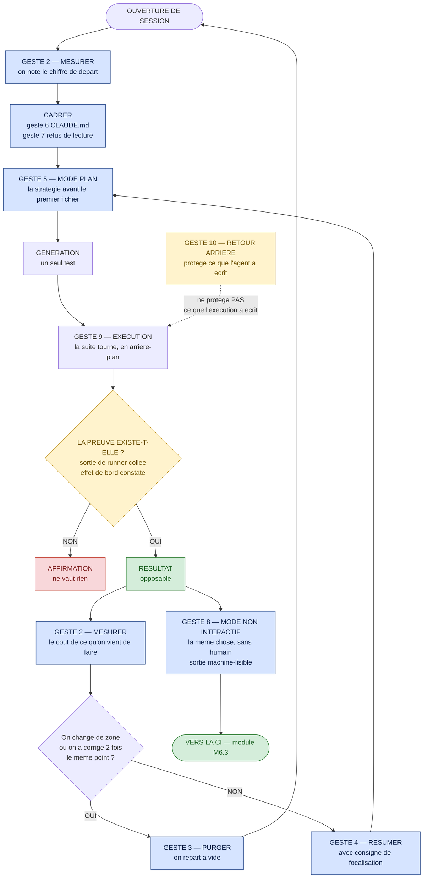
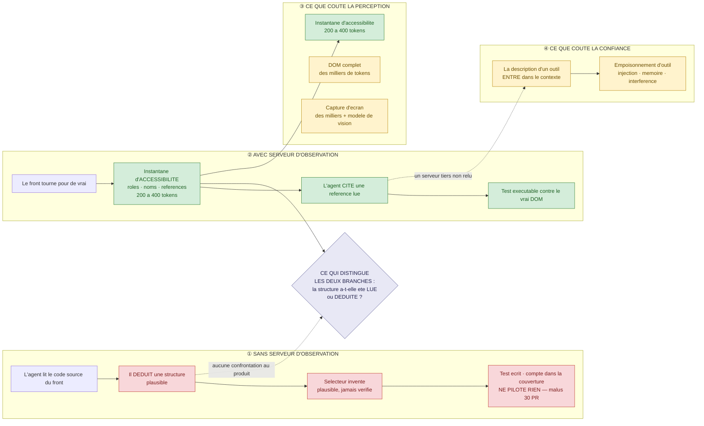
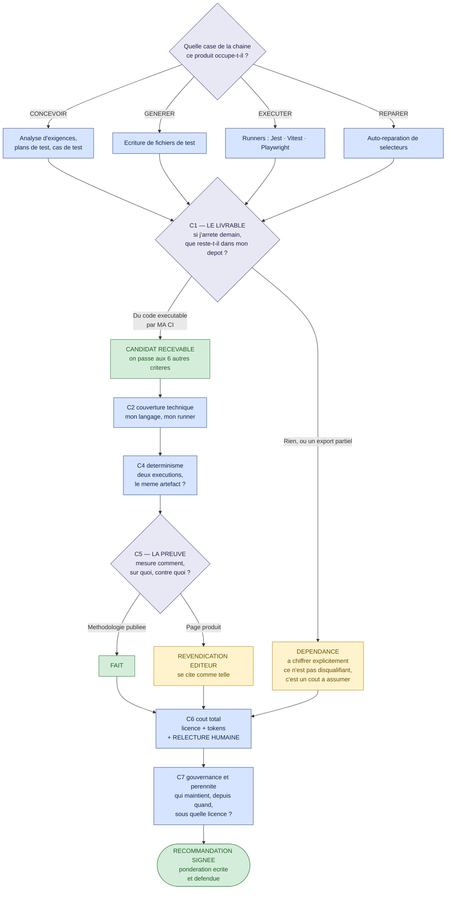

# Module M4 — « L'atelier »

> **Jour 2 · après-midi · 120 min de notions + 60 min de col · 3 notions**
> *Promesse au participant : « À la fin de ce module, vous saurez faire travailler un agent contre
> le vrai produit, pas contre l'idée qu'il s'en fait. »*

**Document formateur.** Il se déroule tel quel en séance. Les encadrés 🔐 ne sont jamais projetés.
Référence de vérité du terrain : `00-carte-du-terrain.md`. Contrat d'écriture : `00-gabarit-notion.md`.

> ⚠️ **Avertissement de fraîcheur — à répercuter en séance, une fois, à l'ouverture du module.**
> Tout ce qui est écrit ici sur l'outillage est **à jour au 07/2026** et **périmera**. Trois faits
> à connaître avant de projeter quoi que ce soit :
> 1. La documentation de Claude Code vit désormais sur **`code.claude.com/docs/en/`** — les liens
>    historiques vers `docs.anthropic.com` et `docs.claude.com` redirigent, et les pages ont été
>    **réécrites**, pas seulement déplacées.
> 2. **`.claudeignore` n'existe pas.** Le mécanisme officiel d'exclusion est `permissions.deny`
>    dans `.claude/settings.json` ; il remplace un dispositif antérieur explicitement déprécié.
> 3. **`temperature = 0` n'est pas le déterminisme.** C'est une réduction de variabilité, pas une
>    garantie de reproductibilité — et sur les modèles récents, `temperature`, `top_p` et `top_k`
>    sont dépréciés et renvoient une erreur 400. Un participant qui repart avec « il suffit de
>    mettre la température à zéro » repart avec une croyance fausse.

---

## 0. Carte du module

### 0.1 Objectif terminal

> À l'issue de M4, le·a participant·e est capable de **piloter un agent contre le produit réel** :
> ouvrir et tenir une session de travail QA, brancher un serveur MCP qui donne à l'agent une
> perception vérifiable du front, et **défendre un choix d'outil devant sa hiérarchie** avec des
> critères, pas des préférences.

C'est le seul objectif terminal du module. Tout le reste y concourt.

### 0.2 Position dans le fil rouge — *L'Expédition*, 🎒 l'équipement

| | |
|---|---|
| **Ce qui existe avant M4** | Le matin du J2 (module M3) a produit trois artefacts : un **gabarit de prompt à cinq blocs**, une **méthode de budget de contexte** en quatre gestes — mesurer, choisir, déléguer, purger — et une **convention de versionnage de prompt** dans le dépôt. Les participants savent quoi écrire à la machine. Ils ne savent pas encore **où le taper, avec quels garde-fous, ni comment vérifier que l'agent a réellement regardé le produit**. |
| **Ce qui existe après M4** | Chaque cordée a une **session Claude Code tenue** : un `CLAUDE.md` de projet, une règle de refus de lecture, un budget de contexte relevé, et la trace d'une exécution non interactive. Le groupe a vu, en direct, un **sélecteur halluciné mourir contre le vrai DOM** de la carte Leaflet. Et chaque cordée a produit une **grille de choix d'outil** défendable. Le col J2 peut alors demander un agent complet : les trois briques y sont. |
| **Ce que M4 ne fait pas** | On ne construit pas encore l'agent complet — pas de skill, pas de subagent, pas de hook : c'est **M5.3** et le col J2 pour la version outillée à la main. On ne met rien en CI : c'est **M6.3**. On ne mesure pas la dérive dans la durée : c'est **M8.2**. |

### 0.3 Les trois notions

| # | Notion | Modalité (critère) | Durée | Terrain | Micro-évaluation |
|---|---|---|---|---|---|
| **M4.1** | Claude Code : les dix gestes qui servent en QA | **SOLO** (`C-1`) | 40 | **Z1 · Z4** ⚪ feature #3 — *Récupération de mot de passe* | Exercice court (6 min) |
| **M4.2** | MCP : donner des yeux à l'agent | **DESC** + démo (`A-2`) | 40 | **Z6** ⚪ feature #15 — *Carte, visualisation* · contre le **vrai DOM** | QCM éclair (3 q.) |
| **M4.3** | Choisir son outil : panorama et critères | **INV** (`D-1`) | 40 | transverse — recherche documentaire + restitution | Restitution notée (grille) |

**Rythme** — SOLO · DESC · INV : aucun doublon consécutif (`R-1` ✓) · première séquence de
l'après-midi **active** (`R-7` ✓ — on ouvre au clavier, pas à l'écoute) · la pédagogie inversée du
jour est ici (`R-2` ✓) · aucune ligne descendante de plus de 12 min sans interaction (`R-5` ✓) ·
clôture du module sur le col J2, victoire mesurable (`R-8` ✓).

> **Note de conception sur le rythme.** Il n'y a pas de jeu sérieux dans M4 : le J2 place le sien
> le matin (M3.1, *Le Pari*). La règle `R-3` — au moins un jeu par jour — est donc satisfaite au
> niveau de la journée, pas du module. C'est volontaire : l'après-midi du J2 est un **atelier**,
> et sa tension vient du clavier, pas d'un dispositif de jeu.

### 0.4 Minutage de la demi-journée

| Créneau | Séquence | Durée | Cumul |
|---|---|---|---|
| 14:00 → 14:40 | **M4.1** — Les dix gestes qui servent en QA | 40 | 40 |
| 14:40 → 15:20 | **M4.2** — MCP : donner des yeux à l'agent | 40 | 80 |
| 15:20 → 15:35 | **Pause** | 15 | 95 |
| 15:35 → 16:15 | **M4.3** — Choisir son outil : panorama et critères | 40 | 135 |
| 16:15 → 17:15 | 🏆 **BOSS J2 — « L'Éclaireur »** | 60 | 195 |
| 17:15 → 17:30 | **Le Débrief** — corrigé du col, scoreboard, ce qu'on retient | 15 | 210 |

**Contrôle** : 40 + 40 + 15 + 40 + 60 + 15 = **210 min** ✓ (après-midi conforme à
`00-architecture-28h.md` §2).

**Contrôle des notions** : 40 + 40 + 40 = **120 min** ✓

### 0.5 Points de Repère mobilisables sur le module

| Source | Gain |
|---|---|
| Micro-évaluation M4.1 réussie | 10 PR |
| Badge 💰 **Le Frugal** — même résultat qu'une autre cordée, avec moins de tokens relevés | 10 PR |
| Micro-évaluation M4.2 (QCM éclair 3/3) | 10 PR |
| Restitution M4.3 jugée complète | 20 PR |
| Aide à une autre cordée, validée par elle | +10 PR |
| 🏆 **Col J2 franchi** | 0 à 100 PR |
| **Total maximal du module, col compris** | **150 PR** |

### 0.6 Préparation matérielle — la veille

| Vérification | Commande / geste | Attendu |
|---|---|---|
| Claude Code est installé sur chaque poste | lancer l'outil dans le dépôt | l'invite s'ouvre, le répertoire de travail est le dépôt |
| Le dépôt est à l'état de départ | `git status` | propre — **aucun** fichier `.md` résiduel dans le magasin |
| La suite back sort bien en rouge | `npm run test:backend` | 2 suites passent, 2 suites échouent |
| Le back démarre | démarrage du backend NestJS | `http://localhost:3000/api` répond |
| Le front démarre | démarrage du front Vite | `http://localhost:5173` s'affiche, la carte se charge |
| Playwright est prêt | `npx playwright install` | navigateurs téléchargés |
| Le serveur MCP Playwright répond | `claude mcp add playwright npx @playwright/mcp@latest` puis `/mcp` | le serveur apparaît « connecté » |
| Le répertoire `data/mails/` est vide | inspection | vide — **la démonstration de M4.1 repose sur l'apparition d'un fichier** |
| La capture de repli de M4.2 est prête | copie d'écran du dernier instantané d'accessibilité réussi | conservée dans `annexes/` |
| Le poste de démonstration a du réseau | test | requis pour M4.3 (recherche documentaire) |

🔐 **Réservé formateur** : le raccourci `grep -rn "BUG:" backend/src` a été révélé au débrief du col
J1. Il est désormais connu de la salle. **Cela ne change rien à M5.1** — la chasse du J3 se joue
avec l'interdiction explicite de l'employer, et cette interdiction s'annonce comme une règle du
jeu, pas comme un secret.

---

## 1. Notion M4.1 — « Claude Code : les dix gestes qui servent en QA »

|  |  |
|---|---|
| **Durée** | 40 min |
| **Modalité** | Exercice individuel — **SOLO** guidé |
| **Objectif d'apprentissage** | À l'issue, le·a participant·e est capable d'**exécuter les dix gestes de session, de contexte et de permission** sur une fonctionnalité non testée, et de **relever le coût de sa session** avant et après |
| **Niveau visé (Bloom)** | **Appliquer** |
| **Micro-évaluation** | Exercice court (6 min) |
| **Ancrage fil rouge** | **Z1 · Z4** · ⚪ feature #3 *Récupération de mot de passe* (`POST /api/auth/forgot-password`, `POST /api/auth/reset-password`). *Pourquoi cette fonctionnalité : c'est le seul terrain vierge du dépôt dont le contrat spécifie un **effet de bord physique** — l'écriture d'un fichier `data/mails/{timestamp}-{email}.md`. Les gestes de session cessent donc d'être une démonstration d'ergonomie : ils portent sur un cas où « le test est passé » et « le fichier existe » sont deux affirmations différentes, et où la seconde se constate à l'œil.* Ce que la notion fait avancer : la session de travail du col J2 est ouverte, configurée et budgétée. |
| **Prérequis** | M3.3 (les quatre gestes de contexte : mesurer, choisir, déléguer, purger) et M3.4 (la convention de versionnage) |

### ▸ Pourquoi cette modalité

L'objectif est d'**exécuter un geste technique reproductible**, donc critère `C-1` de
`00-grille-modalites.md` : *« la compétence gestuelle est individuelle. En groupe, un seul
apprend. »* Une démonstration au vidéoprojecteur produit une salle qui a **vu** taper `/context` ;
elle ne produit personne qui l'ait **tapé**. Or ces dix gestes sont exactement ce qui sépare, au
col J2, une cordée qui perd vingt minutes à chercher où se déclare une permission d'une cordée qui
construit son agent. La notion est donc au clavier, chacun sur sa machine, avec une feuille de
route et un chronomètre. Le formateur ne montre rien : il débloque. La notion ouvre l'après-midi
et satisfait `R-7` — le creux post-prandial ne se combat pas en parlant.

### ▸ Ce qu'il faut avoir compris à la fin

- **Une session se tient.** On l'ouvre au bon endroit, on **mesure** son occupation, on la **purge**
  entre deux zones et on la **résume avec une consigne de focalisation** quand elle est longue.
  Ces trois gestes ne sont pas du confort : la performance d'un modèle **se dégrade à mesure que
  son contexte se remplit**.
- **Le plan précède le code.** Sur une fonctionnalité non testée, le mode plan produit une
  stratégie qu'on relit **avant** qu'un fichier soit écrit. C'est le seul moment où corriger coûte
  une phrase.
- **La mémoire projet est un fichier versionné, pas une conversation.** Ce que l'équipe veut voir
  respecté à chaque session s'écrit dans `CLAUDE.md`, et l'outil lit `CLAUDE.md` — **pas**
  `AGENTS.md`.
- **Le fichier d'exclusion n'existe pas.** Ce qu'on ne veut pas voir lu se déclare en **refus de
  lecture** dans la configuration de permissions, et le refus prime sur l'autorisation.
- **Le mode non interactif est le pont vers la CI.** Une même consigne qui tourne dans un terminal
  et qui rend un objet machine-lisible, c'est ce qui rend l'agent industrialisable — et c'est
  exactement ce que le col J2 demandera.

### ▸ Déroulé minuté

| Temps | Le formateur | Les participants |
|---|---|---|
| **0-4** *(4)* | **OUVERTURE PAR LE RELEVÉ.** Aucune introduction. « Ouvrez une session dans le dépôt. Ne tapez aucune question. Affichez immédiatement l'occupation de votre contexte et **écrivez le chiffre sur votre feuille**. Vous avez trois minutes. » Puis relève trois chiffres à voix haute et les écrit au tableau. « Vous n'avez rien demandé et vous consommez déjà. Voilà le point de départ. » | Ouvrent la session, affichent le contexte, notent le chiffre. Découvrent que la session n'est jamais vide — mémoire projet, outils, système. |
| **4-9** *(5)* | **LA FICHE DES DIX GESTES.** Distribue la fiche (voir §Fiche) et la commente en trois familles seulement : **tenir la session** (1-4), **cadrer l'agent** (5-7), **sortir de l'interactif** (8-10). Ne détaille aucun geste : ils vont les faire. Annonce la règle : « je ne montre rien à l'écran pendant les quatorze prochaines minutes. » | Lisent la fiche, repèrent les trois familles, posent au maximum deux questions de vocabulaire. |
| **9-23** *(14)* | **L'ATELIER SOLO.** Chronomètre affiché. Circule, débloque, **ne fait à la place de personne**. Deux relances programmées : à 6 min — *« qui a déjà écrit dans son `CLAUDE.md` quelque chose qu'il n'a pas eu à répéter ensuite ? »* ; à 11 min — *« celui qui a lancé la suite : votre agent a-t-il attendu le résultat, ou l'a-t-il supposé ? »* | Déroulent la feuille de route en dix étapes sur la feature #3 (voir §Feuille de route). Chacun sur sa machine. Relèvent leur coût de contexte à trois moments imposés. |
| **23-27** *(4)* | **LE RELEVÉ COMPARÉ.** Fait afficher au tableau, pour trois participants, les trois chiffres relevés : départ, après chargement, après purge. Ne commente qu'une chose : l'écart entre les postes. Attribue le badge 💰 **Le Frugal** au plus bas coût **à résultat égal** — et insiste sur les trois derniers mots. | Comparent. Constatent que l'écart entre deux postes vient de **ce qui a été ouvert**, pas de l'outil. |
| **27-31** *(4)* | **LE PIÈGE DE CONFIGURATION.** Projette une configuration de permissions qui semble juste et demande : « qu'est-ce qui, là-dedans, ne sera **pas** appliqué ? » Laisse chercher 90 secondes, puis donne la réponse (voir §Démonstration). Enchaîne sur l'absence de fichier d'exclusion. | Cherchent, se trompent presque tous, retiennent. Une question tombe toujours : *« comment on sait, alors ? »* — la réponse est dans les Pièges d'animation. |
| **31-37** *(6)* | **MICRO-ÉVALUATION.** Projette l'énoncé, distribue la fiche-réponse, chronomètre 4 min, corrige en 2 min case par case. | Font l'exercice court, seuls. Comparent avec leur voisin pendant la correction. |
| **37-40** *(3)* | **SYNTHÈSE — la parole est aux participants.** « Sans vos notes : lequel des dix gestes allez-vous faire **lundi matin**, et sur quoi ? » Fait parler trois personnes, n'ajoute rien, enchaîne sur M4.2. | Formulent. Réponse attendue : *« mesurer avant de charger, et écrire dans le fichier de mémoire ce que je ne veux plus répéter. »* |

**Contrôle : 4 + 5 + 14 + 4 + 4 + 6 + 3 = 40 min ✓**

### ▸ Contenu à transmettre

**1. Le principe unique dont les dix gestes découlent.** La documentation de bonnes pratiques
l'énonce en une phrase d'ouverture : *« la plupart des bonnes pratiques reposent sur une seule
contrainte : la fenêtre de contexte se remplit vite, et la performance se dégrade à mesure qu'elle
se remplit. »* Tout ce qui suit — mesurer, purger, résumer, déléguer, refuser une lecture — sert
cette contrainte, et rien d'autre.

**2. Les trois familles de gestes.**

| Famille | Ce qu'elle règle | Le geste qui la résume |
|---|---|---|
| **Tenir la session** | Le coût et la qualité au fil du temps | Mesurer avant de charger, purger entre deux zones |
| **Cadrer l'agent** | Ce qu'il a le droit de lire, d'écrire, de lancer | Écrire la règle une fois, dans un fichier versionné |
| **Sortir de l'interactif** | Le passage du poste au pipeline | Une consigne, une sortie machine-lisible |

**3. La règle des deux corrections.** *« Si vous avez corrigé le même point plus de deux fois dans
une même session, purgez et repartez de zéro. »* Ce n'est pas une règle d'hygiène : c'est le
constat qu'un contexte pollué produit des erreurs qu'on attribuera ensuite au modèle. En QA, le
symptôme typique est l'agent qui régénère trois fois le même test faible parce qu'il a lu, une
fois, un test faible.

**4. Ce qui n'existe pas — et ce qui le remplace.** Le réflexe de salle est immédiat : « on pose un
fichier d'exclusion à la racine ». **Ce fichier n'existe pas.** Le mécanisme officiel est une règle
de **refus de lecture** en configuration, et il **remplace explicitement un dispositif antérieur
déprécié**. Deuxième piège, plus coûteux : **toutes les règles de permission ne sont pas appliquées
de la même façon.** Seules les règles portant sur la **lecture** et l'**édition** d'un chemin sont
réellement mises en œuvre ; d'autres formes sont **acceptées sans être appliquées**, avec un simple
avertissement au démarrage. Une équipe qui croit avoir verrouillé l'écriture par une règle non
appliquée a une **fausse garantie** — c'est-à-dire pire que pas de garantie.

**5. La vérification est le premier chapitre, pas le dernier.** La même documentation ouvre sur
*« donnez à Claude un moyen de vérifier son travail »* et conclut : *« si vous ne pouvez pas le
vérifier, ne le livrez pas. »* En QA, cela se traduit sans ambiguïté : **une suite déclarée verte
sans sortie de runner collée n'est pas un résultat, c'est une affirmation.** Le col J2 en fait un
critère à 25 points.

**6. L'ordre de grandeur du coût, pour répondre à la question qui vient toujours.** Le coût moyen
observé est d'environ **13 $ par développeur et par jour actif**, et **150 à 250 $ par
développeur et par mois** ; il reste **sous 30 $ par jour actif pour 90 % des usages**. À dire
tel quel, sans commentaire : le chiffre coupe court à deux fantasmes opposés, celui du gratuit et
celui du gouffre.

**7. La phrase à faire noter.**

> *Un agent ne se pilote pas à la question. Il se pilote au **cadre** : ce qu'il lit, ce qu'il a le
> droit d'écrire, et ce qu'il doit prouver avant de rendre la main.*

*(≈ 520 mots)*

### ▸ 🧰 La fiche des dix gestes — à distribuer, recto unique

> **Convention de lecture.** La colonne *« Ce qu'on tape »* décrit le geste, pas une syntaxe figée :
> les noms de commandes bougent d'une version à l'autre. **Le formateur vérifie la veille** que les
> dix gestes fonctionnent tels quels sur la version installée, et corrige la fiche si nécessaire.
> C'est une opération de cinq minutes qui évite une séance humiliante.

| # | Geste | Ce qu'on tape | Pourquoi il sert **en QA**, précisément |
|---|---|---|---|
| **1** | **Ouvrir et reprendre une session** | Lancer l'outil dans le répertoire du dépôt ; reprendre la dernière session ; reprendre une session nommée | Une session QA se déroule sur plusieurs heures et plusieurs zones. Repartir de zéro à chaque interruption fait perdre le cadre, pas seulement l'historique |
| **2** | **Mesurer le contexte** | `/context` — affiche l'occupation sous forme de grille colorée, avec les suggestions d'optimisation | **Le geste fondateur.** On mesure **avant** de charger et **après**. Sans mesure, l'optimisation de contexte est une opinion |
| **3** | **Purger** | `/clear` — repart d'un contexte vide | Entre deux zones du dépôt. Et à la **deuxième correction répétée** dans une session |
| **4** | **Résumer avec une consigne** | `/compact <instructions de focalisation>` — résume la conversation en gardant ce qu'on désigne | Sur une session longue, on garde *« les exigences extraites et les sorties de runner »* et on jette le reste. La consigne de focalisation est facultative dans l'outil, **obligatoire en QA** |
| **5** | **Passer en mode plan** | Cycler les modes de permission (`Shift`+`Tab`) jusqu'au mode plan | Sur une fonctionnalité non testée, on veut **lire la stratégie de test avant** que le premier fichier soit écrit. Six modes existent ; c'est le seul qui n'écrit rien |
| **6** | **Écrire la mémoire projet** | Créer ou compléter `CLAUDE.md` à la racine du dépôt | Ce qu'on ne veut plus jamais répéter : les trois runners, la commande exacte, l'interdiction de toucher aux tests existants. **Cible : sous 200 lignes.** L'outil lit `CLAUDE.md`, **pas** `AGENTS.md` — pour ce dernier, on l'importe depuis `CLAUDE.md` |
| **7** | **Déclarer les permissions** | Bloc `permissions` de `.claude/settings.json`, en **refus prioritaire** | Refuser la lecture de ce qui n'a aucune valeur pour un test — et de ce qui est sensible. ⚠️ **Toutes les formes de règles ne sont pas appliquées** : voir §Démonstration |
| **8** | **Lancer sans interactif** | `claude -p "<consigne>" --output-format json` | Le pont vers la CI. La sortie structurée se relit avec un outil, se journalise, se compare. Le mode non interactif accepte aussi une limite de tours — **il n'y en a aucune par défaut** |
| **9** | **Exécuter en arrière-plan** | Passer une commande longue en tâche de fond (`Ctrl`+`B`) | Lancer la suite de tests pendant que l'agent continue d'analyser. **Le seul geste qui change le rythme d'une séance de QA** |
| **10** | **Revenir en arrière** | `/rewind` — point de reprise créé **à chaque message utilisateur**, 100 conservés par session | Annuler une génération ratée sans perdre la conversation. ⚠️ **Limite majeure à connaître : les fichiers modifiés par une commande shell ne sont pas tracés.** Sur ce dépôt, les fichiers `.md` écrits dans le magasin par une exécution de suite **ne seront pas restaurés** |

> 🎯 **Le geste 10 et sa limite forment à eux seuls un enseignement.** Le point de reprise protège
> ce que l'agent a écrit ; il ne protège pas ce que **l'exécution** a écrit. Or en QA, c'est
> précisément l'exécution qui salit le magasin. La restauration se fait donc avec l'outil de
> versionnement, pas avec la fonction de retour arrière. Le faire dire par la salle.

### ▸ 🗺️ La feuille de route de l'atelier — 14 minutes, feature #3

> **Consigne, en trois lignes.** Dix étapes, chacune tenant en une ou deux commandes. Vous relevez
> votre coût de contexte aux étapes **1**, **6** et **10**. Vous **n'écrivez aucun test définitif** :
> l'objet de l'exercice est le geste, pas le livrable. Le livrable, c'est le col de 16 h 15.

| Étape | Ce que vous faites | Le résultat à constater |
|---|---|---|
| **1** | Ouvrez la session dans le dépôt, mesurez le contexte, **notez le chiffre** | Un nombre, avant toute demande |
| **2** | Créez ou complétez `CLAUDE.md` : les trois runners, la commande de la suite back, et **une interdiction** — ne jamais modifier un fichier de test existant | Un fichier versionné, sous 200 lignes |
| **3** | Déclarez un refus de lecture sur les répertoires de dépendances et de construction | La configuration existe et l'outil ne proteste pas au démarrage |
| **4** | Passez en mode plan et demandez la **stratégie de test** de `POST /api/auth/forgot-password`, en fournissant la section §Auth du contrat | Un plan à l'écran. **Aucun fichier écrit** |
| **5** | Relisez le plan et cherchez ce qui manque : le contrat impose **200 même si l'email n'existe pas**, et l'écriture d'un fichier `data/mails/{timestamp}-{email}.md` | Le plan mentionne-t-il l'effet de bord fichier ? *Dans la majorité des cas, non* |
| **6** | Mesurez le contexte, **notez le chiffre** | L'écart avec l'étape 1 est le coût du chargement |
| **7** | Sortez du mode plan, laissez générer **un seul** test, et **exécutez la suite backend** | Une sortie de runner, collée dans vos notes |
| **8** | Lancez une seconde exécution **en arrière-plan** et, pendant ce temps, demandez à l'agent de lister ce que le contrat exige et que le test ne couvre pas | Deux choses avancent en même temps |
| **9** | Vérifiez à l'œil le répertoire `data/mails/` : un fichier est-il apparu ? Le test l'a-t-il vérifié ? | ⭐ **Le moment de la notion.** Le test peut être vert et le fichier absent — ou présent et non nettoyé |
| **10** | Purgez la session, mesurez, **notez le chiffre**, puis relancez la même demande en mode non interactif avec une sortie structurée | Un objet machine-lisible en sortie de terminal |

> 🎯 **L'étape 9 est le cœur pédagogique de l'atelier, et elle est déguisée en manipulation.**
> La feature #3 a un effet de bord **physique et visible** : un fichier apparaît dans un
> répertoire. C'est la seule fonctionnalité du dépôt où « le test est vert » et « le produit a
> fait ce qu'il devait faire » se vérifient **séparément, à l'œil, en deux secondes**. Le
> participant qui constate l'écart n'a plus besoin qu'on lui explique la notion de vérification.

### ▸ 🖼️ Diagramme — `diagrammes/M4-1-la-session-qa.svg`

#### Source Mermaid



#### Descriptif du SVG à produire

Format portrait 1200 × 1500, imprimable en A4 portrait et **affichable au mur pendant les trois
jours restants**. Une colonne centrale unique décrivant le cycle d'une session : pastille
d'ouverture en haut, puis une chaîne verticale de rectangles bleus (les gestes) reliés par des
flèches pleines. Deux **boucles de retour** sur la gauche, tracées en arc : l'une repart de la
décision *« on change de zone ? »* vers l'ouverture (purge), l'autre vers le mode plan (résumé).
Au centre-bas, un **losange épais** portant *« La preuve existe-t-elle ? »* avec deux sorties
franchement contrastées : à gauche un encadré rouge *« Affirmation — ne vaut rien »*, à droite un
encadré vert *« Résultat — opposable »*. Sur la droite, détachée, une **branche unique** qui part
du bloc vert vers une pastille *« Vers la CI »* : c'est la seule sortie du cycle. Enfin, en bas à
droite, un encadré jaune isolé *« Retour arrière »* relié à l'étape d'exécution par une **flèche
barrée d'une croix**, légendée *« ne protège pas ce que l'exécution a écrit »*. Les dix gestes sont
numérotés sur le schéma, en pastille circulaire, pour que la fiche papier et le mur se répondent.

#### Explication du diagramme — notice de dévoilement

| Ordre | Ce qu'on affiche | La phrase à dire | Erreur à prévenir |
|---|---|---|---|
| 1 | **La colonne centrale seule, sans le losange** | « Voilà une session de travail. Six gestes, dans l'ordre. Vous venez de les faire. » | Ne pas commenter chaque bloc : ils viennent de les exécuter, la reconnaissance suffit. |
| 2 | **Le losange et ses deux sorties** | « Et voilà le seul embranchement qui compte. À gauche, ce que l'agent affirme. À droite, ce qu'il prouve. Ce sont deux objets différents, et un seul se livre. » | Ne pas laisser croire que la branche rouge est rare : c'est la branche **par défaut** tant qu'on n'a rien exigé. |
| 3 | **Les deux boucles de retour** | « Une session ne se déroule pas, elle **tourne**. Purger n'est pas un aveu d'échec : c'est le geste qui rend la session suivante bonne. » | Ne pas présenter purger et résumer comme équivalents : purger jette, résumer garde ce qu'on désigne. |
| 4 | **La branche vers la CI** | « Une seule sortie mène au pipeline, et elle part du bloc vert. On n'industrialise que ce qu'on prouve. » | C'est le pont vers M6.3 : l'annoncer, ne pas le développer. |
| 5 | **L'encadré jaune et sa flèche barrée** | « Dernière chose, et elle vous servira dès ce soir : le retour arrière ne restaure pas les fichiers qu'une commande a écrits. Sur ce dépôt, les fichiers du magasin ne reviendront pas. » | Ne pas laisser croire que la fonction est inutile — elle est très utile, sur un périmètre précis. |

⚠️ **Erreur d'interprétation à prévenir.** Le schéma sera lu comme une procédure obligatoire, à
dérouler intégralement à chaque fois. Le corriger à l'étape 3 : *« ce n'est pas une checklist,
c'est un cycle. Sur une petite tâche, vous ferez trois blocs sur dix. Ce qui n'est jamais
facultatif, c'est le losange. »*

### ▸ 🔍 Démonstration — la permission qui ne s'applique pas

**Point de départ.** Les participants viennent de déclarer leurs propres refus de lecture
(étape 3 de la feuille de route). Ils sont convaincus d'avoir verrouillé quelque chose. C'est le
moment de la démonstration : elle dure quatre minutes et elle vaut pour toute la journée.

**Le geste exact.** Projeter cette configuration — elle a l'air impeccable, et elle est piégée.

```jsonc
// .claude/settings.json — configuration projetée, volontairement défectueuse
{
  "permissions": {
    "deny": [
      "Read(./node_modules/**)",
      "Read(./dist/**)",
      "Read(./.env)"
    ],
    "allow": [
      "Read(./docs/**)",
      "Edit(./backend/src/**/*.spec.ts)"
    ],
    "ask": [
      "Write(./backend/src/**)"
    ]
  }
}
```

Poser une seule question : **« qu'est-ce qui, là-dedans, ne sera pas appliqué ? »** Laisser
chercher 90 secondes en silence. La salle cherche presque toujours une faute de syntaxe.

**Le résultat obtenu.** La réponse n'est pas dans la syntaxe : elle est dans le **type de règle**.
Les règles portant sur la **lecture** et l'**édition** d'un chemin sont réellement appliquées. Les
règles portant sur l'**écriture** d'un chemin, sur l'édition de carnets ou sur les motifs de
recherche de fichiers sont **acceptées, mais jamais appliquées** — un avertissement est émis au
démarrage, et il passe inaperçu. Dans la configuration ci-dessus, la ligne `Write(./backend/src/**)`
donne le sentiment d'un garde-fou sur l'écriture du code de production. **Elle n'en est pas un.**

**Ce que l'exemple révèle.** Trois choses, dans cet ordre :

1. **Une fausse garantie est pire que pas de garantie**, parce qu'elle supprime la vigilance.
2. **Le refus prime sur l'autorisation** — c'est la seule règle de précédence à retenir, et elle
   joue en votre faveur : on verrouille par le refus, jamais par l'oubli d'autoriser.
3. **Le garde-fou d'écriture existe, mais il n'est pas là.** Il se pose ailleurs : dans un **hook**
   qui inspecte l'opération avant qu'elle ait lieu et la refuse. C'est exactement l'objet de M5.3
   et du col J2 — l'annoncer en une phrase, ne pas le développer.

**Ce qui peut rater, et le repli associé.**

| Risque | Signe | Repli |
|---|---|---|
| La version installée applique désormais la règle | aucun avertissement au démarrage | **Le dire, et en faire la leçon** : *« la règle a changé depuis la rédaction de ce support. Notez-le : c'est exactement pourquoi on ne mémorise pas une liste, on vérifie au démarrage. »* |
| Un participant a modifié la configuration globale de son poste | comportement incohérent d'une machine à l'autre | Travailler sur la configuration **de projet**, dans le dépôt, jamais sur celle de l'utilisateur |
| La salle part sur la syntaxe JSON | 3 minutes perdues | Couper à 90 secondes : *« la syntaxe est juste. Cherchez ailleurs. »* |
| Un participant demande la liste exhaustive des règles appliquées | débat sans fin | Renvoyer à la page de configuration des permissions, et à la vérification au démarrage. La liste bouge, la méthode non |

### ▸ ✅ Micro-évaluation — Exercice court (6 min)

**Énoncé** *(trois lignes, projeté et distribué)*

> Vous ouvrez une session sur la feature #3 — *Récupération de mot de passe*.
> 1. Pour chacune des **quatre situations** ci-dessous, écrivez **le geste** de la fiche (son
>    numéro suffit) et **une ligne** de justification.
> 2. Question 5 : citez **une** chose que le retour arrière ne restaurera pas sur ce dépôt.

| # | Situation |
|---|---|
| **A** | L'agent a proposé trois fois de suite un test qui vérifie seulement le statut 200, alors que vous lui avez expliqué deux fois qu'il faut vérifier le fichier écrit. |
| **B** | Vous vous apprêtez à demander la génération de la suite complète, et vous voulez lire la stratégie avant qu'un fichier soit créé. |
| **C** | Vous voulez que la consigne « ne jamais modifier un fichier de test existant » soit respectée demain, par un collègue, sans que personne ait à la retaper. |
| **D** | Vous voulez faire tourner cette même génération toutes les nuits, et récupérer un résultat exploitable par un script. |

**Matériel** — la fiche des dix gestes, une fiche-réponse par personne, un stylo.

**Résultat attendu vérifiable** *(cases à cocher, contrôle en moins de 60 secondes)*

- [ ] **A → geste 3 (purger)**, au titre de la **règle des deux corrections**. *(Accepté aussi :
      geste 4, résumer avec consigne, si la justification porte sur la conservation d'un acquis.
      Refusé : « reformuler le prompt » — ce n'est pas un geste de la fiche, et cela ne traite pas
      la cause.)*
- [ ] **B → geste 5 (mode plan)**, parce que c'est le seul mode qui n'écrit aucun fichier.
- [ ] **C → geste 6 (`CLAUDE.md`)**, parce que la mémoire projet est **versionnée** et donc
      partagée. *(Refusé : « le redire dans le prompt » — cela ne survit pas à la session.)*
- [ ] **D → geste 8 (mode non interactif avec sortie structurée)**.
- [ ] **Question 5** : les **fichiers écrits par une commande shell** — sur ce dépôt, typiquement
      les fichiers `.md` laissés dans le magasin par une exécution de suite, ou le fichier
      `data/mails/{timestamp}-{email}.md` créé par un appel à `POST /api/auth/forgot-password`.

**Solution de référence** — A : 3 · B : 5 · C : 6 · D : 8 · Q5 : les fichiers produits par
l'exécution, non tracés par les points de reprise.

**L'erreur que 80 % des groupes commettent.** Sur la situation **C**, la réponse spontanée est
« geste 7, les permissions ». C'est une confusion utile à traiter en trente secondes : **les
permissions disent ce qui est autorisé, la mémoire projet dit ce qui est attendu.** « Ne jamais
modifier un test existant » est une **convention d'équipe** — elle va dans `CLAUDE.md`. Sa
version **contraignante**, celle qui bloque réellement l'opération, n'est ni l'un ni l'autre :
c'est un hook, et c'est M5.3. Cette distinction en trois niveaux — convention, permission,
blocage — est ce que la micro-évaluation cherche à installer.

### ▸ 🔗 Ressources

| Ressource | À qui elle s'adresse | Ce qu'il faut y lire précisément |
|---|---|---|
| *Best practices for Claude Code* — https://code.claude.com/docs/en/best-practices | **La référence de la notion** | La première section, *« Give Claude a way to verify its work »*, sa gradation en quatre niveaux, et la formule *« if you can't verify it, don't ship it »*. Plus la **règle des deux corrections**. ⚠️ Cette page a remplacé un ancien billet d'ingénierie par redirection : **son contenu a été réécrit**, ne pas citer l'ancien de mémoire. |
| *Commands (`/clear`, `/compact`, `/context`)* — https://code.claude.com/docs/en/commands | Celui qui tient une session | Le libellé exact des trois commandes, et le fait que `/compact` accepte des **instructions de focalisation**. Y figurent aussi trois commandes fournies directement utiles en QA, dont une qui **construit, lance l'application et observe le résultat** plutôt que de se fier au typage ou aux tests. |
| *How Claude remembers your project* — https://code.claude.com/docs/en/memory | Celui qui écrit la convention d'équipe | La cible **sous 200 lignes**, les quatre emplacements hiérarchisés, les imports `@chemin` avec une **profondeur maximale de 4 sauts**, et la phrase à connaître : *« Claude Code reads `CLAUDE.md`, not `AGENTS.md` »* — avec la parade par import. |
| *Claude Code settings — Exclude sensitive files* — https://code.claude.com/docs/en/settings | Celui qui croit au fichier d'exclusion | Le fait que **`.claudeignore` n'existe pas**, et la phrase officielle : le mécanisme de permissions *« remplace la configuration `ignorePatterns` dépréciée »*. |
| *Configure permissions* — https://code.claude.com/docs/en/permissions | **Le piège de la démonstration** | La précédence **refus d'abord**, et surtout la liste des règles **acceptées mais non appliquées**, avec l'avertissement émis au démarrage. |
| *Run Claude Code programmatically (headless)* — https://code.claude.com/docs/en/headless | Celui qui prépare la CI | La sortie structurée, le détail de coût qu'elle contient, l'option qui **saute toute l'auto-découverte** (recommandée pour les appels scriptés), et le code de sortie renvoyé sur interruption. |
| *Explore the context window* — https://code.claude.com/docs/en/context-window | Le curieux | Le **simulateur interactif**, et le tableau *« ce qui survit à la compaction »* : ce qui est relu depuis le disque et ce qui est perdu. |
| *Checkpointing (`/rewind`)* — https://code.claude.com/docs/en/checkpointing | Celui qui veut un filet | Le rythme de création des points de reprise, leur nombre conservé, et **la limite qui fait la notion** : les fichiers modifiés par une commande shell ne sont pas tracés. |

### ▸ ⚠️ Pièges d'animation

- **Ce qui rate habituellement** : l'atelier devient une démonstration. Un participant bloque, le
  formateur prend le clavier, et la salle regarde. **Règle de survie : le formateur ne touche
  jamais le clavier d'un participant.** Il pose une question, il montre où lire. Le geste appris
  est celui qu'on a fait soi-même — c'est tout le sens du critère `C-1`.
- **La question qui revient toujours** : *« et si je ne veux pas que ça lise mon code ? »* Réponse
  courte : *« vous le déclarez en refus de lecture, et vous vérifiez au démarrage qu'aucun
  avertissement ne s'affiche. Le fichier d'exclusion que vous cherchez n'existe pas. »* Ne pas
  ouvrir le débat sur la confidentialité : il est traité en **M8.3**, avec les bons référentiels.
- **Le piège de version** : les noms de commandes et les comportements changent d'une version à
  l'autre — des commandes ont été supprimées, d'autres ne s'exécutent plus que sur invocation
  explicite. **La fiche des dix gestes se revérifie la veille.** Le dire à la salle, franchement :
  *« ce support a été écrit en juillet 2026. Ce qui ne bougera pas, ce sont les dix intentions ;
  ce qui bougera, ce sont les noms. »*
- **Le participant très en avance** : il a fini l'atelier en huit minutes. Ne pas lui donner
  d'exercice supplémentaire — lui donner un **rôle** : *« allez voir la cordée voisine et faites-la
  arriver à l'étape 9. »* C'est **+10 PR** si l'aide est validée, et le badge 🎓 **Le Guide**.
- **Le signe qu'il faut passer à la suite** : dès qu'un participant mesure son contexte **sans
  qu'on le lui demande**, avant de charger quelque chose, la notion est acquise. Ne pas prolonger
  l'atelier pour ceux qui n'ont pas fini les dix étapes : les étapes 8 et 10 se rattrapent au col.

---

## 2. Notion M4.2 — « MCP : donner des yeux à l'agent »

|  |  |
|---|---|
| **Durée** | 40 min |
| **Modalité** | Descendant + diagramme + **démonstration contre le vrai DOM** |
| **Objectif d'apprentissage** | À l'issue, le·a participant·e est capable d'**expliquer ce qu'un serveur MCP apporte à un agent de test**, de **brancher un serveur** sur le dépôt, et de **justifier par le coût en tokens** pourquoi l'arbre d'accessibilité est préféré à la capture d'écran |
| **Niveau visé (Bloom)** | **Comprendre** |
| **Micro-évaluation** | QCM éclair (3 questions) |
| **Ancrage fil rouge** | **Z6 — La vitrine** · ⚪ feature #15 *Carte — visualisation des journeys* (carte Leaflet, aucun test) et `PlaceSearchInput`. *Pourquoi cette zone : c'est la seule du dépôt où l'agent peut **inventer une réalité**. Sur le back, un service existe ou n'existe pas — l'erreur se voit à l'exécution. Sur le front, un sélecteur plausible ressemble exactement à un sélecteur vrai, et un test bâti dessus **ne s'exécute jamais** : il est écrit, livré, compté dans la couverture, et il ne pilote rien. Une carte interactive est le pire cas possible : elle est faite de couches injectées par une bibliothèque, et personne dans la salle n'en connaît le DOM par cœur.* Ce que la notion fait avancer : le malus **−30 PR « sélecteur inventé, jamais exécuté contre le vrai DOM »** cesse d'être une règle écrite pour devenir un souvenir. |
| **Prérequis** | M4.1 (la session est ouverte et configurée) et M1.4 (la position de l'oracle) |

### ▸ Pourquoi cette modalité

L'objectif est de **comprendre un mécanisme invisible** : comment un agent obtient une perception
du produit, et pourquoi cette perception coûte plus ou moins cher. Critère `A-2` de
`00-grille-modalites.md` — *« un mécanisme se voit ; le diagramme dévoilé progressivement fait plus
que 500 mots »*. Il n'y a rien à découvrir seul dans une architecture client-serveur : la faire
chercher coûterait quarante minutes pour un contenu qui s'énonce en cinq. En revanche, **la
révélation doit être vécue** : la notion s'ouvre donc sur un pari de quatre minutes où l'agent
produit un sélecteur, et où la salle parie sur son existence. La notion suit un SOLO (`R-1`
respecté) et n'excède jamais 6 minutes de descendant continu (`R-5`).

### ▸ Ce qu'il faut avoir compris à la fin

- **Un agent sans serveur d'observation programme les yeux bandés.** La formule est de
  l'éditeur du navigateur lui-même : les agents *« ne peuvent pas voir ce que le code qu'ils
  génèrent fait réellement quand il s'exécute dans le navigateur »*.
- **MCP est un protocole, pas un produit.** Architecture client-hôte-serveur sur JSON-RPC, relation
  **1 pour 1** entre un client et un serveur : un serveur ne lit pas la conversation entière et ne
  voit pas dans les autres serveurs. C'est ce qui rend le branchement de plusieurs serveurs sûr.
- **L'arbre d'accessibilité est le vrai déblocage, pas le modèle.** Le serveur Playwright MCP opère
  *« sur l'arbre d'accessibilité, pas sur les pixels — aucun modèle de vision requis »*, et chaque
  élément interactif y reçoit une **référence** stable.
- **L'écart de coût est un ordre de grandeur, pas une nuance** : un instantané d'accessibilité pèse
  **environ 200 à 400 tokens** ; un DOM complet ou une capture d'écran en pèsent des milliers.
- **La description d'un outil est du texte injecté dans le contexte, pas de la documentation
  inerte.** C'est le fondement des attaques par empoisonnement d'outil — et la raison pour laquelle
  un serveur tiers se relit avant d'entrer dans un pipeline.

### ▸ Déroulé minuté

| Temps | Le formateur | Les participants |
|---|---|---|
| **0-4** *(4)* | **OUVERTURE PAR LE PARI.** Aucune introduction. Sur le poste de démonstration, **sans aucun serveur branché** : « écrire un test Playwright vérifiant que la carte des voyages s'affiche et que l'utilisateur peut zoomer ». Projette la sortie. Puis : « pariez. Sur les sélecteurs que vous voyez à l'écran, combien existent réellement dans notre front ? Tous ? La moitié ? Aucun ? » Compte les mains, écrit la distribution au tableau. | Lisent la sortie. Elle est parfaitement crédible. Parient — la majorité répond « tous » ou « la moitié ». |
| **4-8** *(4)* | **LA RÉVÉLATION, PUIS LE NOM.** Exécute le test tel quel. Il échoue — et **la manière dont il échoue est le message** : il ne trouve pas l'élément, il ne teste rien. Se tait cinq secondes. Puis écrit trois mots au tableau : **sélecteur halluciné**, et à côté, le malus du barème : **−30 PR**. Dit, mot pour mot : *« ce test aurait été livré. Il aurait été compté dans la couverture. Et il n'aurait jamais piloté quoi que ce soit. »* | Voient l'échec. Réagissent. Font le lien avec le malus, qu'ils connaissent depuis le Brief du J1 sans l'avoir vécu. |
| **8-13** *(5)* | **CE QU'EST MCP, EN CINQ MINUTES.** Projette le tableau §1 du Contenu : client-hôte-serveur, relation 1 pour 1, les trois portées de configuration — locale, **projet** (versionnée), utilisateur. Insiste sur une seule : la portée **projet**, parce que c'est la seule qui se partage dans le dépôt. Montre la commande d'ajout et la vérification. | Écoutent. Une question tombe presque toujours : *« ça remplace Playwright ? »* — réponse dans les Pièges d'animation. |
| **13-19** *(6)* | **LE DIAGRAMME.** Dévoile en quatre temps (voir notice). S'arrête sur la branche du bas — le coût. | Notent. Une seconde question revient : *« et si le serveur ment ? »* → c'est la sécurité, traitée à 28-32. |
| **19-28** *(9)* | **DÉMONSTRATION CONTRE LE VRAI DOM.** Branche le serveur, ouvre le front sur la carte, demande l'instantané d'accessibilité, **le projette en entier**, puis fait réécrire le test à partir des références réelles. Exécute. Compare, à l'écran, les deux versions du test côte à côte. | Regardent la structure réelle apparaître. Constatent que l'agent ne devine plus : il **lit**. Une personne au moins dit « donc il ne peut plus inventer » — c'est le moment recherché. |
| **28-32** *(4)* | **LE COÛT ET LE RISQUE.** Deux tableaux, deux minutes chacun : l'écart de coût entre instantané d'accessibilité et capture d'écran (§3 du Contenu) ; puis les quatre risques nommés d'un serveur tiers, et la règle : *« être dans le registre officiel ne veut pas dire être audité »*. | Réagissent au chiffre. Plusieurs demandent comment on choisit un serveur — la réponse est en M4.3, dans une demi-heure. |
| **32-36** *(4)* | **MICRO-ÉVALUATION.** Projette les 3 questions du QCM éclair, ramasse à main levée, corrige en direct en commentant chaque distracteur. | Répondent, entendent pourquoi chaque mauvaise option est fausse. |
| **36-40** *(4)* | **SYNTHÈSE — la parole est aux participants.** Deux questions, deux cordées : « qu'est-ce qui empêche, techniquement, un sélecteur halluciné ? » puis « pourquoi ce n'est pas une question de qualité de modèle ? » | Formulent. Réponses attendues : *« la lecture de la structure réelle avant l'écriture »* et *« parce qu'un modèle qui ne voit pas le produit ne peut que produire du plausible — quelle que soit sa taille. »* |

**Contrôle : 4 + 4 + 5 + 6 + 9 + 4 + 4 + 4 = 40 min ✓**

### ▸ Contenu à transmettre

**1. Ce qu'est MCP, en un tableau.**

| Question | Réponse | Conséquence pratique en QA |
|---|---|---|
| **Quoi ?** | Un protocole ouvert d'échange entre un client (l'agent) et des serveurs qui exposent des outils, sur JSON-RPC | On ne « code » pas un branchement : on le déclare |
| **Quelle relation ?** | **1 client ↔ 1 serveur.** Un serveur ne lit pas toute la conversation et ne voit pas dans les autres serveurs | Brancher un serveur de navigateur **et** un serveur de qualité de code ne crée pas de fuite croisée |
| **Où se déclare-t-il ?** | Trois portées : **locale** (poste), **projet** (fichier versionné, partagé par l'équipe), **utilisateur** | En formation comme en équipe : **portée projet**, toujours. C'est la seule qui se revoit en demande de fusion |
| **Qui gouverne ?** | Le protocole a été donné à une fondation neutre placée sous la Linux Foundation, co-fondée par plusieurs éditeurs concurrents | Argument de pérennité utilisable devant une DSI |

**2. Ce que le serveur de navigateur change, précisément.** Il opère sur **l'arbre
d'accessibilité**, pas sur les pixels : *« aucun modèle de vision requis »*. Chaque élément
interactif y porte une **référence** que l'agent cite pour agir. Il expose une famille d'outils
d'**assertion** — vérifier qu'un élément est visible, qu'un texte est présent, qu'une valeur est
celle attendue — ainsi que la **génération de localisateur** et l'**interception réseau**.
Conséquence directe sur notre terrain : *« le bouton de zoom de la carte »* cesse d'être une
hypothèse de nommage et devient un **nœud lu**.

**3. L'écart de coût — le seul chiffre de la notion.**

| Ce qu'on donne à l'agent | Ordre de grandeur | Ce qu'il en fait |
|---|---|---|
| **Un instantané d'accessibilité** | **≈ 200 à 400 tokens** | Il lit une structure : rôles, noms accessibles, références |
| **Le DOM complet d'une page applicative** | **des milliers de tokens** | Il lit du balisage, dont l'essentiel est du bruit de mise en forme |
| **Une capture d'écran** | **des milliers de tokens** | Il lit une image : il faut un modèle de vision, et le résultat n'est pas cliquable |

> À dire tel quel : *« un ordre de grandeur, ce n'est pas une optimisation, c'est un changement de
> nature. À 300 tokens la page, un agent peut regarder dix écrans avant d'écrire une ligne. À
> 5 000, il en regarde un et il devine le reste. »*

**4. La nuance 2026 — à donner, elle est honnête et elle protège.** Le dépôt du serveur Playwright
recommande désormais, **pour les agents de code**, l'usage de la ligne de commande Playwright
accompagnée de *skills* **plutôt que** du serveur MCP — motif : le coût en tokens des schémas
d'outils, chargés en permanence. MCP reste pertinent pour les **boucles agentiques à état
persistant**, ce qui est exactement notre cas en séance. **Ce n'est pas une contradiction, c'est
un critère** : on branche un serveur quand on a besoin d'un **état vivant** (un navigateur ouvert,
une page chargée) ; on préfère une commande quand on a besoin d'un **acte ponctuel**.

**5. Le risque, en quatre mots et une phrase.** Les risques nommés par le référentiel de sécurité
applicable sont : **empoisonnement d'outil, injection de prompt, empoisonnement de mémoire,
interférence entre outils**. Le principe qui les résume : **la description d'un outil est du texte
qui entre dans le contexte de l'agent** — donc du prompt, donc une surface d'attaque. Et la phrase
qui tranche pour une équipe : *« figurer dans le registre officiel ne signifie pas avoir été
audité »* — le registre délègue l'analyse de sécurité aux registres de paquets, il n'inspecte pas
le code.

**6. La phrase à faire noter.**

> *Un sélecteur qui n'a jamais été confronté au DOM réel n'est pas un test : c'est une hypothèse
> déguisée en preuve. Le barème de l'expédition l'a inscrit : **−30 PR**.*

*(≈ 560 mots)*

### ▸ 🖼️ Diagramme — `diagrammes/M4-2-les-yeux-de-l-agent.svg`

#### Source Mermaid



#### Descriptif du SVG à produire

Format paysage 1600 × 900. Deux colonnes principales de largeur égale, séparées par un filet
vertical : à gauche le bandeau **« ① Sans serveur d'observation »** (fond rouge très pâle), à
droite **« ② Avec serveur d'observation »** (fond vert très pâle). Chaque colonne est une chaîne
verticale de quatre blocs arrondis reliés par des flèches pleines. Au centre, à cheval sur le
filet et à mi-hauteur, un **losange large** portant sur deux lignes : *« La structure a-t-elle été
LUE ou DÉDUITE ? »* — il reçoit une flèche **pointillée** venant de la colonne gauche (légendée
*« aucune confrontation au produit »*) et une flèche **pleine** venant de la colonne droite.
En bas à droite, un encart en trois lignes intitulé **« Ce que coûte la perception »**, avec les
trois ordres de grandeur : la première ligne en vert et en gros caractères (**200-400 tokens**),
les deux suivantes en jaune et en caractères plus petits (**milliers**). En bas à gauche, un
second encart jaune intitulé **« Ce que coûte la confiance »**, relié à la colonne droite par une
flèche pointillée légendée *« un serveur tiers non relu »*, et portant les quatre risques nommés.
Le malus **−30 PR** est écrit en rouge, en gros, dans le dernier bloc de la colonne gauche : c'est
le seul chiffre de couleur rouge du schéma.

#### Explication du diagramme — notice de dévoilement

| Ordre | Ce qu'on affiche | La phrase à dire | Erreur à prévenir |
|---|---|---|---|
| 1 | **La colonne de gauche seule** | « Voilà ce qui vient de se passer à l'écran, il y a dix minutes. Quatre étapes. La troisième est celle qui coûte, et personne ne la voit passer. » | Ne pas dire que l'agent « s'est trompé » : il a fait exactement son travail — produire du plausible à partir de ce qu'on lui a donné. |
| 2 | **La colonne de droite seule** *(masquer la gauche)* | « Voilà la même demande, avec une seule différence : la deuxième étape. Le produit tourne, et l'agent en lit la structure. Il ne devine plus, il **cite**. » | Ne pas laisser croire que le serveur écrit le test : il fournit la **perception**, l'agent écrit toujours. |
| 3 | **Le losange central** | « Ce losange est tout le module. Il n'y a pas une bonne et une mauvaise IA : il y a une structure lue et une structure déduite. » | C'est le moment le plus important. Marquer un temps d'arrêt de trois secondes. |
| 4 | **Les deux encarts du bas, dans cet ordre : coût puis risque** | « Et maintenant les deux factures. Celle de gauche, c'est ce que la perception coûte en tokens — et c'est une très bonne nouvelle. Celle de droite, c'est ce que la confiance coûte — et c'est la partie qu'on oublie. » | Ne pas terminer sur le risque en donnant l'impression qu'il faut renoncer : conclure sur *« on relit un serveur tiers comme on relit une dépendance »*. |

⚠️ **Erreur d'interprétation à prévenir.** La salle conclura que « MCP empêche les
hallucinations ». C'est faux et il faut le couper net à l'étape 3 : **le serveur empêche les
hallucinations de structure, sur la page ouverte, au moment où elle est lue.** Il n'empêche ni une
assertion faible, ni un oracle interdit, ni un test tautologique. La preuve tient en une phrase à
dire : *« un agent qui lit parfaitement la carte peut encore écrire `expect(page).toBeTruthy()` —
et vous aurez un sélecteur exact au service d'une assertion vide. »*

### ▸ 🔍 Démonstration — la carte Leaflet contre le vrai DOM (feature #15)

**Point de départ.** Le front tourne sur `http://localhost:5173`, un compte existe, au moins un
voyage avec deux étapes a été créé pour que la carte affiche quelque chose. Aucune suite de test
n'existe sur la feature #15 — c'est un terrain vierge, zone **Z6**. Le pari de l'ouverture vient
d'échouer à l'écran.

> ⚠️ **Avertissement d'écriture, à respecter absolument.** Ce support **ne fixe aucun sélecteur du
> front**. Les chaînes qui apparaissent ci-dessous à titre d'illustration sont **ce que l'agent
> propose sans perception** ; leur existence réelle n'est ni affirmée ni supposée — c'est
> précisément l'objet de la démonstration. Le formateur relève les références réelles **la veille**,
> sur son poste, et les note dans sa copie du support.

**Le geste exact — quatre temps, sans rien commenter entre les deux premiers.**

*Temps 1 — l'agent sans perception (déjà projeté à l'ouverture).* La sortie a la forme suivante :

```ts
// e2e/tests/map-display.spec.ts — PROPOSITION DE L'AGENT SANS SERVEUR D'OBSERVATION
// ⚠️ Fichier à créer, il n'existe pas dans le dépôt. Aucun de ces sélecteurs n'est garanti.
import { test, expect } from '@playwright/test';

test('la carte des voyages s’affiche et se zoome', async ({ page }) => {
  await page.goto('http://localhost:5173');
  await expect(page.locator('#map-container')).toBeVisible();      // ← existe-t-il ?
  await page.click('.leaflet-control-zoom-in');                    // ← existe-t-il ?
  await expect(page.locator('[data-testid="zoom-level"]')).toHaveText('11'); // ← et celui-ci ?
});
```

*Temps 2 — l'exécution.* Lancer le test tel quel. Il échoue sur le premier localisateur introuvable.
**Ne rien dire pendant cinq secondes.** Puis une seule phrase : *« il n'a pas menti. Il a fait ce
qu'on fait tous quand on ne peut pas regarder : il a supposé. »*

*Temps 3 — brancher la perception.*

```bash
claude mcp add playwright npx @playwright/mcp@latest
# puis, dans la session :
/mcp        # vérifier que le serveur est connecté
```

Demander ensuite, en langage naturel : *« ouvrir `http://localhost:5173`, se connecter, aller sur
la carte, et fournir l'instantané d'accessibilité de la zone de carte. »* **Projeter l'instantané
en entier**, même s'il est long. C'est le moment où la salle voit ce que l'agent voit : des rôles,
des noms accessibles, et une **référence** par élément interactif.

*Temps 4 — réécrire à partir du réel.* Demander : *« réécrire le test en n'utilisant que des
éléments présents dans l'instantané. Tout élément que l'on voudrait cibler et qui n'y figure pas
doit être signalé en commentaire, jamais inventé. »* Puis exécuter.

**Le résultat obtenu.** Trois observations à faire dire par la salle, dans cet ordre :

1. **Le test s'exécute.** Il peut passer ou échouer — les deux sont des résultats. Le premier test,
   lui, ne produisait aucun résultat : il produisait une erreur d'introuvable.
2. **Certains éléments demandés n'existent pas.** Sur une carte, une partie des contrôles n'a
   souvent **aucun nom accessible**. L'agent les signale au lieu de les inventer.
3. **Le point 2 est un résultat d'accessibilité, pas un incident.** Le noter au tableau et le
   laisser : il sera repris tel quel en **M7.4**, où l'on mesure ce qu'un outil d'audit voit et ne
   voit pas sur une carte interactive.

**Ce que l'exemple révèle.** Le sélecteur halluciné n'est pas un défaut de modèle : c'est une
**absence d'oracle sur la structure**. On retrouve exactement la thèse de M1.4 — l'attendu doit
venir d'une source extérieure au système qui l'affirme. Ici, la source extérieure est **le produit
en train de tourner**. Le serveur MCP n'ajoute pas d'intelligence : il ajoute une **source**.

**Ce qui peut rater, et le repli associé.**

| Risque | Signe | Repli |
|---|---|---|
| Le serveur ne se connecte pas | `/mcp` ne liste rien, ou un état d'erreur | Repli sur l'instantané **préenregistré la veille**, projeté depuis `annexes/`. La démonstration garde 90 % de sa valeur : ce qui compte est la **lecture de la structure**, pas le branchement en direct |
| Les navigateurs ne sont pas installés | erreur au premier appel | `npx playwright install` — **c'est une vérification de la veille** (§0.6) |
| La carte ne s'affiche pas faute de données | zone vide | Créer un voyage et deux étapes **avant la séance**, sur le poste de démonstration. Ne jamais démontrer sur un poste participant |
| Le premier test proposé par l'agent tombe juste par chance | le pari s'effondre | **Le dire** : *« aujourd'hui il a eu de la chance sur un sélecteur. Regardez les deux autres. »* Puis exécuter quand même : il suffit d'un localisateur faux pour que le test ne pilote rien |
| L'instantané est trop long à projeter | la salle décroche | Projeter **une seule branche** de l'arbre — celle de la carte — et le dire : *« je vous montre un dixième de ce que l'agent lit, et ça tient déjà en trois cents tokens »* |
| Un participant demande d'ajouter des identifiants de test dans le front | le débat s'ouvre | Réponse en une phrase : *« oui, c'est la bonne réponse à long terme — et c'est un travail de développement, pas de test. Aujourd'hui on travaille sur le produit tel qu'il est. »* Renvoi à M7.4 |

### ▸ ✅ Micro-évaluation — QCM éclair (3 questions)

**Q1.** Qu'apporte principalement un serveur MCP de navigateur à un agent qui écrit des tests E2E ?
A. Un modèle de vision qui lit les captures d'écran · **B. Une perception de la structure réelle de
la page — rôles, noms accessibles, références** · C. Une exécution plus rapide des tests ·
D. La correction automatique des tests qui échouent.

- **B est juste** — le serveur opère sur l'arbre d'accessibilité, pas sur les pixels.
- **A est faux** : c'est exactement l'inverse. L'argument central du dispositif est
  *« aucun modèle de vision requis »*, et c'est ce qui en fait le coût.
- **C est faux** : la vitesse d'exécution dépend du runner, pas de la perception. Le serveur ajoute
  même du temps d'échange.
- **D est faux** : la réparation automatique existe chez certains éditeurs, mais ce n'est pas ce
  qu'apporte le protocole. Confondre les deux, c'est acheter un produit en croyant acheter un
  standard.

**Q2.** Un instantané d'accessibilité d'une page coûte, en ordre de grandeur :
A. moins de 10 tokens · **B. environ 200 à 400 tokens** · C. environ 50 000 tokens · D. cela ne
consomme pas de tokens.

- **B est juste** — c'est le chiffre publié, et l'argument économique du dispositif.
- **A est faux** : aucune structure de page utile ne tient en dix tokens ; l'ordre de grandeur
  trahirait une perception vide.
- **C est faux** : c'est l'ordre de grandeur d'un **DOM complet** ou d'une capture. C'est
  précisément ce qu'on évite.
- **D est faux** : tout ce qui entre dans le contexte est facturé. Un instantané est bon marché,
  il n'est pas gratuit.

**Q3.** Une équipe veut brancher un serveur MCP tiers dans son pipeline de test. Que faut-il
vérifier en premier ?
A. Qu'il figure dans le registre officiel · B. Qu'il a plus de 1 000 étoiles ·
**C. Ce que contiennent les descriptions de ses outils, parce qu'elles entrent dans le contexte de
l'agent** · D. Qu'il est écrit dans le même langage que le projet.

- **C est juste** : la description d'un outil est du texte injecté ; c'est le vecteur de
  l'empoisonnement d'outil.
- **A est faux** — et c'est le distracteur le plus dangereux : le registre **délègue l'analyse de
  sécurité** aux registres de paquets, il n'inspecte pas le code. « Référencé » n'est pas
  « audité ».
- **B est faux** : la popularité n'est pas un audit. Elle mesure l'adoption, ce qui est un tout
  autre indicateur.
- **D est faux** : le protocole est indépendant du langage — c'est même son intérêt principal.

*Barème : 3/3 = 10 PR. Correction commentée à voix haute, moins de 60 secondes par question.*

### ▸ 🔗 Ressources

| Ressource | À qui elle s'adresse | Ce qu'il faut y lire précisément |
|---|---|---|
| *Playwright MCP — Introduction* — https://playwright.dev/mcp/introduction | **La référence de la notion** | Le fonctionnement sur **l'arbre d'accessibilité, pas les pixels**, la mention *« no vision models required »*, l'ordre de grandeur **200-400 tokens par instantané**, et la notion de **référence** attribuée à chaque élément interactif. |
| *microsoft/playwright-mcp* — https://github.com/microsoft/playwright-mcp | Celui qui va brancher | La commande d'installation, la famille d'outils de **vérification** (élément visible, texte visible, valeur), la **génération de localisateur** et l'**interception réseau**. ⚠️ Et la nuance 2026 : pour les agents de code, le dépôt recommande désormais la **ligne de commande + skills** plutôt que MCP, pour raison de coût de schémas. |
| *Connect Claude Code to tools via MCP* — https://code.claude.com/docs/en/mcp | Celui qui configure | Les **trois portées** — locale, projet (versionnée), utilisateur —, la commande d'ajout, les délais d'inactivité, et l'avertissement explicite : *« les serveurs qui récupèrent du contenu externe vous exposent à un risque d'injection de prompt »*. |
| *Architecture — Spécification MCP* — https://modelcontextprotocol.io/specification/2025-11-25/architecture | Celui qui doit expliquer à sa DSI | La relation **1 pour 1** client ↔ serveur et la phrase qui rassure : *« un serveur ne devrait pas pouvoir lire toute la conversation, ni voir dans les autres serveurs »*. |
| *MCP Security Notification: Tool Poisoning Attacks* — https://invariantlabs.ai/blog/mcp-security-notification-tool-poisoning-attacks | **Le cas d'école** | La preuve de concept : une **description d'outil** piégée fait exfiltrer des fichiers de configuration et des clés. Retenir la leçon, pas l'exploit : la description d'un outil est du prompt. |
| *CheatSheet — Securely Using Third-Party MCP Servers (OWASP)* — https://genai.owasp.org/resource/cheatsheet-a-practical-guide-for-securely-using-third-party-mcp-servers-1-0/ | Celui qui doit produire une règle interne | Les **quatre risques nommés** : empoisonnement d'outil, injection de prompt, empoisonnement de mémoire, interférence entre outils. Format court, distribuable en salle. |
| *The MCP Registry* — https://modelcontextprotocol.io/registry/about | Celui qui va vite | Le point décisif : le registre **délègue l'analyse de sécurité** — *« être référencé n'est pas être audité »*. |
| *Chrome DevTools MCP for your AI agent* — https://developer.chrome.com/blog/chrome-devtools-mcp | Le curieux | La formule qui ouvre la notion : les agents *« programment les yeux bandés »*. Et le complément utile : ce serveur-là donne la **console, le réseau et la performance**, là où Playwright donne le fonctionnel. |

### ▸ ⚠️ Pièges d'animation

- **La question qui revient toujours** : *« MCP remplace Playwright ? »* Réponse courte, à donner
  sans détour : *« non. Playwright exécute les tests ; le serveur MCP permet à l'agent de **voir**
  la page pendant qu'il les écrit. Le test livré, lui, est un fichier Playwright ordinaire, que
  votre CI exécute sans aucun agent. »* Cette précision évite une inquiétude légitime — celle de
  l'enfermement dans un outil.
- **Ce qui rate habituellement** : la démonstration se transforme en tutoriel d'installation.
  **Le branchement doit être fait la veille et vérifié**, la commande étant seulement **montrée**
  en séance. Si l'on installe en direct et que cela échoue, on perd la révélation, qui est la
  seule chose irremplaçable de la notion.
- **Le débat qui déraille** : la sécurité. Elle peut consommer quinze minutes. Le chronomètre est
  explicite : **quatre minutes**, quatre risques nommés, une phrase sur le registre, et renvoi à
  M8.3 pour la conformité et à M6.3 pour la CI.
- **Le risque de survente** : après cette notion, une partie de la salle croit que le sélecteur
  halluciné est un problème résolu. Le contre-feu se dit à l'étape 3 du dévoilement du diagramme :
  *« un sélecteur exact au service d'une assertion vide reste un test qui ne prouve rien. »*
- **Le signe qu'il faut passer à la suite** : dès qu'un participant demande *« et comment on
  choisit entre ce serveur-là et l'outil de l'éditeur X ? »*, la notion a atteint son but.
  Répondre en une phrase — *« c'est la demi-heure qui vient »* — et enchaîner sur la pause.

---

## 3. Notion M4.3 — « Choisir son outil : panorama et critères »

|  |  |
|---|---|
| **Durée** | 40 min *(le protocole de débrief de référence, en 45 min, figure au §Protocole de débrief ; la version de séance en est la forme resserrée)* |
| **Modalité** | **Pédagogie inversée** — recherche documentaire encadrée puis restitution contradictoire |
| **Objectif d'apprentissage** | À l'issue, le·a participant·e est capable de **construire et défendre une grille de choix d'outil** : nommer ses critères, les pondérer, situer trois outils réels sur cette grille, et **identifier la question qui invalide un argumentaire commercial** |
| **Niveau visé (Bloom)** | **Évaluer** |
| **Micro-évaluation** | Restitution notée sur grille de recevabilité (5 critères) |
| **Ancrage fil rouge** | **Transverse** — pas de zone unique. Le dépôt impose déjà **trois runners TypeScript** : Jest avec `@nestjs/testing` et supertest (back), Vitest avec React Testing Library (front), `@playwright/test` (E2E). *Pourquoi ce cadrage : la grille ne se construit pas dans le vide. Elle doit d'abord **expliquer une situation existante** — pourquoi trois runners et pas un — avant de prétendre trancher un achat. Une grille incapable de justifier ce qui est déjà là ne justifiera rien.* Ce que la notion fait avancer : la section « coût » et « dettes ouvertes » du carnet de route du col J4, et la gouvernance de M8.2. |
| **Prérequis** | M1.3 (les trois familles d'automatisation), M4.1 et M4.2 |

### ▸ Pourquoi cette modalité

L'objectif est de **se repérer dans un écosystème mouvant**, donc critère `D-1` de
`00-grille-modalites.md` : *« le contenu périme en 6 mois. Ce qui reste, c'est la méthode de
recherche et les critères. »* Un panorama descendant serait **faux avant la fin de la formation** :
sur ce marché, des pages produit changent de nom, des dépôts passent en non maintenu, des
fonctionnalités disparaissent d'une version à l'autre. Ce qui ne périme pas, c'est la **capacité à
instruire un choix** : savoir quelle question poser, quelle source consulter, et quel chiffre
refuser. La pédagogie inversée est donc ici le seul choix honnête — et elle coûte **plus** cher en
animation qu'un exposé, ce que `00-grille-modalites.md` §7 rappelle explicitement. La notion suit
un descendant (`R-1` respecté) et constitue la pédagogie inversée du J2 (`R-2` ✓).

### ▸ Ce qu'il faut avoir compris à la fin

- **Ce qui périme, c'est le classement ; ce qui reste, c'est la grille.** Un support qui liste
  « les cinq meilleurs outils » a une durée de vie de quelques mois. Une grille de sept critères
  pondérés survit à plusieurs générations d'outils.
- **Un chiffre d'éditeur n'est pas un résultat, c'est une revendication** — sauf s'il est
  accompagné d'une **méthodologie publiée**. Les deux se distinguent en une question : *« mesuré
  comment, sur quoi, contre quoi ? »*
- **Le critère qui tranche le plus souvent n'est pas la capacité, c'est le livrable** : que
  reste-t-il si l'on arrête l'abonnement demain ? Du code exécutable dans notre dépôt, ou rien ?
- **Trois runners dans un dépôt ne sont pas une anomalie** : chaque couche a un besoin d'exécution
  différent. Une grille qui conclut « il faut tout unifier » n'a pas intégré la contrainte.
- **Une recommandation d'outil se signe.** Elle engage sur un coût, une dépendance et une dette de
  maintenance — et elle doit tenir devant une contradiction.

### ▸ Déroulé minuté

| Temps | Le formateur | Les participants |
|---|---|---|
| **0-3** *(3)* | **LE PROBLÈME, PAS LE COURS.** Aucune introduction, aucun panorama. Lit la mise en situation à voix haute (voir §Le problème). Puis : « je ne vais rien vous apprendre pendant les quarante prochaines minutes. Je vais vous donner un problème, un cadre, et des sources. » Distribue la feuille de route. | Écoutent. Une cordée demande toujours « mais quel outil il faut choisir ? » — le formateur ne répond pas. |
| **3-6** *(3)* | **LE CADRE ET LES LOTS.** Attribue un **lot de recherche** par cordée (voir §Les trois lots), rappelle les trois règles de recevabilité — source datée, méthodologie ou mention « revendication éditeur », lien vérifié — et annonce le format de restitution : **3 minutes, 3 diapositives ou 3 paragraphes, pas davantage**. | Prennent leur lot, se répartissent les sources à l'intérieur de la cordée, lancent le chronomètre. |
| **6-20** *(14)* | **LA RECHERCHE.** Chronomètre affiché en grand. Circule sans intervenir sur le fond. **Deux relances programmées** : à 6 min — *« combien de vos chiffres portent une date ? »* ; à 11 min — *« lequel de vos outils survit à l'arrêt de l'abonnement ? »*. Ne valide aucune trouvaille. | Cherchent, lisent, notent. Remplissent la fiche de lot : trois faits datés, un chiffre avec sa source, une limite reconnue par l'éditeur lui-même. |
| **20-30** *(10)* | **LA RESTITUTION CONTRADICTOIRE.** Chaque cordée passe **3 minutes**. À la fin de chaque passage, le formateur pose **une seule question**, toujours la même famille : *« ce chiffre, mesuré comment ? »* ou *« et si vous arrêtez de payer, il vous reste quoi ? »*. Note sur la grille de recevabilité. | Restituent. Écoutent les autres lots. Découvrent que les trois lots ne répondent pas à la même question — et que c'est le point. |
| **30-34** *(4)* | **L'ARBITRAGE — les trois pièges de la comparaison.** Projette le tableau §3 du Contenu et la grille des sept critères. « Vous venez de fabriquer cette grille. Je ne fais que l'écrire. » Fait re-situer **un** outil de chaque lot sur la grille, à voix haute. | Re-situent trois outils. Constatent que le classement change selon la pondération — et que la pondération est une **décision**, pas un calcul. |
| **34-37** *(3)* | **MICRO-ÉVALUATION.** Distribue l'exercice écrit de 2 minutes (deux affirmations à qualifier), ramasse, corrige en 1 minute. Complète la notation de restitution. | Qualifient les deux affirmations, échangent leur feuille avec le voisin pour la correction croisée. |
| **37-40** *(3)* | **SYNTHÈSE — la parole est aux participants.** « En une phrase : quelle est la question que vous poserez à un éditeur, lundi, et que vous ne posiez pas ce matin ? » Fait parler trois personnes, n'ajoute rien, enchaîne sur le col. | Formulent. Réponse attendue : *« si j'arrête demain, qu'est-ce qui me reste dans mon dépôt ? »* |

**Contrôle : 3 + 3 + 14 + 10 + 4 + 3 + 3 = 40 min ✓**

### ▸ 🎯 Le problème — à lire à voix haute, sans commentaire

> *« Votre direction technique a lu quelque part que l'IA divise par dix le coût des tests. Elle
> vous demande un choix d'outil pour le trimestre prochain, avec un budget, et elle veut une
> réponse en une page.*
>
> *Vous héritez d'un produit qui impose déjà trois runners : Jest côté back, Vitest côté front,
> Playwright pour le bout en bout. Trois dépendances externes gratuites. Une base de données qui
> est un dossier de fichiers.*
>
> *Deux réponses sont impossibles. « Il faut tout garder comme c'est » — parce que vous n'aurez
> rien instruit. Et « il faut acheter l'outil X » — parce que vous ne pouvez pas le défendre.*
>
> *Ce que je vous demande n'est pas un outil. C'est **la grille qui permettra de choisir**
> l'outil — celle-là, elle sera encore vraie dans deux ans. »*

### ▸ 📚 Les trois lots de recherche — une feuille par cordée

> **Règle de recevabilité, annoncée avant le départ.** Un fait sans **date** ne compte pas. Un
> chiffre sans **origine** compte comme *revendication éditeur* et se présente comme tel. Un lien
> qu'on n'a pas ouvert ne se cite pas. En cordée de deux, on se répartit les sources ; en cordée
> solo, on traite **deux** sources sur trois et on le dit.

| Lot | Question à instruire | Où chercher — sources d'amorçage vérifiées |
|---|---|---|
| **Lot A — Les agents de code généralistes** | *Un assistant de code généraliste sait-il faire le travail d'un outil de test spécialisé ?* | Le guide de génération de tests d'un éditeur d'assistant : https://docs.github.com/en/copilot/tutorials/write-tests · l'agent en terminal d'un concurrent : https://developers.openai.com/codex/cli · un troisième en ligne de commande : https://github.com/google-gemini/gemini-cli · **et la contre-mesure** : le rapport de comparaison d'un éditeur spécialisé, https://www.diffblue.com/resources/benchmark-report-autonomous-unit-test-generation-at-enterprise-scale/ |
| **Lot B — Les outils QA nativement IA** | *Que vend-on exactement quand on vend de la « maintenance de test en moins » ?* | La page de réparation automatique d'une plateforme : https://www.mabl.com/auto-healing-tests · **et sa documentation technique**, qui donne les garde-fous : https://help.mabl.com/hc/en-us/articles/19078583792404-How-auto-heal-works · un outil dont le livrable est du code portable : https://octomind.dev/ · l'aveu d'hallucination d'un éditeur dans sa propre documentation : https://docs.katalon.com/katalon-studio/studioassist/studioassist-overview |
| **Lot C — L'outillage gratuit et ouvert** | *Que peut-on obtenir sans budget, et qu'est-ce que cela coûte en travail ?* | Les agents de test livrés avec le framework du dépôt : https://playwright.dev/docs/test-agents · le serveur d'observation vu en M4.2 : https://github.com/microsoft/playwright-mcp · un projet de génération de tests **passé en non maintenu**, avec sa boucle de validation lisible : https://github.com/qodo-ai/qodo-cover · les critères d'un cabinet d'analystes sur ce qui distingue un outil « augmenté par l'IA » : https://www.gartner.com/en/documents/7022898 |

**Ce que chaque cordée rend, en trois paragraphes maximum :**

1. **Trois faits datés** issus de ses sources, dont **au moins un chiffre** avec la mention
   *« méthodologie publiée »* ou *« revendication éditeur »*.
2. **Une limite reconnue par l'éditeur lui-même** — chaque lot en contient au moins une, et c'est
   ce qui sépare une lecture d'une lecture attentive.
3. **Une phrase de recommandation** commençant obligatoirement par : *« pour notre dépôt, je
   retiendrais … parce que … »*.

> 🔐 **Ce que le formateur sait et ne dit pas avant l'arbitrage.** Chaque lot contient **un piège
> documentaire volontaire**. Lot A : le rapport de comparaison est publié par un **éditeur
> concurrent** de ce qu'il évalue — le chiffre est spectaculaire et l'origine est intéressée. Lot B :
> la page produit annonce une réduction de maintenance très élevée, tandis que la **documentation
> technique du même éditeur** révèle les conditions — la réparation avancée ne se déclenche
> qu'après un nombre minimal d'exécutions réussies, et **le pas échoue plutôt que de se réparer à
> tort** quand la confiance est trop basse. Lot C : le projet de génération porte un bandeau
> **« ce dépôt n'est plus maintenu »** — et c'est le meilleur enseignement du lot sur la
> pérennité. Une cordée qui repère seule son piège gagne la restitution.

### ▸ Contenu à transmettre

> **Attention.** Ce contenu **ne se projette pas avant la minute 30**. C'est le contenu de
> l'arbitrage, pas de l'exposé. Le projeter avant vide la pédagogie inversée de son objet.

**1. La grille des sept critères.** Elle sort de la restitution, elle ne la précède pas.

| # | Critère | La question à poser | Pourquoi il tranche |
|---|---|---|---|
| **C1** | **Le livrable** | *Si j'arrête demain, que reste-t-il dans mon dépôt ?* | Du code de test exécutable par ma CI, ou rien. **Le critère le plus discriminant du marché**, et le moins cité dans les argumentaires |
| **C2** | **La couverture technique** | *Est-ce que cela couvre mon langage et mon runner ?* | Un outil de génération peut être excellent et **ne pas couvrir TypeScript**. La question se pose avant toute autre |
| **C3** | **La position dans la chaîne** | *Cela conçoit, cela génère, cela exécute, ou cela répare ?* | Quatre métiers différents vendus sous le même mot. La confusion coûte cher en achat |
| **C4** | **Le déterminisme du résultat** | *Deux exécutions donnent-elles le même artefact ?* | Rappel de M1.3 : **une sortie non reproductible ne peut pas servir d'oracle** |
| **C5** | **La preuve d'efficacité** | *Mesuré comment, sur quoi, contre quoi ?* | Sépare une méthodologie publiée d'une revendication commerciale |
| **C6** | **Le coût total** | *Licence, tokens, temps humain de relecture, dette de maintenance ?* | Le coût de relecture est **systématiquement absent** des devis. C'est pourtant le poste qui grandit |
| **C7** | **La gouvernance et la pérennité** | *Qui maintient ? Depuis quand ? Sous quelle licence ? Que se passe-t-il si cela s'arrête ?* | Un dépôt non maintenu, une page produit qui redirige, un service renommé : les trois se sont produits sur ce marché en moins d'un an |

**2. La pondération est une décision, pas un calcul.** Deux équipes honnêtes, sur les mêmes faits,
peuvent choisir deux outils différents — parce qu'elles ne pondèrent pas pareil. **Ce qui est
opposable, ce n'est pas le classement : c'est la pondération écrite et signée.** À dire tel
quel : *« votre direction n'a pas besoin de votre note sur 10. Elle a besoin de savoir pourquoi
vous avez mis 3 sur le coût et 1 sur la pérennité. »*

**3. Les trois pièges de la comparaison — à donner nommément.**

| Piège | À quoi il ressemble | La question qui le désamorce |
|---|---|---|
| **Le chiffre sans dénominateur** | *« jusqu'à 95 % de maintenance en moins »* | *Par rapport à quelle situation de départ, mesurée par qui ?* |
| **Le glissement de périmètre** | Un outil de **conception** de tests comparé à un outil d'**exécution** | *Quelle case de la chaîne cela occupe, et quelles cases restent à ma charge ?* |
| **Le coût caché de relecture** | Un devis qui chiffre la génération, jamais la vérification | *Combien d'heures humaines par semaine pour relire ce qui sort ?* |

**4. Le fait à ne pas oublier de rappeler.** Une mesure indépendante récente rappelle que l'effet
de l'IA sur la productivité est **difficile à établir** et que les résultats bougent d'une vague
d'étude à l'autre ; la même source note que ce qui change n'est pas seulement la vitesse, mais
**le volume de tests que les développeurs choisissent d'écrire**. À citer sobrement, avec sa date,
comme antidote aux deux excès symétriques de la salle.

**5. La phrase à faire noter.**

> *On ne choisit pas un outil. On choisit **une grille**, on l'assume par écrit, et on s'y tient
> jusqu'à ce qu'un fait nouveau la fasse changer.*

*(≈ 480 mots)*

### ▸ 🖼️ Diagramme — `diagrammes/M4-3-la-grille-de-choix.svg`

#### Source Mermaid



#### Descriptif du SVG à produire

Format portrait 1200 × 1600, **imprimable en A4 et destiné à quitter la salle** : c'est l'artefact
que le participant emporte. En haut, un premier losange large *« Quelle case de la chaîne ? »* avec
**quatre** sorties horizontales vers quatre rectangles alignés — concevoir, générer, exécuter,
réparer — dont le troisième porte, en petit, les trois runners du dépôt. Les quatre convergent vers
un **second losange, le plus gros du schéma** : *« C1 — Le livrable : si j'arrête demain, que
reste-t-il ? »*. Deux sorties : à droite un bloc vert *« Candidat recevable »*, à gauche un bloc
jaune *« Dépendance — à chiffrer »* avec la mention explicite *« ce n'est pas disqualifiant »*.
La colonne descend ensuite en cinq rectangles numérotés C2, C4, C5, C6, C7 ; **C5 est un losange**
et non un rectangle, avec deux sorties contrastées : *« Fait »* en vert, *« Revendication
éditeur »* en jaune — les deux se rejoignent immédiatement, pour montrer qu'une revendication
n'est pas exclue, seulement **étiquetée**. La pastille finale, *« Recommandation signée »*, est
encadrée d'un trait plus épais. Une bande latérale libre, sur toute la hauteur droite, porte sept
cases vides pour la **pondération** : le lecteur écrit lui-même son poids sur chaque critère.
C'est ce qui fait du schéma un outil de travail et non une affiche.

#### Explication du diagramme — notice de dévoilement

| Ordre | Ce qu'on affiche | La phrase à dire | Erreur à prévenir |
|---|---|---|---|
| 1 | **Le premier losange et ses quatre sorties** | « Avant toute comparaison : quatre métiers différents portent le même mot. Concevoir n'est pas générer, générer n'est pas exécuter, exécuter n'est pas réparer. La moitié des mauvais achats se joue ici. » | Ne pas hiérarchiser les quatre cases : elles ne sont pas des étapes de maturité, ce sont des métiers. |
| 2 | **Le second losange, seul, en grand** | « Une seule question, et elle vaut les six autres réunies. Si vous arrêtez de payer demain, qu'est-ce qui reste dans votre dépôt ? » | Ne pas laisser conclure « donc le propriétaire, c'est mal ». Le bloc jaune le dit : c'est un coût à chiffrer, pas un interdit. |
| 3 | **La colonne C2 → C7** | « Les six autres critères. Vous venez de les fabriquer pendant vos restitutions ; je ne fais que les mettre dans l'ordre. » | Ne pas les présenter comme exhaustifs : une équipe peut en ajouter un. Ce qui compte, c'est qu'ils soient **écrits**. |
| 4 | **Le losange C5 et ses deux sorties** | « Regardez : la revendication éditeur n'est pas exclue. Elle est **étiquetée**. C'est toute la différence entre un rapport honnête et un rapport naïf. » | Ne pas transformer la notion en procès des éditeurs. Un chiffre commercial reste une information. |
| 5 | **La bande de pondération, à droite** | « Et voilà la seule partie que je ne peux pas remplir à votre place. Deux équipes sérieuses, mêmes faits, pondérations différentes, outils différents. Ce qui s'oppose, c'est votre pondération — écrite. » | Fin du dévoilement. Enchaîner directement sur la micro-évaluation. |

⚠️ **Erreur d'interprétation à prévenir.** Le schéma sera lu comme un filtre à élimination : « si
C1 est faux, on rejette ». Le corriger à l'étape 2 : *« aucun critère de cette grille n'élimine à
lui seul. Ils **chiffrent**. Un outil propriétaire excellent peut gagner — à condition que le coût
de dépendance ait été écrit noir sur blanc, et accepté. »*

### ▸ 🔍 Démonstration / exemple — la même promesse, deux lectures

**Point de départ.** La restitution du lot B vient de se terminer. Une cordée a cité un chiffre de
réduction de maintenance très élevé, tiré d'une page produit. C'est le moment de la démonstration.
Elle dure trois minutes et se fait **sans ironie** : la cordée a bien travaillé, elle a lu ce qui
était écrit.

**Le geste exact.** Projeter côte à côte deux extraits **du même éditeur**.

```
A — La page produit
   « jusqu'à 95 % de maintenance de tests en moins »
   Aucune méthodologie. Aucun dénominateur. Aucune date de mesure.

B — La documentation technique du même éditeur
   La réparation avancée ne se déclenche qu'après un nombre minimal d'exécutions
   réussies du test dans un plan.
   Si la confiance du rapprochement est trop basse, le pas ÉCHOUE
   plutôt que de se réparer à tort.
```

Poser une seule question à la salle : **« lequel des deux extraits vous serait le plus utile en
réunion d'arbitrage ? »**

**Le résultat obtenu.** La salle désigne B en quelques secondes — et découvre au passage que **B
est plus favorable à l'éditeur que A**. La documentation révèle un produit avec des **garde-fous
conçus**, ce qui est un argument de sérieux ; la page produit révèle un chiffre invérifiable, ce
qui est un argument de rien.

**Ce que l'exemple révèle.** Trois enseignements, dans cet ordre :

1. **La documentation technique d'un éditeur est presque toujours une meilleure source que sa page
   produit** — y compris pour l'éditeur lui-même.
2. **Un garde-fou est un argument de vente**, pour qui sait le lire : « le pas échoue plutôt que de
   se réparer à tort » est exactement la politique qu'on veut. C'est le pendant commercial de ce
   que M5.4 enseignera sur l'agent qui triche.
3. **Le chiffre de la page produit n'est pas un mensonge** : il est **inutilisable**, ce qui est
   différent et plus intéressant à dire. On l'écrit dans le rapport, avec la mention
   *« revendication éditeur »*, et on passe.

**Ce qui peut rater, et le repli.**

| Risque | Repli |
|---|---|
| L'éditeur a modifié sa page depuis la préparation | **Le dire, et en faire la leçon** : *« la page a changé depuis hier. Notez la date de consultation dans vos rapports — sinon vous citerez une page qui n'existe plus. »* Repli sur la copie d'écran datée, préparée la veille |
| La cordée se sent prise en défaut | Recadrer immédiatement : *« vous avez lu ce qui était écrit, et vous l'avez cité honnêtement. Ce que je vous montre, c'est où lire **ensuite**. »* Ne jamais laisser une cordée perdre la face sur cette notion |
| Pas de réseau | Projeter les deux extraits depuis les copies préparées dans `annexes/`. La démonstration ne perd rien : elle porte sur la **comparaison**, pas sur la navigation |

### ▸ 🗣️ Le protocole de débrief de référence — 45 min

> **Pourquoi ce protocole figure ici alors que la notion dure 40 minutes.** Le critère `D-1`
> prescrit un débrief de **45 à 60 minutes**, et `00-grille-modalites.md` §7 précise que c'est
> **la partie qui fait apprendre**. Il serait malhonnête de prétendre le tenir en dix minutes de
> restitution. Le protocole complet est donc écrit ici dans sa **forme de référence**, celle d'une
> session intra-entreprise ou d'une reprise en journée dédiée. **En séance de formation
> inter-entreprises, il est exécuté dans sa forme resserrée** — les phases ①, ② et ⑤, soit les
> 17 minutes du déroulé (20-30 et 30-34 et 34-37) — et **les phases ③ et ④ sont reprises
> ailleurs** : la phase ③ au débrief du col J2, la phase ④ dans la notion **M8.2**. Le formateur
> l'annonce à la salle : *« on fait aujourd'hui la moitié de ce débat ; l'autre moitié tombe
> jeudi, et elle tombera mieux parce que vous aurez construit un agent d'ici là. »*

| Phase | Durée | Ce que fait le formateur | Ce que produit la phase | Statut en séance |
|---|---|---|---|---|
| **① La restitution** | **10 min** | Fait passer chaque cordée 3 min. Pose **une** question après chaque passage, toujours de la même famille : *« mesuré comment ? »* / *« il vous reste quoi ? »*. Ne corrige rien pendant les passages | Les faits sont sur la table, datés et étiquetés | ✅ **tenue en séance** |
| **② La construction de la grille** | **4 min** | Écrit les sept critères au tableau **en les faisant nommer**. N'en ajoute que ceux que la salle a oubliés, et le dit : *« il en manque deux, je les ajoute »* | La grille des sept critères, coproduite | ✅ **tenue en séance** |
| **③ La contradiction organisée** | **12 min** | Attribue à chaque cordée l'outil **d'une autre** cordée et demande de le **défendre** 2 min, puis de l'**attaquer** 2 min. Personne ne défend son propre lot | Le jugement se construit contre une objection — c'est le fond du critère `D-1` et `D-2` | ⏭️ **reportée au débrief du col J2** *(les cordées auront un agent réel à opposer)* |
| **④ La projection à 18 mois** | **9 min** | Une seule question : *« votre outil aura changé de version six fois d'ici là. Qu'est-ce qui, dans votre choix, tiendra quand même ? »* Fait écrire une réponse par cordée | La distinction entre ce qui périme et ce qui reste — le cœur de la notion | ⏭️ **reprise en M8.2** *(gouvernance et dérive dans la durée)* |
| **⑤ L'arbitrage et la pondération** | **7 min** | Projette la grille, fait situer un outil par lot, montre que le classement bascule selon la pondération. Termine sur : *« la pondération se signe »* | La recommandation devient un acte, pas un avis | ✅ **tenue en séance** *(phase 30-34)* |
| **⑥ La synthèse par les participants** | **3 min** | La question de clôture, et le silence | La formulation personnelle | ✅ **tenue en séance** *(phase 37-40)* |

**Contrôle du protocole de référence : 10 + 4 + 12 + 9 + 7 + 3 = 45 min ✓**
**Contrôle de la forme resserrée tenue en séance : 10 + 4 + 7 + 3 = 24 min**, incluse dans les
40 min de la notion (phases 20-30, 30-34, 34-37, 37-40 — soit 20 min de débrief plus 4 min
d'écrit noté).

### ▸ ✅ Micro-évaluation — Restitution notée (grille de recevabilité)

**Partie 1 — La restitution, notée sur 5 critères** *(pendant la phase 20-30)*

| Critère | Ce qui est recevable | ✅ |
|---|---|---|
| **Trois faits datés** | Chaque fait porte une date de publication ou de consultation | ☐ |
| **Un chiffre étiqueté** | Le chiffre est accompagné de *« méthodologie publiée »* ou *« revendication éditeur »* | ☐ |
| **Une limite reconnue par l'éditeur** | Citée entre guillemets, depuis la source de l'éditeur lui-même | ☐ |
| **Une recommandation formulée** | La phrase commence par *« pour notre dépôt, je retiendrais … parce que … »* et cite **notre** contrainte (les trois runners, le stockage fichiers, les deux tiers gratuits) | ☐ |
| **Le piège du lot repéré** | La cordée a identifié seule le problème de sa source (origine intéressée / conditions cachées / projet non maintenu) | ☐ |

*Barème : 4 critères sur 5 = **restitution jugée complète = 20 PR**. Les 5 sur 5 valent en plus
le badge 🎓 **Le Guide** si la cordée a explicité son piège aux autres.*

**Partie 2 — L'exercice écrit (2 min, individuel)**

**Énoncé** *(deux lignes, projeté)*

> Pour chacune des deux affirmations : **fait** ou **revendication** ? Et **une seule ligne** :
> quelle question poseriez-vous pour trancher ?

| # | Affirmation |
|---|---|
| **A** | *« Notre agent réduit la maintenance des tests de 95 %. »* |
| **B** | *« Sur 8 dépôts et 31 069 lignes couvrables, avec une limite de 2 heures ou 20 prompts, l'outil atteint 80,7 % de couverture de lignes contre 32,3 % pour la configuration comparée. »* |

**Résultat attendu vérifiable** *(contrôle en moins de 60 secondes)*

- [ ] **A → revendication.** Question attendue : *« 95 % par rapport à quoi, mesuré comment, sur
      quel périmètre ? »* — le défaut est l'**absence de dénominateur**.
- [ ] **B → fait**, à une réserve près qu'il faut avoir écrite : le **protocole est publié**
      (dépôts, lignes, limite de temps, comparatif), donc c'est un fait mesuré. Question attendue :
      *« qui a publié cette mesure, et cet éditeur est-il en concurrence avec ce qu'il évalue ? »* —
      et la seconde question, tout aussi recevable : *« le langage évalué est-il le mien ? »*

**Solution de référence** — A : revendication, faute de dénominateur. B : fait, avec méthodologie
publiée, **à contextualiser comme source éditeur** et à vérifier sur le critère C2 (couverture
technique : le langage mesuré n'est pas forcément TypeScript).

**L'erreur que 80 % des groupes commettent.** Classer **B** en « revendication » parce qu'il vient
d'un éditeur. C'est une sur-correction, et elle est aussi coûteuse que la naïveté : elle conduit à
rejeter la seule source du lot qui publie un protocole. La règle à énoncer en trente secondes :
**l'origine détermine la prudence, la méthodologie détermine le statut.** Un chiffre d'éditeur avec
protocole publié est un fait qu'on contextualise ; un chiffre d'université sans protocole est une
revendication qu'on étiquette.

### ▸ 🔗 Ressources

| Ressource | À qui elle s'adresse | Ce qu'il faut y lire précisément |
|---|---|---|
| *Critical Capabilities for AI-Augmented Software Testing Tools (Gartner)* — https://www.gartner.com/en/documents/7022898 | **La référence de cadrage** | Les deux capacités qui distinguent un outil « augmenté par l'IA » d'un framework scripté : **auto-réparation** et **conversion manuel → automatisé**. C'est le socle du critère **C3** de la grille. |
| *Playwright Test Agents* — https://playwright.dev/docs/test-agents | Celui qui a un budget nul | Les trois agents livrés d'origine — planification, génération, réparation — et surtout **le comportement du réparateur** : il **écarte** le test s'il estime la fonctionnalité réellement cassée, plutôt que de le rafistoler. C'est le garde-fou modèle. |
| *How auto-heal works (mabl)* — https://help.mabl.com/hc/en-us/articles/19078583792404-How-auto-heal-works | **La démonstration de la notion** | Les conditions de déclenchement de la réparation avancée, et la règle décisive : sous un certain seuil de confiance, **le pas échoue plutôt que de se réparer à tort**. À comparer à la page produit du même éditeur. |
| *Benchmark report — autonomous unit test generation at enterprise scale (Diffblue)* — https://www.diffblue.com/resources/benchmark-report-autonomous-unit-test-generation-at-enterprise-scale/ | Celui qui doit chiffrer face à une direction | Un protocole **publié** : nombre de dépôts, lignes couvrables, limite de temps, configuration comparée. Et l'observation qualitative sur l'agent généraliste qui *« dérive du plan et déclare terminé du travail non fait »*. ⚠️ **Source éditeur, en concurrence avec ce qu'elle évalue** — à présenter comme telle. |
| *qodo-ai/qodo-cover* — https://github.com/qodo-ai/qodo-cover | Celui qui veut comprendre la mécanique | L'architecture en quatre composants — exécuteur de tests, analyseur de couverture, constructeur de prompt, appelant du modèle — et la boucle qui **valide que la couverture augmente réellement** avant de conserver un test. ⚠️ **Bandeau officiel : dépôt non maintenu.** C'est l'enseignement de pérennité du lot C. |
| *Katalon AI Assistant Overview* — https://docs.katalon.com/katalon-studio/studioassist/studioassist-overview | Celui qui doit convaincre un sceptique de l'inverse | L'aveu d'hallucination par l'éditeur lui-même, dans sa propre documentation : l'assistant *« peut générer du code avec des mots-clés inexistants. Toujours relire et valider avant d'exécuter. »* |
| *Octomind* — https://octomind.dev/ | Celui qui redoute l'enfermement | Le positionnement sur le **critère C1** : la sortie du modèle est transformée en **tests Playwright standard, entièrement portables**. À opposer aux plateformes dont le livrable ne quitte pas la plateforme. |
| *We are changing our developer productivity experiment design (METR)* — https://metr.org/blog/2026-02-24-uplift-update/ | Celui qui veut rester honnête | La révision d'une étude antérieure et la mise en garde à répercuter : les mesures de gain de productivité **bougent d'une vague à l'autre**, et ce qui change n'est pas seulement la vitesse mais **le volume de tests écrits**. |
| *Terminal-Bench* — https://www.tbench.ai/ | Celui qui compare des agents en terminal | Le complément indispensable aux classements de résolution d'issues : ce banc mesure la capacité à **exécuter réellement** des constructions et des tests, pas seulement à produire un correctif. |

### ▸ ⚠️ Pièges d'animation

- **L'interdit le plus important de la notion** : ne **jamais** donner sa réponse. Le formateur a
  un avis sur les outils, la salle le sait, et elle le lui demandera trois fois. La formule à
  employer, sans détour : *« je vous donnerai mon avis pendant la pause si vous voulez. Pendant la
  séance, non — parce que mon avis a une durée de vie de six mois et votre grille en a une de deux
  ans. »*
- **Ce qui rate habituellement** : la recherche déborde et la restitution est sacrifiée. C'est
  l'inversion exacte de ce qu'il faut faire — `00-grille-modalites.md` §7 est catégorique, **le
  débrief est la partie qui fait apprendre**. Contre-mesure annoncée avant le départ : *« quatorze
  minutes de recherche, pas une de plus. Vous rendrez trois paragraphes incomplets et ce sera très
  bien. »*
- **La question qui revient toujours** : *« mais vous, vous utilisez quoi ? »* Réponse courte :
  *« ce que le dépôt impose : Jest, Vitest, Playwright. Et un agent par-dessus. Ce qui vous
  intéresse, ce n'est pas ma liste, c'est pourquoi je n'en change pas tous les six mois. »*
- **Le risque de démotivation** : la salle sort avec le sentiment que rien n'est fiable et que tout
  périme. Le contre-feu se dit à la phase d'arbitrage : *« trois choses de cette demi-journée ne
  périmeront pas — la grille, la question du livrable, et le réflexe d'aller lire la documentation
  technique plutôt que la page produit. Le reste, oui, ça bougera. »*
- **Le signe qu'il faut passer à la suite** : dès qu'une cordée qualifie spontanément un chiffre de
  *« revendication »* sans qu'on le lui demande, la notion est acquise. Clore, même s'il reste un
  lot à commenter — les fiches de lot partent avec les participants.

---

## 4. Clôture du module — vers le col

> **Règle de clôture** (`00-gabarit-notion.md` §3) : un module d'après-midi se termine par un
> **BOSS**, jamais par un QCM. Le module M4 se ferme donc sur le col J2.

🏆 **BOSS J2 — « L'Éclaireur »** · 16:15 → 17:15 · 60 min · 100 PR
Document complet : **`boss/boss-J2-eclaireur.md`**.

**La phrase de transition, et une seule** — à dire à 16 h 15, avant de distribuer l'énoncé :

> *« Ce matin, vous avez appris à lui parler. Cet après-midi, vous avez appris à le tenir et à lui
> donner des yeux. Il reste une chose : partir. Vous partez en congés vendredi, et l'agent, lui,
> reste. La question de l'heure qui vient est la seule qui compte vraiment : **qu'est-ce qu'il a
> le droit de faire sans vous ?** »*
