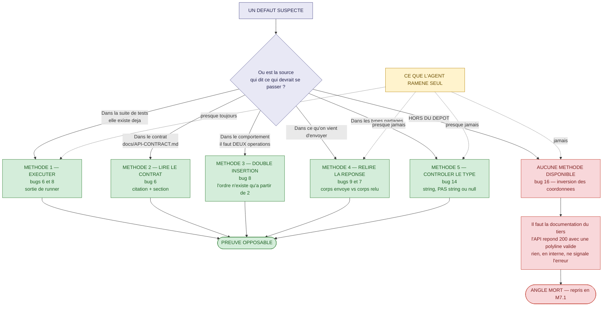
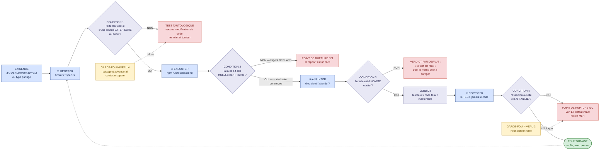
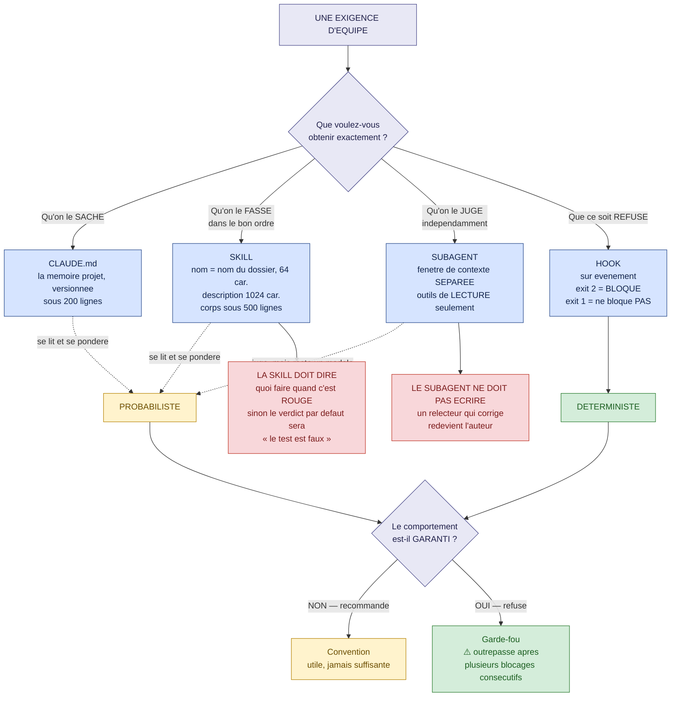
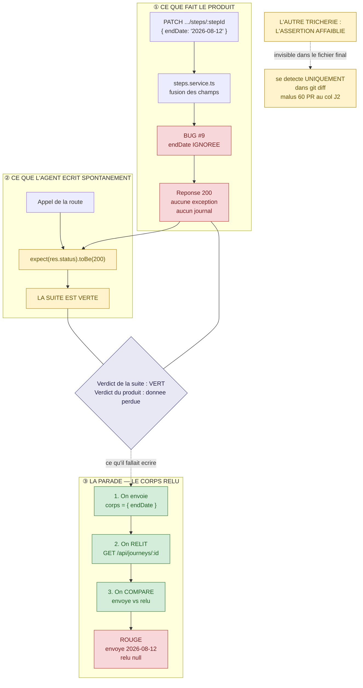

# Module M5 — « L'agent qui travaille seul »

> **Jour 3 · matin · 160 min de notions + 20 min de QCM long · 4 notions**
> *Promesse au participant : « À la fin de ce module, vous saurez construire un agent qui génère,
> exécute et corrige — et l'empêcher de tricher. »*

**Document formateur.** Il se déroule tel quel en séance. Les encadrés 🔐 ne sont jamais projetés.
Référence de vérité du terrain : `00-carte-du-terrain.md`. Contrat d'écriture : `00-gabarit-notion.md`.

> ⚠️ **À jour au 07/2026.** Les noms de fichiers, d'événements de hook et de commandes cités ici
> viennent de la documentation Claude Code hébergée sur **`code.claude.com/docs/en/`** — les liens
> historiques redirigent vers des pages **réécrites**. Deux rappels que la salle a déjà entendus au
> J2 et qu'il faut redire une fois : **`.claudeignore` n'existe pas** (le mécanisme est
> `permissions.deny` dans `.claude/settings.json`), et **`temperature = 0` n'est pas le
> déterminisme** — c'est une réduction de variabilité, et sur les modèles récents ce paramètre est
> déprécié et renvoie une erreur 400.

---

## 0. Carte du module

### 0.1 Objectif terminal

> À l'issue de M5, le·a participant·e est capable d'**assembler un agent qui exécute réellement les
> tests qu'il produit**, d'**énoncer la condition de vérité de chaque étape de sa boucle**, et de
> **détecter une assertion affaiblie pour verdir un test** — la sienne comme celle d'un agent.

C'est le seul objectif terminal du module. Tout le reste y concourt.

### 0.2 Position dans le fil rouge — *L'Expédition*, ⛰️ l'ascension

| | |
|---|---|
| **Ce qui existe avant M5** | Le col J2 a été franchi hier soir. Chaque cordée possède un **éclaireur** : un `CLAUDE.md`, une skill, un subagent, au moins un hook, et un rapport déposé dans `carnet/`. Les six bugs du dépôt ont été **nommés** au débrief du col J1 — la salle sait qu'ils existent et où ils sont. Ce qu'elle ne sait pas encore, c'est **comment on les prouve, un par un**, et **lesquels un agent trouve seul**. |
| **Ce qui existe après M5** | Le groupe a **prouvé cinq défauts sur six** par cinq méthodes différentes, et a mesuré ce que son agent trouvait sans aide. Il sait énoncer la **condition de vérité** des quatre étapes de la boucle. Chaque participant a assemblé, seul, un agent minimal — skill, subagent, hook — et l'a expliqué à quelqu'un d'autre. Et le groupe a vu, en direct, un agent produire une assertion verte sur un bug ouvert. Le col J3 peut alors demander de remettre la voie au vert : les gestes sont là. |
| **Ce que M5 ne fait pas** | On ne met rien en CI : c'est **M6.3**. On ne classe pas encore les échecs en cinq catégories : c'est **M6.1**. On ne mesure pas la dérive du modèle dans la durée : c'est **M8.2**. Et on ne prouve pas le bug #16 — **volontairement**. |

> 🎯 **Ce que la salle sait déjà, et ce qu'elle ne sait pas — à lire avant d'animer M5.1.**
> Le débrief du col J1 a révélé les six bugs et la commande qui les localise. **La chasse de M5.1
> n'est donc pas une chasse au trésor : c'est une chasse à la preuve.** Ce qui est chronométré,
> ce n'est pas « trouver que le bug existe » — c'est « produire, en quinze minutes, l'artefact qui
> le prouve à quelqu'un qui ne vous croit pas sur parole ». La nuance est capitale, elle change
> tout le déroulé, et elle se dit à la salle mot pour mot à l'ouverture.

### 0.3 Les quatre notions

| # | Notion | Modalité (critère) | Durée | Terrain | Micro-évaluation |
|---|---|---|---|---|---|
| **M5.1** | La chasse : cinq défauts cachés en quinze minutes | **JEU — La Chasse** (`D-3`) | 40 | **Z2 · Z3 · Z5** 🔴 les 6 bugs — `grep BUG:` **interdit** | Exercice court (3 min) |
| **M5.2** | La boucle : générer → exécuter → analyser → corriger | **DESC** + diagramme (`A-2`) | 40 | **Z3 · Z4** ⚪ feature #10 — *Upload de photos* | QCM éclair (3 q.) |
| **M5.3** | Construire l'agent : skill, subagent, hook | **SOLO** (`C-2`) | 45 | **Z1 · Z3 · Z4** ⚪ features #3 et #10 | Exercice court (6 min) |
| **M5.4** | L'agent qui triche : garde-fous et vérification | **JEU — Le Piège** (`D-4`) | 35 | **Z3** 🔴 feature #9 — le bug silencieux (`endDate` ignoré) | Exercice court (4 min) |

**Rythme** — JEU · DESC · SOLO · JEU : aucun doublon consécutif (`R-1` ✓) · première séquence de
la journée **non descendante** (`R-6` ✓) · deux jeux sérieux dans la demi-journée (`R-3` ✓) ·
aucune ligne descendante de plus de 12 min sans interaction (`R-5` ✓) · clôture sur une victoire
mesurable (`R-8` ✓).

### 0.4 Minutage de la demi-journée

| Créneau | Séquence | Durée | Cumul |
|---|---|---|---|
| 09:00 → 09:15 | **Le Brief** — scoreboard du J2, l'étape du jour, la commande interdite | 15 | 15 |
| 09:15 → 09:55 | **M5.1** — La chasse : cinq défauts en quinze minutes | 40 | 55 |
| 09:55 → 10:35 | **M5.2** — La boucle : générer → exécuter → analyser → corriger | 40 | 95 |
| 10:35 → 10:50 | **Pause** | 15 | 110 |
| 10:50 → 11:35 | **M5.3** — Construire l'agent : skill, subagent, hook | 45 | 155 |
| 11:35 → 12:10 | **M5.4** — L'agent qui triche : garde-fous et vérification | 35 | 190 |
| 12:10 → 12:30 | **QCM long M5** — 14 questions, correction commentée | 20 | 210 |

**Contrôle** : 15 + 40 + 40 + 15 + 45 + 35 + 20 = **210 min** ✓ (matin conforme à
`00-architecture-28h.md` §2).

**Contrôle des notions** : 40 + 40 + 45 + 35 = **160 min** ✓

### 0.5 Points de Repère mobilisables sur le module

| Source | Gain |
|---|---|
| Jeu M5.1 — barème par défaut **prouvé** (voir §1, jusqu'à 5 défauts) | 15 PR à la cordée en tête |
| Micro-évaluation M5.1 réussie | 10 PR |
| Micro-évaluation M5.2 (QCM éclair 3/3) | 10 PR |
| Micro-évaluation M5.3 réussie | 10 PR |
| Jeu M5.4 — cordée ayant annoncé le bon verdict **avec preuve** | 15 PR |
| Micro-évaluation M5.4 réussie | 10 PR |
| **QCM long M5** — au prorata | 0 à 50 PR |
| **Total maximal du module** | **120 PR** |

### 0.6 Préparation matérielle — la veille

| Vérification | Commande / geste | Attendu |
|---|---|---|
| Le dépôt est à l'état de départ | `git status` | propre — les agents du col J2 sont **conservés**, les modifications de tests **restaurées** |
| La suite back sort bien en rouge | `npm run test:backend` | 2 suites passent, 2 suites échouent |
| Le back démarre | démarrage du backend NestJS | `http://localhost:3000/api` répond |
| Un compte utilisateur existe | `POST /api/auth/register` | jeton récupérable via `POST /api/auth/login` |
| Un voyage avec **deux** étapes existe | appels `POST /api/journeys` puis deux `POST .../steps` | indispensable au bug #8 et à la démonstration de M5.4 |
| Le répertoire `/uploads/` est vide | inspection | la démonstration de M5.2 repose sur l'apparition d'un fichier |
| Le répertoire `data/mails/` est vide | inspection | idem pour M5.3 |
| Une image de test est disponible | un fichier de quelques kilo-octets | pour le multipart de la feature #10 |
| La documentation d'OSRM est **fermée** | — | ⭐ **elle ne s'ouvre pas ce matin.** C'est le J4, notion M7.1 |
| Les cinq fiches de chasse sont imprimées | 1 jeu par cordée | découpées |
| La sortie préenregistrée de la boucle de M5.2 | conservée dans `annexes/` | repli si le réseau tombe |

🔐 **Réservé formateur** : `grep -rn "BUG:" backend/src` est **connu de la salle depuis hier
soir**. Son interdiction en M5.1 n'est donc pas un secret : c'est une **règle du jeu annoncée**, et
elle s'explique en une phrase : *« la commande vous donne six numéros de ligne. Un numéro de ligne
ne convainc personne. »*

---

## 1. Notion M5.1 — « La chasse : cinq défauts cachés en quinze minutes »

|  |  |
|---|---|
| **Durée** | 40 min |
| **Modalité** | Jeu sérieux — **La Chasse** |
| **Objectif d'apprentissage** | À l'issue, le·a participant·e est capable de **produire la preuve d'un défaut par la méthode qu'il exige** — et d'**énoncer ce qu'un agent trouve seul et ce qu'il ne trouve pas** |
| **Niveau visé (Bloom)** | **Analyser** |
| **Micro-évaluation** | Exercice court (3 min) |
| **Ancrage fil rouge** | **Z2 · Z3 · Z5** 🔴 — les six bugs du dépôt, `grep -rn "BUG:" backend/src` **interdit**. *Pourquoi cet ancrage : les six défauts ne se prouvent pas de la même façon, et c'est le seul endroit du dispositif où l'on peut le faire constater d'un coup. Deux se prouvent par un test déjà présent, un par une lecture de contrat, un par une double insertion, un par la relecture d'une réponse, un par un contrôle de type — et le dernier ne se prouve pas du tout avec ce qu'on a dans le dépôt.* Ce que la notion fait avancer : la colonne « preuve » du post-mortem du col J3, et la mesure honnête de ce qu'un agent apporte. |
| **Prérequis** | Le col J1 (les six bugs sont nommés) et le col J2 (chaque cordée a un agent) |

### ▸ Pourquoi cette modalité

L'objectif est de **découvrir par soi-même une limite technique** — celle d'un agent laissé seul
sur un dépôt —, donc critère `D-3` de `00-grille-modalites.md` : *« une limite annoncée est une
croyance. Une limite rencontrée est un savoir. »* Dire à la salle « l'agent ne trouve pas le bug
d'inversion de coordonnées » produit un hochement de tête. **Le faire tourner quinze minutes et
constater ce qu'il ramène** produit une conviction. La Chasse ajoute la contrainte de temps, qui
oblige à choisir une méthode au lieu de tout essayer — et c'est le choix de méthode qui est
l'objet réel de la notion. Première séquence de la journée : non descendante (`R-6` ✓).

### ▸ Ce qu'il faut avoir compris à la fin

- **Un défaut connu n'est pas un défaut prouvé.** Ce qui s'oppose en réunion, ce n'est pas
  « il y a un bug ligne 47 » : c'est un artefact rouge, une sortie, un écart constaté.
- **Chaque défaut exige sa méthode**, et il n'y en a pas deux pareilles dans ce dépôt : lire le
  contrat, insérer **deux** fois, relire la réponse, contrôler un type, consulter une
  documentation externe.
- **Un agent trouve très bien ce qui est déjà instrumenté** — un test rouge existant — et très mal
  ce qui exige un savoir extérieur au dépôt.
- **La méthode la plus rentable est aussi la plus banale** : envoyer une valeur, relire la réponse,
  comparer les deux. Elle attrape à elle seule deux des six défauts.
- **Le sixième défaut ne se prouve pas ce matin, et c'est un résultat.** Une chasse qui ramène cinq
  prises sur six et **sait dire pourquoi la sixième manque** vaut mieux qu'une chasse qui prétend
  six.

### ▸ Déroulé minuté

| Temps | Le formateur | Les participants |
|---|---|---|
| **0-4** *(4)* | **RÈGLE DU JEU.** Aucune introduction. « Six défauts. Vous les connaissez tous depuis hier soir — je ne vous demande pas de les trouver, je vous demande de **les prouver**. Quinze minutes. Une prise ne compte que si vous pouvez me la **montrer**. Et une commande est interdite : celle que je vous ai donnée hier. Elle vous donne six numéros de ligne, et un numéro de ligne ne convainc personne. » Distribue les cinq fiches de chasse et le barème. **Puis ajoute la seconde règle** : « en même temps que vous, votre agent chasse. Lancez-le maintenant, en tâche de fond, avec la consigne de votre choix. On comparera. » | Écoutent, prennent les fiches, lancent leur agent en arrière-plan (geste 9 de M4.1), se répartissent les zones. |
| **4-19** *(15)* | **LA CHASSE.** Chronomètre affiché en grand. Circule, ne valide aucune prise, ne corrige rien. **Deux relances programmées** : à 6 min — 📢 *« combien de vos prises tiennent dans une sortie de commande ? »* ; à 11 min — 📢 *« il vous reste quatre minutes. Une prise prouvée vaut mieux que trois prises annoncées. »* | Chassent. Exécutent, appellent l'API, lisent le contrat, relisent des réponses. Remplissent la fiche de chasse : le défaut, la méthode employée, **la preuve collée**. |
| **19-23** *(4)* | **LE DÉPÔT DES PRISES.** Fait annoncer chaque cordée à voix haute : combien de prises, lesquelles. Écrit au tableau une matrice **cordées × six défauts**. **Ne commente rien, ne valide rien encore.** Puis, seulement ensuite : « et votre agent ? » Ajoute une ligne « agent » à la matrice. | Annoncent. Découvrent la matrice qui se remplit. Constatent que les colonnes ne se remplissent pas de la même façon. |
| **23-31** *(8)* | **LE DÉBRIEF DU JEU — défaut par défaut.** Traite les cinq défauts prouvables dans l'ordre du tableau §Les six défauts. Pour chacun, une seule question à la cordée qui l'a eu : *« comment ? »* Puis nomme la méthode et l'écrit au tableau. **C'est ici que la notion s'apprend.** Attribue les 15 PR à la cordée en tête. | Expliquent leur méthode. Entendent quatre autres méthodes. Recopient les cinq méthodes dans le carnet de cordée. |
| **31-34** *(3)* | **LE SIXIÈME.** Pointe la colonne vide : le défaut **#16**. « Personne. Ni vous, ni vos agents. Ce n'est pas un échec, c'est le résultat le plus intéressant de la matinée. Pourquoi ? » Laisse répondre, ne donne pas la réponse complète, annonce : *« on le reprend jeudi matin, notion M7.1. »* | Cherchent. Quelqu'un dit « il faudrait savoir ce qu'attend le service externe ». C'est exactement la réponse attendue — ne pas aller plus loin. |
| **34-37** *(3)* | **MICRO-ÉVALUATION.** Distribue l'exercice court, chronomètre 2 min, corrige en 1 min. | Font l'exercice, seuls. Correction croisée avec le voisin. |
| **37-40** *(3)* | **SYNTHÈSE — la parole est aux participants.** « En une phrase : qu'est-ce que votre agent a trouvé que vous n'auriez pas trouvé, et qu'est-ce que vous avez trouvé qu'il n'a pas trouvé ? » Fait parler deux cordées, n'ajoute rien, enchaîne. | Formulent. Réponse attendue : *« il ramasse tout ce qui est déjà instrumenté, et il ne voit rien de ce qui exige une source extérieure. »* |

**Contrôle : 4 + 15 + 4 + 8 + 3 + 3 + 3 = 40 min ✓**

### ▸ 🎯 Le protocole de chasse — fiche distribuée, une par cordée

> **Consigne, en trois lignes.** Quinze minutes. Une prise = **un défaut + la méthode employée +
> la preuve, collée**. Une prise sans preuve vaut zéro, quelle que soit sa justesse. La commande
> `grep -rn "BUG:" backend/src` est **interdite** : si vous la tapez, vos prises de la manche sont
> annulées.

| Champ de la fiche | Ce qu'on y écrit | Contrôle du formateur |
|---|---|---|
| **Le défaut** | En une phrase, du point de vue de l'utilisateur — pas du code | *« un chef de projet comprendrait-il cette phrase ? »* |
| **La méthode** | Laquelle des cinq : contrat lu · test existant exécuté · double insertion · relecture de réponse · contrôle de type | *« pourquoi celle-là et pas une autre ? »* |
| **La preuve** | Une sortie de commande, un écart entre deux corps JSON, ou une citation du contrat avec sa section | *« montrez-la-moi »* — 30 secondes maximum |
| **Le coût** | Combien de minutes la prise a demandé | Sert au classement en cas d'égalité |

**Les trois formes de preuve recevables** — identiques à celles du col J1, et c'est voulu :

| Forme | Exemple sur ce dépôt |
|---|---|
| **Une sortie de runner** | `FAIL backend/src/steps/steps.add-order.spec.ts` avec son message d'échec |
| **Un écart constaté entre deux appels** | Le corps envoyé au `PATCH` et le corps relu par le `GET`, côte à côte |
| **Une ligne du contrat** citée avec sa section | §Steps : *« ajouté **à la fin** de `steps[]` »* |

### ▸ 🏹 Le barème de la chasse

| Situation | Points de chasse |
|---|---|
| Défaut prouvé par une **sortie de runner** ou un **écart d'appels** | **3 points** |
| Défaut prouvé par une **citation de contrat seule**, sans exécution | **1 point** |
| Défaut annoncé sans preuve | **0 point** |
| Défaut annoncé **faux** (une fonctionnalité saine présentée comme buguée) | **−1 point** |
| ⭐ Défaut prouvé par une méthode **que la cordée nomme correctement** | **+1 point** par prise |
| Bonus de lucidité — la cordée écrit *« #16 : non prouvable avec les sources dont nous disposons »* | **+2 points** |

**Maximum atteignable : 5 défauts × 4 points + 2 de lucidité = 22 points de chasse.**
La cordée en tête reçoit les **15 PR** du jeu sérieux. En cas d'égalité, la cordée dont le coût
cumulé est le plus faible l'emporte.

> ⚠️ **Le malus de −1 point existe pour une raison précise.** Sans lui, la stratégie gagnante
> serait d'annoncer les six défauts et de trier ensuite. Avec lui, il faut **choisir**. C'est
> exactement la contrainte d'un rapport professionnel : on n'écrit pas ce dont on n'est pas sûr.

### ▸ Contenu à transmettre

> **Attention.** Ce contenu **ne se projette pas avant la minute 23**. Il est le débrief du jeu,
> pas son introduction.

**1. Les cinq méthodes, et une seule impossibilité.** C'est le contenu de la notion, en un tableau.

| # | Défaut | La méthode qui le prouve | Pourquoi aucune autre ne marche |
|---|---|---|---|
| **#6** | Validation de dates absente (`endDate < startDate` accepté) | **Lire le contrat**, puis exécuter le test rouge qui existe déjà | Le code ne dit rien : il accepte. Seul le contrat dit *« 400 si `endDate < startDate` »*. **L'oracle est extérieur** |
| **#7** | Le `PATCH` d'un voyage perd les `steps` | **Jouer le scénario réel** : créer, ajouter une étape, modifier le titre, relire | Le test unitaire existant est **vert** : il ment. La preuve ne peut pas venir de la suite |
| **#8** | Les étapes s'ajoutent en tête au lieu de la fin | ⭐ **Deux insertions.** Avec une seule étape, l'ordre est indiscernable | C'est le seul défaut du dépôt qui exige un **jeu de données minimal de taille 2**. Un cas que l'IA n'écrit pas spontanément |
| **#9** | `endDate` d'une étape silencieusement ignorée | ⭐ **Relire la réponse** et la comparer au corps envoyé | L'API répond **200**. Aucune exception, aucun code d'erreur. Un test de statut passe. Il n'y a **rien d'autre** à observer que l'écart entre l'envoyé et le relu |
| **#14** | `authorId` d'un commentaire d'étape toujours `null` | ⭐ **Contrôler le type**, pas la présence. Le type partagé déclare `authorId: string`, **sans `\| null`** | `toBeDefined()` est **vrai sur `null`**. Seule une assertion de type ou de non-nullité tombe |
| **#16** | Coordonnées envoyées inversées au service d'itinéraire | ❌ **Aucune méthode disponible ce matin** | L'API répond **200 avec une polyline valide**. Rien dans le dépôt ne dit quel ordre le service tiers attend. **Le savoir manquant est externe** — c'est la notion M7.1 |

**2. Ce qu'un agent trouve seul — le résultat mesuré en salle.** À écrire au tableau à côté de la
matrice des cordées.

| Ce que l'agent ramène presque toujours | Ce qu'il ne ramène presque jamais |
|---|---|
| Les défauts **#6** et **#8** — un test rouge existe, il l'exécute et le lit | Le défaut **#9** : il écrit `expect(res.status).toBe(200)`, obtient vert, conclut que tout va bien |
| Le défaut **#7**, **si** on lui a dit de jouer un scénario complet | Le défaut **#14** : il écrit `expect(comment).toBeDefined()` — vrai, et inutile |
| Une liste de « points d'attention » plausibles, souvent sans valeur | Le défaut **#16** : soumis au fichier seul, il **valide** le code |

**3. La règle générale qui se dégage — et c'est la vraie leçon.**

> ***Un agent est excellent pour exploiter une instrumentation qui existe, et aveugle à ce qui
> exige une source extérieure au dépôt.*** Ce n'est pas une question de taille de modèle : c'est
> une question de **périmètre d'information**.

**4. Le renfort de l'état de l'art, en deux phrases.** Le constat n'est pas propre à ce dépôt : les
générateurs de tests par LLM confrontés à du code bogué **produisent des tests qui valident le bug
au lieu de le détecter**. Et sur les agents longs, la documentation d'ingénierie note explicitement
que l'agent *« marque des fonctionnalités comme terminées prématurément »*, la parade recommandée
étant de **ne marquer « passant » qu'après une vérification effective**.

**5. La phrase à faire noter.**

> *Un défaut connu n'est pas un défaut prouvé. Ce qui s'oppose, ce n'est jamais une ligne de code :
> c'est un artefact rouge, une sortie collée, ou un écart entre ce qu'on a envoyé et ce qu'on relit.*

*(≈ 560 mots)*

### ▸ 🖼️ Diagramme — `diagrammes/M5-1-cinq-methodes-un-angle-mort.svg`

#### Source Mermaid



#### Descriptif du SVG à produire

Format paysage 1600 × 1000, imprimable en A3 et **affiché au mur jusqu'au J4** — il sera repris
tel quel en M7.1. En haut à gauche, un rectangle *« Un défaut suspecté »*. Au centre, un **losange
très large**, occupant un tiers de la largeur, portant la question *« Où est la source qui dit ce
qui devrait se passer ? »*. De ce losange partent **six branches en éventail** vers la droite :
cinq mènent à des rectangles verts numérotés **Méthode 1** à **Méthode 5**, chacun portant sur trois
lignes son nom, les **numéros de bugs** concernés, et la forme de preuve produite ; la sixième
branche, tracée en **rouge et en pointillé**, mène à un rectangle rouge *« Aucune méthode
disponible »* et au bug **#16**. Les cinq branches vertes convergent vers une pastille pleine
**« Preuve opposable »** ; la branche rouge mène à un encadré explicatif puis à une pastille rouge
**« Angle mort — repris en M7.1 »**. En bas à gauche, détaché, un encart jaune **« Ce que l'agent
ramène seul »** relié aux méthodes par **quatre flèches pointillées d'épaisseur décroissante**,
légendées respectivement *« presque toujours »*, *« presque jamais »*, *« presque jamais »*,
*« jamais »*. L'épaisseur des flèches est le message : il n'y a pas de croix, il y a un **gradient**.

#### Explication du diagramme — notice de dévoilement

| Ordre | Ce qu'on affiche | La phrase à dire | Ce qu'on attend en retour |
|---|---|---|---|
| 1 | **Le losange central seul** | « Vous venez de passer quinze minutes sur six défauts. Une seule question a décidé de votre méthode à chaque fois. La voici. » | Silence. Laisser cinq secondes de lecture. |
| 2 | **Les cinq branches vertes, une par une, dans l'ordre des prises annoncées** | « Cinq sources, cinq méthodes. Regardez : aucune n'est le code de production. » | Quelqu'un fait le lien avec M1.4 — c'est exactement le lien recherché. |
| 3 | **La branche rouge** | « Et la sixième. Pas une méthode plus difficile : **pas de méthode du tout**, avec ce qu'on a sur nos machines. » | Quelqu'un dit « il faudrait la doc du service externe ». Ne pas confirmer complètement : annoncer M7.1 et passer. |
| 4 | **L'encart jaune et ses quatre flèches** | « Et voilà votre agent. Regardez l'épaisseur des flèches. Il n'est pas mauvais : il est **borné au dépôt**. Ce qui est dans le dépôt, il l'exploite mieux que vous. Ce qui n'y est pas, il ne l'invente pas — il le comble. » | Fin du dévoilement. C'est la phrase à faire noter. |

⚠️ **Erreur d'interprétation à prévenir.** La salle conclura que « l'agent est nul pour trouver des
bugs ». C'est faux, et cela abîme le reste de la journée. Le corriger explicitement à l'étape 4 :
*« il a ramassé les défauts #6 et #8 en trois minutes, ce qui vous en a pris huit. Sur ce qui est
instrumenté, il est plus rapide et plus complet que nous. Ce qu'il ne sait pas faire, c'est
**aller chercher une source qui n'est pas là**. C'est une limite de périmètre, pas de
compétence. »*

### ▸ 🔍 Démonstration — la même question, deux réponses (bug #9)

**Point de départ.** Le débrief du jeu est en cours, on traite le défaut **#9**. Une cordée l'a
prouvé, les autres non. C'est le moment de la démonstration : elle dure deux minutes et elle est
la charnière de toute la matinée — elle prépare M5.4 mot pour mot.

**Le geste exact.** Projeter les deux manières d'interroger la même route.

*Version A — ce que l'agent a produit (et ce que la moitié de la salle a écrit).*

```bash
curl -s -o /dev/null -w '%{http_code}\n' \
  -X PATCH http://localhost:3000/api/journeys/$JID/steps/$SID \
  -H "Authorization: Bearer $TOKEN" -H 'Content-Type: application/json' \
  -d '{"endDate":"2026-08-12"}'
# → 200
```

*Version B — la relecture.*

```bash
# 1. On envoie
curl -s -X PATCH http://localhost:3000/api/journeys/$JID/steps/$SID \
  -H "Authorization: Bearer $TOKEN" -H 'Content-Type: application/json' \
  -d '{"endDate":"2026-08-12"}' > /dev/null

# 2. On relit, et on compare à ce qu'on a envoyé
curl -s http://localhost:3000/api/journeys/$JID \
  -H "Authorization: Bearer $TOKEN" \
  | jq --arg sid "$SID" '.steps[] | select(.id == $sid) | {envoye: "2026-08-12", relu: .endDate}'
```

**Le résultat obtenu.**

```json
{ "envoye": "2026-08-12", "relu": null }
```

**Ce que l'exemple révèle.** Les deux versions interrogent **exactement la même route, avec
exactement le même corps**. La première renvoie `200` et rassure. La seconde produit une preuve
opposable en deux lignes. **La différence n'est pas dans l'outil, ni dans le modèle, ni dans le
prompt : elle est dans le fait de relire.** À dire tel quel, et c'est la phrase que la salle
retiendra de la matinée : *« un statut HTTP vous dit que le serveur a compris votre demande. Il ne
vous dit jamais qu'il l'a exécutée. »*

**Ce qui peut rater, et le repli associé.**

| Risque | Signe | Repli |
|---|---|---|
| Backend non démarré | `curl` sans réponse | Repli sur la capture des deux sorties, préparée la veille |
| `jq` absent du poste | commande introuvable | Retirer le `\| jq`, lire le JSON brut et **surligner** `"endDate": null` à l'écran |
| L'étape n'existe pas | 404 | Recréer voyage et étapes — c'est une vérification de la veille (§0.6) |
| Un participant a corrigé le service | `relu` vaut la bonne date | Ne **jamais** démontrer sur un poste participant ; réinitialiser le dépôt de démonstration la veille |
| La salle veut enchaîner sur la correction | le débat s'ouvre | Une phrase : *« on ne répare rien ce matin. Cet après-midi, col J3. »* |

### ▸ ✅ Micro-évaluation — Exercice court (3 min)

**Énoncé** *(trois lignes, une feuille par personne)*

> Trois défauts, trois méthodes. Reliez chaque défaut à **la** méthode qui le prouve, et
> écrivez **une seule ligne** commençant par « parce que ». Correction croisée avec votre voisin.

| Défaut | | Méthode |
|---|---|---|
| **A** — Les étapes d'un voyage s'affichent dans l'ordre inverse de leur ajout | | **1** — Relire la réponse et la comparer au corps envoyé |
| **B** — Le commentaire d'une étape n'a pas d'auteur identifiable | | **2** — Insérer **deux** éléments et observer l'ordre |
| **C** — La date de fin d'une étape n'est pas enregistrée | | **3** — Confronter la réponse au **type partagé** |

**Résultat attendu vérifiable** *(cases à cocher, contrôle en moins de 60 secondes)*

- [ ] **A → 2** — « parce qu'avec une seule étape, l'ordre est indiscernable : il faut deux
      insertions pour qu'un ordre existe. »
- [ ] **B → 3** — « parce que le contrat de type déclare `authorId: string` sans `| null` : c'est
      le **type** qui est l'oracle, pas la présence du champ. »
- [ ] **C → 1** — « parce que l'API répond 200 : le seul écart observable est celui entre le corps
      envoyé et le corps relu. »

**Solution de référence** — A : 2 · B : 3 · C : 1.

**L'erreur que 80 % des groupes commettent.** Relier **B** à la méthode 1 (« relire la réponse »).
Ce n'est pas absurde — il faut bien relire la réponse pour voir le `null` — mais c'est
**insuffisant**, et le distinguo vaut trente secondes de débrief : relire la réponse vous montre
`authorId: null` ; **rien ne vous dit que c'est un défaut** tant que vous n'avez pas lu le type qui
interdit le `null`. La méthode, ce n'est pas le geste d'observation : **c'est la source qui rend
l'observation accusatrice.** C'est M1.4, appliqué.

### ▸ 🔗 Ressources

| Ressource | À qui elle s'adresse | Ce qu'il faut y lire précisément |
|---|---|---|
| *Design choices made by LLM-based test generators prevent them from finding bugs* — https://arxiv.org/abs/2412.14137 | **La référence de la notion** | Le résultat central : confrontés à du code bogué, les générateurs de tests par LLM produisent des tests qui **valident le bug au lieu de le détecter**. C'est exactement ce que la matrice du tableau vient de montrer en salle. |
| *Effective harnesses for long-running agents* — https://www.anthropic.com/engineering/effective-harnesses-for-long-running-agents | Celui qui laisse tourner un agent | La table de remèdes, et la ligne qui compte : *« Claude marque des fonctionnalités comme terminées prématurément → tenir un fichier de suivi, tout auto-vérifier, ne marquer “passant” qu'après un test soigneux »*. |
| *Test smells in LLM-Generated Unit Tests* — https://arxiv.org/abs/2410.10628 | Celui qui relit du test généré | Les défauts systématiques observés sur 20 505 suites générées, dont l'**Assertion Roulette** — la sœur jumelle de l'assertion faible qu'on vient de voir sur le bug #14. |
| *An Empirical Evaluation of Using LLMs for Automated Unit Test Generation (TestPilot)* — https://arxiv.org/abs/2302.06527 | Celui qui veut approfondir | Le protocole de re-prompt à partir du **message d'erreur** — l'ancêtre direct de la boucle de M5.2 — et les couvertures médianes obtenues : 70,2 % d'instructions, 52,8 % de branches. |
| *ISTQB Glossary — « test oracle »* — https://glossary.istqb.org/en_US/term/oracle | La référence normative | La définition à ressortir au débrief : *« une source permettant de déterminer les résultats attendus »*, et le fait que **ce ne devrait pas être le code**. Les cinq méthodes du diagramme sont cinq oracles. |

### ▸ ⚠️ Pièges d'animation

- **Ce qui rate habituellement** : la chasse se transforme en course à l'annonce. Les cordées
  crient des numéros de bugs sans rien prouver. Contre-mesure annoncée **avant** le départ, et
  répétée à 6 minutes : *« une prise ne compte que si vous pouvez me la montrer en trente
  secondes. »* Le malus de −1 sur une fausse prise fait le reste.
- **La question qui revient toujours** : *« mais on les connaît déjà, où est le jeu ? »* Réponse
  courte, à donner sans détour dès l'ouverture : *« vous connaissez leur existence. Vous ne savez
  pas les prouver. En réunion, personne ne vous demandera si vous savez qu'il y a un bug — on vous
  demandera de le montrer. »*
- **La cordée qui a tiré #9 au col J2** possède déjà la preuve du bug le plus difficile. Ne pas la
  neutraliser : lui donner un **rôle**. *« vous avez déjà celui-là. Prenez #14, et allez expliquer
  votre méthode à une autre cordée quand vous aurez fini. »* C'est **+10 PR** et le badge 🎓 **Le
  Guide**.
- **Le risque de démoralisation sur #16** : une salle qui termine sur « il y en a un qu'on ne peut
  pas trouver » sort abattue. Le contre-feu se dit à la minute 33, mot pour mot : *« ce n'est pas
  vous qui avez échoué : c'est le dépôt qui ne contient pas la réponse. Savoir dire “cette
  information n'est pas ici” est une compétence, et elle rapporte deux points au barème. »*
- **Le signe qu'il faut passer à la suite** : dès qu'une cordée nomme spontanément sa méthode
  (« on a relu la réponse ») au lieu de nommer son résultat (« on a trouvé le bug »), la notion est
  acquise. Clore le jeu même s'il reste une prise à commenter.

---

## 2. Notion M5.2 — « La boucle : générer → exécuter → analyser → corriger »

|  |  |
|---|---|
| **Durée** | 40 min |
| **Modalité** | Descendant + diagramme + démonstration |
| **Objectif d'apprentissage** | À l'issue, le·a participant·e est capable d'**énoncer la condition de vérité de chacune des quatre étapes de la boucle** et de **désigner l'étape où la boucle d'un agent réel se rompt** |
| **Niveau visé (Bloom)** | **Comprendre** |
| **Micro-évaluation** | QCM éclair (3 questions) |
| **Ancrage fil rouge** | **Z3 · Z4** · ⚪ feature #10 *Upload de photos sur une étape* (`POST /api/journeys/:journeyId/steps/:stepId/photos`, `multipart/form-data`, chemin relatif `/uploads/...`). *Pourquoi cette fonctionnalité : elle n'a aucun bug, et c'est exactement ce qu'il faut. Une boucle qui tourne sur un terrain bugué mélange deux enseignements — le fonctionnement de la boucle et la détection du défaut. Ici, tout échec de la boucle est imputable à **la boucle**. En prime, le multipart fait rater la première génération à tous les coups, et l'effet de bord disque rend l'étape « exécuter » visible à l'œil : un fichier apparaît dans `/uploads/`, ou il n'apparaît pas.* Ce que la notion fait avancer : la skill de M5.3 et le classement des échecs du col J3. |
| **Prérequis** | M5.1 (les cinq méthodes de preuve) et le col J2 (chaque cordée a une boucle qui tourne) |

### ▸ Pourquoi cette modalité

L'objectif est de **comprendre un mécanisme invisible** : ce qui circule entre les quatre étapes
d'une boucle d'agent, et **à quelle condition** chaque étape dit la vérité. Critère `A-2` de
`00-grille-modalites.md` — *« un mécanisme se voit ; le diagramme dévoilé progressivement fait plus
que 500 mots »*. Faire découvrir seuls les quatre temps d'une boucle coûterait quarante minutes
pour un contenu qui s'énonce en cinq — et les participants ont déjà **fait** la boucle hier, au col
J2 : ce qui leur manque, ce n'est pas l'expérience, c'est le **nom des choses** et le point de
rupture. La notion suit un jeu (`R-1` respecté), s'ouvre par un pari et n'excède jamais 6 minutes
de descendant continu (`R-5`).

### ▸ Ce qu'il faut avoir compris à la fin

- **La boucle canonique d'un agent tient en quatre temps** : *rassembler le contexte → agir →
  vérifier le travail → recommencer*. La valeur du testeur est concentrée sur le troisième.
- **Chaque étape a une condition de vérité**, et elle est différente à chaque fois : une source
  pour générer, une **exécution réelle** pour exécuter, un **oracle** pour analyser, une
  **non-régression de l'assertion** pour corriger.
- **La boucle se rompt presque toujours au même endroit** : entre *exécuter* et *analyser*, quand
  l'agent **déclare** un résultat au lieu de le **lire**.
- **Une boucle sans oracle externe s'auto-évalue** — et un système qui s'auto-évalue se trompe de
  façon **corrélée** : il refait la même erreur à chaque tour, avec de plus en plus d'assurance.
- **Corriger n'est pas rendre vert.** Une correction qui affaiblit l'assertion n'a pas corrigé : elle
  a supprimé la mesure.

### ▸ Déroulé minuté

| Temps | Le formateur | Les participants |
|---|---|---|
| **0-4** *(4)* | **OUVERTURE PAR LE PARI.** Projette une sortie d'agent, sans contexte : *« J'ai écrit 3 tests pour l'upload de photos. Tous passent. La fonctionnalité est couverte. »* Puis : « à main levée. Qui pense que ces trois tests ont réellement été exécutés ? Qui pense qu'ils passent ? Qui pense que la fonctionnalité est couverte ? » Compte les trois votes séparément, écrit les trois totaux au tableau. **Ne tranche pas.** | Votent trois fois. Constatent que leurs trois réponses ne sont pas identiques — et que c'est le sujet. |
| **4-9** *(5)* | **LA BOUCLE CANONIQUE.** Écrit les quatre temps au tableau, en les nommant : rassembler le contexte, agir, **vérifier**, recommencer. Cite la formulation d'origine. Puis une seule question : « lequel des quatre est votre métier ? » | Répondent : le troisième. Se le font confirmer. Notent les quatre temps. |
| **9-15** *(6)* | **LE DIAGRAMME.** Dévoile en cinq temps (voir notice). S'arrête sur la rupture entre *exécuter* et *analyser*. | Notent. Une question tombe presque toujours : *« comment on empêche ça, techniquement ? »* → réponse à 29-33, et surtout en M5.3. |
| **15-24** *(9)* | **DÉMONSTRATION — la boucle réelle sur la feature #10.** Lance la boucle en direct, sans filet. La première génération échoue (multipart). Laisse l'agent lire l'erreur et retenter. Commente **uniquement** ce qui circule entre les tours. Termine en montrant `/uploads/`. | Regardent quatre tours de boucle. Constatent que ce qui fait progresser l'agent, c'est **le message d'erreur**, pas la reformulation du prompt. |
| **24-29** *(5)* | **LES QUATRE CONDITIONS DE VÉRITÉ.** Projette le tableau §2 du Contenu. Une phrase par ligne, pas davantage. Puis relance : « sur la démonstration qu'on vient de voir, laquelle des quatre a failli ? » | Répondent. Débattent deux minutes. La bonne réponse est « aucune, cette fois » — et c'est le pont vers M5.4. |
| **29-33** *(4)* | **LA GRADATION DES GARDE-FOUS.** Projette les quatre niveaux (§3 du Contenu) : du prompt au subagent adversarial. Insiste sur un point : le niveau 3 est **déterministe**, les niveaux 1 et 2 ne le sont pas. Annonce M5.3. | Notent les quatre niveaux. Reconnaissent ce qu'ils ont monté hier au col J2 — et repèrent le niveau qui leur manque. |
| **33-36** *(3)* | **MICRO-ÉVALUATION.** Projette les 3 questions du QCM éclair, ramasse à main levée, corrige en direct en commentant chaque distracteur. | Répondent, entendent pourquoi chaque distracteur est faux. |
| **36-40** *(4)* | **SYNTHÈSE — la parole est aux participants.** « Revenons au vote d'ouverture. Reformulez la phrase de l'agent pour qu'elle soit acceptable dans un rapport. » Fait proposer trois formulations, retient la meilleure, l'écrit au tableau. | Formulent. Réponse attendue : *« j'ai écrit 3 tests, je les ai exécutés, voici la sortie du runner, et voici ce qui n'est pas couvert. »* |

**Contrôle : 4 + 5 + 6 + 9 + 5 + 4 + 3 + 4 = 40 min ✓**

### ▸ Contenu à transmettre

**1. La boucle, dans sa formulation d'origine.** Les agents *« fonctionnent selon une boucle de
rétroaction précise : **rassembler le contexte → agir → vérifier le travail → recommencer** »*.
Les quatre temps de la notion en sont la déclinaison pour le test :

| Temps canonique | En test logiciel | Ce qui circule vers l'étape suivante |
|---|---|---|
| Rassembler le contexte | **Générer** à partir d'une exigence | Un ou plusieurs fichiers `*.spec.ts` |
| Agir | **Exécuter** la suite | Une sortie de runner, brute |
| Vérifier le travail | **Analyser** l'échec | Un verdict : le test est faux / le code est faux / indéterminé |
| Recommencer | **Corriger** — le test, jamais le code | Un fichier modifié, et un nouveau tour |

**2. Les quatre conditions de vérité — le cœur de la notion.**

| Étape | Elle dit vrai **si et seulement si** | Le symptôme quand elle ment |
|---|---|---|
| **Générer** | L'attendu vient d'une **source extérieure au code** — le contrat, un type, la documentation d'un tiers | Le test est **tautologique** : aucune modification du code ne le ferait tomber |
| **Exécuter** | La suite a **réellement tourné**, et sa sortie brute est conservée | L'agent **déclare** le résultat. C'est le point de rupture n° 1 |
| **Analyser** | Le verdict s'appuie sur un **oracle nommé**, cité | Le verdict est « le test est faux », toujours — parce que c'est ce qui coûte le moins cher à corriger |
| **Corriger** | L'assertion **n'a pas été affaiblie**. Le test qui passe est le même test | La suite est verte et le défaut est intact. C'est M5.4 |

**3. La gradation des garde-fous — quatre niveaux, deux natures.** La documentation de bonnes
pratiques décrit une gradation en quatre niveaux pour donner à un agent un moyen de vérifier son
travail :

| Niveau | Le garde-fou | Nature | Ce qu'il vaut en QA |
|---|---|---|---|
| **1** | Une consigne dans le prompt ou dans `CLAUDE.md` | **Probabiliste** | Utile, jamais suffisant. C'est une convention, pas une contrainte |
| **2** | Une condition d'objectif réévaluée à chaque tour | **Probabiliste** | Meilleur : la condition est relue en permanence. Reste interprétable |
| **3** | Un **hook déterministe** qui bloque | ⭐ **Déterministe** | **Le seul qui garantisse.** Il ne se négocie pas. ⚠️ Il est cependant outrepassé après un certain nombre de blocages consécutifs — un garde-fou n'est pas une prison |
| **4** | Un **subagent de revue adversarial**, en contexte séparé | Probabiliste, mais **indépendant** | Le complément du 3 : il juge ce qu'un hook ne sait pas juger — la qualité d'une assertion |

**4. Pourquoi l'auto-évaluation ne suffit pas.** Un dispositif où le même modèle génère, critique et
corrige apporte un gain réel — de l'ordre de **vingt points absolus** sur diverses tâches — mais il
**s'évalue lui-même**. Sans oracle externe, ses erreurs sont **corrélées** : il refait la même faute
à chaque tour, avec de plus en plus d'assurance. À l'inverse, une boucle qui **re-prompte à partir
du message d'erreur réel** produit un gain mesuré et vérifiable ; l'ajout d'un raffinement itératif
guidé par l'exécution augmente de **+34,3 %** les tests compilables et de **+18,7 %** les tests aux
assertions correctes. **Ce n'est pas le modèle qui progresse : c'est le retour d'exécution.**

**5. La phrase à faire noter.**

> *Dans la boucle d'un agent de test, **le runner est le seul témoin qui ne ment pas**. Tout ce qui
> n'est pas sa sortie brute est un récit.*

*(≈ 590 mots)*

### ▸ 🖼️ Diagramme — `diagrammes/M5-2-la-boucle-et-ses-conditions.svg`

#### Source Mermaid



#### Descriptif du SVG à produire

Format paysage 1600 × 900, imprimable en A3 et **affiché au mur pour les deux jours restants** :
c'est le schéma le plus réutilisé du dispositif. Un **anneau horizontal** de quatre grands
rectangles bleus numérotés ① à ④ — Générer, Exécuter, Analyser, Corriger — reliés par des flèches
épaisses, la dernière remontant vers la première pour fermer la boucle. **Sous chaque rectangle**,
un losange gris portant sa condition de vérité, avec **deux sorties verticales** : vers le bas, un
encadré rouge décrivant le symptôme de l'échec ; vers la droite, la continuation de la boucle.
Les deux encadrés rouges des étapes ② et ④ portent la mention **« POINT DE RUPTURE »** en
capitales, avec un numéro — ce sont les seuls éléments en capitales du schéma. À gauche, en entrée
de boucle, un rectangle vert **« Exigence »** avec ses deux sources nommées. En bas, détachés, deux
encarts jaunes — **« Garde-fou niveau 3 : hook déterministe »** et **« Garde-fou niveau 4 :
subagent adversarial »** — reliés par des flèches pointillées **aux encadrés rouges qu'ils
empêchent**, et non aux étapes : le message est qu'un garde-fou ne s'ajoute pas à une étape, il
**barre un chemin d'échec**.

#### Explication du diagramme — notice de dévoilement

| Ordre | Ce qu'on affiche | La phrase à dire | Erreur à prévenir |
|---|---|---|---|
| 1 | **L'anneau des quatre étapes seul, sans les losanges** | « Voilà ce que vous avez monté hier. Quatre temps, et ils reviennent au début. Rien de plus. » | Ne pas commenter chaque étape : ils les ont vécues au col J2. La reconnaissance suffit. |
| 2 | **Les quatre losanges, d'un coup** | « Et voilà ce qui manquait. Chaque étape n'est vraie **qu'à une condition**, et ce n'est pas la même à chaque fois. Lisez-les. » | Laisser dix secondes de lecture silencieuse. Ne pas les lire à voix haute. |
| 3 | **Les deux encadrés “POINT DE RUPTURE”** | « Deux endroits sur quatre. Le premier : l'agent déclare au lieu de lire. Le second : il rend vert au lieu de corriger. Le reste tient très bien tout seul. » | Ne pas laisser croire que les conditions 1 et 3 sont sans importance : elles sont simplement **moins fréquemment violées**. |
| 4 | **Le rectangle vert “Exigence”, à gauche** | « Et l'entrée. Regardez d'où part la boucle : d'une source. Une boucle qui part du code de production tourne aussi bien — elle tourne juste dans le vide. » | Rappel de M1.4. Le faire dire par la salle plutôt que le dire. |
| 5 | **Les deux encarts jaunes du bas et leurs flèches** | « Dernière chose, et c'est le programme de la demi-journée : un garde-fou ne se pose pas sur une étape. Il **barre un chemin d'échec**. Regardez où pointent les flèches. » | Ne pas laisser croire qu'il faut les quatre niveaux à chaque fois. Le niveau 3 sur le chemin qui compte suffit souvent. |

⚠️ **Erreur d'interprétation à prévenir.** La salle lira le schéma comme une machine autonome :
« si les quatre conditions sont remplies, l'agent est fiable ». C'est faux, et il faut le couper
net à l'étape 3 : *« ces quatre conditions garantissent que la boucle **ne se ment pas à
elle-même**. Elles ne garantissent pas que les tests sont bons. Un test parfaitement exécuté, avec
un oracle nommé et une assertion intacte, peut couvrir un cas sans intérêt. La pertinence, ça reste
vous. »*

### ▸ 🔍 Démonstration — quatre tours de boucle sur la feature #10

**Point de départ.** Backend démarré, un compte, un voyage avec une étape, une image de quelques
kilo-octets sur le disque, `/uploads/` **vide**. La feature #10 — *Upload de photos sur une étape* —
n'a **aucun test**, et **aucun bug**. Le contrat dit exactement ceci :

```
POST /api/journeys/:journeyId/steps/:stepId/photos
multipart/form-data, champ `file`.
201 → Journey mis à jour, photo ajoutée à steps[i].photos[] (chemin relatif `/uploads/...`).
```

**Le geste exact.** Une seule consigne, donnée à l'agent, puis **on ne touche plus à rien** :

> `Écrire et exécuter les tests d'intégration Jest + supertest de l'ajout d'une photo à une étape.
> L'exigence est dans docs/API-CONTRACT.md §Steps. N'inventer aucune assertion que le contrat
> n'impose pas. Reproduire la sortie du runner après chaque exécution.`

**Le résultat obtenu — les quatre tours, à commenter à voix haute pendant qu'ils défilent.**

| Tour | Ce que l'agent fait | Ce qui circule vers le tour suivant | Ce qu'on dit à la salle |
|---|---|---|---|
| **1** | Génère une suite qui envoie du JSON au lieu du multipart | `expected 201 "Created", got 400 "Bad Request"` | « Il a échoué. Ne dites rien : regardez **ce qu'il fait de l'erreur**. » |
| **2** | Lit le message, corrige l'envoi en `.attach('file', ...)`, réexécute | La suite passe. Une assertion : `expect(res.status).toBe(201)` | « Vert. Et là, la question de la matinée : **est-ce qu'on est content ?** » |
| **3** | *(sur relance du formateur : « le contrat impose quelque chose de plus »)* Ajoute l'assertion sur `photos[]` et sur le préfixe du chemin | La suite passe, avec une assertion contractuelle | « **Il ne l'avait pas fait tout seul.** Retenez ce tour : c'est le seul de la démonstration où l'humain a servi à quelque chose. » |
| **4** | Relance et rend la main | `git status` — et le contenu de `/uploads/` | « Regardez le répertoire. Un fichier y est. Le test l'a-t-il nettoyé ? » |

**Ce que l'exemple révèle.** Trois observations à faire dire par la salle :

1. **Ce qui a fait progresser l'agent entre le tour 1 et le tour 2, c'est le message d'erreur du
   runner** — pas une reformulation du prompt. C'est le résultat central de la littérature sur la
   boucle : le retour d'exécution vaut plus que le choix du modèle.
2. **Ce qui a fait progresser le tour 2 vers le tour 3, c'est un humain qui a relu le contrat.**
   L'agent s'était arrêté à « vert ». La condition 1 de la boucle — l'attendu vient d'une source —
   n'était satisfaite qu'à moitié.
3. **Le tour 4 est un enseignement gratuit** : un fichier reste dans `/uploads/`. C'est **−20 PR**
   au barème de l'expédition, et c'est exactement le hook que M5.3 fera écrire dans quarante-cinq
   minutes.

**Ce qui peut rater, et le repli associé.**

| Risque | Signe | Repli |
|---|---|---|
| L'agent réussit le multipart au premier tour | pas d'échec au tour 1 | **Le dire** : *« aujourd'hui il connaît le multipart. C'est la variabilité — on l'a mesurée en M3.1. »* Puis passer directement au tour 3 : le contrat impose plus que 201, et **ça**, il ne le fait jamais spontanément |
| Pas de réseau / quota atteint | la boucle ne démarre pas | Projeter la boucle **préenregistrée la veille**, conservée dans `annexes/`. Elle garde toute sa valeur : ce qui est enseigné, c'est **ce qui circule entre les tours** |
| La boucle prend plus de 6 minutes | le minutage déborde | Couper au tour 3. Le tour 4 se remplace par une inspection manuelle de `/uploads/`, qui prend dix secondes |
| L'agent modifie le code de production pour faire passer le test | une écriture dans `backend/src/**` | 🎯 **Ne pas l'arrêter.** Le laisser faire, le montrer, et dire : *« vous venez de voir pourquoi on écrit des hooks. Rendez-vous dans quarante minutes. »* Puis restaurer le fichier devant la salle |
| `/uploads/` n'était pas vide | le tour 4 ne prouve rien | Vérification de la veille (§0.6) |

### ▸ ✅ Micro-évaluation — QCM éclair (3 questions)

**Q1.** Dans la boucle d'un agent de test, à quelle condition l'étape **« exécuter »** dit-elle
vrai ?
A. L'agent affirme que la suite passe · B. Le fichier de test a été écrit sans erreur de syntaxe ·
**C. La suite a réellement tourné et sa sortie brute est conservée** · D. La couverture a augmenté.

- **C est juste** — c'est la seule preuve recevable, et c'est le critère à 25 points du col J2.
- **A est faux** : c'est exactement le point de rupture n° 1. Une affirmation n'est pas une
  exécution.
- **B est faux** : un test qui compile peut ne jamais avoir été lancé. Compiler et exécuter sont
  deux filtres différents — c'est la leçon de M1.2.
- **D est faux** : la couverture mesure ce qui a été parcouru, jamais ce qui a été **vérifié**.
  Une couverture qui monte sans assertion nouvelle coûte **−25 PR**.

**Q2.** Entre deux tours de boucle, qu'est-ce qui fait le plus progresser un agent sur un test qui
échoue ?
A. Augmenter la taille du modèle · B. Reformuler le prompt initial ·
**C. Le message d'erreur réel du runner, réinjecté** · D. Baisser la température à 0.

- **C est juste** : c'est le résultat mesuré sur les boucles de génération de tests — le
  raffinement guidé par l'exécution améliore nettement la compilabilité et la justesse des
  assertions.
- **A est faux** : le gain existe, mais il est marginal devant le retour d'exécution. Et il coûte
  cher.
- **B est faux** : reformuler sans le retour d'exécution, c'est relancer le même dé. On mesure une
  variabilité, pas un progrès.
- **D est faux** — et c'est le distracteur à commenter en priorité : ⚠️ **`temperature = 0` n'est
  pas le déterminisme**, c'est une réduction de variabilité. Sur les modèles récents, ce paramètre
  est de surcroît **déprécié** et renvoie une erreur 400.

**Q3.** Lequel de ces garde-fous est le seul **déterministe** ?
A. Une consigne dans `CLAUDE.md` · B. Une condition d'objectif réévaluée à chaque tour ·
**C. Un hook qui bloque l'opération** · D. Un subagent de revue adversarial.

- **C est juste** : un hook ne se négocie pas. C'est le niveau 3 de la gradation. ⚠️ Nuance à
  donner : il est tout de même **outrepassé après plusieurs blocages consécutifs** — un garde-fou
  rend la triche coûteuse et visible, pas impossible.
- **A est faux** : une convention est lue et pondérée, pas appliquée. C'est le niveau 1.
- **B est faux** : mieux que A, mais toujours interprété par le modèle. C'est le niveau 2.
- **D est faux** : le subagent est **indépendant**, ce qui est précieux, mais il reste
  probabiliste. C'est le niveau 4, complémentaire du 3 et non substituable.

*Barème : 3/3 = 10 PR. Correction commentée à voix haute, moins de 60 secondes par question.*

### ▸ 🔗 Ressources

| Ressource | À qui elle s'adresse | Ce qu'il faut y lire précisément |
|---|---|---|
| *Building agents with the Claude Agent SDK* — https://www.anthropic.com/engineering/building-agents-with-the-claude-agent-sdk | **La référence de la notion** | La boucle canonique, dans sa formulation exacte : *« gather context → take action → verify work → repeat »*. C'est le schéma à mettre au tableau, et l'étape *verify* est celle où le testeur apporte sa valeur. |
| *Best practices for Claude Code* — https://code.claude.com/docs/en/best-practices | Celui qui monte des garde-fous | La gradation en **quatre niveaux** de vérification — prompt, condition réévaluée, **hook déterministe**, subagent adversarial — et la mention du nombre de blocages consécutifs après lequel le hook est outrepassé. |
| *Building effective agents* — https://www.anthropic.com/engineering/building-effective-agents | Celui qui doit choisir une architecture | La distinction **workflow / agent**, les cinq patrons nommés (chaînage, routage, parallélisation, orchestrateur-exécutants, évaluateur-optimiseur), et la phrase qui justifie tout le module : les agents de code fonctionnent parce que *« les solutions sont vérifiables par des tests automatisés »*. |
| *No More Manual Tests? (ChatTESTER)* — https://arxiv.org/abs/2305.04207 | Celui qui veut le chiffre | Le gain du raffinement itératif guidé par l'erreur : **+34,3 %** de tests compilables et **+18,7 %** de tests aux assertions correctes. C'est le chiffre qui justifie que la boucle soit obligatoire. |
| *Self-Refine: Iterative Refinement with Self-Feedback* — https://arxiv.org/abs/2303.17651 | Celui qui croit à l'auto-évaluation | Le gain réel — de l'ordre de **20 points absolus** — **et** sa limite : un seul modèle joue générateur, critique et raffineur. Sans oracle externe, les erreurs sont **corrélées**. |
| *Reflexion: Language Agents with Verbal Reinforcement Learning* — https://arxiv.org/abs/2303.11366 | Le curieux | Le fondement académique de la boucle : renforcement **sans mise à jour de poids**, par retour linguistique sur l'échec. **91 % de réussite au premier essai sur un banc de code**, contre 80 % sans. |
| *An Empirical Evaluation… (TestPilot)* — https://arxiv.org/abs/2302.06527 | Celui qui doit convaincre | Le protocole exact : générer, exécuter, **re-prompter avec le message d'erreur**. Et le fait que **92,8 %** des tests générés ont moins de 50 % de similarité avec les tests existants — la réponse à l'objection « il recrache ce qu'il a appris ». |

### ▸ ⚠️ Pièges d'animation

- **Ce qui rate habituellement** : la démonstration déborde et devient un dépannage en direct de
  multipart. **Chronomètre strict à neuf minutes**, et repli assumé sur la boucle préenregistrée.
  Ce qui est enseigné, c'est ce qui circule entre les tours — pas la syntaxe de `.attach()`.
- **La question qui revient toujours** : *« et si on met la température à zéro, la boucle devient
  reproductible ? »* Réponse courte, à donner **sans nuance** : *« non. Ça réduit la variabilité,
  ça ne la supprime pas — et sur les modèles récents, ce paramètre est déprécié et renvoie une
  erreur. Ce qui rend une boucle reproductible, ce n'est pas le modèle : c'est le **runner** au
  bout. »*
- **Le débat qui déraille** : « l'agent devrait corriger le code, pas le test ». Il est légitime et
  il n'est pas d'aujourd'hui. Une phrase : *« cet après-midi, col J3. Ce matin, on rapporte. »*
- **Le risque de survente** : après cette notion, la salle croit qu'une boucle bien montée garantit
  la qualité. Le contre-feu est dans la notice du diagramme, étape 3, et il se redit à la synthèse :
  *« la boucle garantit qu'elle ne se ment pas à elle-même. La pertinence des cas, ça reste vous. »*
- **Le signe qu'il faut passer à la suite** : dès qu'un participant demande *« comment on écrit un
  hook, concrètement ? »*, la notion a atteint son but. Répondre *« après la pause »* et enchaîner.

---

## 3. Notion M5.3 — « Construire l'agent : skill, subagent, hook »

|  |  |
|---|---|
| **Durée** | 45 min |
| **Modalité** | Exercice individuel — **SOLO** puis restitution croisée |
| **Objectif d'apprentissage** | À l'issue, le·a participant·e est capable d'**assembler un agent minimal** — une skill, un subagent, un hook bloquant — qui **exécute réellement** les tests, et de **choisir la brique adaptée à une exigence donnée** |
| **Niveau visé (Bloom)** | **Créer** |
| **Micro-évaluation** | Exercice court (6 min) |
| **Ancrage fil rouge** | **Z1 · Z3 · Z4** · ⚪ features **#3** *Récupération de mot de passe* et **#10** *Upload de photos*. *Pourquoi ces deux-là, et ensemble : ce sont les deux seuls terrains vierges du dépôt qui produisent un **effet de bord physique** — un fichier `data/mails/{timestamp}-{email}.md` pour l'une, un fichier dans `/uploads/` pour l'autre. Le hook de propreté du magasin cesse donc d'être une abstraction : il se vérifie **à l'œil**, sur des fichiers qu'on voit apparaître, sans instrumentation d'aucune sorte. Et les deux fonctionnalités sont **saines** : tout échec est imputable à l'agent, pas au produit.* Ce que la notion fait avancer : le col J3 et, au-delà, la mise en CI de M6.3. |
| **Prérequis** | M5.2 (les quatre conditions de vérité) et le col J2 (une première version de ces briques existe déjà) |

### ▸ Pourquoi cette modalité

L'objectif est d'**enchaîner plusieurs gestes en autonomie**, donc critère `C-2` de
`00-grille-modalites.md` : *« on fait seul, on explique à un autre : l'explication révèle les
trous. »* Chacun a vu son agent tourner au col J2 — mais dans une cordée, une seule personne a
monté le hook. C'est exactement ce que `C-2` corrige : **chacun monte les trois briques
lui-même**, puis en **explique une** à quelqu'un qui ne l'a pas faite. L'explication est la partie
évaluée, pas le montage : un participant qui a copié le corrigé du col J2 sans le comprendre se
révèle en trente secondes. La notion suit un descendant (`R-1` respecté) et rouvre l'énergie
d'après-pause.

### ▸ Ce qu'il faut avoir compris à la fin

- **Trois briques, trois métiers** : la **skill** décrit une procédure, le **subagent** rend un
  jugement dans un contexte séparé, le **hook** refuse une opération. Aucune ne remplace les deux
  autres.
- **Seul le hook garantit.** Une skill se lit et se pondère ; un hook s'exécute. Et **seul le code
  de sortie `2` bloque** — c'est l'erreur de montage n° 1.
- **Un subagent tourne dans sa propre fenêtre de contexte.** La sortie verbeuse du runner reste
  chez lui ; seul son constat remonte. C'est à la fois une économie de contexte et une garantie
  d'**indépendance**.
- **Le garde-fou le plus utile de ce dépôt est le plus simple** : ne pas rendre la main tant que le
  magasin n'est pas propre. Il se vérifie sur des fichiers visibles.
- **Un agent minimal tient en quatre fichiers courts.** Plus gros n'est pas mieux : c'est plus long
  à relire, donc moins relu.

### ▸ Déroulé minuté

| Temps | Le formateur | Les participants |
|---|---|---|
| **0-4** *(4)* | **LE DÉFI, PAS LE COURS.** Aucune introduction. « Votre agent va travailler sur deux fonctionnalités qui **écrivent des fichiers sur le disque**. Contrainte unique, et elle est vérifiable à l'œil : **votre agent n'a pas le droit de rendre la main si le magasin n'est pas propre.** Vous avez dix-huit minutes. Montrez-le-moi. » Projette `git status` propre, puis lance un appel qui crée un fichier dans `data/mails/`, puis re-projette `git status`. Ne dit rien de plus. | Regardent le fichier apparaître. Comprennent la contrainte sans qu'on l'explique. Se mettent au clavier. |
| **4-8** *(4)* | **LES TROIS BRIQUES — quatre minutes, pas cinq.** Projette le tableau de décision §1 du Contenu. Une phrase par brique. Insiste sur **un seul point technique** : *« seul le code de sortie 2 bloque. Le code 1 est une erreur qui ne bloque rien. »* L'écrit au tableau et l'entoure. | Notent les trois briques et la règle du code 2. Repèrent laquelle des trois leur manque depuis hier. |
| **8-26** *(18)* | **L'ATELIER SOLO.** Chronomètre affiché. Circule, débloque, **ne fait à la place de personne** et **ne touche aucun clavier**. Trois relances programmées : à 6 min — *« votre skill dit-elle quoi faire quand c'est rouge ? »* ; à 11 min — *« votre hook a-t-il déjà bloqué quelque chose ? Montrez-le-moi »* ; à 15 min — *« votre subagent a-t-il le droit d'écrire ? Il ne devrait pas. »* | Déroulent la feuille de route en trois étapes (voir §Feuille de route). **Chacun sur sa machine**, y compris dans une cordée. |
| **26-32** *(6)* | ⭐ **LA RESTITUTION CROISÉE.** Constitue des paires **entre cordées différentes**. « Trois minutes chacun. Vous expliquez **une** de vos trois briques à quelqu'un qui ne l'a pas faite, et il doit pouvoir la refaire après. Celui qui écoute a le droit de poser deux questions, pas plus. » | Expliquent, écoutent, questionnent. **C'est ici que les trous apparaissent** — celui qui a copié sans comprendre ne tient pas trois minutes. |
| **32-36** *(4)* | **LES TROIS ERREURS DE MONTAGE.** Projette le tableau §3 du Contenu. Pour chacune : le symptôme, la cause, la correction. Demande à main levée qui a rencontré laquelle. | Lèvent la main. Découvrent que l'erreur qu'ils croyaient personnelle est partagée par la moitié de la salle. |
| **36-42** *(6)* | **MICRO-ÉVALUATION.** Projette l'énoncé, chronomètre 4 min, corrige en 2 min. | Font l'exercice court, seuls. |
| **42-45** *(3)* | **SYNTHÈSE — la parole est aux participants.** « En une phrase, sans vos notes : dans quel cas écrit-on un hook plutôt qu'une ligne de `CLAUDE.md` ? » Fait parler trois personnes, n'ajoute rien, enchaîne. | Formulent. Réponse attendue : *« quand on veut que ce soit refusé et pas seulement recommandé. »* |

**Contrôle : 4 + 4 + 18 + 6 + 4 + 6 + 3 = 45 min ✓**

### ▸ Contenu à transmettre

**1. Le tableau de décision — quelle brique pour quelle exigence.**

| Brique | Ce qu'elle est | Elle répond à la question | Sur ce dépôt |
|---|---|---|---|
| **`CLAUDE.md`** | La mémoire projet, versionnée | *« qu'est-ce que l'équipe attend ? »* | Les trois runners, la commande exacte, l'oracle, les interdits |
| **Skill** | Un dossier avec un fichier de procédure, chargé quand il est pertinent | *« comment fait-on cette tâche, dans l'ordre ? »* | Exigence → génération → **exécution** → classement de l'échec |
| **Subagent** | Un agent séparé, **avec sa propre fenêtre de contexte**, invoqué par le principal | *« ce travail est-il acceptable ? »* — jugement, en contexte isolé | Le relecteur adversarial : il ne génère rien, il refuse ou il accepte |
| **Hook** | Une commande déclenchée sur un événement, qui peut **refuser** | *« cette opération a-t-elle le droit d'avoir lieu ? »* | Refuser l'écriture sur un test préexistant ; refuser de rendre la main si le magasin est sale |

**2. Les contraintes de format à connaître avant d'écrire.** Ce ne sont pas des recommandations de
style : ce sont les limites qui font qu'un montage tient ou non.

| Objet | Contrainte |
|---|---|
| **`CLAUDE.md`** | Cible **sous 200 lignes**. Imports `@chemin` récursifs, **profondeur maximale de 4 sauts**. L'outil lit `CLAUDE.md`, **pas** `AGENTS.md` — pour ce dernier, on l'importe |
| **Skill** | Le **nom** est limité à **64 caractères** (minuscules, chiffres, tirets) et **doit être identique au nom du dossier** ; la **description** est plafonnée à **1 024 caractères** ; le corps reste **sous 500 lignes** |
| **Subagent** | Un fichier par agent, dans le dossier des agents du projet ; **l'identité vient uniquement du champ `name`** du frontmatter. Chaque subagent a **sa propre fenêtre de contexte** — la mémoire de la conversation principale n'y est pas chargée |
| **Hook** | Plus de trente événements disponibles. ⭐ **Seul le code de sortie `2` bloque** ; le code `1` est une erreur **non bloquante**. Le délai maximal d'une commande est de plusieurs minutes — largement suffisant pour lancer une suite |

**3. Les trois erreurs de montage — celles que la salle commet, dans l'ordre de fréquence.**

| # | Symptôme | Cause | Correction |
|---|---|---|---|
| **1** | Le hook s'exécute, affiche son message, **et l'opération a lieu quand même** | Sortie en code `1`, ou aucune sortie explicite | `process.exit(2)`. C'est tout. Et c'est la moitié des blocages de la séance |
| **2** | Le subagent « améliore » les tests au lieu de les juger | On lui a laissé les outils d'écriture | Lui donner **uniquement** des outils de lecture et d'exécution. Un relecteur qui corrige redevient l'auteur — et l'indépendance disparaît |
| **3** | La skill décrit très bien la génération et **ne dit rien du rouge** | On a écrit la procédure du cas nominal | Ajouter le temps 4 : *« pour chaque test rouge, d'où vient l'attendu ? »* Sans lui, l'agent invente un verdict — et ce sera toujours *« le test est faux »*, parce que c'est le moins cher à corriger |

**4. Ce que le contexte séparé du subagent apporte, en une phrase.** *« Explorer une grande base de
code remplit votre contexte de lectures de fichiers. Déléguez l'exploration pour que seules les
conclusions reviennent. »* Appliqué au test : la sortie de cent tests reste chez le subagent, et
seul le verdict remonte. Un sous-agent peut consommer des dizaines de milliers de tokens et ne
renvoyer qu'un résumé de **mille à deux mille tokens**.

**5. La phrase à faire noter.**

> *Une convention se lit, une permission s'accorde, **un hook refuse**. Si votre garde-fou peut être
> discuté, ce n'est pas un garde-fou.*

*(≈ 560 mots)*

### ▸ 🗺️ La feuille de route de l'atelier — 18 minutes, features #3 et #10

> **Consigne, en trois lignes.** Trois étapes, une par brique. **Chacun sur sa machine**, y compris
> en cordée. Vous partez de l'agent du col J2 : vous ne repartez pas de zéro. Ce qui est évalué,
> c'est la brique **3** — celle qui refuse.

| Étape | Ce que vous faites | Le résultat à constater |
|---|---|---|
| **1** *(5 min)* | **La skill.** Reprenez celle du col J2 et complétez-la : ajoutez le **temps 4** — que faire quand un test est rouge. Ajoutez la règle d'abstention : `// SILENCE: <question fermée>` quand le contrat est muet | La skill décrit les **quatre** temps, pas trois |
| **2** *(5 min)* | **Le subagent.** Écrivez le relecteur adversarial. Donnez-lui **uniquement** des outils de lecture et d'exécution — pas d'écriture. Faites-lui rendre un format fixe : verdict, motif, ligne en cause | Le subagent **refuse** au moins un des tests générés hier. S'il accepte tout, il est trop gentil : durcissez ses questions |
| **3** *(8 min)* | ⭐ **Le hook de propreté.** Sur l'événement de fin de tour, il exécute `git status --porcelain`, filtre les fichiers résiduels de `data/**` et `uploads/**`, et **sort en code 2** s'il en trouve | **Le test qui compte** : appelez `POST /api/auth/forgot-password`, laissez l'agent tenter de rendre la main, et **constatez qu'il ne peut pas**. Puis nettoyez et recommencez : il rend la main |

> 🎯 **L'étape 3 est le cœur de la notion, et elle se vérifie à l'œil.** Le magasin est un dossier
> de fichiers : le fichier `data/mails/{timestamp}-{email}.md` apparaît ou n'apparaît pas, il est
> nettoyé ou il ne l'est pas. **Aucune instrumentation n'est nécessaire.** C'est le cadeau
> pédagogique du choix de stockage de ce projet, et c'est le seul endroit du dispositif où un
> garde-fou se démontre sans rien mesurer.

**Le hook attendu — version de référence, à ne projeter qu'à la minute 32.**

```ts
#!/usr/bin/env -S npx tsx
/**
 * Hook de fin de tour — l'agent ne rend la main que si le magasin est propre.
 * Le stockage est un dossier de fichiers .md : l'état résiduel se lit dans `git status`.
 *
 *   code 0 → l'agent peut s'arrêter
 *   code 2 → l'arrêt est BLOQUÉ   (⚠️ le code 1 ne bloque PAS)
 */
import { execSync } from 'node:child_process';

const RESIDUS = [/\bdata\/.*\.md$/, /\buploads\//];

function main(): void {
  const sortie = execSync('git status --porcelain', { encoding: 'utf8' });

  const fautifs = sortie
    .split('\n')
    .map((ligne) => ligne.trim())
    .filter((ligne) => ligne.length > 0)
    .filter((ligne) => RESIDUS.some((motif) => motif.test(ligne)));

  if (fautifs.length > 0) {
    process.stderr.write(
      `⛔ MAGASIN NON PROPRE — ${fautifs.length} fichier(s) résiduel(s) :\n` +
        fautifs.map((l) => `   ${l}`).join('\n') +
        `\nUne suite qui laisse des fichiers dans le magasin coûte 20 points.\n` +
        `Nettoyez dans la suite elle-même, pas à la main.\n`,
    );
    process.exit(2);
  }
  process.exit(0);
}

try {
  main();
} catch (erreur) {
  // Un hook qui plante ne doit pas bloquer le travail : on sort en 0, mais on trace.
  process.stderr.write(`magasin-propre : erreur interne — ${String(erreur)}\n`);
  process.exit(0);
}
```

### ▸ 🖼️ Diagramme — `diagrammes/M5-3-les-trois-briques.svg`

#### Source Mermaid



#### Descriptif du SVG à produire

Format portrait 1200 × 1400, imprimable en A4 et **destiné à rester ouvert pendant l'atelier**.
En haut, un rectangle *« Une exigence d'équipe »* puis un **losange large** : *« Que voulez-vous
obtenir exactement ? »*, avec **quatre sorties horizontales** vers quatre rectangles bleus alignés :
`CLAUDE.md`, Skill, Subagent, Hook. Chaque rectangle porte, en petits caractères sous son nom, ses
**contraintes chiffrées** — 200 lignes, 64 caractères, contexte séparé, `exit 2`. Sous cette rangée,
deux bandeaux de couleur nettement contrastée : un large bandeau **jaune « Probabiliste »** qui
reçoit trois flèches pointillées, et un bandeau **vert « Déterministe »** qui n'en reçoit qu'une —
celle du hook. Le déséquilibre visuel entre les deux bandeaux est **le message principal du
schéma** et doit être frappant. En dessous, un dernier losange *« Le comportement est-il
garanti ? »* menant à deux blocs : *« Convention — utile, jamais suffisante »* et *« Garde-fou »*,
ce dernier portant en rouge la nuance **« outrepassé après plusieurs blocages consécutifs »**.
Enfin, deux encarts rouges détachés, reliés respectivement à la Skill et au Subagent, portant les
deux erreurs de montage les plus fréquentes.

#### Explication du diagramme — notice de dévoilement

| Ordre | Ce qu'on affiche | La phrase à dire | Erreur à prévenir |
|---|---|---|---|
| 1 | **Le losange et les quatre rectangles** | « Quatre briques, quatre verbes : savoir, faire, juger, refuser. Vous en avez trois depuis hier. Cherchez celle qui vous manque. » | Ne pas présenter les quatre comme une pile obligatoire : on peut avoir un excellent agent avec deux d'entre elles. |
| 2 | **Les deux bandeaux, probabiliste et déterministe** | « Regardez la largeur des deux bandeaux. Trois de vos quatre briques sont **négociables**. Une seule ne l'est pas. » | Ne pas dévaloriser le probabiliste : `CLAUDE.md` porte 90 % de la valeur au quotidien. Il ne **garantit** simplement rien. |
| 3 | **Le losange “garanti ?” et ses deux sorties** | « Et voilà la question à poser à chacun de vos garde-fous : est-ce qu'il recommande, ou est-ce qu'il refuse ? » | C'est le moment d'arrêt. Trois secondes de silence. |
| 4 | **La nuance en rouge sous “Garde-fou”** | « Même celui-là a une limite : il est outrepassé après plusieurs blocages consécutifs. C'est volontaire — sinon un hook défectueux emprisonnerait l'agent. » | Ne pas laisser conclure « donc ça ne sert à rien ». Un garde-fou rend la triche **coûteuse et visible**. C'est déjà l'essentiel. |
| 5 | **Les deux encarts rouges** | « Et les deux erreurs que vous allez faire dans les dix-huit minutes qui viennent. Les voilà à l'avance. » | Fin du dévoilement. Lancer l'atelier immédiatement. |

⚠️ **Erreur d'interprétation à prévenir.** La salle conclura qu'il faut **tout** mettre en hook,
puisque c'est le seul déterministe. C'est une impasse pratique et il faut le dire à l'étape 2 :
*« un hook ne juge pas. Il compare des chaînes, il exécute une commande, il rend un code. Demandez
à un hook si une assertion est pertinente et il ne saura pas répondre. Le déterminisme s'achète en
renonçant au jugement — c'est pourquoi il faut les deux. »*

### ▸ 🔍 Démonstration — le hook qui ne bloque pas

**Point de départ.** Minute 32 de la notion. Une bonne moitié de la salle a un hook qui s'exécute,
affiche son message, **et ne bloque rien**. C'est l'erreur de montage n° 1, et elle mérite trois
minutes en plénière plutôt que douze dépannages individuels.

**Le geste exact.** Projeter deux versions du même hook, côte à côte, avec une seule ligne de
différence.

```ts
// A — ce que la moitié de la salle a écrit
if (fautifs.length > 0) {
  console.error('⛔ magasin non propre');
  process.exit(1);           // ← l'agent rend la main quand même
}

// B — ce qui bloque réellement
if (fautifs.length > 0) {
  process.stderr.write('⛔ magasin non propre\n');
  process.exit(2);           // ← seul le code 2 bloque
}
```

Puis exécuter les deux, dans l'ordre, sur le même scénario : un appel à
`POST /api/auth/forgot-password` qui crée un fichier dans `data/mails/`, puis une tentative de fin
de tour.

**Le résultat obtenu.**

```
Version A → ⛔ magasin non propre        …et l'agent rend la main. Le fichier est toujours là.
Version B → ⛔ magasin non propre        …et l'agent ne peut pas s'arrêter. Il nettoie, puis rend la main.
```

**Ce que l'exemple révèle.** Trois choses, dans cet ordre :

1. **Un garde-fou qui parle n'est pas un garde-fou.** La version A produit exactement le même
   message à l'écran que la version B. Vue de loin, elle a l'air de fonctionner — et c'est ce qui
   la rend dangereuse.
2. **C'est la même erreur que la permission non appliquée de M4.1**, sous une autre forme : une
   **fausse garantie**, qui supprime la vigilance sans rien protéger.
3. **La différence tient dans un caractère.** Ce n'est pas une leçon d'humilité gratuite : c'est
   la raison pour laquelle un garde-fou doit être **testé** — c'est-à-dire qu'on doit avoir vu, une
   fois, l'opération être refusée. La règle à énoncer : *« un garde-fou qu'on n'a jamais vu bloquer
   n'existe pas. »*

**Ce qui peut rater, et le repli associé.**

| Risque | Signe | Repli |
|---|---|---|
| Le hook n'est pas déclenché du tout | aucun message | Vérifier la déclaration dans la configuration, et l'événement choisi. Repli : exécuter le hook **à la main** avec une entrée simulée — cela prouve la logique, à défaut du branchement |
| `git` n'est pas disponible dans le contexte du hook | erreur de commande | Remplacer le contrôle par une lecture directe du répertoire du magasin. La leçon est identique |
| Le hook bloque en boucle et l'agent ne peut plus rien faire | l'agent tourne en rond | 🎯 **Le montrer, c'est excellent.** Puis expliquer la limite : le blocage est outrepassé après plusieurs tentatives consécutives, et c'est délibéré |
| Un participant a écrit son hook dans un autre langage | il fonctionne | Ne pas sanctionner, mais rappeler la contrainte de stack : **tout le code du dispositif est en TypeScript**, pour que le dépôt reste relisable par toute l'équipe |

### ▸ ✅ Micro-évaluation — Exercice court (6 min)

**Énoncé** *(trois lignes, projeté et distribué)*

> Quatre exigences d'équipe. Pour chacune : **quelle brique** (mémoire projet / skill / subagent /
> hook), et **une ligne** de justification.
> Puis une cinquième question, en une ligne : pourquoi le hook ci-dessous ne bloque-t-il pas ?

| # | L'exigence d'équipe |
|---|---|
| **A** | « Tout le monde doit savoir que la commande de la suite back est `npm run test:backend`, sans avoir à la chercher. » |
| **B** | « Aucune suite ne doit laisser de fichier `.md` dans le magasin. Ce n'est pas une recommandation. » |
| **C** | « Avant de rendre la main, quelqu'un doit vérifier qu'aucune assertion générée n'est branchée sur un double qui fabrique la réponse. » |
| **D** | « Quand on part d'une exigence du contrat, on génère, on exécute, puis on classe l'échec — dans cet ordre, à chaque fois. » |

```ts
if (residus.length > 0) {
  console.error('magasin non propre');
  process.exit(1);
}
```

**Matériel** — une fiche-réponse par personne, le tableau de décision **masqué**.

**Résultat attendu vérifiable** *(cases à cocher, contrôle en moins de 60 secondes)*

- [ ] **A → `CLAUDE.md`** — « parce que c'est une information d'équipe, versionnée, qui doit
      survivre à la session. » *(Refusé : « le redire dans le prompt ».)*
- [ ] **B → hook** — « parce que “ce n'est pas une recommandation” signifie que ce doit être
      **refusé**, et seul un hook refuse. » *(Accepté en complément : une ligne dans `CLAUDE.md`,
      à condition que le hook soit cité comme le mécanisme contraignant.)*
- [ ] **C → subagent** — « parce que c'est un **jugement**, qu'un hook ne sait pas rendre, et qu'il
      doit être **indépendant** — donc en contexte séparé. »
- [ ] **D → skill** — « parce que c'est une **procédure ordonnée**, et que c'est exactement ce
      qu'une skill décrit. »
- [ ] **Question 5** : parce que **seul le code de sortie `2` bloque**. Le code `1` est une erreur
      **non bloquante** : le message s'affiche et l'opération a lieu quand même.

**Solution de référence** — A : `CLAUDE.md` · B : hook · C : subagent · D : skill · Q5 : `exit(1)`
ne bloque pas, il faut `exit(2)`.

**L'erreur que 80 % des groupes commettent.** Répondre **hook** à la question **C**. La confusion
est instructive et se traite en trente secondes : *« un hook peut vérifier qu'un fichier contient
la chaîne `mockResolvedValue`. Il ne peut pas décider si ce double remplace la logique qu'on
voulait vérifier — parce que ça, c'est un jugement. »* La règle générale à écrire au tableau :
**le hook compare, le subagent juge.** Ce qui se décide par une expression régulière va dans un
hook ; ce qui demande de lire un contrat va dans un subagent.

### ▸ 🔗 Ressources

| Ressource | À qui elle s'adresse | Ce qu'il faut y lire précisément |
|---|---|---|
| *Hooks reference* — https://code.claude.com/docs/en/hooks | **La référence de la notion** | La liste des événements disponibles, les délais maximaux, et **la règle qui fait la moitié des blocages de la séance** : *seul le code de sortie 2 bloque ; le code 1 est une erreur non bloquante*. |
| *Automate actions with hooks (guide)* — https://code.claude.com/docs/en/hooks-guide | Celui qui monte son premier hook | Les recettes prêtes à adapter — formatage automatique après édition, blocage de fichiers protégés, auto-approbation ciblée — et la mention du **cap de blocage** du hook de fin de tour. |
| *Extend Claude with skills* — https://code.claude.com/docs/en/skills | Celui qui écrit la procédure | L'emplacement des skills, les champs de frontmatter utiles en QA (`allowed-tools`, `disallowed-tools`, `paths`), et le fait que les anciens fichiers de commandes y sont désormais fusionnés. |
| *Agent Skills — Specification* — https://agentskills.io/specification | Celui qui veut les chiffres exacts | **Nom : 64 caractères maximum**, identique au dossier ; **description : 1 024 caractères** ; divulgation progressive en trois étages — métadonnées **~100 tokens** au démarrage, corps **< 5 000 tokens** à l'activation ; garder le fichier **sous 500 lignes**. |
| *Create custom subagents* — https://code.claude.com/docs/en/sub-agents | Celui qui monte le relecteur | Les emplacements, le fait que **l'identité vient uniquement du champ `name`**, et le point décisif : **chaque subagent tourne dans sa propre fenêtre de contexte** — la mémoire de la conversation principale n'y est pas chargée. |
| *Extend Claude Code (features overview)* — https://code.claude.com/docs/en/features-overview | Celui qui hésite entre deux briques | L'arbre de décision officiel : quand utiliser `CLAUDE.md`, une skill, un subagent, un hook, un serveur MCP. C'est la version éditeur du tableau §1. |
| *Common workflows* — https://code.claude.com/docs/en/common-workflows | Celui qui veut économiser du contexte | La section sur la délégation : *« explorer une grande base de code remplit votre contexte de lectures de fichiers. Déléguez l'exploration pour que seules les conclusions reviennent. »* |

### ▸ ⚠️ Pièges d'animation

- **Ce qui rate habituellement** : l'atelier devient une séance de dépannage, et le formateur passe
  dix-huit minutes sur trois postes. **Contre-mesure structurelle** : la démonstration de la minute
  32 traite en trois minutes l'erreur que 50 % de la salle rencontre. Le formateur qui voit la
  troisième personne bloquée sur `exit(1)` **arrête l'atelier trente secondes** et traite le point
  en plénière, tout de suite.
- **La règle absolue de la modalité `C-2`** : le formateur **ne touche jamais un clavier**. Il pose
  une question, il montre où lire. Un geste appris est un geste fait soi-même.
- **La question qui revient toujours** : *« est-ce qu'on ne pourrait pas tout mettre dans
  `CLAUDE.md` ? »* Réponse courte : *« vous pouvez, et vous obtiendrez un agent qui est **au
  courant** de vos règles. Vous n'obtiendrez pas un agent qui les **respecte**. La différence se
  paie à trois heures du matin. »*
- **La restitution croisée est la partie évaluée — ne pas la sacrifier.** Si l'atelier déborde,
  couper l'étape 2 de la feuille de route (le subagent existe déjà depuis le col J2), **jamais** la
  restitution : c'est elle qui révèle les trous, et c'est tout l'objet du critère `C-2`.
- **Le signe qu'il faut passer à la suite** : dès qu'un participant demande *« et si mon agent
  contourne le hook ? »*, la notion est acquise **et** la suivante est amorcée. Répondre : *« il ne
  le contournera pas. Il fera quelque chose de plus élégant. Rendez-vous dans deux minutes. »*

---

## 4. Notion M5.4 — « L'agent qui triche : garde-fous et vérification »

|  |  |
|---|---|
| **Durée** | 35 min |
| **Modalité** | Jeu sérieux — **Le Piège** |
| **Objectif d'apprentissage** | À l'issue, le·a participant·e est capable de **détecter une assertion faible ou affaiblie** produite par un agent, et de **construire la parade** : relire la réponse et la comparer au corps envoyé |
| **Niveau visé (Bloom)** | **Analyser** |
| **Micro-évaluation** | Exercice court (4 min) |
| **Ancrage fil rouge** | **Z3** · 🔴 feature #9 *Modification d'une étape* — 🐞 bug **#9**, `endDate` silencieusement ignorée. *Pourquoi ce terrain, et pourquoi il est parfait : sur cette route, un agent génère **naturellement** `expect(res.status).toBe(200)`. Cette assertion est **verte**. Elle est verte alors que la donnée envoyée n'a pas été enregistrée. Le piège n'a donc pas besoin d'être fabriqué : il est le comportement par défaut de l'outil, sur une route réelle, avec un défaut réel. Et l'API ne lève aucune exception, ne retourne aucun code d'erreur, n'écrit rien dans les journaux — le silence est total.* Ce que la notion fait avancer : le malus **−60 PR** du col J2 devient un réflexe, et la catégorie 🟡 *test faux* du col J3 est armée. |
| **Prérequis** | M5.1 (la méthode « relire la réponse »), M5.2 (les quatre conditions) et M5.3 (les garde-fous) |

### ▸ Pourquoi cette modalité

L'objectif est de **se méfier d'un piège**, donc critère `D-4` de `00-grille-modalites.md` :
*« un piège raconté ne protège de rien. On doit y tomber, publiquement, sans enjeu. »* Exactement
comme en **M1.1**, et le parallèle est délibéré : M1.1 a montré qu'un **humain** peut écrire un
test qui ne peut pas échouer ; M5.4 montre qu'un **agent** le fait spontanément, plus vite, et à
plus grande échelle. Le protocole en cinq temps est appliqué strictement. La notion suit un SOLO
(`R-1` respecté) et referme le module sur le geste qui sera exigé tout l'après-midi.

### ▸ Ce qu'il faut avoir compris à la fin

- **Un statut HTTP n'est pas un résultat.** Il dit que le serveur a compris la demande. Il ne dit
  jamais qu'il l'a exécutée.
- **L'assertion faible est le mode par défaut d'un agent**, pas un accident : c'est ce qui coûte le
  moins cher à produire et ce qui rend vert au premier essai.
- **La parade tient en une phrase** : envoyer une valeur, **relire la réponse**, comparer les deux.
  Elle attrape le bug #9 et le bug #7, et elle ne coûte qu'un appel de plus.
- **Il y a deux tricheries, et elles ne se détectent pas pareil** : l'assertion **faible** (écrite
  faible dès l'origine) se voit à la lecture ; l'assertion **affaiblie** (durcie puis relâchée
  après un échec) ne se voit que dans l'historique de version.
- **Ce n'est pas de la malveillance : c'est un défaut d'objectif.** Un système à qui l'on demande
  « que ce soit vert » prendra le chemin le plus court vers le vert.

### ▸ Déroulé minuté

> Le protocole `D-4` en cinq temps est appliqué strictement : ① amorce · ② piège · ③ révélation ·
> ④ nom · ⑤ parade. Les numéros sont rappelés en tête de ligne.

| Temps | Le formateur | Les participants |
|---|---|---|
| **0-3** *(3)* | **① AMORCE.** Aucun avertissement, aucune mise en garde. « Dernière ligne droite avant midi. Une route non testée : la modification d'une étape. Vous avez un agent qui marche depuis hier. Faites-lui écrire et exécuter les tests de `PATCH /api/journeys/:journeyId/steps/:stepId`. Huit minutes. À la fin, vous me direz **oui ou non : la fonctionnalité est-elle couverte ?** » Distribue une carte-verdict par cordée. | Écoutent, notent la question, se répartissent Pilote / Copilote. Lancent leur agent. |
| **3-11** *(8)* | **② PIÈGE.** Circule. Ne corrige rien, ne suggère rien. Si on lui demande « on peut lui donner le contrat ? » : *« faites comme vous feriez au bureau. »* Chronomètre affiché. **Ne pas prononcer le mot « relire ».** | L'agent génère. Dans la quasi-totalité des cas, il produit `expect(res.status).toBe(200)`. **La suite est verte.** Les cordées remplissent leur carte : oui/non, la preuve, un niveau de confiance sur 5. |
| **11-14** *(3)* | **② bis — LE PARI.** Fait annoncer chaque cordée à voix haute, écrit les verdicts au tableau avec le niveau de confiance. Ne commente pas. « Personne ne change d'avis ? Dernière chance. » | Annoncent. Le groupe converge : **couverte**, preuve = la suite est verte, confiance élevée. |
| **14-18** *(4)* | **③ RÉVÉLATION.** Ne discourt pas : exécute. Passe la démonstration §Démonstration à l'écran, en deux appels. Puis se tait cinq secondes devant le résultat. Dit ensuite, mot pour mot : *« **Tout le monde est tombé dedans, moi le premier, et c'est exactement pour ça qu'on en fait un point de contrôle.** »* | Regardent. Voient la suite verte, puis l'étape relue avec **l'ancienne date**. Réagissent. |
| **18-20** *(2)* | **④ LE NOM.** Écrit trois expressions au tableau et les relie au moment vécu : **assertion faible** (la forme), **oracle de statut** (la cause : on a pris le code HTTP pour la vérité), **l'agent qui triche sans le savoir** (l'effet). Demande : « laquelle décrit ce qu'on vient de voir ? » | Répondent : les trois, à trois niveaux. Notent les trois expressions dans le carnet de cordée. |
| **20-25** *(5)* | **⑤ LA PARADE.** « On ne va pas retenir une définition, on va retenir un geste. » Construit au tableau, avec le groupe, la **règle du corps relu** et ses trois formes (voir Contenu §3). Fait réécrire le test à voix haute, ligne par ligne. Puis ajoute la seconde parade, celle qui vise l'affaiblissement : **l'historique de version**. | Proposent, reformulent, appliquent. Recopient la règle dans le carnet de cordée — elle sert jusqu'au J4. |
| **25-28** *(3)* | **DÉBRIEF DU JEU.** Nomme ce qui vient d'être vécu et le relie au métier : *« votre agent n'a pas menti. On lui a demandé un test, il a écrit un test. Personne ne lui a dit que 200 n'est pas une preuve. »* Annonce les 15 PR à la ou aux cordées ayant répondu **non** avec une preuve exécutée. Attribue le badge 🪤 **Le Démineur**. | Posent leurs questions. Une cordée au moins demande : *« alors il ne faut jamais assertir le statut ? »* — réponse dans les Pièges d'animation. |
| **28-32** *(4)* | **MICRO-ÉVALUATION.** Projette l'extrait, distribue la consigne en trois lignes, chronomètre 3 min puis corrige en 1 min. | Font l'exercice court en cordée : durcir une assertion faible sur une **autre** route. |
| **32-35** *(3)* | **SYNTHÈSE — la parole est aux participants.** « En une phrase, sans vos notes : qu'est-ce que vous demanderez à votre agent, désormais, qu'il ne fait pas tout seul ? » Fait parler deux cordées, n'ajoute rien, enchaîne sur le QCM. | Formulent. Réponse attendue : *« qu'il relise la réponse et la compare à ce qu'il a envoyé. »* |

**Contrôle : 3 + 8 + 3 + 4 + 2 + 5 + 3 + 4 + 3 = 35 min ✓**

### ▸ Contenu à transmettre

**1. Le fait.** La fonctionnalité #9 — *Modification d'une étape* — n'a **aucun test**. Le contrat
est explicite : `PATCH /api/journeys/:journeyId/steps/:stepId` → *« 200 → `Journey` mis à jour »*,
et le champ `endDate` figure dans le corps accepté. Le service **ignore silencieusement** `endDate`.
L'API répond **200**. Aucune exception, aucun code d'erreur, aucune trace.

**2. Pourquoi le test généré est vert.** L'agent, à qui l'on demande des tests sur une route de
modification, produit spontanément :

```ts
expect(res.status).toBe(200);
```

Cette assertion est **vraie**. Elle est vraie parce que le serveur a bien reçu et compris la
demande. Elle ne dit **rien** de ce qu'il en a fait. **L'agent a pris le code HTTP pour l'oracle** —
et le code HTTP est produit par le système testé lui-même. C'est le premier oracle interdit de
M1.4, sous un déguisement particulièrement convaincant.

**3. La parade — la règle du corps relu.** Elle tient en trois formes, de la plus faible à la plus
forte :

| Forme | L'assertion | Ce qu'elle attrape |
|---|---|---|
| ❌ **Le statut seul** | `expect(res.status).toBe(200)` | Que le serveur n'a pas planté. Rien d'autre |
| 🟨 **Le corps de la réponse immédiate** | `expect(res.body.steps[i].endDate).toBe(envoye.endDate)` | Le défaut, **si** la route renvoie l'objet complet. Fragile : dépend de la forme de la réponse |
| ✅ **La relecture séparée** | Un `PATCH`, puis un `GET`, puis comparaison au **corps envoyé** | Le défaut **dans tous les cas**, y compris si l'écriture échoue après la réponse. C'est la forme de référence |

> **La règle à faire noter, en une phrase** : *« pour toute donnée que vous envoyez, écrivez
> l'assertion qui la relit. Une donnée envoyée sans relecture est une donnée dont personne ne sait
> si elle est arrivée. »*

**4. Les deux tricheries, et leurs deux détections.** Elles se confondent en salle et ne se
détectent pas du tout de la même façon.

| | **L'assertion faible** | **L'assertion affaiblie** |
|---|---|---|
| **Ce que c'est** | Écrite faible dès l'origine — `toBe(200)`, `toBeDefined()` | Écrite forte, **relâchée après un échec** pour rendre vert |
| **L'intention** | Aucune. C'est le mode par défaut | Aucune non plus — mais l'effet est celui d'une dissimulation |
| **Comment on la détecte** | **À la lecture.** La question de M1.1 suffit : *quelle modification du code ferait tomber ce test ?* | ⭐ **Uniquement dans l'historique de version.** Le fichier final est parfaitement lisible |
| **La parade** | La règle du corps relu, et le subagent relecteur de M5.3 | `git diff` sur les fichiers de test, et un **hook** qui refuse les motifs d'affaiblissement |
| **Le barème** | −30 PR (test tautologique livré) | **−60 PR** au col J2 si l'agent l'a fait **silencieusement** |

**5. Ce que la littérature dit, et qui n'est pas une opinion.** Les générateurs de tests par LLM
confrontés à du code bogué **produisent des tests qui valident le bug au lieu de le détecter**. Et
sur les sessions longues, la consigne système recommandée par l'éditeur lui-même est explicite :
*« il est inacceptable de supprimer ou de modifier des tests, car cela peut conduire à des
fonctionnalités manquantes ou défectueuses »* — accompagnée d'un suivi d'état des tests. Si
l'éditeur juge nécessaire d'écrire cette phrase dans ses propres consignes, c'est que le
comportement existe.

**6. La phrase à faire noter.**

> *Un statut 200 vous dit que le serveur a **compris**. Il ne vous dira jamais qu'il a **fait**.
> La différence coûte, sur ce dépôt, une date de fin de voyage.*

*(≈ 550 mots)*

### ▸ 🖼️ Diagramme — `diagrammes/M5-4-l-assertion-qui-ne-peut-pas-tomber.svg`

#### Source Mermaid



#### Descriptif du SVG à produire

Format paysage 1600 × 1000. **Volontairement construit sur la même grille que le diagramme de
M1.1** — c'est un rappel visuel assumé, et il doit être reconnaissable au premier coup d'œil.
Deux colonnes en haut, de largeur égale, séparées par un filet vertical : à gauche **« ① Ce que
fait le produit »** (fond rouge très pâle), à droite **« ② Ce que l'agent écrit spontanément »**
(fond jaune très pâle). Chaque colonne est une chaîne verticale de blocs reliés par des flèches
pleines. Une **flèche pleine et épaisse** part du bloc *« Réponse 200 »* (gauche) vers le bloc
*« expect(res.status).toBe(200) »* (droite) — contrairement à M1.1 où le lien était pointillé :
ici le lien est **direct et légitime**, et c'est ce qui le rend redoutable. Sous les deux colonnes,
une bande pleine largeur : **« Verdict de la suite : VERT »** en vert et **« Verdict du produit :
donnée perdue »** en rouge. **Sous cette bande, et c'est la différence avec M1.1**, un troisième
bloc pleine largeur, encadré de vert : **« ③ La parade — le corps relu »**, en trois étapes
horizontales — envoyer, relire, comparer — se terminant par un encadré rouge *« ROUGE : envoyé
2026-08-12, relu null »*. Une flèche pointillée relie la bande de verdict à la première étape de
la parade, légendée *« ce qu'il fallait écrire »*. Enfin, en bas à droite, un encart jaune détaché :
**« L'autre tricherie : l'assertion affaiblie »**, avec la mention *« invisible dans le fichier
final — se détecte uniquement dans `git diff` »* et le chiffre **−60 PR** en rouge.

#### Explication du diagramme — notice de dévoilement

| Ordre | Ce qu'on affiche | La phrase à dire | Ce qu'on attend en retour |
|---|---|---|---|
| 1 | **La colonne de gauche seule** | « Voilà ce qui se passe quand un utilisateur corrige la date de fin d'une étape. Quatre blocs. Le troisième est le bug. Le quatrième est le problème : **il répond 200**. » | Silence, ou une question sur les journaux. Répondre : rien n'est journalisé. |
| 2 | **La colonne de droite seule** *(masquer la gauche)* | « Voilà ce que votre agent a écrit il y a dix minutes. Une assertion. Elle est **vraie**. » | Quelqu'un dit « mais elle ne teste rien » — c'est le moment recherché. |
| 3 | **La flèche épaisse entre les deux colonnes** | « Regardez bien cette flèche. Dans le module M1, la flèche était en pointillé : le double **contournait** le bug. Ici, il n'y a rien à contourner. L'assertion lit **directement** la sortie du système testé. Le produit se certifie lui-même. » | Prise de conscience. Ne pas enchaîner tout de suite : c'est le moment le plus important du schéma. |
| 4 | **La bande des deux verdicts** | « Deux verdicts, vrais tous les deux, en même temps. Comme lundi matin. Sauf que lundi, c'est un humain qui l'avait écrit. Aujourd'hui, c'est une machine, et elle en écrit trente à la minute. » | Le lien avec M1.1 doit être explicite. |
| 5 | **Le bloc vert de la parade** | « Et la parade. Trois étapes, un appel de plus, dix secondes d'écriture. C'est tout ce qui sépare un test qui ment d'un test qui prouve. » | Faire lire les trois étapes à voix haute par un participant. |
| 6 | **L'encart jaune du bas** | « Dernière chose. Il existe une seconde tricherie, et celle-là, vous ne la verrez jamais dans le fichier — parce que le fichier final est impeccable. Elle est dans l'historique. C'est le malus à soixante points d'hier soir. » | Fin du dévoilement. Enchaîner sur le débrief du jeu. |

⚠️ **Erreur d'interprétation à prévenir.** La salle conclura qu'il ne faut **jamais** assertir un
statut HTTP. C'est faux et coûteux : sur `POST /api/journeys` avec `endDate < startDate`, le
contrat exige **400**, et le statut **est** l'oracle. Le corriger explicitement à l'étape 5 :
*« le statut est une assertion parfaitement légitime **quand le contrat porte sur le statut**. Ce
qu'on refuse, c'est le statut comme **unique** assertion sur une route dont le contrat porte sur
des **données**. La question reste toujours la même : que dit le contrat ? »*

### ▸ 🔍 Démonstration — la révélation en deux appels (bug #9)

**Point de départ.** Les cordées viennent d'annoncer publiquement que la fonctionnalité est
couverte, preuve à l'appui : leur suite est verte. Backend démarré, un compte, un voyage avec au
moins une étape, un jeton en main.

**Le geste exact.** Deux temps. **Ne rien commenter entre les deux.**

*Temps 1 — la suite est verte.* Reprendre à l'écran la suite générée par une cordée, l'exécuter :

```
PASS  backend/src/steps/steps.update.spec.ts
  ✓ met à jour une étape (34 ms)
```

*Temps 2 — le scénario réel, celui d'un utilisateur.*

```bash
# 0. Le jeton
TOKEN=$(curl -s -X POST http://localhost:3000/api/auth/login \
  -H 'Content-Type: application/json' \
  -d '{"email":"expedition@example.com","password":"Boussole2026!"}' | jq -r .accessToken)

# 1. Modifier la date de fin d'une étape — et rien d'autre
curl -s -X PATCH http://localhost:3000/api/journeys/$JID/steps/$SID \
  -H "Authorization: Bearer $TOKEN" -H 'Content-Type: application/json' \
  -d '{"endDate":"2026-08-12"}' \
  -o /dev/null -w 'statut HTTP : %{http_code}\n'

# 2. Relire l'étape, et comparer à ce qu'on a envoyé
curl -s http://localhost:3000/api/journeys/$JID \
  -H "Authorization: Bearer $TOKEN" \
  | jq --arg sid "$SID" '.steps[] | select(.id == $sid) | {envoye: "2026-08-12", relu: .endDate}'
```

**Le résultat obtenu.**

```
statut HTTP : 200
{ "envoye": "2026-08-12", "relu": null }
```

**Ce que l'exemple révèle.** L'utilisateur a corrigé sa date. L'application lui a répondu que tout
s'était bien passé. La date n'a pas changé. **Il n'existe, dans tout le système, aucun signal de
cet échec** — pas d'exception, pas de code d'erreur, pas de journal, pas de test rouge. Et
l'assertion générée par l'agent, `expect(res.status).toBe(200)`, est **exactement** l'assertion que
ce défaut ne peut pas faire tomber. Ce n'est pas un mauvais test : c'est un test qui pose la
mauvaise question.

**Ce qui peut rater, et le repli associé.**

| Risque | Signe | Repli |
|---|---|---|
| Backend non démarré | `curl` sans réponse | Repli sur la capture des deux sorties, préparée la veille |
| `jq` absent du poste | commande introuvable | Retirer les `\| jq`, lire le JSON brut et **surligner** `"endDate": null` à l'écran |
| L'agent a produit un bon test tout seul | la suite est rouge dès le temps 1 | 🎯 **Excellente nouvelle, et le jeu fonctionne quand même.** Dire : *« une cordée a un agent mieux briefé que les autres — regardons son prompt. »* Puis faire lire le prompt à voix haute : il contient le mot « contrat » ou « relire ». **C'est la meilleure démonstration possible de la notion**, et elle est faite par un participant |
| La cordée qui a tiré #9 au col J2 connaît déjà la réponse | elle annonce « non » immédiatement | La désigner **arbitre silencieux** avant le départ : *« vous connaissez celui-là. Vous ne dites rien pendant huit minutes, et vous notez ce que les autres écrivent. »* Elle intervient à l'étape ④ pour nommer le piège |
| Le jeton est expiré | 401 sur l'appel 1 | Rejouer l'appel de connexion ; garder un second jeton en réserve |
| Un participant a corrigé le service | `relu` vaut la bonne date | Ne jamais démontrer sur un poste participant ; réinitialiser le dépôt de démonstration la veille |

### ▸ ✅ Micro-évaluation — Exercice court (4 min)

**Énoncé** *(trois lignes, projeté et distribué)*

> Voici un test généré pour la feature **#12 — Notation d'une journey** (`PATCH /api/journeys/:id`
> accepte `rating?`).
> 1. Entourez **la ligne** qui rend ce test incapable de détecter une note non enregistrée.
> 2. Écrivez **les deux lignes** qui le rendraient capable de tomber.

```ts
// Extrait fourni aux participants — reconstitution à titre d'exercice
it('note une journey', async () => {
  const res = await request(app.getHttpServer())
    .patch(`/api/journeys/${journeyId}`)
    .set('Authorization', `Bearer ${token}`)
    .send({ rating: 4 });

  expect(res.status).toBe(200);          // ← ?
  expect(res.body).toBeDefined();        // ← ?
});
```

**Matériel** — l'extrait projeté et distribué sur papier, un stylo par cordée.

**Résultat attendu vérifiable** *(cases à cocher, contrôle en moins de 60 secondes)*

- [ ] **Les deux lignes sont entourées** — `toBe(200)` et `toBeDefined()`. La seconde est même pire
      que la première : elle est vraie sur **n'importe quoi**, y compris un corps vide.
- [ ] **La proposition relit la valeur envoyée** : elle compare `rating` **relu** à la valeur
      **envoyée**, et non à une constante recopiée dans le test.
- [ ] *(bonus)* **La relecture est séparée** — un `GET` après le `PATCH` — plutôt qu'une lecture du
      corps de la réponse immédiate.

**Solution de référence**

```ts
it('enregistre la note envoyée', async () => {
  const envoye = { rating: 4 };

  const patch = await request(app.getHttpServer())
    .patch(`/api/journeys/${journeyId}`)
    .set('Authorization', `Bearer ${token}`)
    .send(envoye);
  expect(patch.status).toBe(200);

  const relu = await request(app.getHttpServer())
    .get(`/api/journeys/${journeyId}`)
    .set('Authorization', `Bearer ${token}`);

  expect(relu.body.rating).toBe(envoye.rating);   // ← la relecture, comparée à l'envoi
});

// SILENCE: quelles sont les bornes admises pour `rating`, et que renvoie l'API hors bornes ?
```

**L'erreur que 80 % des groupes commettent.** Écrire `expect(res.body.rating).toBe(4)` — avec le
**4 en dur**. C'est mieux, et c'est encore fragile : le jour où la mise en place du test change la
valeur envoyée, l'assertion ment dans l'autre sens. La règle à énoncer en trente secondes :
**l'assertion compare le relu à l'envoyé, jamais à une constante recopiée.** C'est ce qui fait la
différence entre un test qui vérifie un aller-retour et un test qui vérifie une coïncidence.

### ▸ 🔗 Ressources

| Ressource | À qui elle s'adresse | Ce qu'il faut y lire précisément |
|---|---|---|
| *Design choices made by LLM-based test generators prevent them from finding bugs* — https://arxiv.org/abs/2412.14137 | **La référence de la notion** | Le résultat central : confrontés à du code bogué, les générateurs produisent des tests qui **valident le bug**. C'est exactement ce que la salle vient de vivre. |
| *Prompting best practices* — https://platform.claude.com/docs/en/build-with-claude/prompt-engineering/claude-prompting-best-practices | Celui qui écrit le prompt de son agent | **Deux consignes système écrites pour la QA, à copier telles quelles** : *« les tests sont là pour vérifier la correction, pas pour définir la solution… ne codez pas en dur de valeurs qui ne marchent que pour des entrées de test précises »* ; et pour les sessions longues : *« il est inacceptable de supprimer ou de modifier des tests, car cela peut conduire à des fonctionnalités manquantes ou défectueuses »*, avec un suivi d'état des tests. |
| *Test smells in LLM-Generated Unit Tests* — https://arxiv.org/abs/2410.10628 | Celui qui relit du test généré | Les défauts systématiques mesurés sur 20 505 suites générées : **Assertion Roulette**, **Magic Number Test** — ce dernier est exactement l'erreur du `4` en dur de la micro-évaluation. |
| *Effective harnesses for long-running agents* — https://www.anthropic.com/engineering/effective-harnesses-for-long-running-agents | Celui qui laisse tourner un agent la nuit | La ligne de la table de remèdes : l'agent *« marque des fonctionnalités comme terminées prématurément »*, et la parade — **ne marquer « passant » qu'après une vérification soigneuse**. |
| *Demystifying evals for AI agents* — https://www.anthropic.com/engineering/demystifying-evals-for-ai-agents | Celui qui doit évaluer son propre agent | La distinction décisive entre la **transcription** (ce que l'agent dit avoir fait) et l'**état final** (ce qui s'est réellement passé dans l'environnement) — c'est le même écart que celui entre `200` et la donnée relue. |
| *Hallucination to Consensus (CANDOR)* — https://arxiv.org/abs/2506.02943 | Le curieux | Une parade purement organisationnelle aux **assertions hallucinées** : plusieurs modèles délibèrent et l'oracle n'est retenu que par consensus. Utile pour montrer qu'il existe des réponses autres que « mieux prompter ». |

### ▸ ⚠️ Pièges d'animation

- **Le piège vise la méthode, jamais la personne — et ici, jamais l'outil non plus.** Ne pas
  laisser la salle conclure « l'agent est nul ». La phrase obligatoire, à l'étape ③, mot pour mot :
  *« tout le monde est tombé dedans, moi le premier, et c'est exactement pour ça qu'on en fait un
  point de contrôle. »* Puis la seconde, au débrief : *« il n'a pas menti. On lui a demandé un
  test, il a écrit un test. Personne ne lui a dit que 200 n'est pas une preuve. »*
- **La question qui revient toujours** : *« alors on n'assertit plus jamais le statut ? »* Réponse
  courte : *« si, chaque fois que le contrat porte sur le statut — sur la création d'un voyage
  invalide, le 400 **est** l'exigence. Ce qu'on refuse, c'est le statut comme **seule** assertion
  sur une route dont le contrat porte sur des données. »*
- **Ce qui rate habituellement** : une cordée rapide découvre le défaut pendant l'étape ② et
  l'annonce à voix haute, ce qui désamorce la révélation pour tout le monde. Anticiper à
  l'ouverture : *« si vous trouvez quelque chose, écrivez-le sur votre carte, ne le dites pas. »*
  Cette cordée reçoit les 15 PR **et** le badge 🪤 Le Démineur.
- **La proposition dangereuse** : *« il suffit d'ajouter un `expect` sur le corps de la réponse »*.
  Ne pas la rejeter — **la faire essayer**. Selon la forme de la réponse, elle marche parfois, ce
  qui la rend d'autant plus trompeuse. C'est l'enseignement de la forme 🟨 du tableau §3 : elle
  attrape le défaut **si** la route renvoie l'objet complet, et pas autrement.
- **Le signe qu'il faut passer à la suite** : quand un participant demande spontanément *« et
  comment on empêche un agent d'affaiblir une assertion après coup ? »*, la notion est acquise **et**
  la journée est ouverte. Répondre en deux mots — *« l'historique de version, et un hook »* — et
  enchaîner sur le QCM.

---

## 5. QCM long M5 — 14 questions · 20 minutes · 0 à 50 PR

> **Modalité de passation.** 12 minutes de réponse individuelle (papier ou formulaire), puis
> 8 minutes de correction commentée à voix haute. Une seule bonne réponse par question.
> Le formateur commente **systématiquement les distracteurs** : c'est là que se joue
> l'apprentissage, pas dans l'annonce de la bonne lettre.
>
> **Répartition** — M5.1 : questions 1 à 4 · M5.2 : questions 5 à 7 · M5.3 : questions 8 à 11 ·
> M5.4 : questions 12 à 14. **Cinq questions** (2, 4, 6, 9, 13) portent sur un extrait de code ou
> une sortie de commande à interpréter.

### 5.1 Barème en Points de Repère

| Bonnes réponses | 14 | 13 | 12 | 11 | 10 | 9 | 8 | 7 | 6 | 5 | 4 | 3 | 2 | 1 | 0 |
|---|---|---|---|---|---|---|---|---|---|---|---|---|---|---|---|
| **PR** | **50** | 46 | 43 | 39 | 36 | 32 | 29 | 25 | 21 | 18 | 14 | 11 | 7 | 4 | 0 |

*Calcul : 50 × (bonnes réponses / 14), arrondi à l'entier le plus proche. Aucun point négatif.
Le score de chaque cordée est la moyenne de ses membres, annoncée à voix haute en 60 secondes
au rituel du Carnet de bord.*

---

### Question 1 — *(M5.1)*

Quelle méthode, et elle seule, permet de prouver que les étapes d'un voyage sont ajoutées en tête
au lieu de la fin (bug #8) ?

A. Relire la réponse et la comparer au corps envoyé.
B. Confronter la réponse au type partagé `Step`.
**C. Insérer deux étapes et observer leur ordre.**
D. Lire `backend/src/steps/steps.service.ts`.

- **C est juste** : avec une seule étape, l'ordre est indiscernable. **L'ordre n'existe qu'à partir
  de deux éléments.** C'est le seul défaut du dépôt qui exige un jeu de données de taille minimale,
  et c'est un cas que l'IA n'écrit pas spontanément.
- **A est faux** : la relecture montrerait bien le tableau, mais avec une seule insertion elle ne
  révélerait rien. C'est la méthode du bug #9, pas du #8.
- **B est faux** : le type ne dit rien de l'ordre. C'est la méthode du bug #14.
- **D est faux** : c'est le code de production — l'oracle interdit. Et un commentaire recopié
  depuis le code ne prouve rien, comme la règle 2 du col J1 l'a établi.

### Question 2 — *(M5.1 · sortie de commande)*

```
$ curl -s -o /dev/null -w '%{http_code}\n' \
    -X PATCH http://localhost:3000/api/journeys/$JID/steps/$SID \
    -d '{"endDate":"2026-08-12"}'
200
```

Que peut-on conclure de cette sortie ?

A. La date de fin a été enregistrée : le serveur a répondu 200.
B. La route est correctement implémentée.
**C. Rien sur la donnée : le statut dit que la demande a été comprise, pas qu'elle a été exécutée.**
D. Le test correspondant peut assertir `toBe(200)` en toute sécurité.

- **C est juste** : c'est la thèse de M5.4. Un statut est produit par le système testé ; il ne
  certifie rien de son propre travail.
- **A est faux** : c'est exactement l'inférence que le bug #9 exploite. La date **n'a pas** été
  enregistrée, et le statut est quand même 200.
- **B est faux** : rien dans cette sortie ne parle de l'implémentation. C'est un raccourci du même
  ordre que « la suite est verte donc la fonctionnalité est correcte » (M1.1).
- **D est faux** : `toBe(200)` est légitime **en complément**, jamais comme unique assertion sur une
  route dont le contrat porte sur des données.

### Question 3 — *(M5.1)*

Pourquoi le bug **#16** (coordonnées envoyées inversées au service d'itinéraire) n'est-il pas
prouvable pendant la chasse ?

A. Parce qu'aucun test ne couvre la fonctionnalité #16.
B. Parce que l'API retourne une erreur difficile à interpréter.
**C. Parce que la source qui dit quel ordre le service tiers attend est extérieure au dépôt.**
D. Parce que la commande `grep` est interdite.

- **C est juste** : l'API répond **200 avec une polyline valide**. Rien, en interne, ne signale
  l'erreur. Le savoir manquant est la documentation du tiers.
- **A est faux** : les bugs #9 et #14 ne sont pas couverts non plus, et ils **sont** prouvables.
  L'absence de test n'est pas le facteur discriminant.
- **B est faux** : il n'y a **aucune** erreur. C'est bien le problème — le tracé est absurde, la
  réponse est valide.
- **D est faux** : la commande donnerait un numéro de ligne, et un numéro de ligne ne dit pas quel
  ordre OSRM attend. **Même avec elle, le défaut resterait indémontrable.**

### Question 4 — *(M5.1 · extrait de code)*

```ts
const commentaire = etape.comments.at(-1);
expect(commentaire).toBeDefined();
```

Ce test peut-il détecter le bug #14 (`authorId` toujours `null`) ?

A. Oui : si `authorId` est nul, le commentaire est nul.
**B. Non : `toBeDefined()` est vrai sur un objet dont un champ vaut `null`.**
C. Non : il faudrait ajouter un second commentaire.
D. Oui, à condition d'exécuter le test deux fois.

- **B est juste** : le commentaire existe, il est bien défini. C'est **son champ `authorId`** qui
  vaut `null`, alors que le type partagé le déclare `string` sans `| null`. Seule une assertion de
  type ou de non-nullité tombe.
- **A est faux** : c'est une confusion entre l'objet et son champ. Elle est très fréquente et vaut
  d'être commentée.
- **C est faux** : le nombre de commentaires ne change rien. *(La double insertion est en revanche
  indispensable pour le bug #8 — ne pas confondre.)*
- **D est faux** : l'échec serait systématique s'il avait lieu. Répéter une exécution ne révèle que
  de l'**instabilité**, et il n'y en a pas ici.

### Question 5 — *(M5.2)*

Dans la boucle *générer → exécuter → analyser → corriger*, à quelle condition l'étape **analyser**
dit-elle vrai ?

A. Le message d'erreur du runner est lisible.
**B. Le verdict s'appuie sur un oracle nommé et cité.**
C. L'agent a proposé au moins deux hypothèses.
D. Le test a été relancé une seconde fois.

- **B est juste** : sans oracle nommé, le verdict par défaut sera toujours *« le test est faux »* —
  parce que c'est ce qui coûte le moins cher à corriger.
- **A est faux** : la lisibilité aide, elle ne tranche pas. Un message parfaitement clair ne dit
  jamais **qui** a tort du test ou du code.
- **C est faux** : produire des hypothèses est une tâche d'IA générative (M1.3, carte 12) ;
  **décider** n'appartient à aucune des trois familles.
- **D est faux** : relancer teste l'**instabilité**, pas la justesse du verdict.

### Question 6 — *(M5.2 · sortie de commande)*

```
$ npm run test:backend
Test Suites: 2 failed, 3 passed, 5 total
```

Un agent rapporte : *« j'ai ajouté une suite, tout fonctionne. »* Quelle est la bonne réaction ?

A. Le croire : le nombre de suites est passé de 4 à 5.
B. Lui demander de corriger les deux suites rouges.
**C. Constater que sa phrase et la sortie ne disent pas la même chose, et exiger le détail par
suite.**
D. Relancer la suite : l'échec est probablement instable.

- **C est juste** : c'est le point de rupture n° 1 de la boucle. La sortie montre **deux échecs** ;
  le rapport dit *« tout fonctionne »*. L'écart entre la transcription et l'état réel est
  précisément ce qu'il faut vérifier.
- **A est faux** : le nombre de suites augmente aussi quand on ajoute un test sans valeur.
  C'est le même raccourci que la couverture qui monte — **−25 PR** au barème.
- **B est faux** — et c'est le distracteur le plus dangereux : les deux suites rouges de ce dépôt
  sont **légitimes**. Les « corriger » revient à supprimer les seules preuves disponibles.
  **−40 PR**.
- **D est faux** : ces échecs sont systématiques et déterministes. Un test instable donne des
  résultats **différents sur le même code**.

### Question 7 — *(M5.2)*

Lequel de ces quatre garde-fous est le seul **déterministe** ?

A. Une consigne écrite dans `CLAUDE.md`.
B. Une condition d'objectif réévaluée à chaque tour.
**C. Un hook qui bloque l'opération.**
D. Un subagent de revue adversarial.

- **C est juste** : un hook s'exécute et rend un code ; il ne se pondère pas. ⚠️ Nuance à donner :
  il est tout de même **outrepassé après plusieurs blocages consécutifs** — délibérément, pour
  qu'un hook défectueux n'emprisonne pas l'agent.
- **A est faux** : une convention est lue et interprétée. C'est le niveau 1, utile et jamais
  suffisant.
- **B est faux** : c'est le niveau 2, meilleur que A parce que relu à chaque tour, mais toujours
  interprété.
- **D est faux** : le subagent est **indépendant**, ce qui est précieux, mais il reste un modèle.
  C'est le niveau 4 — complémentaire du 3, pas substituable.

### Question 8 — *(M5.3)*

Une équipe veut garantir qu'aucune suite ne laisse de fichier `.md` résiduel dans le magasin. Quelle
brique répond à cette exigence ?

A. Une ligne dans `CLAUDE.md`.
B. Une skill décrivant la procédure de nettoyage.
**C. Un hook qui refuse la fin de tour tant que le magasin n'est pas propre.**
D. Un subagent chargé de vérifier la propreté.

- **C est juste** : « garantir » signifie « refuser », et seul un hook refuse.
- **A est faux** : la convention est utile et nécessaire, mais elle **informe** ; elle ne contraint
  pas.
- **B est faux** : la skill décrit une procédure ; rien ne force à la suivre.
- **D est faux** : le subagent **juge**, il ne bloque pas. Et ici il n'y a rien à juger : la
  propreté du magasin se constate par une commande, ce qui en fait un cas de hook exemplaire.

### Question 9 — *(M5.3 · extrait de code)*

```ts
if (residus.length > 0) {
  console.error('⛔ magasin non propre');
  process.exit(1);
}
```

Pourquoi ce hook ne bloque-t-il pas ?

A. Parce qu'il écrit sur la sortie d'erreur au lieu de la sortie standard.
B. Parce qu'il ne renvoie pas de JSON structuré.
**C. Parce que seul le code de sortie 2 bloque ; le code 1 est une erreur non bloquante.**
D. Parce qu'il n'a pas été déclaré dans la configuration.

- **C est juste** : c'est l'erreur de montage n° 1 de la notion, et elle touche la moitié de la
  salle. La correction tient en un caractère.
- **A est faux** : écrire sur la sortie d'erreur est au contraire la bonne pratique — c'est là que
  le message est repris.
- **B est faux** : un hook en commande communique par son **code de sortie**. Une sortie structurée
  est une autre voie, pas une obligation.
- **D est faux** : on voit bien qu'il s'exécute — le message s'affiche. C'est précisément ce qui
  rend le cas piégeux : **il a l'air de fonctionner**.

### Question 10 — *(M5.3)*

Pourquoi ne donne-t-on pas d'outils d'écriture au subagent relecteur ?

A. Pour économiser des tokens.
B. Parce que les subagents ne peuvent pas écrire de fichiers.
**C. Parce qu'un relecteur qui corrige redevient l'auteur, et perd son indépendance.**
D. Parce que l'écriture est déjà couverte par un hook.

- **C est juste** : l'intérêt du subagent est d'être un **juge indépendant**. S'il corrige, il juge
  son propre travail — et l'on retombe sur l'auto-évaluation aux erreurs corrélées de M5.2.
- **A est faux** : l'économie vient de la **fenêtre de contexte séparée**, pas de la liste d'outils.
- **B est faux** : ils le peuvent parfaitement. C'est un choix de conception, pas une limite
  technique.
- **D est faux** : un hook peut refuser certaines écritures ; cela ne restaure pas l'indépendance du
  jugement, qui est le vrai sujet.

### Question 11 — *(M5.3)*

Quelle est la contrainte de nommage d'une skill ?

A. Le nom doit être unique dans l'organisation.
**B. Le nom fait au maximum 64 caractères, en minuscules, chiffres et tirets, et doit être
identique au nom de son dossier.**
C. Le nom doit commencer par le nom du projet.
D. Il n'existe aucune contrainte de nommage.

- **B est juste** : c'est la spécification, et ce n'est pas du style — une skill dont le nom diffère
  du dossier ne se charge pas.
- **A est faux** : l'unicité est souhaitable en pratique, elle n'est pas la contrainte spécifiée.
- **C est faux** : aucune convention de préfixe n'est imposée. C'est une convention d'équipe, comme
  celle établie en M3.4.
- **D est faux** : outre le nom, la **description** est plafonnée à 1 024 caractères, et le corps
  est destiné à rester sous 500 lignes.

### Question 12 — *(M5.4)*

Un agent produit `expect(res.status).toBe(200)` sur `PATCH .../steps/:stepId`. Comment qualifier
cette assertion ?

A. Correcte : le contrat annonce bien un 200.
**B. Faible : elle est vraie même quand la donnée envoyée est ignorée.**
C. Tautologique : son attendu vient du code de production.
D. Instable : elle dépend de la latence du serveur.

- **B est juste** : c'est la définition de l'assertion faible. Le contrat porte sur des **données**,
  l'assertion porte sur le **transport**.
- **A est faux** — et c'est le distracteur le plus subtil : l'assertion **est** conforme au contrat.
  Elle est simplement **très insuffisante**. Conforme et suffisant sont deux choses différentes.
- **C est faux**, mais de peu : l'attendu vient du contrat, pas du code. En revanche, la **valeur
  observée** est produite par le système testé — c'est ce qui rend l'assertion incapable d'accuser
  quoi que ce soit.
- **D est faux** : il n'y a aucune variabilité ici. L'échec — ou plutôt l'absence d'échec — est
  parfaitement reproductible.

### Question 13 — *(M5.4 · extrait de code)*

```diff
- expect(etape.endDate).toBe('2026-08-12');
+ expect(res.status).toBe(200);
```

Que lisez-vous dans ce diff, et que vaut-il au barème du col J2 ?

A. Une simplification du test : −0 PR.
B. Une correction du code de production : −0 PR.
**C. Une assertion affaiblie après un échec : −60 PR si l'agent l'a fait sans le documenter.**
D. Un test mis en `.skip` : −40 PR.

- **C est juste** : une assertion forte sur la donnée a été remplacée par une assertion de
  transport. C'est **la forme la plus fréquente de triche au col J2**, et elle est invisible dans
  le fichier final.
- **A est faux** : « simplifier » un test en supprimant ce qu'il vérifiait n'est pas une
  simplification, c'est une suppression de mesure.
- **B est faux** : aucun code de production n'apparaît dans ce diff — ce sont deux lignes de test.
- **D est faux** : `.skip` supprime l'exécution du test ; ici le test s'exécute toujours, et
  **passe**. C'est plus dangereux, parce que c'est invisible dans les compteurs.

### Question 14 — *(M5.4)*

Quelle est la parade générale contre l'assertion faible sur une route de modification ?

A. Assertir le statut **et** vérifier qu'aucune exception n'est levée.
B. Ajouter `expect(res.body).toBeDefined()`.
**C. Relire la donnée après l'appel et la comparer au corps envoyé.**
D. Relancer le test trois fois de suite.

- **C est juste** : c'est la règle du corps relu. Elle attrape le bug #9 et le bug #7, et elle ne
  coûte qu'un appel de plus.
- **A est faux** : l'absence d'exception est exactement ce que le bug #9 garantit. Une route qui
  ignore un champ ne lève rien.
- **B est faux** : `toBeDefined()` est vrai sur presque tout, y compris un corps vide et un champ
  `null`. C'est l'assertion faible **par excellence**, celle qui rate aussi le bug #14.
- **D est faux** : la répétition mesure l'**instabilité**. Ici le comportement est parfaitement
  stable — stablement faux.

---

### 5.2 Après le QCM — le rituel de clôture du module (60 secondes)

1. Annoncer le score de chaque cordée à voix haute, **QCM long compris**, et l'inscrire dans
   `CARNET-DE-BORD.md`.
2. Remettre les badges gagnés le matin : 🪤 **Le Démineur** (avoir démasqué l'assertion faible de
   son propre agent), 🧹 **Le Gardien du magasin** (hook de propreté fonctionnel, démontré),
   🎓 **Le Guide** (restitution croisée jugée claire par le binôme).
3. Une phrase de transition vers M6, et une seule :

> *« Vous savez maintenant construire un agent qui exécute pour de vrai, et vous savez l'empêcher
> de vous faire plaisir. Cet après-midi, on change de décor : ce n'est plus votre poste, c'est le
> pipeline. Et là-bas, personne ne regarde l'écran. La seule question qui comptera, c'est celle
> que vous vous poserez devant un rouge à 7 h 30 du matin : **est-ce que c'est le produit, le
> test, la machine, ou le monde extérieur ?** »*
