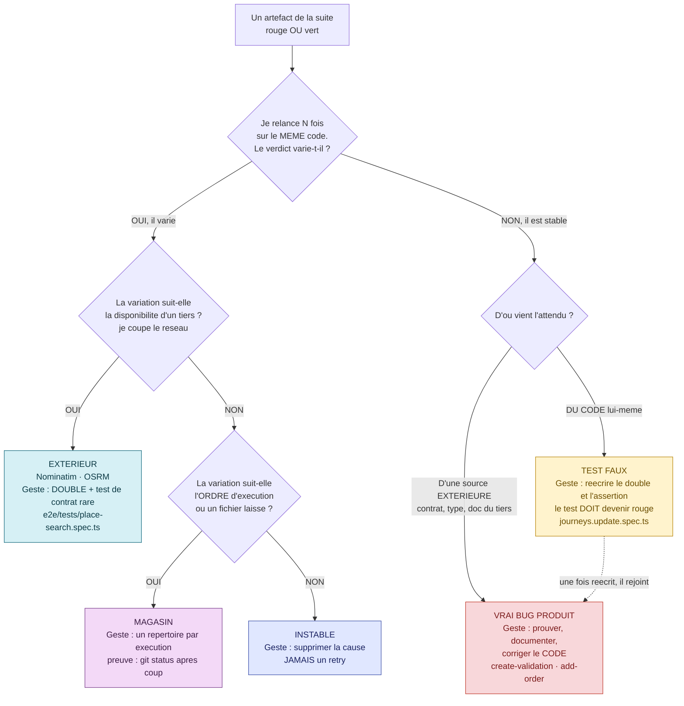
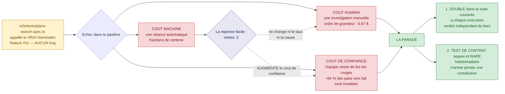
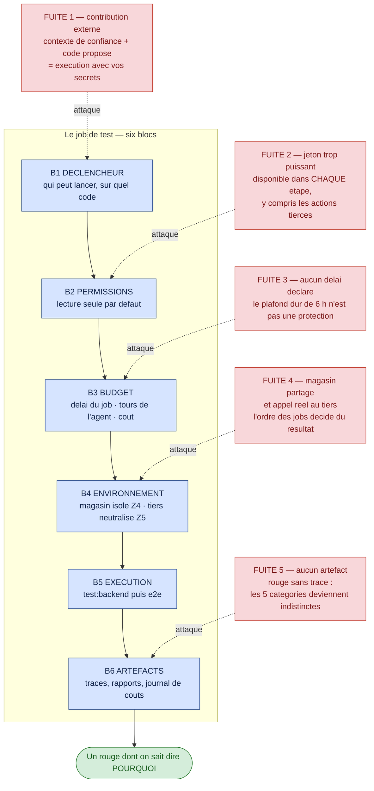

# Module M6 — « Dans le pipeline »

> **Jour 3 · après-midi · 120 min de notions + 60 min de col · 3 notions**
> *Promesse au participant : « À la fin de ce module, vous saurez classer un échec de CI en cinq
> catégories, nommer le geste qui va avec — et vous ne corrigerez plus jamais une instabilité par
> un `retry`. »*

**Document formateur.** Il se déroule tel quel en séance. Les encadrés 🔐 ne sont jamais projetés.
Référence de vérité du terrain : `00-carte-du-terrain.md`. Contrat d'écriture : `00-gabarit-notion.md`.

> ⚠️ **Avertissement de fraîcheur — à répercuter en séance, une fois, à l'ouverture du module.**
> Tout ce qui est écrit ici sur l'outillage de CI est **à jour au 07/2026** et **périmera**.
> Quatre faits à connaître avant de projeter quoi que ce soit :
> 1. La documentation de Claude Code vit désormais sur **`code.claude.com/docs/en/`** ; les liens
>    historiques vers `docs.anthropic.com` **redirigent** et les pages ont été **réécrites**.
> 2. GitHub a renommé *Copilot coding agent* en ***Copilot cloud agent*** : tous les chemins
>    `.../agents/coding-agent/...` redirigent vers `.../agents/cloud-agent/...`.
> 3. GitLab a supprimé le segment `/ee/` de ses URL de documentation.
> 4. **`temperature = 0` n'est pas le déterminisme.** C'est une réduction de variabilité, jamais
>    une garantie de reproductibilité — et sur les modèles récents, `temperature`, `top_p` et
>    `top_k` sont dépréciés et renvoient une **erreur 400** si on leur donne une valeur non par
>    défaut. Un participant qui repart avec « il suffit de mettre la température à zéro » repart
>    avec une croyance fausse, et il l'appliquera à sa CI.

---

## 0. Carte du module

### 0.1 Objectif terminal

> À l'issue de M6, le·a participant·e est capable de **prendre un échec de pipeline et de décider
> quoi en faire** : le classer dans l'une des cinq catégories du terrain, prouver son classement
> par une manipulation reproductible, et poser le geste correspondant — sans jamais employer le
> `retry` comme réponse.

C'est le seul objectif terminal du module. Tout le reste y concourt.

### 0.2 Position dans le fil rouge — *L'Expédition*, ⛰️ l'ascension

| | |
|---|---|
| **Ce qui existe avant M6** | Le matin du J3 (module M5) a produit un **agent qui travaille seul** : il génère, il exécute, il analyse, et il porte un garde-fou qui l'empêche de verdir en trichant. Les cordées savent le lancer depuis leur poste. Elles ne savent pas encore **ce qui se passe quand il tourne ailleurs**, ni **quoi faire d'un rouge qu'elles n'ont pas provoqué**. La suite du dépôt, elle, n'a pas bougé depuis le J1 : `npm run test:backend` sort toujours avec 2 suites en échec, et `e2e/tests/place-search.spec.ts` tombe sans que personne n'ait touché au code. |
| **Ce qui existe après M6** | Le groupe dispose d'un **arbre de décision des échecs** à cinq branches, chacune avec son signal discriminant et son geste. Chaque cordée a produit un **chiffrage du coût de l'instabilité** sur le projet, défendu avec ses sources. Et chaque participant a écrit, seul, un **workflow de CI complet et commenté** sur la suite réelle : permissions minimales, secrets, budget, artefacts, garde-fou anti-injection sur les contributions extérieures. Le col J3 peut alors demander de remettre la voie en état : les trois outils y sont. |
| **Ce que M6 ne fait pas** | On ne mesure pas la charge ni la sécurité : c'est **M7**. On ne construit pas la politique de gouvernance de l'agent dans la durée : c'est **M8.2**. On ne priorise pas l'effort de test par le risque : c'est **M8.1**. Et on ne corrige aucun bug du produit — le col J3 dira exactement quand cela devient légitime. |

### 0.3 Les trois notions

| # | Notion | Modalité (critère) | Durée | Terrain | Micro-évaluation |
|---|---|---|---|---|---|
| **M6.1** | Quatre causes, quatre gestes : classer un échec | **GRP** (`B-2`) | 40 | 🔴🟡⚪ **la suite réelle** — 2 rouges légitimes, 1 faux positif, 1 instable, 1 résidu de magasin | Exercice court (4 min) |
| **M6.2** | Combien coûte un test qui dépend de Nominatim ? | **INV** (`D-1`) | 40 | 🟡 **Z5** — `e2e/tests/place-search.spec.ts` | Restitution notée (grille) |
| **M6.3** | Mettre l'agent en CI sans se faire piéger | **SOLO** (`C-2`) | 40 | **Z4** *(isolation)* · **Z5** *(neutralisation)* — workflow sur la suite réelle | Exercice court (3 min) |

**Rythme** — GRP · INV · SOLO : aucun doublon consécutif (`R-1` ✓) · première séquence de
l'après-midi **active** (`R-7` ✓ — on ouvre sur une sortie de commande et un classement, pas sur
un exposé) · la pédagogie inversée du jour est ici (`R-2` ✓) · aucune ligne descendante de plus de
12 min sans interaction (`R-5` ✓) · clôture du module sur le col J3, victoire mesurable (`R-8` ✓).

> **Note de conception sur le rythme.** Il n'y a pas de jeu sérieux dans M6 : le J3 place le sien
> le matin (M5.1 *La Chasse* et M5.4 *Le Piège*). La règle `R-3` — au moins un jeu par jour — est
> donc satisfaite au niveau de la journée, pas du module. C'est volontaire : l'après-midi du J3
> est un **atelier d'industrialisation**, et sa tension vient de la suite réelle, pas d'un
> dispositif de jeu.

### 0.4 Minutage de la demi-journée

| Créneau | Séquence | Durée | Cumul |
|---|---|---|---|
| 14:00 → 14:40 | **M6.1** — Quatre causes, quatre gestes | 40 | 40 |
| 14:40 → 15:20 | **M6.2** — Combien coûte un test qui dépend de Nominatim ? | 40 | 80 |
| 15:20 → 15:35 | **Pause** | 15 | 95 |
| 15:35 → 16:15 | **M6.3** — Mettre l'agent en CI sans se faire piéger | 40 | 135 |
| 16:15 → 17:15 | 🏆 **BOSS J3 — « Le Passage difficile »** | 60 | 195 |
| 17:15 → 17:30 | **Le Débrief** — corrigé du col, scoreboard, ce qu'on retient | 15 | 210 |

**Contrôle** : 40 + 40 + 15 + 40 + 60 + 15 = **210 min** ✓ (après-midi conforme à
`00-architecture-28h.md` §2).

**Contrôle des notions** : 40 + 40 + 40 = **120 min** ✓

### 0.5 Points de Repère mobilisables sur le module

| Source | Gain |
|---|---|
| Micro-évaluation M6.1 réussie | 10 PR |
| Cordée ayant classé les cinq fiches d'échec justes **avec le signal cité** | 15 PR |
| Restitution M6.2 jugée complète (grille de recevabilité, 5 critères) | 20 PR |
| Micro-évaluation M6.3 réussie | 10 PR |
| Badge 🧊 **Le Stabilisateur** — éliminer la cause racine d'un test instable, pas un `retry` | 10 PR |
| Aide à une autre cordée, validée par elle | +10 PR |
| 🏆 **Col J3 franchi** | 0 à 100 PR |
| **Total maximal du module, col compris** | **165 PR** |

### 0.6 Préparation matérielle — la veille

| Vérification | Commande / geste | Attendu |
|---|---|---|
| La suite back sort bien en rouge | `npm run test:backend` | 2 suites passent, 2 suites échouent |
| La suite E2E est exécutable | `npx playwright install` puis `npm run e2e` | les navigateurs sont là, le back et le front démarrent seuls |
| **L'instabilité est bien native ce jour-là** | 20 exécutions de `e2e/tests/place-search.spec.ts` la veille au soir, taux d'échec relevé | un taux **non nul** ; s'il est nul, voir le repli de M6.2 §Ce qui peut rater |
| L'état résiduel du magasin est visible | `git status` après une exécution complète | des fichiers `.md` non suivis apparaissent |
| Le dépôt est réinitialisé | `git status` avant la séance | propre — la démonstration ne se fait **jamais** sur un poste participant |
| Le réseau autorise Nominatim | un appel manuel à `GET /api/places/search?q=paris` | une réponse, même lente |
| Les 5 fiches d'échec de M6.1 sont imprimées | 1 jeu par cordée | découpées, mélangées, verso vierge |
| Un dépôt d'entraînement pour M6.3 | un dépôt Git accessible en écriture, avec `.github/workflows/` vide | on peut y déposer un fichier YAML |

🔐 **Réservé formateur.** `grep -rn "BUG:" backend/src` donne les six bugs. Elle a été révélée au
débrief du col J1 : à ce stade de la formation, elle **n'est plus secrète**, mais elle reste
**irrecevable comme preuve** au col J3, exactement comme au col J1. Le rappeler à l'ouverture du
col, pas avant.

---

## 1. Notion M6.1 — « Quatre causes, quatre gestes : classer un échec »

|  |  |
|---|---|
| **Durée** | 40 min |
| **Modalité** | Exercice de groupe — classement sous contrainte, avec rôles et arbitrage |
| **Objectif d'apprentissage** | À l'issue, le·a participant·e est capable de **classer un échec de suite dans l'une des cinq catégories du terrain**, de **nommer le signal qui l'a fait trancher**, et de **poser le geste correspondant** — sans confondre le geste de diagnostic et le geste de correction |
| **Niveau visé (Bloom)** | **Analyser** |
| **Micro-évaluation** | Exercice court (4 min) — deux fiches inédites |
| **Ancrage fil rouge** | **La suite réelle du dépôt, en entier.** *Pourquoi ce terrain : il est exceptionnel parce qu'il est **réel**. On ne fabrique aucun cas. La suite livrée contient déjà, sans mise en scène, quatre des cinq catégories — `journeys.create-validation.spec.ts` et `steps.add-order.spec.ts` (🔴 vrais bugs produit, rouges légitimes), `journeys.update.spec.ts` (🟡 test faux, et **vert**), `e2e/tests/place-search.spec.ts` (🌀 instable **et** 🌍 extérieur). La cinquième — 📁 le magasin — se prouve en une commande, `git status`. Aucun exercice ne peut être accusé d'être artificiel : le participant classe ce qu'il exécute.* Ce que la notion fait avancer : la colonne « catégorie » de `carnet/j3-post-mortem.md` au col J3, et le tableau des dettes ouvertes du carnet de route du J4. |
| **Prérequis** | M1.4 *(la position de l'oracle)* — c'est le seul signal qui discrimine 🔴 et 🟡. M5.4 *(l'agent qui triche)* — l'agent proposera de verdir. |

### ▸ Pourquoi cette modalité

L'objectif est de **classer et d'arbitrer selon des critères**, donc critère `B-2` de
`00-grille-modalites.md` : *« le critère ne s'apprend pas, il s'exerce sur des cas où il fait
mal. »* Une taxonomie projetée est acceptée en trois minutes et inapplicable le lundi suivant :
le vrai travail n'est pas de connaître les cinq noms, c'est de **trancher entre deux d'entre eux
sur un cas qui résiste**. La forme retenue est un exercice de groupe avec rôles imposés, parce que
la difficulté est ici **collective** : c'est en devant convaincre un coéquipier qu'un participant
découvre qu'il n'a pas de signal, seulement une intuition. Deux fiches sur cinq divisent
systématiquement les cordées — ce sont elles qui produisent l'apprentissage, pas les trois autres.
La notion ouvre l'après-midi, donc elle est **active** (`R-7` ✓).

### ▸ Ce qu'il faut avoir compris à la fin

- **Un échec n'est pas une information, c'est une question.** La seule question utile est :
  *« qu'est-ce qui varie quand je change une seule chose ? »* — le code, l'ordre, le réseau, l'heure.
- **Cinq catégories, cinq signaux, cinq gestes.** Le signal se produit par une **manipulation**,
  jamais par une lecture : répéter, isoler, couper le réseau, relire l'oracle, regarder `git status`.
- **Le vert entre dans le classement.** `journeys.update.spec.ts` est vert et appartient pourtant
  à une catégorie d'échec — la catégorie 🟡. Ne classer que ce qui est rouge, c'est rater la moitié
  du problème.
- **Le geste de diagnostic n'est jamais le geste de correction.** On répète pour prouver
  l'instabilité ; on ne répète pas pour la faire disparaître. Le `retry` est un geste de
  diagnostic qui a été promu, par erreur, au rang de correction.
- **La catégorie décide qui paie.** 🔴 va au produit, 🟡 va à l'équipe de test, 🌀 et 🌍 vont à
  l'architecture de la suite, 📁 va à l'isolation. Se tromper de catégorie, c'est envoyer la
  facture au mauvais service — et le défaut reste.

### ▸ Déroulé minuté

| Temps | Le formateur | Les participants |
|---|---|---|
| **0-4** *(4)* | **OUVERTURE PAR LA SORTIE BRUTE.** Aucune introduction. Projette, côte à côte, trois sorties relevées la veille : `npm run test:backend` (2 suites passent, 2 échouent), l'agrégat de 20 exécutions de `e2e/tests/place-search.spec.ts`, et un `git status` d'après exécution. Une seule question : « il y a combien de problèmes différents à l'écran ? » Compte les réponses à main levée, les écrit, **ne tranche pas**. | Regardent, comptent, annoncent. La salle se divise entre « deux » et « quatre ». Personne ne dit « cinq », et personne ne compte le vert. |
| **4-6** *(2)* | **RÈGLE DE L'EXERCICE ET RÔLES.** Distribue **cinq fiches d'échec** par cordée (voir §Les cinq fiches) et la grille vierge. Impose trois rôles : le **Classeur** (tient la grille, refuse toute case sans signal), le **Manipulateur** (au clavier, seul autorisé à exécuter), le **Contradicteur** (doit s'opposer au moins une fois par fiche, à voix haute). « Une fiche, une catégorie, **et le signal qui vous a fait trancher**. Une catégorie sans signal vaut zéro. » | Prennent les fiches, se répartissent les trois rôles, lancent le chronomètre. En cordée de deux, le Classeur assure aussi la contradiction. |
| **6-18** *(12)* | **LE CLASSEMENT.** Circule, chronomètre affiché. **Ne tranche rien, ne confirme rien.** Deux relances programmées, à la salle entière : à **6 min** — *« combien de vos signaux sont une manipulation, et combien sont une lecture ? »* ; à **10 min** — *« l'un de vous a-t-il classé une fiche verte ? »*. | Manipulent : relancent une suite seule, relancent la même suite dix fois, coupent le réseau, exécutent les fichiers dans un autre ordre, regardent `git status`. Remplissent la grille. Se disputent sur deux fiches. |
| **18-24** *(6)* | **AFFICHAGE CROISÉ.** Fait afficher les grilles au mur, côte à côte. Ne corrige pas encore. « Cherchez les fiches qui ne sont pas dans la même colonne d'une cordée à l'autre. » Note au tableau les deux fiches litigieuses, sans les nommer catégorie. | Circulent, comparent. Repèrent seuls que les fiches **B** et **E** divisent la salle. Découvrent qu'une cordée a classé la fiche verte et que les autres l'ont ignorée. |
| **24-29** *(5)* | **ARBITRAGE DES DEUX FICHES QUI DIVISENT.** Traite **uniquement** les fiches **B** et **E** (voir §Les deux fiches qui font débat). Pour chacune : 90 secondes par camp, puis tranche **avec le signal, jamais avec l'autorité**. Écrit le signal au tableau, pas la conclusion. | Défendent leur classement, entendent l'autre camp, se rangent au signal. C'est ici que la notion s'apprend. |
| **29-33** *(4)* | **L'ARBRE DE DÉCISION.** Dévoile le diagramme en cinq temps (voir notice). Fait rejouer **trois fiches déjà classées** à travers l'arbre, à voix haute. « Vous venez de fabriquer ce schéma. Je ne fais que l'écrire. » | Rejouent trois fiches. Recopient l'arbre dans le carnet de cordée — il servira au col dans deux heures et au carnet de route du J4. |
| **33-37** *(4)* | **MICRO-ÉVALUATION.** Distribue deux fiches inédites, une par personne. « Une catégorie, un signal, un geste. Trois minutes. Correction croisée avec le voisin. » Annonce les 15 PR à la cordée ayant les cinq fiches justes **avec le signal cité**. | Classent seuls, échangent leur feuille, corrigent. |
| **37-40** *(3)* | **SYNTHÈSE — la parole est aux participants.** « En une phrase, sans vos notes : qu'est-ce que vous ferez, lundi, **avant** de relancer un pipeline rouge ? » Fait parler deux cordées, n'ajoute rien, enchaîne sur M6.2. | Formulent. Réponse attendue : *« je change une seule chose et je regarde ce qui varie — parce que c'est ça qui me donne la catégorie. »* |

**Contrôle : 4 + 2 + 12 + 6 + 5 + 4 + 4 + 3 = 40 min ✓**

### ▸ Contenu à transmettre

> **Attention.** Ce contenu **ne se projette pas avant la minute 24**. Le tableau des cinq
> catégories est le résultat de l'exercice, pas son énoncé. Le projeter au départ transforme un
> arbitrage en dictée.

**1. Les cinq catégories, leur signal, leur geste.** Les quatre premières viennent du col J3
(`00-fil-rouge.md` §6.3). La cinquième est **propre à ce projet** : elle n'existe que parce que la
base de données est un dossier de fichiers.

| Catégorie | Le signal qui discrimine — une **manipulation**, pas une lecture | Le geste | Qui paie |
|---|---|---|---|
| 🔴 **Vrai bug produit** | Échoue **systématiquement**, sur le même code, hors CI comme en CI. L'attendu vient d'une source extérieure au code. Le produit dévie du contrat. | **Ne pas toucher au test.** Prouver par un scénario rejoué, ouvrir une fiche de défaut, corriger le **code** — jamais l'assertion. | L'équipe produit |
| 🟡 **Test faux** | L'oracle vient du code. **L'exécution en série ne change rien** : le verdict est stable, et il est faux. *Peut être vert.* | Réécrire le double et l'assertion depuis le contrat. **Accepter que le test devienne rouge** : c'est le signe qu'il fonctionne enfin. | L'équipe de test |
| 🌀 **Instable** | Le résultat **varie sur le même code**. Se prouve par **répétition** : N exécutions, un taux d'échec non nul. | Supprimer la cause de variation. Un `retry` **n'est pas une correction** : il change le rapport, pas le test. | L'architecture de la suite |
| 🌍 **Extérieur** | L'échec suit la disponibilité d'un tiers, pas le code. Se prouve en **coupant le réseau** : l'échec change de forme ou de fréquence. | **Double** dans la suite courante + **test de contrat séparé et rare** contre le vrai tiers. | L'architecture de la suite |
| 📁 **Magasin** | L'échec dépend de **l'ordre** d'exécution ou d'un fichier laissé par un autre test. Se prouve en exécutant les fichiers isolément, et par `git status` après coup. | Isoler : un répertoire de magasin **par exécution**, nettoyé à la fin. Pas de fixture partagée. | L'isolation des tests |

**2. La question qui produit le signal, en une phrase.**

> ***Qu'est-ce qui varie quand je change une seule chose ?***
> Le code → 🔴. Rien → 🟡. Rien du tout, mais le verdict bouge → 🌀. Le réseau → 🌍. L'ordre → 📁.

**3. Les deux confusions qui coûtent le plus cher.**

- **🌀 pris pour 🔴.** On relance, ça passe, on conclut « c'était un faux positif de CI » et on
  fusionne. C'est la porte d'entrée des régressions réelles : Google observe que **~84 % des
  transitions *pass → fail*** en CI impliquent un test instable — donc **16 % sont de vraies
  régressions**, et ce sont celles-là qu'on jette avec l'eau du bain.
- **🔴 pris pour 🟡.** On décrète que le test est mal écrit, on ajuste l'assertion, la suite
  verdit, et la **seule preuve du défaut disparaît**. C'est le malus le plus lourd du barème :
  **−40 PR**. Le seul rempart est la question de M1.4 : *d'où vient l'attendu ?*

**4. Le `retry` : ce qu'il fait et ce qu'il ne fait pas.** Playwright classe les résultats en
trois états — `passed`, **`flaky`** (échoué à la première tentative, passé au *retry*) et `failed`.
Le statut `flaky` rend l'instabilité **comptable** : c'est son seul mérite, et il est réel.

> À dire tel quel : *« le `retry` est un instrument de mesure qu'on a promu par erreur au rang de
> remède. Mesurer avec, oui. Guérir avec, jamais. »*

**5. La quarantaine, et sa date de péremption.** Quand on ne peut pas corriger tout de suite, on
met en quarantaine — **avec une échéance écrite** : GitLab contractualise **3 jours** et **3 mois**
maximum, puis suppression automatique. Sans échéance, la quarantaine devient un cimetière.

**6. La phrase à faire noter.**

> *Une suite rouge dont on sait dire pourquoi vaut mieux qu'une suite verte dont on ne sait rien.
> Le travail du J3 n'est pas de verdir : c'est de **ne plus avoir un seul échec inexpliqué**.*

*(≈ 600 mots — plafond du gabarit : 700)*

### ▸ 🎴 Les cinq fiches d'échec — à imprimer, une pochette par cordée

> Chaque fiche porte **uniquement** ce qu'un ingénieur voit en arrivant le matin : un nom
> d'artefact, un symptôme, et rien d'autre. Aucune catégorie n'est écrite. Le verso reste vierge :
> la cordée y note le **signal** et le **geste**.

| Fiche | Recto — ce qui est écrit | Zone |
|---|---|---|
| **A** | `backend/src/journeys/journeys.create-validation.spec.ts` — **FAIL**. Sortie : `expected 400 "Bad Request", got 201 "Created"`. Échoue à chaque exécution, sur le poste comme sur celui du voisin. | Z2 |
| **B** | `backend/src/journeys/journeys.update.spec.ts` — **PASS**. Vert à chaque exécution. Aucun symptôme. | Z2 |
| **C** | `backend/src/steps/steps.add-order.spec.ts` — **FAIL**. Le test attend l'étape ajoutée en dernière position de `steps[]`, elle est en première. Échoue à chaque exécution. Le même symptôme apparaît dans `e2e/tests/add-step-order.spec.ts`. | Z3 |
| **D** | `e2e/tests/place-search.spec.ts` — **FAIL** ce matin, **PASS** hier soir, **FAIL** à 14 h, **PASS** à 14 h 02. Rien n'a été commité entre-temps. | Z5 · Z6 |
| **E** | Après `npm run test:backend`, `git status` fait apparaître des fichiers `.md` non suivis dans le dossier du magasin. La suite est verte. Relancée deux fois de suite sans nettoyer, une suite qui passait échoue. | Z4 |

#### Solution — grille de correction (90 secondes au tableau)

| Fiche | Catégorie | Le signal attendu | Le geste attendu |
|---|---|---|---|
| **A** | 🔴 **Vrai bug produit** | Échec **systématique** + l'attendu (`400`) est écrit dans `docs/API-CONTRACT.md`, §Journeys, `POST /api/journeys` : *« 400 si `endDate < startDate` »*. Oracle extérieur au code. | Ne pas toucher au test. Prouver par un `POST` réel, ouvrir la fiche de défaut, corriger le code. |
| **B** | 🟡 **Test faux** | Le double de sauvegarde **réinjecte les `steps` d'origine** dans le résultat attendu : l'attendu vient de l'implémentation. Aucune modification du code de production ne fait tomber ce test. | Réécrire le double, assertion depuis le contrat (*« les steps ne doivent PAS être perdus »*). **Le test devient rouge** — c'est le but. |
| **C** | 🔴 **Vrai bug produit** | Échec systématique **aux deux niveaux**, TU et E2E. Le contrat dit *« ajouté **à la fin** de `steps[]` »*. Deux insertions suffisent à le prouver. | Identique à A. Le doublon TU/E2E est une **redondance de preuve**, pas un problème à supprimer. |
| **D** | 🌀 **Instable** **et** 🌍 **Extérieur** | Le résultat **varie sur le même code** (répétition) **et** la variation suit la disponibilité de Nominatim (coupure réseau). C'est la seule fiche à **deux** catégories. | Double réseau dans la suite courante **+ test de contrat séparé et rare**. Jamais un `retry`. |
| **E** | 📁 **Magasin** | L'échec dépend de **l'état laissé par l'exécution précédente**. Se prouve en deux temps : `git status` non vide après coup, puis échec à la seconde exécution sans nettoyage. | Répertoire de magasin **par exécution**, nettoyé en sortie. Aucune fixture partagée entre fichiers. |

#### Les deux fiches qui font débat — *ce sont elles qui font apprendre*

**Fiche B — « le test est vert, donc il n'y a pas d'échec ».**
C'est la fiche que la moitié de la salle **ne classe pas du tout**. L'argument du camp qui la
laisse de côté est imparable en apparence : un exercice de classement d'échecs ne porte pas sur un
test qui passe.
**L'arbitrage** : la catégorie 🟡 est définie par **la position de l'oracle**, pas par la couleur.
Un test dont l'attendu vient du code est faux, qu'il soit vert ou rouge — et il est **plus
dangereux vert**, parce que personne ne le regarde. La phrase à dire, mot pour mot : *« la seule
chose que ce test prouve, c'est qu'il a été exécuté. »* On enchaîne par la question de M1.1 :
*quelle modification du code de production ferait passer ce test au rouge ?* — la réponse est
« aucune », et la salle se range.
**Conséquence directe sur le col**, à annoncer maintenant : *« au col, dans deux heures, traiter
cette fiche va **augmenter** le nombre de tests rouges. Si votre critère de réussite est le nombre
de verts, vous ne la traiterez pas. Ce n'est pas le critère. »*

**Fiche E — « ce n'est pas un test, c'est un problème d'environnement ».**
Le camp *environnement* a un argument sérieux : le magasin est une infrastructure, pas du code
métier, et sur un poste propre le problème n'apparaît pas. Le camp *magasin* répond que le résidu
est **produit par la suite elle-même**.
**L'arbitrage** : c'est la catégorie 📁, et elle existe précisément pour refuser le mot
« environnement ». Le signal décisif tient en une phrase : *« si je supprime les fichiers résiduels
et que tout repasse, ce n'est pas l'environnement — c'est ma suite qui a écrit dedans. »*
Une suite qui laisse des `.md` derrière elle est sanctionnée par le barème de l'expédition
(**−20 PR**) pour une raison simple : **son résultat dépend de son passé**. Le nuancier à donner :
un vrai problème d'environnement, c'est une version de Node différente ou un port occupé. Un
fichier écrit par le test, c'est le test.

### ▸ 🖼️ Diagramme — `diagrammes/M6-1-larbre-de-classement-des-echecs.svg`

#### Source Mermaid



#### Descriptif du SVG à produire

Format portrait 1200 × 1500, imprimable en A4 portrait et **affichable au mur jusqu'à la fin du
J4** — c'est l'artefact le plus consulté du module. En haut, un rectangle neutre gris clair
« un artefact de la suite — **rouge OU vert** », la mention *ou vert* en gras et en couleur
d'accent : c'est le message qui se perd le plus vite. En dessous, quatre losanges de décision
répartis en deux branches, et cinq rectangles de résultat, chacun de la couleur de sa catégorie
(rouge 🔴, jaune 🟡, bleu 🌀, cyan 🌍, violet 📁). Chaque rectangle de résultat porte **trois
lignes** : le **nom de la catégorie** en capitales, le **geste** en une phrase impérative, et le
**nom de l'artefact du dépôt** qui l'illustre — le lien entre l'arbre et le terrain doit rester
visible après la séance. Une flèche pointillée part du bloc jaune vers le bloc rouge avec la
mention *« une fois réécrit, il rejoint »*. Sur le premier losange, faire figurer en petit
« N ≥ 20 » : le nombre d'exécutions n'est pas décoratif, il conditionne la validité du signal.
En bas de page, sur une seule ligne : *« Qu'est-ce qui varie quand je change une seule chose ? »*

#### Explication du diagramme — notice de dévoilement

| Ordre | Ce qu'on affiche | La phrase à dire | Ce qu'on attend en retour / erreur à prévenir |
|---|---|---|---|
| 1 | **Le rectangle du haut seul** | « Trois mots comptent ici : *rouge **ou** vert*. Si vous ne classez que le rouge, vous laissez dehors le cas le plus dangereux du dépôt. » | Quelqu'un dit « la fiche B » — c'est le moment recherché. Ne pas enchaîner tout de suite. |
| 2 | **Le premier losange et la branche « il varie »** | « Une seule manipulation ouvre l'arbre : je relance sur le même code. Pas une lecture, pas une intuition. Une répétition. » | Erreur à prévenir : croire que trois exécutions suffisent. Dire le chiffre : **N ≥ 20**, sinon le taux n'a aucun sens. |
| 3 | **Les deux losanges de la branche instable, et les trois blocs bleu / cyan / violet** | « Trois causes de variation, et elles ne se soignent pas pareil. Le réseau se double. L'ordre s'isole. Le reste se supprime — et *supprimer*, ce n'est pas *relancer*. » | Erreur à prévenir : fusionner 🌀 et 🌍. Le tiers **n'est pas** une instabilité de plus : c'est une dépendance de disponibilité, et elle a un geste à elle. |
| 4 | **La branche « il est stable » et la question de l'oracle** | « De l'autre côté, rien ne varie. Alors la seule question qui reste est celle de lundi matin : **d'où vient l'attendu ?** » | Marquer un temps d'arrêt. C'est le point de jonction avec M1.4, et il se fait dire par la salle, pas par le formateur. |
| 5 | **La flèche pointillée du jaune vers le rouge** | « Et voilà ce qui va vous surprendre au col : quand vous réparez un test faux, il ne devient pas vert. Il devient rouge — et il rejoint la colonne des vrais bugs. » | Erreur à prévenir, la plus coûteuse du module : croire que corriger le 🟡 améliore le compteur de verts. **C'est l'inverse, et c'est normal.** |

⚠️ **Erreur d'interprétation à prévenir.** L'arbre sera lu comme une chaîne de tri automatique —
« je passe l'échec dedans et il en sort classé ». Le désamorcer à l'étape 2 : *« ce schéma ne
classe rien. Chaque losange est une **manipulation que quelqu'un doit faire**. Sans la
manipulation, vous avez un avis, pas un classement. »* Sans cette phrase, les cordées classeront
les cinq fiches au col en trois minutes, à la lecture, et se tromperont sur B et E.

### ▸ 🔍 Démonstration — prélever les cinq échecs, en quatre manipulations

**Point de départ.** Dépôt réinitialisé, `npm install` fait, navigateurs Playwright installés.
Le formateur exécute **sur son poste**, jamais sur un poste participant. Les quatre manipulations
sont enchaînées sans commentaire ; le commentaire vient après.

*Manipulation 1 — l'état stable.*

```bash
npm run test:backend
# Test Suites: 2 failed, 2 passed, 4 total
```

Relancer immédiatement. **Même résultat, aux mêmes fichiers.** À dire : *« deux échecs, et ils ne
bougent pas. Branche droite de l'arbre. »*

*Manipulation 2 — la répétition qui révèle la variation.*

```bash
# 20 exécutions du même fichier E2E, sur le même code, sans rien commiter
for i in $(seq 1 20); do
  npx playwright test e2e/tests/place-search.spec.ts >/dev/null 2>&1 \
    && echo "run $i: PASS" || echo "run $i: FAIL"
done
```

À dire, en montrant la colonne : *« même code, même machine, même minute. Des PASS et des FAIL.
Branche gauche. »*

*Manipulation 3 — le réseau départage 🌀 et 🌍.* Couper la connexion réseau du poste, relancer le
même fichier une fois. L'échec change de **nature** : il devient immédiat et systématique au lieu
d'être intermittent. À dire : *« l'instabilité vient de dehors. Ce n'est pas un aléa de notre
suite, c'est une dépendance de disponibilité. »*

*Manipulation 4 — le magasin.*

```bash
git status --short
```

Des fichiers `.md` non suivis apparaissent dans le dossier du magasin après l'exécution.
À dire : *« ma suite a écrit ça. Et demain matin, une autre suite les relira. »*

**Ce que l'exemple révèle.** Les quatre manipulations tiennent en moins de dix minutes et
produisent **cinq classements différents** sur un dépôt que personne n'a modifié. C'est la
démonstration que le classement n'est pas une affaire d'expérience ou de flair : c'est une affaire
de **protocole**. Un ingénieur qui exécute ces quatre manipulations classe correctement dès son
premier jour sur un produit ; un ingénieur qui lit le code pendant quatre heures ne classe rien.

**Ce qui peut rater, et le repli associé.**

| Risque | Signe | Repli |
|---|---|---|
| Les 20 exécutions passent toutes | colonne de PASS uniforme | **Le dire.** *« Aujourd'hui Nominatim répond bien — et c'est exactement le problème : l'instabilité n'est pas reproductible à la demande. »* Projeter le relevé de la veille (§0.6) et enchaîner sur la manipulation 3, qui, elle, marche toujours. |
| La boucle de 20 exécutions dépasse 5 minutes | le chronomètre file | La lancer **avant** l'ouverture de la notion, en arrière-plan, et n'en projeter que l'agrégat |
| Le poste est hors ligne dès le départ | `npm run e2e` échoue au démarrage | Inverser l'ordre : commencer par la manipulation 3 (état hors ligne assumé), puis rebrancher |
| `git status` est propre | aucun `.md` résiduel | Vérifier qu'un `.gitignore` ne masque pas le magasin ; à défaut, utiliser `git status --ignored --short` et le dire à voix haute |
| Un participant a corrigé un bug sur son poste | sa suite n'a plus qu'un échec | Ne jamais démontrer sur un poste participant. Le dépôt de démonstration est réinitialisé la veille. |

### ▸ ✅ Micro-évaluation — Exercice court (4 min)

**Énoncé** *(trois lignes, une feuille par personne)*

> Deux fiches inédites. Pour chacune : **la catégorie**, **le signal** qui vous a fait trancher —
> il doit être une manipulation — et **le geste**. Correction croisée avec votre voisin.

| Fiche | Ce qui est écrit |
|---|---|
| **F** | Un test de `backend/src/steps/` passe quand on l'exécute seul et échoue quand on lance toute la suite. Le code n'a pas été modifié entre les deux. |
| **G** | Un test attend `authorId` non nul sur un commentaire d'étape. Il échoue à chaque exécution, sur tous les postes. Le bloc §Types partagés de `docs/API-CONTRACT.md` déclare `authorId: string`. |

**Résultat attendu vérifiable** *(cases à cocher, contrôle en moins de 60 secondes)*

- [ ] **Fiche F → 📁 Magasin.** Signal : *« je l'exécute isolément puis dans la suite complète, et
      le verdict change »* — c'est une manipulation d'ordre et d'état partagé, pas de code.
      Geste : un répertoire de magasin par exécution, nettoyé en sortie.
      *(Accepté aussi : 🌀 instable, **si et seulement si** le signal cité est la répétition et
      que la copie note que l'isolation n'a pas encore été testée. Refusé : 🔴 et 🟡.)*
- [ ] **Fiche G → 🔴 Vrai bug produit.** Signal : échec **systématique** + l'attendu vient du
      **type partagé**, source extérieure au code. Geste : ne pas toucher au test, prouver,
      documenter, corriger le code.

**Solution de référence** — F : 📁 magasin. G : 🔴 vrai bug produit (c'est le défaut #14,
`authorId` toujours `null`).

**L'erreur que 80 % des groupes commettent.** Classer **G** en 🟡 *test faux*, au motif que
« personne n'avait écrit ce test avant, donc c'est le test qui est nouveau et suspect ».
L'ancienneté d'un test n'est pas un signal. Le distinguo à rappeler en trente secondes : **un test
récent dont l'oracle est le contrat est un test légitime ; un test ancien dont l'oracle est le code
est un test faux.** La date de naissance ne dit rien ; la position de l'oracle dit tout.

### ▸ 🔗 Ressources

| Ressource | À qui elle s'adresse | Ce qu'il faut y lire précisément |
|---|---|---|
| *Unhealthy tests — GitLab development docs* — https://docs.gitlab.com/development/testing_guide/unhealthy_tests | **La référence de la notion** | Les **8 catégories d'instabilité étiquetées** — `state leak`, `dataset-specific`, `random input`, `unreliable dom selector`, `datetime-sensitive`, `unstable infrastructure`, `improper synchronization`, `too-many-sql-queries`. Nos catégories 🌀 et 📁 y correspondent terme à terme. |
| *Flaky Tests at Google and How We Mitigate Them* — https://testing.googleblog.com/2016/05/flaky-tests-at-google-and-how-we.html | Celui qui doit convaincre sa direction | Les trois chiffres qui justifient le chapitre à eux seuls : **~1,5 %** des exécutions rendent un résultat instable, **~16 %** des tests présentent un niveau d'instabilité, **~84 %** des transitions *pass → fail* impliquent un test instable. |
| *Where do our flaky tests come from?* — https://testing.googleblog.com/2017/04/where-do-our-flaky-tests-come-from.html | Celui qui veut approfondir | Le pipeline de détection, la **mise en quarantaine automatique** et le triage — et la confirmation du **~16 %**. |
| *An Empirical Analysis of Flaky Tests* (Luo, Hariri, Eloussi, Marinov — FSE 2014) — http://mir.cs.illinois.edu/marinov/publications/LuoETAL14FlakyTestsAnalysis.pdf | **La taxonomie académique** | **201 commits** correctifs dans **51 projets** open source, classés par cause racine et par stratégie de correction. C'est la source dont dérivent la plupart des taxonomies ultérieures. |
| *Test Quarantine Process — GitLab Handbook* — https://handbook.gitlab.com/handbook/engineering/testing/quarantine-process/ | Celui qui écrit une politique d'équipe | Les durées **contractuelles** : quarantaine rapide **3 jours**, quarantaine longue **3 mois** maximum, avertissement une semaine avant **suppression automatique**. Le garde-fou anti-cimetière. |
| *Retries — Playwright Test* — https://playwright.dev/docs/test-retries | Celui qui outille la suite E2E | Les **trois** statuts : `passed`, **`flaky`**, `failed` — et `testInfo.retry`, qui permet de nettoyer un état serveur entre deux tentatives. Le statut `flaky` est la métrique gratuite à collecter ; il ne corrige rien. |
| *Working with Flaky Tests — Datadog Test Optimization* — https://docs.datadoghq.com/tests/flaky_tests | Celui qui doit décider quoi bloquer | La distinction opérationnelle **`is_known_flaky`** (on ne bloque pas la contribution) contre **`is_new_flaky`** (on bloque) — la seule façon de garder un gating utile sans arrêter l'équipe. |

### ▸ ⚠️ Pièges d'animation

- **Ce qui rate habituellement** : le classement se fait **à la lecture**. Les cordées lisent les
  cinq fiches, discutent, et remplissent la grille sans avoir rien exécuté. Contre-mesure inscrite
  dans les rôles : **seul le Manipulateur touche au clavier, et le Classeur refuse toute case dont
  le signal n'est pas une manipulation.** La relance de 6 minutes existe pour cela et se dit à la
  salle entière, jamais à une cordée nommée.
- **La question qui revient toujours** : *« et si un échec appartient à deux catégories ? »*
  Réponse courte : *« c'est le cas de la fiche D, et c'est la règle plutôt que l'exception : un
  test qui appelle un tiers est 🌍 par nature et 🌀 par conséquence. On les note toutes les deux —
  parce qu'il y a deux gestes, pas un. »* Ne pas ouvrir de débat taxonomique : la question du col
  n'est pas « combien de catégories » mais « combien de gestes ».
- **Le débat qui déraille** : la fiche E peut consommer huit minutes sur le thème « c'est un
  problème d'infrastructure ». Le chronomètre est explicite : **90 secondes par camp, puis
  arbitrage.** Le signal qui clôt le débat est une phrase, pas un argument : *« supprimez les
  fichiers résiduels, relancez. Si tout passe, c'est votre suite. »*
- **Le risque de démotivation** : cinq catégories, cinq gestes, une suite rouge — la salle peut
  sortir avec le sentiment que le dépôt est irrécupérable. Le contre-feu se dit avant la synthèse :
  *« sur les cinq fiches, **une seule** demande de toucher au produit. Les quatre autres se traitent
  dans la suite de tests, cet après-midi, en une heure. »*
- **Le signe qu'il faut passer à la suite** : dès qu'une cordée emploie spontanément le mot
  « signal » pour justifier un classement — et non « je pense que » — la notion est acquise. Clore
  même s'il reste une fiche à commenter : la grille de correction écrite part avec les
  participants.

---

## 2. Notion M6.2 — « Combien coûte un test qui dépend de Nominatim ? »

|  |  |
|---|---|
| **Durée** | 40 min *(le protocole de débrief de référence, en 45 à 60 min, figure au §Protocole de débrief ; la version de séance en est la forme resserrée — voir la note de dimensionnement)* |
| **Modalité** | **Pédagogie inversée** — démonstration d'entrée, recherche documentaire encadrée, restitution contradictoire, chiffrage sur le projet |
| **Objectif d'apprentissage** | À l'issue, le·a participant·e est capable de **chiffrer le coût d'un test instable sur son propre projet** — en minutes, en euros et en confiance — de **citer deux chiffres publiés avec leur méthodologie**, et de **défendre une parade qui n'est pas un `retry`** |
| **Niveau visé (Bloom)** | **Évaluer** |
| **Micro-évaluation** | Restitution notée sur grille de recevabilité (5 critères) |
| **Ancrage fil rouge** | **Z5 — Le monde extérieur** · 🟡 `e2e/tests/place-search.spec.ts`, feature #11 *Recherche de lieu*. *Pourquoi ce terrain : parce que **la fonctionnalité #11 n'a aucun bug**. Le test n'utilise aucun double réseau, interroge le **vrai** Nominatim (`nominatim.openstreetmap.org`) et assertit un texte exact — latence, limitation de débit, reformulation d'un libellé côté OpenStreetMap suffisent à le faire tomber. L'échec ne dit donc **rien** du produit. C'est la définition exacte de l'instabilité, et elle est ici **native** : elle n'est ni simulée, ni injectée, ni mise en scène. Aucun autre terrain de la formation ne permet de chiffrer un coût réel sur un défaut qui n'existe pas.* Ce que la notion fait avancer : le critère « neutralisation propre du monde extérieur » du col J3 (20 PR), et la section « coût » du carnet de route du col J4. |
| **Prérequis** | M6.1 *(les cinq catégories — cette notion approfondit 🌀 et 🌍)*. M1.3 *(le déterminisme comme critère)*. |

### ▸ Pourquoi cette modalité

L'objectif est de **se repérer dans un écosystème mouvant** et d'en tirer un chiffre défendable,
donc critère `D-1` de `00-grille-modalites.md` : *« le contenu périme en 6 mois. Ce qui reste,
c'est la méthode de recherche et les critères. »* Les chiffres publiés sur le coût de
l'instabilité bougent d'une étude à l'autre, d'un contexte à l'autre, et **aucun d'eux ne
s'applique tel quel à *Carnet de voyage***. Un exposé qui les énumérerait produirait exactement ce
qu'on veut éviter : un participant qui répétera « les tests instables coûtent 2,5 % du temps
productif » sans savoir de quel temps, de quel projet ni mesuré comment. Ce qui ne périme pas,
c'est la **méthode de chiffrage** : partir d'une mesure faite chez soi, chercher les ordres de
grandeur publiés pour se situer, et énoncer explicitement ce que le transfert coûte en validité.
La pédagogie inversée est donc le seul choix honnête ici — et elle coûte **plus** cher en animation
qu'un exposé, ce que `00-grille-modalites.md` §7 rappelle explicitement : *« le débrief structuré
de 45 à 60 minutes est la partie qui fait apprendre, et il se prépare. »* La notion suit un
exercice de groupe (`R-1` respecté) et constitue la pédagogie inversée du J3 (`R-2` ✓).

> **Note de dimensionnement, à lire par le formateur avant la séance.** La grille prescrit un
> débrief de 45 à 60 min pour une `INV`. La séance n'en offre pas autant : la notion tient en
> 40 minutes, dont **17 de restitution et d'arbitrage**. Le protocole complet est donc écrit
> intégralement au §Protocole de débrief, dans sa version 45-60 min, et la version de séance en est
> une **forme resserrée assumée** — on coupe la phase de contre-chiffrage croisé et la phase de
> rédaction. Ce que l'on ne coupe **jamais** : la restitution contradictoire, le chiffrage sur le
> projet, et l'arbitrage de la parade. Quand le module est joué en intra sur une journée dédiée,
> c'est la version longue qui s'applique.

### ▸ Ce qu'il faut avoir compris à la fin

- **Un test instable est un test faux**, pas une nuisance d'infrastructure. Il rend un verdict qui
  ne dépend pas de ce qu'il prétend mesurer.
- **Le coût d'un test instable n'est presque jamais celui de la relance.** Une relance
  automatique coûte des fractions de centime ; c'est **l'investigation humaine** qui coûte, et
  c'est la **confiance perdue** dans la suite qui coûte le plus longtemps.
- **Un chiffre publié ne se transporte jamais tel quel.** Il se cite avec sa méthodologie, son
  périmètre et sa date — et on énonce ce que son transfert coûte en validité.
- **La parade n'est jamais un `retry`.** C'est un **double** dans la suite courante, plus un
  **test de contrat séparé et rare** qui vérifie que le tiers n'a pas changé. Deux artefacts, deux
  fréquences, deux propriétaires.
- **La dépendance à un service tiers gratuit et public est une dépendance de disponibilité** :
  elle ne se teste pas, elle se **contractualise** — ou elle se neutralise.

### ▸ Déroulé minuté

| Temps | Le formateur | Les participants |
|---|---|---|
| **0-5** *(5)* | **OUVERTURE PAR LA MESURE, PAS PAR LE COURS.** Aucune introduction. Projette la commande de 20 exécutions de `e2e/tests/place-search.spec.ts`, **la lance en direct**, et pendant qu'elle tourne : « pariez : sur 20, combien échouent ? Écrivez votre nombre, une seule fois. » Écrit les paris au tableau. Puis affiche le décompte réel. Une phrase, une seule : *« la fonctionnalité #11 n'a aucun bug. Cet échec ne dit rien du produit. »* | Parient à l'écrit, regardent la colonne se remplir. Constatent l'écart entre leur estimation et le taux réel. La question tombe presque toujours : *« mais alors ça coûte combien, ce truc ? »* — c'est l'énoncé du problème. |
| **5-8** *(3)* | **LE PROBLÈME, LE CADRE, LES LOTS.** Lit la mise en situation à voix haute (voir §Le problème). « Je ne vais rien vous apprendre pendant les trente prochaines minutes. Je vais vous donner un problème, un cadre et des sources. » Attribue un **lot de recherche** par cordée (voir §Les trois lots), rappelle les **trois règles de recevabilité** — source datée, méthodologie ou mention *revendication*, lien ouvert — et annonce le format : **3 minutes, 3 paragraphes, pas davantage**. | Prennent leur lot, se répartissent les sources à l'intérieur de la cordée, lancent le chronomètre. Une cordée demande toujours « mais vous, vous chiffrez comment ? » — le formateur ne répond pas. |
| **8-20** *(12)* | **LA RECHERCHE.** Chronomètre affiché en grand. Circule sans intervenir sur le fond. **Deux relances programmées**, à la salle entière : à **8 min** — *« combien de vos chiffres portent une date et un périmètre ? »* ; à **14 min** — *« lequel de vos chiffres s'applique à une suite de quatre suites et deux dépendances gratuites ? »*. Ne valide aucune trouvaille. | Cherchent, lisent, notent. Remplissent la fiche de lot : deux chiffres datés avec leur méthodologie, une limite reconnue par la source elle-même, une transposition explicite au projet. |
| **20-29** *(9)* | **LA RESTITUTION CONTRADICTOIRE.** Chaque cordée passe **3 minutes**. À la fin de chaque passage, le formateur pose **une seule question**, toujours de la même famille : *« ce chiffre, mesuré sur quoi ? »* ou *« qu'est-ce qui, dans notre dépôt, ressemble à ce qui a été mesuré ? »*. Note sur la grille de recevabilité (5 critères). | Restituent. Écoutent les autres lots. Découvrent que les trois lots ne répondent pas à la même question — et que c'est le point : coût de la machine, coût de l'humain, coût de la confiance. |
| **29-34** *(5)* | **L'ARBITRAGE — le chiffrage maison et la parade.** Construit **au tableau, avec la salle**, le chiffrage de *Carnet de voyage* (voir §Le chiffrage maison) : taux mesuré, nombre d'exécutions, coûts unitaires, en séparant machine et humain. Puis tranche la parade : **double + test de contrat séparé et rare**, jamais un `retry`. Écrit les deux artefacts au tableau, avec leur fréquence. | Fournissent les chiffres qu'ils viennent de mesurer et de chercher. Constatent que le poste dominant n'est pas la machine. Recopient les deux artefacts et leurs fréquences dans le carnet de cordée. |
| **34-37** *(3)* | **MICRO-ÉVALUATION.** Complète la notation de restitution sur la grille de recevabilité et l'annonce cordée par cordée, en 30 secondes chacune, en nommant **le critère manquant** quand il y en a un. Distribue la question écrite de clôture (une phrase à qualifier). | Entendent leur note et le critère manquant. Qualifient l'affirmation écrite, échangent leur feuille avec le voisin. |
| **37-40** *(3)* | **SYNTHÈSE — la parole est aux participants.** « En une phrase : quel chiffre direz-vous, lundi, à celui qui vous propose d'ajouter `retries: 2` dans la configuration ? » Fait parler trois personnes, n'ajoute rien, enchaîne sur la pause. | Formulent. Réponse attendue : *« le chiffre du temps d'investigation, pas celui de la relance — parce que c'est celui-là que le `retry` ne fait pas disparaître, il le décale. »* |

**Contrôle : 5 + 3 + 12 + 9 + 5 + 3 + 3 = 40 min ✓**

### ▸ 🎯 Le problème — à lire à voix haute, sans commentaire

> *« Votre responsable technique vous convoque. Il a une proposition, et elle est raisonnable :*
>
> *« On a un test qui tombe une fois sur trois. Il n'y a pas de bug derrière, on le sait. Je
> propose deux relances automatiques. Ça coûte deux minutes de machine par pipeline, personne ne
> le voit passer, et on arrête de perdre du temps. Vous avez une objection ? »*
>
> *Vous en avez une. Mais « c'est une mauvaise pratique » ne survivra pas trente secondes dans
> cette réunion. Ce qu'il vous faut, c'est **un chiffre** : ce que cette instabilité coûte
> réellement à cette équipe, sur ce dépôt, cette année — et ce que la relance ne fait pas
> disparaître.*
>
> *Vous avez douze minutes de recherche. Je ne vous demande pas une opinion sur le `retry`. Je
> vous demande le **coût**, avec ses sources et ses limites — et la parade qui, elle, tient. »*

### ▸ 📚 Les trois lots de recherche — une feuille par cordée

> **Règles de recevabilité, annoncées avant le départ.** Un fait sans **date** ne compte pas. Un
> chiffre sans **périmètre mesuré** compte comme *revendication* et se présente comme tel. Un lien
> qu'on n'a pas ouvert ne se cite pas. En cordée de deux, on se répartit les sources ; en
> configuration solo, on traite **deux** sources sur trois et on le dit.

| Lot | Question à instruire | Sources d'amorçage vérifiées |
|---|---|---|
| **Lot A — Le coût comptable** | *Combien coûte, en argent et en temps, un test instable dans une CI industrielle ?* | L'étude de cas industrielle qui sépare le coût machine du coût humain : https://mediatum.ub.tum.de/doc/1730194/1730194.pdf · les taux observés à très grande échelle : https://testing.googleblog.com/2016/05/flaky-tests-at-google-and-how-we.html · **et la contre-mesure** — ce que coûte le fait de *ne pas* sélectionner : https://arxiv.org/abs/1810.05286 |
| **Lot B — Le coût de la confiance** | *Que coûte, à une équipe, une suite dans laquelle elle ne croit plus ?* | Les 8 catégories d'instabilité étiquetées et l'outil de bissection : https://docs.gitlab.com/development/testing_guide/unhealthy_tests · la politique de quarantaine avec ses échéances contractuelles : https://handbook.gitlab.com/handbook/engineering/testing/quarantine-process/ · le pipeline de détection et de quarantaine automatique : https://testing.googleblog.com/2017/04/where-do-our-flaky-tests-come-from.html |
| **Lot C — Le coût du geste facile** | *Que fait exactement un `retry`, et que ne fait-il pas ?* | Les trois statuts et le nettoyage entre tentatives : https://playwright.dev/docs/test-retries · la distinction *flaky connu* / *nouveau flaky* et ce qu'on bloque : https://docs.datadoghq.com/tests/flaky_tests · la taxonomie des causes racines et des correctifs réellement appliqués : http://mir.cs.illinois.edu/marinov/publications/LuoETAL14FlakyTestsAnalysis.pdf |

**Ce que chaque cordée rend, en trois paragraphes maximum :**

1. **Deux chiffres datés**, chacun avec son **périmètre mesuré** en une ligne (*« mesuré sur quoi,
   pendant combien de temps, dans quel type de projet »*).
2. **Une limite reconnue par la source elle-même** — chaque lot en contient au moins une, et c'est
   ce qui sépare une lecture d'une lecture attentive.
3. **Une transposition explicite**, commençant obligatoirement par : *« sur notre dépôt, ce chiffre
   devient … parce que … et il perd de sa validité sur … »*.

> 🔐 **Ce que le formateur sait et ne dit pas avant l'arbitrage.** Chaque lot contient **un piège
> volontaire**.
> **Lot A** : l'étude industrielle donne deux ordres de grandeur qui n'ont rien à voir — une
> relance automatique se compte en **fractions de centime** (0,02 centime), une investigation
> manuelle en **dollars** (5,67 $). Une cordée qui ne cite que le premier chiffre conclura que
> l'instabilité est bon marché, ce qui est **exactement** la conclusion que la source interdit.
> L'autre chiffre du lot — *au moins 2,5 % du temps productif* — est le vrai poste de coût.
> **Lot B** : la politique de quarantaine de GitLab est **contraignante** (3 jours / 3 mois puis
> suppression automatique). Une cordée qui présente la quarantaine comme une solution douce n'a pas
> lu l'échéance. Sans échéance, la quarantaine est un cimetière — et le cimetière coûte plus cher
> que le test.
> **Lot C** : la documentation du `retry` est **excellente** et ne recommande nulle part le `retry`
> comme correctif ; elle décrit un **statut de rapport** (`flaky`). Une cordée attentive verra
> que l'outil rend l'instabilité *comptable*, pas *soignée*. Une cordée qui repère seule son piège
> gagne la restitution.

### ▸ Contenu à transmettre

> **Attention.** Ce contenu **ne se projette pas avant la minute 29**. C'est le contenu de
> l'arbitrage, pas de l'exposé. Le projeter avant vide la pédagogie inversée de son objet.

**1. Les chiffres publiés — et ce qu'ils mesurent exactement.**

| Source | Chiffre | Périmètre mesuré | Ce qu'on en fait |
|---|---|---|---|
| *Cost of Flaky Tests in CI* (TU Munich / CQSE, ICST 2024) | Les tests instables consomment **au moins 2,5 % du temps productif** | Étude de cas industrielle, CI réelle | Le seul chiffre du lot qui parle de **temps humain**. C'est le poste dominant. |
| *Idem* | Une relance automatique : **0,02 centime**. Une investigation manuelle : **5,67 $** | Même étude | **Le rapport entre les deux est le cœur de la notion.** La machine est presque gratuite, l'humain ne l'est pas. |
| *Flaky Tests at Google* (2016) | **~1,5 %** des exécutions instables · **~16 %** des tests concernés | Base de tests Google | Ordre de grandeur d'un parc mature, **pas** une cible. |
| *Idem* | **~84 %** des transitions *pass → fail* impliquent un test instable | Idem | Corollaire redoutable : **16 % sont de vraies régressions**, et le réflexe de relance les efface. |

**2. Le chiffrage maison — la seule colonne qui compte.** Aucun de ces chiffres ne dit ce que
*Carnet de voyage* paie. On le construit au tableau, en quatre grandeurs, avec les valeurs
mesurées en séance :

| Grandeur | Comment on l'obtient sur ce dépôt | Ce qu'elle vaut |
|---|---|---|
| **t** — taux d'échec du test instable | La colonne des 20 exécutions, en direct | mesuré en séance |
| **n** — exécutions de la suite par semaine | Nombre de contributions + poussées sur la branche par défaut | à estimer avec la salle |
| **c_m** — coût machine d'une relance | Durée de la suite E2E multipliée par le prix de la minute de runner | fractions de centime |
| **c_h** — coût humain d'une investigation | Temps de reprise de contexte, lecture de trace, décision | ordre de grandeur de l'étude : **5,67 $** |

> Le calcul se fait à voix haute, en une ligne : **coût hebdomadaire ≈ t × n × (c_m + p × c_h)**,
> où **p** est la part des échecs qui déclenchent une investigation humaine. La conclusion tombe
> seule : **c'est `p` qu'il faut réduire, pas `c_m`.** Un `retry` ne réduit ni `t` ni `p` — il
> réduit la **visibilité** de `t`, ce qui augmente `p` sur le long terme, le jour où une vraie
> régression se cache dans le lot.

**3. La parade — deux artefacts, deux fréquences, deux propriétaires.** Elle n'est jamais un
`retry`.

| Artefact | Ce qu'il fait | Fréquence | Ce qu'il rend |
|---|---|---|---|
| **Le double** dans la suite courante | Remplace l'appel réseau vers Nominatim par une réponse fixe et versionnée | À **chaque** exécution | Un verdict qui ne dépend que de notre code. Le test redevient un test. |
| **Le test de contrat**, dans une suite séparée | Interroge le **vrai** Nominatim et vérifie que la **forme** de la réponse n'a pas changé | **Rare** — hebdomadaire, ou en tâche planifiée | Une alerte quand le tiers bouge. Son échec n'arrête **jamais** une contribution. |

> À dire tel quel : *« vous ne supprimez pas la dépendance. Vous la **déplacez** : elle sort du
> chemin critique et elle entre dans un dispositif de veille. C'est la seule chose qu'on puisse
> faire d'un service public gratuit sur lequel on n'a aucun pouvoir. »*

**4. Ce que le barème a déjà inscrit.** **−20 PR** pour un appel réel au tiers dans un test
unitaire, **−50 PR** au col J3 pour un `retry` global. Le second est plus lourd : il ne trompe pas
seulement la suite, il trompe l'équipe.

**5. La phrase à faire noter.**

> *Le `retry` ne rend pas un test stable. Il rend l'instabilité **silencieuse** — et la seule
> chose plus coûteuse qu'un test instable, c'est un test instable qu'on n'entend plus.*

*(≈ 595 mots — plafond du gabarit : 700)*

### ▸ 🖼️ Diagramme — `diagrammes/M6-2-le-cout-du-test-instable.svg`

#### Source Mermaid



#### Descriptif du SVG à produire

Format paysage 1600 × 900. À gauche, un encart jaune isolé portant le nom du fichier et, en
dessous, en gras et en rouge, la mention **« feature #11 — aucun bug »** : c'est l'information la
plus contre-intuitive du schéma et elle doit se lire en premier. Au centre, un losange
« Échec dans le pipeline » qui éclate en **trois branches rouges de largeurs différentes** — la
branche « coût machine » est un filet très fin, la branche « coût humain » est trois fois plus
épaisse, la branche « coût de confiance » est la plus épaisse des trois et sa flèche se prolonge
au-delà du cadre, vers la droite, pour signifier qu'elle ne s'arrête pas au pipeline. En bas au
centre, détaché, un rectangle gris-violet **« la réponse facile : `retries: 2` »**, relié à la
branche fine par une flèche pleine et aux deux branches épaisses par **deux flèches pointillées**
légendées *« ne change ni le taux ni la cause »* et *« augmente le coût de confiance »*. À droite,
un cadre vert **« la parade »** contenant deux pastilles superposées portant chacune sa
**fréquence** en gros caractères : *à chaque exécution* et *hebdomadaire*. Les trois coûts sont les
seuls chiffres du schéma ; leurs sources sont portées en petit sous chaque branche.

#### Explication du diagramme — notice de dévoilement

| Ordre | Ce qu'on affiche | La phrase à dire | Erreur à prévenir |
|---|---|---|---|
| 1 | **L'encart jaune seul** | « Avant tout le reste : cette fonctionnalité **n'a pas de bug**. Ce que vous allez voir coûter, ça coûte pour rien. » | Ne pas laisser croire que l'instabilité est le symptôme d'un défaut caché. Ici, il n'y en a pas — et c'est ce qui la rend chère. |
| 2 | **Les trois branches, sans les chiffres** | « Un échec instable coûte à trois endroits. Regardez les épaisseurs : je n'ai pas dessiné au hasard. » | Laisser cinq secondes de lecture. La salle doit voir l'épaisseur avant d'entendre les chiffres. |
| 3 | **Les trois chiffres** | « Une relance : des fractions de centime. Une investigation : plusieurs dollars. Et la troisième branche n'a pas de prix unitaire — elle a un pourcentage : **84 %**. » | Ne pas présenter le 84 % comme un coût direct. C'est un **taux de bruit** : il dit que 16 % des transitions sont de vraies régressions, et que le réflexe de relance les efface. |
| 4 | **Le bloc `retries: 2` et ses deux flèches pointillées** | « La réponse facile ne touche que le filet le plus fin. Sur les deux autres branches, elle ne fait rien — ou pire. » | C'est le moment le plus important du schéma. Marquer un temps d'arrêt. Ne pas enchaîner. |
| 5 | **Le cadre vert et les deux fréquences** | « Deux artefacts, deux fréquences. Celui de gauche tourne toujours et ne parle jamais au tiers. Celui de droite parle au tiers et ne tourne presque jamais. » | Erreur classique : croire qu'on a « supprimé » la dépendance. On ne l'a pas supprimée : on l'a **sortie du chemin critique**. Le dire explicitement. |

⚠️ **Erreur d'interprétation à prévenir.** Le schéma sera lu comme une charge contre le `retry` en
tant que fonctionnalité. Le désamorcer à l'étape 4 : *« le `retry` a une vertu réelle et une seule :
il produit un **statut** — `flaky` — qui rend l'instabilité comptable. Gardez-le comme instrument
de mesure. Ce qu'on refuse, c'est de le prendre pour un remède. »* Sans cette phrase, une partie de
la salle repart en ayant compris qu'il faut supprimer les *retries* de sa configuration, ce qui la
privera de la seule métrique gratuite dont elle dispose.

### ▸ 🔍 Démonstration — les 20 exécutions, et ce qu'elles prouvent

**Point de départ.** Backend et frontend démarrables, navigateurs Playwright installés, réseau
disponible. `e2e/tests/place-search.spec.ts` est le seul fichier de la suite E2E qui interroge le
vrai Nominatim.

**Le geste exact.** Une seule commande, lancée **en direct**, pendant que la salle parie.

```bash
# 20 exécutions du même fichier, sur le même code, sans rien commiter
PASS=0; FAIL=0
for i in $(seq 1 20); do
  if npx playwright test e2e/tests/place-search.spec.ts >/dev/null 2>&1; then
    PASS=$((PASS+1)); echo "run $i: PASS"
  else
    FAIL=$((FAIL+1)); echo "run $i: FAIL"
  fi
done
echo "---- $PASS PASS / $FAIL FAIL sur 20 ----"
```

**Le résultat obtenu.** Une colonne alternée de `PASS` et de `FAIL`, et un taux d'échec non nul.
*Le taux exact varie d'une session à l'autre — il dépend de la charge de Nominatim au moment du
tir. Le formateur relève le taux de la veille (§0.6) et le compare à celui du jour, à voix haute :
l'écart entre les deux mesures est lui-même un enseignement.*

**Ce que l'exemple révèle.** Trois choses, dans cet ordre :

1. **Le code n'a pas changé entre la première et la vingtième exécution.** Le verdict, si. Un test
   qui rend deux verdicts différents sur le même code ne mesure pas ce code.
2. **La fonctionnalité #11 n'a aucun bug.** L'échec ne porte aucune information sur le produit.
   C'est la définition de l'instabilité, et elle se constate ici sans qu'on ait rien fabriqué.
3. **Le taux mesuré est le seul chiffre défendable de la séance.** Tous les autres viennent
   d'ailleurs et se transportent avec une perte de validité qu'il faut énoncer. Celui-ci vient
   d'ici.

**Ce qui peut rater, et le repli associé.**

| Risque | Signe | Repli |
|---|---|---|
| Les 20 exécutions passent toutes | `20 PASS / 0 FAIL` | **Le dire, et en faire l'enseignement.** *« Aujourd'hui le service répond bien. Vous venez de découvrir la pire propriété de l'instabilité : elle n'est pas reproductible à la demande, donc elle n'est pas diagnosticable quand vous en avez besoin. »* Puis projeter le relevé de la veille et enchaîner sur la coupure réseau, qui, elle, marche toujours. |
| Les 20 exécutions échouent toutes | `0 PASS / 20 FAIL` | Vérifier que le réseau n'est pas coupé ou le proxy bloquant. Si Nominatim est indisponible : *« ce n'est plus de l'instabilité, c'est une panne du tiers — catégorie 🌍 à l'état pur. »* La notion tient quand même : c'est le même geste de parade. |
| La boucle dépasse 6 minutes | le chronomètre file | La lancer **en arrière-plan pendant le pari**, et ne projeter que l'agrégat. Préparer la commande en une seule ligne, la veille, dans l'historique du terminal. |
| Une limitation de débit bloque le poste | erreurs `429` en série | C'est un résultat, pas un incident : le montrer. *« Nominatim vient de nous limiter. Nous sommes un utilisateur parmi d'autres d'un service gratuit — c'est précisément la dépendance dont on parle. »* |
| La salle parie juste | les paris collent au résultat | Ne pas insister sur le pari. Passer immédiatement au coût : le pari sert à ouvrir, pas à démontrer. |

### ▸ 🗣️ Protocole de débrief de référence — 45 à 60 minutes

> Version longue, applicable en intra ou en journée dédiée. La version de séance (§Déroulé minuté)
> en est la forme resserrée : elle conserve les phases **1**, **2**, **3** et **5**, et coupe les
> phases **4** et **6**. `00-grille-modalites.md` §7 est explicite : *« interdit d'utiliser INV
> pour gagner du temps de préparation »* — ce protocole se prépare.

| Phase | Durée | Ce que fait le formateur | Ce que produisent les participants | Ce qui se joue |
|---|---|---|---|---|
| **1 — La mesure partagée** | 5-7 min | Réaffiche le taux mesuré en séance et le taux de la veille. Demande : « pourquoi ne sont-ils pas égaux ? » | Une phrase par cordée. | Poser que **le chiffre maison est le seul non transporté** — et qu'il varie lui-même. |
| **2 — La restitution contradictoire** | 12-15 min | 3 min par cordée, puis **une** question par cordée, toujours de la même famille : *« mesuré sur quoi ? »* Note sur la grille de recevabilité. | Trois paragraphes par lot, deux chiffres datés, une limite reconnue. | Faire apparaître que les trois lots répondent à **trois questions différentes** — machine, humain, confiance. |
| **3 — L'assemblage du chiffrage** | 8-10 min | Écrit les quatre grandeurs au tableau (**t**, **n**, **c_m**, **c_h**) et les remplit **avec les chiffres de la salle**, pas les siens. Laisse le calcul incomplet là où il l'est. | Fournissent leurs estimations, contestent celles des autres. | Découvrir que le poste dominant n'est **pas** celui qu'on croyait, et que deux grandeurs sur quatre sont des estimations assumées. |
| **4 — Le contre-chiffrage croisé** *(coupé en séance)* | 8-10 min | Chaque cordée reçoit le chiffrage d'une autre et doit **l'attaquer** en trois minutes : quelle grandeur est la plus fragile, quel transfert est abusif. | Une objection écrite par cordée, remise à la cordée attaquée. | `D-2` en filigrane : *« un jugement donné n'est pas un jugement, il se construit contre une objection. »* |
| **5 — L'arbitrage de la parade** | 7-8 min | Tranche : double et test de contrat séparé et rare. Écrit les **deux fréquences**. Traite frontalement la proposition du `retry`, sans la rejeter : la fait **écrire au tableau**, puis nomme ce qu'elle déplace. | Recopient les deux artefacts et leurs fréquences. | Le seul contenu du module qui doit survivre six mois. |
| **6 — La note d'une page** *(coupé en séance)* | 5-10 min | Demande une note d'une page adressée au responsable technique de la mise en situation : chiffre, source, limite, parade, coût de la parade. | Une page par cordée, versée au carnet de bord. | `E-2` : *« on n'apprend à défendre qu'en étant contredit »* — la note sera relue au col J4. |

**Les cinq questions du débrief, à poser dans cet ordre — elles sont la colonne vertébrale du
protocole :**

1. *« Quel est le seul chiffre de la séance que personne ne peut vous contester ? »*
   → celui mesuré en salle. Tous les autres se transportent.
2. *« Lequel de vos chiffres parle de machine, lequel parle d'humain, lequel parle de confiance ? »*
   → force le tri par nature de coût, qui est le vrai apprentissage.
3. *« Qu'est-ce que le `retry` réduit exactement ? »*
   → réponse attendue : la **visibilité**, pas le taux, pas la cause.
4. *« Que fait-on le jour où Nominatim change le libellé de ses résultats ? »*
   → réponse attendue : c'est le rôle du test de contrat rare, et **c'est le seul moment où il doit
   parler**.
5. *« Qui possède chacun des deux artefacts de la parade ? »*
   → le double appartient à l'équipe de test, le contrat appartient à celui qui possède
   l'intégration. Sans propriétaire, le test de contrat rare devient un test qu'on ignore.

**Grille de recevabilité de la restitution — 5 critères, notée sur 20 PR :**

| # | Critère | Recevable si… | PR |
|---|---|---|---|
| **R1** | **Chiffre daté** | Les deux chiffres portent une année et une source nommée | 4 |
| **R2** | **Périmètre mesuré** | Chaque chiffre est accompagné d'une ligne *« mesuré sur … pendant … »* | 5 |
| **R3** | **Limite reconnue** | La cordée cite une limite **écrite par la source elle-même**, pas une objection de son cru | 4 |
| **R4** | **Transposition explicite** | La phrase *« sur notre dépôt, ce chiffre devient … et perd de sa validité sur … »* est présente et non triviale | 5 |
| **R5** | **Tenue sous contradiction** | La cordée répond à la question du formateur sans changer son chiffre, ou en changeant et en disant pourquoi | 2 |

### ▸ ✅ Micro-évaluation — Restitution notée + une affirmation à qualifier

**Volet 1 — la restitution**, notée sur la grille de recevabilité ci-dessus (20 PR). Le formateur
annonce la note en 30 secondes par cordée, **en nommant le critère manquant** quand il y en a un.

**Volet 2 — l'affirmation** *(écrit, 90 secondes, une feuille par personne)*

> Qualifiez cette phrase en une ligne : **fait**, **revendication**, ou **erreur** — et dites
> pourquoi.
>
> *« Les tests instables coûtent 2,5 % du temps productif : donc chez nous, avec dix
> développeurs, on perd un quart de personne à plein temps. »*

**Résultat attendu vérifiable**

- [ ] La qualification est **erreur** — ou **fait mal transporté**, qui est accepté avec la même
      justification.
- [ ] La justification porte sur le **transfert**, pas sur le chiffre : le 2,5 % provient d'une
      étude de cas industrielle sur une CI donnée ; rien n'autorise à l'appliquer à une équipe de
      dix personnes sur un autre produit, avec une autre suite et un autre parc de tests.
- [ ] **Bonus** — la copie cite le chiffre **maison** mesuré en séance comme alternative.

**Solution de référence.** *« Erreur de transport. Le 2,5 % est un fait daté et sourcé, mesuré sur
une CI industrielle précise ; il ne devient un chiffre sur notre projet qu'après avoir été
re-mesuré chez nous. Ce que nous avons mesuré, nous, c'est un taux d'échec sur 20 exécutions d'un
fichier E2E — et c'est de là qu'il faut partir. »*

**L'erreur que 80 % des groupes commettent.** Qualifier la phrase de **fait**, parce que le
chiffre est réel et la source sérieuse. C'est la sur-confiance du chiffre publié, et c'est le
travers exact que la notion combat. La règle à énoncer en trente secondes : **un chiffre vrai
devient faux dès qu'on le déplace sans dire ce que le déplacement coûte.** La seconde erreur, plus
rare et plus grave, est le mouvement inverse — qualifier de *revendication* toute donnée
d'entreprise. Une étude de cas industrielle avec méthodologie publiée est un **fait
contextualisé**, pas une revendication.

### ▸ 🔗 Ressources

| Ressource | À qui elle s'adresse | Ce qu'il faut y lire précisément |
|---|---|---|
| *Cost of Flaky Tests in CI: An Industrial Case Study* (TU Munich / CQSE, ICST 2024) — https://mediatum.ub.tum.de/doc/1730194/1730194.pdf | **La référence chiffrée de la notion** | Les deux ordres de grandeur qui font tout le module : **au moins 2,5 %** du temps productif consommé, et le rapport entre **0,02 centime** (relance automatique) et **5,67 $** (investigation manuelle). |
| *Flaky Tests at Google and How We Mitigate Them* — https://testing.googleblog.com/2016/05/flaky-tests-at-google-and-how-we.html | Celui qui doit situer son propre parc | **~1,5 %** des exécutions, **~16 %** des tests, **~84 %** des transitions *pass → fail*. Trois chiffres, trois unités différentes : lire l'unité avant le nombre. |
| *Where do our flaky tests come from?* — https://testing.googleblog.com/2017/04/where-do-our-flaky-tests-come-from.html | Celui qui outille la détection | Le pipeline de détection et la **mise en quarantaine automatique**. À lire avec la politique GitLab : l'automatisation sans échéance produit un cimetière. |
| *Test Quarantine Process — GitLab Handbook* — https://handbook.gitlab.com/handbook/engineering/testing/quarantine-process/ | Celui qui écrit la politique d'équipe | **3 jours**, **3 mois**, suppression automatique. C'est le seul document du lot qui **date** la quarantaine — et c'est ce qui la rend acceptable. |
| *Unhealthy tests — GitLab development docs* — https://docs.gitlab.com/development/testing_guide/unhealthy_tests | Celui qui doit diagnostiquer | Les **8 catégories** d'instabilité étiquetées et l'outil de bissection. Grille de diagnostic directement transposable à une suite Playwright. |
| *Retries — Playwright Test* — https://playwright.dev/docs/test-retries | Celui qui va être tenté | Ce que le `retry` produit vraiment : un **statut** `flaky`, donc une **métrique**. Et `testInfo.retry`, pour nettoyer un état serveur entre deux tentatives — le seul usage défendable. |
| *An Empirical Analysis of Flaky Tests* (FSE 2014) — http://mir.cs.illinois.edu/marinov/publications/LuoETAL14FlakyTestsAnalysis.pdf | **La taxonomie académique** | **201 commits** correctifs dans **51 projets** : les causes racines réelles et, surtout, **les stratégies de correction effectivement appliquées** par les mainteneurs. |
| *Predictive Test Selection* (Meta, ICSE-SEIP 2019) — https://arxiv.org/abs/1810.05286 | Celui qui gère un gros parc | Le coût du « on relance tout » : la sélection apprise **divise par deux** le coût d'infrastructure, en conservant **> 95 %** des échecs et **> 99,9 %** des changements fautifs. Le modèle intègre l'instabilité comme variable. |

### ▸ ⚠️ Pièges d'animation

- **L'interdit le plus important de la notion** : ne **jamais** donner son chiffre. Le formateur a
  fait ce calcul dans sa vie professionnelle, la salle le sait, et elle le lui demandera deux fois.
  La formule à employer, sans détour : *« mon chiffre vient de mon contexte, et il ne vaut rien
  chez vous. Ce qui vaut, c'est celui que vous venez de mesurer sur vingt exécutions. »*
- **Ce qui rate habituellement** : la recherche déborde et la restitution est sacrifiée.
  `00-grille-modalites.md` §7 est catégorique — **le débrief est la partie qui fait apprendre**.
  Contre-mesure annoncée avant le départ : *« douze minutes de recherche, pas une de plus. Vous
  rendrez trois paragraphes incomplets et ce sera très bien. »*
- **La question qui revient toujours** : *« et si on ne peut pas doubler le tiers, parce que c'est
  justement l'intégration qu'on veut tester ? »* Réponse courte, en une phrase : *« alors ce n'est
  plus un test de votre code, c'est un test de contrat — et il ne se met pas dans le chemin
  critique d'une contribution. »* Ne pas ouvrir le débat doubles contre intégration : il coûte dix
  minutes et la réponse est déjà dans le tableau des deux fréquences.
- **Le débat qui déraille** : quelqu'un défendra le `retry` avec un argument sérieux — *« sur une
  suite de trois mille tests, sans retry on ne fusionne plus rien »*. Ne pas le contredire :
  **l'accueillir et le compléter**. *« Vous avez raison, et c'est pourquoi Datadog distingue le
  flaky **connu** du flaky **nouveau** : on ne bloque que sur le second. Ce n'est pas un `retry`
  global, c'est une politique. »* Cinq secondes, puis on avance.
- **Le signe qu'il faut passer à la suite** : dès qu'un participant demande spontanément *« mesuré
  sur quoi ? »* devant un chiffre projeté par une autre cordée, la notion a atteint son but.
  Clore, même s'il reste un lot à commenter — les fiches de lot partent avec les participants.

---

## 3. Notion M6.3 — « Mettre l'agent en CI sans se faire piéger »

|  |  |
|---|---|
| **Durée** | 40 min |
| **Modalité** | Exercice individuel au clavier, suivi d'une restitution croisée |
| **Objectif d'apprentissage** | À l'issue, le·a participant·e est capable d'**écrire un workflow d'intégration continue qui exécute la suite réelle du dépôt** avec permissions minimales, secrets, délai maximal, budget et artefacts — et de **nommer le garde-fou qui protège des contributions extérieures** |
| **Niveau visé (Bloom)** | **Appliquer** *(et **Créer** sur la partie garde-fou)* |
| **Micro-évaluation** | Exercice court (3 min) — un extrait de workflow à corriger |
| **Ancrage fil rouge** | **Z4** *(isolation du magasin)* · **Z5** *(neutralisation du monde extérieur)* — le workflow porte sur la **suite réelle** : `npm run test:backend` et `npm run e2e`. *Pourquoi ces zones : ce sont les deux seules qui **changent de comportement** quand on quitte le poste du développeur. Le magasin `.md` est partagé entre les exécutions parallèles d'un runner ; sans répertoire dédié par exécution, l'ordre des tests décide du résultat. Et Nominatim, gratuit et public, limite le débit d'une adresse IP de runner partagée bien plus vite que celle d'un poste isolé. Un workflow qui ignore ces deux zones est vert le premier jour et rouge le troisième.* Ce que la notion fait avancer : les critères « neutralisation du monde extérieur » (20 PR) et « isolation du magasin » (15 PR) du col J3, et le volet « ce que l'IA a fait, ce que l'humain a validé » du carnet de route du J4. |
| **Prérequis** | M6.1 *(les cinq catégories — le workflow doit rendre chacune diagnosticable)*. M6.2 *(la parade : double et contrat rare)*. M5.3 *(l'agent construit le matin)*. |

### ▸ Pourquoi cette modalité

L'objectif est d'**enchaîner plusieurs gestes en autonomie**, donc critère `C-2` de
`00-grille-modalites.md` : *« on fait seul, on explique à un autre : l'explication révèle les
trous. »* Un workflow de CI est exactement ce type d'objet : chacun de ses blocs est trivial pris
isolément, et l'assemblage complet ne s'apprend qu'en le faisant. Il ne peut pas s'apprendre en
groupe — `00-grille-modalites.md` est explicite sur `C-1` : *« la compétence gestuelle est
individuelle. En groupe, un seul apprend »* — d'où l'exercice au clavier, seul, avec rotation
interdite pendant la phase d'écriture. La restitution croisée en fin de notion applique la seconde
moitié du critère `C-2` : chacun lit le workflow de son voisin et cherche ce qui manque. C'est là
que les oublis apparaissent, et ils sont toujours les mêmes cinq. La notion suit une pédagogie
inversée (`R-1` respecté) et clôt le module sur un artefact réutilisable au col.

### ▸ Ce qu'il faut avoir compris à la fin

- **Un workflow de test se juge sur ce qu'il rend diagnosticable**, pas sur sa capacité à passer
  au vert. Les cinq catégories de M6.1 doivent rester distinguables dans le rapport.
- **Les permissions se déclarent explicitement et au plus juste.** Un jeton de CI par défaut est
  trop puissant pour une suite de tests, et un agent qui commente une contribution a besoin de
  moins de droits qu'on ne croit.
- **La contribution extérieure est la surface d'attaque du pipeline.** Un agent qui lit le titre
  d'une contribution externe lit une **entrée non fiable** — c'est le premier risque de la liste
  OWASP pour les applications à modèle de langage, et il se traite par la configuration du
  déclencheur, pas par le prompt.
- **Un budget qui n'est pas écrit n'existe pas.** Délai maximal du job, nombre maximal de tours de
  l'agent, coût par exécution : les trois se déclarent, et le troisième se **mesure** dans la
  sortie.
- **Ce qu'on épingle, on le maîtrise ; ce qu'on référence par étiquette mouvante, on l'a emprunté.**
  Sur les actions tierces, seul l'ancrage sur une empreinte de commit complète tient.

### ▸ Déroulé minuté

| Temps | Le formateur | Les participants |
|---|---|---|
| **0-4** *(4)* | **OUVERTURE PAR LE WORKFLOW PIÉGÉ.** Aucune introduction. Projette le fichier de la §Le workflow piégé — vingt lignes, l'air parfaitement normal. « Ce fichier tourne en production dans une vraie équipe. Il contient **cinq fautes**. Trois minutes : vous en trouvez combien ? » Compte les mains, écrit les scores au tableau, **ne donne aucune réponse**. | Lisent, cherchent, annoncent. Le groupe trouve en général deux fautes sur cinq — presque toujours les deux mêmes, et jamais la plus grave. |
| **4-8** *(4)* | **LE CADRE ET LE SQUELETTE.** Projette les **six blocs** d'un job de test (voir §Contenu, tableau 1) sans les remplir, et distribue le squelette prérempli vide. Donne la consigne exacte, la contrainte de temps, et les deux commandes du dépôt à faire tourner : `npm run test:backend` et `npm run e2e`. « Vous écrivez seuls. Pas de binôme, pas de rotation. Vous expliquerez à votre voisin dans vingt minutes, et c'est là que vous verrez ce qui manque. » | Ouvrent leur éditeur, créent `.github/workflows/tests.yml` dans le dépôt d'entraînement. Notent les six blocs. |
| **8-24** *(16)* | **AU CLAVIER, SEUL.** Circule, débloque sur la syntaxe, **jamais sur le fond**. **Trois relances programmées**, à la salle entière : à **10 min** — *« votre job a-t-il une durée maximale ? »* ; à **15 min** — *« que se passe-t-il si vos deux jobs tournent en même temps sur le même magasin ? »* ; à **20 min** — *« qui peut déclencher votre workflow ? »*. Ne valide aucun fichier. | Écrivent. Butent, dans cet ordre, sur : le bloc des permissions, l'isolation du magasin entre jobs parallèles, la neutralisation de Nominatim, et le déclencheur. Les trois relances arrivent exactement au moment où chacun de ces murs se présente. |
| **24-30** *(6)* | **LA RESTITUTION CROISÉE — *Le Contre-Test*.** Chacun échange son fichier avec son voisin et dispose de **trois minutes pour l'attaquer** avec une seule grille : *« relevez ce qui manque parmi les six blocs, et une chose qui, si elle changeait dehors, casserait ce fichier. »* Puis trois minutes de restitution à voix haute, deux binômes seulement. | Attaquent le fichier du voisin, se font attaquer. Découvrent que leur propre fichier a **trois** oublis, et que ce ne sont pas ceux qu'ils croyaient. |
| **30-34** *(4)* | **L'ARBITRAGE — les cinq fautes du workflow piégé.** Revient au fichier du début et **corrige les cinq fautes une par une**, en projetant la version de référence. S'arrête longuement sur la cinquième — le garde-fou anti-injection sur les contributions extérieures — parce que personne ne l'a trouvée. | Comparent avec leur propre fichier. Constatent qu'ils ont reproduit au moins une des cinq fautes. Recopient le garde-fou. |
| **34-37** *(3)* | **MICRO-ÉVALUATION.** Projette l'extrait, chronomètre 2 minutes, corrige en 1 minute. Attribue le badge 🧊 **Le Stabilisateur** à qui a neutralisé le tiers sans `retry` dans son fichier. | Corrigent l'extrait, échangent leur feuille avec le voisin. |
| **37-40** *(3)* | **SYNTHÈSE — la parole est aux participants.** « En une phrase, sans vos notes : quelle est la première chose que vous regarderez, lundi, dans le workflow de CI de votre équipe ? » Fait parler deux personnes, n'ajoute rien, enchaîne sur le col. | Formulent. Réponse attendue : *« qui a le droit de le déclencher, et avec quelles permissions — parce que le reste, ça se répare ; ça, ça se subit. »* |

**Contrôle : 4 + 4 + 16 + 6 + 4 + 3 + 3 = 40 min ✓**

### ▸ Contenu à transmettre

**1. Les six blocs d'un job de test — le squelette à projeter avant l'écriture.**

| # | Bloc | La question à laquelle il répond | Ce qui arrive si on l'oublie |
|---|---|---|---|
| **B1** | **Le déclencheur** | *Qui peut lancer ce workflow, et sur quel code ?* | Une contribution extérieure exécute du code dans un contexte de confiance |
| **B2** | **Les permissions** | *Ce job a-t-il besoin d'écrire ?* | Un jeton trop puissant circule dans chaque étape, y compris tierces |
| **B3** | **Le budget** | *Combien de temps, combien de tours, combien cela coûte ?* | Un job qui boucle consomme le quota mensuel de l'organisation |
| **B4** | **L'environnement** | *Le magasin est-il isolé ? Le tiers est-il neutralisé ?* | Le résultat dépend de l'ordre des jobs et de l'humeur de Nominatim |
| **B5** | **L'exécution** | *Quelles commandes, dans quel ordre, avec quel découpage ?* | Une suite E2E de dix minutes bloque toutes les contributions |
| **B6** | **Les artefacts** | *Que reste-t-il pour diagnostiquer quand c'est rouge ?* | Un échec sans trace : les cinq catégories de M6.1 deviennent indistinguables |

**2. Les cinq faits d'exploitation à connaître avant d'écrire** — vérifiés au 07/2026, à
revérifier avant chaque session.

| Fait | Valeur | Conséquence directe sur le fichier |
|---|---|---|
| Durée maximale d'un job hébergé | **6 heures** | Ce n'est **pas** une protection : un job qui boucle coûte six heures. On déclare son propre délai. |
| Minutes incluses, palier gratuit | **2 000 par mois** | Une suite E2E instable relancée cinquante fois par semaine y fait un trou visible. |
| Appels d'API du jeton de workflow | **1 000 par heure et par dépôt** | Un agent bavard peut saturer le quota à lui seul. |
| Épinglage des actions tierces | L'**empreinte de commit complète** est **la seule** version immuable | Une étiquette `@v1` peut recevoir du code nouveau sans que rien ne change chez vous. |
| Sortie non interactive de l'agent | Contient le **coût total** ; arrêt par signal en **code 143** | Le budget se **mesure**. Un job tué par délai ne se confond pas avec un échec de test. |

**3. Le garde-fou anti-injection sur les contributions extérieures.** C'est la faute que personne
ne trouve, et c'est la seule qui ne se répare pas après coup.

- Le déclencheur qui s'exécute **dans le contexte du dépôt cible**, avec les secrets disponibles,
  ne doit **jamais** être combiné avec la récupération du code de la branche proposée. C'est la
  combinaison qui donne à un contributeur extérieur l'exécution de son propre code avec vos
  secrets.
- Le titre, le corps et les commentaires d'une contribution extérieure sont des **entrées non
  fiables**. Un agent à qui on les passe subit une **injection d'instructions** — premier risque
  de la liste OWASP pour les applications à modèle de langage (**LLM01 Prompt Injection**).
  L'outillage le reconnaît explicitement : le dépôt officiel de revue de sécurité par agent
  avertit dans son propre document que l'action **n'est pas durcie contre l'injection de prompt**
  et ne doit servir qu'à relire des contributions **de confiance**.
- Le modèle de menace de l'action d'agent officielle repose sur trois garde-fous cumulés : accès
  en **écriture** requis pour déclencher, robots **bloqués par défaut**, et l'agent **ne crée pas
  la contribution** — il pousse une branche et fournit un lien. La sortie complète est par ailleurs
  **désactivée par défaut** dans les journaux, qui sont publics sur un dépôt public.

**4. Ce que la CI change pour les deux zones du terrain.**

- **Z4, le magasin.** Deux jobs parallèles sur le même répertoire se marchent dessus. L'isolation
  ne s'obtient pas par convention mais par **un répertoire de magasin par exécution**, dérivé de
  l'identifiant du job, nettoyé en sortie. Le critère de vérification est celui du badge 🧹
  **Le Gardien du magasin** : `git status` propre après exécution.
- **Z5, le monde extérieur.** L'adresse IP d'un runner partagé est bien plus exposée à la
  limitation de débit qu'un poste de développeur. Un test qui appelle Nominatim depuis un poste
  peut passer neuf fois sur dix et échouer neuf fois sur dix en CI. **Le double n'est pas une
  précaution, c'est une condition de fonctionnement.**

**5. La phrase à faire noter.**

> *Un pipeline ne se juge pas à la couleur qu'il affiche, mais à ce qu'il permet de conclure
> quand il est rouge. Un rouge sans artefact n'est pas un signal : c'est une interruption.*

*(≈ 675 mots — plafond du gabarit : 700)*

### ▸ 🖼️ Diagramme — `diagrammes/M6-3-les-six-blocs-et-les-fuites.svg`

#### Source Mermaid



#### Descriptif du SVG à produire

Format portrait 1200 × 1400, imprimable en A4 portrait et affichable au mur pendant le col.
Au centre, une colonne verticale de **six rectangles bleus** numérotés B1 à B6, reliés par des
flèches pleines descendantes : c'est le squelette, il se lit de haut en bas et il se remplit dans
cet ordre. À gauche, **cinq encarts rouges à bord pointillé**, chacun relié par une flèche
pointillée au bloc qu'il attaque — les cinq fuites correspondent exactement aux cinq fautes du
workflow piégé, et le lien doit rester visible après la séance. L'encart **F1** est le plus grand
des cinq et porte un liseré plus épais : c'est la seule fuite qui donne un accès, les quatre autres
coûtent de l'argent ou de l'information. En bas, isolée sous le bloc B6, une pastille verte pleine
largeur : **« un rouge dont on sait dire pourquoi »** — c'est l'objectif du job, et non « un
pipeline vert ». Aucune icône décorative, aucun logo d'éditeur : le schéma doit rester valable quel
que soit le fournisseur de CI.

#### Explication du diagramme — notice de dévoilement

| Ordre | Ce qu'on affiche | La phrase à dire | Erreur à prévenir |
|---|---|---|---|
| 1 | **La colonne bleue seule, blocs vides** | « Six blocs. Vous allez les écrire dans cet ordre, et l'ordre n'est pas décoratif : chacun contraint le suivant. » | Ne pas afficher les fuites : la salle doit d'abord écrire, puis se faire attaquer. |
| 2 | **La pastille verte du bas** *(immédiatement après)* | « Et voilà ce que vous cherchez. Pas un pipeline vert : un rouge dont vous savez dire pourquoi. » | Erreur la plus fréquente du module : croire que l'objectif d'une CI est le vert. Le corriger **maintenant**, avant l'écriture. |
| 3 | **Les fuites F2 à F5** *(après la restitution croisée)* | « Quatre fuites. Elles coûtent du temps, de l'argent, ou de l'information. Elles se réparent toutes après coup. » | Ne pas les hiérarchiser entre elles : elles sont d'égale gravité opérationnelle. |
| 4 | **La fuite F1 seule, en dernier** | « Et la cinquième. Celle-là ne coûte pas de l'argent : elle donne **un accès**. Et elle ne se répare pas après coup, parce qu'au moment où vous la découvrez, quelqu'un est déjà passé. » | C'est le moment le plus important du schéma. Marquer un temps d'arrêt de cinq secondes. Ne pas enchaîner. |
| 5 | **L'ensemble** | « Cinq fuites, six blocs. Il n'y en a aucune en face de B5, l'exécution. C'est là que tout le monde regarde, et c'est le seul bloc qui ne fuit pas. » | Erreur à prévenir : passer 80 % du temps sur les commandes de test. Elles sont déjà écrites dans le `package.json` du dépôt. |

⚠️ **Erreur d'interprétation à prévenir.** Le schéma sera lu comme une liste de contrôle de
sécurité, donc comme « le travail de quelqu'un d'autre ». Le désamorcer à l'étape 3 : *« aucun de
ces six blocs n'appartient à l'équipe sécurité. Ils appartiennent tous à celui qui écrit le
fichier — et celui qui écrit le fichier, dans la plupart des équipes, c'est le testeur. »*

### ▸ 🔍 Le workflow piégé — cinq fautes, à projeter en ouverture

**Point de départ.** Un fichier de vingt lignes, d'apparence normale, qui exécute la suite réelle
du dépôt. Il est projeté **sans commentaire** pendant trois minutes.

```yaml
# .github/workflows/tests.yml — VERSION PIÉGÉE, à ne pas copier
name: tests

on:
  pull_request_target:                 # ← faute 1
    branches: [main]

jobs:
  test:
    runs-on: ubuntu-latest
    steps:
      - uses: actions/checkout@v4      # ← faute 2 (combinée à la faute 1)
        with:
          ref: ${{ github.event.pull_request.head.sha }}

      - uses: actions/setup-node@main  # ← faute 3
        with: { node-version: '22' }

      - run: npm ci
      - run: npm run test:backend
      - run: npx playwright install --with-deps
      - run: npm run e2e               # ← faute 4 : appelle le vrai Nominatim
```

**Les cinq fautes, corrigées à la minute 30.**

| # | La faute | Pourquoi elle est grave | La correction |
|---|---|---|---|
| **1 + 2** | Le déclencheur s'exécute **dans le contexte du dépôt cible**, avec accès aux secrets, **et** le code récupéré est celui de la branche proposée | C'est la combinaison classique qui donne à un contributeur extérieur l'exécution de son code avec vos secrets. Les deux fautes ne comptent que **prises ensemble** — c'est ce qui les rend invisibles | Déclencheur sur la contribution **sans** contexte privilégié ; si un contexte privilégié est indispensable, alors **ne pas récupérer le code proposé** dans le même job |
| **3** | Une action tierce référencée par une **branche mouvante** | Le contenu peut changer sans que rien ne change chez vous. Seul l'ancrage sur une **empreinte de commit complète** donne une version immuable | Épingler sur l'empreinte complète, et laisser la version lisible en commentaire |
| **4** | Aucune neutralisation du tiers ni isolation du magasin | Le job est instable par construction (🌀 et 🌍) et son résultat dépend de l'ordre (📁) | Double réseau dans la suite courante, répertoire de magasin dérivé de l'identifiant d'exécution |
| **5** | *(faute par omission)* **Aucun bloc `permissions`, aucun délai, aucun artefact** | Le jeton par défaut est trop puissant ; le plafond dur de 6 heures n'est pas une protection ; un rouge sans trace n'est pas diagnosticable | Les trois blocs manquants — voir le workflow de référence |

> 🔐 **Ce que le formateur sait et ne dit pas avant la minute 30.** La salle trouve presque
> toujours les fautes **3** et **4**, parfois la **5**. Elle ne trouve **jamais** la combinaison
> **1 + 2**, parce que chacune des deux lignes est parfaitement légitime prise isolément. C'est
> exactement le message : *« la faute n'est dans aucune des deux lignes. Elle est dans le fait
> qu'elles soient dans le même fichier. »*

### ▸ 🔧 Le workflow de référence — complet et commenté

> Ce fichier est l'artefact que le participant emporte. Il porte le nom des commandes **réelles**
> du dépôt et rien d'autre. Les valeurs entre chevrons sont à relever dans le dépôt d'accueil.

```yaml
# .github/workflows/tests.yml
# Suite de tests de Carnet de voyage — version de référence M6.3
name: tests

# ── B1 · DÉCLENCHEUR ───────────────────────────────────────────────────────
# On s'exécute dans le contexte de la CONTRIBUTION, jamais dans le contexte
# privilégié du dépôt cible : aucun secret n'est exposé au code proposé.
on:
  push:
    branches: [main]
  pull_request:
    branches: [main]
  # Le test de contrat contre le VRAI tiers (M6.2) ne vit PAS ici :
  # il est dans un workflow séparé, planifié, qui n'arrête aucune contribution.

# ── B2 · PERMISSIONS ───────────────────────────────────────────────────────
# Lecture seule à la racine. Aucun job de test n'a besoin d'écrire.
# Un job qui aurait besoin d'un échange d'identité fédérée déclarerait,
# et lui seul, `id-token: write` — ce réglage ne donne par lui-même
# aucune permission d'écriture sur les ressources.
permissions:
  contents: read

concurrency:
  # Une seule exécution par branche : deux exécutions concurrentes se
  # disputeraient le magasin (Z4) et videraient le quota d'appels du tiers (Z5).
  group: tests-${{ github.ref }}
  cancel-in-progress: true

jobs:
  backend:
    name: Suite unitaire backend (Jest)
    runs-on: ubuntu-latest
    # ── B3 · BUDGET ────────────────────────────────────────────────────────
    # Le plafond dur de la plateforme est de 6 h : ce n'est pas une protection,
    # c'est une limite. On déclare la nôtre, et elle est courte.
    timeout-minutes: 10
    steps:
      # Actions tierces épinglées sur une empreinte de commit complète :
      # c'est la seule façon documentée d'obtenir une version immuable.
      # L'étiquette lisible reste en commentaire, pour la relecture humaine.
      - uses: actions/checkout@<empreinte-de-commit-complète>        # v4.x
      - uses: actions/setup-node@<empreinte-de-commit-complète>      # v4.x
        with:
          node-version: '<version relevée dans le dépôt>'
          cache: npm

      - run: npm ci

      # ── B4 · ENVIRONNEMENT ────────────────────────────────────────────────
      # Z4 — le magasin est isolé PAR EXÉCUTION. Sans cela, deux jobs
      # parallèles écrivent dans les mêmes fichiers .md et l'ordre décide.
      # Z5 — aucun appel réel autorisé : le double est actif par variable
      # d'environnement, et le barème sanctionne l'appel réel (−20 PR).
      - name: Isoler le magasin et neutraliser le monde extérieur
        run: |
          echo "CARNET_STORAGE_DIR=${RUNNER_TEMP}/magasin-${GITHUB_RUN_ID}-${GITHUB_RUN_ATTEMPT}" >> "$GITHUB_ENV"
          echo "CARNET_EXTERNAL_HTTP=off" >> "$GITHUB_ENV"
        # ⚠️ Les DEUX noms de variables ci-dessus sont des CONVENTIONS à
        # instancier dans le dépôt : elles n'existent que si le code les lit.
        # C'est le travail de la cordée, pas celui du fichier de workflow.

      # ── B5 · EXÉCUTION ────────────────────────────────────────────────────
      - name: Tests unitaires backend
        run: npm run test:backend

      # ── B6 · ARTEFACTS ────────────────────────────────────────────────────
      - name: Vérifier que le magasin est propre (badge 🧹)
        if: always()
        run: |
          git status --porcelain > storage-residue.txt
          if [ -s storage-residue.txt ]; then
            echo "::warning::La suite a laissé des fichiers résiduels (catégorie 📁)"
          fi
      - uses: actions/upload-artifact@<empreinte-de-commit-complète>  # v4.x
        if: always()
        with:
          name: backend-diagnostics
          path: storage-residue.txt
          retention-days: 7

  e2e:
    name: Suite E2E (Playwright)
    runs-on: ubuntu-latest
    needs: backend
    timeout-minutes: 20
    strategy:
      # fail-fast: false est indispensable en découpage : sinon un fragment
      # rouge annule les autres et on perd leurs rapports.
      fail-fast: false
      matrix:
        shard: [1, 2]
    steps:
      - uses: actions/checkout@<empreinte-de-commit-complète>        # v4.x
      - uses: actions/setup-node@<empreinte-de-commit-complète>      # v4.x
        with:
          node-version: '<version relevée dans le dépôt>'
          cache: npm
      - run: npm ci
      - run: npx playwright install --with-deps

      - name: Isoler le magasin et neutraliser le monde extérieur
        run: |
          echo "CARNET_STORAGE_DIR=${RUNNER_TEMP}/magasin-${GITHUB_RUN_ID}-${GITHUB_RUN_ATTEMPT}-${{ matrix.shard }}" >> "$GITHUB_ENV"
          echo "CARNET_EXTERNAL_HTTP=off" >> "$GITHUB_ENV"

      # Le découpage au test près exige `fullyParallel: true` dans la
      # configuration Playwright. Sans lui, le découpage se fait au FICHIER
      # près et les fragments sont très déséquilibrés.
      - name: E2E — fragment ${{ matrix.shard }}/2
        run: npx playwright test --shard=${{ matrix.shard }}/2

      # Les traces sont les artefacts qui rendent les 5 catégories de M6.1
      # distinguables. Sans elles, un rouge n'est qu'une interruption.
      - uses: actions/upload-artifact@<empreinte-de-commit-complète>  # v4.x
        if: always()
        with:
          name: playwright-blob-${{ matrix.shard }}
          path: blob-report/
          retention-days: 7

  agent:
    name: Relecture par l'agent — contributions internes uniquement
    runs-on: ubuntu-latest
    needs: [backend, e2e]
    # ── LE GARDE-FOU ANTI-INJECTION ───────────────────────────────────────
    # 1. Le job ne s'exécute PAS sur une contribution venue d'un dépôt forké.
    #    Le titre, le corps et les commentaires d'une contribution externe
    #    sont des ENTRÉES NON FIABLES (OWASP LLM01 — Prompt Injection).
    # 2. Les robots sont exclus explicitement.
    if: >-
      github.event_name == 'pull_request' &&
      github.event.pull_request.head.repo.full_name == github.repository &&
      github.event.pull_request.user.type != 'Bot'
    permissions:
      contents: read
      pull-requests: write   # pour COMMENTER, jamais pour pousser
    timeout-minutes: 15
    steps:
      - uses: actions/checkout@<empreinte-de-commit-complète>        # v4.x

      # ── B3 · BUDGET DE L'AGENT ────────────────────────────────────────────
      # Trois plafonds cumulés : le délai du job, le nombre de tours,
      # et le coût mesuré dans la sortie structurée.
      # Le mode non interactif recommandé en CI ignore hooks, extensions et
      # fichiers de contexte, pour un résultat reproductible d'une exécution
      # à l'autre. Un arrêt par signal sort en code 143 : ce n'est PAS un
      # échec de test, et le rapport doit les distinguer.
      - name: Relecture des tests modifiés
        env:
          # Le secret n'est JAMAIS écrit dans une commande : il est injecté
          # par l'environnement, et la sortie complète de l'agent reste
          # désactivée dans les journaux — les journaux d'un dépôt public
          # sont publics.
          ANTHROPIC_API_KEY: ${{ secrets.ANTHROPIC_API_KEY }}
        run: |
          claude -p "$(cat .github/prompts/revue-de-tests.md)" \
            --bare \
            --allowedTools "Read Grep Glob" \
            --output-format json > agent-out.json
          # Le coût de l'exécution est LU, pas estimé.
          jq -r '.total_cost_usd' agent-out.json | tee agent-cost.txt

      - uses: actions/upload-artifact@<empreinte-de-commit-complète>  # v4.x
        if: always()
        with:
          name: agent-report
          path: |
            agent-out.json
            agent-cost.txt
          retention-days: 7
```

**Ce que ce fichier révèle.** Trois observations à faire à voix haute au moment de la correction :

1. **Le bloc d'exécution est le plus court des six.** Deux commandes, déjà écrites dans le
   `package.json` du dépôt. Tout le reste du fichier existe pour rendre ces deux commandes
   **interprétables**.
2. **L'agent n'a que des outils de lecture.** Il ne modifie rien, il ne pousse rien. C'est la
   traduction, en configuration, du garde-fou construit en M5.3 — et la contre-mesure au malus de
   **−60 PR** du col J2.
3. **Le coût est lu dans la sortie, pas estimé.** C'est la seule ligne du fichier qui alimentera
   directement la section « coût » du carnet de route au col J4.

**Ce qui peut rater en séance, et le repli.**

| Risque | Signe | Repli |
|---|---|---|
| Le dépôt d'entraînement n'accepte pas de workflow | erreur de permission au dépôt | Faire écrire le fichier **localement**, sans l'exécuter. L'objectif est l'écriture, pas l'exécution. |
| Un participant veut lancer le workflow réel | il pousse sur la branche par défaut | Interdire : la séance ne consomme pas les minutes de l'organisation d'accueil. Le vert n'est pas l'objectif. |
| Les variables d'isolation n'existent pas dans le code du dépôt | le job passe mais rien n'est isolé | **C'est le bon résultat** : le dire. *« Le workflow déclare une convention que le code doit honorer. Écrire l'un sans l'autre, c'est écrire un vœu. »* Ce point devient un travail du col. |
| La syntaxe YAML bloque tout le monde | 15 minutes perdues sur l'indentation | Le squelette des six blocs préremplis vides est distribué en début d'exercice. La compétence visée est l'assemblage, pas l'indentation. |

### ▸ ✅ Micro-évaluation — Exercice court (3 min)

**Énoncé** *(deux lignes, projeté et distribué)*

> Voici quatre extraits d'un workflow. Pour chacun : **conserver**, **corriger** ou **supprimer** —
> et une justification en six mots maximum.

```yaml
  1  on: { pull_request_target: { branches: [main] } }
  2  permissions: write-all
  3  - run: npx playwright test --retries=3
  4  - uses: actions/upload-artifact@v4
     if: always()
     with: { name: traces, path: blob-report/ }
```

**Résultat attendu vérifiable** *(cases à cocher, contrôle en moins de 60 secondes)*

- [ ] **Extrait 1 → corriger.** Déclencheur privilégié ; risque d'exécution de code externe avec
      les secrets. *(Accepté : « supprimer », si la justification cite le contexte de confiance.)*
- [ ] **Extrait 2 → corriger.** Permissions maximales ; un job de test se contente de la lecture.
- [ ] **Extrait 3 → corriger.** Le `retry` masque l'instabilité au lieu de la traiter ; la parade
      est un double. *(Accepté : « conserver **si** le statut `flaky` est collecté comme
      métrique », à condition que la justification le dise — c'est la nuance de M6.2.)*
- [ ] **Extrait 4 → conserver.** C'est le seul bloc du lot qui rend un rouge diagnosticable.

**Solution de référence** — 1 : corriger · 2 : corriger · 3 : corriger · 4 : conserver.

**L'erreur que 80 % des groupes commettent.** Supprimer l'extrait **4** au motif que « les
artefacts, c'est du confort ». C'est l'inverse : sans trace, aucune des cinq catégories de M6.1
n'est distinguable à distance, et le seul geste possible devient la relance — c'est-à-dire le
`retry`, qu'on vient de refuser à l'extrait 3. Les deux extraits sont liés : **on ne peut refuser
le `retry` que si l'on garde les traces.** La seconde erreur, plus rare, est de conserver
l'extrait **2** au motif que « l'agent a besoin d'écrire » : l'agent de référence n'a que des
outils de lecture, et son droit d'écriture se limite au commentaire.

### ▸ 🔗 Ressources

| Ressource | À qui elle s'adresse | Ce qu'il faut y lire précisément |
|---|---|---|
| *claude-code-action — docs/security.md* — https://github.com/anthropics/claude-code-action/blob/main/docs/security.md | **La référence de la notion** | Le modèle de menace complet : seuls les comptes en **écriture** déclenchent, **robots bloqués par défaut**, l'agent **ne crée pas la contribution** (il pousse une branche et fournit un lien), et la sortie complète est **désactivée par défaut** dans les journaux publics. C'est la source du garde-fou §3. |
| *Secure use reference — GitHub Actions* — https://docs.github.com/en/actions/reference/security/secure-use | Celui qui relit un workflow | La phrase à retenir mot pour mot : l'ancrage sur une **empreinte de commit complète** est **la seule** façon d'utiliser une action tierce comme une version immuable. Couvre aussi les risques propres aux runners auto-hébergés. |
| *Actions limits* — https://docs.github.com/en/actions/reference/limits | Celui qui dimensionne | Les plafonds durs : **6 h** par job hébergé, **2 000 minutes par mois** au palier gratuit, **1 000 requêtes d'API par heure et par dépôt** pour le jeton de workflow. Un agent qui boucle les consomme. |
| *Run Claude Code programmatically (headless)* — https://code.claude.com/docs/en/headless | Celui qui met l'agent en CI | Le mode non interactif, le drapeau **`--bare`** recommandé en CI (il ignore extensions, hooks et fichiers de contexte pour un résultat reproductible), la sortie structurée contenant le **coût total**, et le **code 143** en cas d'arrêt par signal. |
| *Claude Code GitHub Actions* — https://code.claude.com/docs/en/github-actions | Celui qui part d'un modèle | Le tableau complet des paramètres et la table de migration des versions antérieures. Fait citable : le nombre maximal de tours vaut **10 par défaut** — un budget implicite qu'il vaut mieux rendre explicite. |
| *Configuring OpenID Connect in cloud providers* — https://docs.github.com/en/actions/how-tos/secure-your-work/security-harden-deployments/oidc-in-cloud-providers | Celui qui doit supprimer les secrets longue durée | Le réglage `id-token: write` et la précision qui rassure les relecteurs : il **ne donne aucune permission d'écriture sur les ressources**. |
| *Sharding — Playwright Test* — https://playwright.dev/docs/test-sharding | Celui qui a une suite E2E lente | `--shard=x/y`, et le piège central : **sans `fullyParallel`, le découpage se fait au fichier près** et les fragments sont très déséquilibrés. Fusion des rapports via le format `blob`. |
| *Running variations of jobs in a workflow* — https://docs.github.com/en/actions/how-tos/write-workflows/choose-what-workflows-do/run-job-variations | Celui qui écrit une matrice | **`fail-fast: false`** est indispensable en découpage : sinon un fragment rouge annule les autres et l'on perd leurs rapports. |
| *OWASP Top 10 for LLM Applications & Generative AI (2025)* — https://genai.owasp.org/llm-top-10/ | Celui qui doit nommer le risque en réunion | **LLM01 Prompt Injection** et **LLM02 Sensitive Information Disclosure** : les deux risques que le garde-fou du job d'agent traite. La liste 2025 est traduite en français. |

### ▸ ⚠️ Pièges d'animation

- **Ce qui rate habituellement** : la séance dérive vers un cours de YAML. Contre-mesure : le
  squelette des six blocs est distribué **prérempli vide** à la minute 4, et le formateur débloque
  la syntaxe sans jamais commenter le fond pendant les seize minutes d'écriture. La compétence
  visée est l'**assemblage**, pas l'indentation.
- **La question qui revient toujours** : *« et si on est sur un autre outil de CI ? »* Réponse
  courte : *« les six blocs sont les mêmes partout, seuls les mots changent. Le déclencheur, les
  permissions, le budget, l'environnement, l'exécution, les artefacts — montrez-moi un outil de CI
  qui n'a pas ces six-là. »* Ne pas ouvrir de comparatif d'outils : c'est M4.3, et il a déjà eu
  lieu.
- **Le débat qui déraille** : la faute 1+2 déclenche systématiquement un débat sécurité de dix
  minutes. Le chronomètre est explicite : **la correction dure quatre minutes**, et les sources
  sont écrites au tableau pour ceux qui veulent poursuivre à la pause.
- **Le risque de fausse maîtrise** : un participant écrit un fichier parfait **en le faisant
  générer**. Ce n'est pas interdit — c'est même le sujet de la formation. Mais la restitution
  croisée le révèle en trois minutes : celui qui n'a pas écrit son fichier ne sait pas répondre à
  *« qu'est-ce qui, dehors, casserait ce fichier ? »*. Le dire à l'avance, une fois, sans menace :
  *« vous avez le droit de le faire écrire. Vous n'avez pas le droit de ne pas savoir le
  défendre. »*
- **Le signe qu'il faut passer à la suite** : dès qu'un participant demande à son voisin *« et vous,
  votre magasin, il est où ? »* — la notion est acquise, parce que la question porte sur
  l'environnement et non sur la commande. Clore et enchaîner sur le col.

---

## 4. Clôture du module — vers le col

> **Règle de clôture** (`00-gabarit-notion.md` §3) : un module d'après-midi se termine par un
> **BOSS**, jamais par un QCM. Le module M6 se ferme donc sur le col J3.

🏆 **BOSS J3 — « Le Passage difficile »** · 16:15 → 17:15 · 60 min · 100 PR
Document complet : **`boss/boss-J3-passage-difficile.md`**.

**Les trois artefacts de la demi-journée**, à avoir sur la table au moment du col :

1. **L'arbre de classement des échecs** (M6.1) — recopié dans le carnet de cordée.
2. **La parade en deux artefacts et deux fréquences** (M6.2) — double et test de contrat rare.
3. **Le workflow de référence en six blocs** (M6.3) — dont les conventions d'isolation `Z4` et de
   neutralisation `Z5`, qui restent à honorer dans le code.

**La phrase de transition, et une seule** — à dire à 16 h 15, avant de distribuer l'énoncé :

> *« Cet après-midi, vous avez appris à nommer cinq sortes d'échec, à chiffrer ce que l'une d'elles
> coûte, et à écrire le pipeline qui les rend distinguables. Il reste la seule chose qui compte
> vraiment : **le faire**. La voie est rouge depuis lundi. Vous avez une heure pour la remettre en
> état — et je vous préviens tout de suite d'une chose qui va vous déranger : **il y a des rouges
> que vous n'avez pas le droit de faire disparaître.** À vous de trouver lesquels. »*
