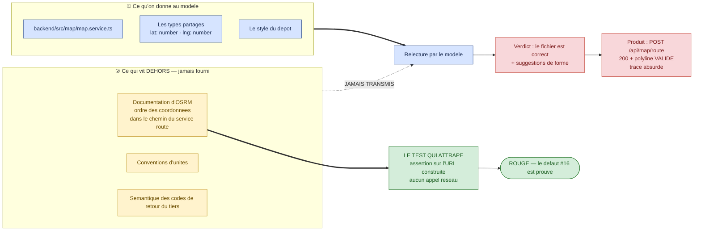
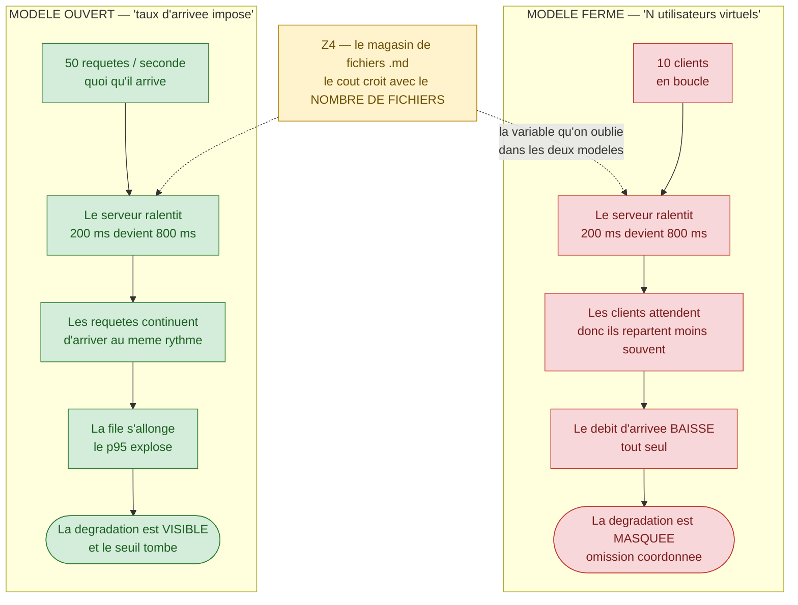
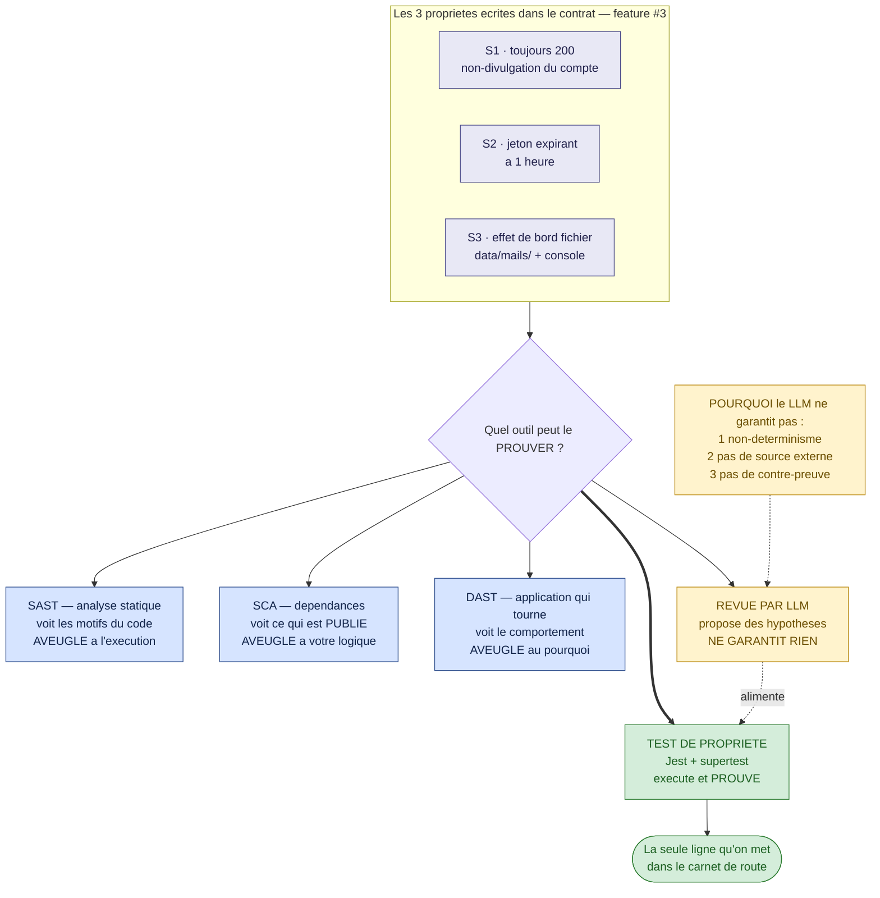
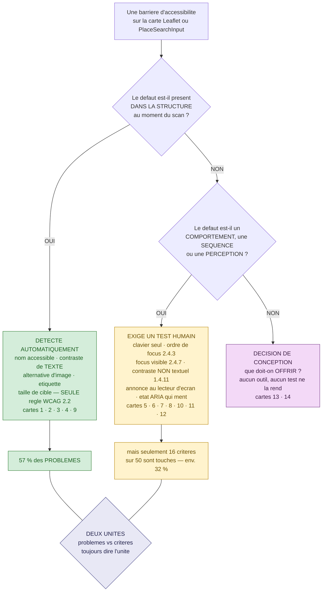

# Module M7 — « Ce que l'IA ne voit pas »

> **Jour 4 · matin · 160 min de notions + 20 min de QCM long · 4 notions**
> *Promesse au participant : « À la fin de ce module, vous saurez couvrir ce qui fait vraiment
> tomber la production — la charge, la faille et l'utilisateur qu'on n'avait pas prévu — et vous
> saurez nommer, sur votre propre produit, ce qu'aucune relecture de code ne donnera jamais. »*

**Document formateur.** Il se déroule tel quel en séance. Les encadrés 🔐 ne sont jamais projetés.
Référence de vérité du terrain : `00-carte-du-terrain.md`. Contrat d'écriture : `00-gabarit-notion.md`.

> ⚠️ **Avertissement de fraîcheur — à répercuter en séance, une fois, à l'ouverture du module.**
> Ce module est celui dont le contenu périme le plus vite. Cinq faits sont **à jour au 07/2026** et
> doivent être revérifiés avant chaque session :
> 1. **L'OWASP Top 10:2025 est publié** — 8ᵉ édition — et **toute la numérotation a changé**.
>    *Injection* est passée de A03:2021 à **A05:2025** ; *Security Misconfiguration* de A05 à
>    **A02** ; *Cryptographic Failures* de A02 à **A04** ; *Insecure Design* de A04 à **A06**. Deux
>    catégories sont nouvelles : **A03:2025 Software Supply Chain Failures** et **A10:2025
>    Mishandling of Exceptional Conditions**. Et le **SSRF n'existe plus comme catégorie
>    autonome** : il a été absorbé dans A01:2025. **Ne jamais dire « A03, c'est l'injection » sans
>    préciser l'année.**
> 2. **OWASP ASVS est en v5.0.0** depuis le 30 mai 2025 (plus 4.0.3) : les identifiants
>    d'exigences ont changé, et se préfixent désormais `v5.0.0-`.
> 3. **Le référentiel RGAA courant est la version 4.1.2**, pas 4.1. Le **RGAA 5 est annoncé pour
>    fin 2026** ; il désignera l'Arcom comme autorité de contrôle et intégrera WCAG 2.2. En
>    attendant, **la norme opposable en France reste WCAG 2.1 AA**.
> 4. **`axe-core` ne couvre qu'une seule règle WCAG 2.2** (`target-size`) sur les 105 règles de son
>    catalogue. Un pipeline « axe vert » ne dit **rien** de la conformité 2.2.
> 5. **`temperature = 0` n'est pas le déterminisme.** Sur mille complétions à température 0, un
>    modèle ouvert a produit **80 complétions uniques** ; et sur les modèles récents, `temperature`,
>    `top_p` et `top_k` sont dépréciés et renvoient une **erreur 400**. Ce module s'appuie sur cette
>    limite : c'est elle qui interdit à un LLM d'être un oracle de sécurité.

---

## 0. Carte du module

### 0.1 Objectif terminal

> À l'issue de M7, le·a participant·e est capable de **nommer et de traiter ce qu'une analyse par
> modèle de langage ne peut pas produire** : un défaut dont le savoir est externe, un comportement
> qui n'apparaît que sous charge, une propriété de sécurité qui se prouve par exécution, et une
> barrière d'accessibilité qu'aucun outil automatique ne détecte.

C'est le seul objectif terminal du module. Tout le reste y concourt.

### 0.2 Position dans le fil rouge — *L'Expédition*, 🏔️ le sommet

| | |
|---|---|
| **Ce qui existe avant M7** | Trois jours de travail sur le **fonctionnel**. Les cordées savent lire un test, en écrire, en faire écrire, en industrialiser l'exécution et en classer les échecs. Le col J3 a laissé un post-mortem, une suite dont plus aucun échec n'est inexpliqué, et une liste de dettes ouvertes. Ce qui n'a **jamais** été regardé : ce que le produit fait sous charge, ce qu'il fait quand on l'attaque, et ce qu'il fait quand l'utilisateur n'a pas de souris. |
| **Ce qui existe après M7** | Le groupe a vu, en direct, **un défaut réel que l'IA valide** — l'inversion de coordonnées vers OSRM — et sait dire pourquoi. Chaque participant a écrit un **scénario de charge** sur le magasin de fichiers, avec ses seuils et l'énoncé honnête de ce que l'outil ne mesure pas. Le groupe sait situer une **revue par LLM** parmi les autres outils de sécurité, et a écrit trois propriétés de sécurité **testables** sur la récupération de mot de passe. Enfin, chaque cordée a trié ce qu'`axe` détecte de ce qui exige un humain sur la carte Leaflet. Le module M8 peut alors demander de prioriser par le risque : le risque est enfin instruit. |
| **Ce que M7 ne fait pas** | On ne priorise pas l'effort de test sur les six zones : c'est **M8.1**. On ne rédige pas le carnet de route : c'est le col J4. On n'audite pas la conformité : le module donne le cadre légal et les seuils, pas une prestation d'audit. |

### 0.3 Les quatre notions

| # | Notion | Modalité (critère) | Durée | Terrain | Micro-évaluation |
|---|---|---|---|---|---|
| **M7.1** | Le pari : l'IA trouve-t-elle cette faille ? | **JEU — Le Pari** (`D-3`) | 35 | **Z5** 🔴 **défaut #16** — inversion `lat/lng` vers OSRM | Exercice court (4 min) |
| **M7.2** | Modéliser une charge réaliste | **SOLO** (`C-1`) | 45 | **Z4** — le magasin de fichiers `.md` sous charge de lecture | Exercice court (5 min) |
| **M7.3** | Sécurité : ce que le LLM ne peut pas garantir | **DESC** + diagramme (`A-2`) | 40 | **Z1** ⚪ feature #3 — jeton de reset, expiration 1 h, non-divulgation | QCM éclair (3 q.) |
| **M7.4** | Ce qu'`axe` voit — et ne voit pas — sur une carte | **GRP** (`B-1`) | 40 | **Z6** ⚪ feature #15 — Leaflet et `PlaceSearchInput` | Exercice court (4 min) |

**Rythme** — JEU · SOLO · DESC · GRP : aucun doublon consécutif (`R-1` ✓) · première séquence de
la journée **non descendante** (`R-6` ✓ — on ouvre sur un pari) · un jeu sérieux dans la
demi-journée (`R-3` ✓) · aucune ligne descendante de plus de 12 min sans interaction (`R-5` ✓) ·
clôture sur une victoire mesurable (`R-8` ✓).

> **Note de conception sur l'ancrage de M7.1.** La fiche du module dans
> `00-architecture-28h.md` situait initialement M7.1 en zone **Z1**. La table de traçabilité de
> `00-carte-du-terrain.md` §7 — qui est **l'oracle du formateur** et prévaut sur les documents
> antérieurs — l'ancre en **Z5** sur le défaut **#16**. C'est cet ancrage qui est retenu ici, et
> il est le bon pour une raison technique : le défaut #16 est le **seul** du dépôt qui exige une
> **documentation extérieure au dépôt** pour être vu. Les angles morts de Z1 restent traités, mais
> en M7.3, où ils sont à leur place.

### 0.4 Minutage de la demi-journée

| Créneau | Séquence | Durée | Cumul |
|---|---|---|---|
| 09:00 → 09:15 | **Le Brief** — score de la veille, corrigé express du col J3, l'étape du jour | 15 | 15 |
| 09:15 → 09:50 | **M7.1** — Le pari : l'IA trouve-t-elle cette faille ? | 35 | 50 |
| 09:50 → 10:35 | **M7.2** — Modéliser une charge réaliste | 45 | 95 |
| 10:35 → 10:50 | **Pause** | 15 | 110 |
| 10:50 → 11:30 | **M7.3** — Sécurité : ce que le LLM ne peut pas garantir | 40 | 150 |
| 11:30 → 12:10 | **M7.4** — Ce qu'`axe` voit sur une carte | 40 | 190 |
| 12:10 → 12:30 | **QCM long M7** — 15 questions, correction commentée | 20 | 210 |

**Contrôle** : 15 + 35 + 45 + 15 + 40 + 40 + 20 = **210 min** ✓ (matin conforme à
`00-architecture-28h.md` §2).

**Contrôle des notions** : 35 + 45 + 40 + 40 = **160 min** ✓

### 0.5 Points de Repère mobilisables sur le module

| Source | Gain |
|---|---|
| Jeu M7.1 — cordée ayant annoncé le bon pari **avec la source citée** | 15 PR |
| Micro-évaluation M7.1 réussie | 10 PR |
| Micro-évaluation M7.2 réussie | 10 PR |
| Micro-évaluation M7.3 (QCM éclair 3/3) | 10 PR |
| Jeu M7.4 — cordée ayant le plus de cartes justes | 15 PR |
| Micro-évaluation M7.4 réussie | 10 PR |
| Badge ♿ **L'Hospitalier** — zéro violation `axe` critique sur un parcours complet | 10 PR |
| **QCM long M7** — au prorata | 0 à 50 PR |
| **Total maximal du module** | **130 PR** |

### 0.6 Préparation matérielle — la veille

| Vérification | Commande / geste | Attendu |
|---|---|---|
| Le back démarre et répond | démarrage du backend NestJS | `http://localhost:3000/api` répond |
| Le front démarre | démarrage du front Vite | `http://localhost:5173` s'affiche, la carte se charge |
| La route d'itinéraire répond | un `POST /api/map/route` avec deux points | 200 avec une polyline — **valide en apparence** |
| **La page de documentation d'OSRM est ouverte dans un onglet** | relever l'URL de la page décrivant le format d'appel du service `route` | le format `{coordonnée};{coordonnée}` et l'**ordre** y sont écrits noir sur blanc |
| **La sortie de secours de M7.1 est enregistrée** | soumettre `backend/src/map/map.service.ts` à une relecture par LLM la veille, et **conserver la réponse** | l'IA valide le fichier — c'est la révélation du jeu |
| Un jeu de données de volume existe | générer N voyages dans le magasin, avec une graine fixée | le magasin contient assez de fichiers `.md` pour que la charge soit observable |
| L'outil de charge est installé | `npx autocannon --version` | répond ; à défaut, prévoir `k6` en repli |
| `@axe-core/playwright` est installé | `npx playwright test --list` sur le fichier d'accessibilité | la dépendance est résolue |
| Les 14 cartes de M7.4 sont imprimées | 1 jeu par cordée | découpées, mélangées |
| Un lecteur d'écran est disponible sur au moins un poste | démonstration de M7.4 | le formateur sait le lancer et l'arrêter |

🔐 **Réservé formateur.** `grep -rn "BUG:" backend/src` localise les six défauts, dont le #16 dans
`backend/src/map/map.service.ts`. Elle a été révélée au débrief du col J1 et **reste irrecevable
comme preuve**. Surtout : **elle ne doit pas être utilisée dans M7.1**, où tout l'intérêt du jeu
est que le défaut soit trouvé **par confrontation à une source externe**, pas par un marqueur du
code. Si un participant la lance pendant le jeu, l'accueillir et retourner l'argument : *« vous
venez de lire une déclaration de l'auteur du bug. Montrez-moi maintenant ce qui, hors de ce dépôt,
prouve qu'il a raison. »*

---

## 1. Notion M7.1 — « Le pari : l'IA trouve-t-elle cette faille ? »

|  |  |
|---|---|
| **Durée** | 35 min |
| **Modalité** | Jeu sérieux — **Le Pari** |
| **Objectif d'apprentissage** | À l'issue, le·a participant·e est capable de **nommer la classe de défauts qu'une relecture par LLM ne peut pas détecter** — ceux dont l'oracle est une documentation extérieure au dépôt — et de **construire le test qui, lui, les attrape** |
| **Niveau visé (Bloom)** | **Analyser** |
| **Micro-évaluation** | Exercice court (4 min) |
| **Ancrage fil rouge** | **Z5 — Le monde extérieur** · 🔴 **défaut #16**, `backend/src/map/map.service.ts`, feature #16 *Carte — itinéraire*. *Pourquoi ce terrain : c'est le seul défaut du dépôt qui soit **invisible depuis le dépôt**. Le service envoie les coordonnées à OSRM dans l'ordre `lat,lng` là où le service attend `lng,lat`. Rien, dans le code, ne dit qui a raison : le type est cohérent, les variables sont bien nommées, l'API répond **200 avec une polyline valide**. Le tracé est absurde et le système ne s'en aperçoit pas. La seule source qui tranche est la **documentation d'OSRM**, et elle n'est pas dans le contexte. Demandez à un LLM de relire ce fichier : **il le valide.** C'est la démonstration la plus nette de la formation.* Ce que la notion fait avancer : la carte des risques du carnet de route du col J4, et la ligne « ce que l'IA a fait, ce que l'humain a validé » du tableau de traçabilité. |
| **Prérequis** | M1.4 *(les cinq oracles admissibles et les trois interdits)*. Le troisième oracle interdit — *« ce que le LLM juge probable »* — trouve ici sa démonstration. |

### ▸ Pourquoi cette modalité

L'objectif est de **découvrir par soi-même une limite technique**, donc critère `D-3` de
`00-grille-modalites.md` : *« une limite annoncée est une croyance. Une limite rencontrée est un
savoir. »* Dire à une salle que « les LLM ont des angles morts » produit un hochement de tête et
zéro changement de pratique. Le mécanisme du **Pari** ajoute ce que la simple démonstration ne
donne pas : **l'engagement public avant le résultat**. Une salle qui a parié par écrit que l'IA
allait trouver le défaut, et qui la voit valider le fichier, se souvient de l'écart pendant des
mois. Et le retournement final — l'ouverture de la documentation du tiers — transforme la
déception en méthode : *ce n'est pas que le modèle est mauvais, c'est que la réponse n'était pas
dans ce qu'on lui a donné.* C'est aussi la première séquence de la journée : la règle `R-6`
interdit d'ouvrir sur du descendant, et un pari ouvre plus vite qu'un chiffre.

### ▸ Ce qu'il faut avoir compris à la fin

- **Un LLM ne peut pas être un oracle indépendant du code qu'on lui donne.** Il ne dispose que du
  contexte fourni ; ce qui n'y est pas n'existe pas pour lui.
- **Il existe une classe entière de défauts dont l'oracle est hors du dépôt** : les contrats de
  services tiers, les unités, les ordres d'arguments, les fuseaux, les encodages. Aucune relecture
  de code ne les donne, quelle que soit sa qualité.
- **Un système peut répondre 200 avec une valeur parfaitement bien formée et parfaitement fausse.**
  L'absence d'erreur n'est pas un signal de correction.
- **La parade n'est pas un meilleur prompt : c'est un meilleur contexte.** Fournir la
  documentation du tiers change la réponse — et c'est le seul geste qui la change.
- **Le test qui attrape ce défaut n'est pas un test d'intégration**, c'est un test qui **assertit
  l'URL construite** avant l'appel. Il coûte quelques lignes et il ne dépend d'aucun réseau.

### ▸ Déroulé minuté

> Le protocole du **Pari** est appliqué strictement : ① la mise · ② l'épreuve · ③ la révélation ·
> ④ le nom · ⑤ la parade. Les numéros sont rappelés en tête de ligne.

| Temps | Le formateur | Les participants |
|---|---|---|
| **0-5** *(5)* | **① LA MISE.** Aucune introduction. Projette trois choses et rien d'autre : la ligne du contrat, §Map — *« `POST /api/map/route`, Body: `{ points: Array<{ lat, lng }> }`, 200 → `{ coordinates: Array<[lat, lng]> }` »* — la sortie réelle d'un appel (200, une polyline), et le fichier `backend/src/map/map.service.ts` à l'écran. « Cette fonctionnalité n'a **aucun test**. Vous allez la faire relire par une IA. Pariez maintenant, par écrit, sur ce qu'elle va répondre. » Distribue la carte de pari. | Lisent le code et le contrat. Remplissent la carte de pari : quatre propositions, VRAI ou FAUX, plus un niveau de confiance sur 5. La cordée qui veut « juste lancer l'IA d'abord » se voit refuser : **le pari précède l'épreuve, toujours.** |
| **5-8** *(3)* | **LES MISES AU TABLEAU.** Fait annoncer chaque cordée à voix haute, écrit les quatre colonnes avec les niveaux de confiance. **Ne commente rien.** « Personne ne change d'avis ? Dernière chance. » | Annoncent. La salle converge sur **P1** — *« l'IA trouvera un problème dans ce fichier »* — avec une confiance élevée. C'est exactement le pari qu'elle va perdre. |
| **8-16** *(8)* | **② L'ÉPREUVE.** Chaque cordée soumet **elle-même** le fichier à relecture, avec **son propre prompt**. Consigne stricte, répétée en circulant : *« vous ne lui donnez que le fichier. Pas le contrat, pas la documentation d'OSRM, rien d'autre. »* Relance unique à 5 min : **« demandez-lui explicitement s'il y a un bug. »** | Soumettent le fichier, lisent la réponse. Découvrent que le modèle **valide** — ou propose des améliorations cosmétiques : nommage, gestion d'erreur, typage. Aucun ne nomme l'inversion. Une cordée insiste, reformule, obtient la même chose. |
| **16-21** *(5)* | **③ LA RÉVÉLATION.** Ne discourt pas : **ouvre la documentation d'OSRM** à l'écran, sur la page qui décrit le format d'appel du service `route`, et lit à voix haute l'ordre attendu des coordonnées. Puis revient au fichier et met les deux côte à côte. Se tait cinq secondes. Dit ensuite, mot pour mot : « **Le modèle n'a pas échoué. Il a répondu exactement à la question qu'on lui a posée, avec exactement ce qu'on lui a donné. Ce qui manquait, c'est cette page-là.** » | Regardent. Font le rapprochement. La réaction attendue tombe : *« mais alors il aurait fallu lui donner la doc ? »* — c'est la parade, et elle vient d'eux. |
| **21-24** *(3)* | **④ LE NOM.** Écrit trois mots au tableau et les relie au moment vécu : **savoir externe** (la nature du défaut), **oracle non indépendant** (la raison de l'échec de la relecture), **échec silencieux** (la forme : 200 et une polyline valide). Demande : « lequel des trois est le plus dangereux en production ? » | Répondent, et se divisent. La bonne réponse — **l'échec silencieux** — se justifie ainsi : les deux autres se corrigent par la méthode, celui-là ne se voit jamais. |
| **24-28** *(4)* | **⑤ LA PARADE.** Deux gestes, construits avec la salle. ① **Changer le contexte** : resoumettre le même fichier **avec** l'extrait de documentation, et montrer que la réponse change. ② **Écrire le test** qui assertit l'URL construite, sans réseau (voir §Contenu). Fait écrire les deux dans le carnet de cordée. | Resoumettent avec le contexte enrichi, constatent le changement de réponse. Recopient le squelette du test. |
| **28-32** *(4)* | **MICRO-ÉVALUATION.** Projette l'énoncé, chronomètre 3 min, corrige en 1 min. Annonce les 15 PR à la cordée ayant le plus de paris justes **avec la source citée**. | Font l'exercice court en cordée. Comptent leurs paris. |
| **32-35** *(3)* | **SYNTHÈSE — la parole est aux participants.** « En une phrase, sans vos notes : quelle question poserez-vous, lundi, avant de faire relire un fichier par une IA ? » Fait parler deux cordées, n'ajoute rien, enchaîne sur M7.2. | Formulent. Réponse attendue : *« est-ce que la réponse est dans ce que je lui donne — ou est-ce qu'elle est dans une documentation que je ne lui ai pas fournie ? »* |

**Contrôle : 5 + 3 + 8 + 5 + 3 + 4 + 4 + 3 = 35 min ✓**

### ▸ 🎴 La carte de pari — à imprimer, une par cordée

```
CORDÉE : ..................     LE PARI — feature #16, l'itinéraire sur la carte

                                                            VRAI / FAUX   Confiance /5
P1  Soumis SEUL à une relecture, ce fichier sera signalé
    comme contenant un bug fonctionnel.                        [   ]         [   ]
P2  Si l'IA propose des améliorations, elles porteront
    sur la forme (nommage, erreurs, typage).                    [   ]         [   ]
P3  L'API répond 200 et renvoie une polyline valide,
    même quand le tracé est absurde.                            [   ]         [   ]
P4  En donnant à l'IA la documentation du service tiers
    EN PLUS du fichier, sa réponse changera.                    [   ]         [   ]

La source que nous citerions pour trancher ce fichier :
.......................................................................
```

> 🔐 **Le dépouillement, à la minute 16.** P1 : **FAUX** — c'est le pari que la salle perd.
> P2 : **VRAI** — le modèle produit du commentaire de forme, pas de fond. P3 : **VRAI** —
> et c'est ce qui rend le défaut silencieux à trois niveaux : pas d'exception, pas de code
> d'erreur, pas de test rouge. P4 : **VRAI** — et c'est toute la parade. Une cordée qui a coché
> les quatre bonnes cases **et** cité la documentation d'OSRM dans la dernière ligne gagne le jeu,
> quel que soit le reste.

### ▸ Contenu à transmettre

**1. Le fait.** La feature #16 — *Carte, itinéraire entre destinations* — n'a **aucun test**. Le
service `backend/src/map/map.service.ts` construit l'URL du proxy vers OSRM à partir des points
reçus. Le contrat le dit en toutes lettres, §Map : *« Body: `{ points: Array<{ lat, lng }> }`
(dans l'ordre de visite) · Proxy vers OSRM (`https://router.project-osrm.org/route/v1/driving/...`)
· 200 → `{ coordinates: Array<[lat, lng]> }` »* — et il ajoute, comme un avertissement à qui sait
le lire : *« attention à l'ordre `lng,lat` attendu par OSRM en interne »*.

**2. Pourquoi aucune relecture ne le donne.** Trois raisons, cumulées :

| Raison | Ce qu'elle produit |
|---|---|
| **Le code est cohérent avec lui-même** | Les variables s'appellent `lat` et `lng`, elles contiennent bien une latitude et une longitude. Il n'y a **aucune incohérence interne** à détecter. |
| **Le type est satisfait** | `{ lat: number; lng: number }` est respecté de bout en bout. Un vérificateur de types ne dira rien. |
| **La sortie est bien formée** | Le service tiers répond **200** avec une polyline **syntaxiquement valide**. Elle trace un itinéraire — au mauvais endroit du globe. |

> À dire tel quel : *« il n'y a rien à trouver dans ce fichier. Le défaut n'est pas dans le
> fichier : il est dans **l'écart entre ce fichier et un document qui vit ailleurs**. »*

**3. La classe de défauts, et pourquoi elle mérite un nom.** L'inversion de coordonnées n'est pas
un cas isolé : c'est un **représentant** d'une famille dont l'oracle est toujours extérieur.

| Famille | Exemple courant | Où vit l'oracle |
|---|---|---|
| **Ordre d'arguments d'un tiers** | `lng,lat` contre `lat,lng` | La documentation du service |
| **Unité** | mètres contre kilomètres, secondes contre millisecondes | La documentation, ou une norme |
| **Fuseau et format de date** | date locale contre UTC | La spécification d'échange |
| **Sémantique d'un code de retour** | ce que le tiers appelle « 200 avec résultat vide » | La documentation du tiers |

Toutes ont la même signature : **le système ne lève rien**. Elles ne se détectent ni par relecture,
ni par vérification de types, ni par test d'intégration naïf — seulement en **confrontant le code
à une source externe**.

**4. La parade — deux gestes, dans cet ordre.**

- **Geste 1 — changer le contexte, pas le prompt.** Resoumettre le même fichier avec l'extrait de
  documentation du tiers **dans le contexte**. La réponse change. C'est la démonstration
  opérationnelle du principe posé en M1.4 : *un LLM ne peut pas être un oracle indépendant, mais
  il peut **transporter** un oracle qu'on lui fournit.*
- **Geste 2 — écrire le test qui assertit l'URL construite.** Il ne teste pas OSRM : il teste
  **notre** construction. Il ne fait aucun appel réseau, il est instantané, et il tombe le jour où
  quelqu'un réinverse.

```ts
// backend/src/map/map.service.spec.ts — fichier à créer (nom proposé)
// L'oracle N'EST PAS le code : c'est la documentation d'OSRM sur l'ordre
// des coordonnées dans le chemin du service `route`.
// Le double n'existe QUE pour capturer l'URL construite : on ne teste pas
// le tiers, on teste ce qu'on lui envoie.
it('envoie les coordonnées à OSRM dans l’ordre attendu par le service', async () => {
  const appels: string[] = [];
  const clientHttp = { get: jest.fn(async (url: string) => { appels.push(url); return reponseOsrmDeReference; }) };

  await service.route([
    { lat: 64.1466, lng: -21.9426 },   // Reykjavik
    { lat: 64.3104, lng: -20.3024 },   // Haukadalur
  ]);

  // La longitude vient AVANT la latitude, pour chaque point.
  expect(appels[0]).toContain('-21.9426,64.1466;-20.3024,64.3104');
  // ← ROUGE avec le défaut #16 : le service envoie '64.1466,-21.9426;…'
});
```

**5. Ce que le module en tire pour le carnet de route.** Une ligne du tableau de traçabilité du
col J4 se remplit ici : *« relecture par IA → aucun défaut signalé → défaut réel présent → détecté
par confrontation à la documentation du tiers. »*

**6. La phrase à faire noter.**

> *Une IA ne trouve pas ce qui n'est pas dans son contexte. La question n'est donc jamais
> « est-ce qu'elle est bonne ? », mais **« est-ce que je lui ai donné la source qui tranche ? »***

*(≈ 590 mots — plafond du gabarit : 700)*

### ▸ 🖼️ Diagramme — `diagrammes/M7-1-le-savoir-qui-manque.svg`

#### Source Mermaid



#### Descriptif du SVG à produire

Format paysage 1600 × 900. Deux cadres en haut, de largeur égale, séparés par un **fossé blanc
franc** de 80 pixels — le vide au milieu du schéma est l'information principale et il ne doit pas
être comblé. À gauche, cadre bleu **« ① Ce qu'on donne au modèle »** contenant trois pastilles ;
à droite, cadre jaune **« ② Ce qui vit dehors — jamais fourni »** contenant trois pastilles, dont
la première, *documentation d'OSRM*, est en gras et sur deux lignes. Du cadre bleu part une
**flèche épaisse pleine** vers un rectangle central « relecture par le modèle » ; du cadre jaune
part une **flèche fine, pointillée, barrée d'une croix**, légendée en capitales *« JAMAIS
TRANSMIS »*. Sous le rectangle central, en rouge, deux blocs enchaînés : le verdict (« le fichier
est correct ») et son effet en production (« 200 + polyline valide, tracé absurde »). En bas à
droite, isolé et **vert**, un bloc « le test qui attrape » relié **directement à la pastille de
documentation d'OSRM** par une seconde flèche épaisse — c'est le seul chemin du schéma qui part de
la droite, et il doit sauter aux yeux. Il aboutit à une pastille verte : *« ROUGE — le défaut #16
est prouvé »*. L'inversion de couleur — rouge pour le verdict favorable, vert pour l'échec du test
— est **volontaire** et reprend celle du diagramme de M1.4.

#### Explication du diagramme — notice de dévoilement

| Ordre | Ce qu'on affiche | La phrase à dire | Erreur à prévenir |
|---|---|---|---|
| 1 | **Le cadre bleu seul** | « Voilà tout ce que vous lui avez donné ce matin. Trois choses, et elles sont cohérentes entre elles. » | Ne pas afficher la droite. Le vide doit être ressenti avant d'être nommé. |
| 2 | **Le rectangle central et les deux blocs rouges** | « Et voilà ce qu'il a répondu, et ce que ça donne en production. Deux cent, une polyline valide, et un itinéraire qui traverse l'océan Indien. » | Ne pas dire que le modèle « s'est trompé ». Il a répondu juste à la question posée. |
| 3 | **Le cadre jaune de droite, et la flèche barrée** | « Et voilà ce qui n'est jamais entré. Regardez la première ligne. C'est une page web publique, gratuite, indexée. Elle était à trente secondes de vous. » | C'est le moment le plus important du schéma. Marquer un temps d'arrêt de cinq secondes. |
| 4 | **La flèche épaisse de droite vers le bloc vert** | « Et voilà le seul chemin qui marche. Il ne part pas du code : il part d'un document. » | Erreur à prévenir : croire qu'il faut « un meilleur modèle ». C'est un problème de **source**, pas de capacité. |
| 5 | **La pastille verte finale** | « Rouge. Et c'est la bonne nouvelle de la journée — la même qu'au premier matin. » | Faire le lien explicite avec M1.4 : le rouge accuse le code quand l'oracle est admissible. |

⚠️ **Erreur d'interprétation à prévenir.** La salle conclura volontiers *« donc l'IA est
inutile en revue »*. Le désamorcer à l'étape 4, sans nuance excessive : *« elle est inutile comme
**juge**. Elle est excellente comme **transporteur** : donnez-lui la page de documentation, et elle
vous écrit le test en trente secondes. Ce qui ne se délègue pas, c'est de savoir **quelle page
aller chercher**. »* Sans cette phrase, la notion produit du renoncement au lieu d'une méthode.

### ▸ 🔍 Démonstration — le même fichier, deux contextes

**Point de départ.** `backend/src/map/map.service.ts` ouvert à l'écran. Aucun test n'existe sur
cette fonctionnalité. Le backend est démarré.

**Le geste exact.** Trois temps, enchaînés sans commentaire entre eux.

*Temps 1 — le produit répond, et il a l'air content.*

```bash
TOKEN=$(curl -s -X POST http://localhost:3000/api/auth/login \
  -H 'Content-Type: application/json' \
  -d '{"email":"expedition@example.com","password":"Boussole2026!"}' | jq -r .accessToken)

curl -s -X POST http://localhost:3000/api/map/route \
  -H "Authorization: Bearer $TOKEN" -H 'Content-Type: application/json' \
  -d '{"points":[{"lat":64.1466,"lng":-21.9426},{"lat":64.3104,"lng":-20.3024}]}' \
  | jq '{statut: "200", nb_points: (.coordinates | length)}'
```

Le service répond **200**, avec une polyline non vide. À dire : *« aucune erreur. Aucun
avertissement. Le produit est content. »*

*Temps 2 — la relecture, contexte nu.* Prompt volontairement dépouillé, tel qu'on le tape
vraiment :

> `Relis backend/src/map/map.service.ts et dis-moi s'il contient un bug.`

**Le résultat obtenu** *(forme typique, à confronter à ce que produit la séance)* : le modèle
valide la logique et propose des améliorations **de forme** — extraire une constante d'URL,
ajouter la gestion des erreurs réseau, typer explicitement la réponse. **Aucune mention de l'ordre
des coordonnées.**

*Temps 3 — la relecture, contexte enrichi.* Même fichier, même modèle, une phrase de plus :

> `Voici en plus l'extrait de la documentation d'OSRM décrivant le format d'appel du service route
> et l'ordre attendu des coordonnées. Compare-le à ce fichier.`

**Le résultat obtenu.** Le défaut est nommé immédiatement, et souvent accompagné du correctif.

**Ce que l'exemple révèle.** Le modèle n'a pas changé entre le temps 2 et le temps 3. Le prompt a
à peine changé. **Ce qui a changé, c'est la présence de l'oracle dans le contexte.** C'est la
formulation opérationnelle de la règle de M1.4 : un LLM ne peut pas être un oracle indépendant,
mais il transporte parfaitement un oracle qu'on lui fournit. La compétence à emporter n'est donc
pas « savoir prompter » : c'est **savoir quelle source manque**.

**Ce qui peut rater, et le repli associé.**

| Risque | Signe | Repli |
|---|---|---|
| **Le modèle trouve le défaut au temps 2** | il mentionne l'ordre des coordonnées sans qu'on lui ait donné la doc | **Le dire, et en faire un enseignement de variabilité** : *« aujourd'hui, il l'a vu. Relancez-le : vous n'aurez pas la même réponse. Une détection non reproductible n'est pas une détection — c'est M1.3, et c'est pourquoi on écrit un test. »* Puis projeter la sortie enregistrée la veille (§0.6). |
| Le modèle produit une réponse très longue | la salle perd le fil | Ne lire à voix haute que les intertitres de la réponse. Ce qui compte est l'**absence** d'un point, pas la richesse du reste. |
| Pas de réseau ou quota atteint | la relecture échoue | Projeter la sortie enregistrée la veille — c'est une vérification de préparation, §0.6. |
| Un participant lance `grep BUG:` | il annonce le défaut à voix haute | L'accueillir et retourner l'argument : *« vous venez de lire une déclaration de l'auteur du bug. Montrez-moi maintenant ce qui, hors de ce dépôt, prouve qu'il a raison. »* |
| OSRM est indisponible | le temps 1 échoue | La démonstration tient quand même : c'est la **construction de l'URL** qui est en cause, pas la réponse. Montrer l'URL construite dans les journaux du backend. |

### ▸ ✅ Micro-évaluation — Exercice court (4 min)

**Énoncé** *(trois lignes, projeté et distribué)*

> Voici quatre défauts possibles. Pour chacun : une relecture par LLM du **seul fichier concerné**
> peut-elle le détecter — **oui**, **non**, ou **peut-être** — et **quelle source** trancherait ?

| # | Le défaut |
|---|---|
| **A** | Une variable est utilisée avant d'être affectée dans une branche conditionnelle. |
| **B** | Les coordonnées sont envoyées à un service tiers dans un ordre inversé par rapport à ce qu'il attend. |
| **C** | Une durée est passée en secondes à une fonction qui attend des millisecondes. |
| **D** | Une méthode de 200 lignes fait quatre choses différentes. |

**Résultat attendu vérifiable** *(cases à cocher, contrôle en moins de 60 secondes)*

- [ ] **A → oui.** Incohérence **interne** au fichier. Source : le fichier lui-même. C'est le
      terrain naturel d'une relecture automatique.
- [ ] **B → non.** Savoir **externe**. Source : la documentation du service tiers.
- [ ] **C → non** *(« peut-être » accepté si la justification cite une convention de nommage
      explicite dans le fichier)*. Savoir externe. Source : la signature documentée de la fonction
      appelée.
- [ ] **D → oui.** Propriété **structurelle**, entièrement visible dans le fichier. C'est même ce
      que les relectures automatiques signalent le plus volontiers.

**Solution de référence** — A : oui · B : non · C : non · D : oui.
**Le critère qui trie les quatre en une phrase** : *l'information qui tranche est-elle dans le
fichier, ou ailleurs ?*

**L'erreur que 80 % des groupes commettent.** Répondre **« non » à D**, par sur-correction après
la révélation du jeu : la salle vient de voir l'IA échouer, elle en conclut qu'elle échoue
partout. C'est aussi coûteux que la naïveté du départ, et cela conduit à se priver de l'outil là
où il excelle. La règle à énoncer en trente secondes : **l'IA est excellente sur ce qui est
observable dans ce qu'on lui donne, et aveugle sur le reste.** Le travail humain n'est pas de
relire à sa place : c'est de **décider quelle source ajouter au contexte**.

### ▸ 🔗 Ressources

| Ressource | À qui elle s'adresse | Ce qu'il faut y lire précisément |
|---|---|---|
| *Documentation du service `route` d'OSRM* — ⚠️ **URL à relever et à vérifier la veille** : elle n'a pas été vérifiée dans le dossier de sources de la formation. Le point d'entrée du service utilisé par le dépôt est `https://router.project-osrm.org/route/v1/driving/…`, tel que `docs/API-CONTRACT.md` §Map le déclare. | **La référence de la notion** | Le format exact du chemin d'appel et **l'ordre des coordonnées**. C'est la page qu'on ouvre à la minute 16, et c'est l'oracle de tout le jeu. |
| *ISTQB Glossary — « test oracle »* — https://glossary.istqb.org/en_US/term/oracle | La référence normative | *« a source to determine expected results […] but should not be the code »*. La notion en est l'illustration extrême : ici, l'oracle n'est même pas dans le **dépôt**. |
| *Design choices made by LLM-based test generators prevent them from finding bugs* — https://arxiv.org/abs/2412.14137 | Celui qui doit convaincre son équipe | Le résultat central, déjà vu en M1.1 : confrontés à du code bogué, les générateurs produisent des tests qui **valident le bug**. La notion M7.1 en montre la version *revue de code*. |
| *Non-Determinism of "Deterministic" LLM Settings* — https://arxiv.org/abs/2408.04667 | Celui qui a vu le modèle trouver le défaut | Sur **5 LLM, 8 tâches et 10 exécutions** en configuration « déterministe » : jusqu'à **15 %** de variation d'exactitude. Une détection réussie une fois n'est pas une détection. |
| *Defeating Nondeterminism in LLM Inference* — https://thinkingmachines.ai/blog/defeating-nondeterminism-in-llm-inference | Le curieux | **1000 complétions à température 0 → 80 complétions uniques**, identiques sur les 102 premiers jetons puis divergentes. La cause n'est pas « concurrence et flottants » mais la **non-invariance au lot**. |
| *A Survey on Hallucination in Large Language Models* — https://arxiv.org/abs/2311.05232 | Celui qui veut le vocabulaire exact | La distinction entre hallucinations **factuelles** et hallucinations **de fidélité**. Le cas de M7.1 n'est **ni l'une ni l'autre** : c'est une **omission par absence de source**, et il vaut la peine de le nommer correctement. |

### ▸ ⚠️ Pièges d'animation

- **Ce qui rate habituellement** : une cordée donne le contrat au modèle dès le temps 2, et le
  modèle s'en sort mieux. La consigne est donc explicite **avant** le départ, et répétée en
  circulant : *« le fichier, rien que le fichier. »* Si cela arrive quand même, en faire un
  résultat : *« vous avez enrichi le contexte avant tout le monde. Vous venez de démontrer la
  parade avant la révélation — dites-nous ce que ça a changé. »*
- **La question qui revient toujours** : *« et si on lui donne accès à Internet ? »* Réponse
  courte : *« alors la question devient : est-ce qu'il ira chercher **cette** page-là ? Et vous ne
  le saurez qu'après. Un outil qui trouve parfois n'est pas un oracle — c'est M1.3, la sortie non
  reproductible ne rend pas de verdict. »* Ne pas ouvrir le débat sur les agents à outils : c'est
  M4.2, et il a eu lieu.
- **Le risque de démotivation** : la salle repart en pensant que rien n'est détectable. Le
  contre-feu se dit à l'étape ⑤, avant la micro-évaluation : *« sur les six défauts de ce dépôt,
  **un seul** appartient à cette classe. Les cinq autres sont attrapables par un test que vous
  savez écrire depuis mardi. »*
- **Le débat qui déraille** : quelqu'un voudra comparer les modèles entre eux — *« avec un autre,
  ça marcherait »*. Le couper en une phrase : *« peut-être, et ça ne change rien à la méthode :
  vous ne pouvez pas fonder une stratégie de test sur le fait qu'un modèle a bien voulu regarder
  au bon endroit ce jour-là. »* Vingt secondes, puis on avance.
- **Le signe qu'il faut passer à la suite** : dès qu'un participant demande spontanément *« quelle
  source manque ? »* devant un autre fichier du dépôt, la notion est acquise. Clore, même si le
  dépouillement du pari n'est pas terminé — la grille écrite part avec les participants.

---

## 2. Notion M7.2 — « Modéliser une charge réaliste »

|  |  |
|---|---|
| **Durée** | 45 min |
| **Modalité** | Exercice individuel au clavier, guidé |
| **Objectif d'apprentissage** | À l'issue, le·a participant·e est capable d'**écrire un scénario de charge exécutable sur ce projet** — modèle d'arrivée, durée, seuils bloquants exprimés en percentiles — et d'**énoncer ce que son outil ne mesure pas** |
| **Niveau visé (Bloom)** | **Appliquer** |
| **Micro-évaluation** | Exercice court (5 min) — un rapport de tir à critiquer |
| **Ancrage fil rouge** | **Z4 — Le magasin** · le dossier de fichiers `.md` relus par `gray-matter`, sollicité en **lecture** par `GET /api/journeys` et `GET /api/journeys/:id`. *Pourquoi ce terrain : parce que la « base de données » de ce produit est un **dossier de fichiers**, et que c'est le seul composant du dépôt dont le coût **croît avec le volume** de façon visible à l'œil nu. L'API NestJS répond vite tant qu'on la sollicite seule ; le magasin, lui, ouvre, lit et analyse un fichier par voyage. Un tir de charge sur la liste des voyages met en évidence un comportement de **stockage** — invisible en test unitaire, invisible en E2E, invisible dans une relecture de code. C'est le pendant exact de M7.1 : là, le savoir manquait dehors ; ici, il manque **sous charge**.* Ce que la notion fait avancer : la section « résultats non fonctionnels » du carnet de route du col J4, et la carte des risques sur la zone Z4. |
| **Prérequis** | M6.3 *(le budget d'un job de CI)* — la question « où fait-on tourner ce tir ? » se pose ici. |

### ▸ Pourquoi cette modalité

L'objectif est d'**exécuter un geste technique reproductible**, donc critère `C-1` de
`00-grille-modalites.md` : *« la compétence gestuelle est individuelle. En groupe, un seul
apprend. »* Écrire un scénario de charge est exactement ce type de geste : la théorie tient en
huit minutes, et tout se joue dans les vingt lignes que l'on tape. On peut suivre un exposé sur le
modèle d'arrivée pendant une heure et écrire, le lendemain, un tir à nombre d'utilisateurs fixe
qui ne mesure rien — c'est même le cas le plus fréquent en entreprise. La notion est donc bâtie
autour de **dix-huit minutes de clavier** encadrées par un cadrage court et une confrontation
courte. Elle suit un jeu (`R-1` respecté) et occupe la deuxième place de la matinée, quand
l'attention est encore haute et le clavier bienvenu.

### ▸ Ce qu'il faut avoir compris à la fin

- **Un tir « à N utilisateurs » ne mesure pas une capacité.** En modèle **fermé**, une nouvelle
  itération ne démarre que quand la précédente se termine : si le système ralentit, le débit
  d'arrivée baisse tout seul et **le problème se masque**. C'est l'**omission coordonnée**.
- **La charge se modélise par un taux d'arrivée**, pas par un nombre de clients. « Cinquante
  requêtes par seconde pendant cinq minutes » est une hypothèse testable ; « cinquante
  utilisateurs » n'en est pas une.
- **On pilote au percentile, jamais à la moyenne.** Les distributions de temps de réponse sont
  multimodales et à longue traîne ; la moyenne y est dominée par les valeurs extrêmes.
- **Un seuil qui ne fait pas échouer le tir n'est pas un seuil**, c'est un commentaire. Un seuil
  s'exprime, se dépasse, et **sort en code d'erreur non nul**.
- **Le résultat d'un tir dépend du volume de données autant que du code.** Sur ce projet, la
  variable qui compte n'est pas le nombre de clients : c'est le **nombre de fichiers dans le
  magasin**.

### ▸ Déroulé minuté

| Temps | Le formateur | Les participants |
|---|---|---|
| **0-5** *(5)* | **OUVERTURE PAR LA MESURE.** Aucune introduction. Projette deux appels `GET /api/journeys` chronométrés : l'un sur un magasin à **quelques** fichiers, l'autre sur un magasin **volumineux** préparé la veille. « Écrivez votre estimation du rapport entre les deux avant que je lance le second. » Puis lance, affiche les deux durées, et se tait. | Estiment par écrit. Constatent l'écart. La question tombe : *« mais ça vient d'où, ce temps-là ? »* — c'est l'énoncé de la notion : **du magasin, pas de l'API**. |
| **5-10** *(5)* | **LE MODÈLE OUVERT ET LE MODÈLE FERMÉ.** Dévoile le diagramme en quatre temps (voir notice). Une seule idée : ce que le modèle fermé **cache**. Termine par la question de contrôle : « si le serveur double son temps de réponse, que devient le nombre de requêtes par seconde dans chacun des deux modèles ? » | Répondent. La bonne réponse — *« il baisse dans le fermé, il ne bouge pas dans l'ouvert »* — se fait dire par la salle, pas par le formateur. |
| **10-14** *(4)* | **LES QUATRE GRANDEURS À ÉCRIRE AVANT DE CODER.** Projette le tableau §2 du Contenu : le **modèle d'arrivée**, la **durée**, les **seuils** en percentiles, l'**oracle** — c'est-à-dire ce qu'on considère comme un échec. « Vous écrivez ces quatre lignes en français avant d'ouvrir votre éditeur. Celui qui code d'abord écrira un tir qui ne prouve rien. » Distribue la fiche de scénario. | Remplissent les quatre lignes en français, sur papier. Butent sur la troisième : quel percentile, quelle valeur, et **pourquoi celle-là**. |
| **14-32** *(18)* | **AU CLAVIER, SEUL.** Circule, débloque sur la syntaxe, **jamais sur les valeurs de seuil**. **Trois relances programmées**, à la salle entière : à **18 min** — *« votre tir échoue-t-il tout seul, ou faut-il un humain pour lire le rapport ? »* ; à **24 min** — *« combien de fichiers y a-t-il dans le magasin pendant votre tir ? »* ; à **28 min** — *« qu'est-ce que votre outil ne mesure pas ? Écrivez-le. »* | Écrivent le scénario en TypeScript, l'exécutent contre le backend local, lisent la sortie. Découvrent que leur premier seuil était arbitraire, et le corrigent en fonction de ce qu'ils mesurent. |
| **32-38** *(6)* | **LA CONFRONTATION.** Trois participants projettent leur scénario, 90 secondes chacun. Le formateur pose à chacun **la même question** : *« votre chiffre, il vaut pour combien de fichiers dans le magasin ? »* Puis fait la synthèse des seuils de la salle au tableau : ils diffèrent, et c'est le sujet. | Projettent, entendent la question, découvrent que la moitié de la salle a mesuré sur un magasin quasi vide — donc n'a rien mesuré. |
| **38-42** *(4)* | **MICRO-ÉVALUATION.** Projette le rapport de tir à critiquer, chronomètre 3 min, corrige en 1 min. | Font l'exercice court, échangent leur feuille avec le voisin pour la correction croisée. |
| **42-45** *(3)* | **SYNTHÈSE — la parole est aux participants.** « En une phrase : qu'est-ce que votre tir **ne** prouve **pas** ? » Fait parler trois personnes, n'ajoute rien, enchaîne sur la pause. | Formulent. Réponse attendue : *« il ne prouve rien sur un magasin plus gros que celui sur lequel je l'ai lancé — et rien du tout au-delà de la durée que j'ai tenue. »* |

**Contrôle : 5 + 5 + 4 + 18 + 6 + 4 + 3 = 45 min ✓**

### ▸ Contenu à transmettre

**1. Les six types de tir, et celui qu'on écrit aujourd'hui.** Le vocabulaire est normalisé par
la documentation de k6 et sert de langue commune, quel que soit l'outil.

| Type | Charge | Durée typique | Ce qu'il répond |
|---|---|---|---|
| **Smoke** | très faible | secondes à minutes | « le scénario fonctionne-t-il ? » |
| **Average-load** | charge moyenne attendue | minutes | « tenons-nous une journée normale ? » |
| **Stress** | au-dessus de la moyenne | **5 à 60 min** | « que se passe-t-il un jour de pointe ? » |
| **Soak** | charge moyenne | plusieurs heures | « quelque chose fuit-il ? » |
| **Spike** | très haute, brève | quelques minutes | « survivons-nous à un pic ? » |
| **Breakpoint** | montée jusqu'à rupture | variable | « où est le plafond ? » |

> **Aujourd'hui, on écrit un *average-load* court.** C'est celui qui sert d'oracle de
> non-régression, et c'est le seul qui ait sa place dans un pipeline.

**2. Les quatre grandeurs, à écrire en français avant toute ligne de code.**

| # | Grandeur | La question | Sur *Carnet de voyage* |
|---|---|---|---|
| **G1** | **Modèle d'arrivée** | Combien de requêtes arrivent par seconde, indépendamment de la vitesse du serveur ? | Un taux constant sur `GET /api/journeys` |
| **G2** | **Durée** | Combien de temps le tir tient-il ? | Assez pour que le magasin soit relu plusieurs fois |
| **G3** | **Seuils** | À partir de quelle valeur, sur quel percentile, le tir **échoue-t-il** ? | Un `p(95)` sur le temps de réponse, plus un taux d'erreur |
| **G4** | **Oracle** | Qu'est-ce qu'on appelle un échec ? Le seuil, ou l'écart avec le tir précédent ? | Les deux : un seuil absolu **et** une comparaison à la référence |

**3. Le piège central — l'omission coordonnée.** Dans un modèle **fermé**, « les itérations d'un
utilisateur virtuel ne démarrent que quand la précédente se termine ». Conséquence : quand le
système ralentit, le débit **baisse automatiquement**, et le tir ne voit jamais la dégradation
qu'il aurait dû mesurer. C'est signalé indépendamment par la documentation de k6 et par le manuel
de bonnes pratiques de JMeter. La parade est le **modèle ouvert** : un taux d'arrivée qu'on impose,
quoi qu'il arrive.

**4. Ce que la moyenne cache.** La documentation de Gatling est explicite : *« variance et
écart-type n'ont de sens que sur des distributions gaussiennes, rarement rencontrées en test de
charge »* — les cas courants sont multimodaux, à valeurs extrêmes ou à longue traîne, et la
moyenne arithmétique y est très sensible aux points aberrants. **On lit le `p(95)` et le `p(99)`,
jamais la moyenne.**

**5. Où ce tir ne doit pas tourner.** La documentation de k6 est nette : un test de charge dure
typiquement **3 à 15 minutes**, et Grafana **déconseille de lancer les gros tirs dans un pipeline
de déploiement automatique**. Le rythme recommandé est **2 à 3 exécutions par jour en
pré-production**, et un *smoke test* **toutes les 5 minutes** en production avec alerte après
**6 échecs consécutifs**. Ce que M6.3 a appris s'applique donc en négatif : **ce tir n'entre pas
dans le workflow de contribution.**

**6. La phrase à faire noter.**

> *Un tir de charge ne mesure pas votre code : il mesure votre code **avec vos données, à ce
> volume-là, ce jour-là**. Le chiffre sans le volume ne vaut rien.*

*(≈ 490 mots — plafond du gabarit : 700)*

### ▸ 🖼️ Diagramme — `diagrammes/M7-2-ouvert-ferme-et-lomission-coordonnee.svg`

#### Source Mermaid



#### Descriptif du SVG à produire

Format paysage 1600 × 900. Deux bandes horizontales de hauteur égale, séparées par un filet gris.
En haut, bande rouge pâle **« modèle fermé — N utilisateurs virtuels »** ; en bas, bande verte pâle
**« modèle ouvert — taux d'arrivée imposé »**. Chaque bande est une chaîne de cinq blocs reliés par
des flèches pleines, et **les blocs 1 et 2 sont identiques d'une bande à l'autre** — c'est
volontaire : le point de départ et l'événement sont les mêmes, seule la suite diffère. Les blocs
finaux sont des pastilles pleines : *« la dégradation est masquée »* en rouge, *« la dégradation
est visible et le seuil tombe »* en vert. À gauche des deux bandes, à cheval sur elles, un encart
jaune vertical **« Z4 — le magasin de fichiers `.md` »** relié par **deux flèches pointillées** aux
blocs « le serveur ralentit » des deux bandes, avec pour légende unique *« la variable qu'on oublie
dans les deux modèles »*. Cet encart est le seul élément qui traverse les deux bandes : il dit que
le choix de modèle ne dispense pas de contrôler le volume de données.

#### Explication du diagramme — notice de dévoilement

| Ordre | Ce qu'on affiche | La phrase à dire | Erreur à prévenir |
|---|---|---|---|
| 1 | **Les deux premiers blocs des deux bandes, ensemble** | « Même point de départ, même incident : le serveur ralentit. Regardez la suite. » | Ne pas commencer par nommer les modèles : les nommer à l'étape 3, quand la différence a été vue. |
| 2 | **La suite de la bande rouge** | « Dix clients qui bouclent. Le serveur ralentit, donc ils repartent moins souvent, donc ils envoient moins. Le tir s'est auto-régulé — et il ne vous dira rien. » | Le mot à faire dire par la salle est « auto-régulé ». S'il ne vient pas, poser la question de contrôle du déroulé. |
| 3 | **La suite de la bande verte, et les deux titres** | « Cinquante requêtes par seconde, quoi qu'il arrive. Le serveur ralentit, la file s'allonge, le p95 explose, le seuil tombe. Voilà les deux modèles : fermé, ouvert. » | Erreur à prévenir : croire que le modèle fermé est « faux ». Il est **juste pour une autre question** : simuler un nombre fixe de sessions concurrentes. Il est faux pour mesurer une **capacité**. |
| 4 | **L'encart jaune et ses deux flèches** | « Et voilà la variable que personne n'écrit dans son rapport. Sur ce produit, la base de données est un dossier. Votre p95 dépend d'un nombre de fichiers — et ce nombre n'est dans aucun de vos scripts. » | C'est le point de jonction avec Z4. Marquer un temps d'arrêt : c'est ce qui va rendre la moitié des tirs de la salle non comparables entre eux. |

⚠️ **Erreur d'interprétation à prévenir.** La salle conclura qu'il faut « toujours utiliser le
modèle ouvert ». Le nuancer à l'étape 3 : *« utilisez le modèle ouvert quand vous mesurez une
capacité, ce qui est le cas de dix fois sur onze. Utilisez le modèle fermé quand vous simulez un
nombre fixe de sessions — par exemple un lot nocturne à cinq travailleurs. Ce qui est interdit,
c'est de faire l'un en croyant faire l'autre. »*

### ▸ 🔍 Démonstration / exercice — le scénario de charge, en TypeScript

**Point de départ.** Backend démarré sur `http://localhost:3000/api`, un compte existant, un jeton
en main, et **deux magasins préparés la veille** : l'un à quelques fichiers, l'autre volumineux,
tous deux générés avec une **graine fixée** — la reproductibilité du jeu de données est la
condition posée en M1.3, et elle vaut encore plus ici.

**Le choix d'outil, et son honnêteté.** Deux outils sont utilisables sur ce projet. Ils ne
répondent pas à la même question, et **c'est le sujet de la notion**.

| Outil | Ce qui le rend utilisable ici | Son modèle | **Ce qu'il ne mesure pas** |
|---|---|---|---|
| **autocannon** | Paquet npm, s'installe dans la chaîne d'outils déjà présente, s'écrit et se pilote **en TypeScript**, aucune installation hors npm | **Fermé** — un nombre fixe de connexions qui bouclent | **Une capacité.** Il est sujet à l'omission coordonnée par construction. Il mesure très bien un **débit maximal atteignable** et une **non-régression**, jamais une tenue à charge imposée |
| **k6** | Binaire séparé, hors chaîne npm, mais seul à offrir des exécuteurs à **taux d'arrivée** et des seuils qui font échouer le tir | **Ouvert**, via les exécuteurs à taux d'arrivée | Rien de ce qui précède — en revanche, il **n'est pas dans le `package.json`** du dépôt, ce qui est un vrai coût d'adoption |

> **La recommandation de la séance, assumée** : on écrit le scénario avec **autocannon**, parce
> qu'il tourne en trente secondes sur le poste de chacun, et **on écrit dans le rapport, noir sur
> blanc, ce qu'il ne mesure pas**. Le tir de capacité, lui, se fait en k6 — et cela devient une
> ligne de la section « dettes ouvertes » du carnet de route. Un scénario honnête qui tourne vaut
> mieux qu'un scénario parfait qui n'est pas écrit.

**Le geste exact — le scénario, commenté.**

```ts
// perf/journeys-list.load.ts — fichier à créer (nom proposé)
// G1 MODÈLE D'ARRIVÉE — autocannon est un modèle FERMÉ : `connections` est un
//    nombre de clients qui bouclent, PAS un taux d'arrivée. On l'assume, et on
//    l'écrit dans le rapport. Ce tir mesure un DÉBIT ATTEIGNABLE, pas une capacité.
// G2 DURÉE — assez longue pour que le magasin soit relu de nombreuses fois.
// G3 SEUILS — exprimés en percentiles, et ils FONT ÉCHOUER le processus.
// G4 ORACLE — deux oracles : un seuil absolu, et une comparaison à la référence.
import autocannon, { type Result } from 'autocannon';

const SEUIL_P99_MS = 400;        // à calibrer sur la première mesure, PAS deviné
const SEUIL_TAUX_ERREUR = 0.01;  // 1 % de non-2xx

async function tir(): Promise<Result> {
  return autocannon({
    url: 'http://localhost:3000/api/journeys',
    headers: { authorization: `Bearer ${process.env.CARNET_TOKEN ?? ''}` },
    connections: 20,   // clients simultanés — modèle FERMÉ, voir le commentaire G1
    duration: 60,      // secondes
  });
}

function verdict(r: Result): void {
  // ⚠️ Vérifier le jeu de percentiles exposé par la version installée : il ne
  //    contient pas nécessairement p95. On lit ce que l'outil expose réellement.
  const p99 = r.latency.p99;
  const tauxErreur = (r.non2xx + r.errors) / r.requests.total;

  console.table({
    'requêtes totales': r.requests.total,
    'req/s moyen': r.requests.average,
    'latence p97,5 (ms)': r.latency.p97_5,
    'latence p99 (ms)': p99,
    'taux d’erreur': tauxErreur,
    // LA grandeur que personne n'écrit, et sans laquelle les autres ne valent rien :
    'fichiers dans le magasin': process.env.CARNET_STORAGE_FILE_COUNT ?? 'NON RELEVÉ',
  });

  // G3/G4 — le seuil FAIT ÉCHOUER. Sinon ce n'est pas un seuil, c'est un commentaire.
  const echecs: string[] = [];
  if (p99 > SEUIL_P99_MS) echecs.push(`p99 = ${p99} ms > ${SEUIL_P99_MS} ms`);
  if (tauxErreur > SEUIL_TAUX_ERREUR) echecs.push(`taux d’erreur = ${tauxErreur}`);

  if (echecs.length > 0) {
    console.error('SEUILS DÉPASSÉS :\n- ' + echecs.join('\n- '));
    process.exit(1);   // code de sortie non nul : exploitable par un pipeline
  }
}

tir().then(verdict);
```

**L'équivalent en modèle ouvert, pour le tir de capacité** — à **montrer**, pas à faire écrire.
⚠️ *C'est le seul extrait non TypeScript de tout le support V2 : les scripts k6 sont en
JavaScript, et c'est précisément l'un des coûts d'adoption relevés dans le tableau ci-dessus.
L'exercice que les participants écrivent, lui, reste en TypeScript.*

```js
// perf/journeys-list.capacity.js — exécuté par k6, hors chaîne npm.
// La différence tient en UN mot : `constant-arrival-rate`. Le taux est IMPOSÉ,
// il ne dépend pas de la vitesse du serveur. C'est ce qui supprime l'omission
// coordonnée, et c'est la seule façon de mesurer une capacité.
export const options = {
  scenarios: {
    liste: {
      executor: 'constant-arrival-rate',
      rate: 50, timeUnit: '1s',       // 50 requêtes par seconde, quoi qu'il arrive
      duration: '5m',
      preAllocatedVUs: 50, maxVUs: 500,
    },
  },
  // Un seuil dépassé fait sortir k6 avec un code retour NON NUL.
  thresholds: {
    http_req_duration: ['p(95)<200', 'p(99)<400'],
    http_req_failed: ['rate<0.01'],
  },
};
```

**Le résultat obtenu.** Deux exécutions du scénario autocannon : l'une contre le magasin léger,
l'autre contre le magasin volumineux, **avec le même code, le même seuil et la même durée**. La
seconde dépasse le seuil et sort en code non nul.

**Ce que l'exemple révèle.** Le code n'a pas changé. Le tir n'a pas changé. **Seul le nombre de
fichiers dans le magasin a changé**, et le verdict s'est inversé. C'est la démonstration que sur ce
produit — et sur tous ceux dont la persistance est un système de fichiers — la performance est une
propriété **du couple code + données**, jamais du code seul. Un rapport de performance qui ne
mentionne pas le volume est un rapport invérifiable.

**Ce qui peut rater, et le repli associé.**

| Risque | Signe | Repli |
|---|---|---|
| L'écart entre les deux magasins est invisible | les deux tirs donnent le même p99 | Augmenter le volume du magasin lourd, préparé la veille. À défaut, faire le tir sur `GET /api/journeys/:id` d'un voyage à nombreuses étapes : la lecture est alors plus coûteuse |
| Le jeton expire pendant le tir | flot de 401, taux d'erreur à 1 | Régénérer le jeton juste avant le tir ; le mettre dans une variable d'environnement, jamais en dur |
| autocannon n'est pas installé | commande introuvable | `npx autocannon` sans installation préalable ; en dernier recours, faire écrire le scénario **sans l'exécuter** et projeter la sortie de la veille |
| Le poste sature avant le serveur | le processeur du poste est à 100 % | C'est un résultat, et il faut le dire : *« vous venez de mesurer votre portable, pas l'API. Un injecteur saturé produit des chiffres faux — c'est la première chose à vérifier sur un rapport de charge. »* |
| Un participant lance un tir de plusieurs minutes en séance | il n'a plus de temps pour la confrontation | Contrainte annoncée avant le clavier : **durée du tir ≤ 60 secondes en séance**. Les 3 à 15 minutes recommandées valent pour la pré-production, pas pour la salle |

### ▸ ✅ Micro-évaluation — Exercice court (5 min)

**Énoncé** *(trois lignes, projeté et distribué)*

> Voici l'intégralité d'un rapport de tir remis par une équipe. Relevez **trois** raisons pour
> lesquelles il ne permet de conclure à rien, et écrivez pour chacune **la ligne manquante**.

```
RAPPORT DE PERFORMANCE — GET /api/journeys
Outil : autocannon · 100 utilisateurs · temps de réponse moyen : 82 ms
Conclusion : l'API tient la charge. Aucune action requise.
```

**Résultat attendu vérifiable** *(cases à cocher, contrôle en moins de 60 secondes)*

- [ ] **La moyenne.** 82 ms de moyenne ne dit rien de la queue de distribution. Ligne manquante :
      *« p99 = … ms, p97,5 = … ms »*.
- [ ] **Le volume de données.** Le rapport ne dit pas combien de fichiers contenait le magasin.
      Ligne manquante : *« magasin : … fichiers `.md`, jeu de données à graine … »*.
- [ ] **Le modèle.** « 100 utilisateurs » est un modèle **fermé** : le débit s'auto-régule et la
      dégradation est masquée. Ligne manquante : *« taux d'arrivée imposé : … requêtes/s »* — ou,
      à défaut, la mention honnête *« modèle fermé : ce tir ne mesure pas une capacité »*.
- [ ] *(Réponses également acceptées, si trois sont fournies)* **Aucune durée**, **aucun seuil
      donc aucun verdict automatique**, **aucun taux d'erreur**.

**Solution de référence.** Les trois défauts majeurs sont : **moyenne au lieu de percentile**,
**volume de données non déclaré**, **modèle fermé non assumé**. La phrase de conclusion —
*« aucune action requise »* — est le quatrième défaut : un rapport sans seuil ne peut pas conclure,
puisqu'il n'a rien à quoi comparer.

**L'erreur que 80 % des groupes commettent.** Ne relever que le premier point — la moyenne — parce
que c'est le plus enseigné. Le second est pourtant celui qui invalide le plus radicalement le
rapport **sur ce projet** : sur une persistance en fichiers, un chiffre sans volume n'est pas une
mesure, c'est une anecdote. Le distinguo à rappeler en trente secondes : **le percentile corrige la
façon de lire ; le volume conditionne ce qu'on a mesuré.** Le second est plus grave que le premier.

### ▸ 🔗 Ressources

| Ressource | À qui elle s'adresse | Ce qu'il faut y lire précisément |
|---|---|---|
| *Open and closed models — Grafana k6* — https://grafana.com/docs/k6/latest/using-k6/scenarios/concepts/open-vs-closed/ | **La référence de la notion** | La phrase qui explique tout : en modèle fermé, *« les itérations d'un utilisateur virtuel ne démarrent que quand la précédente se termine »* — d'où l'**omission coordonnée**. Et les deux exécuteurs qui l'évitent : `constant-arrival-rate` et `ramping-arrival-rate`. |
| *Thresholds — Grafana k6* — https://grafana.com/docs/k6/latest/using-k6/thresholds/ | Celui qui veut un verdict automatique | La syntaxe exacte (`http_req_duration: ['p(95)<200']`), la sortie console, et le fait décisif : **un seuil échoué fait sortir k6 avec un code retour non nul**. À savoir aussi : `abortOnFail` n'est évalué qu'à intervalle régulier, l'arrêt peut être retardé **jusqu'à 60 secondes**. |
| *Load test types — Grafana k6* — https://grafana.com/docs/k6/latest/testing-guides/test-types/ | Celui qui doit choisir | Le tableau normatif des six types et leurs durées, dont **Stress : 5 à 60 min**. C'est le vocabulaire commun du §1 du Contenu. |
| *Automated performance testing — Grafana k6* — https://grafana.com/docs/k6/latest/testing-guides/automated-performance-testing/ | Celui qui veut le mettre en CI | Les chiffres qui contredisent le réflexe : un tir dure **3 à 15 minutes**, Grafana **déconseille les gros tirs dans un pipeline de déploiement**, recommande **2 à 3 exécutions par jour** en pré-production et un *smoke test* **toutes les 5 minutes** en production avec alerte après **6 échecs consécutifs**. |
| *Metrics and analysis: mean and standard deviation — Gatling* — https://docs.gatling.io/testing-concepts/mean-and-sd/ | Celui qui lit des rapports | L'affirmation à citer telle quelle : *« variance et écart-type n'ont de sens que sur des distributions gaussiennes, rarement rencontrées en test de charge »*. L'argument définitif contre la moyenne. |
| *Apache JMeter — Best Practices §16* — https://jmeter.apache.org/usermanual/best-practices.html | Celui qui vient de JMeter | Le mode ligne de commande obligatoire pour la charge, l'interdiction des écouteurs graphiques pendant le tir, et l'avertissement §16.2 sur l'**omission coordonnée** — la même alerte que k6, dans un autre écosystème. |
| *k6 — dépôt officiel* — https://github.com/grafana/k6 | Celui qui installe | La version courante est la **v2.x** : les tutoriels écrits pour les versions 0.4x et 1.x utilisent des options obsolètes. Un script généré par une IA sur la base d'un ancien tutoriel ne s'exécutera pas. |
| *Performance budgets 101 — web.dev* — https://web.dev/articles/performance-budgets-101 | Celui qui doit aussi couvrir le front | Le pendant côté navigateur : des valeurs de départ chiffrées — **moins de 5 s** de *Time to Interactive*, **moins de 170 Ko** de ressources du chemin critique, sur un mobile de référence en 3G. Le budget front et le budget back se déclarent dans le même pipeline. |

### ▸ ⚠️ Pièges d'animation

- **Ce qui rate habituellement** : la séance se transforme en atelier d'installation d'outil.
  Contre-mesure inscrite dans la préparation (§0.6) : l'outil est vérifié la veille, et le
  formateur donne le repli `npx` sans discussion. **La compétence visée est le scénario, pas
  l'outil.**
- **La question qui revient toujours** : *« quelle valeur de seuil faut-il mettre ? »* Réponse
  courte et invariable : *« celle que vous venez de mesurer, augmentée d'une marge que vous
  assumez. Un seuil ne se devine pas, il se calibre — et la première exécution sert à ça. »* Ne
  jamais donner de valeur : elle serait fausse et elle serait recopiée.
- **Le débat qui déraille** : « autocannon contre k6 » peut consommer dix minutes. Il est déjà
  tranché dans le tableau du §Démonstration, et l'arbitrage se dit en une phrase : *« on écrit avec
  l'outil qui tourne aujourd'hui, et on écrit ce qu'il ne mesure pas. La seconde moitié de la
  phrase est plus importante que la première. »*
- **Le risque de fausse rigueur** : un participant produit un tir techniquement impeccable sur un
  magasin vide. Il repartira avec un chiffre et aucune information. La relance de 24 minutes existe
  exactement pour cela, et elle se dit à la salle entière : *« combien de fichiers y a-t-il dans le
  magasin pendant votre tir ? »*
- **Le signe qu'il faut passer à la suite** : dès qu'un participant annonce spontanément son
  résultat sous la forme *« p99 de tant, sur un magasin de tant de fichiers »*, la notion est
  acquise. Clore, même si tout le monde n'a pas fini d'exécuter : le scénario écrit part avec eux.

---

## 3. Notion M7.3 — « Sécurité : ce que le LLM ne peut pas garantir »

|  |  |
|---|---|
| **Durée** | 40 min |
| **Modalité** | Descendant + diagramme dévoilé + démonstration courte |
| **Objectif d'apprentissage** | À l'issue, le·a participant·e est capable de **situer une revue par LLM parmi les autres outils de sécurité** — SAST, SCA, DAST, test de propriété — en disant ce que chacun voit et ne voit pas, et d'**écrire trois propriétés de sécurité testables** à partir d'un contrat d'API |
| **Niveau visé (Bloom)** | **Comprendre** |
| **Micro-évaluation** | QCM éclair (3 questions) |
| **Ancrage fil rouge** | **Z1 — Le poste de garde** · ⚪ feature #3 *Récupération de mot de passe*, `POST /api/auth/forgot-password` et `POST /api/auth/reset-password`. *Pourquoi ce terrain : parce que le contrat est, pour une fois, **explicite sur trois propriétés de sécurité** — et que les trois sont **testables**. Il impose un **200 systématique**, même si l'adresse n'existe pas, *« pour ne pas divulguer l'existence du compte »* ; il impose une **expiration à 1 h** du jeton ; et il décrit un **effet de bord fichier** — l'écriture du lien de réinitialisation dans `data/mails/`, plus un affichage en console. La sécurité cesse d'être un discours : elle devient trois assertions qu'on peut écrire ce matin. C'est aussi le croisement de Z1 et Z4 : le jeton finit sur le disque.* Ce que la notion fait avancer : le volet « conformité » du carnet de route du col J4, et la ligne de risque de la zone Z1 dans la carte des risques. |
| **Prérequis** | M1.4 *(l'oracle)* et M7.1 *(le savoir externe)*. La notion complète M7.1 : là, la source manquait dehors ; ici, elle existe — c'est la **capacité de garantie** qui manque. |

### ▸ Pourquoi cette modalité

L'objectif est de **comprendre un mécanisme invisible** : ce que chaque famille d'outil de
sécurité peut voir, structurellement, et ce qu'aucune ne verra jamais. Critère `A-2` de
`00-grille-modalites.md` — *« un mécanisme se voit ; le diagramme dévoilé progressivement fait plus
que 500 mots. »* Il n'y a rien à découvrir par soi-même dans la répartition SAST / SCA / DAST : la
faire chercher coûterait trente minutes pour un contenu qui s'énonce en six. La valeur est dans
l'**ancrage** — d'où le diagramme en couches, la démonstration sur une route réelle du dépôt, et
le QCM. La notion suit un exercice individuel (`R-1` respecté) et alterne exposé et interaction
toutes les six minutes au maximum (`R-5`). **Elle ne peut pas être un exercice** : l'objectif reste
au niveau *Comprendre*, et `00-grille-modalites.md` §7 interdit le descendant seulement au-delà.

### ▸ Ce qu'il faut avoir compris à la fin

- **Un LLM ne garantit rien ; il propose des hypothèses.** Le non-déterminisme le lui interdit :
  la même alerte peut produire deux suggestions différentes, et la documentation des outils de
  correction automatique le reconnaît explicitement.
- **Une propriété de sécurité écrite dans un contrat est un test.** *« Toujours 200, même si
  l'adresse n'existe pas »* n'est pas une intention : c'est une assertion exécutable.
- **Chaque famille d'outil a un angle mort structurel.** Le SAST ne voit pas l'exécution ; le DAST
  ne voit pas le code ; le SCA ne voit que les dépendances ; la revue par LLM ne voit que le
  contexte fourni. **Aucune ne remplace les autres.**
- **Un effet de bord est une surface d'attaque.** Un jeton de réinitialisation écrit en clair dans
  un fichier du dépôt et affiché en console change complètement le modèle de menace.
- **L'outil d'IA est lui-même une surface.** L'injection d'instructions par une entrée non fiable
  est le premier risque de la liste OWASP pour les applications à modèle de langage, et les
  éditeurs l'écrivent dans leur propre documentation.

### ▸ Déroulé minuté

| Temps | Le formateur | Les participants |
|---|---|---|
| **0-4** *(4)* | **OUVERTURE PAR LE VOTE.** Aucune introduction. Projette les trois lignes du contrat sur la feature #3 — le 200 systématique, l'expiration à 1 h, l'effet de bord fichier. « Vote à main levée, une par une : laquelle de ces trois propriétés une relecture par IA peut-elle **garantir** ? » Compte, écrit les trois totaux, **ne tranche pas**. | Votent. Se divisent, surtout sur la première. Notent les trois lignes du contrat. |
| **4-9** *(5)* | **LES TROIS PROPRIÉTÉS, RÉÉCRITES EN ASSERTIONS.** Reprend les trois lignes et les transforme, **avec la salle**, en trois assertions exécutables (voir §Contenu, tableau 1). Une phrase : « vous venez de faire de la sécurité. Ça ressemble beaucoup à ce que vous faisiez mardi. » | Proposent les assertions, les reformulent. Constatent que la troisième — l'effet de bord — est celle à laquelle personne n'avait pensé, et que c'est la plus inquiétante. |
| **9-15** *(6)* | **LE DIAGRAMME.** Dévoile la chaîne de sécurité en cinq temps (voir notice). S'arrête sur la colonne de la revue par LLM et sur les cases vides. | Notent. La question tombe presque toujours : *« mais alors à quoi elle sert ? »* — la réponse est à l'étape suivante, et elle est positive. |
| **15-21** *(6)* | **DÉMONSTRATION.** Soumet la route `forgot-password` à une revue de sécurité par agent, projette la réponse, **puis exécute** le test de non-divulgation (voir §Démonstration). Pose une seule question : « lequel des deux vous permet de signer ? » | Regardent. Répondent : l'exécution. Constatent que la revue a produit des pistes utiles — dont une vraie — mais aucune preuve. |
| **21-26** *(5)* | **CE QUE LE LLM NE PEUT PAS GARANTIR — les trois raisons.** Projette le tableau §3 du Contenu. Puis l'avertissement sur la **numérotation OWASP 2025** : *« si vous dites A03 pour l'injection, vous parlez de 2021. En 2025, c'est A05 — et A03, c'est la chaîne d'approvisionnement logicielle. »* | Réagissent. Plusieurs notent qu'un rapport interne de leur entreprise utilise encore l'ancienne numérotation. |
| **26-31** *(5)* | **L'OUTIL EST AUSSI UNE SURFACE.** Projette la liste OWASP pour les applications à modèle de langage et n'en garde que deux entrées : **LLM01 injection d'instructions** et **LLM02 divulgation d'informations sensibles**. Fait le lien explicite avec le garde-fou écrit hier en M6.3 : *« la ligne `if` que vous avez écrite hier après-midi, c'est LLM01. »* | Font le lien. Une cordée ressort son fichier de workflow de la veille. |
| **31-36** *(5)* | **MICRO-ÉVALUATION.** Projette les 3 questions du QCM éclair, ramasse à main levée, corrige en direct en commentant **chaque distracteur**. | Répondent, entendent pourquoi chaque mauvaise option est fausse. |
| **36-40** *(4)* | **SYNTHÈSE — la parole est aux participants.** Deux questions, deux cordées : « qu'est-ce qui a changé depuis le vote d'ouverture ? » puis « quelle est la première propriété de sécurité que vous écrirez, lundi, sur votre propre produit ? » | Formulent. Réponses attendues : *« une propriété écrite dans le contrat est testable »* et *« celle qui dit ce que le système ne doit **pas** révéler. »* |

**Contrôle : 4 + 5 + 6 + 6 + 5 + 5 + 5 + 4 = 40 min ✓**

### ▸ Contenu à transmettre

**1. Les trois propriétés de la feature #3, réécrites en assertions.** Elles viennent
intégralement de `docs/API-CONTRACT.md`, §Auth. Aucune n'est inventée.

| # | Ce que dit le contrat | L'assertion exécutable | Ce qu'elle protège |
|---|---|---|---|
| **S1** | `POST /api/auth/forgot-password` → *« 200 → `{ message: "ok" }` (toujours 200 même si l'email n'existe pas, pour ne pas divulguer l'existence du compte) »* | Deux appels, l'un avec une adresse existante, l'autre avec une adresse inexistante : **même statut, même corps, et un temps de réponse du même ordre** | L'**énumération de comptes**. Un attaquant qui distingue les deux réponses obtient la liste de vos utilisateurs. |
| **S2** | `POST /api/auth/reset-password` → *« 400 si token invalide ou expiré (expiration : 1 h) »* | Un jeton fabriqué → 400. Un jeton valide → 200. Un jeton **au-delà d'une heure** → 400. La troisième assertion exige de **contrôler l'horloge**, pas d'attendre une heure. | La **fenêtre d'exploitation**. Un jeton qui n'expire pas est un mot de passe permanent. |
| **S3** | *« Effet de bord : écrit un fichier `data/mails/{timestamp}-{email}.md` contenant le lien de reset (`http://localhost:5173/reset-password?token=...`) et logge le lien en console. Pas d'envoi réel. »* | Après l'appel : **un fichier a été créé**, il contient un jeton, et l'adresse figure **dans son nom** | La **divulgation par effet de bord**. Le jeton est en clair sur le disque et dans les journaux ; le nom du fichier expose l'adresse. C'est un dispositif de développement — et il faut écrire noir sur blanc qu'il ne va pas en production. |

> À dire tel quel, après le tableau : *« vous venez d'écrire trois tests de sécurité, et vous
> n'avez appris aucun outil nouveau. La sécurité testable, ce n'est pas une discipline à part :
> c'est un contrat lu attentivement. »*

**2. Les quatre familles d'outils, et l'angle mort de chacune.**

| Famille | Ce qu'elle voit bien | **Son angle mort structurel** |
|---|---|---|
| **SAST** — analyse statique | Les motifs dangereux et les chemins de données dans le code. Couvre nativement **TypeScript** — et **ni PHP ni Scala** chez le principal moteur | Ne voit **jamais l'exécution** : ni la configuration, ni l'état, ni le tiers |
| **SCA** — analyse de dépendances | Les vulnérabilités **déjà publiées** dans le graphe des paquets | Un scan vert hier peut être rouge aujourd'hui **sans changement de code** : l'alerte suit la base, pas votre logique |
| **DAST** — analyse dynamique | Ce que l'application fait vraiment, configuration comprise | Ne voit pas le code : il dira *que*, jamais *pourquoi* |
| **Revue par LLM** | La **proposition d'hypothèses**, large et rapide | **Ne garantit rien** — voir §3 |

**3. Les trois raisons pour lesquelles un LLM ne garantit rien.**

1. **Le non-déterminisme.** La même entrée peut produire deux sorties différentes ; la
   documentation des outils de correction automatique le reconnaît, et impose la **revue humaine**.
2. **L'absence de source externe** — c'est M7.1, et cela vaut doublement en sécurité.
3. **L'absence de contre-preuve.** Un LLM qui ne trouve rien ne prouve rien. Un test qui passe sur
   une propriété écrite, si.

> **Et pourtant on l'utilise.** L'éditeur de l'outil de revue par agent documente **deux prises
> réelles sur son propre code**, corrigées avant fusion. La formulation juste est donc : **un LLM
> est un excellent générateur d'hypothèses et un mauvais certificat.**

**4. Le point de vocabulaire qui périme le plus vite.** ⚠️ **L'OWASP Top 10:2025 est publié et la
numérotation a changé** — le détail figure dans l'avertissement de fraîcheur en tête de module.
La règle tient en une ligne : **ne jamais citer un identifiant sans son année.** Et pour des
exigences **testables une par une**, le bon document n'est pas le Top 10 mais **ASVS**, en version
**5.0.0** depuis le 30 mai 2025, identifiants préfixés `v5.0.0-`.

**5. L'outil est aussi une surface** : **LLM01 — injection d'instructions** (le garde-fou écrit en
M6.3) et **LLM02 — divulgation d'informations sensibles** (la sortie de l'agent dans des journaux
publics).

**6. La phrase à faire noter.**

> *Un LLM propose des hypothèses de sécurité. Il n'en certifie aucune. La différence entre les
> deux, c'est **une exécution** — et c'est elle qu'on met dans le carnet de route, pas la revue.*

*(≈ 635 mots — plafond du gabarit : 700)*

### ▸ 🖼️ Diagramme — `diagrammes/M7-3-la-chaine-de-securite-et-ses-angles-morts.svg`

#### Source Mermaid



#### Descriptif du SVG à produire

Format paysage 1600 × 900. En haut, une bande violet pâle contenant **trois pastilles côte à
côte** — les trois propriétés de la feature #3, chacune libellée en langage de contrat, pas en
jargon de sécurité. Sous la bande, un losange unique **« quel outil peut le prouver ? »**, d'où
partent **cinq branches**. Quatre branches sont fines et aboutissent à des rectangles bleus (SAST,
SCA, DAST) et **jaune** (revue par LLM) ; chacun de ces rectangles porte, sur sa dernière ligne et
en capitales, **son angle mort** — c'est l'information qui doit rester lisible même de loin. La
cinquième branche est **épaisse et verte** et aboutit au rectangle *« test de propriété — exécute
et prouve »*, lui-même relié à une pastille verte finale *« la seule ligne qu'on met dans le carnet
de route »*. Une **flèche pointillée** part du rectangle jaune vers le rectangle vert avec la
mention *« alimente »* : la revue n'est pas exclue de la chaîne, elle est **placée en amont**. À
gauche du rectangle jaune, un petit encart jaune sans bordure liste les **trois raisons** du
défaut de garantie, en trois lignes numérotées.

#### Explication du diagramme — notice de dévoilement

| Ordre | Ce qu'on affiche | La phrase à dire | Erreur à prévenir |
|---|---|---|---|
| 1 | **La bande violette seule** | « Trois phrases. Elles sont dans le contrat d'API de ce produit, écrites par quelqu'un qui ne pensait probablement pas faire de la sécurité. Elles en font. » | Ne pas les traduire en jargon. Leur force vient de leur banalité. |
| 2 | **Les trois branches bleues** | « Trois familles d'outils, trois angles morts. Lisez la dernière ligne de chaque bloc : elle est structurelle, elle ne se corrige pas avec un meilleur produit. » | Erreur à prévenir : croire qu'un outil peut remplacer les autres. Le dire : *« ce sont trois instruments de mesure différents, pas trois concurrents. »* |
| 3 | **La branche jaune et son encart de trois raisons** | « Et la quatrième. Elle ne garantit rien, pour trois raisons qui n'ont rien à voir avec la qualité du modèle. » | **Ne pas s'arrêter là.** Enchaîner immédiatement sur l'étape 4, sinon la salle repart avec une conclusion de rejet. |
| 4 | **La flèche pointillée « alimente »** | « Regardez où elle va. Elle n'est pas hors de la chaîne : elle est **avant**. C'est un excellent générateur d'hypothèses — et l'éditeur a documenté deux vraies trouvailles sur son propre code. » | C'est l'équilibre de la notion. Sans cette étape, on produit du renoncement. |
| 5 | **La branche épaisse verte et la pastille finale** | « Et la seule qui prouve. C'est celle-là que vous mettrez dans votre document demain, parce que c'est la seule que vous pouvez rejouer devant quelqu'un qui doute. » | Faire le lien avec le col J4 : le comité demandera des preuves, pas des rapports d'outil. |

⚠️ **Erreur d'interprétation à prévenir.** Le schéma sera lu comme un classement de valeur — « le
vert est mieux que le jaune ». Le désamorcer à l'étape 4 : *« il n'y a pas de podium ici. Une
équipe qui n'utiliserait que la branche verte écrirait trois excellents tests et raterait tout ce
à quoi elle n'a pas pensé. Le rôle de la branche jaune, c'est justement de proposer ce à quoi vous
n'avez pas pensé — à charge pour vous de le **prouver** ensuite. »*

### ▸ 🔍 Démonstration — la revue, puis la preuve

**Point de départ.** Backend démarré. La feature #3 est un **terrain vierge** : aucun test
n'existe. Les deux routes sont `POST /api/auth/forgot-password` et `POST /api/auth/reset-password`.

**Temps 1 — la revue par agent.** Le geste exact, tel qu'on le tape :

> `Fais une revue de sécurité des routes forgot-password et reset-password de backend/src/auth.`

**Le résultat obtenu** *(forme typique)*. Une liste de pistes, dont certaines pertinentes : absence
de limitation de débit sur la demande de réinitialisation, jeton potentiellement prévisible,
absence d'invalidation du jeton après usage. **Et souvent une remarque juste** sur le fichier écrit
dans `data/mails/`. À dire, sans ironie : *« c'est une bonne liste. Elle m'aurait pris vingt
minutes. Maintenant : laquelle de ces lignes puis-je montrer à quelqu'un qui ne me croit pas ? »*

**Temps 2 — la preuve.** On exécute la propriété **S1**, qui est celle sur laquelle la salle
s'était le plus divisée au vote d'ouverture.

```ts
// backend/src/auth/auth.forgot-password.security.spec.ts — fichier à créer (nom proposé)
// L'oracle est le contrat, §Auth :
// « toujours 200 même si l'email n'existe pas, pour ne pas divulguer
//   l'existence du compte ».
import request from 'supertest';

describe('forgot-password · non-divulgation', () => {
  it('répond identiquement pour une adresse existante et une adresse inconnue', async () => {
    const connue   = await request(app.getHttpServer())
      .post('/api/auth/forgot-password').send({ email: 'expedition@example.com' });
    const inconnue = await request(app.getHttpServer())
      .post('/api/auth/forgot-password').send({ email: 'personne@example.com' });

    // Le statut ET le corps doivent être indiscernables : un attaquant qui
    // distingue les deux réponses énumère vos comptes.
    expect(connue.status).toBe(200);
    expect(inconnue.status).toBe(200);
    expect(inconnue.body).toEqual(connue.body);   // { message: "ok" }
  });
});
```

Puis, pour **S3**, l'effet de bord — c'est le test que personne n'écrit spontanément :

```ts
// L'oracle est encore le contrat : « écrit un fichier data/mails/{timestamp}-{email}.md
// contenant le lien de reset ». Ce n'est pas un détail d'implémentation : c'est une
// SURFACE. Le test la rend visible, et le rapport la déclare.
it('écrit le lien de réinitialisation dans un fichier du magasin de courriels', async () => {
  const avant = fichiersDeMails();
  await request(app.getHttpServer())
    .post('/api/auth/forgot-password').send({ email: 'expedition@example.com' });
  const apres = fichiersDeMails();

  const nouveaux = apres.filter((f) => !avant.includes(f));
  expect(nouveaux).toHaveLength(1);
  // Ce qu'on constate — et ce qu'on écrira dans le volet conformité du carnet
  // de route : le jeton est en clair sur le disque, et l'adresse est dans le
  // NOM du fichier.
  expect(nouveaux[0]).toContain('expedition@example.com');
  expect(contenu(nouveaux[0])).toContain('reset-password?token=');
});
```

**Ce que l'exemple révèle.** La revue par agent a **proposé** ; le test **prouve**. Et le second
test met au jour ce qu'aucune revue ne formule aussi nettement : le dispositif de développement de
la feature #3 écrit un jeton en clair sur le disque et le journalise. Ce n'est pas un défaut du
produit — le contrat le prévoit et il n'y a **pas d'envoi réel**. C'est un **choix d'architecture
de développement** qui doit figurer, explicitement, dans le volet conformité du carnet de route,
avec la mention *« ne va pas en production »*. Un test qui documente un risque assumé vaut autant
qu'un test qui détecte un défaut.

**Ce qui peut rater, et le repli associé.**

| Risque | Signe | Repli |
|---|---|---|
| La revue par agent ne trouve rien d'intéressant | liste générique et creuse | **Le dire** : *« aujourd'hui elle n'a rien vu. C'est la variabilité — et c'est exactement la raison n° 1 pour laquelle elle ne garantit rien. »* Projeter la sortie enregistrée la veille |
| La revue trouve un vrai défaut supplémentaire | elle nomme quelque chose de sérieux | **Excellent** : le noter au tableau et l'inscrire au bonus du col J4. Puis poser la question qui compte : *« et maintenant, comment on le prouve ? »* |
| Les deux réponses de `forgot-password` diffèrent | le test S1 échoue | C'est un défaut réel et non listé : **+40 PR** pour la cordée qui le prouve. Le traiter comme tel et l'ajouter au carnet |
| Le chemin de `data/mails/` n'est pas celui du contrat | le test S3 échoue à trouver le fichier | Relever le chemin réel la veille (§0.6). Le contrat donne le motif de nom, pas nécessairement la racine |
| Le débat « il faudrait un jeton haché » s'installe | dix minutes de discussion cryptographique | Le renvoyer en une phrase : *« vous avez raison, et ça s'écrit `v5.0.0-…` dans ASVS. Notez-le comme dette, on ne l'instruit pas ce matin. »* |

### ▸ ✅ Micro-évaluation — QCM éclair (3 questions)

**Q1.** Le contrat impose que `POST /api/auth/forgot-password` réponde **toujours 200**, même pour
une adresse inconnue. Que protège cette règle ?
A. La performance de la route · **B. La non-divulgation de l'existence d'un compte** ·
C. L'intégrité du jeton de réinitialisation · D. La conformité RGPD du stockage.

- **B est juste** : c'est écrit en toutes lettres dans le contrat. Une réponse différenciée permet
  l'**énumération de comptes**.
- **A est faux** : le statut de réponse n'a aucun effet de performance ; et une différence de
  **temps** de réponse serait d'ailleurs une fuite du même type.
- **C est faux** : l'intégrité du jeton relève de la seconde propriété (expiration, validité),
  pas de celle-ci.
- **D est faux** : le stockage est une autre question — c'est la troisième propriété, l'effet de
  bord fichier. Ne pas confondre les trois.

**Q2.** Une revue de sécurité par LLM ne signale rien sur un fichier. Que peut-on en conclure ?
A. Le fichier est sûr · B. Le fichier est sûr au regard des vulnérabilités connues ·
**C. Rien : l'absence de signalement n'est pas une preuve d'absence de défaut** ·
D. Qu'il faut relancer la revue avec une température plus basse.

- **C est juste** : un LLM ne produit pas de contre-preuve. Et sa sortie est **non déterministe** :
  une seconde exécution peut signaler ce que la première a manqué.
- **A est faux** : c'est la conclusion exacte que M7.1 a démontée en direct sur `map.service.ts`.
- **B est faux** : c'est la définition d'un outil d'**analyse de dépendances**, qui compare à une
  base publiée. Un LLM ne fait pas cela.
- **D est faux** — et c'est le distracteur le plus utile : **`temperature = 0` n'est pas le
  déterminisme**, et sur les modèles récents ce paramètre est déprécié et renvoie une **erreur
  400**. Régler la température ne transforme pas une hypothèse en garantie.

**Q3.** Dans l'OWASP Top 10, à quelle catégorie correspond l'**injection** ?
A. A03, toutes années confondues · B. A01:2025 · **C. A05:2025 — et A03:2021 : l'identifiant
dépend de l'année** · D. Elle a disparu du Top 10 en 2025.

- **C est juste** : la numérotation a changé entre 2021 et 2025. Citer un identifiant sans son
  année est une erreur de communication qui se paie en réunion.
- **A est faux** : **A03:2025** désigne désormais *Software Supply Chain Failures*, une catégorie
  nouvelle et sans rapport.
- **B est faux** : **A01:2025** est *Broken Access Control*, qui a par ailleurs absorbé le SSRF —
  lequel n'existe plus comme catégorie autonome.
- **D est faux** : l'injection est toujours au Top 10, elle a seulement changé de rang.

*Barème : 3/3 = 10 PR. Correction commentée à voix haute, moins de 60 secondes par question.*

### ▸ 🔗 Ressources

| Ressource | À qui elle s'adresse | Ce qu'il faut y lire précisément |
|---|---|---|
| *OWASP Top 10:2025 — Introduction* — https://owasp.org/Top10/2025/0x00_2025-Introduction/ | **La référence à jour** | La 8ᵉ édition, construite sur les données de **plus de 2,8 millions d'applications**, 589 CWE analysés dont **248 répartis** dans les 10 catégories. ⚠️ Le pied de page de la version 2021 affiche encore une mention obsolète de *release candidate* : l'ignorer. |
| *OWASP Top 10:2021* — https://owasp.org/Top10/2021/ | Celui qui doit re-mapper un audit | La liste 2021, indispensable parce que **la majorité des outils d'audit y font encore référence**. Version française sur `/Top10/2021/fr/`. L'exercice de re-mapping 2021 → 2025 est un bon travail d'équipe. |
| *A03:2025 — Software Supply Chain Failures* — https://owasp.org/Top10/2025/A03_2025-Software_Supply_Chain_Failures/ | Celui qui pilote les dépendances | Catégorie classée n° 1 par **exactement 50 %** des répondants de l'enquête communautaire, alors que seuls **11 CVE** portent les CWE associés. ⚠️ **Incohérence interne de la page** : le texte annonce 5,19 % d'incidence moyenne, le tableau juste en dessous indique **5,72 %** — citer le tableau. |
| *OWASP ASVS 5.0.0* — https://owasp.org/www-project-application-security-verification-standard/ | **Celui qui veut des exigences testables** | Le document à utiliser quand on veut générer des cas de test, à la différence du Top 10 qui reste un support de sensibilisation. Version stable **5.0.0** du **30 mai 2025**, format d'identifiant `v5.0.0-<chapitre>.<section>.<exigence>`. PDF français officiel disponible. |
| *OWASP Top 10 for LLM Applications & Generative AI (2025)* — https://genai.owasp.org/llm-top-10/ | Celui qui met un agent en production | **LLM01 Prompt Injection**, **LLM02 Sensitive Information Disclosure**, et les deux nouveautés 2025 : **LLM07 System Prompt Leakage** et **LLM08 Vector and Embedding Weaknesses**. Traduction française listée. |
| *Automate security reviews with Claude Code* — https://claude.com/blog/automate-security-reviews-with-claude-code | **La source primaire de la démonstration** | Les deux prises réelles documentées par l'éditeur **sur son propre code** — une exécution de code à distance par redirection DNS et une falsification de requête côté serveur, corrigées avant fusion. L'argument honnête en faveur de l'outil. |
| *anthropics/claude-code-security-review* — https://github.com/anthropics/claude-code-security-review | Celui qui va l'installer | L'action est *diff-aware*, avec un délai maximal de **20 minutes** — et surtout l'avertissement écrit dans son propre README : **elle n'est pas durcie contre l'injection de prompt** et ne doit servir qu'à relire des contributions **de confiance**. C'est la justification du garde-fou de M6.3. |
| *Copilot Autofix pour code scanning — note de transparence* — https://docs.github.com/en/code-security/concepts/code-scanning/autofix-for-code-scanning | Celui qui croit à la correction automatique | Les limites documentées par l'éditeur : **non-déterminisme** — une même alerte peut produire des suggestions différentes — et **revue humaine obligatoire**. C'est la raison n° 1 du §3 du Contenu, écrite par un fournisseur. |
| *Code scanning with CodeQL* — https://docs.github.com/en/code-security/concepts/code-scanning/codeql/codeql-code-scanning | Celui qui outille le SAST | Les langages couverts, dont **TypeScript** — et la mention explicite que **PHP et Scala ne le sont pas**. Utile pour ne pas promettre une couverture qui n'existe pas. |
| *PentestGPT* — https://arxiv.org/abs/2308.06782 | La base académique honnête | Gain mesuré de **+228,6 %** de complétion de tâches par rapport au modèle de référence — **et** le constat qui compte : les LLM réussissent les sous-tâches mais **échouent à maintenir une vision intégrée du scénario global**. |
| *Les Essentiels de l'ANSSI — DevSecOps* — https://messervices.cyber.gouv.fr/guides/devsecops | Celui qui a besoin d'une caution française | Les bonnes pratiques de CI/CD sécurisée, publiées le 13 mars 2024. L'ANSSI précise que « Les Essentiels » sont des bonnes pratiques, **pas** des recommandations détaillées comme ses guides techniques. |
| *Guide RGPD de l'équipe de développement (CNIL)* — https://github.com/LINCnil/Guide-RGPD-du-developpeur | Celui qui prépare le volet conformité du J4 | **18 fiches**, dont la fiche **11 « Tester vos applications »** — la seule source française qui relie explicitement tests applicatifs et conformité : données de test, minimisation. Directement utile pour la propriété **S3**. |

### ▸ ⚠️ Pièges d'animation

- **Ce qui rate habituellement** : la notion glisse vers un cours de sécurité applicative. Règle de
  survie — **on ne quitte jamais la feature #3**. Les trois propriétés du contrat sont le fil, et
  tout ce qui ne s'y rattache pas se renvoie aux ressources. Le formateur qui commence à expliquer
  les injections a perdu la notion.
- **La question qui revient toujours** : *« est-ce qu'on peut faire un audit de sécurité avec
  l'IA ? »* Réponse courte, en une phrase : *« vous pouvez faire une **pré-analyse** avec l'IA et
  un **audit** avec des exigences testables — ASVS en donne une par ligne. Ce que vous ne pouvez
  pas faire, c'est signer un rapport sur une sortie non reproductible. »*
- **Le risque de démotivation** : présentés à plat, les angles morts donnent le sentiment que rien
  n'est couvrable. Le cadrer avant la micro-évaluation : *« vous êtes arrivés ce matin sans un seul
  test de sécurité sur cette fonctionnalité. Vous en avez trois, écrits en cinq minutes, à partir
  d'un document que vous aviez déjà. »*
- **Le débat qui déraille** : la numérotation OWASP déclenche systématiquement une discussion sur
  « pourquoi ils changent tout le temps ». La couper en une phrase : *« parce que les données
  changent — 2,8 millions d'applications analysées. Ce qui compte pour vous n'est pas le numéro,
  c'est de **toujours écrire l'année à côté**. »*
- **Le signe qu'il faut passer à la suite** : dès qu'un participant reformule spontanément une
  ligne de contrat en assertion — *« ça, c'est testable »* — la notion est acquise. Clore et
  enchaîner sur M7.4.

---

## 4. Notion M7.4 — « Ce qu'`axe` voit — et ne voit pas — sur une carte »

|  |  |
|---|---|
| **Durée** | 40 min |
| **Modalité** | Exercice de groupe — jeu de tri, désaccords arbitrés en plénière |
| **Objectif d'apprentissage** | À l'issue, le·a participant·e est capable de **distinguer ce qu'un outil automatique d'accessibilité détecte de ce qui exige un test humain**, de **citer les deux façons de compter la couverture automatisable**, et de **nommer le cadre normatif opposable** en France |
| **Niveau visé (Bloom)** | **Analyser** |
| **Micro-évaluation** | Exercice court (4 min) — deux cartes inédites |
| **Ancrage fil rouge** | **Z6 — La vitrine** · ⚪ feature #15 *Carte, visualisation des journeys* — la carte **Leaflet** — et le composant **`PlaceSearchInput`**. *Pourquoi ce terrain : ce sont deux cas d'accessibilité **redoutables et réels**, pas deux formulaires d'école. Une carte interactive est massivement non navigable au clavier et n'a aucune alternative textuelle native ; un champ à suggestions asynchrones est un motif que les outils automatiques ne jugent que **partiellement** — ils voient la structure au moment du scan, jamais le comportement dans le temps. Le tiers automatisable se démontre là, et l'écart entre « rapport vert » et « produit utilisable » y est spectaculaire.* Ce que la notion fait avancer : la ligne d'accessibilité de la carte des risques du col J4, et le badge ♿ **L'Hospitalier**. |
| **Prérequis** | M1.3 *(le tri par critère, pas par préférence)*. La mécanique du jeu est connue de la salle depuis le premier matin. |

### ▸ Pourquoi cette modalité

L'objectif est de **distinguer deux choses qu'on confond en permanence** — « le rapport
d'accessibilité est vert » et « le produit est accessible » —, donc critère `B-1` de
`00-grille-modalites.md` : *« la distinction se construit par confrontation de cas limites, pas
par définition. »* Annoncer « les outils automatiques ne couvrent qu'une partie » produit un
acquiescement immédiat et zéro conséquence pratique : chacun repart persuadé que sa propre chaîne
est du bon côté. Le tri oblige chaque cordée à **trancher publiquement** sur quatorze cas concrets
tirés de la carte et de l'autocomplete — et ce sont les deux ou trois cartes qui font débat qui
produisent l'apprentissage, pas les onze autres. C'est aussi la dernière notion de la matinée : le
jeu rouvre l'énergie avant le QCM (`R-1` et `R-8` respectés).

### ▸ Ce qu'il faut avoir compris à la fin

- **« 57 % » et « environ 30 % » ne se contredisent pas** : ce sont **deux unités de mesure**
  différentes — la part des **problèmes** détectés automatiquement d'un côté, la part des
  **critères de succès** touchés de l'autre. Toujours dire l'unité avant le nombre.
- **Un rapport automatique vert ne dit rien de la conformité WCAG 2.2** : le moteur de règles le
  plus répandu n'en couvre **qu'une seule règle**.
- **Trois familles de barrières sont à 100 % manuelles** : l'ordre de focus, la visibilité du
  focus, et le contraste des éléments non textuels. Ce sont exactement celles d'une carte.
- **Un composant à état — comme un champ à suggestions — échappe largement au scan**, parce que le
  scan photographie une structure et que le défaut est dans la **transition**.
- **Le cadre opposable en France est WCAG 2.1 AA**, via le RGAA — tester en 2.2 est une bonne
  pratique, pas une obligation. Et la déclaration d'accessibilité a des **seuils chiffrés**.

### ▸ Déroulé minuté

| Temps | Le formateur | Les participants |
|---|---|---|
| **0-4** *(4)* | **OUVERTURE PAR LE RAPPORT VERT.** Aucune introduction. Projette la sortie d'un scan `@axe-core/playwright` sur la page de la carte : **zéro violation**. Une seule question : « cette page est-elle accessible ? » Compte les mains — *oui* / *non* / *je ne sais pas* — écrit les trois totaux, **ne tranche pas**. Puis, en silence, débranche la souris et essaie de déplacer la carte au clavier. | Votent. La salle penche vers *oui*, puis se rétracte en regardant l'écran. Personne ne parle pendant la tentative au clavier. |
| **4-7** *(3)* | **RÈGLE DU JEU.** Distribue un jeu de **14 cartes** par cordée et trois cartons de colonne : **🤖 détecté automatiquement · 🧑 exige un test humain · 🎨 décision de conception**. « Toutes les cartes décrivent des situations réelles de la carte Leaflet ou de `PlaceSearchInput`. Dix minutes. Une carte, une colonne. Vous avez le droit de refuser une carte, à condition d'écrire pourquoi au dos. » Ne donne **aucun** critère. | Prennent les cartes, s'organisent, démarrent. Rotation Pilote / Copilote annoncée. |
| **7-17** *(10)* | **LE TRI.** Circule, chronomètre, **ne tranche rien**. Note mentalement les cartes qui divisent. Relance à 5 min : *« il vous reste cinq minutes ; ne bloquez pas sur une carte, posez-la et avancez. »* Autorise l'exécution : une cordée peut lancer le scan pour vérifier. | Trient, débattent. Certaines cordées lancent le scan pour trancher — **c'est le bon réflexe** et il faut le laisser faire. Se disputent sur trois cartes. |
| **17-21** *(4)* | **AFFICHAGE.** Fait afficher les trois colonnes de chaque cordée au mur, côte à côte. Ne corrige pas encore. « Cherchez les cartes qui ne sont pas au même endroit d'une cordée à l'autre. » | Circulent, comparent, repèrent eux-mêmes les cartes **4**, **12** et **13**. |
| **21-27** *(6)* | **ARBITRAGE DES TROIS CARTES QUI FONT DÉBAT.** Traite **uniquement** les cartes 4, 12 et 13 (voir §Les trois cartes qui font débat). Pour chacune : 90 secondes par camp, puis tranche **avec le critère**, jamais avec l'autorité. | Défendent leur classement, entendent l'autre camp, se rangent au critère. C'est ici que la notion s'apprend. |
| **27-30** *(3)* | **DÉBRIEF DU JEU + SCORE.** Corrige les 14 cartes au tableau en 90 secondes (grille §Solution). Annonce les 15 PR à la cordée ayant le plus de cartes justes ; en cas d'égalité, celle qui a le mieux justifié la carte 13. | Comptent leurs points, contestent une carte au maximum — le formateur tranche en 20 secondes. |
| **30-33** *(3)* | **LA RÈGLE QUI SORT DU JEU — les deux façons de compter.** Projette le tableau §2 du Contenu et le diagramme. « Vous venez de fabriquer ce partage. Je ne fais que l'écrire — et je vous donne les deux chiffres qu'on vous opposera. » Dit aussi, en une phrase, le cadre opposable : **WCAG 2.1 AA en France**, RGAA **4.1.2**. | Notent les deux chiffres et leur unité. Recopient le partage dans le carnet de cordée. |
| **33-37** *(4)* | **MICRO-ÉVALUATION.** Distribue deux cartes inédites, une par personne. « Une colonne, une ligne de justification commençant par *parce que*. Trois minutes. Correction croisée avec le voisin. » Attribue le badge ♿ **L'Hospitalier** s'il y a lieu. | Classent seuls, justifient, échangent leur feuille. |
| **37-40** *(3)* | **SYNTHÈSE — la parole est aux participants.** « En une phrase : que répondrez-vous, lundi, à *notre application est accessible, le scan est vert* ? » Fait parler trois personnes, n'ajoute rien, enchaîne sur le QCM. | Formulent. Réponse attendue : *« vert sur quoi ? Sur environ un tiers des critères — et sur aucun de ceux qui concernent le clavier. »* |

**Contrôle : 4 + 3 + 10 + 4 + 6 + 3 + 3 + 4 + 3 = 40 min ✓**

### ▸ 🎴 Les 14 cartes du Tri

> À imprimer, découper, mélanger. **Un jeu par cordée.** Le verso reste vierge : les cordées y
> écrivent la justification d'une carte refusée. Toutes les situations portent sur la feature #15
> (carte Leaflet) ou sur le composant `PlaceSearchInput`.

| # | Recto de la carte — la situation | Où |
|---|---|---|
| **1** | Le bouton de zoom « + » de la carte n'expose aucun nom accessible | Carte |
| **2** | Le texte de la légende de la carte est affiché en gris clair sur fond blanc | Carte |
| **3** | Les tuiles d'image de la carte ne portent aucun texte alternatif | Carte |
| **4** | La zone cliquable des boutons de zoom mesure 20 × 20 pixels | Carte |
| **5** | On ne peut pas déplacer la carte au clavier seul : aucune touche ne la fait bouger | Carte |
| **6** | En tabulant, on passe de la carte directement au pied de page : la liste des étapes est sautée | Carte |
| **7** | L'anneau de focus est invisible lorsqu'il se pose sur un marqueur, sur fond de tuile sombre | Carte |
| **8** | Le tracé de l'itinéraire est bleu clair sur un fond de carte bleu pâle | Carte |
| **9** | Le champ de recherche de lieu n'a aucune étiquette associée | `PlaceSearchInput` |
| **10** | Les suggestions apparaissent sous le champ, mais rien n'est annoncé à un lecteur d'écran | `PlaceSearchInput` |
| **11** | Les flèches haut et bas du clavier ne parcourent pas la liste des suggestions | `PlaceSearchInput` |
| **12** | L'attribut `aria-expanded` est présent sur le champ, mais il reste à `false` quand les suggestions s'ouvrent | `PlaceSearchInput` |
| **13** | La carte affiche l'itinéraire entre les étapes, et aucune alternative ne donne cet ordre autrement | Carte |
| **14** | Le champ de recherche renvoie 5 résultats maximum ; faut-il annoncer ce nombre, ou seulement le premier ? | `PlaceSearchInput` |

#### Solution — grille de correction (90 secondes au tableau)

| Colonne | Cartes | Le critère qui tranche |
|---|---|---|
| 🤖 **Détecté automatiquement** | **1 · 2 · 3 · 4 · 9** | Le défaut est **présent dans la structure au moment du scan** : un nom manquant, un rapport de contraste de **texte**, un attribut absent, une dimension mesurable. L'outil compare un état à une règle. |
| 🧑 **Exige un test humain** | **5 · 6 · 7 · 8 · 10 · 11 · 12** | Le défaut est dans un **comportement**, une **séquence** ou une **perception** : navigation au clavier, ordre de parcours, visibilité du focus, contraste **non textuel**, annonce vocale, mise à jour d'un état. Rien de tout cela ne se photographie. |
| 🎨 **Décision de conception** | **13 · 14** | Ce ne sont pas des défauts : ce sont des **arbitrages**. Aucun outil, aucun test ne décide à votre place ce qu'il faut offrir. |

> **Le décompte à écrire au tableau, et à laisser affiché** : **5 cartes détectées sur 14.**
> Soit un peu plus d'un tiers — et c'est très exactement l'ordre de grandeur publié quand on
> compte en **critères de succès**. Le jeu produit le chiffre, on ne fait que le nommer.

#### Les trois cartes qui font débat — *ce sont elles qui font apprendre*

**Carte 4 — « la zone cliquable des boutons de zoom mesure 20 × 20 pixels ».**
Presque toutes les cordées la classent en *test humain*, par analogie avec les cartes 5 à 8. Le
raisonnement est bon et la conclusion est fausse.
**L'arbitrage** : **détecté automatiquement**. La taille de cible est **la seule règle WCAG 2.2**
du catalogue du moteur — une règle sur cent cinq. C'est une mesure géométrique, donc automatisable.
Et c'est la carte la plus instructive du jeu, pour une raison qui n'a rien à voir avec elle : elle
permet de dire, au moment exact où la salle est réceptive, que **le moteur ne couvre presque pas
WCAG 2.2**. À dire : *« bonne nouvelle, cette règle-là est automatisée. Mauvaise nouvelle : sur
les cent cinq règles du catalogue, elle est la seule de la version 2.2. Un pipeline vert ne dit
rien de votre conformité 2.2. »*

**Carte 12 — « `aria-expanded` reste à `false` quand les suggestions s'ouvrent ».**
Le camp *automatique* a un argument solide : un attribut ARIA absent ou mal formé **est** détecté
par un scan, et il l'a peut-être déjà constaté. Le camp *humain* répond que l'attribut est bien
présent et bien formé — il est simplement **faux**.
**L'arbitrage** : **test humain**. Un scan photographie un **état** ; ici, le défaut est dans la
**transition entre deux états**. Au moment du scan, le champ est fermé, et `aria-expanded="false"`
est parfaitement correct. La formulation à retenir, et à écrire au tableau : *« l'outil vérifie que
l'attribut existe et qu'il est bien formé. Il ne vérifie jamais qu'il **dit la vérité**. »* C'est
la carte qui fait le plus progresser le groupe, parce qu'elle explique à elle seule pourquoi les
composants riches échappent à l'automatisation.

**Carte 13 — « aucune alternative ne donne l'ordre des étapes autrement que par la carte ».**
C'est la **carte piège** du jeu. Toutes les cordées la classent, aucune ne la refuse : la plupart
la mettent en *test humain*, parce qu'elle « se voit avec un lecteur d'écran ».
**L'arbitrage** : elle n'appartient ni à l'une ni à l'autre. Constater qu'il n'y a pas
d'alternative se fait effectivement à la main — mais **décider ce que doit être cette
alternative** — une liste ordonnée des étapes ? un tableau ? une description textuelle de
l'itinéraire ? — est un **arbitrage de conception**, avec un coût, un propriétaire et une décision
produit. Aucun outil ne le rend, aucun test ne le remplace. On termine sur cette carte pour cette
raison, et on la relie à la matinée du premier jour : c'est exactement la carte 13 du jeu de M1.3,
transposée à l'accessibilité. *(Une cordée qui a refusé la carte et écrit « ce n'est pas un défaut,
c'est une décision » au verso gagne le jeu, quel que soit le reste de son tri.)*

### ▸ Contenu à transmettre

> **Attention.** Ce contenu **ne se projette pas avant la minute 27**. Les chiffres sont le
> résultat du tri, pas son énoncé.

**1. Ce que le moteur de règles couvre réellement.** Le catalogue du moteur le plus répandu
compte **105 règles documentées** : **60** pour WCAG 2.0 A et AA, **2** pour WCAG 2.1,
**1 seule pour WCAG 2.2** (`target-size`), **27** de bonnes pratiques, 3 de niveau AAA,
7 expérimentales et 5 dépréciées.

> À dire tel quel : *« une règle sur cent cinq pour WCAG 2.2. Si quelqu'un vous annonce une
> conformité 2.2 sur la foi d'un pipeline vert, vous savez maintenant quoi répondre. »*

**2. Les deux façons de compter — et pourquoi elles ne se contredisent pas.**

| Unité de mesure | Chiffre | D'où il vient | Quand l'employer |
|---|---|---|---|
| Part des **problèmes** détectés automatiquement | **≈ 57 %** | Étude d'audit sur **13 000+** pages et états, **294 958** problèmes relevés — dont **57,38 %** trouvés automatiquement. C'est aussi le chiffre revendiqué par le moteur lui-même : *« en moyenne 57 % des problèmes WCAG »* | Quand on parle **volume de correctifs** |
| Part des **critères de succès** touchés | **≈ 32 %** — soit **16 critères sur 50** | Même étude : seuls **16 des 50 critères de succès WCAG 2.1 AA** ont produit des problèmes détectés automatiquement | Quand on parle **conformité** |

> **La phrase qui réconcilie les deux, et qu'il faut savoir dire en réunion** : *« l'outil trouve
> plus de la moitié des problèmes, et touche à peine un tiers des critères. Les deux sont vrais.
> Le premier chiffre parle de travail à faire ; le second parle de ce sur quoi vous pouvez
> vous engager. »*

**3. Les trois critères à 100 % manuels — ce sont exactement ceux d'une carte.** L'étude relève
qu'aucun problème n'est trouvé automatiquement sur : **2.4.3 Ordre de focus**, **2.4.7 Visibilité
du focus**, **1.4.11 Contraste des éléments non textuels**. Ce sont les cartes 6, 7 et 8 du jeu, et
ce ne sont pas des cas exotiques : c'est **le cœur de l'expérience d'une carte interactive au
clavier**.

**4. L'ordre de grandeur qui remet tout en perspective.** Sur le million de pages d'accueil les
plus visitées, **95,9 %** présentent des échecs WCAG 2 **détectables automatiquement**, à
**56,1 erreurs par page** — dont contraste **83,9 %**, alternative manquante **53,1 %**, étiquettes
**51 %**.

> À dire avant tout débat sur les 57 % : *« avant de discuter du tiers automatisable, commencez
> par le corriger. Sur la plupart des produits, il ne l'est pas. »*

**5. Le cadre normatif, et ce qui est opposable en France.**

| Question | Réponse au 07/2026 |
|---|---|
| Quel référentiel ? | **RGAA 4.1.2** — 13 thématiques, **106 critères** |
| Quel niveau WCAG est **opposable** ? | **WCAG 2.1 A et AA**, via EN 301 549. **Pas 2.2** : tester en 2.2 est une bonne pratique, pas une obligation |
| Qui est concerné dans le privé ? | Les entreprises à partir de **250 millions d'euros** de chiffre d'affaires (moyenne des 3 derniers exercices) |
| Que déclare-t-on ? | Trois états : **totale**, **partielle (≥ 50 %)**, **non-conformité (< 50 %)**. Validité **3 ans**, ou **18 mois** après une nouvelle version du référentiel |
| Et ensuite ? | ⚠️ **RGAA 5 annoncé pour fin 2026** : **Arcom** comme autorité de contrôle, téléservice de dépôt, intégration de **WCAG 2.2** |

> ⚠️ **Ce qu'il ne faut pas dire.** Aucun **montant de sanction** n'est cité dans ce support : la
> vérification n'a pas pu être faite sur une source primaire, et un chiffre faux en formation
> professionnelle est un risque pour le formateur comme pour le client. La réponse à *« combien on
> risque ? »* est : *« le montant dépend du droit national et il a bougé récemment ; je ne vous le
> donne pas de mémoire. Ce qui est certain, c'est le seuil de 50 % et la validité de 3 ans. »*

**6. La phrase à faire noter.**

> *Un scan vert n'est pas un produit accessible. C'est un produit dont on a corrigé le tiers qui
> se mesure — et c'est déjà beaucoup, à condition de le dire.*

*(≈ 615 mots — plafond du gabarit : 700)*

### ▸ 🖼️ Diagramme — `diagrammes/M7-4-le-partage-de-laccessibilite.svg`

#### Source Mermaid



#### Descriptif du SVG à produire

Format portrait 1200 × 1400, imprimable en A4 portrait et **affichable au mur pendant le col J4**.
En haut, un rectangle neutre décrivant la barrière. En dessous, deux losanges de décision empilés
et trois rectangles de résultat, de couleurs franches : **vert** pour l'automatique, **jaune** pour
le test humain, **violet** pour la décision de conception. Le rectangle vert et le rectangle jaune
portent, en dernière ligne et en petit, **les numéros des cartes du jeu** — le lien entre le jeu
et la règle doit rester visible après la séance. Sur le rectangle vert, la ligne *« taille de cible
— seule règle WCAG 2.2 »* est **soulignée** : c'est l'information la plus contre-intuitive du
schéma. En bas, deux pastilles chiffrées reliées par un trait à un losange central
**« deux unités — problèmes contre critères »** : la pastille verte porte *57 % des problèmes*,
la pastille jaune *16 critères sur 50, soit environ 32 %*. Les deux chiffres ne doivent **jamais**
apparaître l'un sans l'autre : c'est la règle de composition du schéma. En pied de page, sur une
seule ligne : *« En France, l'opposable est WCAG 2.1 AA — RGAA 4.1.2. »*

#### Explication du diagramme — notice de dévoilement

| Ordre | Ce qu'on affiche | La phrase à dire | Erreur à prévenir |
|---|---|---|---|
| 1 | **Le premier losange seul** | « Une seule question a suffi à trancher onze de vos quatorze cartes : est-ce que le défaut est **dans la photo** ? » | Ne pas afficher la suite. Laisser cinq secondes de lecture. |
| 2 | **Le rectangle vert, avec les numéros de cartes** | « À droite du oui : cinq cartes sur quatorze. Et regardez la ligne soulignée — la taille de cible est automatisée, et c'est la **seule** règle 2.2 du catalogue. » | Erreur à prévenir : conclure que WCAG 2.2 est hors de portée. Il ne l'est pas — il est simplement **hors du scan**. |
| 3 | **Le rectangle jaune** | « Et voilà les sept autres. Clavier, ordre, focus, contraste non textuel, annonce vocale, état qui ment. Aucune ne se photographie. Toutes concernent une carte. » | Ne pas présenter le test humain comme un pis-aller. C'est un **instrument différent**, pas un instrument dégradé. |
| 4 | **Le rectangle violet** | « Et deux cartes qui ne sont ni l'un ni l'autre. C'est la carte 13 du premier jour, en accessibilité : **il faut décider**. » | Enchaîner immédiatement : c'est le lien avec M1.3 et il se fait dire par la salle. |
| 5 | **Les deux pastilles chiffrées et le losange du bas** | « Et les deux chiffres qu'on vous opposera. Ils sont vrais tous les deux, en même temps, parce qu'ils ne comptent pas la même chose. » | **Erreur d'interprétation majeure** : présenter 57 % et 32 % comme contradictoires. Toujours dire l'**unité** avant le nombre. |

⚠️ **Erreur d'interprétation à prévenir.** Le schéma sera lu comme un plaidoyer contre
l'automatisation — « donc les outils ne servent à rien ». Le désamorcer à l'étape 3, avec le
chiffre qui coupe court : *« sur le million de pages d'accueil les plus visitées, **95,9 %**
échouent sur des critères **détectables automatiquement**. Le tiers automatisable n'est pas
corrigé, nulle part. Commencez par lui. »* Sans cette phrase, la notion produit du fatalisme au
lieu d'un plan d'action.

### ▸ 🔍 Démonstration — le scan vert, puis le clavier

**Point de départ.** Front démarré sur `http://localhost:5173`, la page portant la carte Leaflet
affichée, `@axe-core/playwright` installé. **La souris est débranchée** pour le second temps —
c'est un geste de mise en scène, et il est efficace.

**Temps 1 — le scan.** Le test d'accessibilité tel qu'on l'écrit sur ce projet :

```ts
// e2e/tests/a11y-carte.spec.ts — fichier à créer (nom proposé)
import { test, expect } from '@playwright/test';
import AxeBuilder from '@axe-core/playwright';

test('la page de la carte ne présente aucune violation détectable automatiquement', async ({ page }) => {
  await page.goto('/');
  // On filtre sur les balises normatives : c'est WCAG 2.1 AA qui est
  // OPPOSABLE en France (via le RGAA), pas WCAG 2.2.
  const resultats = await new AxeBuilder({ page })
    .withTags(['wcag2a', 'wcag2aa', 'wcag21a', 'wcag21aa'])
    .analyze();

  expect(resultats.violations).toEqual([]);
});
```

**Le résultat obtenu.** `0 violation`. À dire, sans ironie : *« ce test est bon, il a sa place dans
la suite, et il doit rester vert. Retenez juste ce qu'il vient de dire : rien de ce qu'il sait
mesurer n'est cassé. »*

**Temps 2 — le clavier.** Souris débranchée, le formateur tente, à l'écran et en silence :
tabuler jusqu'à la carte, la déplacer, zoomer, atteindre un marqueur, l'activer. Puis il tabule
dans `PlaceSearchInput`, tape trois lettres, et essaie d'atteindre la première suggestion à la
flèche du bas.

**Ce que l'exemple révèle.** Le scan est vert et le produit est inutilisable sans souris. Les deux
constats sont vrais **en même temps**, et c'est exactement la structure du diagramme de M1.4 :
un vert ne vaut que ce que vaut ce qu'il mesure. La phrase à dire, à l'issue du second temps :
*« la fonctionnalité #15 n'a aucun bug fonctionnel. Elle est simplement inatteignable pour une
partie des gens. Aucun de nos quatre jours de tests fonctionnels ne l'aurait dit. »*

**Ce qui peut rater, et le repli associé.**

| Risque | Signe | Repli |
|---|---|---|
| Le scan renvoie des violations | la suite est rouge dès le temps 1 | **C'est un meilleur point de départ, pas un incident.** Les lire à voix haute : elles appartiennent toutes à la colonne verte du tri. Puis enchaîner : *« et maintenant, celles qu'il ne verra jamais. »* |
| La carte est en fait navigable au clavier | le temps 2 fonctionne | Le dire, et déplacer la démonstration sur `PlaceSearchInput`, où la navigation à la flèche et l'annonce des suggestions restent presque toujours défaillantes |
| Le lecteur d'écran n'est pas installé | impossible de démontrer l'annonce | Le clavier seul suffit à faire la notion. L'annonce vocale se traite alors **au tri**, sur les cartes 10 et 12, sans démonstration |
| La salle prend la démonstration pour un procès du développeur | gêne palpable | La phrase de cadrage, obligatoire : *« personne n'a mal travaillé ici. Une carte interactive accessible est un problème difficile, et il se traite à la conception, pas à la fin. »* |
| Le débat sur les montants de sanction s'installe | dérive juridique | Réponse en une phrase (voir §Contenu, encadré) et renvoi aux ressources. Ne **jamais** citer un montant. |

### ▸ ✅ Micro-évaluation — Exercice court (4 min)

**Énoncé** *(trois lignes, une feuille par personne)*

> Deux cartes inédites. Pour chacune : la colonne — 🤖 · 🧑 · 🎨 — et **une seule ligne** de
> justification commençant par « parce que ». Correction croisée avec votre voisin.

| Carte | Situation |
|---|---|
| **A** | Sur la page de détail d'un voyage, le nombre d'étapes se met à jour après l'ajout d'une étape, mais aucun message n'est annoncé à un lecteur d'écran. |
| **B** | Une image de photo d'étape porte l'attribut `alt=""`, alors qu'elle est le seul contenu du bloc. |

**Résultat attendu vérifiable**

- [ ] **Carte A → 🧑 test humain** — « parce que le défaut est dans une **mise à jour dynamique**,
      et qu'un scan photographie un état ». *(Refusé : 🤖, y compris avec l'argument
      « il suffirait de vérifier la présence d'une région `aria-live` » — vérifier la présence de
      la région ne dit pas qu'elle **annonce** quelque chose.)*
- [ ] **Carte B → 🤖 détecté automatiquement** — « parce qu'un texte alternatif vide sur une image
      porteuse d'information est un motif structurel, présent au moment du scan ».
      *(Accepté avec nuance : la copie qui note que l'outil signale l'**absence** d'alternative mais
      ne juge pas la **pertinence** du texte alternatif obtient un point de plus.)*

**Solution de référence** — A : 🧑 test humain. B : 🤖 détecté automatiquement.

**L'erreur que 80 % des groupes commettent.** Classer **B** en *test humain* par excès de prudence
après le tri : la salle vient de voir sept cartes sur quatorze basculer côté humain, elle
généralise. C'est une sur-correction, et elle coûte cher en pratique — elle conduit à faire à la
main ce qu'un outil fait gratuitement, sur les défauts les plus **massifs** (texte alternatif :
53,1 % des pages d'accueil du million). Le distinguo à rappeler en trente secondes : **la présence
d'une alternative se mesure ; sa pertinence se juge.** La première est automatisable, la seconde
ne l'est pas — et confondre les deux fait perdre les deux.

### ▸ 🔗 Ressources

| Ressource | À qui elle s'adresse | Ce qu'il faut y lire précisément |
|---|---|---|
| *axe-core — Rule Descriptions* — https://github.com/dequelabs/axe-core/blob/develop/doc/rule-descriptions.md | **La référence de la notion** | Le décompte du catalogue : **105 règles** — 60 WCAG 2.0 A/AA, 2 WCAG 2.1, **1 seule WCAG 2.2 (`target-size`)**, 27 bonnes pratiques, 3 AAA, 7 expérimentales, 5 dépréciées. C'est le tableau qui interdit d'annoncer une conformité 2.2 sur la foi d'un scan. |
| *dequelabs/axe-core* — https://github.com/dequelabs/axe-core | Celui qui outille | Le chiffre revendiqué par le moteur — *« en moyenne 57 % des problèmes WCAG détectés automatiquement »* — et la revendication de **zéro faux positif**, qui est la raison pour laquelle ce test peut bloquer un pipeline. |
| *The Automated Accessibility Coverage Report — Deque* — https://www.deque.com/automated-accessibility-coverage-report/ | **Celui qui doit cadrer les attentes d'un client** | La source qui réconcilie les deux chiffres : sur **13 000+** pages et **294 958** problèmes, **57,38 %** trouvés automatiquement — **mais seulement 16 des 50 critères de succès** WCAG 2.1 AA touchés. Et les trois critères **100 % manuels** : 2.4.3, 2.4.7, 1.4.11. |
| *Accessibility testing — Playwright* — https://playwright.dev/docs/accessibility-testing | Celui qui écrit le test | La recette officielle avec `@axe-core/playwright` — `AxeBuilder`, `.include()`, `.exclude()`, `.disableRules()`, `.withTags()` — et l'encadré d'avertissement à lire à voix haute : *« many accessibility problems can only be discovered through manual testing »*. |
| *The WebAIM Million — rapport 2026* — https://webaim.org/projects/million/ | Celui qui ouvre une réunion | **95,9 %** des pages d'accueil du million présentent des échecs **détectables automatiquement**, **56,1 erreurs par page**, et le trio contraste **83,9 %** / alternative manquante **53,1 %** / étiquettes **51 %**. Le fait contre-intuitif : les pages avec ARIA comptent **59,1** erreurs contre **42** sans. |
| *Critères et tests — RGAA* — https://accessibilite.numerique.gouv.fr/methode/criteres-et-tests/ | **La référence normative française** | La version courante est **4.1.2** — pas 4.1 — avec **13 thématiques et 106 critères**. C'est la base d'une matrice de traçabilité critère ↔ cas de test. |
| *Déclaration d'accessibilité — RGAA* — https://accessibilite.numerique.gouv.fr/obligations/declaration-accessibilite/ | Celui qui doit livrer | Les seuils chiffrés : trois états seulement — **totale / partielle (≥ 50 %) / non-conformité (< 50 %)** — validité **3 ans** ou **18 mois** après une nouvelle version du référentiel, réponse aux réclamations sous **1 semaine**. |
| *Nouvelle version du RGAA — DesignGouv* — https://design.numerique.gouv.fr/articles/2026-03-02-rgaa5/ | Celui qui fait de la veille | ⚠️ **RGAA 5 prévu fin 2026** : désignation de l'**Arcom** comme autorité de contrôle, téléservice de dépôt, intégration de **WCAG 2.2** et critères pour applications mobiles. Les déclarations antérieures restent valables 18 mois. |
| *Web Content Accessibility Guidelines (WCAG) 2.2* — https://www.w3.org/TR/WCAG22/ | La référence internationale | Recommandation W3C du **12 décembre 2024**, avec la mention **« Errata exists »** — d'où l'usage de figer la version datée dans une définition de « fait ». |
| *Lighthouse accessibility score* — https://developer.chrome.com/docs/lighthouse/accessibility/scoring | Celui à qui on demande un indicateur | Pourquoi un score de 100 ne prouve rien : c'est une **moyenne pondérée** d'audits binaires, et les **audits manuels et de bonnes pratiques ne comptent pas dans le score**. À ne jamais transformer en indicateur contractuel. |
| *pa11y/pa11y* — https://github.com/pa11y/pa11y | Le curieux | **Deux moteurs** au choix ou cumulables — `htmlcs` et `axe` — et un `--threshold` pour tolérer une dette connue. La meilleure démonstration que **deux moteurs ne trouvent pas les mêmes défauts**. |

### ▸ ⚠️ Pièges d'animation

- **Ce qui rate habituellement** : le tri déborde. Les cordées bloquent sur les cartes 4 et 12 et
  n'en classent que neuf. Contre-mesure annoncée **avant** le départ : *« posez la carte, avancez,
  on y reviendra en plénière »* — et relance obligatoire à 5 minutes.
- **La question qui revient toujours** : *« et si on demande à l'IA de vérifier l'accessibilité ? »*
  Réponse courte : *« elle vous proposera des corrections sur la colonne verte, et elle sera
  très bonne pour ça. Sur les sept cartes jaunes, elle vous dira ce qu'il **faudrait** vérifier —
  ce qui est utile, et ce n'est pas une vérification. »* Un serveur d'outillage dédié existe chez
  l'éditeur du moteur : le mentionner en une phrase et passer.
- **Le débat qui déraille** : la carte 4 peut consommer huit minutes sur la taille des cibles
  tactiles. Le chronomètre est explicite : **90 secondes par camp, puis arbitrage.**
- **Le risque juridique** : quelqu'un demandera le montant des sanctions. **Ne jamais improviser un
  chiffre.** La formule exacte : *« le montant dépend du droit national, il a bougé récemment, et
  je ne vous le donne pas de mémoire. Ce qui est certain et vérifiable, c'est le seuil de 50 % pour
  la conformité partielle et la validité de trois ans de la déclaration. »*
- **Le signe qu'il faut passer à la suite** : dès qu'une cordée demande spontanément *« vert sur
  quoi ? »* devant un rapport, la notion est acquise. Clore le jeu même s'il reste des cartes à
  commenter — la grille de correction écrite part avec les participants.

---

## 5. QCM long M7 — 15 questions · 20 minutes · 0 à 50 PR

> **Modalité de passation.** 12 minutes de réponse individuelle (papier ou formulaire), puis
> 8 minutes de correction commentée à voix haute. Une seule bonne réponse par question.
> Le formateur commente **systématiquement les distracteurs** : c'est là que se joue
> l'apprentissage, pas dans l'annonce de la bonne lettre.
>
> **Répartition** — M7.1 : questions 1 à 4 · M7.2 : questions 5 à 8 · M7.3 : questions 9 à 12 ·
> M7.4 : questions 13 à 15. **Cinq questions** (2, 6, 8, 11, 14) portent sur un extrait de code ou
> une sortie de commande à interpréter.

### 5.1 Barème en Points de Repère

| Bonnes réponses | 15 | 14 | 13 | 12 | 11 | 10 | 9 | 8 | 7 | 6 | 5 | 4 | 3 | 2 | 1 | 0 |
|---|---|---|---|---|---|---|---|---|---|---|---|---|---|---|---|---|
| **PR** | **50** | 47 | 43 | 40 | 37 | 33 | 30 | 27 | 23 | 20 | 17 | 13 | 10 | 7 | 3 | 0 |

*Calcul : 50 × (bonnes réponses / 15), arrondi à l'entier le plus proche. Aucun point négatif.
Le score de chaque cordée est la moyenne de ses membres, annoncée à voix haute en 60 secondes
au rituel du Carnet de bord.*

---

### Question 1 — *(M7.1)*

Soumis **seul** à une relecture par un modèle de langage, `backend/src/map/map.service.ts` est
validé. Que faut-il en conclure ?

A. Le fichier est correct.
B. Le modèle utilisé n'est pas assez performant.
**C. La source qui permet de trancher — la documentation du service tiers — n'était pas dans le
contexte.**
D. Il faudrait baisser la température pour obtenir une réponse plus rigoureuse.

- **C est juste** : le défaut est un écart entre le fichier et un document extérieur au dépôt.
  Un modèle ne raisonne que sur ce qu'on lui donne.
- **A est faux** : le fichier contient le défaut #16 — les coordonnées sont envoyées dans l'ordre
  inverse de ce qu'attend le service.
- **B est faux** : le problème n'est pas de capacité mais de **source**. Un autre modèle,
  privé du même document, échoue de la même façon.
- **D est faux** : **`temperature = 0` n'est pas le déterminisme**, et sur les modèles récents ce
  paramètre est déprécié et renvoie une **erreur 400**. Régler la température ne fournit aucune
  information nouvelle au modèle.

### Question 2 — *(M7.1 · extrait de code)*

```ts
const appels: string[] = [];
const clientHttp = { get: jest.fn(async (url: string) => { appels.push(url); return reponseOsrmDeReference; }) };

await service.route([
  { lat: 64.1466, lng: -21.9426 },
  { lat: 64.3104, lng: -20.3024 },
]);

expect(appels[0]).toContain('-21.9426,64.1466;-20.3024,64.3104');
```

Quel est l'oracle de ce test ?

A. Le contenu actuel de `backend/src/map/map.service.ts`.
B. La polyline renvoyée par le service tiers.
**C. La documentation du service tiers sur l'ordre des coordonnées dans le chemin d'appel.**
D. Le double `clientHttp`, qui définit la réponse attendue.

- **C est juste** : la valeur attendue vient d'un document extérieur au système testé. C'est un
  oracle **admissible** au sens de M1.4.
- **A est faux** : c'est l'oracle interdit par excellence. Un test dérivé du code validerait
  l'inversion au lieu de la détecter.
- **B est faux** : la sortie observée fige le comportement actuel, **défaut compris**. L'API
  répond 200 avec une polyline valide alors que le tracé est absurde.
- **D est faux** — et c'est le distracteur le plus subtil : le double ne sert **pas** d'oracle
  ici. Il ne fabrique aucun attendu ; il **capture l'URL construite**. C'est exactement la
  différence entre le double sain et le sur-mock de M1.1.

### Question 3 — *(M7.1)*

Parmi ces quatre défauts, lequel appartient à la classe « savoir externe » — celle qu'une relecture
du seul fichier concerné ne peut pas détecter ?

A. Une variable utilisée avant d'être affectée dans une branche conditionnelle.
B. Une méthode de 200 lignes qui fait quatre choses différentes.
**C. Une durée passée en secondes à une fonction documentée comme attendant des millisecondes.**
D. Une comparaison d'égalité qui devrait être une comparaison stricte.

- **C est juste** : l'information qui tranche est la **signature documentée** de la fonction
  appelée, qui n'est pas dans le fichier.
- **A est faux** : incohérence **interne**, entièrement visible dans le fichier. C'est le terrain
  naturel d'une analyse statique comme d'une relecture.
- **B est faux** : propriété **structurelle**, visible dans le fichier — et c'est même le genre de
  remarque que les relectures automatiques produisent le plus volontiers.
- **D est faux** : motif syntaxique local, détectable sans aucune source externe.

### Question 4 — *(M7.1)*

`POST /api/map/route` répond **200** avec une polyline syntaxiquement valide, alors que
l'itinéraire tracé est absurde. Comment nomme-t-on cette situation ?

A. Un faux positif de test.
B. Une instabilité.
**C. Un échec silencieux : pas d'exception, pas de code d'erreur, pas de test rouge.**
D. Une régression de performance.

- **C est juste** : c'est le cumul des trois silences qui rend ce défaut dangereux, et qui
  explique qu'il ait survécu à la livraison.
- **A est faux** : un faux positif est un **test** vert sur un défaut présent. Ici, il n'existe
  aucun test sur cette fonctionnalité — c'est un terrain vierge.
- **B est faux** : le comportement est parfaitement **stable**. Vingt exécutions donnent vingt
  fois le même résultat faux.
- **D est faux** : rien n'est lent. Le service répond vite, et il répond faux.

### Question 5 — *(M7.2)*

Pourquoi un tir « à 100 utilisateurs virtuels » ne mesure-t-il pas une capacité ?

A. Parce que 100 est un nombre trop faible.
**B. Parce qu'en modèle fermé, une nouvelle itération n'est lancée qu'à la fin de la précédente :
si le système ralentit, le débit d'arrivée baisse tout seul et la dégradation se masque.**
C. Parce que les utilisateurs virtuels ne reproduisent pas le comportement humain.
D. Parce que la mesure serait faussée par le cache du navigateur.

- **B est juste** : c'est l'**omission coordonnée**, signalée indépendamment par la documentation
  de k6 et par le manuel de bonnes pratiques de JMeter.
- **A est faux** : le volume n'est pas le problème. Un tir à 10 000 utilisateurs en modèle fermé
  souffre exactement du même biais.
- **C est faux** : le réalisme du scénario est une autre question, réelle mais distincte.
- **D est faux** : un tir de charge côté serveur ne passe pas par un navigateur.

### Question 6 — *(M7.2 · extrait de code)*

```ts
export const options = {
  scenarios: {
    liste: {
      executor: 'constant-arrival-rate',
      rate: 50, timeUnit: '1s',
      duration: '5m',
      preAllocatedVUs: 50, maxVUs: 500,
    },
  },
  thresholds: {
    http_req_duration: ['p(95)<200', 'p(99)<400'],
    http_req_failed: ['rate<0.01'],
  },
};
```

Qu'apporte le bloc `thresholds` que le reste du script n'apporte pas ?

A. Il accélère l'exécution du tir.
B. Il limite le nombre d'utilisateurs virtuels alloués.
**C. Il transforme le tir en verdict : un seuil dépassé fait sortir l'outil avec un code retour
non nul, exploitable par un pipeline.**
D. Il calcule la moyenne des temps de réponse.

- **C est juste** : sans seuil, un tir produit un rapport que quelqu'un doit lire. Avec seuil, il
  produit un **verdict**. C'est la différence entre une mesure et un test.
- **A est faux** : les seuils n'ont aucun effet sur la vitesse d'exécution.
- **B est faux** : c'est le rôle de `preAllocatedVUs` et `maxVUs`, dans le bloc du scénario.
- **D est faux** : les seuils portent ici sur des **percentiles**, précisément parce que la
  moyenne est inexploitable sur une distribution à longue traîne.

### Question 7 — *(M7.2)*

Sur *Carnet de voyage*, quelle grandeur doit **obligatoirement** figurer dans un rapport de charge
sur `GET /api/journeys`, sous peine de rendre le chiffre invérifiable ?

A. La version de Node utilisée.
B. Le nombre d'utilisateurs virtuels.
**C. Le nombre de fichiers `.md` présents dans le magasin pendant le tir.**
D. Le temps de réponse moyen.

- **C est juste** : la « base de données » est un dossier de fichiers, et le coût de la lecture
  croît avec le volume. Un chiffre sans volume n'est pas une mesure.
- **A est faux** : utile en annexe, mais ce n'est pas ce qui rend deux tirs incomparables entre eux
  sur ce produit.
- **B est faux** : indispensable à déclarer, mais insuffisant — et c'est justement le chiffre que
  tout le monde donne déjà.
- **D est faux** : la moyenne est précisément la grandeur qu'il ne faut **pas** mettre en avant.

### Question 8 — *(M7.2 · sortie de commande)*

```
RAPPORT DE PERFORMANCE — GET /api/journeys
Outil : autocannon · 100 utilisateurs · temps de réponse moyen : 82 ms
Conclusion : l'API tient la charge. Aucune action requise.
```

Quel est le défaut **le plus grave** de ce rapport ?

A. Il ne mentionne pas la version de l'outil.
B. 82 ms est une valeur trop élevée pour une API de liste.
**C. Il ne dit ni le volume de données, ni les percentiles, ni le modèle d'arrivée : rien n'y est
reproductible ni comparable.**
D. Il aurait fallu utiliser k6 plutôt qu'autocannon.

- **C est juste** : les trois manques se cumulent, et le troisième — le modèle — invalide même
  l'interprétation des deux autres.
- **A est faux** : c'est un manque réel mais mineur devant l'absence de volume et de percentiles.
- **B est faux** : sans seuil déclaré, 82 ms n'est ni bon ni mauvais. **Un chiffre sans seuil ne
  conclut rien** — c'est d'ailleurs le quatrième défaut du rapport.
- **D est faux** : le choix d'outil n'est pas le sujet. Un rapport k6 avec les mêmes manques serait
  tout aussi invérifiable. Ce qui est reproché ici est **méthodologique**, pas technologique.

### Question 9 — *(M7.3)*

Le contrat impose que `POST /api/auth/forgot-password` réponde **toujours 200**, même pour une
adresse inconnue. Quelle attaque cette règle empêche-t-elle ?

A. L'injection dans le champ email.
**B. L'énumération de comptes.**
C. Le rejeu du jeton de réinitialisation.
D. Le déni de service par envoi massif.

- **B est juste** : une réponse différenciée permet à un attaquant de savoir quelles adresses sont
  enregistrées. Le contrat le dit en toutes lettres : *« pour ne pas divulguer l'existence du
  compte »*.
- **A est faux** : l'injection est une autre classe de défaut, traitée par la validation d'entrée.
- **C est faux** : le rejeu relève de la seconde propriété — expiration et invalidation du jeton.
- **D est faux** : la protection contre le volume est une limitation de débit, et c'est justement
  une **dette** que la revue automatique signale souvent — à raison.

### Question 10 — *(M7.3)*

Une revue de sécurité par modèle de langage ne signale rien sur un fichier. Que peut-on écrire dans
le carnet de route ?

A. « Fichier audité, aucune vulnérabilité. »
B. « Fichier conforme aux exigences ASVS. »
**C. « Fichier soumis à une revue automatique : aucune hypothèse remontée. Aucune propriété
prouvée. »**
D. « Fichier sûr au regard des vulnérabilités connues à ce jour. »

- **C est juste** : c'est la seule formulation qui décrit ce qui s'est réellement passé. Un modèle
  produit des **hypothèses**, pas des certificats — non-déterminisme, absence de source externe,
  absence de contre-preuve.
- **A est faux** : « audité » et « aucune vulnérabilité » sont deux affirmations qu'aucune revue
  automatique ne permet de signer.
- **B est faux** : la conformité ASVS s'établit **exigence par exigence**, chacune étant vérifiée.
  Aucune revue globale ne la produit.
- **D est faux** : c'est la formulation qui convient à une **analyse de dépendances**, qui compare
  à une base publiée. Un modèle de langage ne fait pas cela.

### Question 11 — *(M7.3 · extrait de code)*

```ts
const connue   = await request(app.getHttpServer())
  .post('/api/auth/forgot-password').send({ email: 'expedition@example.com' });
const inconnue = await request(app.getHttpServer())
  .post('/api/auth/forgot-password').send({ email: 'personne@example.com' });

expect(connue.status).toBe(200);
expect(inconnue.status).toBe(200);
expect(inconnue.body).toEqual(connue.body);
```

Que vérifie exactement ce test ?

A. Que la route est protégée par authentification.
B. Que le jeton de réinitialisation expire au bout d'une heure.
**C. Que les deux réponses sont indiscernables, donc qu'aucune information sur l'existence du
compte ne fuit.**
D. Que le fichier de courriel a bien été écrit dans le magasin.

- **C est juste** : c'est la traduction exacte de la ligne du contrat, et c'est bien une propriété
  de **sécurité**, testée avec des outils de test fonctionnel ordinaires.
- **A est faux** : la route de demande de réinitialisation est nécessairement publique.
- **B est faux** : l'expiration est une autre propriété, qui exige de **contrôler l'horloge** dans
  le test — elle ne se vérifie pas ici.
- **D est faux** : c'est la troisième propriété, l'effet de bord fichier. Elle fait l'objet d'un
  test distinct, et c'est celui auquel personne ne pense spontanément.

### Question 12 — *(M7.3)*

Dans l'OWASP Top 10, comment doit-on désigner l'injection en 2026 ?

A. « A03 », c'est stable d'une édition à l'autre.
B. « A01:2025 ».
**C. « A05:2025 » — et « A03:2021 » si l'on parle de l'édition précédente : l'identifiant se cite
toujours avec son année.**
D. Elle a été retirée du Top 10 dans l'édition 2025.

- **C est juste** : la numérotation a changé entre les deux éditions, et un identifiant sans année
  est ambigu — donc inutilisable dans un rapport.
- **A est faux** : **A03:2025** désigne désormais *Software Supply Chain Failures*, une catégorie
  nouvelle et sans rapport avec l'injection.
- **B est faux** : **A01:2025** est *Broken Access Control*, qui a par ailleurs **absorbé le
  SSRF** — lequel n'existe plus comme catégorie autonome.
- **D est faux** : l'injection figure toujours au Top 10 ; elle a changé de rang, pas de statut.

### Question 13 — *(M7.4)*

Un scan automatique d'accessibilité sur la page de la carte renvoie **zéro violation**. Que
peut-on en conclure ?

A. La page est conforme WCAG 2.1 AA.
B. La page est conforme WCAG 2.2.
**C. Rien de ce que l'outil sait mesurer n'est cassé — ce qui laisse dehors l'ordre de focus, la
visibilité du focus et le contraste des éléments non textuels.**
D. La page est utilisable au clavier seul.

- **C est juste** : ces trois critères sont relevés comme **100 % manuels** par l'étude d'audit de
  référence, et ce sont exactement ceux d'une carte interactive.
- **A est faux** : seuls **16 des 50 critères** de succès WCAG 2.1 AA produisent des problèmes
  détectables automatiquement. Un scan vert ne couvre pas les 34 autres.
- **B est faux** : le catalogue du moteur ne contient **qu'une seule règle WCAG 2.2**.
- **D est faux** : c'est précisément ce que la démonstration de M7.4 contredit, souris débranchée.

### Question 14 — *(M7.4 · extrait de code)*

```ts
const resultats = await new AxeBuilder({ page })
  .withTags(['wcag2a', 'wcag2aa', 'wcag21a', 'wcag21aa'])
  .analyze();

expect(resultats.violations).toEqual([]);
```

Pourquoi ce filtrage par balises est-il un bon choix **en France** ?

A. Parce qu'il accélère l'analyse en réduisant le nombre de règles.
**B. Parce que le niveau opposable est WCAG 2.1 A et AA, via le RGAA — et non WCAG 2.2.**
C. Parce que les règles WCAG 2.2 produisent trop de faux positifs.
D. Parce que les bonnes pratiques du moteur ne sont pas normatives et doivent être exclues du
dépôt.

- **B est juste** : le référentiel français en vigueur — **RGAA 4.1.2** — s'appuie sur WCAG 2.1
  niveaux A et AA. Tester en 2.2 est une bonne pratique, pas une obligation.
- **A est faux** : la performance n'est pas le motif, et le gain serait négligeable.
- **C est faux** : le moteur revendique **zéro faux positif**, et il ne contient de toute façon
  qu'**une seule** règle WCAG 2.2.
- **D est faux** — c'est le distracteur qui piège les plus avancés : les bonnes pratiques ne sont
  effectivement pas normatives, mais rien n'interdit de les suivre. La raison du filtrage est
  **juridique**, pas qualitative.

### Question 15 — *(M7.4)*

Une équipe annonce : *« notre outil couvre 57 % de l'accessibilité, donc nous sommes à plus de la
moitié du chemin vers la conformité. »* Que faut-il répondre ?

A. C'est exact, le chiffre est publié par plusieurs sources.
B. C'est faux, le vrai chiffre est de 30 %.
**C. Les deux chiffres existent et mesurent des choses différentes : 57 % des *problèmes*,
mais seulement environ un tiers des *critères de succès*. La conformité se compte en critères.**
D. C'est faux, aucun outil ne détecte plus de 20 % des problèmes.

- **C est juste** : c'est la distinction d'unité, et c'est la seule réponse qui tienne devant
  quelqu'un qui a les deux sources en main.
- **A est faux** : le chiffre est exact, la **conclusion** ne l'est pas. Un pourcentage de
  problèmes ne se convertit pas en pourcentage d'avancement vers une conformité.
- **B est faux** : les deux chiffres sont vrais simultanément. Opposer l'un à l'autre, c'est faire
  la même erreur en sens inverse.
- **D est faux** : c'est une sous-estimation, et elle dessert la cause — elle conduit à négliger le
  tiers automatisable, alors que **95,9 %** des pages d'accueil du million échouent précisément
  dessus.

---

### 5.2 Après le QCM — le rituel de clôture du module (60 secondes)

1. Annoncer le score de chaque cordée à voix haute, **QCM long compris**, et l'inscrire dans
   `CARNET-DE-BORD.md`.
2. Remettre les badges gagnés le matin : ♿ **L'Hospitalier** (zéro violation `axe` critique sur un
   parcours complet), et les points de jeu de M7.1 et M7.4.
3. Une phrase de transition vers M8, et une seule :

> *« Ce matin, vous avez découvert quatre choses que trois jours de tests fonctionnels n'auraient
> jamais dites : un tracé faux qui répond 200, un temps de réponse qui dépend d'un nombre de
> fichiers, un jeton qui dort en clair sur un disque, et une carte qu'on ne peut pas atteindre
> sans souris. Cet après-midi, on arrête d'ajouter des risques à la liste. On les **classe**, on
> décide où mettre l'argent — et ce soir, vous irez le défendre. »*
